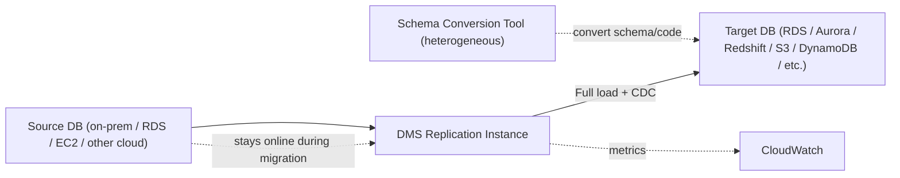

# AWS Database Migration Service (DMS) - Intro bits & bytes

> DMS migrates and **replicates databases** into AWS (or between databases) while the **source stays online**. It handles **homogeneous** (same engine, e.g., Oracle→Oracle) and **heterogeneous** (different engine, e.g., Oracle→Aurora PostgreSQL) migrations - the latter with the **Schema Conversion Tool (SCT)**. On the exam it's the answer to _"migrate a database to AWS with minimal downtime"_ and _"continuously replicate data between databases."_

See also: [02 - AWS DMS Deep Dive](02%20-%20AWS%20DMS%20Deep%20Dive.md) · [03 - AWS DMS Exam Scenarios](03%20-%20AWS%20DMS%20Exam%20Scenarios.md) · [04 - AWS DMS SRE Operations](04%20-%20AWS%20DMS%20SRE%20Operations.md) · [01 - AWS Application Migration Service Intro bits & bytes](01%20-%20AWS%20Application%20Migration%20Service%20Intro%20bits%20%26%20bytes.md) · [00 - Migration & Transfer Overview](00%20-%20Migration%20%26%20Transfer%20Overview.md)

---

## Table of Contents

- [1. The Problem It Solves](#1-the-problem-it-solves)
- [2. Core Concepts: Replication Instance, Endpoints, Tasks](#2-core-concepts-replication-instance-endpoints-tasks)
- [3. Full Load + CDC (Change Data Capture)](#3-full-load--cdc-change-data-capture)
- [4. Homogeneous vs Heterogeneous (and SCT)](#4-homogeneous-vs-heterogeneous-and-sct)
- [5. When To Use It / When NOT To Use It](#5-when-to-use-it--when-not-to-use-it)
- [6. DMS vs MGN vs DataSync vs Native Dump](#6-dms-vs-mgn-vs-datasync-vs-native-dump)
- [7. Cost Model](#7-cost-model)
- [8. Mini-Quiz](#8-mini-quiz)

---

---

## 1. The Problem It Solves

Migrating a production database is risky: you can't take it offline for hours, schemas may not match the target engine, and you often need to **keep replicating** until the moment you switch over. DMS provides a managed **replication instance** that:

- Performs a **full load** of existing data, then **continuously replicates ongoing changes (CDC)** so the source stays live.
- Supports **many source/target engines** (Oracle, SQL Server, MySQL, PostgreSQL, MariaDB, MongoDB, Aurora, Redshift, S3, DynamoDB, Kinesis, and more).
- With **SCT**, converts schema and code (stored procs, views) when migrating **across engines**.

> Mental model: DMS is a **managed pipe between two databases** that loads + keeps them in sync, so you cut over with **minimal downtime**. **SCT** is the separate tool that **rewrites the schema/code** when the engines differ.

[⬆ Back to top](#table-of-contents)

---

## 2. Core Concepts: Replication Instance, Endpoints, Tasks

| Concept                  | What it is                                                                                                                                                |
| :----------------------- | :-------------------------------------------------------------------------------------------------------------------------------------------------------- |
| **Replication Instance** | The managed EC2-backed compute that runs the migration (sized by class; can be **Multi-AZ** for resilience). DMS **Serverless** auto-scales this for you. |
| **Endpoints**            | Connection definitions for the **source** and **target** databases (host, credentials, engine, SSL).                                                      |
| **Replication Task**     | The job tying source→target with a **migration type** (full load, full load + CDC, or CDC only), **table mappings**, and **transformation rules**.        |
| **Table mappings**       | Select/filter/rename schemas, tables, columns during migration.                                                                                           |
| **Transformations**      | Rename, change case, add prefixes, drop columns, etc., in flight.                                                                                         |

[⬆ Back to top](#table-of-contents)

---

## 3. Full Load + CDC (Change Data Capture)

The three **migration types**:

| Type                | What it does                                     | Use                                             |
| :------------------ | :----------------------------------------------- | :---------------------------------------------- |
| **Full load**       | Copies existing data once                        | One-time migration with a downtime window       |
| **Full load + CDC** | Full copy, then **continuously applies changes** | **Minimal-downtime** migration (most common)    |
| **CDC only**        | Just ongoing changes                             | Ongoing replication / keeping a replica in sync |

- **CDC** reads the source's transaction logs to capture inserts/updates/deletes and apply them to the target.
- You cut over when the target has caught up (CDC lag ≈ 0), then repoint the app.

[⬆ Back to top](#table-of-contents)

---

## 4. Homogeneous vs Heterogeneous (and SCT)

|         | **Homogeneous**                   | **Heterogeneous**                                     |
| :------ | :-------------------------------- | :---------------------------------------------------- |
| Example | Oracle→Oracle, MySQL→Aurora MySQL | Oracle→Aurora PostgreSQL, SQL Server→MySQL            |
| Schema  | Compatible - DMS handles directly | Must be **converted** first                           |
| Tool    | DMS alone                         | **SCT** (or **DMS Schema Conversion**) + DMS for data |

- **SCT (Schema Conversion Tool)** converts schema objects and **application/stored-procedure code**; it flags items needing manual rework via an **assessment report**.
- DMS then moves the **data**; SCT handles the **structure/code**.

> Exam cue: **"different database engine" → SCT (schema/code) + DMS (data). "same engine" → DMS alone.**

[⬆ Back to top](#table-of-contents)

---

## 5. When To Use It / When NOT To Use It

**Use it when:**

- Migrating a **database** to AWS with **minimal downtime** (full load + CDC).
- **Changing engines** (heterogeneous) - pair with **SCT**.
- **Continuous replication** between databases (DR, read scaling, consolidation, analytics feed to Redshift/S3).

**Don't use it when:**

- You're moving **whole servers** → **MGN**.
- You're moving **files/objects** → **DataSync**.
- A tiny DB with an acceptable downtime window - a **native dump/restore** may be simpler.
- You need **offline bulk** because the network can't carry it - combine with **Snow** for the initial load, then CDC online.

[⬆ Back to top](#table-of-contents)

---

## 6. DMS vs MGN vs DataSync vs Native Dump

|               | **DMS**        | **MGN**     | **DataSync**  | **Native dump** |
| :------------ | :------------- | :---------- | :------------ | :-------------- |
| Moves         | **Databases**  | Servers→EC2 | Files/objects | DB (manual)     |
| Downtime      | Minimal (CDC)  | Minimal     | N/A           | Often higher    |
| Engine change | **Yes (+SCT)** | No          | No            | No              |
| Managed       | Yes            | Yes         | Yes           | No              |

> Trap: MGN _could_ replicate a DB server's disks, but the **managed database migration** answer (especially heterogeneous/minimal-downtime) is **DMS**.

[⬆ Back to top](#table-of-contents)

---

## 7. Cost Model

- You pay for the **replication instance** (per hour by class, or **DMS Serverless** capacity units) for the duration of the migration/replication.
- **Multi-AZ** roughly doubles instance cost (for resilience).
- Plus storage on the instance, **data transfer** (cross-region/egress), and target DB costs.
- **SCT is free** (you run it yourself).

> Cost lever: right-size the replication instance, run migrations promptly, and **decommission** the instance after cutover (or use Serverless to avoid idle cost).

[⬆ Back to top](#table-of-contents)

---

## 8. Mini-Quiz

**Q1:** Migrate on-prem Oracle to Aurora PostgreSQL with minimal downtime. Services?
_A:_ **SCT** to convert schema/code + **DMS** (full load + CDC) for the data.

**Q2:** Same-engine MySQL→Aurora MySQL?
_A:_ **DMS alone** (homogeneous, no SCT needed).

**Q3:** What keeps downtime minimal during migration?
_A:_ **CDC** continuously applies source changes until cutover.

**Q4:** Three DMS migration types?
_A:_ **Full load**, **full load + CDC**, **CDC only**.

**Q5:** Make the migration resilient to an AZ failure?
_A:_ Use a **Multi-AZ replication instance**.

---

> Continue to [02 - AWS DMS Deep Dive](02%20-%20AWS%20DMS%20Deep%20Dive.md).
