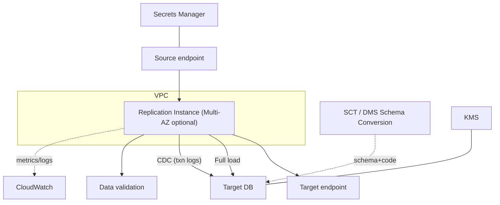

# AWS Database Migration Service (DMS) - Deep Dive

> Architecture of replication instance/endpoints/tasks, full-load + CDC internals, SCT & DMS Schema Conversion, supported engines & target types, DMS Serverless, Multi-AZ resilience, LOB handling, validation, security, monitoring, limits, integrations, comparisons, and best practices.

See also: [01 - AWS DMS Intro bits & bytes](01%20-%20AWS%20DMS%20Intro%20bits%20%26%20bytes.md) · [03 - AWS DMS Exam Scenarios](03%20-%20AWS%20DMS%20Exam%20Scenarios.md) · [04 - AWS DMS SRE Operations](04%20-%20AWS%20DMS%20SRE%20Operations.md) · [00 - Migration & Transfer Overview](00%20-%20Migration%20%26%20Transfer%20Overview.md)

---

## Table of Contents

- [1. Architecture & Components](#1-architecture--components)
- [2. Full Load and CDC Internals](#2-full-load-and-cdc-internals)
- [3. SCT and DMS Schema Conversion](#3-sct-and-dms-schema-conversion)
- [4. Sources, Targets & Special Targets (S3/Redshift/Kinesis/DynamoDB)](#4-sources-targets--special-targets-s3redshiftkinesisdynamodb)
- [5. DMS Serverless & Multi-AZ](#5-dms-serverless--multi-az)
- [6. Data Validation, LOBs & Transformations](#6-data-validation-lobs--transformations)
- [7. Security: Networking, KMS, IAM, Secrets](#7-security-networking-kms-iam-secrets)
- [8. Monitoring & Observability](#8-monitoring--observability)
- [9. Limits & Quotas](#9-limits--quotas)
- [10. Integration Matrix & Comparisons](#10-integration-matrix--comparisons)
- [11. Best Practices by Pillar](#11-best-practices-by-pillar)

---

---

## 1. Architecture & Components

- The **replication instance** lives in your **VPC**, connects to **source** and **target** endpoints, and runs one or more **tasks**.
- **Endpoints** hold connection + engine + SSL settings; credentials can come from **Secrets Manager**.
- A **task** defines migration type, **table mappings** (selection/filtering), **transformations**, LOB settings, and validation.
- The instance must reach both databases (network routes, security groups); sources can be on-prem (via DX/VPN), in RDS/EC2, or other clouds.

[⬆ Back to top](#table-of-contents)

---

## 2. Full Load and CDC Internals

- **Full load**: DMS reads source tables (parallel threads) and bulk-inserts into the target; indexes/constraints often applied after for speed.
- **CDC**: DMS reads the **transaction logs** (Oracle redo, MySQL binlog, PostgreSQL WAL/logical replication, SQL Server transaction log) and applies changes to the target in near-real-time.
- **Cutover**: when **CDC latency** ≈ 0, stop the app on the source, let DMS drain, then repoint the app to the target.
- Source prerequisites matter: e.g., enable **binlog/logical replication/supplemental logging** so CDC can read changes.

[⬆ Back to top](#table-of-contents)

---

## 3. SCT and DMS Schema Conversion

- **AWS Schema Conversion Tool (SCT)** is a downloadable app (also now offered as **DMS Schema Conversion** in the console) that:
  - Converts **schema objects** (tables, indexes, views) to the target engine.
  - Converts **code** (stored procedures, functions, triggers) where possible.
  - Produces an **assessment report** rating conversion complexity and flagging manual work.
- For data warehouses, SCT can also help migrate to **Redshift**; it can use **data extraction agents** for large/legacy sources.
- Workflow: **SCT converts structure/code → DMS migrates data (full load + CDC).**

[⬆ Back to top](#table-of-contents)

---

## 4. Sources, Targets & Special Targets (S3/Redshift/Kinesis/DynamoDB)

| Category                       | Examples                                                             |
| :----------------------------- | :------------------------------------------------------------------- |
| **Relational sources/targets** | Oracle, SQL Server, MySQL, MariaDB, PostgreSQL, Aurora, Db2          |
| **NoSQL**                      | MongoDB (source), **DynamoDB** (target)                              |
| **Analytics targets**          | **Redshift**, **S3** (e.g., Parquet for a data lake), **OpenSearch** |
| **Streaming targets**          | **Kinesis Data Streams**, **MSK (Kafka)**                            |

> Exam-relevant: DMS isn't only DB→DB. It can land data in **S3 (data lake)**, **Redshift (analytics)**, **Kinesis/Kafka (streaming)**, and **DynamoDB** - a common way to feed analytics/event pipelines from operational databases.

[⬆ Back to top](#table-of-contents)

---

## 5. DMS Serverless & Multi-AZ

- **DMS Serverless** automatically **provisions and scales** replication capacity (DCUs) based on load - no instance sizing/management; good for variable or unknown workloads.
- **Multi-AZ replication instance** runs a standby in another AZ with synchronous replication and **automatic failover** - use for long-running/production replication that must survive an AZ outage.
- Single-AZ is fine for short one-time migrations where a restart is acceptable.

[⬆ Back to top](#table-of-contents)

---

## 6. Data Validation, LOBs & Transformations

- **Data validation**: DMS can compare source and target row-by-row and report mismatches - essential for confidence before cutover.
- **LOB handling**: large objects (BLOB/CLOB) are migrated in **full LOB**, **limited LOB** (faster, truncates beyond a size), or **inline** modes - a key performance/correctness tuning point.
- **Transformations/table mappings**: rename schemas/tables/columns, filter rows, change case, exclude objects - applied in flight.

[⬆ Back to top](#table-of-contents)

---

## 7. Security: Networking, KMS, IAM, Secrets

| Control                   | Detail                                                                                     |
| :------------------------ | :----------------------------------------------------------------------------------------- |
| **Networking**            | Replication instance in a private subnet; reach source via **DX/VPN**; SGs allow DB ports. |
| **Encryption in transit** | **SSL/TLS** to endpoints.                                                                  |
| **Encryption at rest**    | Target storage + instance storage encrypted with **KMS**.                                  |
| **Credentials**           | Store DB credentials in **Secrets Manager**; reference from endpoints.                     |
| **IAM**                   | Least-privilege roles for DMS to access targets (S3/Redshift/Kinesis/DynamoDB) and KMS.    |

[⬆ Back to top](#table-of-contents)

---

## 8. Monitoring & Observability

- **CloudWatch metrics**: `FullLoadThroughputRowsTarget`, `CDCLatencySource/Target`, `CDCIncomingChanges`, freeable memory/CPU on the instance.
- **Task logs** to CloudWatch Logs (per-table, per-error detail).
- **Table statistics**: rows loaded/inserted/updated/deleted/validated/errored per table.
- Alarm on **CDC latency** (cutover readiness) and **task failures/errors**.

[⬆ Back to top](#table-of-contents)

---

## 9. Limits & Quotas

| Limit                             | Default (typical)      | Notes                                  |
| :-------------------------------- | :--------------------- | :------------------------------------- |
| Replication instances per account | Soft                   | Request increases                      |
| Tasks per instance                | Depends on class/load  | Heavy tasks need bigger instances      |
| Instance storage                  | Sized at creation      | Holds logs/cache during migration      |
| Supported engines/versions        | Broad matrix           | Check supported source/target versions |
| Concurrent full-load tables       | Configurable (e.g., 8) | Tune for throughput vs source load     |

[⬆ Back to top](#table-of-contents)

---

## 10. Integration Matrix & Comparisons

| Service                        | Integration                            |
| :----------------------------- | :------------------------------------- |
| **RDS / Aurora**               | Common targets (and sources)           |
| **Redshift / S3 / OpenSearch** | Analytics/data-lake targets            |
| **Kinesis / MSK**              | Streaming targets (CDC events)         |
| **DynamoDB**                   | NoSQL target                           |
| **Secrets Manager**            | Endpoint credentials                   |
| **KMS**                        | At-rest encryption                     |
| **Direct Connect / VPN**       | Reach on-prem sources privately        |
| **CloudWatch**                 | Metrics/logs/alarms                    |
| **SCT**                        | Schema/code conversion (heterogeneous) |

### DMS vs MGN

|               | DMS                      | MGN            |
| :------------ | :----------------------- | :------------- |
| Unit          | Database                 | Whole server   |
| Engine change | Yes (+SCT)               | No             |
| Use           | DB migration/replication | Rehost servers |

[⬆ Back to top](#table-of-contents)

---

## 11. Best Practices by Pillar

**Security** - private networking (DX/VPN), SSL endpoints, Secrets Manager credentials, KMS at rest, least-privilege target roles.

**Reliability** - **Multi-AZ** for long-running replication; enable **data validation**; monitor CDC latency; test cutover and rollback.

**Performance Efficiency** - right-size instance; tune **parallel full-load** tables and **LOB mode**; ensure source logging (binlog/WAL/supplemental) is enabled; consider **Serverless** for variable load.

**Cost Optimization** - right-size/Serverless; decommission after cutover; minimise cross-region transfer; SCT is free.

**Operational Excellence** - run an **SCT assessment** first for heterogeneous; use table statistics + task logs; IaC endpoints/tasks; migrate in phases.

[⬆ Back to top](#table-of-contents)

---

> Continue to [03 - AWS DMS Exam Scenarios](03%20-%20AWS%20DMS%20Exam%20Scenarios.md).
