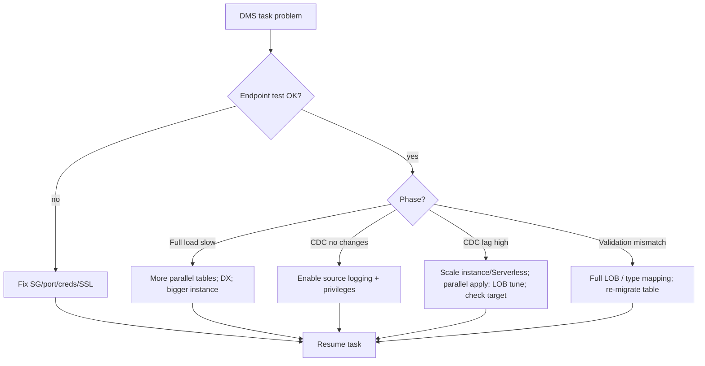

# AWS Database Migration Service (DMS) - SRE Operations

> Operational reality: where tasks fail and CDC lags, troubleshooting workflow, what to monitor/alarm, runbooks (migrate, cutover, rollback), real CLI examples, production patterns, and cost operations.

See also: [01 - AWS DMS Intro bits & bytes](01%20-%20AWS%20DMS%20Intro%20bits%20%26%20bytes.md) · [02 - AWS DMS Deep Dive](02%20-%20AWS%20DMS%20Deep%20Dive.md) · [03 - AWS DMS Exam Scenarios](03%20-%20AWS%20DMS%20Exam%20Scenarios.md) · [00 - Migration & Transfer Overview](00%20-%20Migration%20%26%20Transfer%20Overview.md)

---

## Table of Contents

- [1. Common Errors (Symptom → Root Cause → Fix → Prevention)](#1-common-errors-symptom--root-cause--fix--prevention)
- [2. Troubleshooting Workflow](#2-troubleshooting-workflow)
- [3. What to Monitor and Alarm On](#3-what-to-monitor-and-alarm-on)
- [4. Runbooks](#4-runbooks)
- [5. Real Examples](#5-real-examples)
- [6. Production Patterns by Scale](#6-production-patterns-by-scale)
- [7. Cost Operations](#7-cost-operations)
- [8. Cutover Readiness Checklist](#8-cutover-readiness-checklist)

---

## 1. Common Errors (Symptom → Root Cause → Fix → Prevention)

### Endpoint connection test fails

- **Cause:** Network/SG blocks DB port, wrong credentials, SSL mismatch.
- **Fix:** Open the DB port to the replication instance SG; verify Secrets Manager creds; align SSL mode.
- **Prevention:** Run `test-connection` before creating tasks; use Secrets Manager.

### CDC not capturing changes

- **Cause:** Source logging not enabled (MySQL binlog, PostgreSQL logical replication/`wal_level`, Oracle supplemental logging), insufficient privileges.
- **Fix:** Enable required logging; grant CDC privileges to the DMS user.
- **Prevention:** Complete CDC prerequisites checklist per engine first.

### CDC latency climbing

- **Cause:** Undersized instance, heavy write load, slow target, large LOBs, single-threaded apply.
- **Fix:** Scale instance / Serverless; enable parallel apply; tune LOB mode; check target write capacity.
- **Prevention:** Load-test; right-size; monitor `CDCLatencyTarget`.

### Full load slow

- **Cause:** Too few parallel tables, source contention, network limits.
- **Fix:** Increase parallel full-load tables; schedule off-peak; use DX.
- **Prevention:** Tune `MaxFullLoadSubTasks`; size the instance.

### Data validation mismatches

- **Cause:** LOB truncation (limited LOB), unsupported data types, transformations.
- **Fix:** Switch to full LOB for affected tables; handle type mappings; re-migrate.
- **Prevention:** Enable validation; review type mappings before full run.

### Task fails / out of storage on instance

- **Cause:** Instance storage filled with logs/cache.
- **Fix:** Increase instance storage; reduce logging verbosity.
- **Prevention:** Size storage for the workload; monitor freeable storage.

[⬆ Back to top](#table-of-contents)

---

## 2. Troubleshooting Workflow



[⬆ Back to top](#table-of-contents)

---

## 3. What to Monitor and Alarm On

| Signal                                               | Why                           |
| :--------------------------------------------------- | :---------------------------- |
| `CDCLatencySource` / `CDCLatencyTarget`              | Cutover readiness; lag = risk |
| `FullLoadThroughputRowsTarget`                       | Full-load progress            |
| Task **state** (error/stopped)                       | Pipeline health               |
| **Validation** failures per table                    | Data correctness              |
| Instance **CPU / FreeableMemory / FreeStorageSpace** | Capacity                      |
| `CDCIncomingChanges` backlog                         | Source change pressure        |

[⬆ Back to top](#table-of-contents)

---

## 4. Runbooks

### Runbook: heterogeneous migration (Oracle → Aurora PostgreSQL)

1. Run **SCT** → convert schema/code; review **assessment report**; apply schema + manual fixes to target.
2. Enable source **supplemental logging**; create DMS user with privileges.
3. Create replication instance (**Multi-AZ** for long runs), source/target **endpoints** (Secrets Manager + SSL); `test-connection`.
4. Create **full load + CDC** task with table mappings, LOB mode, **validation** on.
5. Run; monitor full-load throughput, then **CDC latency**.
6. At CDC≈0, **cutover** (stop writes on source, drain, repoint app).
7. Validate; decommission the instance.

### Runbook: cutover

1. Confirm CDC latency ≈ 0 and validation clean.
2. Freeze writes on source; let DMS drain remaining changes.
3. Repoint application/DNS to the target.
4. Smoke test; keep source read-only as rollback for a window.

### Runbook: CDC latency incident

1. Check `CDCLatencyTarget` + instance metrics.
2. Scale instance / enable parallel apply / tune LOB.
3. Verify target write capacity isn't the bottleneck.
4. Confirm latency recovers before cutover.

[⬆ Back to top](#table-of-contents)

---

## 5. Real Examples

### Test an endpoint

```bash
aws dms test-connection \
  --replication-instance-arn arn:aws:dms:ap-south-1:111111111111:rep:ABC \
  --endpoint-arn arn:aws:dms:ap-south-1:111111111111:endpoint:SRC
```

### Create a full-load + CDC task with validation

```bash
aws dms create-replication-task \
  --replication-task-identifier oracle-to-aurora \
  --source-endpoint-arn arn:aws:dms:...:endpoint:SRC \
  --target-endpoint-arn arn:aws:dms:...:endpoint:TGT \
  --replication-instance-arn arn:aws:dms:...:rep:ABC \
  --migration-type full-load-and-cdc \
  --table-mappings file://table-mappings.json \
  --replication-task-settings '{"ValidationSettings":{"EnableValidation":true},"TargetMetadata":{"LobMaxSize":64}}'
```

### Table mappings (selection + transformation)

```json
{
  "rules": [
    {
      "rule-type": "selection",
      "rule-id": "1",
      "rule-name": "sel",
      "object-locator": { "schema-name": "HR", "table-name": "%" },
      "rule-action": "include"
    },
    {
      "rule-type": "transformation",
      "rule-id": "2",
      "rule-name": "lc",
      "rule-target": "schema",
      "object-locator": { "schema-name": "HR" },
      "rule-action": "convert-lowercase"
    }
  ]
}
```

### Start and monitor

```bash
aws dms start-replication-task --replication-task-arn <arn> --start-replication-task-type start-replication
aws dms describe-table-statistics --replication-task-arn <arn>
```

[⬆ Back to top](#table-of-contents)

---

## 6. Production Patterns by Scale

| Context                   | Pattern                                                              |
| :------------------------ | :------------------------------------------------------------------- |
| **Small one-time**        | Single-AZ instance, full load (+CDC), validate, decommission.        |
| **Minimal-downtime prod** | Multi-AZ, full load + CDC, validation, monitored cutover + rollback. |
| **Heterogeneous**         | SCT first (assessment + conversion), then DMS data migration.        |
| **Analytics/streaming**   | DMS CDC → S3/Redshift/Kinesis; continuous.                           |
| **Variable/unknown load** | DMS **Serverless**.                                                  |
| **Offline-seed hybrid**   | Snow/DataSync initial load + DMS CDC catch-up.                       |

[⬆ Back to top](#table-of-contents)

---

## 7. Cost Operations

- **Decommission** the replication instance after cutover - idle instances bill continuously.
- Use **Serverless** for intermittent/variable replication to avoid idle cost.
- **Right-size** the instance class to the workload; Multi-AZ only where resilience is required.
- Minimise **cross-region** transfer; keep replication near source/target.
- Reduce **log verbosity** once stable to save storage.

[⬆ Back to top](#table-of-contents)

---

## 8. Cutover Readiness Checklist

- ✅ Schema converted/applied (SCT) for heterogeneous.
- ✅ Full load complete; **CDC latency ≈ 0**.
- ✅ **Data validation** clean (no unexpected mismatches).
- ✅ Source logging/privileges verified.
- ✅ Target sized for production write load.
- ✅ **Rollback** plan (source read-only window).
- ✅ App repoint + DNS plan; smoke tests ready.

[⬆ Back to top](#table-of-contents)

---

Related: [01 - AWS DMS Intro bits & bytes](01%20-%20AWS%20DMS%20Intro%20bits%20%26%20bytes.md) · [02 - AWS DMS Deep Dive](02%20-%20AWS%20DMS%20Deep%20Dive.md) · [03 - AWS DMS Exam Scenarios](03%20-%20AWS%20DMS%20Exam%20Scenarios.md) · [01 - AWS Application Migration Service Intro bits & bytes](01%20-%20AWS%20Application%20Migration%20Service%20Intro%20bits%20%26%20bytes.md) · [00 - Migration & Transfer Overview](00%20-%20Migration%20%26%20Transfer%20Overview.md)
