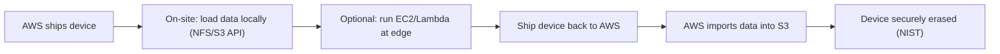

# AWS Snow Family - Intro bits & bytes

> The Snow Family is AWS's **offline / edge data-transfer and edge-compute** hardware: ruggedised physical devices AWS ships to you so you can **load data locally and mail it back** when moving it over the network would take too long - and optionally **run compute (EC2/Lambda) at the edge** in disconnected or harsh environments. On the exam it's the answer to _"petabytes to move,"_ _"network too slow/expensive,"_ and _"edge location with no/poor connectivity."_

See also: [02 - AWS Snow Family Deep Dive](02%20-%20AWS%20Snow%20Family%20Deep%20Dive.md) · [03 - AWS Snow Family Exam Scenarios](03%20-%20AWS%20Snow%20Family%20Exam%20Scenarios.md) · [04 - AWS Snow Family SRE Operations](04%20-%20AWS%20Snow%20Family%20SRE%20Operations.md) · [01 - AWS DataSync Intro bits & bytes](01%20-%20AWS%20DataSync%20Intro%20bits%20%26%20bytes.md) · [00 - Migration & Transfer Overview](00%20-%20Migration%20%26%20Transfer%20Overview.md)

---

## Table of Contents

- [1. The Problem It Solves](#1-the-problem-it-solves)
- [2. The Devices (Know These for the Exam)](#2-the-devices-know-these-for-the-exam)
- [3. The End-to-End Workflow](#3-the-end-to-end-workflow)
- [4. Edge Compute Capability](#4-edge-compute-capability)
- [5. When To Use It / When NOT To Use It](#5-when-to-use-it--when-not-to-use-it)
- [6. Snow vs DataSync vs Direct Connect (the "how fast" decision)](#6-snow-vs-datasync-vs-direct-connect-the-how-fast-decision)
- [7. Cost & Security Model](#7-cost--security-model)
- [8. Mini-Quiz](#8-mini-quiz)

---

---

## 1. The Problem It Solves

Moving **very large** datasets over the internet can be impractical: a 100 TB transfer over a busy 100 Mbps link takes **months**, costs egress, and competes with production traffic. And some sites - ships, factories, military, remote sensors - have **little or no connectivity** but still generate data and need compute.

Snow Family solves both:

- **Offline bulk transfer**: AWS ships a secure device; you copy data to it locally at LAN speed; you ship it back; AWS imports it into **S3**.
- **Edge compute**: run **EC2 instances and Lambda** on the device where it's deployed, processing data locally before (or instead of) sending it to AWS.

> Mental model: when the **physics of the network** beats the **logistics of shipping a box**, ship the box. Snow = **"sneakernet for petabytes," plus a rugged edge computer.**

[⬆ Back to top](#table-of-contents)

---

## 2. The Devices (Know These for the Exam)

> AWS has refreshed the lineup over time; for SAA-C03 know the **roles and rough capacities** more than exact specs. Snowmobile (the truck) has been **discontinued**, but may still appear in older questions as the exabyte option.

| Device                                | Capacity (approx)      | Role                                                                                       |
| :------------------------------------ | :--------------------- | :----------------------------------------------------------------------------------------- |
| **Snowcone** (incl. SSD)              | ~8-14 TB usable        | Smallest, **portable, rugged**; edge compute; can use **DataSync** to ship data online too |
| **Snowball Edge - Storage Optimized** | ~80 TB usable          | **Bulk data transfer** workhorse                                                           |
| **Snowball Edge - Compute Optimized** | ~40+ TB, more vCPU/GPU | **Edge compute** (EC2/Lambda), optional GPU for ML/inference                               |
| **Snowmobile** (legacy/discontinued)  | up to ~100 PB          | Exabyte-scale via a shipping-container truck (historical)                                  |

> Exam shortcut: **small/portable/edge → Snowcone; tens of TB bulk → Snowball Edge Storage Optimized; edge processing/ML → Snowball Edge Compute Optimized; exabytes (old questions) → Snowmobile.**

[⬆ Back to top](#table-of-contents)

---

## 3. The End-to-End Workflow

1. **Order** the device from the console (choose import or export job, region, S3 buckets).
2. AWS **ships** the tamper-resistant device with an **E Ink shipping label**.
3. On-site, connect it, unlock with credentials, and **copy data** via the **S3-compatible endpoint** or **NFS** mount (Snow client / SDK).
4. (Optional) **run EC2/Lambda** on the device for local processing.
5. **Ship it back** (the E Ink label auto-updates the return address).
6. AWS **imports** the data into **S3** (or, for export jobs, you received data from S3).
7. The device is **securely erased** (NIST media sanitisation).

[⬆ Back to top](#table-of-contents)

---

## 4. Edge Compute Capability

- Snowball Edge **Compute Optimized** and **Snowcone** can run **EC2 AMIs and AWS Lambda** locally - useful where connectivity is poor or latency to the cloud is unacceptable.
- Use cases: **on-site ML inference**, data **pre-processing/filtering** before transfer, IoT aggregation, tactical/remote operations.
- A device can form part of a **cluster** (multiple Snowball Edge units) for more capacity/durability at the edge.
- **DataSync agent** can run on Snowcone to transfer data **online** when connectivity returns.

[⬆ Back to top](#table-of-contents)

---

## 5. When To Use It / When NOT To Use It

**Use it when:**

- **Petabyte/large** transfers where online would take **weeks/months**.
- **Limited/no network** at the source (remote, mobile, secure sites).
- **Edge compute** needed in disconnected/harsh environments.
- One-time **migration** of huge archives to S3.

**Don't use it when:**

- The network can move the data in a **reasonable time** → **DataSync** (online) or **Direct Connect**.
- You need **ongoing/continuous** sync → **DataSync** (or Storage Gateway).
- You're migrating **servers** (→ MGN) or **databases** (→ DMS) specifically (though Snow can _seed_ a DMS load).

[⬆ Back to top](#table-of-contents)

---

## 6. Snow vs DataSync vs Direct Connect (the "how fast" decision)

| Option             | Transport               | Best when                                                      |
| :----------------- | :---------------------- | :------------------------------------------------------------- |
| **DataSync**       | Online (managed)        | Link is adequate; ongoing/scheduled sync                       |
| **Direct Connect** | Online (dedicated link) | Sustained high-volume + low-latency hybrid                     |
| **Snow Family**    | **Offline** (ship)      | Volume too large for the link in time, or poor/no connectivity |

> Decision rule: estimate **time = data ÷ usable bandwidth**. If that's **weeks/months**, choose **Snow**. A 100 TB over ~100 Mbps ≈ months → Snow; the same over a 10 Gbps DX ≈ a day → online.

[⬆ Back to top](#table-of-contents)

---

## 7. Cost & Security Model

**Cost:**

- **Per-device usage fee** (per job) plus **per-day** charges beyond the included on-site days, plus **shipping**.
- No internet **egress** for the data movement itself (a big saver at scale); standard **S3 storage** applies after import.

**Security:**

- Data **encrypted with KMS** (256-bit); keys are **not stored on the device**.
- **Tamper-resistant/evident** enclosure; **TPM**; unlock requires credentials/manifest + unlock code.
- **NIST-compliant erase** after import.

[⬆ Back to top](#table-of-contents)

---

## 8. Mini-Quiz

**Q1:** 600 TB to migrate to S3; the site has a 200 Mbps link. Best option?
_A:_ **Snowball Edge (Storage Optimized)** - online would take far too long.

**Q2:** A remote oil rig needs local ML inference with no reliable internet. Device?
_A:_ **Snowball Edge Compute Optimized** (edge EC2/Lambda, optional GPU).

**Q3:** Small, portable, rugged edge device that can also use DataSync online?
_A:_ **Snowcone**.

**Q4:** How is data protected on the device?
_A:_ **KMS encryption** (keys not on device), tamper-evident hardware, **NIST erase** after import.

**Q5:** You have a fast 10 Gbps Direct Connect and 50 TB. Snow?
_A:_ **No** - online via DataSync/DX is faster than shipping.

---

> Continue to [02 - AWS Snow Family Deep Dive](02%20-%20AWS%20Snow%20Family%20Deep%20Dive.md).
