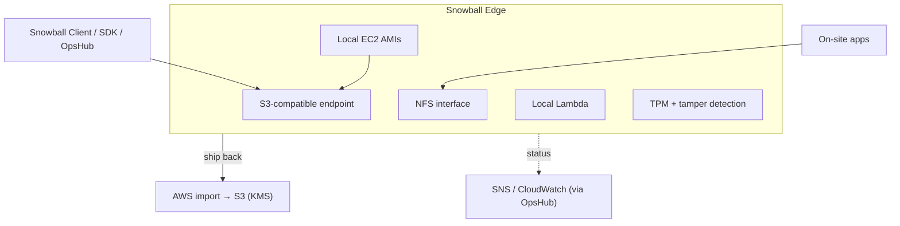

# AWS Snow Family - Deep Dive

> Device internals, import/export jobs, local endpoints (S3 API/NFS), edge compute (EC2/Lambda/clusters), data transfer mechanics & validation, security (KMS, TPM, tamper, NIST erase), networking, monitoring (SNS/OpsHub), limits, integrations, comparisons, and best practices.

See also: [01 - AWS Snow Family Intro bits & bytes](01%20-%20AWS%20Snow%20Family%20Intro%20bits%20%26%20bytes.md) · [03 - AWS Snow Family Exam Scenarios](03%20-%20AWS%20Snow%20Family%20Exam%20Scenarios.md) · [04 - AWS Snow Family SRE Operations](04%20-%20AWS%20Snow%20Family%20SRE%20Operations.md) · [00 - Migration & Transfer Overview](00%20-%20Migration%20%26%20Transfer%20Overview.md)

---

## Table of Contents

- [1. Device Architecture & Local Endpoints](#1-device-architecture--local-endpoints)
- [2. Import vs Export Jobs](#2-import-vs-export-jobs)
- [3. Data Transfer Mechanics & Validation](#3-data-transfer-mechanics--validation)
- [4. Edge Compute: EC2, Lambda, Clusters](#4-edge-compute-ec2-lambda-clusters)
- [5. Security: KMS, TPM, Tamper, NIST Erase](#5-security-kms-tpm-tamper-nist-erase)
- [6. Networking & Management (OpsHub, Snowball Client)](#6-networking--management-opshub-snowball-client)
- [7. Monitoring & Notifications](#7-monitoring--notifications)
- [8. Limits & Quotas](#8-limits--quotas)
- [9. Integration Matrix](#9-integration-matrix)
- [10. Comparisons](#10-comparisons)
- [11. Best Practices by Pillar](#11-best-practices-by-pillar)

---

---

## 1. Device Architecture & Local Endpoints

- Each device exposes a **local S3-compatible endpoint** and (on supported models) an **NFS** interface, so apps/tools write to it as if it were S3 or a file share - at **LAN speed**.
- Data is **encrypted on the device** with **KMS-managed keys** that are **never stored on the device**.
- Devices are **ruggedised** (shock/dust/water resistant), with an **E Ink** shipping label and built-in networking (10/25/40/100 GbE depending on model).
- **OpsHub** is a GUI app to set up, manage, and monitor devices without scripting.

[⬆ Back to top](#table-of-contents)

---

## 2. Import vs Export Jobs

| Job type                 | Direction                      | Use                                                         |
| :----------------------- | :----------------------------- | :---------------------------------------------------------- |
| **Import into S3**       | On-prem data → device → **S3** | Migrations, archive ingest (most common)                    |
| **Export from S3**       | **S3** → device → on-prem      | Distribute large datasets to disconnected sites, DR restore |
| **Local compute / edge** | Data stays/processed on device | Edge processing, optional later import                      |

- You order jobs per **region** and target **bucket(s)**; large migrations may use **many devices** (or a cluster) in parallel.

[⬆ Back to top](#table-of-contents)

---

## 3. Data Transfer Mechanics & Validation

- Copy data using the **Snowball Client** (`snowball cp`), the **S3 adapter/SDK**, or by mounting **NFS**.
- The client and AWS perform **checksums** to validate integrity end to end; on import, AWS verifies before writing to S3.
- **Parallelise** copies (multiple threads/instances) to saturate the device's network for fast local loading.
- For lots of small files, consider **tar/aggregate** to improve throughput.

[⬆ Back to top](#table-of-contents)

---

## 4. Edge Compute: EC2, Lambda, Clusters

- **Compute Optimized** Snowball Edge runs **EC2 AMIs** (you bring compatible AMIs) and **Lambda** functions locally; optional **GPU** for ML/inference.
- **Snowcone** runs smaller EC2/Lambda workloads; ideal for space/power-constrained edge.
- **Clusters** (multiple Snowball Edge units) provide **higher capacity and local durability** (data spread across nodes) for edge storage/compute.
- **IoT Greengrass** can run on devices for edge IoT scenarios.

[⬆ Back to top](#table-of-contents)

---

## 5. Security: KMS, TPM, Tamper, NIST Erase

| Control            | Detail                                                                         |
| :----------------- | :----------------------------------------------------------------------------- |
| **Encryption**     | All data encrypted (256-bit) with **KMS** keys; keys **not** on the device.    |
| **Unlock**         | Requires the **manifest + unlock code** (kept separate) to operate the device. |
| **TPM**            | Trusted Platform Module ensures device integrity.                              |
| **Tamper-evident** | Physical tamper detection; chain-of-custody.                                   |
| **Sanitisation**   | **NIST 800-88** compliant erase after the job completes.                       |
| **Compliance**     | Helps meet data-residency/handling requirements (data physically controlled).  |

[⬆ Back to top](#table-of-contents)

---

## 6. Networking & Management (OpsHub, Snowball Client)

- **AWS OpsHub** - GUI to unlock, configure interfaces, launch EC2/Lambda, monitor, and manage transfers.
- **Snowball Client / S3 adapter** - CLI/SDK for scripted copies.
- Network: connect via high-speed Ethernet to the local network; configure static/DHCP; isolate on a transfer VLAN.
- For **online** transfer from Snowcone, run a **DataSync agent** on the device when connectivity is available.

[⬆ Back to top](#table-of-contents)

---

## 7. Monitoring & Notifications

- **SNS notifications** on job state changes (created, shipped, delivered, importing, completed).
- **CloudWatch** (via OpsHub/edge) for device and EC2-on-Snow metrics.
- **Job tracking** in the console: shipping status, data import progress.
- Track **on-site days** to avoid extra per-day charges.

[⬆ Back to top](#table-of-contents)

---

## 8. Limits & Quotas

| Limit                      | Typical                    | Notes                        |
| :------------------------- | :------------------------- | :--------------------------- |
| Snowcone capacity          | ~8-14 TB                   | Smallest/portable            |
| Snowball Edge Storage Opt. | ~80 TB usable              | Bulk transfer                |
| Snowball Edge Compute Opt. | ~40+ TB, more compute      | Edge processing/GPU          |
| Devices per job/cluster    | Multiple                   | Parallelise large migrations |
| Included on-site days      | Limited (then per-day fee) | Return promptly              |
| Snowmobile                 | ~100 PB (legacy)           | Discontinued                 |

[⬆ Back to top](#table-of-contents)

---

## 9. Integration Matrix

| Service                       | Integration                                                              |
| :---------------------------- | :----------------------------------------------------------------------- | ----------- |
| **S3**                        | Import/export target; system of record → [Amazon S3](01%20-%20S3%20Intro%20%26%20Core%20Concepts.md) |
| **KMS**                       | Encryption of device data                                                |
| **DataSync**                  | Online transfer from Snowcone; complementary to offline Snow             |
| **EC2 / Lambda / Greengrass** | Edge compute on the device                                               |
| **DMS**                       | Snow can **seed** a large initial DB load, then DMS CDC online           |
| **SNS / CloudWatch / OpsHub** | Notifications, monitoring, management                                    |
| **IAM**                       | Job creation + bucket access permissions                                 |

[⬆ Back to top](#table-of-contents)

---

## 10. Comparisons

### Snow vs DataSync vs Direct Connect

|           | Snow                         | DataSync             | Direct Connect              |
| :-------- | :--------------------------- | :------------------- | :-------------------------- |
| Transport | Offline ship                 | Online managed sync  | Dedicated online link       |
| Best for  | PB-scale / poor connectivity | TB-scale online sync | Sustained hybrid throughput |
| Ongoing   | One-time-ish                 | Scheduled/ongoing    | Continuous                  |

### Snowcone vs Snowball Edge

|          | Snowcone      | Snowball Edge          |
| :------- | :------------ | :--------------------- |
| Size     | Tiny/portable | Larger                 |
| Capacity | ~8-14 TB      | 40-80 TB               |
| Compute  | Light         | EC2/Lambda, GPU option |

[⬆ Back to top](#table-of-contents)

---

## 11. Best Practices by Pillar

**Security** - keep **manifest and unlock code separate**; use KMS CMKs; isolate on a transfer VLAN; verify chain-of-custody; rely on NIST erase.

**Reliability** - validate checksums; use **clusters** for edge durability; order spare/extra devices for big migrations; track shipping.

**Performance Efficiency** - parallelise copies; aggregate small files; saturate the device NIC; use Compute Optimized/GPU for edge ML.

**Cost Optimization** - **return devices promptly** (avoid per-day fees); right-size device choice to data volume; remember Snow avoids internet egress at scale.

**Operational Excellence** - manage with **OpsHub**; SNS notifications for job tracking; document the load/return runbook; reconcile imported objects in S3.

[⬆ Back to top](#table-of-contents)

---

> Continue to [03 - AWS Snow Family Exam Scenarios](03%20-%20AWS%20Snow%20Family%20Exam%20Scenarios.md).
