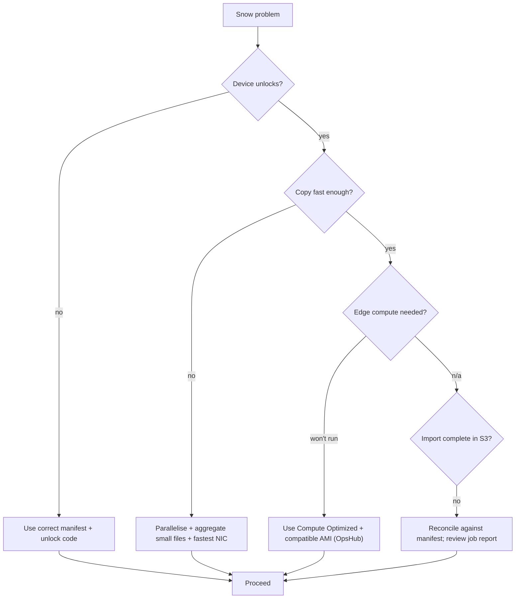

# AWS Snow Family - SRE Operations

> Operational reality: ordering/loading/returning, where transfers fail, troubleshooting workflow, what to monitor, runbooks, real client/OpsHub examples, production patterns, cost operations, and the bandwidth-vs-ship decision math.

See also: [01 - AWS Snow Family Intro bits & bytes](01%20-%20AWS%20Snow%20Family%20Intro%20bits%20%26%20bytes.md) · [02 - AWS Snow Family Deep Dive](02%20-%20AWS%20Snow%20Family%20Deep%20Dive.md) · [03 - AWS Snow Family Exam Scenarios](03%20-%20AWS%20Snow%20Family%20Exam%20Scenarios.md) · [00 - Migration & Transfer Overview](00%20-%20Migration%20%26%20Transfer%20Overview.md)

---

## Table of Contents

- [1. Common Errors (Symptom → Root Cause → Fix → Prevention)](#1-common-errors-symptom--root-cause--fix--prevention)
- [2. Troubleshooting Workflow](#2-troubleshooting-workflow)
- [3. The Ship-vs-Online Decision Math](#3-the-ship-vs-online-decision-math)
- [4. What to Monitor](#4-what-to-monitor)
- [5. Runbooks](#5-runbooks)
- [6. Real Examples](#6-real-examples)
- [7. Production Patterns by Scale](#7-production-patterns-by-scale)
- [8. Cost Operations](#8-cost-operations)

---

## 1. Common Errors (Symptom → Root Cause → Fix → Prevention)

### Device won't unlock

- **Cause:** Wrong **manifest** or **unlock code**, or they were kept together and lost.
- **Fix:** Retrieve the correct manifest/unlock code from the job in the console.
- **Prevention:** Store manifest and unlock code **separately and securely**; document custody.

### Slow local copy

- **Cause:** Single-threaded copy, many tiny files, NIC not saturated, slow source disk.
- **Fix:** Parallelise (multiple threads/clients), aggregate small files (tar), use the fastest NIC port.
- **Prevention:** Plan a parallel load; benchmark before bulk copy.

### Import to S3 incomplete / objects missing

- **Cause:** Copy errors, interrupted job, or checksum failures.
- **Fix:** Review job report; re-copy failed items (for in-progress) or reconcile against manifest.
- **Prevention:** Validate checksums; keep a source manifest to reconcile.

### Per-day charges higher than expected

- **Cause:** Device kept on-site beyond included days.
- **Fix:** Return promptly; expedite shipping.
- **Prevention:** Schedule the load window; track on-site days.

### Edge EC2/Lambda won't run

- **Cause:** Incompatible AMI, insufficient compute model (Storage Optimized vs Compute), config.
- **Fix:** Use a compatible AMI on a **Compute Optimized** device; check OpsHub setup.
- **Prevention:** Order the right device for compute needs; pre-validate AMIs.

### Network/interface misconfig on device

- **Cause:** VLAN/IP/DHCP issues isolating the device.
- **Fix:** Reconfigure interfaces in OpsHub; verify routing to source hosts.
- **Prevention:** Pre-plan the transfer VLAN/IP scheme.

[⬆ Back to top](#table-of-contents)

---

## 2. Troubleshooting Workflow



[⬆ Back to top](#table-of-contents)

---

## 3. The Ship-vs-Online Decision Math

Estimate **transfer time = data ÷ usable bandwidth** (account for ~50-80% efficiency and shared links).

| Data   | 100 Mbps   | 1 Gbps     | 10 Gbps (DX) |
| :----- | :--------- | :--------- | :----------- |
| 10 TB  | ~10 days   | ~1 day     | hours        |
| 100 TB | ~3+ months | ~10 days   | ~1 day       |
| 1 PB   | years      | ~3+ months | ~10 days     |

> Rule of thumb: if online is **weeks/months**, **ship with Snow**. Snowball Edge devices arrive/return in days regardless of data size.

[⬆ Back to top](#table-of-contents)

---

## 4. What to Monitor

| Signal                                                         | Why                  |
| :------------------------------------------------------------- | :------------------- |
| Job state (SNS): created→shipped→delivered→importing→completed | Lifecycle tracking   |
| Local copy throughput                                          | Loading progress/ETA |
| Checksum/validation errors                                     | Data integrity       |
| On-site days elapsed                                           | Cost (per-day fees)  |
| Edge EC2/Lambda health (OpsHub/CloudWatch)                     | Edge workload        |
| Post-import S3 object reconciliation                           | Completeness         |

[⬆ Back to top](#table-of-contents)

---

## 5. Runbooks

### Runbook: bulk import migration

1. **Order** import job(s); pick device(s)/region/bucket; receive device(s).
2. Store **manifest + unlock code separately**.
3. Connect device; configure network (transfer VLAN); unlock via **OpsHub**.
4. **Parallel-copy** data (aggregate small files); validate checksums.
5. Power down; **ship back** (E Ink label).
6. AWS imports to **S3**; **reconcile** objects vs source manifest.
7. Confirm NIST erase; close the job.

### Runbook: edge compute deployment

1. Order **Compute Optimized** (GPU if ML); load compatible **AMIs**/Lambda.
2. Deploy on-site; run inference/processing locally.
3. Optionally store results for later **import** or send via **DataSync** when online.
4. Return device; import outputs.

### Runbook: large multi-device migration

1. Estimate device count from total data ÷ per-device capacity (+ overhead).
2. Order devices/cluster; stagger to overlap load windows.
3. Track per-device jobs (SNS); reconcile all into S3.

[⬆ Back to top](#table-of-contents)

---

## 6. Real Examples

### Copy via Snowball Client (concept)

```bash
# Configure profile against the device's local S3 endpoint, then:
snowball cp --recursive /data/genomics s3://my-import-bucket/genomics/
# Validate
snowball validate s3://my-import-bucket/genomics/
```

### S3 adapter with AWS CLI (concept)

```bash
aws s3 cp /data/ s3://my-import-bucket/ --recursive \
  --endpoint http://<snowball-ip>:8080
```

### Create an import job (CLI sketch)

```bash
aws snowball create-job \
  --job-type IMPORT \
  --resources '{"S3Resources":[{"BucketArn":"arn:aws:s3:::my-import-bucket"}]}' \
  --address-id ADID123 \
  --kms-key-arn arn:aws:kms:ap-south-1:111111111111:key/abcd \
  --role-arn arn:aws:iam::111111111111:role/SnowballImportRole \
  --snowball-type EDGE_S \
  --shipping-option SECOND_DAY
```

### Track jobs

```bash
aws snowball list-jobs
aws snowball describe-job --job-id JID1234567890
```

[⬆ Back to top](#table-of-contents)

---

## 7. Production Patterns by Scale

| Context                    | Pattern                                                                |
| :------------------------- | :--------------------------------------------------------------------- |
| **Single large migration** | One/few Snowball Edge Storage devices, parallel load, reconcile to S3. |
| **Many small sites**       | Snowcone/Snowball waves per region; DataSync where links allow.        |
| **Edge processing**        | Compute Optimized (GPU) clusters at disconnected sites.                |
| **DB seed**                | Snow seeds initial load + **DMS CDC** online catch-up.                 |
| **Recurring/ongoing**      | Don't use Snow - use **DataSync/Direct Connect**.                      |

[⬆ Back to top](#table-of-contents)

---

## 8. Cost Operations

- **Return promptly** - the biggest avoidable cost is extra **per-day** on-site fees.
- **Right-size** device choice (Snowcone vs Edge Storage vs Compute) to volume/compute.
- Snow **avoids internet egress** for the data - a major saving at PB scale.
- For **repeating** transfers, switch to **DataSync/DX** (Snow per-job fees add up).
- Parallelise loads to shorten the on-site window (fewer billable days).

[⬆ Back to top](#table-of-contents)

---

Related: [01 - AWS Snow Family Intro bits & bytes](01%20-%20AWS%20Snow%20Family%20Intro%20bits%20%26%20bytes.md) · [02 - AWS Snow Family Deep Dive](02%20-%20AWS%20Snow%20Family%20Deep%20Dive.md) · [03 - AWS Snow Family Exam Scenarios](03%20-%20AWS%20Snow%20Family%20Exam%20Scenarios.md) · [01 - AWS DataSync Intro bits & bytes](01%20-%20AWS%20DataSync%20Intro%20bits%20%26%20bytes.md) · [00 - Migration & Transfer Overview](00%20-%20Migration%20%26%20Transfer%20Overview.md)
