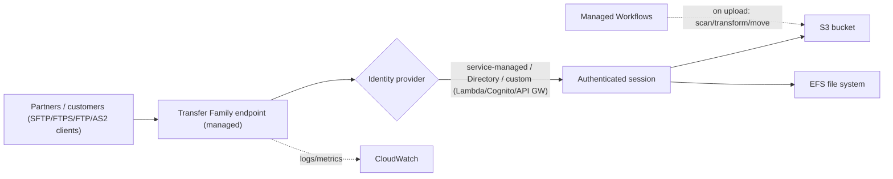

# AWS Transfer Family - Intro bits & bytes

> Transfer Family is **fully managed file transfer** over the standard protocols your partners already use - **SFTP, FTPS, FTP, and AS2** - landing data directly in **S3 or EFS** with **no servers to run**. On the exam it's the answer to _"customers/partners upload files via SFTP and we want them in S3 without managing FTP servers,"_ and _"managed SFTP/FTPS endpoint."_

See also: [02 - AWS Transfer Family Deep Dive](02%20-%20AWS%20Transfer%20Family%20Deep%20Dive.md) · [03 - AWS Transfer Family Exam Scenarios](03%20-%20AWS%20Transfer%20Family%20Exam%20Scenarios.md) · [04 - AWS Transfer Family SRE Operations](04%20-%20AWS%20Transfer%20Family%20SRE%20Operations.md) · [01 - AWS DataSync Intro bits & bytes](01%20-%20AWS%20DataSync%20Intro%20bits%20%26%20bytes.md) · [00 - Migration & Transfer Overview](00%20-%20Migration%20%26%20Transfer%20Overview.md)

---

## Table of Contents

- [1. The Problem It Solves](#1-the-problem-it-solves)
- [2. The Protocols (SFTP, FTPS, FTP, AS2)](#2-the-protocols-sftp-ftps-ftp-as2)
- [3. Core Concepts: Server, Users, Identity, Storage](#3-core-concepts-server-users-identity-storage)
- [4. The Transfer Flow](#4-the-transfer-flow)
- [5. When To Use It / When NOT To Use It](#5-when-to-use-it--when-not-to-use-it)
- [6. Transfer Family vs DataSync vs S3 Direct vs Storage Gateway](#6-transfer-family-vs-datasync-vs-s3-direct-vs-storage-gateway)
- [7. Cost Model](#7-cost-model)
- [8. Mini-Quiz](#8-mini-quiz)

---

---

## 1. The Problem It Solves

Many businesses still exchange files with partners over **SFTP/FTPS/FTP** (banks, healthcare, retail EDI, payroll). Running and securing your own FTP server fleet is undifferentiated heavy lifting: patching, scaling, high availability, auth integration, and getting files into your data stores.

Transfer Family gives you a **managed endpoint** that speaks those protocols, **authenticates** users (service-managed, your **Active Directory/LDAP**, or a **custom identity provider**), and writes/reads files **directly in S3 or EFS** - **no FTP servers to manage**, with built-in scaling and AWS security.

> Mental model: **"SFTP/FTPS/FTP-as-a-service" in front of S3/EFS.** Your partners keep their existing clients; you stop running FTP servers and get files straight into AWS storage.

[⬆ Back to top](#table-of-contents)

---

## 2. The Protocols (SFTP, FTPS, FTP, AS2)

| Protocol | What it is                 | Notes                                                                |
| :------- | :------------------------- | :------------------------------------------------------------------- |
| **SFTP** | SSH File Transfer Protocol | Most common; encrypted; key or password auth                         |
| **FTPS** | FTP over TLS               | Encrypted FTP; certificate-based                                     |
| **FTP**  | Plain FTP                  | **Unencrypted** - only for **VPC-internal** use, not public internet |
| **AS2**  | Applicability Statement 2  | **B2B/EDI** message transfer with signing/encryption + MDN receipts  |

> Exam note: **FTP is not allowed for public/internet-facing endpoints** (no encryption) - it's VPC-internal only. **AS2** is the B2B/EDI answer.

[⬆ Back to top](#table-of-contents)

---

## 3. Core Concepts: Server, Users, Identity, Storage

| Concept               | What it is                                                                                                                                                  |
| :-------------------- | :---------------------------------------------------------------------------------------------------------------------------------------------------------- |
| **Server**            | A managed Transfer Family endpoint configured with protocol(s), endpoint type, and identity provider.                                                       |
| **Users**             | Accounts that connect; each maps to a **home directory** and an **IAM role** scoping S3/EFS access (and optional **logical directories** to mask paths).    |
| **Identity provider** | **Service-managed** (store users/keys in Transfer), **AWS Directory Service/AD**, or **custom** (Lambda/API Gateway, e.g., backed by Cognito/Secrets/LDAP). |
| **Storage backend**   | **S3** (object) or **EFS** (POSIX file system).                                                                                                             |
| **Managed Workflows** | Post-upload automation: AV scan, decrypt, copy, tag, custom Lambda steps.                                                                                   |

[⬆ Back to top](#table-of-contents)

---

## 4. The Transfer Flow

1. Create a **server** choosing protocol(s) (SFTP/FTPS/FTP/AS2) and **endpoint type** (public, VPC, VPC internet-facing).
2. Configure an **identity provider** and create **users** with **home directories** + **IAM roles**.
3. Partners connect with their normal **SFTP/FTPS client** to your endpoint (often via a friendly **Route 53/custom hostname**).
4. Files are written directly to **S3/EFS** under the user's scoped path.
5. **Managed Workflows** run on upload (scan/transform/route); **CloudWatch** logs/metrics capture activity.

[⬆ Back to top](#table-of-contents)

---

## 5. When To Use It / When NOT To Use It

**Use it when:**

- Partners/customers exchange files via **SFTP/FTPS/FTP/AS2** and you want them in **S3/EFS**.
- You want to **retire self-managed FTP servers** and get managed scaling/HA/security.
- You need **B2B/EDI (AS2)** exchange.
- You want **post-upload automation** (scan, transform, route) via workflows.

**Don't use it when:**

- You're doing **internal bulk migration/sync** of file shares → **DataSync**.
- You're moving **whole servers** (→ MGN) or **databases** (→ DMS).
- You need **offline petabyte** transfer → **Snow**.
- Your own apps can just use the **S3 API/SDK** directly (no third-party FTP requirement).

[⬆ Back to top](#table-of-contents)

---

## 6. Transfer Family vs DataSync vs S3 Direct vs Storage Gateway

|           | **Transfer Family**              | **DataSync**            | **S3 API direct**  | **Storage Gateway**               |
| :-------- | :------------------------------- | :---------------------- | :----------------- | :-------------------------------- |
| Interface | **SFTP/FTPS/FTP/AS2**            | Managed sync engine     | AWS SDK/CLI        | NFS/SMB (cached)                  |
| Audience  | External partners w/ FTP clients | Internal bulk move/sync | Your own apps      | On-prem apps needing local access |
| Backend   | S3/EFS                           | S3/EFS/FSx              | S3                 | S3 (cached)                       |
| Best for  | Managed file exchange            | Migration/sync          | Native integration | Hybrid file access                |

> Exam trap: **Transfer Family = inbound/outbound file exchange over FTP-family protocols.** It's **not** a bulk migration tool (that's DataSync/Snow) and **not** a hybrid mount (that's Storage Gateway).

[⬆ Back to top](#table-of-contents)

---

## 7. Cost Model

- **Per protocol enabled per hour** the server is **running** (endpoint uptime).
- **Per GB** of data **uploaded and downloaded**.
- **AS2** has its own message/processing charges.
- Plus **S3/EFS storage**, requests, and any data transfer.

> Cost lever: consolidate protocols/users onto fewer servers; the **endpoint bills hourly while it exists**, so don't leave unused servers running. (Note: a running endpoint can't be "paused" - delete or consolidate to save.)

[⬆ Back to top](#table-of-contents)

---

## 8. Mini-Quiz

**Q1:** Partners upload files via SFTP and you want them in S3 without running FTP servers. Service?
_A:_ **AWS Transfer Family** (managed SFTP → S3).

**Q2:** Which protocol is **not** allowed for public internet endpoints?
_A:_ **Plain FTP** (unencrypted) - VPC-internal only.

**Q3:** B2B/EDI file exchange with signing and MDN receipts?
_A:_ **AS2** via Transfer Family.

**Q4:** Authenticate SFTP users against corporate Active Directory?
_A:_ Use **AWS Directory Service / AD** (or a custom IdP) as the identity provider.

**Q5:** Automatically virus-scan and route files after upload?
_A:_ **Managed Workflows**.

---

> Continue to [02 - AWS Transfer Family Deep Dive](02%20-%20AWS%20Transfer%20Family%20Deep%20Dive.md).
