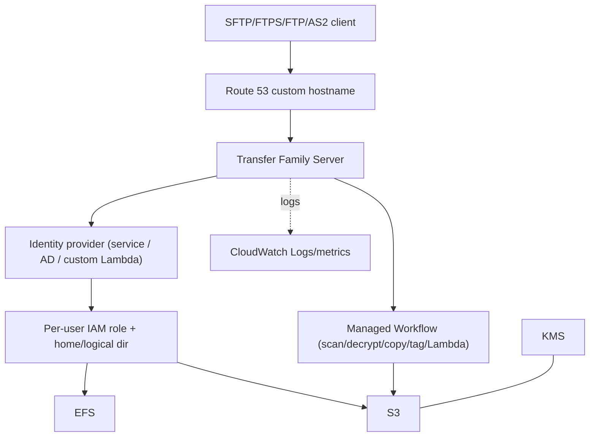

# AWS Transfer Family - Deep Dive

> Architecture of servers/users/endpoints, identity provider options, endpoint types & networking (public vs VPC), home & logical directories, managed workflows, AS2 for B2B, security (IAM scoping, KMS, host keys), monitoring, limits, integrations, comparisons, and best practices.

See also: [01 - AWS Transfer Family Intro bits & bytes](01%20-%20AWS%20Transfer%20Family%20Intro%20bits%20%26%20bytes.md) · [03 - AWS Transfer Family Exam Scenarios](03%20-%20AWS%20Transfer%20Family%20Exam%20Scenarios.md) · [04 - AWS Transfer Family SRE Operations](04%20-%20AWS%20Transfer%20Family%20SRE%20Operations.md) · [00 - Migration & Transfer Overview](00%20-%20Migration%20%26%20Transfer%20Overview.md)

---

## Table of Contents

- [1. Architecture & Components](#1-architecture--components)
- [2. Identity Provider Options](#2-identity-provider-options)
- [3. Endpoint Types & Networking](#3-endpoint-types--networking)
- [4. Home Directories vs Logical Directories](#4-home-directories-vs-logical-directories)
- [5. Managed Workflows](#5-managed-workflows)
- [6. AS2 for B2B/EDI](#6-as2-for-b2bedi)
- [7. Security: IAM Scoping, KMS, Host Keys, Allow-lists](#7-security-iam-scoping-kms-host-keys-allow-lists)
- [8. Monitoring & Observability](#8-monitoring--observability)
- [9. Limits & Quotas](#9-limits--quotas)
- [10. Integration Matrix & Comparisons](#10-integration-matrix--comparisons)
- [11. Best Practices by Pillar](#11-best-practices-by-pillar)

---

---

## 1. Architecture & Components

- A **server** is the managed endpoint; you choose **protocol(s)**, **endpoint type**, **identity provider**, **host keys**, and **logging role**.
- Each **user** has a **home directory**, an **IAM role** scoping S3/EFS access, optional **policy** (session policy) and **SSH public keys** (for SFTP).
- The server scales and is highly available within the region automatically - no instance management.
- A friendly **custom hostname** (Route 53) is typically mapped to the endpoint for partners.

[⬆ Back to top](#table-of-contents)

---

## 2. Identity Provider Options

| Option                         | Use                                                                                                                                                                             |
| :----------------------------- | :------------------------------------------------------------------------------------------------------------------------------------------------------------------------------ |
| **Service-managed**            | Store users + SSH keys in Transfer Family itself - simplest for a few users.                                                                                                    |
| **AWS Directory Service / AD** | Authenticate against **Microsoft AD/LDAP** - enterprise SSO/governance.                                                                                                         |
| **Custom IdP**                 | A **Lambda** (or **API Gateway**) function you write - integrate **Cognito**, **Secrets Manager**, external LDAP, or any custom logic (per-user role, home dir, IP allow-list). |

> The **custom IdP (Lambda)** pattern is powerful: it returns the user's IAM role, home directory, and policy at login, enabling fine-grained, dynamic access control.

[⬆ Back to top](#table-of-contents)

---

## 3. Endpoint Types & Networking

| Endpoint type             | Reachability                           | Use                                                 |
| :------------------------ | :------------------------------------- | :-------------------------------------------------- |
| **Public**                | Internet, AWS-managed IPs              | Simplest public SFTP/FTPS (not FTP)                 |
| **VPC (internal)**        | Private within VPC/on-prem via DX/VPN  | Internal/private transfers; **FTP** allowed here    |
| **VPC (internet-facing)** | Public via **Elastic IPs** in your VPC | Public access **with fixed EIPs** + security groups |

- **VPC endpoint** types let you apply **security groups** and get **static Elastic IPs** (so partners can allow-list your IPs) - a common requirement.
- Plain **FTP** is only permitted on **VPC (internal)** endpoints because it's unencrypted.

[⬆ Back to top](#table-of-contents)

---

## 4. Home Directories vs Logical Directories

- **Home directory (PATH mode)**: the user lands in a real S3 prefix/EFS path; they may see the bucket structure.
- **Logical directories (LOGICAL mode)**: you present a **virtual directory tree** that maps friendly paths to underlying S3/EFS locations - **hides real paths**, supports chroot-like isolation, and lets you compose multiple backend locations into one view.

> Use **logical directories** to give each partner a clean, isolated `/inbound` `/outbound` view without exposing bucket names/structure.

[⬆ Back to top](#table-of-contents)

---

## 5. Managed Workflows

- A **managed workflow** runs automatically **on file upload** (and there are **on-partial-upload** error paths).
- Built-in steps: **copy**, **tag**, **decrypt** (PGP), **delete**, plus **custom steps** (your **Lambda**) for AV scanning, validation, format conversion, routing to downstream systems.
- Enables a fully automated **ingest → process → route** pipeline without polling.

[⬆ Back to top](#table-of-contents)

---

## 6. AS2 for B2B/EDI

- **AS2** supports **B2B/EDI** exchanges (common in retail, logistics, healthcare) with **message signing, encryption, compression**, and **MDN** (Message Disposition Notification) receipts for non-repudiation.
- You configure **trading partner profiles**, **certificates**, and **agreements**; messages land in S3.
- This is the answer when a scenario mentions **EDI / trading partners / AS2 / MDN receipts**.

[⬆ Back to top](#table-of-contents)

---

## 7. Security: IAM Scoping, KMS, Host Keys, Allow-lists

| Control                                | Detail                                                                                  |
| :------------------------------------- | :-------------------------------------------------------------------------------------- |
| **Per-user IAM role + session policy** | Scope each user to only their prefix/path (least privilege).                            |
| **Logical directories**                | Hide bucket structure; isolate partners.                                                |
| **KMS**                                | Encrypt S3/EFS data at rest.                                                            |
| **Encryption in transit**              | SFTP (SSH), FTPS (TLS); avoid plain FTP except internal.                                |
| **Host keys**                          | Server SSH host keys; rotate carefully (clients pin them).                              |
| **IP allow-listing**                   | VPC endpoint + **security groups** / **Elastic IPs**; custom IdP can enforce source IP. |
| **CloudTrail**                         | Audit control-plane API; CloudWatch logs for session activity.                          |

[⬆ Back to top](#table-of-contents)

---

## 8. Monitoring & Observability

- **CloudWatch Logs**: per-session structured logs (auth, file ops) via a logging role.
- **CloudWatch metrics**: bytes in/out, connections, errors.
- **CloudTrail**: server/user management API audit.
- **EventBridge**: react to workflow/transfer events for downstream automation/alerts.

[⬆ Back to top](#table-of-contents)

---

## 9. Limits & Quotas

| Limit                | Typical                     | Notes                        |
| :------------------- | :-------------------------- | :--------------------------- |
| Servers per region   | Soft                        | Consolidate users per server |
| Users per server     | Thousands (service-managed) | More via custom IdP          |
| Protocols per server | SFTP/FTPS/FTP/AS2           | FTP only on VPC-internal     |
| File size            | Large (S3-backed)           | S3 object limits apply       |
| Concurrent sessions  | Scales automatically        | High concurrency supported   |

[⬆ Back to top](#table-of-contents)

---

## 10. Integration Matrix & Comparisons

| Service                                           | Integration                                         |
| :------------------------------------------------ | :-------------------------------------------------- | ----------- |
| **S3 / EFS**                                      | Storage backends → [Amazon S3](01%20-%20S3%20Intro%20%26%20Core%20Concepts.md) |
| **IAM**                                           | Per-user scoped roles/session policies              |
| **Directory Service / Cognito / Secrets Manager** | Identity provider options (incl. custom Lambda IdP) |
| **Lambda / API Gateway**                          | Custom IdP + custom workflow steps                  |
| **KMS**                                           | At-rest encryption                                  |
| **Route 53**                                      | Friendly custom hostname for the endpoint           |
| **CloudWatch / CloudTrail / EventBridge**         | Logging, audit, event automation                    |

### Transfer Family vs DataSync

|           | Transfer Family                        | DataSync                            |
| :-------- | :------------------------------------- | :---------------------------------- |
| Interface | SFTP/FTPS/FTP/AS2 (partners push/pull) | Managed sync engine (you move data) |
| Use       | Ongoing partner file exchange          | Bulk migration/scheduled sync       |

[⬆ Back to top](#table-of-contents)

---

## 11. Best Practices by Pillar

**Security** - per-user least-privilege IAM + **logical directories** for isolation; KMS at rest; SFTP/FTPS (not public FTP); VPC endpoint + SG/EIP allow-listing; custom IdP for IP/MFA-style controls; rotate host keys carefully.

**Reliability** - managed HA within region; use workflows' error handling; monitor session/auth failures.

**Performance Efficiency** - S3-backed scaling handles large files/concurrency; map a stable custom hostname; size custom IdP Lambda for login latency.

**Cost Optimization** - consolidate users/protocols per server; **delete unused servers** (hourly endpoint billing); watch AS2 message charges; lifecycle S3 data.

**Operational Excellence** - automate ingest with **managed workflows**; structured CloudWatch logs; EventBridge-driven downstream processing; IaC servers/users.

[⬆ Back to top](#table-of-contents)

---

> Continue to [03 - AWS Transfer Family Exam Scenarios](03%20-%20AWS%20Transfer%20Family%20Exam%20Scenarios.md).
