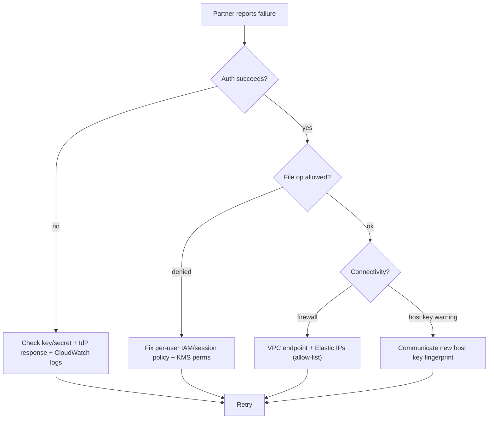

# AWS Transfer Family - SRE Operations

> Operational reality: where auth and transfers fail, troubleshooting workflow, what to monitor/alarm, runbooks (stand up SFTP, onboard partner, host-key rotation), real CLI/IaC examples, production patterns, and cost operations.

See also: [01 - AWS Transfer Family Intro bits & bytes](01%20-%20AWS%20Transfer%20Family%20Intro%20bits%20%26%20bytes.md) · [02 - AWS Transfer Family Deep Dive](02%20-%20AWS%20Transfer%20Family%20Deep%20Dive.md) · [03 - AWS Transfer Family Exam Scenarios](03%20-%20AWS%20Transfer%20Family%20Exam%20Scenarios.md) · [00 - Migration & Transfer Overview](00%20-%20Migration%20%26%20Transfer%20Overview.md)

---

## Table of Contents

- [1. Common Errors (Symptom → Root Cause → Fix → Prevention)](#1-common-errors-symptom--root-cause--fix--prevention)
- [2. Troubleshooting Workflow](#2-troubleshooting-workflow)
- [3. What to Monitor and Alarm On](#3-what-to-monitor-and-alarm-on)
- [4. Runbooks](#4-runbooks)
- [5. Real Examples](#5-real-examples)
- [6. Production Patterns by Scale](#6-production-patterns-by-scale)
- [7. Cost Operations](#7-cost-operations)
- [8. Security Hardening Checklist](#8-security-hardening-checklist)

---

## 1. Common Errors (Symptom → Root Cause → Fix → Prevention)

### Partner can't authenticate

- **Cause:** Wrong SSH key/password, IdP misconfig (AD/Lambda), user not mapped to a role/home dir.
- **Fix:** Verify the user's public key/secret; check IdP response (role, home dir, policy); review CloudWatch logs.
- **Prevention:** Test each user at onboarding; validate custom IdP responses.

### Authenticated but "permission denied" on files

- **Cause:** Per-user IAM role/session policy doesn't allow the prefix; KMS key not usable.
- **Fix:** Grant least-privilege S3/EFS actions on the right prefix; allow `kms:Decrypt/GenerateDataKey`.
- **Prevention:** Template the per-user role + logical directory mapping.

### Partner's firewall blocks the endpoint

- **Cause:** Public endpoint IPs change; partner allow-lists fixed IPs.
- **Fix:** Move to a **VPC endpoint with Elastic IPs**; share the stable IPs.
- **Prevention:** Use VPC + EIP when partners require IP allow-listing.

### Host key changed warning on clients

- **Cause:** Server host key rotated; clients pin the old key.
- **Fix:** Communicate the new host key fingerprint; clients update `known_hosts`.
- **Prevention:** Plan host-key rotation with advance notice; keep old key during transition where supported.

### Files upload but downstream doesn't process

- **Cause:** Workflow not attached, workflow step error, or EventBridge rule missing.
- **Fix:** Attach/repair the managed workflow; check workflow execution logs; verify EventBridge.
- **Prevention:** Test the full ingest→process path; alarm on workflow failures.

### Plain FTP fails on a public endpoint

- **Cause:** FTP isn't allowed on public endpoints (unencrypted).
- **Fix:** Use SFTP/FTPS publicly, or move FTP to a **VPC-internal** endpoint.
- **Prevention:** Choose protocol/endpoint type per security rules.

[⬆ Back to top](#table-of-contents)

---

## 2. Troubleshooting Workflow



[⬆ Back to top](#table-of-contents)

---

## 3. What to Monitor and Alarm On

| Signal                                      | Why                      |
| :------------------------------------------ | :----------------------- |
| Auth **failures** (CloudWatch logs/metrics) | Misconfig or brute-force |
| **BytesIn/Out**, connection counts          | Throughput/usage         |
| **Workflow** execution failures             | Broken ingest pipeline   |
| Per-user **AccessDenied**                   | IAM/policy issues        |
| Server **state** (running/idle)             | Cost + availability      |
| CloudTrail user/server changes              | Control-plane audit      |

[⬆ Back to top](#table-of-contents)

---

## 4. Runbooks

### Runbook: stand up managed SFTP → S3

1. Create a **server** (SFTP), choose **endpoint type** (VPC + EIP if allow-listing needed), set **logging role**.
2. Configure **identity provider** (service-managed / AD / custom Lambda).
3. Create **users**: SSH key, **home/logical directory**, **per-user IAM role**.
4. Map a **Route 53 custom hostname**.
5. Attach a **managed workflow** (scan/decrypt/route) if needed.
6. Test login + upload; verify file lands in S3 and workflow runs.

### Runbook: onboard a new partner

1. Create user + scoped role + logical dirs (`/inbound`, `/outbound`).
2. Exchange **public key** (or IdP credentials) and the **host key fingerprint**.
3. Share endpoint/hostname and (if VPC) the **Elastic IPs** to allow-list.
4. Test transfer; confirm logging and workflow.

### Runbook: host-key rotation

1. Generate/add new host key; announce fingerprint + cutover date.
2. Serve new key; have clients update `known_hosts`.
3. Retire the old key after the transition window.

[⬆ Back to top](#table-of-contents)

---

## 5. Real Examples

### Create an SFTP server (CLI sketch)

```bash
aws transfer create-server \
  --protocols SFTP \
  --identity-provider-type SERVICE_MANAGED \
  --endpoint-type VPC \
  --endpoint-details '{"VpcId":"vpc-abc","SubnetIds":["subnet-1"],"AddressAllocationIds":["eipalloc-123"]}' \
  --logging-role arn:aws:iam::111111111111:role/TransferLoggingRole
```

### Create a user with logical directories + scoped role

```bash
aws transfer create-user \
  --server-id s-1234567890abcdef0 \
  --user-name partnerA \
  --role arn:aws:iam::111111111111:role/PartnerA-S3Role \
  --home-directory-type LOGICAL \
  --home-directory-mappings '[{"Entry":"/inbound","Target":"/bucketA/partnerA/in"},{"Entry":"/outbound","Target":"/bucketA/partnerA/out"}]' \
  --ssh-public-key-body "ssh-rsa AAAA..."
```

### Per-user scoped IAM (sketch)

```json
{
  "Version": "2012-10-17",
  "Statement": [
    {
      "Effect": "Allow",
      "Action": ["s3:ListBucket"],
      "Resource": "arn:aws:s3:::bucketA",
      "Condition": { "StringLike": { "s3:prefix": ["partnerA/*"] } }
    },
    {
      "Effect": "Allow",
      "Action": ["s3:GetObject", "s3:PutObject"],
      "Resource": "arn:aws:s3:::bucketA/partnerA/*"
    },
    {
      "Effect": "Allow",
      "Action": ["kms:Decrypt", "kms:GenerateDataKey"],
      "Resource": "arn:aws:kms:ap-south-1:111111111111:key/abcd"
    }
  ]
}
```

### Custom IdP (Lambda) response shape

```json
{
  "Role": "arn:aws:iam::111111111111:role/PartnerA-S3Role",
  "HomeDirectoryType": "LOGICAL",
  "HomeDirectoryDetails": "[{\"Entry\":\"/inbound\",\"Target\":\"/bucketA/partnerA/in\"}]",
  "Policy": "{...session policy...}"
}
```

[⬆ Back to top](#table-of-contents)

---

## 6. Production Patterns by Scale

| Context              | Pattern                                                                                                |
| :------------------- | :----------------------------------------------------------------------------------------------------- |
| **Few users**        | Service-managed IdP, public/VPC endpoint, basic logging.                                               |
| **Enterprise**       | AD or custom IdP, VPC + EIP allow-listing, per-user IAM + logical dirs, managed workflows, dashboards. |
| **B2B/EDI**          | AS2 with partner profiles/certs/agreements + MDN.                                                      |
| **Automated ingest** | Workflows (scan/decrypt/route) + EventBridge to downstream Step Functions.                             |
| **Multi-account**    | Central transfer account; cross-account S3 with scoped roles.                                          |

[⬆ Back to top](#table-of-contents)

---

## 7. Cost Operations

- **Endpoints bill hourly per enabled protocol** while running - **consolidate** users/protocols and **delete unused servers**.
- Watch **per-GB** upload/download and **AS2** message charges.
- Lifecycle S3 data (IA/Glacier) and clean up old partner data.
- Right-size the **custom IdP Lambda** to control login-path cost/latency.

[⬆ Back to top](#table-of-contents)

---

## 8. Security Hardening Checklist

- ✅ **SFTP/FTPS only** for public; **FTP only VPC-internal**.
- ✅ **Per-user IAM least privilege** + **logical directories** for isolation.
- ✅ **VPC endpoint + Elastic IPs + security groups** for IP allow-listing.
- ✅ **KMS** at rest; TLS/SSH in transit.
- ✅ **CloudWatch Logs + CloudTrail** (immutable bucket) for audit.
- ✅ **Host-key rotation** plan; communicate fingerprints.
- ✅ Custom IdP enforces **source-IP / extra checks** where required.

[⬆ Back to top](#table-of-contents)

---

Related: [01 - AWS Transfer Family Intro bits & bytes](01%20-%20AWS%20Transfer%20Family%20Intro%20bits%20%26%20bytes.md) · [02 - AWS Transfer Family Deep Dive](02%20-%20AWS%20Transfer%20Family%20Deep%20Dive.md) · [03 - AWS Transfer Family Exam Scenarios](03%20-%20AWS%20Transfer%20Family%20Exam%20Scenarios.md) · [01 - AWS DataSync Intro bits & bytes](01%20-%20AWS%20DataSync%20Intro%20bits%20%26%20bytes.md) · [00 - Migration & Transfer Overview](00%20-%20Migration%20%26%20Transfer%20Overview.md)
