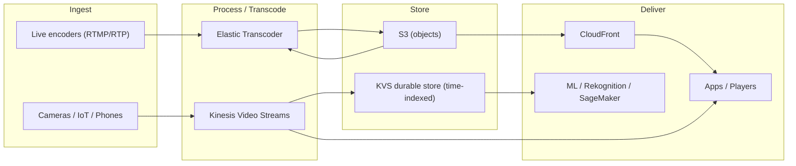

# Media Services - SAA-C03 Section Overview

> AWS **Media Services** are about getting audio/video **in, processed, stored, and out** at scale: ingesting live or device streams, transcoding files into the right formats/bitrates, and delivering them to any screen. For SAA-C03 you mainly need the _architecture role_ of each service - what problem it solves, how it pairs with S3/CloudFront/Kinesis, and the right pick for a scenario. This maps to **Domain 1 (Secure)**, **Domain 3 (High-Performing)**, and **Domain 4 (Cost-Optimized)**.

See also: [01 - Amazon Elastic Transcoder Intro bits & bytes](01%20-%20Amazon%20Elastic%20Transcoder%20Intro%20bits%20%26%20bytes.md) · [01 - Amazon Kinesis Video Streams Intro bits & bytes](01%20-%20Amazon%20Kinesis%20Video%20Streams%20Intro%20bits%20%26%20bytes.md) · [00 - Migration & Transfer Overview](00%20-%20Migration%20%26%20Transfer%20Overview.md)

---

## Table of Contents

- [How This Section Is Organised](#how-this-section-is-organised)
- [The Four-File Pattern Per Service](#the-four-file-pattern-per-service)
- [Service Index](#service-index)
- [The Wider Elemental Media Family (Context)](#the-wider-elemental-media-family-context)
- [Mental Model: Ingest, Process, Store, Deliver](#mental-model-ingest-process-store-deliver)
- [Cross-Domain Links](#cross-domain-links)

---

---

## How This Section Is Organised

Each service lives in its own numbered folder and follows the same four-file pattern used across the vault, so you can study one service end-to-end or compare the same file type across services.

> **Exam reality check:** Media Services are a _light_ topic on SAA-C03. You will rarely see deep configuration questions. What you **must** be able to do is recognise the service from a scenario keyword ("transcode video files for multiple devices" → Elastic Transcoder/MediaConvert; "ingest video from millions of devices for ML/playback" → Kinesis Video Streams) and wire it correctly to S3, CloudFront, and analytics.

[⬆ Back to top](#table-of-contents)

---

## The Four-File Pattern Per Service

| File                        | Covers                                                                                                                                     |
| :-------------------------- | :----------------------------------------------------------------------------------------------------------------------------------------- |
| `01 - … Intro bits & bytes` | What it is, the problem it solves, when/when-not to use, alternatives, core concepts, foundational architecture, cost intro, mini-quiz     |
| `02 - … Deep Dive`          | Detailed architecture, control vs data plane, components, integrations, security, monitoring, limits & quotas, comparisons, best practices |
| `03 - … Exam Scenarios`     | Exam focus, keywords, distractors, elimination technique, **20 medium + 10 hard** scenario questions with explanations                     |
| `04 - … SRE Operations`     | Common errors, troubleshooting, runbooks, real CLI/IaC examples, production patterns, cost-optimization operations                         |

[⬆ Back to top](#table-of-contents)

---

## Service Index

| #   | Service                                                                                | Status | Primary exam angle                                       |
| :-- | :------------------------------------------------------------------------------------- | :----- | :------------------------------------------------------- |
| 01  | [Amazon Elastic Transcoder](01%20-%20Amazon%20Elastic%20Transcoder%20Intro%20bits%20%26%20bytes.md)       | Full   | File-based video transcoding to multiple device formats  |
| 02  | [Amazon Kinesis Video Streams](01%20-%20Amazon%20Kinesis%20Video%20Streams%20Intro%20bits%20%26%20bytes.md) | Full   | Streaming media ingestion from devices for playback & ML |

[⬆ Back to top](#table-of-contents)

---

## The Wider Elemental Media Family (Context)

The exam occasionally names the **AWS Elemental Media** services. You don't need depth, but recognise each one's verb. **Note:** AWS now positions **AWS Elemental MediaConvert** as the recommended successor to **Elastic Transcoder** for file-based transcoding.

| Service                   | One-line role                                                                 |
| :------------------------ | :---------------------------------------------------------------------------- |
| **MediaConvert**          | File-based (VOD) transcoding - the modern replacement for Elastic Transcoder  |
| **MediaLive**             | Live video encoding (broadcast-grade)                                         |
| **MediaPackage**          | Just-in-time packaging & origination of live/VOD streams, DRM                 |
| **MediaStore**            | Low-latency media-optimised origin storage (being deprecated in favour of S3) |
| **MediaTailor**           | Server-side ad insertion (SSAI) and channel assembly                          |
| **MediaConnect**          | Reliable live video transport over IP (contribution/distribution)             |
| **Elastic Transcoder**    | Legacy file-based transcoder (covered here)                                   |
| **Kinesis Video Streams** | Device/IoT media ingestion for analytics & playback (covered here)            |

> Exam shortcut: **"Live" → MediaLive/MediaConnect; "package/DRM/just-in-time" → MediaPackage; "file/VOD transcode" → MediaConvert (or Elastic Transcoder); "ingest from devices/cameras for ML" → Kinesis Video Streams.**

[⬆ Back to top](#table-of-contents)

---

## Mental Model: Ingest, Process, Store, Deliver

Almost every media architecture is a pipeline of four verbs:

- **Ingest** - get the media in. Devices/cameras/phones → **Kinesis Video Streams**; live encoders → MediaLive; files uploaded → **S3**.
- **Process / Transcode** - convert to the formats, codecs, and bitrates each target screen needs. Files → **Elastic Transcoder / MediaConvert**; live → MediaLive; device streams indexed for analytics → **Kinesis Video Streams** + Rekognition/SageMaker.
- **Store** - **S3** for objects (input/output), **Kinesis Video Streams** for time-indexed, durably stored media you replay by timestamp.
- **Deliver** - **CloudFront** for cached global delivery of HLS/DASH; players/apps; or hand frames to ML for inference.

> The single most useful distinction: **files at rest → Elastic Transcoder/MediaConvert; live device streams → Kinesis Video Streams.**

[⬆ Back to top](#table-of-contents)

---

## Cross-Domain Links

- Storage & delivery: [Amazon S3](01%20-%20S3%20Intro%20%26%20Core%20Concepts.md) · CloudFront (see Networking section)
- Streaming data siblings: Kinesis Data Streams / Firehose (see Analytics section)
- Machine learning consumers: Rekognition Video, SageMaker (see Machine Learning section)
- Migration of large media libraries into AWS: [00 - Migration & Transfer Overview](00%20-%20Migration%20%26%20Transfer%20Overview.md) · [01 - AWS DataSync Intro bits & bytes](01%20-%20AWS%20DataSync%20Intro%20bits%20%26%20bytes.md) · [01 - AWS Snow Family Intro bits & bytes](01%20-%20AWS%20Snow%20Family%20Intro%20bits%20%26%20bytes.md)

[⬆ Back to top](#table-of-contents)
