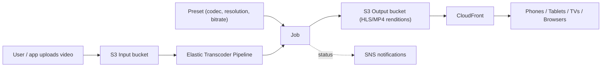

# Amazon Elastic Transcoder - Intro bits & bytes

> Elastic Transcoder is AWS's **file-based (VOD) media transcoding** service: it takes a video sitting in S3 and converts it into the formats, codecs, resolutions, and bitrates needed by phones, tablets, TVs, and browsers. On the exam it is the classic answer to _"convert uploaded video files into multiple device-friendly formats"_ - though AWS now steers new workloads to **AWS Elemental MediaConvert**.

See also: [02 - Amazon Elastic Transcoder Deep Dive](02%20-%20Amazon%20Elastic%20Transcoder%20Deep%20Dive.md) · [03 - Amazon Elastic Transcoder Exam Scenarios](03%20-%20Amazon%20Elastic%20Transcoder%20Exam%20Scenarios.md) · [04 - Amazon Elastic Transcoder SRE Operations](04%20-%20Amazon%20Elastic%20Transcoder%20SRE%20Operations.md) · [01 - Amazon Kinesis Video Streams Intro bits & bytes](01%20-%20Amazon%20Kinesis%20Video%20Streams%20Intro%20bits%20%26%20bytes.md) · [00 - Media Services Overview](00%20-%20Media%20Services%20Overview.md)

---

## Table of Contents

- [1. The Problem It Solves](#1-the-problem-it-solves)
- [2. Core Concepts: Pipelines, Jobs, Presets](#2-core-concepts-pipelines-jobs-presets)
- [3. The End-to-End Flow](#3-the-end-to-end-flow)
- [4. When To Use It / When NOT To Use It](#4-when-to-use-it--when-not-to-use-it)
- [5. Elastic Transcoder vs MediaConvert vs Kinesis Video Streams](#5-elastic-transcoder-vs-mediaconvert-vs-kinesis-video-streams)
- [6. Cost Model](#6-cost-model)
- [7. Mini-Quiz](#7-mini-quiz)

---

---

## 1. The Problem It Solves

A single source video (say a 4K `.mov` a creator uploaded) **cannot play well everywhere**. A phone on cellular needs a small, low-bitrate H.264 file; a smart TV wants 1080p; a web player wants **HLS** (adaptive bitrate) so it can switch quality with the network. Producing all those **renditions** by hand is slow and needs heavy compute.

Elastic Transcoder is a **managed, pay-per-minute transcoding farm**. You drop a source file in S3, tell it which output presets you want, and it writes the converted renditions back to S3 - no servers to run, scale, or patch.

> Mental model: Elastic Transcoder is a **format/quality factory for video files at rest**. Input file in S3 → renditions out to S3. It is _batch/file_ oriented, **not** live and **not** streaming.

[⬆ Back to top](#table-of-contents)

---

## 2. Core Concepts: Pipelines, Jobs, Presets

| Concept           | What it is                                                                                                                                                                                         |
| :---------------- | :------------------------------------------------------------------------------------------------------------------------------------------------------------------------------------------------- |
| **Pipeline**      | A queue that processes jobs. Bound to an **input S3 bucket**, an **output S3 bucket**, and an **IAM role**. You can have separate pipelines (e.g., standard vs high-priority).                     |
| **Job**           | One unit of work: take _this_ input object and produce _these_ outputs using _these_ presets. A single job can emit multiple renditions and a thumbnail set.                                       |
| **Preset**        | A reusable template defining the output: container (MP4, TS/HLS, WebM), codec (H.264, VP9, AAC), resolution, bitrate, frame rate. AWS ships **system presets**; you can create **custom presets**. |
| **Notifications** | A pipeline can publish job state changes (Progressing, Completed, Warning, Error) to **SNS** - the hook for event-driven workflows.                                                                |

> Exam-relevant trio: **Pipeline (the queue) → Job (the task) → Preset (the recipe).** Outputs always land in **S3**.

[⬆ Back to top](#table-of-contents)

---

## 3. The End-to-End Flow

1. **Upload** the source video to an **input S3 bucket** (often via the app, direct upload, or [DataSync](01%20-%20AWS%20DataSync%20Intro%20bits%20%26%20bytes.md)/[Snowball](01%20-%20AWS%20Snow%20Family%20Intro%20bits%20%26%20bytes.md) for big libraries).
2. An event (S3 event → Lambda, or your app) **creates a job** on a pipeline.
3. Elastic Transcoder transcodes into one or more **presets**, optionally generating **thumbnails** and **HLS playlists**.
4. Renditions are written to the **output S3 bucket**.
5. **SNS** notifies completion; **CloudFront** distributes the renditions globally to players.

[⬆ Back to top](#table-of-contents)

---

## 4. When To Use It / When NOT To Use It

**Use it when:**

- You have **video/audio files** (VOD) in S3 that must become **multiple device/bitrate renditions**.
- You want **HLS adaptive bitrate** output for web/mobile players.
- You want managed, serverless transcoding triggered by uploads.

**Don't use it when:**

- You need to encode a **live** stream → **AWS Elemental MediaLive**.
- You need the **newest codecs/features, broad format support, or AWS's strategic VOD service** → **AWS Elemental MediaConvert** (AWS's recommended successor).
- You need to **ingest streams from cameras/IoT for playback or ML** → **Kinesis Video Streams**.
- You just need to **store and deliver** an already-correct file → **S3 + CloudFront** (no transcoding).

[⬆ Back to top](#table-of-contents)

---

## 5. Elastic Transcoder vs MediaConvert vs Kinesis Video Streams

|                 | **Elastic Transcoder**                  | **MediaConvert**            | **Kinesis Video Streams**                          |
| :-------------- | :-------------------------------------- | :-------------------------- | :------------------------------------------------- |
| Workload        | File/VOD transcode (legacy)             | File/VOD transcode (modern) | Live/device media ingestion                        |
| Trigger         | Job on a pipeline                       | Job on a queue              | Continuous stream from producers                   |
| Output          | Renditions to S3                        | Renditions to S3            | Time-indexed durable store, HLS/DASH, frames to ML |
| Codecs/features | Limited, older                          | Broad, current (HEVC, etc.) | N/A (carries media, doesn't transcode)             |
| AWS direction   | Maintained, **not** recommended for new | **Recommended**             | Recommended for streaming ingestion                |

> Exam trap: if the scenario stresses **modern codecs, broad input support, or "AWS-recommended" file transcoding**, the better answer is **MediaConvert**. Elastic Transcoder is the right answer when it's named explicitly or when the question is clearly legacy/simple file transcoding.

[⬆ Back to top](#table-of-contents)

---

## 6. Cost Model

- **Billed per minute of output** transcoded, with **different rates by output resolution** (SD vs HD vs higher) and audio-only being cheapest.
- You pay for **each output rendition** a job produces (3 renditions of a 10-min video ≈ 30 output-minutes).
- **No charge for the service when idle** - it's purely usage-based; no servers.
- Surrounding costs: **S3 storage** of inputs/outputs, **S3 requests**, **CloudFront** delivery, and **data transfer**.

> Cost lever: don't generate renditions nobody plays. Match presets to your actual audience devices, and use **S3 lifecycle** to expire/transition source masters after processing.

[⬆ Back to top](#table-of-contents)

---

## 7. Mini-Quiz

**Q1:** Users upload `.mov` files; you must serve smooth playback on phones, tablets, and browsers with adaptive quality. Which service and output?
_A:_ **Elastic Transcoder** (or MediaConvert) producing **HLS** renditions to S3, delivered via CloudFront.

**Q2:** What three objects define an Elastic Transcoder workflow?
_A:_ **Pipeline** (queue), **Job** (task), **Preset** (output recipe).

**Q3:** Where do inputs come from and outputs go?
_A:_ Both **S3** - an input bucket and an output bucket bound to the pipeline.

**Q4:** A scenario needs to transcode a **live broadcast** feed. Right service?
_A:_ **MediaLive**, not Elastic Transcoder (which is file/VOD only).

**Q5:** How do you trigger downstream work when a job finishes?
_A:_ Pipeline **SNS notifications** (Completed/Error) → Lambda/SQS/etc.

---

> Continue to [02 - Amazon Elastic Transcoder Deep Dive](02%20-%20Amazon%20Elastic%20Transcoder%20Deep%20Dive.md).
