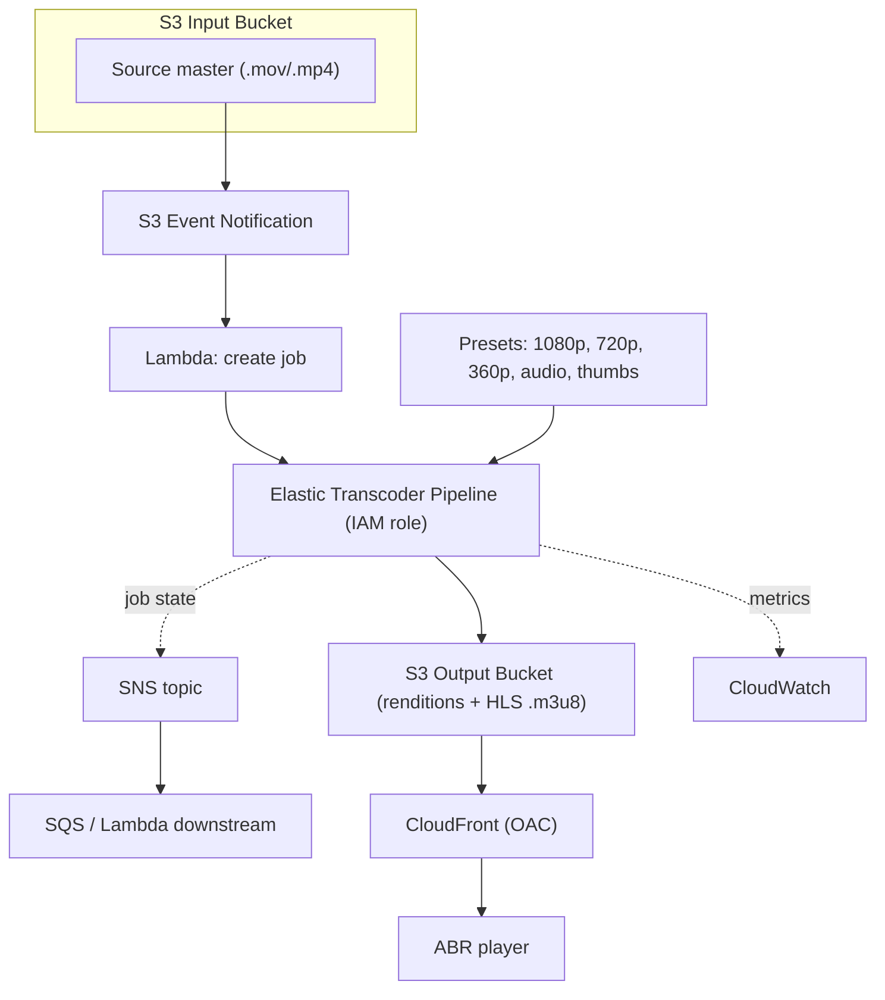

# Amazon Elastic Transcoder - Deep Dive

> Architecture of pipelines/jobs/presets, HLS adaptive bitrate output, event-driven transcoding, security (IAM role, KMS, DRM), monitoring with SNS/CloudWatch, limits & quotas, integrations, comparison with MediaConvert, and best practices by pillar.

See also: [01 - Amazon Elastic Transcoder Intro bits & bytes](01%20-%20Amazon%20Elastic%20Transcoder%20Intro%20bits%20%26%20bytes.md) · [03 - Amazon Elastic Transcoder Exam Scenarios](03%20-%20Amazon%20Elastic%20Transcoder%20Exam%20Scenarios.md) · [04 - Amazon Elastic Transcoder SRE Operations](04%20-%20Amazon%20Elastic%20Transcoder%20SRE%20Operations.md) · [00 - Media Services Overview](00%20-%20Media%20Services%20Overview.md)

---

## Table of Contents

- [1. Architecture & Data Flow](#1-architecture--data-flow)
- [2. Presets and Adaptive Bitrate (HLS) Output](#2-presets-and-adaptive-bitrate-hls-output)
- [3. Event-Driven Transcoding Pattern](#3-event-driven-transcoding-pattern)
- [4. Security: IAM, Encryption, DRM](#4-security-iam-encryption-drm)
- [5. Monitoring & Notifications](#5-monitoring--notifications)
- [6. Limits & Quotas](#6-limits--quotas)
- [7. Integration Matrix](#7-integration-matrix)
- [8. Elastic Transcoder vs MediaConvert (Detailed)](#8-elastic-transcoder-vs-mediaconvert-detailed)
- [9. Best Practices by Pillar](#9-best-practices-by-pillar)

---

---

## 1. Architecture & Data Flow

Elastic Transcoder is a **regional, fully managed** service. The moving parts:

- A **pipeline** binds: input bucket, output (and optional thumbnail) bucket, an **IAM service role**, optional **KMS key**, and an **SNS** topic for notifications.
- A **job** references one input object and a list of outputs (each output = one preset + a key/filename). One job can also emit a **master HLS playlist** stitching the renditions into one adaptive stream.
- Work is processed asynchronously; jobs move through **Submitted → Progressing → Complete / Warning / Error**.

The control plane is the API/console you use to define pipelines/presets/jobs; the data plane is the actual decode→re-encode of media bytes read from and written to S3.

[⬆ Back to top](#table-of-contents)

---

## 2. Presets and Adaptive Bitrate (HLS) Output

- A **preset** fully specifies an output: container (MP4, MPEG-TS for HLS, WebM, etc.), video codec (H.264/VP9/etc.), resolution, max bitrate, frame rate, audio codec (AAC), and thumbnail settings.
- **System presets** cover common targets (e.g., "HLS 1080p", "HLS 600k"). **Custom presets** let you tune bitrate ladders.
- **Adaptive bitrate (ABR)**: create several HLS presets at different bitrates (e.g., 2400k/1200k/600k) in one job and Elastic Transcoder generates the segmented `.ts` files plus a **master `.m3u8`** playlist. The player switches renditions based on bandwidth.
- **Thumbnails** can be generated at intervals for scrubbing/preview.

> The "bitrate ladder" (a set of renditions from low to high) is the core ABR concept. More rungs = smoother adaptation but more transcode cost and storage.

[⬆ Back to top](#table-of-contents)

---

## 3. Event-Driven Transcoding Pattern

The canonical serverless VOD pipeline:

1. App uploads to **S3 input** (pre-signed URL or direct).
2. **S3 Event Notification** → **Lambda**.
3. Lambda calls `CreateJob` on the pipeline with the right presets.
4. On completion, the pipeline publishes to **SNS** → Lambda/SQS updates a database, invalidates CloudFront, emails the user, etc.
5. Renditions served via **CloudFront** with **Origin Access Control** so the output bucket stays private.

This pattern needs **no always-on servers** and scales with upload volume.

[⬆ Back to top](#table-of-contents)

---

## 4. Security: IAM, Encryption, DRM

| Control                    | Detail                                                                                                                                                                   |
| :------------------------- | :----------------------------------------------------------------------------------------------------------------------------------------------------------------------- |
| **IAM service role**       | The pipeline assumes a role to **read input** and **write output** S3 buckets and publish to SNS. Scope it least-privilege to those buckets.                             |
| **Encryption at rest**     | Inputs/outputs can be encrypted with **SSE-S3** or **SSE-KMS**; Elastic Transcoder can also do **AES-128 client-side style** encryption of outputs (you supply the key). |
| **HLS content protection** | Supports **HLS AES-128 encryption** of segments with a key for basic content protection.                                                                                 |
| **DRM**                    | For full studio DRM use **MediaPackage/MediaConvert**; Elastic Transcoder's protection is limited to HLS AES-128.                                                        |
| **Private delivery**       | Keep the output bucket private and serve only through **CloudFront (OAC)** + **signed URLs/cookies** for paywalled content.                                              |

[⬆ Back to top](#table-of-contents)

---

## 5. Monitoring & Notifications

- **SNS notifications** per pipeline for `Progressing`, `Complete`, `Warning`, `Error` - the primary operational signal.
- **CloudWatch metrics**: number of jobs completed/errored, standby/active, throttling. Alarm on **error rate** and **job backlog**.
- **CloudTrail** records control-plane API calls (`CreateJob`, `CreatePipeline`) for audit.
- Use SNS `Error`/`Warning` to drive a **dead-letter / retry** workflow.

[⬆ Back to top](#table-of-contents)

---

## 6. Limits & Quotas

| Limit                          | Default (typical)              | Notes                                                              |
| :----------------------------- | :----------------------------- | :----------------------------------------------------------------- |
| Pipelines per region           | 4                              | Soft limit; request increase                                       |
| Concurrent jobs per pipeline   | 20 (processing)                | Extra jobs queue; add pipelines for parallelism                    |
| Max input file size / duration | Large (practical limits apply) | Very large masters: split or use MediaConvert                      |
| Output buckets per pipeline    | 1 (+1 thumbnail)               | Separate pipelines for different destinations                      |
| Region availability            | Limited set of regions         | **Not in every region** - check; MediaConvert has broader coverage |

> Exam-relevant: throughput scales by **adding pipelines** and by job concurrency; a single pipeline is not infinitely parallel.

[⬆ Back to top](#table-of-contents)

---

## 7. Integration Matrix

| Service                     | Integration                                                                                 |
| :-------------------------- | :------------------------------------------------------------------------------------------ | ----------- |
| **S3**                      | Source input + rendition output (the system of record)                                      |
| **Lambda**                  | Trigger jobs on upload; react to completion                                                 |
| **SNS**                     | Job-state notifications → fan-out to SQS/Lambda/email                                       |
| **CloudFront**              | Global cached delivery of HLS/MP4 renditions → [Amazon S3](01%20-%20S3%20Intro%20%26%20Core%20Concepts.md) |
| **KMS**                     | Encrypt inputs/outputs                                                                      |
| **CloudWatch / CloudTrail** | Metrics/alarms and API audit                                                                |
| **Step Functions**          | Orchestrate multi-step VOD pipelines (validate → transcode → publish)                       |
| **DataSync / Snow Family**  | Bulk-ingest large source libraries into S3 first → [01 - AWS DataSync Intro bits & bytes](01%20-%20AWS%20DataSync%20Intro%20bits%20%26%20bytes.md) |

[⬆ Back to top](#table-of-contents)

---

## 8. Elastic Transcoder vs MediaConvert (Detailed)

| Dimension            | Elastic Transcoder              | MediaConvert                                     |
| :------------------- | :------------------------------ | :----------------------------------------------- |
| Strategic status     | Legacy, maintained              | **Recommended** for VOD                          |
| Codec support        | H.264, VP8/9, AAC (older set)   | H.264, **HEVC/H.265**, AV1, ProRes, broad audio  |
| Input format breadth | Narrower                        | Very broad (professional formats)                |
| Output packaging     | MP4, HLS, WebM, Smooth          | HLS, DASH, CMAF, MSS, MP4, QuickTime             |
| Pricing model        | Per output minute by resolution | Per output minute by tier (basic/pro) + features |
| DRM                  | HLS AES-128 only                | Full DRM via SPEKE/MediaPackage                  |
| Quotas/regions       | Fewer regions                   | Broad                                            |

> Pick Elastic Transcoder when: it's explicitly named, the workload is simple H.264 HLS/MP4, or you maintain an existing pipeline. Pick **MediaConvert** for new builds, modern codecs, professional inputs, DASH/CMAF, or DRM.

[⬆ Back to top](#table-of-contents)

---

## 9. Best Practices by Pillar

**Security** - least-privilege pipeline IAM role scoped to specific buckets; SSE-KMS on input/output; private output bucket served via CloudFront OAC + signed URLs for premium content; HLS AES-128 where needed.

**Reliability** - use SNS `Error` notifications + retries/DLQ; validate inputs before submitting; keep source masters in S3 (versioned) so you can re-transcode.

**Performance Efficiency** - design a sensible **bitrate ladder**; parallelise with multiple pipelines; place buckets and CloudFront for your audience geography.

**Cost Optimization** - only produce renditions you serve; lifecycle/expire masters and stale renditions; deliver via CloudFront to cut S3 egress; consider MediaConvert if its codec efficiency (HEVC) reduces delivered bytes.

**Operational Excellence** - drive everything event-driven (S3→Lambda→job→SNS); orchestrate complex flows with Step Functions; IaC the pipelines/presets.

[⬆ Back to top](#table-of-contents)

---

> Continue to [03 - Amazon Elastic Transcoder Exam Scenarios](03%20-%20Amazon%20Elastic%20Transcoder%20Exam%20Scenarios.md).
