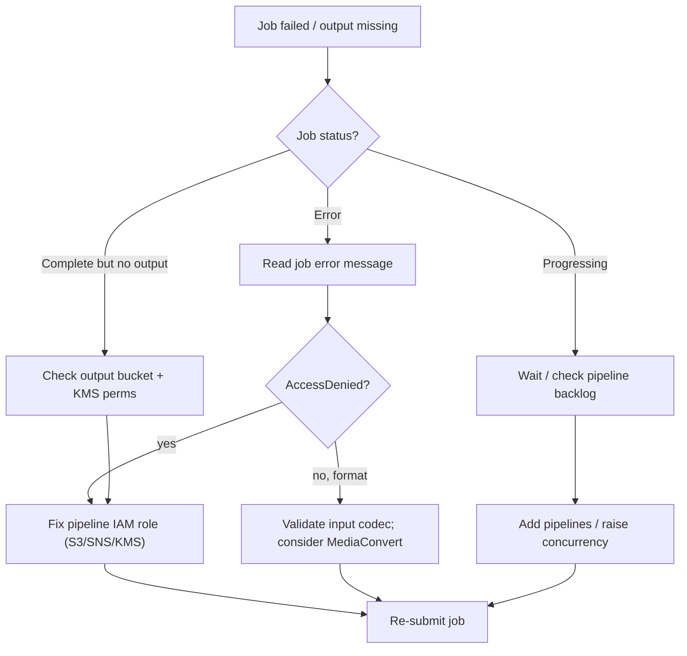

# Amazon Elastic Transcoder - SRE Operations

> Operational reality: where jobs fail and why, troubleshooting workflow, what to monitor/alarm, runbooks, real CLI/IaC examples (pipeline, preset, job, S3-event trigger, IAM role), production patterns by scale, and cost operations.

See also: [01 - Amazon Elastic Transcoder Intro bits & bytes](01%20-%20Amazon%20Elastic%20Transcoder%20Intro%20bits%20%26%20bytes.md) · [02 - Amazon Elastic Transcoder Deep Dive](02%20-%20Amazon%20Elastic%20Transcoder%20Deep%20Dive.md) · [03 - Amazon Elastic Transcoder Exam Scenarios](03%20-%20Amazon%20Elastic%20Transcoder%20Exam%20Scenarios.md) · [00 - Media Services Overview](00%20-%20Media%20Services%20Overview.md)

---

## Table of Contents

- [1. Common Errors (Symptom → Root Cause → Fix → Prevention)](#1-common-errors-symptom--root-cause--fix--prevention)
- [2. Troubleshooting Workflow](#2-troubleshooting-workflow)
- [3. What to Monitor and Alarm On](#3-what-to-monitor-and-alarm-on)
- [4. Runbooks](#4-runbooks)
- [5. Real Examples](#5-real-examples)
- [6. Production Patterns by Scale](#6-production-patterns-by-scale)
- [7. Cost Operations](#7-cost-operations)
- [8. Migration to MediaConvert](#8-migration-to-mediaconvert)

---

## 1. Common Errors (Symptom → Root Cause → Fix → Prevention)

### Job fails immediately with AccessDenied

- **Cause:** Pipeline IAM role lacks `s3:GetObject` on input or `s3:PutObject` on output, or `sns:Publish`.
- **Fix:** Repair the role policy to grant exactly those actions on the bound buckets/topic.
- **Prevention:** Provision the role with the pipeline via IaC; least-privilege but complete.

### Output never appears in S3

- **Cause:** Wrong output bucket/key prefix, KMS key the role can't use, or job still Progressing.
- **Fix:** Check job status; verify output bucket + KMS key policy grants the role `kms:GenerateDataKey`/`Decrypt`.
- **Prevention:** Test delivery end-to-end after pipeline creation.

### "Unsupported input" / job Error

- **Cause:** Input codec/container not supported by Elastic Transcoder.
- **Fix:** Re-wrap/convert the source, or move the workload to **MediaConvert** (broader input support).
- **Prevention:** Validate input format (e.g., MediaInfo) before `CreateJob`.

### Player stutters / no adaptive switching

- **Cause:** Single rendition (no ABR ladder) or missing master `.m3u8` playlist.
- **Fix:** Create multiple HLS presets in the job and a master playlist.
- **Prevention:** Standardise a bitrate ladder preset set.

### Jobs back up / high latency

- **Cause:** Single pipeline saturated (concurrency limit), large files serialised.
- **Fix:** Add pipelines, split very large inputs, raise quotas.
- **Prevention:** Capacity-plan pipelines for peak upload bursts; SQS backpressure.

### CloudFront serves stale/old rendition

- **Cause:** Same object key overwritten; cached at the edge.
- **Fix:** Invalidate the path, or use versioned/unique keys per render.
- **Prevention:** Include a content hash/version in output keys.

[⬆ Back to top](#table-of-contents)

---

## 2. Troubleshooting Workflow



[⬆ Back to top](#table-of-contents)

---

## 3. What to Monitor and Alarm On

| Signal                                       | Why                              |
| :------------------------------------------- | :------------------------------- |
| CloudWatch **Errored jobs** count            | Transcoding failures             |
| **Job backlog / age** (queued time)          | Capacity/throughput issue        |
| **Throttling** on `CreateJob`                | API rate exceeded                |
| SNS `Error`/`Warning` messages               | Per-job failure detail           |
| S3 output object creation rate               | Pipeline producing results       |
| CloudTrail `CreatePipeline`/`DeletePipeline` | Unexpected control-plane changes |

[⬆ Back to top](#table-of-contents)

---

## 4. Runbooks

### Runbook: stand up a serverless VOD pipeline

1. Create **input** and **output** S3 buckets (block public access).
2. Create the **IAM service role** (read input, write output, publish SNS, use KMS).
3. Create an SNS topic for notifications; subscribe a processing Lambda/SQS.
4. Create the **pipeline** (input/output buckets, role, SNS, optional KMS).
5. Create **HLS presets** for the bitrate ladder (or use system presets).
6. Wire **S3 event → Lambda** that calls `CreateJob`.
7. Put **CloudFront (OAC)** in front of the output bucket; signed URLs for premium.

### Runbook: surge in failed jobs

1. Inspect SNS `Error` payloads / job error messages.
2. Classify: permissions vs format vs throttling.
3. Fix root cause (role/KMS, input validation, raise quotas/add pipelines).
4. Re-submit failed jobs from a DLQ.

[⬆ Back to top](#table-of-contents)

---

## 5. Real Examples

### Create a pipeline

```bash
aws elastictranscoder create-pipeline \
  --name vod-standard \
  --input-bucket my-vod-input \
  --output-bucket my-vod-output \
  --role arn:aws:iam::111111111111:role/ElasticTranscoderRole \
  --notifications "Progressing=arn:aws:sns:ap-south-1:111111111111:et-progress,Completed=arn:aws:sns:ap-south-1:111111111111:et-done,Warning=arn:aws:sns:ap-south-1:111111111111:et-warn,Error=arn:aws:sns:ap-south-1:111111111111:et-error"
```

### Create a job with an HLS rendition + thumbnails

```bash
aws elastictranscoder create-job \
  --pipeline-id 1234567890123-abcdef \
  --input '{"Key":"uploads/source.mov"}' \
  --outputs '[{"Key":"hls/720p.ts","PresetId":"1351620000001-200015","ThumbnailPattern":"thumbs/720p-{count}","SegmentDuration":"6"}]'
```

### IAM service role trust + permissions (sketch)

```json
{
  "Version": "2012-10-17",
  "Statement": [
    {
      "Effect": "Allow",
      "Action": ["s3:GetObject"],
      "Resource": "arn:aws:s3:::my-vod-input/*"
    },
    {
      "Effect": "Allow",
      "Action": ["s3:PutObject"],
      "Resource": "arn:aws:s3:::my-vod-output/*"
    },
    {
      "Effect": "Allow",
      "Action": ["sns:Publish"],
      "Resource": "arn:aws:sns:ap-south-1:111111111111:et-*"
    },
    {
      "Effect": "Allow",
      "Action": ["kms:GenerateDataKey", "kms:Decrypt"],
      "Resource": "arn:aws:kms:ap-south-1:111111111111:key/abcd"
    }
  ]
}
```

### Lambda trigger (Python sketch) - create job on upload

```python
import boto3, os
et = boto3.client("elastictranscoder")

def handler(event, _ctx):
    for rec in event["Records"]:
        key = rec["s3"]["object"]["key"]
        et.create_job(
            PipelineId=os.environ["PIPELINE_ID"],
            Input={"Key": key},
            Outputs=[
                {"Key": f"hls/2400k/{key}.ts", "PresetId": os.environ["PRESET_2400"], "SegmentDuration": "6"},
                {"Key": f"hls/1200k/{key}.ts", "PresetId": os.environ["PRESET_1200"], "SegmentDuration": "6"},
                {"Key": f"hls/600k/{key}.ts",  "PresetId": os.environ["PRESET_600"],  "SegmentDuration": "6"},
            ],
        )
```

[⬆ Back to top](#table-of-contents)

---

## 6. Production Patterns by Scale

| Context           | Pattern                                                                                                 |
| :---------------- | :------------------------------------------------------------------------------------------------------ |
| **Startup / MVP** | One pipeline, system HLS presets, S3→Lambda trigger, CloudFront delivery.                               |
| **Growth**        | Custom bitrate ladder, SNS error → DLQ/retry, separate high-priority pipeline.                          |
| **Enterprise**    | Step Functions orchestration, KMS-encrypted buckets, signed-URL premium delivery, multi-region masters. |
| **Modernising**   | Migrate file transcoding to **MediaConvert** for HEVC/CMAF/DRM and broader regions.                     |

[⬆ Back to top](#table-of-contents)

---

## 7. Cost Operations

- Billed **per output minute by resolution** - **prune the bitrate ladder** to renditions actually played.
- Use **S3 lifecycle** to transition/expire source masters and unused renditions.
- Deliver via **CloudFront** to cut S3 egress and improve cache hit ratio.
- Consolidate pipelines; avoid generating duplicate renditions.
- Evaluate **MediaConvert HEVC** - smaller files can lower CDN/storage costs at higher device support.

[⬆ Back to top](#table-of-contents)

---

## 8. Migration to MediaConvert

AWS recommends **MediaConvert** for new and existing file transcoding. Migration approach:

1. Map each Elastic Transcoder **preset** to a MediaConvert **output preset/group** (HLS/DASH/CMAF).
2. Replace `CreateJob` calls (Lambda) with MediaConvert `CreateJob` (job templates + queues).
3. Keep the same **S3 input/output** layout and **CloudFront** delivery to minimise change.
4. Validate quality/bitrate parity, then cut the S3-event trigger over.
5. Decommission the Elastic Transcoder pipeline once parity is confirmed.

[⬆ Back to top](#table-of-contents)

---

Related: [01 - Amazon Elastic Transcoder Intro bits & bytes](01%20-%20Amazon%20Elastic%20Transcoder%20Intro%20bits%20%26%20bytes.md) · [02 - Amazon Elastic Transcoder Deep Dive](02%20-%20Amazon%20Elastic%20Transcoder%20Deep%20Dive.md) · [03 - Amazon Elastic Transcoder Exam Scenarios](03%20-%20Amazon%20Elastic%20Transcoder%20Exam%20Scenarios.md) · [01 - Amazon Kinesis Video Streams Intro bits & bytes](01%20-%20Amazon%20Kinesis%20Video%20Streams%20Intro%20bits%20%26%20bytes.md) · [00 - Media Services Overview](00%20-%20Media%20Services%20Overview.md)
