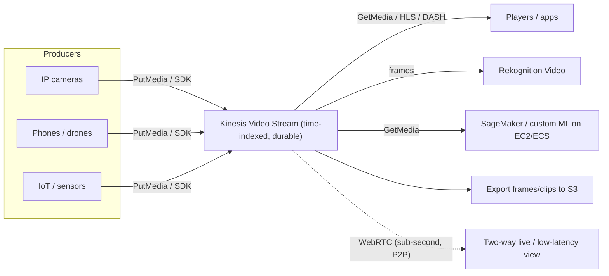

# Amazon Kinesis Video Streams - Intro bits & bytes

> Kinesis Video Streams (KVS) **securely ingests, durably stores, time-indexes, and lets you replay or analyse** streaming media (video, audio, and other time-encoded data like RADAR/LIDAR) from millions of devices - cameras, phones, drones, doorbells. On the exam it's the answer to _"ingest live video from many devices for playback and machine learning"_ - the **streaming** counterpart to file-based Elastic Transcoder.

See also: [02 - Amazon Kinesis Video Streams Deep Dive](02%20-%20Amazon%20Kinesis%20Video%20Streams%20Deep%20Dive.md) · [03 - Amazon Kinesis Video Streams Exam Scenarios](03%20-%20Amazon%20Kinesis%20Video%20Streams%20Exam%20Scenarios.md) · [04 - Amazon Kinesis Video Streams SRE Operations](04%20-%20Amazon%20Kinesis%20Video%20Streams%20SRE%20Operations.md) · [01 - Amazon Elastic Transcoder Intro bits & bytes](01%20-%20Amazon%20Elastic%20Transcoder%20Intro%20bits%20%26%20bytes.md) · [00 - Media Services Overview](00%20-%20Media%20Services%20Overview.md)

---

## Table of Contents

- [1. The Problem It Solves](#1-the-problem-it-solves)
- [2. Core Concepts: Producers, Streams, Fragments, Consumers](#2-core-concepts-producers-streams-fragments-consumers)
- [3. Two Modes: Durable Streaming vs WebRTC](#3-two-modes-durable-streaming-vs-webrtc)
- [4. The End-to-End Flow](#4-the-end-to-end-flow)
- [5. When To Use It / When NOT To Use It](#5-when-to-use-it--when-not-to-use-it)
- [6. KVS vs Kinesis Data Streams vs Elastic Transcoder](#6-kvs-vs-kinesis-data-streams-vs-elastic-transcoder)
- [7. Cost Model](#7-cost-model)
- [8. Mini-Quiz](#8-mini-quiz)

---

---

## 1. The Problem It Solves

Streaming media from **huge fleets of devices** is hard: variable networks, millions of producers, the need to **store with time indexes** so you can replay "camera 12 between 14:03 and 14:07", and the need to **feed frames into ML** for detection. Building that ingestion + durable, time-indexed store + playback + ML plumbing yourself is enormous.

KVS is a **fully managed** service that does exactly this: devices push media in; KVS **buffers, encrypts, indexes by timestamp, and durably stores** it; you **consume** it for real-time or batch processing, **play it back** via HLS/DASH, or **stream low-latency two-way** via **WebRTC**.

> Mental model: KVS is a **time-machine pipe for live media** - millions of cameras in one end; durable, timestamped, replayable, ML-ready media out the other. It is _streaming/live_, **not** file transcoding (that's Elastic Transcoder/MediaConvert).

[⬆ Back to top](#table-of-contents)

---

## 2. Core Concepts: Producers, Streams, Fragments, Consumers

| Concept      | What it is                                                                                                                              |
| :----------- | :-------------------------------------------------------------------------------------------------------------------------------------- |
| **Producer** | The source pushing media - an IP camera, phone, or app using the **KVS Producer SDK** (`PutMedia`).                                     |
| **Stream**   | The named resource that receives, indexes, and stores media from a producer, with a **retention period** (0 = no storage, up to years). |
| **Fragment** | A self-contained sequence of frames (the unit KVS indexes/stores), each with a **timestamp** and fragment number.                       |
| **Chunk**    | A fragment plus KVS metadata returned to consumers.                                                                                     |
| **Consumer** | Anything that reads the stream: `GetMedia`/`GetMediaForFragmentList`, **HLS/DASH** playback, Rekognition Video, or custom apps.         |

> Time-indexing by **fragment timestamp** is the superpower: you can replay any time window or seek to a moment.

[⬆ Back to top](#table-of-contents)

---

## 3. Two Modes: Durable Streaming vs WebRTC

KVS has **two distinct APIs** - know the difference for the exam:

|             | **KVS (durable streaming)**                    | **KVS WebRTC**                                                   |
| :---------- | :--------------------------------------------- | :--------------------------------------------------------------- |
| Purpose     | Ingest + **durably store** + replay + ML       | **Ultra-low-latency** (sub-second) **two-way** live              |
| Storage     | Yes (retention period)                         | **No durable storage** (peer-to-peer media)                      |
| Latency     | Seconds                                        | Sub-second                                                       |
| Typical use | Video archive, post-event review, ML on frames | Live camera view, two-way audio (e.g., smart doorbell talk-back) |
| Protocol    | `PutMedia`/`GetMedia`, HLS/DASH                | WebRTC signaling + STUN/TURN                                     |

> Exam cue: **"sub-second / two-way / live talk-back / peer-to-peer" → KVS WebRTC. "store and replay / run ML on recorded video / time-indexed" → KVS (durable streaming).**

[⬆ Back to top](#table-of-contents)

---

## 4. The End-to-End Flow

1. A **producer** (camera/app via Producer SDK) calls `PutMedia` to a **stream**.
2. KVS **buffers, encrypts (KMS), time-indexes**, and stores fragments for the **retention period**.
3. **Consumers** read in real time (`GetMedia`) or by time range (`GetMediaForFragmentList`), or play via **HLS/DASH**.
4. **Rekognition Video** can analyse the stream for faces/objects/motion; results flow to **Kinesis Data Streams** → Lambda.
5. Frames/clips can be **exported to S3** for long-term archive or batch ML.

[⬆ Back to top](#table-of-contents)

---

## 5. When To Use It / When NOT To Use It

**Use it when:**

- Ingesting **live video/audio from many devices** for storage, playback, or ML.
- You need **time-indexed replay** ("what did camera X see at time T").
- You need **real-time video analytics** (Rekognition Video, custom ML).
- You need **low-latency two-way** live media → **KVS WebRTC**.

**Don't use it when:**

- You have **files** to transcode into device renditions → **Elastic Transcoder / MediaConvert**.
- You need **broadcast-grade live encoding/channels** → **MediaLive + MediaPackage**.
- You're streaming **non-media records** (JSON/logs/clickstream) → **Kinesis Data Streams / Firehose**.
- You just need **store + global delivery** of finished video → **S3 + CloudFront**.

[⬆ Back to top](#table-of-contents)

---

## 6. KVS vs Kinesis Data Streams vs Elastic Transcoder

|           | **Kinesis Video Streams**            | **Kinesis Data Streams**     | **Elastic Transcoder**  |
| :-------- | :----------------------------------- | :--------------------------- | :---------------------- |
| Payload   | Time-encoded **media** (video/audio) | Generic **data records**     | **Media files** (VOD)   |
| Pattern   | Ingest/store/replay live media       | Real-time data pipeline      | Batch file transcode    |
| Storage   | Durable, time-indexed                | Records for retention window | S3 in/out               |
| Consumers | HLS/DASH, Rekognition, ML            | Lambda, KCL apps, Firehose   | (none - produces files) |

> Don't confuse the Kinesis family: **Video** = media streams; **Data** = generic records; **Firehose** = load to S3/Redshift/etc. KVS is the media one.

[⬆ Back to top](#table-of-contents)

---

## 7. Cost Model

- **Data ingested** (per GB) into streams.
- **Data consumed/retrieved** (per GB) by consumers.
- **Storage** (per GB-month) for the retention period.
- **WebRTC**: priced on **signaling channels**, signaling messages, and **TURN streaming** minutes.
- Surrounding costs: **Rekognition Video** analysis, **KMS**, **S3** for exported clips, data transfer.

> Cost lever: set the **retention period** to what you actually need (storing everything for a year is expensive), and only retrieve the time windows you analyse.

[⬆ Back to top](#table-of-contents)

---

## 8. Mini-Quiz

**Q1:** Thousands of security cameras must stream to AWS for replay and ML detection. Service?
_A:_ **Kinesis Video Streams** (durable streaming) + Rekognition Video.

**Q2:** A smart doorbell needs **two-way, sub-second** audio/video. Which KVS mode?
_A:_ **KVS WebRTC** (no durable storage, peer-to-peer, ultra-low latency).

**Q3:** What unit does KVS time-index and store?
_A:_ **Fragments** (timestamped sequences of frames).

**Q4:** You need to transcode uploaded MP4 files into HLS. KVS?
_A:_ **No** - that's **Elastic Transcoder / MediaConvert** (file/VOD).

**Q5:** Streaming clickstream JSON records, not media?
_A:_ **Kinesis Data Streams**, not Video Streams.

---

> Continue to [02 - Amazon Kinesis Video Streams Deep Dive](02%20-%20Amazon%20Kinesis%20Video%20Streams%20Deep%20Dive.md).
