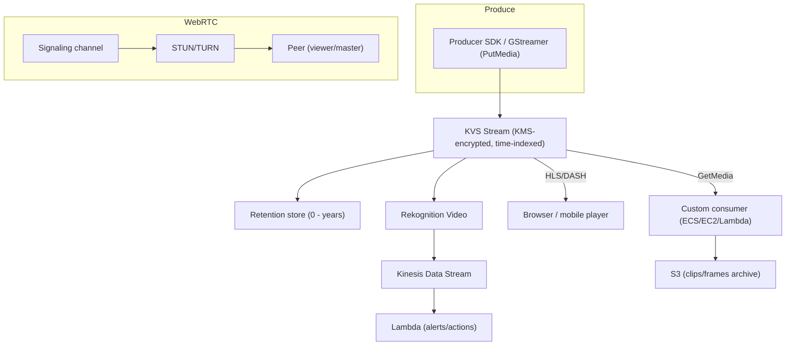

# Amazon Kinesis Video Streams - Deep Dive

> Architecture of producers/streams/fragments/consumers, the durable-streaming vs WebRTC planes, playback (HLS/DASH), ML integration (Rekognition Video), security (KMS, IAM), monitoring, limits & quotas, integration matrix, comparisons, and best practices by pillar.

See also: [01 - Amazon Kinesis Video Streams Intro bits & bytes](01%20-%20Amazon%20Kinesis%20Video%20Streams%20Intro%20bits%20%26%20bytes.md) · [03 - Amazon Kinesis Video Streams Exam Scenarios](03%20-%20Amazon%20Kinesis%20Video%20Streams%20Exam%20Scenarios.md) · [04 - Amazon Kinesis Video Streams SRE Operations](04%20-%20Amazon%20Kinesis%20Video%20Streams%20SRE%20Operations.md) · [00 - Media Services Overview](00%20-%20Media%20Services%20Overview.md)

---

## Table of Contents

- [1. Architecture & Data Flow](#1-architecture--data-flow)
- [2. Producer Side: SDKs and PutMedia](#2-producer-side-sdks-and-putmedia)
- [3. Consumer Side: GetMedia, HLS/DASH, Fragment Selectors](#3-consumer-side-getmedia-hlsdash-fragment-selectors)
- [4. WebRTC Plane in Depth](#4-webrtc-plane-in-depth)
- [5. Real-Time ML: Rekognition Video Pipeline](#5-real-time-ml-rekognition-video-pipeline)
- [6. Security: KMS, IAM, Encryption in Transit](#6-security-kms-iam-encryption-in-transit)
- [7. Monitoring & Observability](#7-monitoring--observability)
- [8. Limits & Quotas](#8-limits--quotas)
- [9. Integration Matrix](#9-integration-matrix)
- [10. Comparisons](#10-comparisons)
- [11. Best Practices by Pillar](#11-best-practices-by-pillar)

---

---

## 1. Architecture & Data Flow

KVS is **regional and fully managed**. There are two largely independent planes:

- **Durable streaming plane** - producers `PutMedia` → KVS indexes media into **fragments** with timestamps, encrypts with **KMS**, and stores for the **retention period**. Consumers pull via `GetMedia`/`GetMediaForFragmentList`, or via **HLS/DASH** streaming sessions for playback.
- **WebRTC plane** - a **signaling channel** brokers a peer connection; media flows **peer-to-peer** (via STUN, relayed by **TURN** when needed) at **sub-second** latency, with **no durable storage**.

Both planes share the KVS resource model (streams / signaling channels) and IAM/KMS security.

[⬆ Back to top](#table-of-contents)

---

## 2. Producer Side: SDKs and PutMedia

- **Producer SDK** (C/C++/Java/Android) and a **GStreamer plugin** let cameras/apps push media; many IP cameras embed it.
- `PutMedia` streams fragments continuously; KVS assigns **fragment numbers** and **producer/server timestamps**.
- Media is typically **H.264/H.265 video + AAC audio** in a Matroska (MKV) container envelope.
- Producers handle reconnection/buffering for flaky networks; the SDK manages backpressure.

> Each **device = one stream** is the common model (millions of streams), though you size by ingest throughput, not just count.

[⬆ Back to top](#table-of-contents)

---

## 3. Consumer Side: GetMedia, HLS/DASH, Fragment Selectors

- **`GetMedia`** - low-level, real-time pull of raw fragments for custom processing.
- **`GetMediaForFragmentList`** - pull specific fragments (e.g., results of a fragment search by time).
- **HLS / DASH** - `GetHLSStreamingSessionURL` / `GetDASHStreamingSessionURL` give a player-ready URL; great for browsers/mobile with **no custom decoding**.
- **Fragment selectors** - choose **LIVE**, **LIVE_REPLAY**, or **ON_DEMAND** by timestamp range to seek into stored media.
- **GetClip** - export an MP4 clip of a time range (e.g., to save to S3).

[⬆ Back to top](#table-of-contents)

---

## 4. WebRTC Plane in Depth

| Component             | Role                                                                        |
| :-------------------- | :-------------------------------------------------------------------------- |
| **Signaling channel** | KVS resource peers use to discover each other and exchange SDP/ICE          |
| **STUN**              | Helps peers find their public address for direct connection                 |
| **TURN**              | Relays media when direct P2P is blocked by NAT/firewall (billed per minute) |
| **Master / Viewer**   | The device (master) and the watcher(s) (viewer) roles                       |

- Use for **live monitoring, two-way audio/video, remote control** (doorbells, baby monitors, telepresence).
- **No storage** - if you also need to record, run a parallel durable stream.
- Sub-second latency vs HLS playback's multi-second latency.

[⬆ Back to top](#table-of-contents)

---

## 5. Real-Time ML: Rekognition Video Pipeline

The canonical analytics pattern:

1. Camera → **KVS stream**.
2. **Rekognition Video** stream processor reads the KVS stream and detects faces/objects/labels.
3. Detections are published to a **Kinesis Data Stream**.
4. **Lambda** consumes detections → alerts (SNS), writes to DynamoDB, triggers workflows.

For **custom models**, a consumer on ECS/EC2 uses `GetMedia`, decodes frames, and calls **SageMaker** endpoints.

[⬆ Back to top](#table-of-contents)

---

## 6. Security: KMS, IAM, Encryption in Transit

| Control                   | Detail                                                                                   |
| :------------------------ | :--------------------------------------------------------------------------------------- |
| **Encryption at rest**    | Every stream is **encrypted with KMS** (AWS-managed or customer-managed CMK).            |
| **Encryption in transit** | TLS for `PutMedia`/`GetMedia`; DTLS/SRTP for WebRTC media.                               |
| **IAM**                   | Fine-grained access to streams/signaling channels; producers/consumers use scoped roles. |
| **Per-device identity**   | Use IoT/Cognito or scoped IAM roles so each device only writes its own stream.           |
| **Private consumption**   | Consumers run in your VPC; no public exposure of streams.                                |

[⬆ Back to top](#table-of-contents)

---

## 7. Monitoring & Observability

- **CloudWatch metrics**: `PutMedia.IncomingBytes/Fragments`, `GetMedia.OutgoingBytes`, `PutMedia.Latency`, error counts, and WebRTC signaling/TURN metrics.
- Alarm on **producer disconnects** (incoming bytes drop to 0), high `PutMedia` latency, and fragment errors.
- **CloudTrail** for control-plane API audit (`CreateStream`, `DeleteStream`, `UpdateDataRetention`).
- Track **storage growth** vs retention to control cost.

[⬆ Back to top](#table-of-contents)

---

## 8. Limits & Quotas

| Limit                             | Default (typical)          | Notes                                        |
| :-------------------------------- | :------------------------- | :------------------------------------------- |
| Streams per account/region        | Thousands (soft)           | Scales to millions of devices with increases |
| `PutMedia` connections per stream | 1 active producer          | One producer per stream at a time            |
| `GetMedia` consumers per stream   | Multiple (limited)         | Use HLS/DASH or fan-out for many viewers     |
| Fragment duration                 | ~1-10 s typical            | Affects latency/seek granularity             |
| Retention period                  | 0 (no store) to years      | Drives storage cost                          |
| Max fragment/data rate            | Per-stream throughput caps | Very high-bitrate sources may need tuning    |

[⬆ Back to top](#table-of-contents)

---

## 9. Integration Matrix

| Service                     | Integration                                                                 |
| :-------------------------- | :-------------------------------------------------------------------------- | ----------- |
| **Rekognition Video**       | Real-time face/object/label detection on the stream                         |
| **Kinesis Data Streams**    | Carries Rekognition detections downstream                                   |
| **Lambda**                  | React to detections; orchestrate alerts/actions                             |
| **SageMaker**               | Custom ML inference on decoded frames                                       |
| **S3**                      | Archive exported clips/frames (`GetClip`) → [Amazon S3](01%20-%20S3%20Intro%20%26%20Core%20Concepts.md) |
| **KMS**                     | At-rest encryption of streams                                               |
| **IoT**                     | Device identity/management feeding producers                                |
| **SNS**                     | Alerting on detections/events                                               |
| **CloudWatch / CloudTrail** | Metrics/alarms and API audit                                                |

[⬆ Back to top](#table-of-contents)

---

## 10. Comparisons

### KVS durable vs KVS WebRTC

|         | Durable            | WebRTC              |
| :------ | :----------------- | :------------------ |
| Latency | Seconds            | Sub-second          |
| Storage | Yes                | No                  |
| Two-way | No (pull/playback) | Yes (peer-to-peer)  |
| Use     | Record/replay/ML   | Live view/talk-back |

### KVS vs MediaLive

|        | KVS                    | MediaLive                               |
| :----- | :--------------------- | :-------------------------------------- |
| Source | Many devices/cameras   | Professional live encoders              |
| Goal   | Ingest/store/analyse   | Broadcast-grade encode for distribution |
| Output | HLS/DASH, frames to ML | ABR outputs to MediaPackage/CDN         |

[⬆ Back to top](#table-of-contents)

---

## 11. Best Practices by Pillar

**Security** - customer-managed KMS keys on sensitive streams; per-device scoped identities (IoT/Cognito/IAM); consume inside the VPC; least-privilege on signaling channels.

**Reliability** - producer SDK reconnection/buffering; alarm on incoming-bytes-zero; for record+live, run a durable stream alongside WebRTC.

**Performance Efficiency** - tune fragment duration for the latency/seek trade-off; use HLS/DASH (not many `GetMedia` consumers) for fan-out; WebRTC for sub-second needs.

**Cost Optimization** - set **retention** to actual need; retrieve only required time windows; export only needed clips to S3; watch TURN minutes for WebRTC.

**Operational Excellence** - IaC streams/channels; standardise the Rekognition→KDS→Lambda detection pipeline; dashboards on ingest health per fleet.

[⬆ Back to top](#table-of-contents)

---

> Continue to [03 - Amazon Kinesis Video Streams Exam Scenarios](03%20-%20Amazon%20Kinesis%20Video%20Streams%20Exam%20Scenarios.md).
