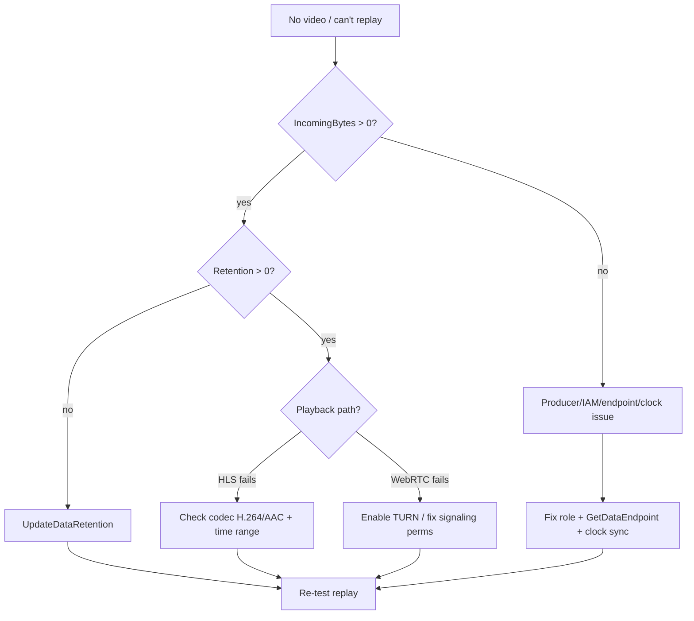

# Amazon Kinesis Video Streams - SRE Operations

> Operational reality: where producers/consumers break, troubleshooting workflow, what to monitor/alarm, runbooks, real CLI/IaC examples (create stream, retention, HLS URL, Rekognition processor, IAM), production patterns by scale, and cost operations.

See also: [01 - Amazon Kinesis Video Streams Intro bits & bytes](01%20-%20Amazon%20Kinesis%20Video%20Streams%20Intro%20bits%20%26%20bytes.md) · [02 - Amazon Kinesis Video Streams Deep Dive](02%20-%20Amazon%20Kinesis%20Video%20Streams%20Deep%20Dive.md) · [03 - Amazon Kinesis Video Streams Exam Scenarios](03%20-%20Amazon%20Kinesis%20Video%20Streams%20Exam%20Scenarios.md) · [00 - Media Services Overview](00%20-%20Media%20Services%20Overview.md)

---

## Table of Contents

- [1. Common Errors (Symptom → Root Cause → Fix → Prevention)](#1-common-errors-symptom--root-cause--fix--prevention)
- [2. Troubleshooting Workflow](#2-troubleshooting-workflow)
- [3. What to Monitor and Alarm On](#3-what-to-monitor-and-alarm-on)
- [4. Runbooks](#4-runbooks)
- [5. Real Examples](#5-real-examples)
- [6. Production Patterns by Scale](#6-production-patterns-by-scale)
- [7. Cost Operations](#7-cost-operations)
- [8. Disaster Recovery & Resilience](#8-disaster-recovery--resilience)

---

## 1. Common Errors (Symptom → Root Cause → Fix → Prevention)

### Producer can't push (PutMedia fails)

- **Cause:** IAM lacks `kinesisvideo:PutMedia`/`GetDataEndpoint`, wrong endpoint, or clock skew.
- **Fix:** Grant the producer role those actions; call `GetDataEndpoint` first; sync device clock (timestamps matter).
- **Prevention:** Per-device scoped roles via IoT/Cognito; SDK handles endpoint/retry.

### No video stored / can't replay

- **Cause:** Retention period set to **0** (no storage).
- **Fix:** `UpdateDataRetention` to a non-zero period.
- **Prevention:** Set retention at stream creation per requirement.

### HLS/DASH playback URL fails

- **Cause:** Stream has no fragments in the requested window, codec not HLS-compatible, or expired session.
- **Fix:** Verify fragments exist for the time range; ensure H.264/AAC; regenerate session URL.
- **Prevention:** Validate producer codec; choose correct fragment selector.

### WebRTC peers won't connect

- **Cause:** NAT/firewall blocks P2P and TURN not enabled/allowed.
- **Fix:** Enable TURN; check signaling channel permissions and ICE config.
- **Prevention:** Always provision TURN for restrictive networks.

### Consumer lag / missed frames

- **Cause:** Too many `GetMedia` consumers or slow processing.
- **Fix:** Use HLS/DASH for fan-out; scale consumers (ECS); buffer.
- **Prevention:** Design fan-out via playback, not many raw consumers.

### Rekognition produces no detections

- **Cause:** Stream processor not started, wrong input stream, or no KDS output configured.
- **Fix:** Start the stream processor; verify input KVS + output KDS ARNs and IAM.
- **Prevention:** IaC the processor with correct roles; alarm on detection rate.

[⬆ Back to top](#table-of-contents)

---

## 2. Troubleshooting Workflow



[⬆ Back to top](#table-of-contents)

---

## 3. What to Monitor and Alarm On

| Signal                                          | Why                              |
| :---------------------------------------------- | :------------------------------- |
| `PutMedia.IncomingBytes` = 0                    | Producer/camera disconnected     |
| `PutMedia.Latency` high                         | Network/producer issues          |
| `GetMedia.OutgoingBytes` drop                   | Consumer stalled                 |
| Fragment/`PutMedia` error count                 | Ingestion failures               |
| WebRTC TURN minutes / signaling errors          | Connectivity + cost              |
| Storage GB vs retention                         | Cost growth                      |
| Rekognition detection rate anomalies            | Analytics pipeline health        |
| CloudTrail `DeleteStream`/`UpdateDataRetention` | Unexpected control-plane changes |

[⬆ Back to top](#table-of-contents)

---

## 4. Runbooks

### Runbook: onboard a camera fleet

1. Create a **stream per device** (or per logical source) with the required **retention**.
2. Issue **per-device identity** (IoT/Cognito) with IAM scoped to that stream's `PutMedia`.
3. Deploy the **Producer SDK/GStreamer** config to devices.
4. Add **CloudWatch alarms** on IncomingBytes=0 per stream/fleet.
5. (Optional) Start a **Rekognition Video** processor → KDS → Lambda for detection.

### Runbook: camera went dark

1. Alarm fires (IncomingBytes=0).
2. Check device connectivity/power; verify credentials/clock.
3. Confirm `GetDataEndpoint`/`PutMedia` permissions unchanged.
4. Restart producer; confirm fragments resume; clear alarm.

### Runbook: incident footage retrieval

1. Identify cameras + exact time window.
2. Use **ON_DEMAND fragment selector** or **GetClip** per stream for the window.
3. Export MP4 clips to a secured S3 evidence bucket (Object Lock).

[⬆ Back to top](#table-of-contents)

---

## 5. Real Examples

### Create a stream with 7-day retention + KMS

```bash
aws kinesisvideo create-stream \
  --stream-name cam-lobby-01 \
  --data-retention-in-hours 168 \
  --media-type "video/h264" \
  --kms-key-id arn:aws:kms:ap-south-1:111111111111:key/abcd
```

### Change retention later

```bash
aws kinesisvideo update-data-retention \
  --stream-name cam-lobby-01 \
  --current-version <ver> \
  --operation INCREASE_DATA_RETENTION \
  --data-retention-change-in-hours 168
```

### Get an HLS playback URL (browser player)

```bash
EP=$(aws kinesisvideo get-data-endpoint --stream-name cam-lobby-01 \
  --api-name GET_HLS_STREAMING_SESSION_URL --query DataEndpoint --output text)
aws kinesis-video-archived-media get-hls-streaming-session-url \
  --endpoint-url "$EP" --stream-name cam-lobby-01 \
  --playback-mode LIVE
```

### Start a Rekognition Video stream processor (sketch)

```bash
aws rekognition create-stream-processor \
  --name lobby-face-detect \
  --input '{"KinesisVideoStream":{"Arn":"arn:aws:kinesisvideo:ap-south-1:111111111111:stream/cam-lobby-01/123"}}' \
  --stream-processor-output '{"KinesisDataStream":{"Arn":"arn:aws:kinesis:ap-south-1:111111111111:stream/rekognition-out"}}' \
  --role-arn arn:aws:iam::111111111111:role/RekVideoRole \
  --settings '{"FaceSearch":{"CollectionId":"employees"}}'
aws rekognition start-stream-processor --name lobby-face-detect
```

### Per-device producer IAM (sketch)

```json
{
  "Version": "2012-10-17",
  "Statement": [
    {
      "Effect": "Allow",
      "Action": ["kinesisvideo:GetDataEndpoint", "kinesisvideo:PutMedia"],
      "Resource": "arn:aws:kinesisvideo:ap-south-1:111111111111:stream/cam-lobby-01/*"
    }
  ]
}
```

[⬆ Back to top](#table-of-contents)

---

## 6. Production Patterns by Scale

| Context                | Pattern                                                                                                       |
| :--------------------- | :------------------------------------------------------------------------------------------------------------ |
| **Pilot**              | A few streams, short retention, HLS playback, manual review.                                                  |
| **Growth**             | Per-device identities, alarms on disconnect, Rekognition→KDS→Lambda alerts.                                   |
| **Enterprise / fleet** | Millions of streams, IoT-managed identity, dashboards per region/fleet, GetClip→S3 evidence with Object Lock. |
| **Low-latency live**   | WebRTC signaling channels + TURN for two-way; durable stream alongside for recording.                         |

[⬆ Back to top](#table-of-contents)

---

## 7. Cost Operations

- **Retention is the biggest lever** - store only as long as needed; archive incidents to S3/Glacier via GetClip.
- Retrieve **only required time windows**; avoid pulling whole-day footage.
- Use **HLS/DASH** for many viewers instead of many `GetMedia` consumers (less retrieval cost/complexity).
- Watch **WebRTC TURN minutes** - relayed media is billed; prefer direct P2P where possible.
- Scope **Rekognition Video** to streams/times that need analysis.

[⬆ Back to top](#table-of-contents)

---

## 8. Disaster Recovery & Resilience

- KVS storage is durable within a region; for cross-region resilience, **export critical clips to S3 with Cross-Region Replication**.
- Use **multi-region KMS keys** so exported/encrypted media stays decryptable in DR.
- Producers should **buffer and reconnect** (SDK) to survive transient network loss.
- Keep **IaC** for streams/processors/channels so the pipeline is re-deployable in another region.
- Store incident clips in an **Object Lock (WORM)** S3 bucket for tamper-proof evidence.

[⬆ Back to top](#table-of-contents)

---

Related: [01 - Amazon Kinesis Video Streams Intro bits & bytes](01%20-%20Amazon%20Kinesis%20Video%20Streams%20Intro%20bits%20%26%20bytes.md) · [02 - Amazon Kinesis Video Streams Deep Dive](02%20-%20Amazon%20Kinesis%20Video%20Streams%20Deep%20Dive.md) · [03 - Amazon Kinesis Video Streams Exam Scenarios](03%20-%20Amazon%20Kinesis%20Video%20Streams%20Exam%20Scenarios.md) · [01 - Amazon Elastic Transcoder Intro bits & bytes](01%20-%20Amazon%20Elastic%20Transcoder%20Intro%20bits%20%26%20bytes.md) · [00 - Media Services Overview](00%20-%20Media%20Services%20Overview.md)
