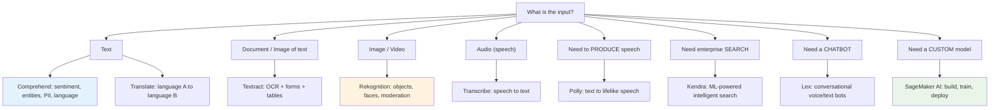
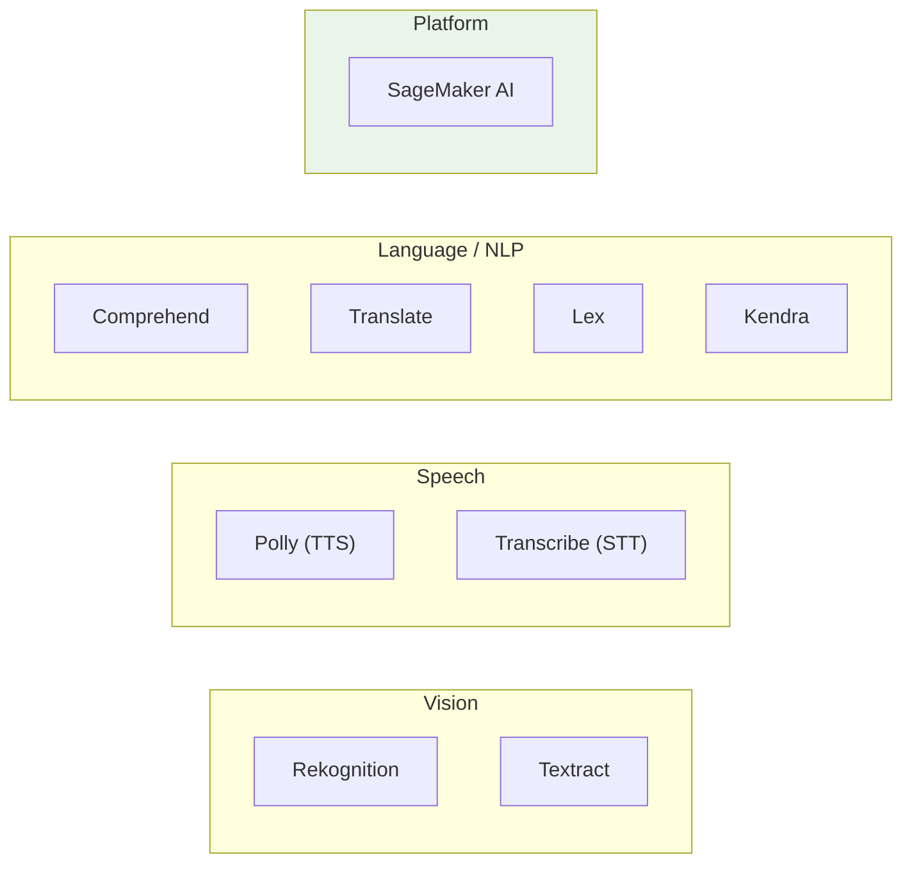
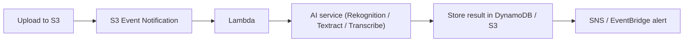

# AWS Machine Learning & AI Services - SAA-C03 Deep Dive

> The SAA-C03 exam tests the **managed AI/ML services** as _building blocks_ - you pick the right one for a use case, not how to train models from scratch. This overview maps every service to its job, then each sub-note deep-dives one service. Memorise the "one-liner per service" table and you will answer most ML questions in seconds.

See also: [01 - Amazon Comprehend Deep Dive](01%20-%20Amazon%20Comprehend%20Deep%20Dive.md) · [01 - Amazon Kendra Deep Dive](01%20-%20Amazon%20Kendra%20Deep%20Dive.md) · [01 - Amazon Lex Deep Dive](01%20-%20Amazon%20Lex%20Deep%20Dive.md) · [01 - Amazon Polly Deep Dive](01%20-%20Amazon%20Polly%20Deep%20Dive.md) · [01 - Amazon Rekognition Deep Dive](01%20-%20Amazon%20Rekognition%20Deep%20Dive.md) · [01 - Amazon SageMaker AI Deep Dive](01%20-%20Amazon%20SageMaker%20AI%20Deep%20Dive.md) · [01 - Amazon Textract Deep Dive](01%20-%20Amazon%20Textract%20Deep%20Dive.md) · [01 - Amazon Transcribe Deep Dive](01%20-%20Amazon%20Transcribe%20Deep%20Dive.md) · [01 - Amazon Translate Deep Dive](01%20-%20Amazon%20Translate%20Deep%20Dive.md)

---

## Table of Contents

- [Part 1: How ML Shows Up on SAA-C03](#part-1-how-ml-shows-up-on-saa-c03)
- [Part 2: The One-Liner Per Service (Memorise This)](#part-2-the-one-liner-per-service-memorise-this)
- [Part 3: Service Decision Map](#part-3-service-decision-map)
- [Part 4: Grouping the Services by Modality](#part-4-grouping-the-services-by-modality)
- [Part 5: Cross-Cutting Architecture Patterns](#part-5-cross-cutting-architecture-patterns)
- [Part 6: Security, IAM & Data-Privacy Themes](#part-6-security-iam--data-privacy-themes)
- [Part 7: Pricing & Cost Themes](#part-7-pricing--cost-themes)
- [Part 8: SRE / Operations Themes Across ML Services](#part-8-sre--operations-themes-across-ml-services)
- [Part 9: Keyword-to-Service Cheat Sheet](#part-9-keyword-to-service-cheat-sheet)
- [Part 10: Common Exam Traps](#part-10-common-exam-traps)
- [Summary: Key Takeaways for SAA-C03](#summary-key-takeaways-for-saa-c03)

---

---

## Part 1: How ML Shows Up on SAA-C03

The Solutions Architect Associate exam is **not** a data-science exam. You will **not** be asked to choose hyperparameters, write training code, or evaluate model accuracy. Instead, ML questions test three things:

1. **Service selection** - "A company wants to extract text from scanned invoices. Which service?" (Answer: Textract, not Rekognition.)
2. **Integration** - how a managed AI service plugs into S3, Lambda, API Gateway, Kinesis, Step Functions, EventBridge.
3. **Operational fit** - synchronous vs asynchronous (batch) processing, real-time vs scheduled, cost, and data residency/privacy.

> **Mindset:** Treat each AI service as a **black-box API** that takes an input (text, image, audio, document) and returns structured output. Your job is to wire it into an architecture, not to understand the neural network inside.

[⬆ Back to top](#table-of-contents)

---

## Part 2: The One-Liner Per Service (Memorise This)

| Service          | One-liner                     | Input                 | Output                                          |
| :--------------- | :---------------------------- | :-------------------- | :---------------------------------------------- |
| **Comprehend**   | NLP - find meaning in text    | Text                  | Sentiment, entities, key phrases, language, PII |
| **Kendra**       | Intelligent enterprise search | Documents + query     | Ranked answers across data sources              |
| **Lex**          | Conversational chatbot engine | Voice/text utterance  | Intent + slots (drives a dialog)                |
| **Polly**        | Text-to-Speech (TTS)          | Text                  | Lifelike audio (MP3/PCM)                        |
| **Rekognition**  | Image & video analysis        | Image/Video           | Labels, faces, moderation, text-in-image        |
| **SageMaker AI** | Build/train/deploy custom ML  | Data + algorithm      | Trained model + endpoint                        |
| **Textract**     | OCR for documents             | Scanned doc/PDF/image | Text, forms (key-value), tables                 |
| **Transcribe**   | Speech-to-Text (STT)          | Audio                 | Text transcript (+ timestamps)                  |
| **Translate**    | Machine translation           | Text                  | Translated text                                 |

**The two pairs people confuse:**

- **Polly (text → speech)** vs **Transcribe (speech → text)** - opposite directions.
- **Textract (text _in documents_)** vs **Rekognition (text _in photos/scenes_)** - Textract for forms/tables/dense docs; Rekognition for a word on a street sign or T-shirt.

[⬆ Back to top](#table-of-contents)

---

## Part 3: Service Decision Map

| If the scenario says...                                                         | Pick                                         |
| :------------------------------------------------------------------------------ | :------------------------------------------- |
| "analyse customer reviews / detect sentiment / redact PII from text"            | **Comprehend**                               |
| "search across SharePoint, S3, RDS, Salesforce with natural-language questions" | **Kendra**                                   |
| "build a chatbot / IVR / virtual agent"                                         | **Lex** (+ often **Polly** + **Transcribe**) |
| "read text aloud / give the app a voice / generate audio articles"              | **Polly**                                    |
| "detect objects, faces, celebrities, inappropriate content in images/video"     | **Rekognition**                              |
| "we have our own dataset and need a custom model / full ML lifecycle"           | **SageMaker AI**                             |
| "extract data from invoices, forms, ID cards, tables (OCR)"                     | **Textract**                                 |
| "generate captions/subtitles / transcribe call-center audio"                    | **Transcribe**                               |
| "localise an app into many languages / real-time translation"                   | **Translate**                                |

[⬆ Back to top](#table-of-contents)

---

## Part 4: Grouping the Services by Modality

- **Vision** - Rekognition (scenes/faces), Textract (documents).
- **Speech** - Polly and Transcribe are mirror images.
- **Language/NLP** - Comprehend (understanding), Translate (conversion), Lex (dialog), Kendra (search).
- **Platform** - SageMaker AI underpins everything; use it when no managed service fits.

[⬆ Back to top](#table-of-contents)

---

## Part 5: Cross-Cutting Architecture Patterns

### Pattern A: Event-driven media processing

This is the single most common ML architecture on the exam: **S3 → event → Lambda → AI API → store result**. Use **asynchronous (StartXxx) APIs** for large files and let the service publish completion to **SNS**.

### Pattern B: Contact-center pipeline (the "stack" question)

`Caller audio → Transcribe → Comprehend (sentiment/entities) → Translate (optional) → store/analytics`, and outbound `text → Polly → audio`. Lex orchestrates the live conversation. Recognising this chained pipeline is a classic exam scenario.

### Pattern C: Synchronous API behind API Gateway

For small/real-time inputs (a single image, a short text), expose **API Gateway → Lambda → AI API (sync)** and return the result inline.

[⬆ Back to top](#table-of-contents)

---

## Part 6: Security, IAM & Data-Privacy Themes

| Theme                    | What to know                                                                                                         |
| :----------------------- | :------------------------------------------------------------------------------------------------------------------- |
| **IAM**                  | Every AI service is called via IAM-authenticated APIs; grant least-privilege (e.g. `comprehend:DetectSentiment`).    |
| **Encryption**           | Inputs in S3 use SSE-S3/SSE-KMS; many services support a **KMS key for output** and for **job/volume encryption**.   |
| **PII**                  | **Comprehend** detects/redacts PII; **Transcribe** can redact PII in transcripts; pair with S3 + KMS.                |
| **VPC / private access** | Use **VPC interface endpoints (PrivateLink)** to call AI services without traversing the internet.                   |
| **Data use**             | You can **opt out** of AWS using your content to improve services (via an Organizations AI services opt-out policy). |
| **Network isolation**    | SageMaker training/inference can run in **VPC-only / no-internet** mode.                                             |

[⬆ Back to top](#table-of-contents)

---

## Part 7: Pricing & Cost Themes

- **Pay-per-use** - priced per unit of input: characters (Comprehend, Translate, Polly), seconds/minutes of audio (Transcribe), images/minutes of video (Rekognition), pages (Textract), queries/index-hours (Kendra).
- **Asynchronous batch** is usually cheaper per unit than chatty synchronous calls for large volumes.
- **Kendra** has a notably high **fixed hourly index cost** (Enterprise/Developer editions) - a frequent "too expensive for a tiny use case" distractor.
- **SageMaker** cost is dominated by **endpoint instance hours**; use **Serverless Inference** or **async inference** for spiky/intermittent traffic, and **delete idle endpoints**.

[⬆ Back to top](#table-of-contents)

---

## Part 8: SRE / Operations Themes Across ML Services

| Concern            | How it manifests                                                             | Mitigation                                                                  |
| :----------------- | :--------------------------------------------------------------------------- | :-------------------------------------------------------------------------- |
| **Throttling**     | `ThrottlingException` / `ProvisionedThroughputExceeded` on bursty sync calls | Exponential backoff + jitter; request quota increase; switch to async/batch |
| **Service quotas** | Default TPS / concurrent-job limits                                          | Monitor in **Service Quotas**, raise proactively                            |
| **Large inputs**   | Sync APIs reject big files (size/duration caps)                              | Use the `StartXxx` **async** API + S3 input                                 |
| **Latency**        | Cold starts (SageMaker endpoints), large media                               | Provisioned capacity, warm pools, async inference                           |
| **Observability**  | Need success/error/latency metrics                                           | **CloudWatch** metrics + **CloudTrail** for API audit                       |
| **Idempotency**    | Re-processing on retries                                                     | Use `ClientRequestToken` where supported; dedupe by S3 object key           |
| **Cost runaway**   | Forgotten Kendra index / SageMaker endpoint                                  | Budgets + alarms + scheduled teardown                                       |

[⬆ Back to top](#table-of-contents)

---

## Part 9: Keyword-to-Service Cheat Sheet

| Keyword in the question                                             | Service          |
| :------------------------------------------------------------------ | :--------------- |
| sentiment, entities, key phrases, topic modeling, PII in text       | **Comprehend**   |
| natural-language enterprise search, "ask a question over documents" | **Kendra**       |
| chatbot, intents, slots, IVR, Alexa-like                            | **Lex**          |
| text-to-speech, voices, SSML, neural voice, lifelike                | **Polly**        |
| object/face detection, content moderation, celebrity, PPE           | **Rekognition**  |
| custom model, training job, notebook, endpoint, Jupyter             | **SageMaker AI** |
| OCR, forms, tables, invoices, key-value pairs, IDs                  | **Textract**     |
| transcription, captions, subtitles, call analytics, speech-to-text  | **Transcribe**   |
| translation, localisation, multi-language, real-time translate      | **Translate**    |

[⬆ Back to top](#table-of-contents)

---

## Part 10: Common Exam Traps

1. **Textract vs Rekognition for text** - documents/forms → Textract; text within a natural scene/photo → Rekognition `DetectText`.
2. **Polly vs Transcribe direction** - Polly _makes_ speech; Transcribe _reads_ speech.
3. **Comprehend vs Kendra** - Comprehend analyses text _content_; Kendra _searches/answers_ across many documents.
4. **"Custom model" almost always means SageMaker** - if the managed service can't do it, escalate to SageMaker AI.
5. **Kendra cost** - watch for "small/low-budget" scenarios where Kendra's hourly index makes it the wrong answer.
6. **Async for large files** - if a file is "1 hour of audio" or "a 500-page PDF", the sync API is the wrong answer; use the async/batch API.
7. **Don't pick Comprehend Medical / Transcribe Medical** unless the scenario is explicitly **healthcare/clinical**.

[⬆ Back to top](#table-of-contents)

---

## Summary: Key Takeaways for SAA-C03

| Concept                  | What You Must Know                                                                     |
| :----------------------- | :------------------------------------------------------------------------------------- |
| **Service selection**    | Match input modality + verb to the one service that does it                            |
| **Sync vs async**        | Small/real-time → sync; large/batch → `StartXxx` async + SNS                           |
| **Common architecture**  | S3 → event → Lambda → AI API → DynamoDB/S3 → SNS                                       |
| **Contact-center stack** | Transcribe → Comprehend → Translate → Polly, orchestrated by Lex                       |
| **SageMaker**            | The fallback for any _custom_ model need                                               |
| **Cost**                 | Pay-per-use; Kendra index hours and SageMaker endpoint hours are the big-ticket items  |
| **Security**             | IAM least-privilege, KMS for output, PrivateLink for private access, AI opt-out policy |

[⬆ Back to top](#table-of-contents)
