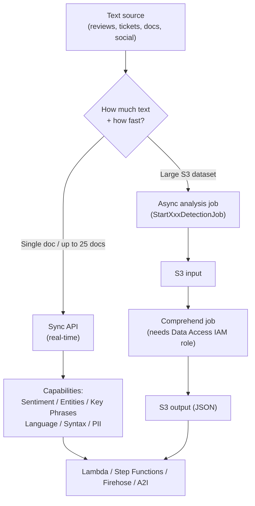
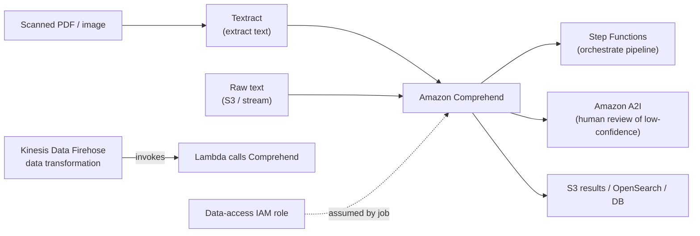

# Amazon Comprehend - SAA-C03 Deep Dive

> **Amazon Comprehend** is a fully managed **NLP (Natural Language Processing)** service that uses ML to find insights and relationships in **text** - sentiment, entities, key phrases, language, syntax, PII, and topics - with **no ML expertise required**. Choose it when you need to _understand unstructured text_ (reviews, tickets, social posts, documents) rather than search it, translate it, or extract it from images.

See also: [00 - Machine Learning Overview](00%20-%20Machine%20Learning%20Overview.md) · [01 - Amazon Translate Deep Dive](01%20-%20Amazon%20Translate%20Deep%20Dive.md) · [01 - Amazon Kendra Deep Dive](01%20-%20Amazon%20Kendra%20Deep%20Dive.md) · [01 - Amazon Textract Deep Dive](01%20-%20Amazon%20Textract%20Deep%20Dive.md)

---

## Table of Contents

- [1. What Amazon Comprehend Is (and When to Choose It)](#1-what-amazon-comprehend-is-and-when-to-choose-it)
- [2. Sync vs Async - The Core Operating Model](#2-sync-vs-async---the-core-operating-model)
- [3. Built-in Capabilities Deep Dive](#3-built-in-capabilities-deep-dive)
- [4. PII Detection & Redaction](#4-pii-detection--redaction)
- [5. Topic Modeling (LDA)](#5-topic-modeling-lda)
- [6. Custom Classification & Custom Entity Recognition](#6-custom-classification--custom-entity-recognition)
- [7. Comprehend Medical](#7-comprehend-medical)
- [8. Architecture & Integrations](#8-architecture--integrations)
- [9. Concrete Examples (CLI & Pipeline)](#9-concrete-examples-cli--pipeline)
- [10. Best Practices](#10-best-practices)
- [11. Exam Facts, Limits & Quotas](#11-exam-facts-limits--quotas)
- [Summary](#summary)

---



---

## 1. What Amazon Comprehend Is (and When to Choose It)

Amazon Comprehend is a **serverless NLP service**. You send it text, it returns structured insight (JSON) - no model training, servers, or data-science skills needed. It is a _text understanding_ service, distinct from its ML-service siblings:

| Need                                                                   | Service                                        |
| :--------------------------------------------------------------------- | :--------------------------------------------- |
| **Understand** unstructured text (sentiment, entities, PII, topics)    | **Comprehend**                                 |
| **Translate** text between languages                                   | [Translate](01%20-%20Amazon%20Translate%20Deep%20Dive.md) |
| **Search** documents with natural-language queries (enterprise search) | [Kendra](01%20-%20Amazon%20Kendra%20Deep%20Dive.md)       |
| **Extract** text/forms/tables from scanned images & PDFs               | [Textract](01%20-%20Amazon%20Textract%20Deep%20Dive.md)   |

> Comprehend works on **text only**. If your input is a scanned image or PDF, run **Textract** first, then feed the extracted text to Comprehend. A common pipeline is **Textract → Comprehend → Comprehend Medical / PII**.

**When the exam points to Comprehend:** keywords like _"analyze customer sentiment,"_ _"detect PII and redact it,"_ _"classify support tickets,"_ _"find topics across a corpus,"_ _"extract entities/people/places,"_ _"detect the language of incoming text"_ - all without managing infrastructure.

[⬆ Back to top](#table-of-contents)

---

## 2. Sync vs Async - The Core Operating Model

This distinction is heavily tested - know which to pick for a given workload size.

| Mode                     | API style                                                                                                                  | Input                                | Use when                                                          |
| :----------------------- | :------------------------------------------------------------------------------------------------------------------------- | :----------------------------------- | :---------------------------------------------------------------- |
| **Sync - single**        | `DetectSentiment`, `DetectEntities`, etc.                                                                                  | One UTF-8 text string in the request | Real-time, one document at a time (e.g., per-request in a Lambda) |
| **Sync - batch**         | `BatchDetectSentiment`, `BatchDetectEntities`, etc.                                                                        | **Up to 25 documents** in one call   | Small low-latency batches                                         |
| **Async - analysis job** | `StartSentimentDetectionJob`, `StartEntitiesDetectionJob`, `StartPiiEntitiesDetectionJob`, `StartTopicsDetectionJob`, etc. | A set of documents in **Amazon S3**  | Large datasets, offline/bulk processing                           |

Key points:

- **Sync** returns results inline, immediately, and is **per-document** (or up to 25 in a batch call).
- **Async jobs** read input from S3 and write JSON results back to S3. You start a job, poll with `DescribeXxxDetectionJob` / `ListXxxDetectionJobs`, and the job runs to completion asynchronously.
- Async jobs require a **data-access IAM role** that Comprehend assumes to read/write your S3 buckets.
- **Topic modeling and custom-model training are async-only** (see sections 5 and 6).

> Exam heuristic: _"thousands/millions of documents in S3"_ → **async job**. _"per-incoming-message / real-time"_ → **sync** (single or batch ≤ 25).

[⬆ Back to top](#table-of-contents)

---

## 3. Built-in Capabilities Deep Dive

All of the following are **pre-trained** - no training data needed.

### Sentiment Analysis

`DetectSentiment` returns the dominant sentiment with confidence scores for **four classes**:

| Sentiment    | Meaning                             |
| :----------- | :---------------------------------- |
| **POSITIVE** | Overall positive tone               |
| **NEGATIVE** | Overall negative tone               |
| **NEUTRAL**  | Neither positive nor negative       |
| **MIXED**    | Contains both positive and negative |

Response includes a `SentimentScore` object with a probability for each class.

### Targeted Sentiment

`DetectTargetedSentiment` goes finer-grained: it finds **entities/aspects in the text and the sentiment expressed toward each one**. Example: in _"The food was great but the service was slow,"_ it returns POSITIVE for _food_ and NEGATIVE for _service_. Use it when you need sentiment **per aspect**, not per document.

### Entity Recognition

`DetectEntities` identifies named entities and classifies them: **PERSON, LOCATION, ORGANIZATION, COMMERCIAL_ITEM, EVENT, DATE, QUANTITY, TITLE, OTHER**. Returns text span (offsets), type, and confidence.

### Key Phrase Extraction

`DetectKeyPhrases` pulls out the **noun phrases** (talking points) in the text, with offsets and confidence - useful for tagging, summarizing themes.

### Dominant Language Detection

`DetectDominantLanguage` returns the **most likely language(s)** as ISO codes with confidence. Supports a much wider language set than the other detect operations. Commonly used **first** in a pipeline to route text or to set the `LanguageCode` for downstream calls.

### Syntax Analysis

`DetectSyntax` tokenizes text and tags each token with its **part of speech** (noun, verb, adjective, etc., using Universal POS tags) plus offsets and confidence.

### Events Detection

`StartEventsDetectionJob` (async) finds **real-world events** (e.g., mergers, IPOs, bankruptcies) and the entities/arguments related to them across financial/news text. Async-only.

[⬆ Back to top](#table-of-contents)

---

## 4. PII Detection & Redaction

A frequent exam topic - Comprehend can find and remove **Personally Identifiable Information**.

- **Sync:** `DetectPiiEntities` returns the **types and locations (offsets)** of PII (e.g., NAME, EMAIL, SSN, CREDIT_DEBIT_NUMBER, ADDRESS, PHONE, BANK_ACCOUNT_NUMBER) in a single text. `ContainsPiiEntities` returns only the labels/whether PII is present (cheaper, classification-only).
- **Async:** `StartPiiEntitiesDetectionJob` runs over an S3 dataset and supports two output modes:
  - **`ONLY_OFFSETS`** - emits the PII spans (you redact yourself), and
  - **`ONLY_REDACTION`** - Comprehend writes **redacted copies** of the documents to S3, replacing PII with a mask character or the entity type.

> Use PII detection to **scrub logs, tickets, and chat transcripts before storing or sharing them**, or to gate access. Pair with Kinesis Data Firehose data transformation or S3 event → Lambda for streaming redaction.

[⬆ Back to top](#table-of-contents)

---

## 5. Topic Modeling (LDA)

`StartTopicsDetectionJob` performs **topic modeling** over a **set of documents** to discover the themes that recur across the corpus.

- Algorithm: **LDA (Latent Dirichlet Allocation)** - unsupervised.
- **Async only** - it operates on a _document collection in S3_, not a single string. There is no sync "DetectTopics."
- You specify **`NumberOfTopics`**; output (in S3) is two CSVs: **topic-terms** (terms per topic with weights) and **doc-topics** (topic mix per document).
- Unsupervised → **no labeled training data required**.

> Exam tell: _"group/discover the main themes across thousands of documents without labels"_ → **Comprehend topic modeling (LDA), async job**.

[⬆ Back to top](#table-of-contents)

---

## 6. Custom Classification & Custom Entity Recognition

When the built-in categories/entities don't fit your domain, train a **custom model** with your own labels - still **no ML expertise** required (AutoML-style).

| Feature                       | What it does                                                                                                                                                                     | Training                                                     | Inference                                                                                         |
| :---------------------------- | :------------------------------------------------------------------------------------------------------------------------------------------------------------------------------- | :----------------------------------------------------------- | :------------------------------------------------------------------------------------------------ |
| **Custom Classification**     | Assign **your own categories/labels** to documents (e.g., route tickets to _Billing / Tech / Sales_). Supports **multi-class** (one label) and **multi-label** (several labels). | `CreateDocumentClassifier` on labeled examples in S3         | **Real-time endpoint** (`CreateEndpoint`) for sync, or **async** `StartDocumentClassificationJob` |
| **Custom Entity Recognition** | Detect **domain-specific entity types** not in the built-in set (e.g., policy numbers, part SKUs).                                                                               | `CreateEntityRecognizer` on annotated/entity-list data in S3 | **Real-time endpoint** or **async** `StartEntitiesDetectionJob` with your `EntityRecognizerArn`   |

Key facts:

- **Training is async** and reads/writes S3 via the **data-access role**.
- For **real-time custom inference** you provision an **endpoint** measured in **inference units (IUs)** - **you pay for the endpoint while it exists**, so delete idle endpoints (a classic cost-runaway gotcha).
- For occasional/bulk custom inference, prefer the **async job** (no standing endpoint cost).

[⬆ Back to top](#table-of-contents)

---

## 7. Comprehend Medical

**Amazon Comprehend Medical** is a **separate API** for **clinical/medical text** (`comprehendmedical`).

- Detects **PHI** (Protected Health Information) via `DetectPHI`.
- Extracts **medical entities** (medications, conditions, anatomy, tests/procedures) via `DetectEntitiesV2`.
- Maps to standard ontologies: **ICD-10-CM** (diagnoses, `InferICD10CM`), **RxNorm** (medications, `InferRxNorm`), and **SNOMED CT** (`InferSNOMEDCT`).
- **HIPAA eligible.** Use it **only for clinical text** - for general business text use standard Comprehend.

> Exam tell: _"extract medical conditions/medications,"_ _"ICD-10-CM / RxNorm,"_ _"detect PHI in clinical notes"_ → **Comprehend Medical** (not plain Comprehend).

[⬆ Back to top](#table-of-contents)

---

## 8. Architecture & Integrations



- **Amazon S3** - input/output for all **async jobs** (and custom-model training data).
- **AWS Lambda** - call sync APIs per event (e.g., S3 PutObject, API Gateway request).
- **Kinesis Data Firehose** - **data transformation** invokes a Lambda that calls Comprehend (e.g., real-time **PII redaction** or sentiment tagging on a stream before delivery to S3/OpenSearch).
- **Step Functions** - orchestrate multi-step pipelines (Textract → Comprehend → store), including **waiting on async jobs**.
- **Amazon A2I (Augmented AI)** - route **low-confidence** predictions to humans for review.
- **IAM data-access role** - async jobs and custom training require a role Comprehend assumes to access S3.
- **KMS** - encrypt job output and (optionally) volume/model data at rest; calls are over TLS.

[⬆ Back to top](#table-of-contents)

---

## 9. Concrete Examples (CLI & Pipeline)

**Sync sentiment (single document):**

```bash
aws comprehend detect-sentiment \
  --language-code en \
  --text "The delivery was fast but the packaging was terrible."
# -> Sentiment: MIXED, with SentimentScore per class
```

**Sync entities:**

```bash
aws comprehend detect-entities \
  --language-code en \
  --text "Jeff Bezos founded Amazon in Seattle in 1994."
```

**Detect PII (offsets):**

```bash
aws comprehend detect-pii-entities \
  --language-code en \
  --text "Email me at jane.doe@example.com or call 555-0142."
```

**Async PII redaction job over an S3 dataset:**

```bash
aws comprehend start-pii-entities-detection-job \
  --input-data-config S3Uri=s3://my-bucket/input/ \
  --output-data-config S3Uri=s3://my-bucket/redacted/ \
  --mode ONLY_REDACTION \
  --redaction-config PiiEntityTypes=ALL,MaskMode=REPLACE_WITH_PII_ENTITY_TYPE \
  --data-access-role-arn arn:aws:iam::111122223333:role/ComprehendDataAccess \
  --language-code en \
  --job-name redact-tickets
```

**Async topic modeling:**

```bash
aws comprehend start-topics-detection-job \
  --input-data-config S3Uri=s3://my-bucket/corpus/ \
  --output-data-config S3Uri=s3://my-bucket/topics/ \
  --number-of-topics 20 \
  --data-access-role-arn arn:aws:iam::111122223333:role/ComprehendDataAccess
```

**Serverless real-time pipeline (described):**

1. Client posts review → **API Gateway** → **Lambda**.
2. Lambda calls `DetectDominantLanguage`, then `DetectSentiment` + `DetectPiiEntities`.
3. Redacted text + sentiment written to **DynamoDB / OpenSearch**; low-confidence items routed to **A2I**.

**Streaming redaction pipeline:** producers → **Kinesis Data Firehose** → **transformation Lambda** (calls `DetectPiiEntities`, masks) → S3/OpenSearch (clean data only).

[⬆ Back to top](#table-of-contents)

---

## 10. Best Practices

- **Detect language first** (`DetectDominantLanguage`) and pass the correct `LanguageCode` - wrong language codes degrade results or error out.
- **Right-size the mode:** sync (≤ 25 docs batch) for real-time; **async S3 jobs** for bulk. Don't loop sync calls over millions of docs - you'll hit throttling and pay more.
- **Delete idle custom endpoints** - they bill continuously per inference unit even when unused.
- Use **`ContainsPiiEntities`** (label-only) when you just need a yes/no gate - cheaper than full `DetectPiiEntities`.
- **Scope the data-access role tightly** to the specific input/output prefixes; encrypt outputs with **KMS**.
- Add **exponential backoff with jitter** to handle `ThrottlingException`.
- Route **low-confidence predictions to A2I** instead of trusting them blindly.
- Keep documents within size limits (chunk long text) to avoid `TextSizeLimitExceededException`.

[⬆ Back to top](#table-of-contents)

---

## 11. Exam Facts, Limits & Quotas

| Fact / Limit                   | Value (defaults; verify in console)                                                                                   |
| :----------------------------- | :-------------------------------------------------------------------------------------------------------------------- |
| **Service type**               | Fully managed, **serverless NLP**; pay-per-use (per 100-char unit), 3-unit minimum per request                        |
| **Sync single** input size     | **5,000 bytes (UTF-8)** per document for most detect ops                                                              |
| **Sync batch**                 | **Up to 25 documents** per `BatchDetect*` call                                                                        |
| **Targeted sentiment / async** | Larger documents supported via async (typically up to **~100 KB** per doc for analysis jobs; 1 MB for topic modeling) |
| **Topic modeling**             | **Async only**, **LDA**, you set `NumberOfTopics`; no labeled data                                                    |
| **Comprehend Medical**         | **Separate API**, **HIPAA eligible**, ICD-10-CM / RxNorm / SNOMED CT                                                  |
| **Custom models**              | Training is **async**; real-time inference needs a paid **endpoint (inference units)**                                |
| **Async jobs**                 | Read/write **S3**, require a **data-access IAM role**                                                                 |
| **Common throttle**            | `ThrottlingException` → exponential backoff                                                                           |
| **Oversize text**              | `TextSizeLimitExceededException` → chunk the input                                                                    |

> Memorize the trio: **5,000-byte sync limit**, **25-doc batch**, **topic modeling = async LDA**. And **Comprehend = text only** (use Textract for images first).

[⬆ Back to top](#table-of-contents)

---

## Summary

Amazon Comprehend is AWS's **managed NLP** service for **understanding text**: sentiment (POSITIVE/NEGATIVE/NEUTRAL/MIXED), targeted sentiment, entities, key phrases, language, syntax, events, **PII detection & redaction**, **topic modeling (LDA, async)**, and **custom classification / entity recognition**. Pick **sync** (single or ≤ 25-doc batch) for real-time and **async S3 jobs** for bulk. **Comprehend Medical** handles clinical text (PHI, ICD-10-CM, RxNorm). It is text-only - chain **Textract** before it for images, and integrate with **S3, Lambda, Firehose, Step Functions, and A2I** to build full pipelines.

[⬆ Back to top](#table-of-contents)
