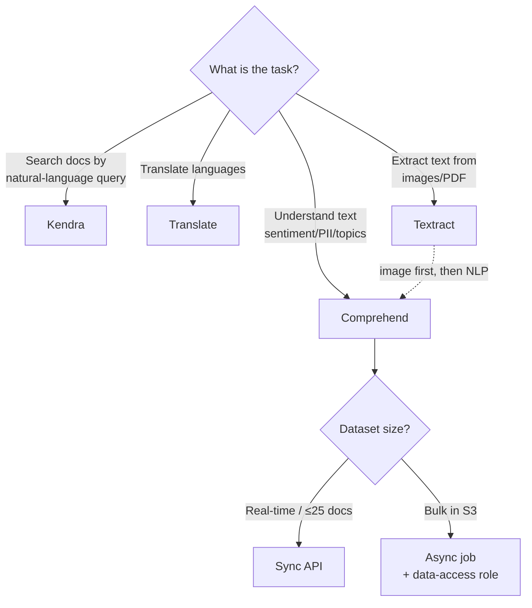

# Amazon Comprehend - Exam Scenarios & Troubleshooting

> SAA-C03 **scenario drills** and an SRE-style **troubleshooting** reference for Amazon Comprehend: when to pick sync vs async, PII redaction, topic modeling, custom models, plus the errors you actually hit in production (throttling, size limits, async IAM/data-access roles, language support, cost runaway).

See also: [00 - Machine Learning Overview](00%20-%20Machine%20Learning%20Overview.md) · [01 - Amazon Comprehend Deep Dive](01%20-%20Amazon%20Comprehend%20Deep%20Dive.md) · [01 - Amazon Translate Deep Dive](01%20-%20Amazon%20Translate%20Deep%20Dive.md) · [01 - Amazon Kendra Deep Dive](01%20-%20Amazon%20Kendra%20Deep%20Dive.md) · [01 - Amazon Textract Deep Dive](01%20-%20Amazon%20Textract%20Deep%20Dive.md)

---

## Table of Contents

- [1. Scenario Questions](#1-scenario-questions)
- [2. Common Errors & Troubleshooting (SRE perspective)](#2-common-errors--troubleshooting-sre-perspective)
- [3. Decision: Comprehend vs Kendra vs Translate vs Textract](#3-decision-comprehend-vs-kendra-vs-translate-vs-textract)
- [Summary](#summary)

---

---

## 1. Scenario Questions

**Question:** A retailer wants to automatically gauge whether thousands of incoming product reviews are positive, negative, neutral, or mixed, with no ML team. Which service?

- A. Amazon Kendra
- B. Amazon Comprehend (`DetectSentiment`)
- C. Amazon Translate
- D. Amazon SageMaker (custom model)

**Answer:** B

**Explanation:** Comprehend provides pre-trained sentiment analysis returning POSITIVE/NEGATIVE/NEUTRAL/MIXED with no training or ML expertise. Kendra is search, Translate is language conversion, SageMaker would need a custom model.

**Exam Tip:** "Sentiment / no ML expertise" → **Comprehend**.

---

**Question:** A company must process **millions of documents stored in Amazon S3** to extract entities, running offline overnight. What is the most appropriate Comprehend approach?

- A. Loop `DetectEntities` (sync) over each document from Lambda
- B. Use `BatchDetectEntities` in groups of 25
- C. Start an **async `StartEntitiesDetectionJob`** with S3 input/output and a data-access role
- D. Use Comprehend Medical

**Answer:** C

**Explanation:** Large S3 datasets are the textbook case for **async analysis jobs**. Looping sync calls (A) invites throttling and high cost; batches of 25 (B) don't scale to millions; D is for clinical text.

**Exam Tip:** "Millions of docs in S3, offline" → **async job**.

---

**Question:** A support team needs to **discover the recurring themes** across 500,000 chat transcripts, but has **no labels**. Which Comprehend feature?

- A. Custom Classification
- B. Topic modeling (`StartTopicsDetectionJob`)
- C. Key phrase extraction (sync)
- D. Targeted sentiment

**Answer:** B

**Explanation:** Topic modeling uses **LDA (unsupervised)** to find themes across a document set - no labels required, async only. Custom Classification needs labeled training data; key phrases are per-document phrases, not corpus-wide themes.

**Exam Tip:** "Discover themes, no labels, whole corpus" → **topic modeling (LDA)**.

---

**Question:** A bank must **remove SSNs, emails, and account numbers** from customer chat logs in S3 before archiving, producing scrubbed copies. Best solution?

- A. `DetectSentiment` async
- B. `StartPiiEntitiesDetectionJob` with `--mode ONLY_REDACTION`
- C. `DetectEntities` sync, then manual deletion
- D. Macie

**Answer:** B

**Explanation:** Comprehend's async PII job with **`ONLY_REDACTION`** writes masked copies of the documents to S3 automatically. `ONLY_OFFSETS` would only return locations, leaving you to redact. (Macie classifies/locates sensitive data in S3 but doesn't produce redacted text copies.)

**Exam Tip:** "Output redacted documents" → **PII job, `ONLY_REDACTION`**.

---

**Question:** Incoming support tickets must be **routed to Billing, Technical, or Sales** in real time using your own categories. Which Comprehend capability?

- A. Built-in `DetectEntities`
- B. **Custom Classification** with a real-time endpoint
- C. Topic modeling
- D. `DetectKeyPhrases`

**Answer:** B

**Explanation:** Your own labels = **Custom Classification**. For real-time routing you deploy a **real-time endpoint** (inference units). Built-in entities/key phrases don't map to your custom categories; topic modeling is unsupervised and async.

**Exam Tip:** "Your own categories, real-time" → **Custom Classification + endpoint** (delete it when idle to control cost).

---

**Question:** A hospital wants to extract **medications and diagnoses mapped to ICD-10-CM and RxNorm** from clinical notes. Which service?

- A. Amazon Comprehend `DetectEntities`
- B. **Amazon Comprehend Medical**
- C. Amazon Textract
- D. Amazon Kendra

**Answer:** B

**Explanation:** Comprehend **Medical** is the HIPAA-eligible API that detects PHI and maps to **ICD-10-CM, RxNorm, and SNOMED CT**. Standard Comprehend doesn't do medical ontologies.

**Exam Tip:** "ICD-10-CM / RxNorm / PHI / clinical" → **Comprehend Medical**.

---

**Question:** A streaming pipeline using **Kinesis Data Firehose** must mask PII before delivering records to S3. How?

- A. Enable a Firehose **data transformation Lambda** that calls Comprehend `DetectPiiEntities`
- B. Turn on Firehose encryption
- C. Use a Comprehend async topic job
- D. Use Kendra

**Answer:** A

**Explanation:** Firehose supports **data transformation** via Lambda; the Lambda calls Comprehend to detect PII and returns masked records before delivery. Encryption (B) protects at rest but doesn't remove PII content.

**Exam Tip:** "Mask PII in a stream" → **Firehose transformation Lambda → Comprehend**.

---

**Question:** An app receives text in **unknown languages** and must process it correctly. What should it call first?

- A. `DetectSyntax`
- B. `DetectDominantLanguage`, then set `LanguageCode` downstream
- C. `BatchDetectSentiment` with `en`
- D. Comprehend Medical

**Answer:** B

**Explanation:** `DetectDominantLanguage` returns the language code, which you then pass to subsequent detect operations. Hard-coding `en` (C) would mis-analyze non-English text.

**Exam Tip:** "Unknown language" → **detect language first, then route**.

---

**Question:** A Lambda calling `DetectSentiment` at high volume starts returning **`ThrottlingException`** during traffic spikes. Best fix?

- A. Switch to Comprehend Medical
- B. Implement **exponential backoff with jitter and retries**; request a quota increase if sustained
- C. Increase the document byte size
- D. Move to Kendra

**Answer:** B

**Explanation:** Throttling means you exceeded the per-second request quota. Standard remedy is **backoff + retry**, batching where possible, and a **service quota increase** for sustained load.

**Exam Tip:** "ThrottlingException" → **backoff/jitter + quota increase**.

---

**Question:** A document of ~60 KB is rejected by a sync `DetectEntities` call. Why, and what's the fix?

- A. Wrong Region; change Region
- B. **Exceeds the sync byte limit (5,000 bytes)** - chunk the text or use an **async job** for large docs
- C. Missing data-access role on the sync call
- D. PII present; redact first

**Answer:** B

**Explanation:** Sync detect operations cap each document at **5,000 UTF-8 bytes**, raising `TextSizeLimitExceededException`. Split the text, or use an **async S3 job** which supports larger documents. (Data-access roles apply to async jobs, not sync calls.)

**Exam Tip:** "Large single document" → chunk or **async job** (sync = 5,000 bytes).

---

**Question:** An async Comprehend job fails immediately with an **access-denied / cannot read S3** error. Most likely cause?

- A. The **data-access IAM role** lacks `s3:GetObject`/`s3:PutObject` on the input/output buckets (or trust policy is wrong)
- B. The text is in mixed languages
- C. The bucket is in the same Region
- D. Comprehend doesn't support async jobs

**Answer:** A

**Explanation:** Async jobs assume a **data-access role** to reach S3. If that role's permissions or trust relationship (allowing `comprehend.amazonaws.com` to assume it) are missing, the job can't read input or write output.

**Exam Tip:** "Async job can't access S3" → fix the **data-access role** permissions + trust policy.

---

**Question:** Costs from custom classification suddenly spike even though traffic is low. Likely culprit?

- A. Too many sync calls
- B. An **idle real-time endpoint** still provisioned (billed per inference unit continuously)
- C. Topic modeling
- D. KMS key rotation

**Answer:** B

**Explanation:** Custom real-time **endpoints bill continuously** while they exist, regardless of usage. Delete idle endpoints, or use **async jobs** for sporadic inference.

**Exam Tip:** "Custom model cost runaway" → **delete idle endpoints**.

[⬆ Back to top](#table-of-contents)

---

## 2. Common Errors & Troubleshooting (SRE perspective)

| Error / Symptom                                         | Likely Cause                                                                                                                                          | Fix                                                                                                                                                                 |
| :------------------------------------------------------ | :---------------------------------------------------------------------------------------------------------------------------------------------------- | :------------------------------------------------------------------------------------------------------------------------------------------------------------------ |
| **`ThrottlingException`** / 429-style errors under load | Exceeded per-second request quota (TPS)                                                                                                               | Add **exponential backoff + jitter** and retries; batch with `BatchDetect*` (≤25); request a **Service Quotas** increase for sustained load                         |
| **`TextSizeLimitExceededException`**                    | Document larger than the sync limit (**5,000 bytes** for most detect ops)                                                                             | **Chunk** the text and aggregate results, or use an **async S3 job** which supports larger docs                                                                     |
| Sync **batch** call rejected                            | More than **25 documents** in a `BatchDetect*` request, or a member doc too large                                                                     | Split into batches of **≤25**; ensure each doc is within byte limits                                                                                                |
| **Async job stuck/`FAILED` with S3 access error**       | **Data-access IAM role** missing `s3:GetObject`/`s3:ListBucket`/`s3:PutObject`, or trust policy doesn't allow `comprehend.amazonaws.com` to assume it | Grant least-privilege S3 perms on the input/output prefixes; fix the **role trust relationship**; verify KMS `kms:Decrypt`/`GenerateDataKey` if buckets are SSE-KMS |
| **`UnsupportedLanguageException`** / poor results       | `LanguageCode` not supported for that operation, or wrong language passed                                                                             | Call **`DetectDominantLanguage`** first; pass a **supported** code per the operation; not all features support all languages                                        |
| **`ValidationException` / InvalidRequest**              | Malformed input, empty text, bad `Mode`/`RedactionConfig`, or unsupported file format in S3                                                           | Validate request shape; for async, ensure input format (one-doc-per-file vs one-doc-per-line) matches `InputDataConfig.InputFormat`                                 |
| **PII redaction leaves data exposed**                   | Used **`ONLY_OFFSETS`** (locations only) instead of **`ONLY_REDACTION`**, or `PiiEntityTypes` didn't include the type present                         | Use **`ONLY_REDACTION`** mode; set `PiiEntityTypes=ALL` (or the needed types); verify masked output                                                                 |
| **`AccessDeniedException`** on the API call itself      | Caller IAM principal lacks `comprehend:*` action permissions                                                                                          | Add the specific `comprehend:Detect*` / `comprehend:Start*` permissions to the caller's policy                                                                      |
| **`ResourceNotFoundException`** on custom inference     | Wrong `EndpointArn` / `DocumentClassifierArn` / `EntityRecognizerArn`, or model still training                                                        | Confirm the resource ARN and that training **`COMPLETED`** before inference                                                                                         |
| **Cost runaway**                                        | Idle **custom real-time endpoints** billing per inference unit; looping sync over huge datasets                                                       | **Delete idle endpoints**; switch bulk work to **async jobs**; set budgets/alarms                                                                                   |
| **Throttling during a large async job**                 | Internal scaling / large `NumberOfTopics` or huge corpus                                                                                              | Let it run async (it's designed for scale); reduce concurrent jobs; retry transient failures                                                                        |

[⬆ Back to top](#table-of-contents)

---

## 3. Decision: Comprehend vs Kendra vs Translate vs Textract

| Service               | Core job                                                                                                                  | Pick when the question says...                                                                                        |
| :-------------------- | :------------------------------------------------------------------------------------------------------------------------ | :-------------------------------------------------------------------------------------------------------------------- |
| **Amazon Comprehend** | **Understand** unstructured text - sentiment, entities, key phrases, language, syntax, PII, topics, custom classification | "analyze sentiment," "detect/redact PII," "classify tickets," "find topics," "extract entities" - **no ML expertise** |
| **Amazon Kendra**     | **Intelligent search** - natural-language queries over a document corpus, with connectors and ranked answers              | "employees ask questions and get answers," "enterprise/intranet search," "semantic search across docs"                |
| **Amazon Translate**  | **Machine translation** between languages (neural)                                                                        | "translate content," "localize," "multilingual support"                                                               |
| **Amazon Textract**   | **Extract** text, forms, and tables from **scanned images/PDFs** (OCR+)                                                   | "scanned documents," "extract form fields/tables," "digitize invoices" - then often feed output to Comprehend         |

> Mnemonic: **Comprehend = understand**, **Kendra = search**, **Translate = convert**, **Textract = extract**. Images go through **Textract first**, then **Comprehend** for NLP.

[⬆ Back to top](#table-of-contents)

---

## Summary

For the SAA-C03, map keywords fast: **sentiment / PII / classify / topics / entities → Comprehend**; **search → Kendra**; **translate → Translate**; **OCR from images → Textract**. Choose **async S3 jobs** (with a **data-access role**) for bulk and **sync** (single or ≤25-doc batch, 5,000-byte limit) for real-time. The recurring operational gotchas are **`ThrottlingException`** (backoff + quota), **`TextSizeLimitExceededException`** (chunk or async), **async data-access-role** failures, **unsupported language** (detect language first), **PII mode** (`ONLY_REDACTION` to actually mask), and **cost runaway from idle custom endpoints** (delete them).

[⬆ Back to top](#table-of-contents)
