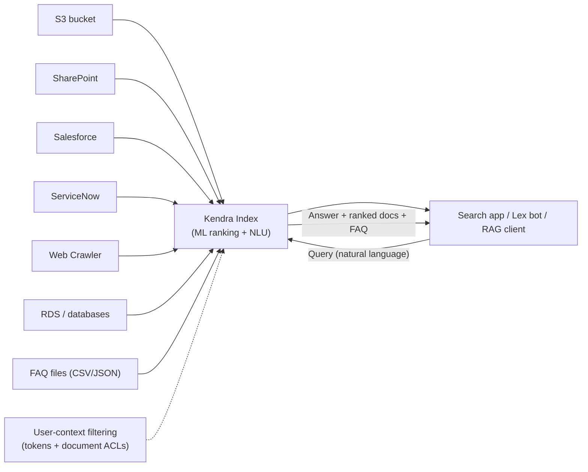
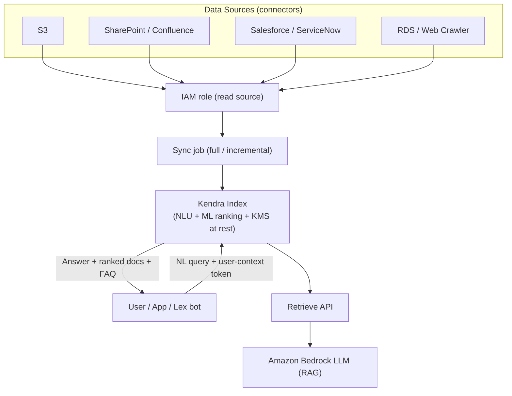

# Amazon Kendra - SAA-C03 Deep Dive

> **Amazon Kendra** is a fully managed, ML-powered **intelligent enterprise search** service that lets users ask **natural-language questions** across scattered content (S3, SharePoint, Salesforce, Confluence, RDS, web pages...) and get back precise **answers**, ranked documents, and FAQ matches - not just a list of keyword hits.

See also: [00 - Machine Learning Overview](00%20-%20Machine%20Learning%20Overview.md) · [01 - Amazon Comprehend Deep Dive](01%20-%20Amazon%20Comprehend%20Deep%20Dive.md) · [01 - Amazon Lex Deep Dive](01%20-%20Amazon%20Lex%20Deep%20Dive.md) · [01 - Amazon Textract Deep Dive](01%20-%20Amazon%20Textract%20Deep%20Dive.md)

---

## Table of Contents

- [1. Kendra in a Sentence](#1-kendra-in-a-sentence)
- [2. Keyword Search vs Kendra (Natural-Language Search)](#2-keyword-search-vs-kendra-natural-language-search)
- [3. Core Concepts](#3-core-concepts)
- [4. Data Sources & Connectors](#4-data-sources--connectors)
- [5. Result Types: Answers, Documents, FAQs](#5-result-types-answers-documents-faqs)
- [6. Relevance: Incremental Learning, Tuning, Synonyms](#6-relevance-incremental-learning-tuning-synonyms)
- [7. Access Control & User-Context Filtering](#7-access-control--user-context-filtering)
- [8. Editions (Developer, Enterprise, Gen-AI)](#8-editions-developer-enterprise-gen-ai)
- [9. Architecture](#9-architecture)
- [10. Integrations](#10-integrations)
- [11. Examples (Console & CLI)](#11-examples-console--cli)
- [12. Pricing Model](#12-pricing-model)
- [13. Best Practices](#13-best-practices)
- [14. Key Exam Facts (SAA-C03)](#14-key-exam-facts-saa-c03)
- [Summary](#summary)

---



---

## 1. Kendra in a Sentence

Kendra is **search-as-a-service for your private/enterprise content**. You point it at your repositories, it builds an **index**, and your users (or apps) ask questions like _"What is our parental leave policy?"_ and Kendra returns a **direct answer extracted from a document**, plus the supporting documents and any matching FAQ.

It uses **natural language understanding (NLU)** and machine learning under the hood, so it understands intent and phrasing - not just literal token matches.

[⬆ Back to top](#table-of-contents)

---

## 2. Keyword Search vs Kendra (Natural-Language Search)

| Aspect        | Traditional keyword search (e.g. basic Lucene/OpenSearch) | Amazon Kendra                                       |
| :------------ | :-------------------------------------------------------- | :-------------------------------------------------- |
| Query style   | Match tokens, boolean operators                           | **Natural-language questions**                      |
| Understanding | Lexical (word overlap)                                    | **Semantic / NLU** (intent, synonyms)               |
| Output        | Ranked list of matching documents                         | **Suggested answer** + ranked docs + FAQ match      |
| Tuning        | Manual scoring/boosting                                   | ML relevance + **incremental learning** from clicks |
| Setup effort  | Build ingestion, mapping, relevance yourself              | **Managed connectors + managed ranking**            |
| Cost          | Cheap at small scale                                      | **Expensive** (hourly index minimum)                |

> Exam framing: Kendra is chosen when the requirement says _"natural-language questions"_, _"ask in plain English"_, _"intelligent / cognitive search over enterprise documents"_, or _"return a specific answer"_ - not just "search."

[⬆ Back to top](#table-of-contents)

---

## 3. Core Concepts

| Concept            | What it is                                                                                                                |
| :----------------- | :------------------------------------------------------------------------------------------------------------------------ |
| **Index**          | The core resource. You provision an index (with **capacity units**), then add data to it. Queries run against the index.  |
| **Data Source**    | A connector configuration that tells Kendra **where** content lives and **how/when** to sync it (on demand or scheduled). |
| **Connector**      | The pre-built integration for a repository type (S3, SharePoint, Salesforce, etc.).                                       |
| **Document**       | A unit of indexed content (a file, page, record) with text + **metadata/attributes** (author, date, category, ACL).       |
| **FAQ**            | A curated question-and-answer set (CSV/JSON) uploaded to the index so common questions get an exact answer.               |
| **Query**          | A natural-language request issued via API/console; returns answers, document results, and FAQ matches.                    |
| **Capacity Units** | Storage capacity units and query capacity units you add to scale documents stored and queries/second.                     |

[⬆ Back to top](#table-of-contents)

---

## 4. Data Sources & Connectors

Kendra ships with many **managed connectors** so you don't build ingestion pipelines yourself. Common ones:

- **Amazon S3** (documents in a bucket; metadata + ACL via sidecar files)
- **Microsoft SharePoint** (Online & on-prem)
- **Salesforce**
- **ServiceNow**
- **Microsoft OneDrive**
- **Atlassian Confluence**
- **Amazon RDS** and other databases (JDBC)
- **Web Crawler** (public/internal websites)
- **Box, Dropbox, Google Drive, Slack, Jira, GitHub, FSx, WorkDocs, Quip**, custom data source API, etc.

Sync behaviour:

- **Full sync** - reindex everything.
- **Incremental / scheduled sync** - only changed documents (on a CRON-like schedule or on demand).
- A connector assumes an **IAM role** with permission to read the source (and to read its KMS keys / secrets if encrypted). Missing permissions are the #1 sync-failure cause.
- Supported document formats include **HTML, PDF, MS Office (Word/PowerPoint/Excel), plain text, JSON, XML**, etc. For scanned/image PDFs you typically run **Amazon Textract** first.

[⬆ Back to top](#table-of-contents)

---

## 5. Result Types: Answers, Documents, FAQs

A single `Query` can return three kinds of results:

| Result type                   | Description                                                                                                            |
| :---------------------------- | :--------------------------------------------------------------------------------------------------------------------- |
| **Suggested Answer** (Answer) | Kendra extracts and highlights the **specific passage** that answers the question (e.g. a sentence from a policy doc). |
| **Document Results**          | A **relevance-ranked list** of matching documents with excerpts and links.                                             |
| **FAQ Matches**               | If the question maps to a curated FAQ entry, the exact curated answer is returned.                                     |

Kendra returns confidence buckets (e.g. `VERY_HIGH`, `HIGH`, `MEDIUM`, `LOW`) so the app can decide whether to surface an answer directly.

[⬆ Back to top](#table-of-contents)

---

## 6. Relevance: Incremental Learning, Tuning, Synonyms

| Feature                         | What it does                                                                                              |
| :------------------------------ | :-------------------------------------------------------------------------------------------------------- |
| **Incremental learning**        | Kendra observes **user interactions / clicks** and continuously improves ranking over time.               |
| **Relevance tuning**            | You **boost** results by document attributes (freshness, document type, source authority, custom fields). |
| **Synonyms / custom thesaurus** | Upload a thesaurus so domain terms map together (e.g. _"PTO" = "paid time off" = "vacation"_).            |
| **Field mapping**               | Map source metadata into Kendra **index fields/facets** for filtering and faceted navigation.             |
| **Query suggestions**           | Auto-complete suggestions based on past queries.                                                          |

[⬆ Back to top](#table-of-contents)

---

## 7. Access Control & User-Context Filtering

A major selling point: **users only see documents they're allowed to see**.

- **Document-level ACLs**: documents carry allow/deny lists of users and groups, ingested from the source (e.g. SharePoint permissions).
- **User-context filtering**: at query time the app passes the **user identity + group membership** (via a **user context token**, e.g. a JWT, or explicit user/group lists). Kendra filters results so each user only gets permitted documents.
- Integrates with **IAM Identity Center (SSO)** / token-based identity for group resolution.

> Exam trap: if the scenario says _"each employee must only see search results for documents they have permission to access"_, the answer is **Kendra user-context filtering with document ACLs** - not a separate authorization layer in front of plain search.

[⬆ Back to top](#table-of-contents)

---

## 8. Editions (Developer, Enterprise, Gen-AI)

| Edition                       | Purpose               | Notes                                                                                                                                                                 |
| :---------------------------- | :-------------------- | :-------------------------------------------------------------------------------------------------------------------------------------------------------------------- |
| **Developer Edition**         | Dev/test, small POCs  | Lower capacity, **not** for production, no HA SLA, capped documents/queries.                                                                                          |
| **Enterprise Edition**        | Production            | Higher capacity, **multi-AZ / HA**, scalable via capacity units.                                                                                                      |
| **Gen-AI Enterprise Edition** | RAG for generative AI | Higher accuracy retrieval; exposes the **Retrieve API** to feed relevant passages into an LLM (e.g. **Amazon Bedrock**) for **Retrieval-Augmented Generation (RAG)**. |

> RAG note: Kendra's `Retrieve` API returns the most relevant passages, which you pass as context to a foundation model in Bedrock. This is the modern "search backend for a chatbot/knowledge assistant" pattern.

[⬆ Back to top](#table-of-contents)

---

## 9. Architecture



[⬆ Back to top](#table-of-contents)

---

## 10. Integrations

| Service               | How it pairs with Kendra                                                                                              |
| :-------------------- | :-------------------------------------------------------------------------------------------------------------------- |
| **Amazon Lex**        | A Lex chatbot fulfilment can query Kendra (`AMAZON.KendraSearchIntent`) to answer FAQ-style questions from documents. |
| **Amazon S3**         | Most common data source; also stores connector logs/output.                                                           |
| **IAM**               | Index/connector execution roles, query API authorization.                                                             |
| **AWS KMS**           | Encryption at rest for the index.                                                                                     |
| **Amazon Comprehend** | Enrich documents (entities, key phrases, PII detection) before/while indexing via custom document enrichment.         |
| **Amazon Textract**   | OCR scanned PDFs/images into text Kendra can index.                                                                   |
| **Amazon Bedrock**    | Consumes Kendra `Retrieve` passages for RAG.                                                                          |

[⬆ Back to top](#table-of-contents)

---

## 11. Examples (Console & CLI)

**Console flow (typical):**

1. Create an **index** (choose edition, IAM role, KMS key, capacity units).
2. Add a **data source** (pick connector, configure source creds/IAM, set sync schedule).
3. Run **sync**; optionally upload **FAQ** files and a **synonyms thesaurus**.
4. Configure **field mappings**, **relevance tuning**, and **user-context** settings.
5. Test in the built-in **search console**, then wire your app to the `Query` API.

**Query via CLI:**

```bash
aws kendra query \
  --index-id 1a2b3c4d-5678-90ab-cdef-EXAMPLE11111 \
  --query-text "What is the parental leave policy?"
```

**Query with user-context filtering (groups):**

```bash
aws kendra query \
  --index-id 1a2b3c4d-5678-90ab-cdef-EXAMPLE11111 \
  --query-text "Q3 revenue forecast" \
  --user-context '{"Groups":["finance"],"UserId":"alice@example.com"}'
```

**Trigger a data source sync:**

```bash
aws kendra start-data-source-sync-job \
  --index-id 1a2b3c4d-5678-90ab-cdef-EXAMPLE11111 \
  --id ds-EXAMPLE2222
```

**Retrieve passages for RAG:**

```bash
aws kendra retrieve \
  --index-id 1a2b3c4d-5678-90ab-cdef-EXAMPLE11111 \
  --query-text "summarize our refund policy"
```

[⬆ Back to top](#table-of-contents)

---

## 12. Pricing Model

Kendra is **priced on a provisioned, hourly basis** - it is **relatively expensive**, which the exam tests directly.

| Cost component                   | Notes                                                                                                                                                                                    |
| :------------------------------- | :--------------------------------------------------------------------------------------------------------------------------------------------------------------------------------------- |
| **Index hourly charge**          | You pay **per hour the index exists**, by edition (Enterprise costs notably more than Developer). This runs **whether or not anyone queries** - the classic "idle index = cost runaway." |
| **Extra capacity units**         | Additional **storage** and **query** capacity units are billed hourly on top of the base.                                                                                                |
| **Connector / data source sync** | Charged for connector usage / document scan during sync (model varies by connector).                                                                                                     |
| **Storage**                      | Driven by number of documents indexed (within capacity units).                                                                                                                           |

Key takeaways:

- There is **no per-query/pay-as-you-go-only mode** for the index itself - the base index runs 24/7.
- **Developer Edition** exists mainly to keep dev/test costs lower; it is **not production-grade**.
- For small sites or tight budgets, Kendra is usually **overkill** - prefer **OpenSearch** or **S3 + Athena** + basic search.

[⬆ Back to top](#table-of-contents)

---

## 13. Best Practices

- **Delete or right-size idle indexes** - the hourly charge is the biggest waste driver.
- Grant connector IAM roles **least-privilege** read access to sources (and their KMS keys/secrets).
- Use **incremental/scheduled syncs**, not constant full re-syncs, to control cost and freshness.
- Ingest **document ACLs** and enable **user-context filtering** from day one for secure search.
- Add **FAQs** and a **synonym thesaurus** for high-value, common questions.
- Use **relevance tuning** with metadata (freshness, source authority) for better ranking.
- For chatbot/Q&A assistants, use **Gen-AI edition + Retrieve API + Bedrock** (RAG) rather than building retrieval yourself.
- Run **Textract** first for scanned PDFs; **Comprehend** enrichment for entities/PII.

[⬆ Back to top](#table-of-contents)

---

## 14. Key Exam Facts (SAA-C03)

- Kendra = **ML-powered intelligent enterprise search** with **natural-language queries** over enterprise content.
- Returns **suggested answers + ranked documents + FAQ matches**, not just keyword hits.
- **Managed connectors**: S3, SharePoint, Salesforce, ServiceNow, OneDrive, Confluence, RDS, web crawler, and more.
- **User-context filtering + document ACLs** = users only see permitted documents (token-based identity).
- **Incremental learning**, **relevance tuning**, **synonyms/thesaurus** improve results over time.
- **Editions**: Developer (dev/test), Enterprise (prod/HA), Gen-AI Enterprise (RAG via **Retrieve API + Bedrock**).
- Integrates with **Lex** (KendraSearchIntent), **Comprehend**, **Textract**, **S3**, **KMS**, **IAM**.
- **Expensive**: hourly index cost regardless of query volume -> **idle index = cost runaway**; overkill for small/low-budget search (use OpenSearch / S3+Athena instead).

[⬆ Back to top](#table-of-contents)

---

## Summary

Amazon Kendra turns scattered enterprise content into an intelligent, **ask-in-plain-English** search experience: managed **connectors** feed an **index**, ML **NLU + ranking** returns **answers, ranked docs, and FAQs**, and **user-context filtering** keeps results secure per user. Its standout costs (hourly, edition-based, runs even when idle) make it powerful but pricey - the right pick for **secure natural-language enterprise/RAG search**, the wrong pick when a cheaper keyword search would do.

[⬆ Back to top](#table-of-contents)
