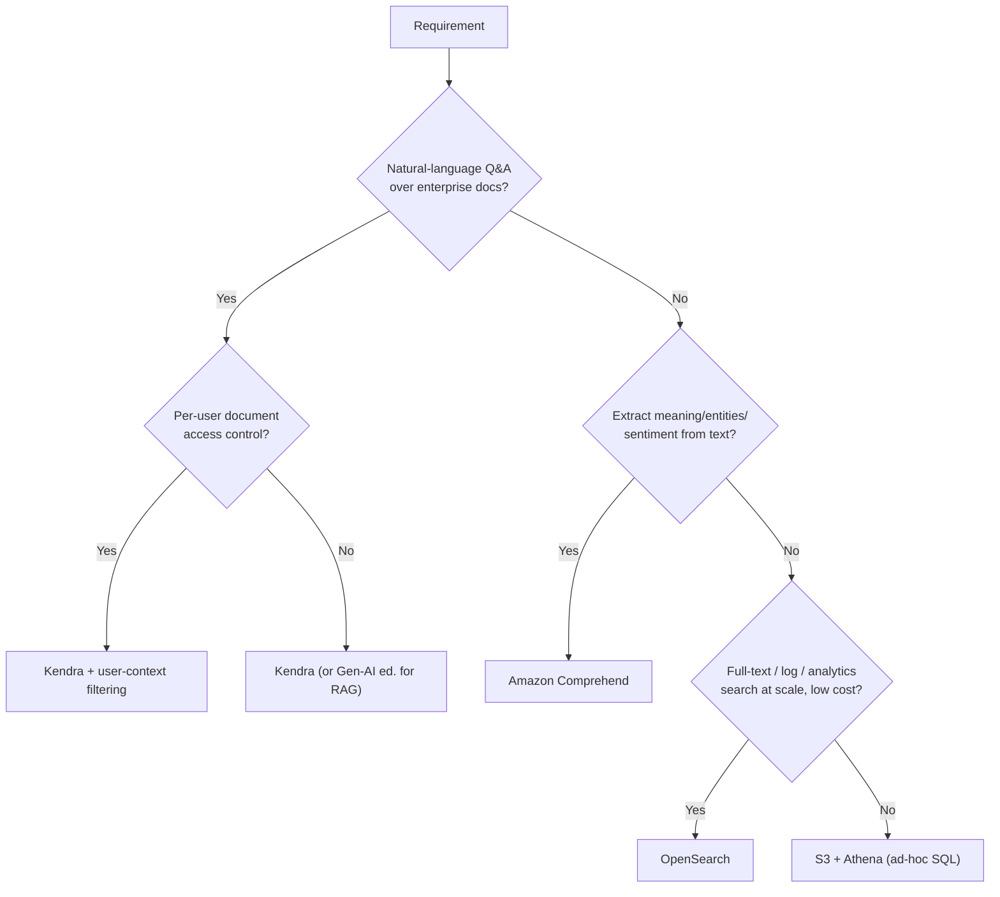

# Amazon Kendra - Exam Scenarios & Troubleshooting

> Scenario-driven practice for **Amazon Kendra**: 10 SAA-C03-style MCQs, an SRE-flavoured **errors & troubleshooting** table (sync failures, IAM, ACL misconfig, throttling, and the classic **idle-index cost runaway**), and a decision table to pick Kendra vs Comprehend vs OpenSearch vs S3+Athena.

See also: [00 - Machine Learning Overview](00%20-%20Machine%20Learning%20Overview.md) · [01 - Amazon Kendra Deep Dive](01%20-%20Amazon%20Kendra%20Deep%20Dive.md) · [01 - Amazon Comprehend Deep Dive](01%20-%20Amazon%20Comprehend%20Deep%20Dive.md) · [01 - Amazon Lex Deep Dive](01%20-%20Amazon%20Lex%20Deep%20Dive.md) · [01 - Amazon Textract Deep Dive](01%20-%20Amazon%20Textract%20Deep%20Dive.md)

---

## Table of Contents

- [1. Exam-Style Questions](#1-exam-style-questions)
- [2. Common Errors & Troubleshooting (SRE Perspective)](#2-common-errors--troubleshooting-sre-perspective)
- [3. Decision: Kendra vs Comprehend vs OpenSearch vs S3+Athena](#3-decision-kendra-vs-comprehend-vs-opensearch-vs-s3athena)
- [4. The Cost Trap (read this twice)](#4-the-cost-trap-read-this-twice)
- [5. Rapid-Fire Exam Cues](#5-rapid-fire-exam-cues)
- [Summary](#summary)

---

---

## 1. Exam-Style Questions

### Q1. Natural-language enterprise search

A company stores HR policies, IT runbooks, and contracts across S3, SharePoint, and Confluence. Employees should **ask questions in plain English** and get a **specific answer plus the source document**. Which service?

- A. Amazon OpenSearch Service
- B. Amazon Comprehend
- C. **Amazon Kendra**
- D. Amazon Athena over S3

**Answer: C**
**Explanation:** Natural-language Q&A over enterprise repositories with answer extraction = Kendra, which has native connectors for S3, SharePoint, and Confluence. OpenSearch is keyword/full-text. Comprehend extracts meaning but isn't a search service. Athena is SQL analytics.
**Exam Tip:** "Ask in plain English" + "enterprise documents" + "specific answer" -> Kendra.

---

### Q2. Per-user result filtering

Search results must ensure **each employee only sees documents they are authorized to access**, based on their group membership in SharePoint. What feature enables this?

- A. S3 bucket policies on the index
- B. **Kendra user-context filtering with document ACLs**
- C. A WAF rule in front of the search app
- D. CloudFront signed URLs

**Answer: B**
**Explanation:** Kendra ingests document ACLs and applies **user-context filtering** at query time using the user's identity/groups (token-based), so results are filtered per user. The other options don't filter search results by document permissions.
**Exam Tip:** "Only see results for documents they're permitted to" -> Kendra user-context filtering.

---

### Q3. Chatbot that answers from documents

A team building an **Amazon Lex** chatbot wants it to answer FAQ-style questions sourced from a corpus of manuals with minimal custom code. Best approach?

- A. Train a custom Lex intent per question
- B. **Use the Lex `AMAZON.KendraSearchIntent` to query a Kendra index**
- C. Store answers in DynamoDB and query per utterance
- D. Use Comprehend to classify each utterance

**Answer: B**
**Explanation:** Lex integrates with Kendra via the built-in `AMAZON.KendraSearchIntent`, returning document-sourced answers without hand-authoring an intent per question.
**Exam Tip:** Lex chatbot + "answers from documents/FAQs" -> Kendra search intent.

---

### Q4. RAG with a foundation model

You need a generative-AI assistant that grounds its answers in the company's private documents using **Amazon Bedrock**. Which Kendra capability feeds the model?

- A. The `Query` API only
- B. **The `Retrieve` API (Kendra as the retrieval layer for RAG)**
- C. Kendra Synonyms API
- D. Comprehend custom classification

**Answer: B**
**Explanation:** Kendra's `Retrieve` API (Gen-AI Enterprise edition) returns the most relevant passages, which you pass as context to a Bedrock foundation model - the standard RAG pattern.
**Exam Tip:** "RAG", "ground the LLM in private docs", "Bedrock" -> Kendra `Retrieve`.

---

### Q5. Cost concern for a small site

A small startup wants basic search over ~500 marketing blog pages on a tight budget. A junior engineer proposes Kendra Enterprise Edition. What's the issue?

- A. Kendra cannot index web content
- B. **Kendra bills an hourly index charge even when idle - it is overkill and costly for this scale**
- C. Kendra requires SageMaker
- D. Kendra has no web crawler

**Answer: B**
**Explanation:** Kendra runs a 24/7 hourly index charge regardless of query volume; for a tiny, low-budget site, OpenSearch or even S3+Athena/basic search is far cheaper.
**Exam Tip:** Small scale + low budget + "search" -> NOT Kendra. Watch for cost traps.

---

### Q6. Scanned PDFs not searchable

After indexing a bucket of **scanned (image) PDF** contracts, the text isn't searchable. What's missing?

- A. Enable Kendra incremental learning
- B. **Run Amazon Textract (OCR) to extract text before indexing**
- C. Increase query capacity units
- D. Add a synonyms thesaurus

**Answer: B**
**Explanation:** Image-only PDFs have no extractable text layer. Use Textract to OCR them into text Kendra can index. Capacity units and synonyms don't create missing text.
**Exam Tip:** "Scanned/image documents" + search -> Textract first, then Kendra.

---

### Q7. Documents appear after a delay

New documents added to a data source don't show in search immediately. Why, and what's the fix?

- A. Kendra never updates after first sync
- B. **Documents appear only after a data source sync (full or incremental) completes; schedule/trigger syncs**
- C. You must recreate the index
- D. Increase the FAQ count

**Answer: B**
**Explanation:** Kendra indexes via sync jobs. Until a sync runs and finishes, new/changed docs aren't queryable. Configure scheduled or on-demand incremental syncs.
**Exam Tip:** "Docs not appearing / indexing latency" -> check sync job status & schedule.

---

### Q8. Connector sync failing

A SharePoint Online data source sync fails immediately with an access error. Most likely cause?

- A. Index is in the wrong Region
- B. **The data source IAM role / stored credentials lack permission to read SharePoint (and its secret/KMS key)**
- C. Too many FAQs
- D. Query capacity exhausted

**Answer: B**
**Explanation:** Connectors assume an IAM/execution role and use stored source credentials (often in Secrets Manager). Missing read permissions on the source, the secret, or its KMS key cause immediate sync failures.
**Exam Tip:** "Sync fails" -> first suspect the **connector IAM role / Secrets Manager / KMS** permissions.

---

### Q9. Enrich documents with entities/PII

Before indexing legal docs, the company wants to **detect and tag entities and redact PII**. Which pairing?

- A. Kendra alone via relevance tuning
- B. **Kendra + Amazon Comprehend (custom document enrichment)**
- C. Kendra + Rekognition
- D. Kendra + Macie only

**Answer: B**
**Explanation:** Comprehend detects entities, key phrases, and PII; Kendra custom document enrichment can call it to enrich/redact during ingestion. Rekognition is for images/video.
**Exam Tip:** "Entities / PII / sentiment from text" -> Comprehend (alongside Kendra for search).

---

### Q10. Throttling during a traffic spike

During a launch, the search app gets `ThrottlingException` on the `Query` API. Best remediation?

- A. Switch to Developer Edition
- B. Delete and recreate the index
- C. **Implement exponential backoff with jitter and add query capacity units**
- D. Disable user-context filtering

**Answer: C**
**Explanation:** Throttling means you've hit query throughput limits. Handle with retries (**exponential backoff + jitter**) and scale by adding **query capacity units** (Enterprise edition). Developer edition has lower limits, not higher.
**Exam Tip:** `ThrottlingException` -> backoff + jitter, then add capacity units.

---

### Q11. Improving result quality over time

Users say the top result is often not the best one. Which Kendra features improve ranking? (choose the best)

- A. Only recreate the index nightly
- B. **Relevance tuning (attribute boosting) + incremental learning from clicks + synonyms thesaurus**
- C. Increase storage capacity units only
- D. Move to Developer Edition

**Answer: B**
**Explanation:** Relevance tuning boosts by attributes (freshness, source), incremental learning improves ranking from user interactions, and a synonyms thesaurus maps domain terms. Capacity units affect scale, not relevance.
**Exam Tip:** "Better/more relevant results" -> relevance tuning + incremental learning + synonyms.

---

### Q12. Wrong users seeing results

After a config change, some users see documents they shouldn't. Root cause?

- A. Index needs more storage capacity
- B. **Document ACLs not ingested or user-context token/groups misconfigured**
- C. FAQ file is malformed
- D. KMS key disabled

**Answer: B**
**Explanation:** If ACLs aren't ingested from the source, or the query doesn't pass correct user/group context, filtering can't restrict results properly. Re-sync with ACLs and verify the user-context token.
**Exam Tip:** "Wrong/extra results per user" -> ACL ingestion + user-context filtering config.

[⬆ Back to top](#table-of-contents)

---

## 2. Common Errors & Troubleshooting (SRE Perspective)

| Symptom                                                 | Likely cause                                                                                             | Fix / mitigation                                                                                                                |
| :------------------------------------------------------ | :------------------------------------------------------------------------------------------------------- | :------------------------------------------------------------------------------------------------------------------------------ |
| **Data source sync fails / errors**                     | Connector IAM role or stored credentials (Secrets Manager) lack read access to the source or its KMS key | Grant least-privilege read on source + secret + KMS; check sync job logs in the console/CloudWatch                              |
| **Documents not appearing**                             | No sync run since docs added, or unsupported/empty content                                               | Trigger/schedule incremental sync; confirm format supported; OCR scanned PDFs with [Textract](01%20-%20Amazon%20Textract%20Deep%20Dive.md) |
| **Indexing latency**                                    | Large full sync, throttled connector                                                                     | Use incremental syncs; stagger schedules; monitor sync job progress                                                             |
| **`ThrottlingException` on Query**                      | Exceeded query throughput (capacity)                                                                     | **Exponential backoff + jitter**; add **query capacity units** (Enterprise)                                                     |
| **Capacity / throughput limits hit**                    | Too many docs or queries/sec for provisioned units                                                       | Add **storage** and/or **query capacity units**; Developer edition has hard low caps                                            |
| **Wrong results per user (ACL/user-context misconfig)** | ACLs not ingested, or query omits/incorrect user identity & groups                                       | Re-sync with ACLs enabled; pass correct **user-context token / groups** on every `Query`                                        |
| **High/unexpected bill (cost runaway)**                 | **Idle index left running** - hourly charge accrues with zero queries; oversized capacity units          | Delete unused indexes; right-size capacity; use Developer edition for dev/test; alarm on Kendra spend                           |
| **Sync deletes documents unexpectedly**                 | Full sync removed docs no longer in source                                                               | Verify source contents; use incremental sync; understand deletion semantics before full re-sync                                 |
| **Web crawler misses pages**                            | robots/seed/depth/auth limits                                                                            | Adjust crawl scope, seed URLs, depth, and authentication settings                                                               |

[⬆ Back to top](#table-of-contents)

---

## 3. Decision: Kendra vs Comprehend vs OpenSearch vs S3+Athena

| Need                                                                         | Best service                  | Why                                                                                 |
| :--------------------------------------------------------------------------- | :---------------------------- | :---------------------------------------------------------------------------------- |
| Natural-language Q&A over enterprise docs, secure per-user search, RAG       | **Amazon Kendra**             | ML NLU search, managed connectors, document ACLs/user-context, Retrieve API for RAG |
| Extract entities, key phrases, sentiment, PII, language, topics from text    | **Amazon Comprehend**         | NLP analysis service (not a search engine)                                          |
| Scalable full-text / keyword search, log & operational analytics, dashboards | **Amazon OpenSearch Service** | Cheaper at scale, flexible queries/aggregations; lexical (not NLU)                  |
| Ad-hoc SQL queries over data in S3, simple/low-cost "search"                 | **S3 + Athena**               | Serverless, pay-per-query, cheapest for occasional structured lookups               |

Quick rule:

- **Plain-English answers over private docs / RAG / per-user security** -> **Kendra**.
- **Understand text (NLP)** -> **Comprehend**.
- **Big-scale keyword search / logs** -> **OpenSearch**.
- **Cheap ad-hoc lookups** -> **S3 + Athena**.

[⬆ Back to top](#table-of-contents)

---

## 4. The Cost Trap (read this twice)

Kendra charges an **hourly index fee by edition** that accrues **even with zero queries**. The most common real-world and exam pitfall:

- A POC index is left running -> a large bill for an idle resource.
- Enterprise edition provisioned for a tiny dataset -> massively overprovisioned.

> Exam heuristic: when the question stresses **small scale, low budget, or cost-sensitivity** and just needs "search," **Kendra is the wrong (too expensive) answer** - choose **OpenSearch** or **S3 + Athena**. Kendra is justified only when **natural-language understanding, managed enterprise connectors, per-user secure results, or RAG** are required.

[⬆ Back to top](#table-of-contents)

---

## 5. Rapid-Fire Exam Cues

| Phrase in the question                                               | Likely answer                                      |
| :------------------------------------------------------------------- | :------------------------------------------------- |
| "Ask questions in natural language", "intelligent enterprise search" | **Kendra**                                         |
| "Only see documents they're permitted to"                            | **Kendra user-context filtering + ACLs**           |
| "Chatbot answers from documents/FAQs" (Lex)                          | **Kendra `AMAZON.KendraSearchIntent`**             |
| "Ground an LLM / RAG with Bedrock"                                   | **Kendra `Retrieve` API (Gen-AI edition)**         |
| "Scanned PDFs / images, then search"                                 | **Textract -> Kendra**                             |
| "Detect PII / entities / sentiment"                                  | **Comprehend**                                     |
| "Logs / large-scale full-text search / dashboards"                   | **OpenSearch**                                     |
| "Cheap, ad-hoc, small budget search"                                 | **S3 + Athena (not Kendra)**                       |
| "`ThrottlingException`"                                              | **Backoff + jitter, add query capacity units**     |
| "Sync failed"                                                        | **Connector IAM role / Secrets / KMS permissions** |
| "Unexpected/high bill, idle resource"                                | **Idle Kendra index running 24/7**                 |

[⬆ Back to top](#table-of-contents)

---

## Summary

For the exam: reach for **Kendra** when you see **natural-language Q&A over enterprise content, per-user secure results, Lex/chatbot document answers, or RAG with Bedrock**. Troubleshoot using a predictable order - **sync jobs, connector IAM/secrets/KMS, ACL + user-context config, throttling (backoff + capacity units)** - and never forget the signature trap: **Kendra's idle hourly index cost** makes it the wrong choice for small, low-budget search where **OpenSearch** or **S3 + Athena** wins.

[⬆ Back to top](#table-of-contents)
