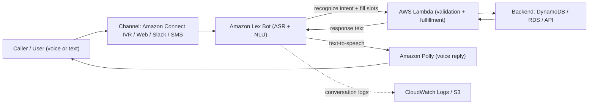

# Amazon Lex - SAA-C03 Deep Dive

> Amazon Lex is a **fully managed service for building conversational interfaces (chatbots)** for voice and text, using the **same automatic speech recognition (ASR) and natural language understanding (NLU)** technology that powers Amazon Alexa. You define intents, utterances, and slots, and wire fulfillment to AWS Lambda.

See also: [00 - Machine Learning Overview](00%20-%20Machine%20Learning%20Overview.md) · [01 - Amazon Polly Deep Dive](01%20-%20Amazon%20Polly%20Deep%20Dive.md) · [01 - Amazon Transcribe Deep Dive](01%20-%20Amazon%20Transcribe%20Deep%20Dive.md) · [01 - Amazon Comprehend Deep Dive](01%20-%20Amazon%20Comprehend%20Deep%20Dive.md)

---

## Table of Contents

- [What Is Amazon Lex?](#what-is-amazon-lex)
- [Core Building Blocks](#core-building-blocks)
- [How a Conversation Flows](#how-a-conversation-flows)
- [Lex V2 vs Lex V1](#lex-v2-vs-lex-v1)
- [Fulfillment with AWS Lambda](#fulfillment-with-aws-lambda)
- [Integrations & Deployment Channels](#integrations--deployment-channels)
- [Worked Example: Booking Bot](#worked-example-booking-bot)
- [Best Practices](#best-practices)
- [Pricing](#pricing)
- [Key Exam Facts](#key-exam-facts)

---



---

## What Is Amazon Lex?

Amazon Lex is an AWS service for building **conversational bots** that understand natural language in **both voice and text**. It is the technology behind Amazon Alexa, exposed as a developer service.

Two AI capabilities are combined:

| Capability                     | Acronym | Role                                                                     |
| :----------------------------- | :------ | :----------------------------------------------------------------------- |
| Automatic Speech Recognition   | ASR     | Converts spoken audio into text                                          |
| Natural Language Understanding | NLU     | Maps text to a structured **intent** and extracts parameters (**slots**) |

Lex is **serverless and fully managed** — no servers to provision, it auto-scales, and you pay per request. It returns a structured result (the matched intent and the filled slots) so your application logic does not have to parse free-form text.

Typical use cases the exam loves:

- **Customer-service chatbots** (web/mobile self-service).
- **Call-center / IVR virtual agents** (paired with Amazon Connect).
- **Application bots** for booking, FAQ, account lookups, and informational queries.

[⬆ Back to top](#table-of-contents)

---

## Core Building Blocks

| Component                        | Description                                                                                                                                                                    |
| :------------------------------- | :----------------------------------------------------------------------------------------------------------------------------------------------------------------------------- |
| **Bot**                          | The top-level container for a conversational application. A bot has one or more **locales** (language/region) and contains intents.                                            |
| **Intent**                       | An action the user wants to perform, e.g. `BookHotel`, `OrderPizza`, `CheckBalance`. The unit Lex tries to recognize.                                                          |
| **Utterances**                   | Sample phrases users might say/type that map to an intent (e.g. "I want to book a room", "reserve a hotel"). Lex generalizes from these.                                       |
| **Slots**                        | Parameters needed to fulfill an intent (e.g. `CheckInDate`, `City`, `Nights`). Each slot has a **slot type**.                                                                  |
| **Slot types**                   | Define the data a slot accepts. **Built-in** types (`AMAZON.Date`, `AMAZON.Number`, `AMAZON.City`, `AMAZON.Phone`...) or **custom** slot types (enumerated values + synonyms). |
| **Prompts**                      | Questions Lex asks to **elicit** a missing slot ("What city are you traveling to?").                                                                                           |
| **Confirmation prompt**          | An optional "Are you sure?" step before fulfillment ("Book a room in Paris for 3 nights — shall I confirm?").                                                                  |
| **Fulfillment**                  | The business logic that satisfies the intent once all slots are filled — almost always **an AWS Lambda function**, or `ReturnIntent` to hand back to the client.               |
| **Session attributes / context** | Key-value state carried across turns of a conversation; **context tags** let one intent's fulfillment trigger eligibility of follow-up intents.                                |
| **Confidence scores**            | Lex returns an **intent confidence score (0-1)** and slot resolution scores so your app can decide whether to trust the match.                                                 |
| **Fallback intent**              | `AMAZON.FallbackIntent` is triggered when Lex cannot match user input to any intent with sufficient confidence ("Sorry, I didn't understand").                                 |

**Slot elicitation flow:** Lex automatically loops, asking the configured prompt for each required slot until all are filled, then runs the (optional) confirmation, then fulfillment. You do not write that loop yourself — you configure prompts and Lex drives the dialog.

[⬆ Back to top](#table-of-contents)

---

## How a Conversation Flows

1. **Input** arrives as text or audio over a channel (web SDK, Amazon Connect, Slack, SMS).
2. **ASR** transcribes audio to text (text input skips this).
3. **NLU** matches the text to an **intent** and extracts **slot** values, returning a **confidence score**.
4. If required slots are missing, Lex emits **elicitation prompts** and waits for the next turn (dialog management).
5. Optional **slot validation** / **confirmation** runs (often via a Lambda `DialogCodeHook`).
6. Once complete, Lex invokes the **fulfillment Lambda** (`FulfillmentCodeHook`) or returns the intent to the client.
7. The text response is sent back; for voice, Lex uses **Amazon Polly** to synthesize speech.
8. If nothing matches, the **fallback intent** handles the turn.

[⬆ Back to top](#table-of-contents)

---

## Lex V2 vs Lex V1

The exam (and all new development) targets **Lex V2**. V1 still exists but is legacy.

| Aspect             | **Lex V2 (current)**                                                         | **Lex V1 (legacy)**                            |
| :----------------- | :--------------------------------------------------------------------------- | :--------------------------------------------- |
| Multi-language     | **Multiple locales per bot** (add languages to one bot)                      | One language per bot                           |
| Conversation API   | **Streaming** (`StartConversation`) + `RecognizeText` / `RecognizeUtterance` | `PostText` / `PostContent` (no streaming)      |
| Resource model     | Bot → bot version → **alias** → locale → intents                             | Bot/intent/slot resources versioned separately |
| Builder experience | Simplified console, better slot/dialog management                            | Older console                                  |
| Recommended?       | **Yes — use for all new bots**                                               | Maintenance only                               |

Key V2 ideas:

- **Locales** let one bot serve `en_US`, `es_US`, `fr_FR`, etc., each with its own intents/utterances.
- **Streaming conversations** keep an open connection for natural barge-in/interruptions and managing pauses — useful for real-time voice IVR.

[⬆ Back to top](#table-of-contents)

---

## Fulfillment with AWS Lambda

Lambda is where **all custom business logic** lives. Lex passes a structured event and expects a structured response. There are two hook points:

| Code hook                 | When it runs                                 | Typical job                                                   |
| :------------------------ | :------------------------------------------- | :------------------------------------------------------------ |
| **Dialog code hook**      | On each turn while slots are being collected | Validate slot values, re-prompt, set/elicit slots dynamically |
| **Fulfillment code hook** | After all slots are filled (and confirmed)   | Do the work: write to DynamoDB, call an API, return result    |

**Minimal Lex V2 fulfillment Lambda (Python):**

```python
def lambda_handler(event, context):
    slots = event["sessionState"]["intent"]["slots"]
    city = slots["City"]["value"]["interpretedValue"]
    nights = slots["Nights"]["value"]["interpretedValue"]

    # ... business logic: write booking to DynamoDB, etc.

    return {
        "sessionState": {
            "dialogAction": {"type": "Close"},
            "intent": {
                "name": event["sessionState"]["intent"]["name"],
                "state": "Fulfilled"
            }
        },
        "messages": [{
            "contentType": "PlainText",
            "content": f"Booked {nights} nights in {city}. See you soon!"
        }]
    }
```

**Critical permission detail:** Lex must be **granted permission to invoke the Lambda function** (a resource-based policy / Lambda permission with principal `lexv2.amazonaws.com`). Separately, the **Lambda execution role** needs permissions for whatever it calls (DynamoDB, RDS, etc.). Missing the Lex→Lambda invoke permission is a classic "fulfillment failed" cause.

[⬆ Back to top](#table-of-contents)

---

## Integrations & Deployment Channels

| Integration                               | What it adds                                                                                                                                                                                |
| :---------------------------------------- | :------------------------------------------------------------------------------------------------------------------------------------------------------------------------------------------ |
| **AWS Lambda**                            | Business logic for validation and fulfillment.                                                                                                                                              |
| **Amazon Connect**                        | Drop Lex into a **contact-center IVR** as a virtual agent — Connect routes the caller's audio to Lex and acts on the returned intent. The flagship "call center chatbot" architecture.      |
| **Amazon Polly**                          | Lex uses Polly under the hood to convert text responses to lifelike **speech** for voice bots.                                                                                              |
| **Amazon Transcribe / Amazon Comprehend** | Adjacent services — Transcribe for raw speech-to-text on recordings (not real-time dialog), Comprehend for sentiment/entity analysis of conversation logs. Lex itself already does ASR+NLU. |
| **Amazon Kendra**                         | A Lex bot can use the `AMAZON.KendraSearchIntent` to answer FAQ-style questions from a Kendra index.                                                                                        |
| **CloudWatch / S3**                       | **Conversation logs** (text and audio) can be stored in CloudWatch Logs and S3 for auditing, debugging, and analytics.                                                                      |

**Channels (deploy without writing front-end code):**

- **Slack**
- **Facebook Messenger**
- **Twilio SMS**
- Plus the Lex Web/mobile SDK and Amazon Connect for voice.

[⬆ Back to top](#table-of-contents)

---

## Worked Example: Booking Bot

**Bot:** `TravelBot` (locale `en_US`)

**Intent:** `BookHotel`

**Sample utterances:**

- "I want to book a hotel"
- "Book a room in {City}"
- "Reserve a hotel for {Nights} nights"

**Slots:**

| Slot          | Slot type                                    | Prompt                             |
| :------------ | :------------------------------------------- | :--------------------------------- |
| `City`        | `AMAZON.City`                                | "Which city are you traveling to?" |
| `CheckInDate` | `AMAZON.Date`                                | "What date will you check in?"     |
| `Nights`      | `AMAZON.Number`                              | "How many nights?"                 |
| `RoomType`    | Custom (`king`, `queen`, `suite` + synonyms) | "King, queen, or suite?"           |

**Confirmation prompt:** "Book a {RoomType} room in {City} from {CheckInDate} for {Nights} nights?"

**Fulfillment:** Lambda writes the reservation to DynamoDB and returns a confirmation number; Lex speaks it via Polly for the voice channel.

[⬆ Back to top](#table-of-contents)

---

## Best Practices

- **Validate slots** with a dialog code hook (e.g. reject past dates, unsupported cities) and re-prompt cleanly instead of failing fulfillment.
- **Handle errors gracefully:** always implement `AMAZON.FallbackIntent` and a friendly clarification prompt; cap re-prompt retries.
- **Use confidence-score thresholds** to decide between proceeding, asking to clarify, or escalating to a human agent.
- **Provide many varied sample utterances** per intent so the NLU generalizes; avoid overlapping utterances across intents (causes misclassification).
- **Versioning & aliases:** publish numbered, immutable **bot versions** and point an **alias** (e.g. `prod`, `dev`) at a version. Clients call the **alias**, so you can promote a new version by repointing the alias — clean blue/green deploys and easy rollback. Never have production call `$LATEST` (the mutable draft).
- **Enable conversation logs** to CloudWatch/S3 to debug intent mismatches and improve training data.
- **Match locale/language** between the bot and the channel — a mismatch yields no matches/fallback.
- **Least-privilege IAM:** keep the Lex→Lambda invoke permission and the Lambda execution role scoped tightly.

[⬆ Back to top](#table-of-contents)

---

## Pricing

Amazon Lex V2 is **pay-per-request** with no minimums or upfront cost:

| Request type        | Billed per                                                                         |
| :------------------ | :--------------------------------------------------------------------------------- |
| **Speech requests** | Per **speech** request processed (higher unit price — includes ASR/audio handling) |
| **Text requests**   | Per **text** request processed (lower unit price)                                  |

- You also pay separately for downstream services: **Lambda** invocations, **Polly** synthesis (voice replies), **Connect** usage, **DynamoDB**, etc.
- There is a **free tier** for the first year (a fixed number of text and speech requests per month).

**Exam takeaway:** speech (voice) requests cost more than text requests because of the speech processing involved.

[⬆ Back to top](#table-of-contents)

---

## Key Exam Facts

- Lex = **build chatbots / conversational interfaces** for **voice and text**; same tech as **Alexa**; provides **ASR + NLU**.
- Core terms: **bot, intent, utterances, slots, slot types, prompts, confirmation, fulfillment, fallback intent, confidence score, session attributes**.
- **Fulfillment / business logic = AWS Lambda.** Lex needs invoke permission on the Lambda; the Lambda's own role needs downstream permissions.
- **Voice output = Amazon Polly** (text-to-speech). **Call-center virtual agent = Lex + Amazon Connect (+ Lambda + Polly).** Memorize this stack.
- **Lex V2** supports **multiple locales per bot** and **streaming conversations**; use **versions + aliases** for deployment.
- Channels: **Slack, Facebook Messenger, Twilio SMS** (plus Connect and web SDK).
- **Serverless, fully managed, auto-scaling, pay-per-request**; speech requests cost more than text.
- If the question says "build a chatbot/virtual agent" → **Lex**. If it says "transcribe a recording" → **Transcribe**. If "sentiment/entities from text" → **Comprehend**. If "turn text into speech" only → **Polly**.

[⬆ Back to top](#table-of-contents)
