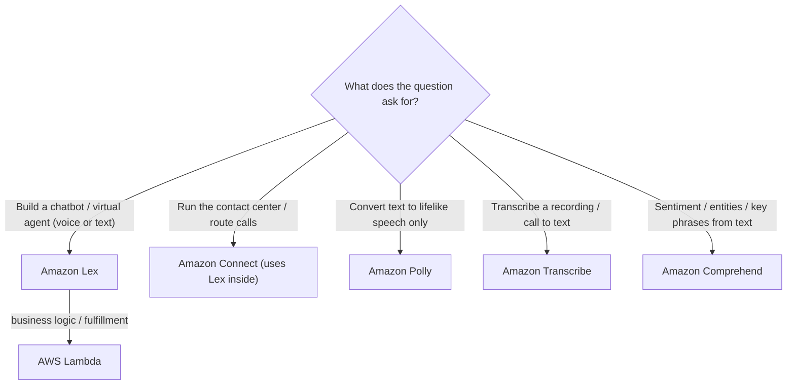

# Amazon Lex - Exam Scenarios & Troubleshooting

> Exam-style MCQs for Amazon Lex plus an SRE-style troubleshooting table and a decision matrix for choosing **Lex vs Connect vs Polly/Transcribe vs Comprehend**. Use as the review pass after the deep dive.

See also: [00 - Machine Learning Overview](00%20-%20Machine%20Learning%20Overview.md) · [01 - Amazon Lex Deep Dive](01%20-%20Amazon%20Lex%20Deep%20Dive.md) · [01 - Amazon Polly Deep Dive](01%20-%20Amazon%20Polly%20Deep%20Dive.md) · [01 - Amazon Transcribe Deep Dive](01%20-%20Amazon%20Transcribe%20Deep%20Dive.md) · [01 - Amazon Comprehend Deep Dive](01%20-%20Amazon%20Comprehend%20Deep%20Dive.md)

---

## Table of Contents

- [Practice Questions](#practice-questions)
- [Common Errors & Troubleshooting (SRE Perspective)](#common-errors--troubleshooting-sre-perspective)
- [Decision: Lex vs Connect vs Polly/Transcribe vs Comprehend](#decision-lex-vs-connect-vs-pollytranscribe-vs-comprehend)
- [Exam-Day Cheat Sheet](#exam-day-cheat-sheet)

---

---

## Practice Questions

### Question 1 (Easy)

**Question:** A company wants to build a **text and voice chatbot** for customer self-service that understands natural language requests like "book a flight to Boston". Which AWS service is purpose-built for this?

A) Amazon Polly
B) Amazon Transcribe
C) Amazon Lex
D) Amazon Comprehend

**Answer:** C

**Explanation:** Amazon Lex builds conversational interfaces (chatbots) for voice and text using ASR + NLU — exactly the "understand a natural-language request and act on it" use case. Polly is text-to-speech only, Transcribe is speech-to-text only, Comprehend is NLP analytics (sentiment/entities), none of which manage a dialog.

**Exam Tip:** "Build a chatbot / conversational interface / virtual agent" → **Lex**.

---

### Question 2 (Easy)

**Question:** Which technology powers Amazon Lex's speech recognition and language understanding?

A) The same ASR and NLU that powers Amazon Alexa
B) Amazon Rekognition
C) Amazon Kendra
D) A customer-supplied model only

**Answer:** A

**Explanation:** Lex uses the same automatic speech recognition (ASR) and natural language understanding (NLU) deep-learning tech as Amazon Alexa.

**Exam Tip:** Remember the Alexa connection — it is a common factual question.

---

### Question 3 (Medium)

**Question:** A bank is building a **call-center virtual agent**. Callers phone in, speak naturally, the system understands intent, looks up account data, and **responds with a spoken voice**. Which combination of services best implements this?

A) Amazon Connect + Amazon Lex + AWS Lambda + Amazon Polly
B) Amazon Transcribe + Amazon Comprehend + Amazon Polly
C) Amazon Lex + Amazon Rekognition + DynamoDB
D) Amazon Connect + Amazon Transcribe only

**Answer:** A

**Explanation:** **Connect** is the cloud contact center handling the phone call; **Lex** provides the conversational ASR/NLU virtual agent; **Lambda** runs the account-lookup business logic / fulfillment; **Polly** synthesizes the spoken response. This is the canonical Lex IVR stack.

**Exam Tip:** "Call center" + "spoken response" + "understand intent" → memorize **Connect + Lex + Lambda + Polly**.

---

### Question 4 (Medium)

**Question:** In an Amazon Lex bot, where should the **business logic** (e.g. writing a booking to a database) be implemented?

A) Directly inside the Lex intent configuration
B) In an AWS Lambda fulfillment function invoked by Lex
C) In Amazon Polly
D) In an EC2 instance polling Lex

**Answer:** B

**Explanation:** Lex delegates fulfillment (and optional slot validation) to **AWS Lambda** via code hooks. Lex handles the dialog; Lambda does the work.

**Exam Tip:** Lex + custom logic = **Lambda**, almost always.

---

### Question 5 (Medium)

**Question:** A Lex bot's fulfillment consistently fails with the bot reporting it could not complete the request. CloudTrail/logs show Lex never invoked the Lambda. What is the most likely cause?

A) The Lambda has no internet access
B) Lex lacks permission to invoke the Lambda function
C) Polly is not enabled in the region
D) The bot has too many intents

**Answer:** B

**Explanation:** Lex must have a **resource-based permission** allowing the `lexv2.amazonaws.com` principal to invoke the Lambda. Without it, the invocation is denied before any business logic runs.

**Exam Tip:** Two separate permissions matter — **Lex→Lambda invoke** permission, and the **Lambda execution role** for downstream calls.

---

### Question 6 (Medium)

**Question:** A company needs one chatbot that serves customers in **English, Spanish, and French**. What is the recommended approach with Amazon Lex V2?

A) Build three separate bots and load-balance between them
B) Add multiple **locales** to a single Lex V2 bot
C) Use Lex V1 with one language and translate at runtime
D) Lex does not support multiple languages

**Answer:** B

**Explanation:** Lex **V2** supports **multiple locales (language/region pairs) within a single bot**, each with its own intents and utterances. This is a V2 advantage over V1's one-language-per-bot model.

**Exam Tip:** "Multiple languages in one bot" → **Lex V2 locales**.

---

### Question 7 (Medium)

**Question:** Users frequently report the bot replies "Sorry, I didn't understand that" even for valid requests. Which two actions best improve intent recognition? (Choose the best single answer.)

A) Increase the Lambda timeout
B) Add more varied sample utterances and tune the fallback/confidence threshold
C) Switch the channel from Slack to SMS
D) Disable conversation logging

**Answer:** B

**Explanation:** "Didn't understand" means input is falling to the **fallback intent** due to low NLU confidence. Adding diverse sample utterances and adjusting confidence thresholds improves matching. Lambda timeout, channel, and logging are unrelated to NLU accuracy.

**Exam Tip:** Low match rate → more/better **utterances** + **confidence threshold**, not infrastructure tuning.

---

### Question 8 (Hard)

**Question:** A team wants **zero-downtime promotion** of a new Lex bot version to production with easy rollback. What should they do?

A) Edit the `$LATEST` draft directly in production
B) Publish a numbered **bot version** and repoint a production **alias** to it
C) Delete the old bot and recreate it
D) Use CloudFront in front of Lex

**Answer:** B

**Explanation:** Lex supports immutable **versions** and mutable **aliases**. Clients call the alias; promoting a version is just repointing the alias, and rollback is repointing it back. Calling `$LATEST` in production is unsafe because it is the editable draft.

**Exam Tip:** Lex deployment = **versions + aliases** (same pattern as Lambda).

---

### Question 9 (Hard)

**Question:** An organization wants to **analyze the sentiment** of thousands of stored chat transcripts and **transcribe** recorded support calls into text — but is NOT building a live chatbot. Which services fit?

A) Amazon Lex for both
B) Amazon Transcribe for the call recordings and Amazon Comprehend for sentiment
C) Amazon Polly for transcription and Lex for sentiment
D) Amazon Connect for both

**Answer:** B

**Explanation:** **Transcribe** converts recorded speech to text; **Comprehend** extracts sentiment/entities/key phrases from text. Lex is for **interactive** conversations, not batch analytics, so it is the wrong tool here.

**Exam Tip:** Distinguish **interactive dialog (Lex)** from **batch speech-to-text (Transcribe)** and **text analytics (Comprehend)**.

---

### Question 10 (Hard)

**Question:** A voice bot intermittently fails fulfillment during peak load with throttling errors, and some Lambda invocations time out on slow database calls. Which combination addresses this?

A) Increase Lambda timeout/memory and concurrency, add retry with exponential backoff, and optimize the backend query
B) Switch from Lex V2 to V1
C) Replace Polly with Transcribe
D) Move the bot to a different channel

**Answer:** A

**Explanation:** Timeouts are solved by raising the Lambda timeout/memory and optimizing the slow backend call; throttling is mitigated with higher reserved concurrency and **exponential backoff with retries**. Service/version/channel swaps do not address compute limits.

**Exam Tip:** Throttling → **backoff + concurrency**; slow fulfillment → **Lambda timeout/memory + backend tuning**.

---

### Question 11 (Medium)

**Question:** A Lex bot keeps **asking the same question repeatedly** ("What city?") and never proceeds, even when the user answers. What is the most likely root cause?

A) The slot type/validation is rejecting the value, so the slot is never filled
B) Polly is misconfigured
C) The bot has no fallback intent
D) Conversation logs are disabled

**Answer:** A

**Explanation:** A re-prompt loop means the required slot is never considered "filled" — usually because the value does not match the slot type, or a dialog code hook keeps re-eliciting it. Fix the slot type, synonyms, or validation logic.

**Exam Tip:** Slot **elicitation loop** = slot value not being accepted/validated.

---

### Question 12 (Medium)

**Question:** Which channels can an Amazon Lex bot be deployed to **without building a custom front end**? (Choose the best answer.)

A) Slack, Facebook Messenger, and Twilio SMS
B) Only the AWS Management Console
C) Only Amazon S3 static websites
D) Only on-premises PBX hardware

**Answer:** A

**Explanation:** Lex provides built-in channel integrations for **Slack, Facebook Messenger, and Twilio SMS** (plus Amazon Connect for voice and the web/mobile SDK).

**Exam Tip:** Memorize the trio: **Slack, Facebook Messenger, Twilio SMS**.

---

[⬆ Back to top](#table-of-contents)

---

## Common Errors & Troubleshooting (SRE Perspective)

| Symptom                                                 | Likely root cause                                                                           | Fix / mitigation                                                                                        |
| :------------------------------------------------------ | :------------------------------------------------------------------------------------------ | :------------------------------------------------------------------------------------------------------ |
| Bot says "couldn't complete request"; Lambda never runs | Lex lacks **invoke permission** on the fulfillment Lambda (`lexv2.amazonaws.com` principal) | Add the Lambda resource-based permission / Lex bot Lambda permission                                    |
| Lambda runs but `AccessDenied` to DynamoDB/RDS/API      | **Lambda execution role** missing downstream permissions                                    | Grant least-privilege IAM to the Lambda's execution role                                                |
| Fulfillment times out at peak                           | Lambda **timeout** too low or slow backend query                                            | Raise Lambda timeout/memory, optimize query, add caching                                                |
| Intermittent `ThrottlingException` / 429 under load     | Lambda **concurrency limit** or downstream throttling                                       | Increase reserved/provisioned concurrency; **retry with exponential backoff + jitter**                  |
| Frequent "I didn't understand" / wrong intent           | **Low NLU confidence**; too few or overlapping utterances                                   | Add varied sample utterances, separate overlapping intents, tune confidence threshold + fallback intent |
| Bot loops asking the same slot question                 | **Slot not filled** — value fails slot type or dialog hook keeps re-eliciting               | Fix slot type/synonyms, correct validation logic, set slot from Lambda                                  |
| Bot responds in the wrong/unsupported language          | **Locale/language mismatch** between bot config and channel/request                         | Align bot **locale** with the channel; add the required locale in V2                                    |
| New release breaks prod or can't roll back              | Production calling **`$LATEST`** draft, or alias pointed at wrong version                   | Use immutable **versions** + **aliases**; promote/rollback by repointing alias                          |
| No voice output on a voice bot                          | Polly/voice output misconfigured or channel is text-only                                    | Verify Polly voice/locale settings and that the channel supports audio                                  |
| Can't debug why intents mismatch                        | **Conversation logging disabled**                                                           | Enable conversation logs to **CloudWatch Logs / S3**; use as new training data                          |

[⬆ Back to top](#table-of-contents)

---

## Decision: Lex vs Connect vs Polly/Transcribe vs Comprehend

| Need                                                                                              | Service               | Why                                                                           |
| :------------------------------------------------------------------------------------------------ | :-------------------- | :---------------------------------------------------------------------------- |
| Build an interactive **chatbot / virtual agent** (voice or text) that understands intent and acts | **Amazon Lex**        | Provides ASR + NLU + dialog management; fulfillment via Lambda                |
| Operate the **cloud contact center** (phone numbers, call routing, agents, IVR)                   | **Amazon Connect**    | Full contact-center platform; **embeds Lex** for the conversational/IVR layer |
| Convert **text into lifelike speech** (only)                                                      | **Amazon Polly**      | Text-to-speech; used by Lex for voice replies, or standalone                  |
| Convert **recorded/streaming speech into text** (no dialog)                                       | **Amazon Transcribe** | Speech-to-text for recordings, captions, call analytics                       |
| Extract **sentiment, entities, key phrases, language** from text                                  | **Amazon Comprehend** | NLP text analytics on documents/transcripts                                   |

**Mental model:** **Connect** is the contact center; inside it, **Lex** is the brain that talks to the caller; **Polly** is its voice; **Lambda** is its hands. **Transcribe** and **Comprehend** are batch/analytics tools, not interactive-dialog tools.

[⬆ Back to top](#table-of-contents)

---

## Exam-Day Cheat Sheet

- "Build a chatbot / conversational interface / virtual agent (voice or text)" → **Amazon Lex**.
- Lex = same **ASR + NLU as Alexa**; fully managed, serverless, **pay-per-request** (speech costs more than text).
- Call-center voice virtual agent stack = **Amazon Connect + Lex + Lambda + Polly**.
- **Business logic / fulfillment = Lambda**; ensure **Lex→Lambda invoke permission** AND the **Lambda role** for downstream calls.
- **Voice output = Polly**; **transcribe recordings = Transcribe**; **text sentiment/entities = Comprehend**.
- **Lex V2** = multiple **locales** per bot + **streaming** conversations; deploy with **versions + aliases**.
- Channels without custom UI: **Slack, Facebook Messenger, Twilio SMS** (+ Connect, web SDK).
- "I didn't understand" → fallback intent / low confidence → add utterances + tune threshold.
- Repeated slot question → slot **not filled** (slot type/validation issue).
- Throttling → **exponential backoff + concurrency**; slow fulfillment → **timeout/memory + backend tuning**.

[⬆ Back to top](#table-of-contents)
