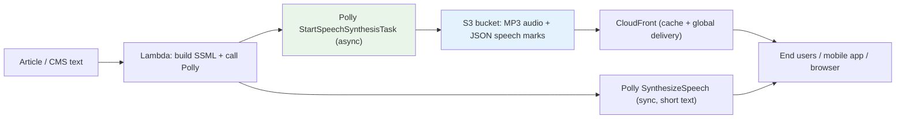

# Amazon Polly - SAA-C03 Deep Dive

> Amazon Polly is a fully managed **Text-to-Speech (TTS)** service that turns written text into lifelike spoken audio. It is the **opposite of Amazon Transcribe** (which converts speech → text), and on the exam it is the answer whenever an app needs to "speak", read articles aloud, or generate IVR prompts.

See also: [00 - Machine Learning Overview](00%20-%20Machine%20Learning%20Overview.md) · [01 - Amazon Transcribe Deep Dive](01%20-%20Amazon%20Transcribe%20Deep%20Dive.md) · [01 - Amazon Lex Deep Dive](01%20-%20Amazon%20Lex%20Deep%20Dive.md) · [01 - Amazon Translate Deep Dive](01%20-%20Amazon%20Translate%20Deep%20Dive.md)

---

## Table of Contents

- [Part 1: What Is Amazon Polly? Core Concept](#part-1-what-is-amazon-polly-core-concept)
- [Part 2: Voice Engines - Standard, Neural, Long-form, Generative, Brand Voice](#part-2-voice-engines---standard-neural-long-form-generative-brand-voice)
- [Part 3: SSML - Controlling How Polly Speaks](#part-3-ssml---controlling-how-polly-speaks)
- [Part 4: Lexicons - Custom Pronunciation](#part-4-lexicons---custom-pronunciation)
- [Part 5: Speech Marks - Metadata for Lip-Sync & Highlighting](#part-5-speech-marks---metadata-for-lip-sync--highlighting)
- [Part 6: Output Formats](#part-6-output-formats)
- [Part 7: Synchronous vs Asynchronous Synthesis](#part-7-synchronous-vs-asynchronous-synthesis)
- [Part 8: Language & Voice Coverage](#part-8-language--voice-coverage)
- [Part 9: Integrations & Reference Architecture](#part-9-integrations--reference-architecture)
- [Part 10: Examples - CLI & SSML](#part-10-examples---cli--ssml)
- [Part 11: Best Practices](#part-11-best-practices)
- [Part 12: Pricing](#part-12-pricing)
- [Summary: Key Exam Facts](#summary-key-exam-facts)

---



---

Amazon Polly is part of the AWS managed AI/ML services family. For the SAA-C03 exam you rarely need to tune ML models - instead you must recognise **which managed service solves a described problem**. Polly's signal phrases are: "give the application a voice", "read text/articles aloud", "generate audio prompts for an IVR", "convert text to natural-sounding speech".

---

## Part 1: What Is Amazon Polly? Core Concept

**Amazon Polly** is a fully managed, pay-as-you-go **Text-to-Speech (TTS)** service. You send it text (plain text or SSML), choose a voice and engine, and Polly returns an **audio stream** (or writes audio to S3) containing lifelike synthesized speech.

### The Direction Trap (Memorise This)

| Service               | Direction     | Mnemonic                                          |
| :-------------------- | :------------ | :------------------------------------------------ |
| **Amazon Polly**      | Text → Speech | "**P**olly **P**roduces sound / **P**arrots text" |
| **Amazon Transcribe** | Speech → Text | "**T**ranscribe **T**ypes what it hears"          |

This input/output direction is the single most common Polly distractor on the exam. If the requirement is "caption a recording" or "create searchable text from call audio", that is **Transcribe**, not Polly. If the requirement is "make the app talk", it is **Polly**.

### Key characteristics

- **Fully managed & serverless** - no infrastructure, scales automatically.
- **Real-time and batch** - synchronous streaming for short text; asynchronous tasks for long documents.
- **Integrates with the AWS ecosystem** - Lambda, S3, CloudFront, Lex, Amazon Connect, API Gateway.
- **Many languages and voices**, multiple **engines** that trade off naturalness vs cost.

[⬆ Back to top](#table-of-contents)

---

## Part 2: Voice Engines - Standard, Neural, Long-form, Generative, Brand Voice

Polly offers multiple **engines**. The engine determines audio naturalness, supported voices/languages, latency, and cost. You select the engine per request (`Engine` parameter) and a compatible `VoiceId`.

| Engine            | What it is                                                                       | When to use                                           | Relative cost        |
| :---------------- | :------------------------------------------------------------------------------- | :---------------------------------------------------- | :------------------- |
| **Standard**      | Original concatenative TTS; robotic but cheap                                    | High volume, cost-sensitive, naturalness not critical | Lowest               |
| **Neural (NTTS)** | Deep-learning model; much more natural intonation                                | Customer-facing apps, IVR, conversational bots        | Higher than Standard |
| **Long-form**     | Tuned for long content (articles, books, news) with expressive, natural delivery | Reading long articles/audiobooks aloud                | Premium              |
| **Generative**    | Most human-like, emotionally engaging, conversational                            | Premium customer experiences, virtual assistants      | Highest              |
| **Brand Voice**   | A **custom** NTTS voice built with AWS for your organisation (engagement-based)  | Unique branded voice persona                          | Custom engagement    |

### Exam-relevant points

- Not every `VoiceId` supports every engine - an **unsupported voice/engine combination throws an error**. Always pick a voice that supports the chosen engine.
- **Neural** is the default "natural sounding" recommendation on the exam when quality matters and cost is acceptable.
- **Brand Voice** is a custom voice (not self-serve in the console for arbitrary voices) - choose it when the scenario explicitly wants a unique, proprietary voice persona.
- **Generative / Long-form** are the answers when the scenario stresses "most lifelike", "conversational", or "long articles/audiobooks".

[⬆ Back to top](#table-of-contents)

---

## Part 3: SSML - Controlling How Polly Speaks

**SSML (Speech Synthesis Markup Language)** is a W3C XML markup you wrap around text to control delivery. Send it with `TextType=ssml`.

| SSML capability             | Tag          | Purpose                                                        |
| :-------------------------- | :----------- | :------------------------------------------------------------- |
| **Pauses / breaks**         | `<break>`    | Insert silence (e.g. `time="500ms"`)                           |
| **Emphasis**                | `<emphasis>` | Stress a word (strong/moderate/reduced)                        |
| **Say-as**                  | `<say-as>`   | Interpret text as date, telephone, digits, spell-out, currency |
| **Prosody**                 | `<prosody>`  | Control rate, pitch, and volume                                |
| **Phoneme / pronunciation** | `<phoneme>`  | Force exact pronunciation via IPA or X-SAMPA                   |
| **Paragraph / sentence**    | `<p>`, `<s>` | Structure with natural pauses                                  |

SSML is the in-line, per-request way to fix pronunciation and pacing. For pronunciation that must apply **globally across many requests**, use a **Lexicon** (Part 4) instead.

[⬆ Back to top](#table-of-contents)

---

## Part 4: Lexicons - Custom Pronunciation

A **Pronunciation Lexicon** is a **PLS (Pronunciation Lexicon Specification)** XML file you upload to Polly. It maps words/aliases to a custom pronunciation so Polly always says them correctly - e.g. expand "AWS" to "Amazon Web Services", or pronounce a brand/medical/technical term properly.

- Managed with `PutLexicon`, `GetLexicon`, `ListLexicons`, `DeleteLexicon`.
- Apply at synthesis time via the `LexiconNames` parameter (you can apply multiple).
- **Lexicon vs SSML `<phoneme>`:** lexicon = reusable, account/region-wide rules applied automatically; SSML = one-off, inline control. Use a lexicon when the same correction must apply across all text without editing every request.
- Common error: an invalid PLS document or a lexicon in a different region than the request fails - lexicons are **regional**.

[⬆ Back to top](#table-of-contents)

---

## Part 5: Speech Marks - Metadata for Lip-Sync & Highlighting

**Speech Marks** are JSON metadata Polly can return alongside (or instead of) audio, describing **when** each unit is spoken. Request them with `OutputFormat=json` and the `SpeechMarkTypes` parameter.

| Speech mark type | Describes                      | Typical use                           |
| :--------------- | :----------------------------- | :------------------------------------ |
| `sentence`       | Sentence start offset          | Karaoke-style sentence highlighting   |
| `word`           | Word start offset & byte range | Highlight words as they are read      |
| `viseme`         | Mouth shape for a sound        | Lip-sync avatars / animation          |
| `ssml`           | `<mark>` positions in SSML     | Trigger app events at specific points |

Speech marks are the exam answer for **"highlight text as it is read"** or **"synchronise an avatar's lips with speech"**.

[⬆ Back to top](#table-of-contents)

---

## Part 6: Output Formats

Set with the `OutputFormat` parameter:

| Format                        | Type                   | Notes                                             |
| :---------------------------- | :--------------------- | :------------------------------------------------ |
| **MP3**                       | Compressed audio       | Default; best for web/mobile delivery             |
| **OGG Vorbis (`ogg_vorbis`)** | Compressed audio       | Open format alternative                           |
| **PCM**                       | Raw uncompressed audio | For telephony / further processing (e.g. Connect) |
| **JSON**                      | Speech marks metadata  | Not audio - timing/viseme data (see Part 5)       |

Audio sample rates are configurable (e.g. 8 kHz for telephony, up to 24 kHz for neural).

[⬆ Back to top](#table-of-contents)

---

## Part 7: Synchronous vs Asynchronous Synthesis

This distinction is **heavily tested**.

| Mode             | API                        | Input limit                                                   | Output                                                                                                              |
| :--------------- | :------------------------- | :------------------------------------------------------------ | :------------------------------------------------------------------------------------------------------------------ |
| **Synchronous**  | `SynthesizeSpeech`         | Up to **3000 billed characters** (6000 total incl. SSML tags) | Returns an **audio stream** in the response                                                                         |
| **Asynchronous** | `StartSpeechSynthesisTask` | Up to **100,000 billed characters** (200,000 total)           | Writes the audio file **directly to an S3 bucket**; poll with `GetSpeechSynthesisTask` / `ListSpeechSynthesisTasks` |

### How to choose

- **Short text, need audio immediately** (chatbot reply, IVR prompt) → `SynthesizeSpeech` (sync).
- **Long text** (whole article, chapter, document) → `StartSpeechSynthesisTask` (async) → output lands in **S3**.
- If sync hits the character limit you get a **`TextLengthExceededException`** - the fix is to **switch to async** (or chunk the text).

[⬆ Back to top](#table-of-contents)

---

## Part 8: Language & Voice Coverage

- Polly supports **dozens of languages and locales** (e.g. en-US, en-GB, es-ES, fr-FR, de-DE, hi-IN, ja-JP, and many more) with **multiple male/female named voices** per language (e.g. Joanna, Matthew, Ivy, Amy, Lupe).
- Voice/engine support varies - not all voices have a Neural/Long-form/Generative variant. Check supported combinations to avoid errors.
- For **multilingual audio**, combine Polly with **Amazon Translate**: detect/translate source text into the target language, then synthesize with a target-language voice.

[⬆ Back to top](#table-of-contents)

---

## Part 9: Integrations & Reference Architecture

| Integration           | Role of Polly                                                          |
| :-------------------- | :--------------------------------------------------------------------- |
| **Amazon Lex**        | Lex uses Polly to **speak** chatbot responses (voice bots)             |
| **Amazon Connect**    | Generates dynamic **IVR prompts** / contact-flow audio                 |
| **AWS Lambda**        | Serverless glue: build SSML, call Polly, store output                  |
| **Amazon S3**         | Destination for async audio output; durable cache of synthesized files |
| **Amazon CloudFront** | Globally **cache & deliver** synthesized audio at low latency/cost     |
| **API Gateway**       | Front a Lambda+Polly pipeline as an HTTP API                           |
| **Amazon Translate**  | Translate first, then Polly for **multilingual** speech                |

### Canonical "read articles aloud" architecture

1. New article text arrives (CMS / S3 / API).
2. **Lambda** wraps text in SSML, calls **`StartSpeechSynthesisTask`** (async, because articles are long).
3. Polly writes the **MP3** (and optional **JSON speech marks**) to an **S3** bucket.
4. **CloudFront** serves the cached audio globally; the app highlights words using the speech marks.

This caching pattern (synthesize once → store in S3 → serve via CloudFront) is the recommended way to **avoid re-synthesizing and control cost**.

[⬆ Back to top](#table-of-contents)

---

## Part 10: Examples - CLI & SSML

### CLI - synchronous synthesis (short text)

```bash
aws polly synthesize-speech \
  --engine neural \
  --output-format mp3 \
  --voice-id Joanna \
  --text "Welcome to Amazon Polly." \
  hello.mp3
```

### CLI - asynchronous task (long text → S3)

```bash
aws polly start-speech-synthesis-task \
  --engine long-form \
  --output-format mp3 \
  --voice-id Danielle \
  --text file://article.txt \
  --output-s3-bucket-name my-audio-bucket \
  --output-s3-key-prefix articles/

# then poll:
aws polly get-speech-synthesis-task --task-id <TaskId>
```

### SSML example (pauses, emphasis, say-as, prosody, phoneme)

```xml
<speak>
  Your booking reference is
  <say-as interpret-as="characters">AB12</say-as>.
  <break time="500ms"/>
  Please <emphasis level="strong">arrive early</emphasis>.
  <prosody rate="slow" pitch="-2st">Thank you for choosing us.</prosody>
  We are located in <phoneme alphabet="ipa" ph="ˈwʊstər">Worcester</phoneme>.
</speak>
```

Call it with `--text-type ssml` (CLI) / `TextType=ssml` (API).

[⬆ Back to top](#table-of-contents)

---

## Part 11: Best Practices

- **Cache synthesized audio in S3 and serve via CloudFront.** Synthesize each unique text **once**, store the MP3, and reuse it - re-synthesizing the same text repeatedly is a top cause of **cost runaway** (Polly bills per character every call).
- **Choose the engine deliberately.** Standard for high-volume/low-cost; Neural for natural customer-facing audio; Long-form/Generative for premium, expressive content.
- **Use async for long content** to stay under sync character limits and write straight to S3.
- **Use SSML and lexicons** for clarity - lexicons for global, repeatable pronunciation; SSML for inline pacing/emphasis.
- **Implement retries with exponential backoff** for throttling (`ThrottlingException`).
- **Validate voice/engine compatibility** before calling to avoid runtime errors.
- **Use IAM least privilege** (`polly:SynthesizeSpeech`, `polly:StartSpeechSynthesisTask`) and KMS/S3 encryption for stored audio.

[⬆ Back to top](#table-of-contents)

---

## Part 12: Pricing

- **Pay per character** of text processed (per request). The free tier covers a number of characters for the first 12 months.
- **Neural, Long-form, and Generative cost more per character than Standard** (Generative the most).
- **Speech marks** requests are billed like synthesis on the underlying characters.
- **Brand Voice** is a separate custom engagement.
- Biggest cost lever: **cache and reuse** audio (S3 + CloudFront) instead of re-synthesizing identical text.

[⬆ Back to top](#table-of-contents)

---

## Summary: Key Exam Facts

- Polly = **Text → Speech (TTS)**; the **opposite of Transcribe** (Speech → Text). This direction trap is the #1 distractor.
- Pick Polly when the app must **speak**: read articles aloud, give an app a voice, generate **IVR/Connect prompts**, voice the responses of an **Amazon Lex** bot.
- Engines: **Standard** (cheap/robotic), **Neural/NTTS** (natural), **Long-form** (articles/books), **Generative** (most lifelike), **Brand Voice** (custom).
- **`SynthesizeSpeech`** = sync, short text (~3000 billed chars), returns audio stream. **`StartSpeechSynthesisTask`** = async, long text (~100k billed chars), writes to **S3**. Exceeding sync limit → `TextLengthExceededException` → use async.
- **SSML** controls pauses/emphasis/say-as/prosody/phoneme; **Lexicons** give reusable custom pronunciation; **Speech Marks** (JSON) enable lip-sync & word highlighting.
- Output: **MP3, OGG Vorbis, PCM**, plus **JSON** speech marks.
- Combine with **Translate** for multilingual audio; **cache in S3 + CloudFront** to cut cost.

[⬆ Back to top](#table-of-contents)
