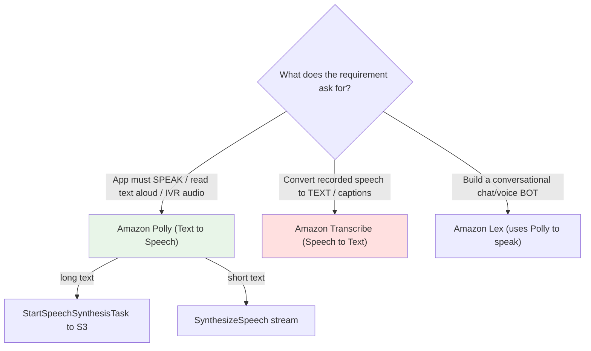

# Amazon Polly - Exam Scenarios & Troubleshooting

> Exam-style MCQs and an SRE troubleshooting reference for **Amazon Polly (Text-to-Speech)** - focused on the "give the app a voice / read articles aloud / IVR prompts" signals and the classic **Polly vs Transcribe direction** trap.

See also: [00 - Machine Learning Overview](00%20-%20Machine%20Learning%20Overview.md) · [01 - Amazon Polly Deep Dive](01%20-%20Amazon%20Polly%20Deep%20Dive.md) · [01 - Amazon Transcribe Deep Dive](01%20-%20Amazon%20Transcribe%20Deep%20Dive.md) · [01 - Amazon Lex Deep Dive](01%20-%20Amazon%20Lex%20Deep%20Dive.md) · [01 - Amazon Translate Deep Dive](01%20-%20Amazon%20Translate%20Deep%20Dive.md)

---

## Table of Contents

- [How to Use This Page](#how-to-use-this-page)
- [Scenario MCQs](#scenario-mcqs)
- [Common Errors & Troubleshooting (SRE Perspective)](#common-errors--troubleshooting-sre-perspective)
- [Decision: Polly vs Transcribe vs Lex](#decision-polly-vs-transcribe-vs-lex)
- [Rapid-Fire Exam Triggers](#rapid-fire-exam-triggers)

---

---

## How to Use This Page

Read each scenario, pick an answer before revealing it, then read the **Exam Tip**. The recurring trap is **direction**: Polly = text→speech, Transcribe = speech→text. Whenever you see "speak", "read aloud", "voice prompt", "natural-sounding speech" → think **Polly**.

[⬆ Back to top](#table-of-contents)

---

## Scenario MCQs

### Q1. Give the application a voice

A news app wants to **read articles aloud** to users in a natural-sounding voice. Which AWS service should the developer use?

- A. Amazon Transcribe
- B. Amazon Polly
- C. Amazon Comprehend
- D. Amazon Rekognition

**Answer: B - Amazon Polly.**
**Explanation:** Converting article **text into spoken audio** is Text-to-Speech, which is Polly's core function. Use a Neural or Long-form voice for natural narration.
**Exam Tip:** "Read aloud" / "give the app a voice" = Polly. Transcribe (A) does the reverse.

---

### Q2. The direction trap

A call centre records customer calls and needs to **convert the audio recordings into searchable text** for analytics. Which service?

- A. Amazon Polly
- B. Amazon Transcribe
- C. Amazon Translate
- D. Amazon Connect

**Answer: B - Amazon Transcribe.**
**Explanation:** Audio → text is **Speech-to-Text** = Transcribe. Polly (A) goes the opposite direction (text → audio).
**Exam Tip:** Memorise the direction: **P**olly **P**roduces sound; **T**ranscribe **T**ypes text. This swap is the most common distractor.

---

### Q3. Long article exceeds the sync limit

A Lambda function calls `SynthesizeSpeech` on a 40,000-character article and receives a **`TextLengthExceededException`**. What is the correct fix?

- A. Split into 14 separate `SynthesizeSpeech` calls and stitch the MP3s manually
- B. Use `StartSpeechSynthesisTask` (asynchronous) and write output to S3
- C. Switch from Neural to Standard engine to allow more characters
- D. Increase the Lambda timeout

**Answer: B - Use the asynchronous task API.**
**Explanation:** `SynthesizeSpeech` (sync) is capped (~3000 billed characters). For long text use **`StartSpeechSynthesisTask`** (~100,000 billed chars) which writes audio to **S3**. Engine choice (C) does not change the limit.
**Exam Tip:** Sync = short + audio stream; Async = long + output to S3.

---

### Q4. Highlight words as they are read

An e-learning platform wants the on-screen text to **highlight word-by-word in sync** with Polly's narration. What should be requested from Polly?

- A. PCM output
- B. A pronunciation lexicon
- C. Speech marks (JSON, word/sentence types)
- D. SSML `<prosody>` tags

**Answer: C - Speech marks.**
**Explanation:** Request `OutputFormat=json` with `SpeechMarkTypes` of `word`/`sentence` to get timing metadata used for highlighting (and `viseme` for lip-sync).
**Exam Tip:** "Highlight as read" or "lip-sync avatar" = Speech Marks.

---

### Q5. Brand/technical word mispronounced everywhere

Polly mispronounces the company name and several technical terms across **thousands** of synthesis requests. The team wants a **reusable** fix applied automatically. What should they use?

- A. Add SSML `<phoneme>` tags to every request
- B. Upload a pronunciation **lexicon** and reference it via `LexiconNames`
- C. Switch to the Generative engine
- D. Use Amazon Translate to correct the words

**Answer: B - Pronunciation lexicon.**
**Explanation:** A lexicon (PLS file) defines reusable pronunciations applied automatically to all requests that reference it - no need to edit each request. SSML `<phoneme>` (A) is inline/one-off.
**Exam Tip:** Global/reusable pronunciation = Lexicon; one-off inline = SSML `<phoneme>`.

---

### Q6. IVR prompts for a contact centre

A contact centre needs to generate **dynamic IVR voice prompts** (e.g. read back an order number) within its contact flows. Which combination is intended?

- A. Amazon Connect with Amazon Polly
- B. Amazon Transcribe with S3
- C. Amazon Rekognition with Lambda
- D. Amazon Lex with Amazon Translate

**Answer: A - Amazon Connect + Amazon Polly.**
**Explanation:** Connect uses Polly to synthesize dynamic prompt audio (including SSML and `say-as` for digits).
**Exam Tip:** "IVR prompts / contact-flow audio" → Connect calls Polly.

---

### Q7. Cost runaway

A mobile app calls Polly **every time** a user opens the same article, re-synthesizing identical text, and the Polly bill is climbing fast. What is the most cost-effective fix?

- A. Switch all voices to Standard engine
- B. Synthesize each article once, store the MP3 in S3, and serve via CloudFront
- C. Move synthesis to a larger EC2 instance
- D. Use the async API instead of sync

**Answer: B - Cache the audio in S3 and serve via CloudFront.**
**Explanation:** Polly bills **per character per call**. Re-synthesizing the same text repeatedly is wasteful. Synthesize once, **cache** the result, and reuse it. Engine choice (A) helps marginally but does not stop redundant synthesis.
**Exam Tip:** "Re-synthesizing same text / cost climbing" → cache in S3 + CloudFront.

---

### Q8. Multilingual audio from English source

A publisher has English text and must deliver **audio in French and Spanish**. Which pipeline is correct?

- A. Polly directly with a French voice on the English text
- B. Amazon Translate to translate the text, then Polly with target-language voices
- C. Amazon Transcribe then Polly
- D. Amazon Comprehend then Polly

**Answer: B - Translate then Polly.**
**Explanation:** Polly synthesizes text in the language it is given; it does **not** translate. Translate the text first, then synthesize with a French/Spanish voice.
**Exam Tip:** "Multilingual speech from one-language text" = Translate → Polly.

---

### Q9. Most lifelike, conversational voice

A premium virtual assistant requires the **most human-like, emotionally engaging** voice. Which Polly engine?

- A. Standard
- B. Neural
- C. Generative
- D. Long-form

**Answer: C - Generative.**
**Explanation:** The Generative engine produces the most human-like, conversational speech. Long-form (D) targets long content; Neural (B) is natural but Generative is the top tier.
**Exam Tip:** "Most lifelike / conversational / emotionally engaging" = Generative.

---

### Q10. Telephony audio format

A telephony integration needs **raw audio at 8 kHz** to feed into a downstream phone system. Which Polly output format/setting fits?

- A. MP3 at 24 kHz
- B. JSON speech marks
- C. PCM with an 8000 Hz sample rate
- D. OGG Vorbis

**Answer: C - PCM at 8 kHz.**
**Explanation:** PCM is raw uncompressed audio suitable for telephony pipelines; set the sample rate to 8000 Hz. JSON (B) is metadata, not audio.
**Exam Tip:** Telephony/raw processing = PCM; web/mobile = MP3.

---

### Q11. Voicing a Lex chatbot

A team builds a **voice chatbot** that understands user speech and replies out loud. Which services handle understanding intent and speaking the reply?

- A. Lex for intent + Polly for the spoken reply
- B. Polly for intent + Transcribe for the reply
- C. Comprehend for intent + Polly for reply
- D. Connect for intent + Lex for reply

**Answer: A - Lex (intent/NLU) + Polly (speech output).**
**Explanation:** Amazon Lex handles ASR + NLU (intents/slots) and uses **Polly** to synthesize the spoken responses.
**Exam Tip:** Conversational bot = Lex; the _voice_ of that bot = Polly.

---

### Q12. Unsupported voice/engine combo

A request sets `Engine=generative` with a `VoiceId` that has no generative variant and fails. What is the fix?

- A. Retry with exponential backoff
- B. Choose a VoiceId that supports the generative engine (or change the engine)
- C. Increase the character limit
- D. Add a lexicon

**Answer: B - Use a compatible voice/engine pairing.**
**Explanation:** Not every voice supports every engine; an unsupported combination errors out. Pick a voice that supports the requested engine, or switch engines.
**Exam Tip:** Validate voice/engine compatibility before calling - backoff (A) only helps throttling.

[⬆ Back to top](#table-of-contents)

---

## Common Errors & Troubleshooting (SRE Perspective)

| Symptom / Error                                     | Likely Cause                                                                          | Resolution                                                                                    |
| :-------------------------------------------------- | :------------------------------------------------------------------------------------ | :-------------------------------------------------------------------------------------------- |
| `TextLengthExceededException` on `SynthesizeSpeech` | Text over the sync limit (~3000 billed / 6000 total chars)                            | Switch to **`StartSpeechSynthesisTask`** (async → S3), or chunk the text                      |
| `ThrottlingException` / rate errors under load      | Exceeding request rate quotas                                                         | Implement **exponential backoff + jitter**; request a quota increase; batch via async         |
| `InvalidLexiconException` / lexicon not applied     | Malformed PLS file, wrong lexicon name, or lexicon in a different region              | Validate PLS XML; ensure the lexicon exists **in the same region**; correct `LexiconNames`    |
| `InvalidSsmlException` / SSML parse error           | Malformed SSML or `TextType` not set to `ssml`                                        | Fix/escape the SSML; set `TextType=ssml`; validate tags (`<speak>` root)                      |
| Unsupported voice/engine combination error          | `VoiceId` has no variant for the chosen `Engine`                                      | Choose a compatible voice or change the engine                                                |
| Async task stuck / output missing in S3             | Task still `inProgress`, or Polly lacks S3 write permission / wrong bucket-policy/KMS | Poll `GetSpeechSynthesisTask`; grant `s3:PutObject` + KMS permissions; verify bucket/region   |
| Cost runaway                                        | Re-synthesizing identical text on every request                                       | **Cache** synthesized audio in S3, serve via **CloudFront**; reuse instead of re-synthesizing |
| Robotic / unnatural audio complaints                | Using Standard engine where naturalness matters                                       | Switch to **Neural / Long-form / Generative** (note higher per-char cost)                     |
| `LexiconSizeExceededException` / too many lexicons  | Lexicon too large or too many applied per request                                     | Reduce lexicon size; consolidate; apply fewer `LexiconNames` per call                         |
| Wrong service chosen (audio→text need)              | Confused direction                                                                    | Use **Transcribe** for speech→text; Polly is text→speech only                                 |

[⬆ Back to top](#table-of-contents)

---

## Decision: Polly vs Transcribe vs Lex

| Dimension          | [Amazon Polly](01%20-%20Amazon%20Polly%20Deep%20Dive.md)                | [Amazon Transcribe](01%20-%20Amazon%20Transcribe%20Deep%20Dive.md)      | [Amazon Lex](01%20-%20Amazon%20Lex%20Deep%20Dive.md)    |
| :----------------- | :----------------------------------------------------------- | :----------------------------------------------------------- | :------------------------------------------- |
| **Direction**      | Text → Speech                                                | Speech → Text                                                | Conversational interface (ASR + NLU)         |
| **Core job**       | Synthesize lifelike audio                                    | Transcribe/caption audio                                     | Understand intent, manage dialog             |
| **Output**         | MP3 / OGG / PCM / speech marks                               | Text transcript (+ timestamps)                               | Intent + slots + response                    |
| **Signal phrases** | "read aloud", "give a voice", "IVR prompt", "natural speech" | "captions", "searchable text from audio", "transcribe calls" | "chatbot", "virtual agent", "voice/text bot" |
| **Speaks?**        | Yes (it IS the voice)                                        | No                                                           | Yes - **uses Polly** for spoken replies      |
| **Typical combo**  | Translate→Polly; Connect+Polly                               | Transcribe→Comprehend for analytics                          | Lex(+Polly) for voice bots                   |

[⬆ Back to top](#table-of-contents)

---

## Rapid-Fire Exam Triggers

- "Read articles aloud" / "give the app a voice" → **Polly**.
- "Convert recordings to text" / "captions" / "searchable transcript" → **Transcribe** (NOT Polly).
- "Dynamic IVR prompts" → **Connect + Polly**.
- "Voice chatbot replies out loud" → **Lex + Polly**.
- "Long article fails sync synthesis / `TextLengthExceededException`" → **`StartSpeechSynthesisTask` → S3**.
- "Highlight words / lip-sync" → **Speech Marks (JSON)**.
- "Fix pronunciation everywhere" → **Lexicon**; "fix pronunciation inline once" → **SSML `<phoneme>`**.
- "Audio in multiple languages from one source" → **Translate → Polly**.
- "Most lifelike voice" → **Generative**; "long content" → **Long-form**.
- "Cost climbing from repeated synthesis" → **cache in S3 + CloudFront**.

[⬆ Back to top](#table-of-contents)
