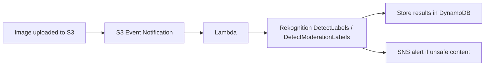

```mermaid
graph TD
    subgraph Stored["Stored Video (Asynchronous)"]
        S3in["Video in S3"] --> StartJob["StartLabelDetection / StartFaceDetection / StartContentModeration"]
        StartJob --> Rek1["Rekognition async job"]
        Rek1 --> SNS["SNS topic: job complete"]
        SNS --> Lambda1["Lambda"]
        Lambda1 --> GetResults["GetLabelDetection (results)"]
    end
    subgraph Streaming["Streaming Video (Real-time)"]
        Cam["Camera / producer"] --> KVS["Kinesis Video Streams"]
        KVS --> Rek2["Rekognition Video stream processor"]
        Rek2 --> KDS["Kinesis Data Streams"]
        KDS --> Lambda2["Lambda / consumer"]
        Lambda2 --> Store["DynamoDB / SNS alert"]
    end
```

# Amazon Rekognition - SAA-C03 Deep Dive

> Amazon Rekognition is a fully managed **deep-learning image and video analysis** service - detect objects/labels, faces, celebrities, text-in-scene, unsafe content and PPE through simple API calls, with **synchronous image APIs**, **asynchronous stored-video jobs (→ SNS)** and **real-time streaming video via Kinesis Video Streams**.

See also: [00 - Machine Learning Overview](00%20-%20Machine%20Learning%20Overview.md) · [01 - Amazon Textract Deep Dive](01%20-%20Amazon%20Textract%20Deep%20Dive.md) · [01 - Amazon SageMaker AI Deep Dive](01%20-%20Amazon%20SageMaker%20AI%20Deep%20Dive.md) · [01 - Amazon Comprehend Deep Dive](01%20-%20Amazon%20Comprehend%20Deep%20Dive.md)

---

## Table of Contents

- [Part 1: What Amazon Rekognition Is](#part-1-what-amazon-rekognition-is)
- [Part 2: Core Image Capabilities](#part-2-core-image-capabilities)
- [Part 3: Face Search with Collections](#part-3-face-search-with-collections)
- [Part 4: Text in Image vs Textract (Critical Distinction)](#part-4-text-in-image-vs-textract-critical-distinction)
- [Part 5: Rekognition Custom Labels](#part-5-rekognition-custom-labels)
- [Part 6: Video Analysis - Stored vs Streaming](#part-6-video-analysis---stored-vs-streaming)
- [Part 7: Architecture & Integrations](#part-7-architecture--integrations)
- [Part 8: API & CLI Examples](#part-8-api--cli-examples)
- [Part 9: Best Practices](#part-9-best-practices)
- [Part 10: Pricing](#part-10-pricing)
- [Part 11: Key Exam Facts](#part-11-key-exam-facts)
- [Summary: Key Takeaways for SAA-C03](#summary-key-takeaways-for-saa-c03)

---



---

## Part 1: What Amazon Rekognition Is

Amazon Rekognition is a **pre-trained, managed computer-vision service**. You send it an image or video and it returns **structured JSON** about what it found - no ML expertise, no model training, no infrastructure to manage. It is built on the same deep-learning technology Amazon uses for its own products and continuously improves without any action on your part.

Key framing for the exam:

- It is a **black-box API**. You pick it when the scenario involves **analysing images or video** - objects, people, faces, scenes, inappropriate content - and you do **not** need a custom model.
- Two operating modes by media type:
  - **Images** → **synchronous** APIs (`DetectLabels`, `DetectFaces`, `CompareFaces`, `DetectText`, `DetectModerationLabels`, `RecognizeCelebrities`, `DetectProtectiveEquipment`). Response returns inline.
  - **Video** → **asynchronous** for **stored video** in S3 (`StartXxxDetection` → poll or get notified via **SNS** → `GetXxxDetection`), or **real-time** for **streaming video** via **Kinesis Video Streams**.
- Input can be supplied as **raw image bytes** (in the request) or as an **S3 object reference** (`S3Object`). Video analysis **always** uses S3 (stored) or Kinesis Video Streams (streaming).

> **Mindset:** "Is this about _understanding the content of a picture or video_?" → Rekognition. "Is this about _reading text out of a document/form/invoice_?" → [Textract](01%20-%20Amazon%20Textract%20Deep%20Dive.md). "Do I need to recognise _my own_ custom objects/brand?" → Rekognition **Custom Labels**.

[⬆ Back to top](#table-of-contents)

---

## Part 2: Core Image Capabilities

| Capability                           | API                                  | What it returns                                                                                                           |
| :----------------------------------- | :----------------------------------- | :------------------------------------------------------------------------------------------------------------------------ |
| **Label / object & scene detection** | `DetectLabels`                       | Objects, scenes, activities (e.g. "Car", "Beach", "Wedding") each with a **confidence** score; bounding boxes for objects |
| **Face detection & analysis**        | `DetectFaces`                        | Bounding box per face + attributes: age range, emotions, gender, eyes open, smile, glasses, pose, quality                 |
| **Face comparison**                  | `CompareFaces`                       | Similarity score between a face in a _source_ image and faces in a _target_ image (1:1 / 1:few matching)                  |
| **Face search (1:N)**                | `SearchFacesByImage` / `SearchFaces` | Matching faces from a **Collection** (see Part 3)                                                                         |
| **Celebrity recognition**            | `RecognizeCelebrities`               | Known public figures + confidence + URLs                                                                                  |
| **Text in image**                    | `DetectText`                         | Words/lines detected in a **scene/photo** (street signs, T-shirts, license plates)                                        |
| **Content moderation**               | `DetectModerationLabels`             | Hierarchical **unsafe-content** labels (explicit/suggestive nudity, violence, drugs, etc.) with confidence                |
| **PPE detection**                    | `DetectProtectiveEquipment`          | Whether persons are wearing **face cover, hand cover, head cover** (workplace safety)                                     |

Important behaviours:

- Every detection comes with a **confidence score (0-100)**. You set a **`MinConfidence`** threshold (default ~50-55% on many APIs) to filter noisy, low-confidence results. Tuning this is a common operational/exam point.
- **`DetectLabels`** also returns **parent labels** (label hierarchy) - e.g. "Dog" has parents "Pet", "Animal".
- **Content moderation** returns a **two-level taxonomy** (top-level category + subcategory) so you can build tiered moderation rules.

[⬆ Back to top](#table-of-contents)

---

## Part 3: Face Search with Collections

For **"is this person someone we've seen before?"** at scale (1:N), Rekognition uses a **Collection** - a server-side container of **face vectors** (mathematical feature vectors), **not** the actual images.

The workflow:

1. **`CreateCollection`** - create a named container (you reference it later by **CollectionId**).
2. **`IndexFaces`** - analyse a source image, extract face **feature vectors**, and store them in the collection (each gets a `FaceId`). You can associate an `ExternalImageId` (e.g. an employee ID) to map a face back to your own identity.
3. **`SearchFacesByImage`** - submit a new probe image; Rekognition returns the **closest matching indexed faces** above a **`FaceMatchThreshold`**.
4. **`SearchFaces`** - search by an existing `FaceId` rather than a new image.
5. **`ListFaces` / `DeleteFaces` / `DeleteCollection`** - manage the collection lifecycle.

Key exam points:

- A collection stores **face metadata / vectors only** - the original images are **not** stored by Rekognition. You keep originals in S3 if you need them.
- Use **Collections + IndexFaces + SearchFacesByImage** for **face-based identity / authentication / "find this person across our photo library"**. Use **`CompareFaces`** only for a one-off **1:1 image-to-image** comparison (no persistent store).
- This is the basis of **face-based access control** scenarios (e.g. unlock a door / verify a user against an enrolled face database).

[⬆ Back to top](#table-of-contents)

---

## Part 4: Text in Image vs Textract (Critical Distinction)

This is one of the **most tested traps** in the ML domain.

| Scenario                                                                                                               | Service                              | Why                                       |
| :--------------------------------------------------------------------------------------------------------------------- | :----------------------------------- | :---------------------------------------- | ---------------------------------------------------------- |
| A **word on a street sign**, a slogan on a T-shirt, text on a **license plate**, text overlaid in a social-media photo | **Rekognition** `DetectText`         | Short text **in a natural scene / photo** |
| A **scanned invoice, form, ID card, receipt, multi-page PDF**; need **key-value pairs, tables, dense document text**   | \*\*[Textract](01%20-%20Amazon%20Textract%20Deep%20Dive.md)\*\*                            | Structured **document OCR** with layout, forms, and tables |

Rule of thumb: **"text _in a photo/scene_" → Rekognition `DetectText`. "text _in a document/form_" → Textract.** Textract preserves document structure (relationships, key-value pairs, tables); Rekognition just finds words/lines floating in an image and does **not** understand form structure.

[⬆ Back to top](#table-of-contents)

---

## Part 5: Rekognition Custom Labels

The built-in `DetectLabels` knows generic objects, but **not your brand's logo, a specific machine part, or a particular crop disease**. **Rekognition Custom Labels** lets you train a custom classifier/detector on **your own labelled images** - typically only **tens to hundreds** of sample images, far fewer than building a model from scratch.

| Aspect            | Detail                                                                                                                                                     |
| :---------------- | :--------------------------------------------------------------------------------------------------------------------------------------------------------- |
| **Use case**      | Detect company-specific objects, logos, products, defects, etc.                                                                                            |
| **Training data** | Your labelled images (use the Rekognition console or **SageMaker Ground Truth** for labelling)                                                             |
| **Output**        | A managed **custom model** you deploy and call via `DetectCustomLabels`                                                                                    |
| **Cost model**    | Charged per **training hour** and per **inference hour** while the model is **running** - you `StartProjectVersion` / `StopProjectVersion` to control cost |

Decision boundary:

- Need **generic** objects/faces/moderation → **standard Rekognition APIs**.
- Need **a few custom object types** with minimal ML effort → **Rekognition Custom Labels**.
- Need a **fully bespoke** model, custom architecture, or non-vision ML → **[SageMaker AI](01%20-%20Amazon%20SageMaker%20AI%20Deep%20Dive.md)**.

> **Cost trap:** A Custom Labels model bills for inference **as long as it is running** (not strictly per-image like the base APIs). Stop the model version when idle.

[⬆ Back to top](#table-of-contents)

---

## Part 6: Video Analysis - Stored vs Streaming

Video is **never** synchronous. There are two distinct paths:

### Stored video (asynchronous, S3-based)

For pre-recorded files already in **Amazon S3**:

- Start a job with one of: `StartLabelDetection`, `StartFaceDetection`, `StartFaceSearch`, `StartContentModeration`, `StartCelebrityRecognition`, `StartPersonTracking`, `StartTextDetection`, `StartSegmentDetection`.
- The job runs **asynchronously**. On completion Rekognition publishes a notification to an **Amazon SNS topic** (you supply the topic and an IAM role via `NotificationChannel`).
- A consumer (typically **Lambda subscribed to SNS**) then calls the matching **`GetXxxDetection`** to retrieve results (results include **timestamps** of when each label/face appeared).

### Streaming video (real-time)

For **live** feeds (security cameras, live broadcasts):

- Producer sends frames to **Kinesis Video Streams (KVS)**.
- A Rekognition Video **stream processor** consumes the KVS stream and performs **label detection** or **face search against a collection**.
- Results are emitted to a **Kinesis Data Streams (KDS)** stream.
- A consumer (Lambda / app reading KDS) reacts in near-real-time (alert, log to DynamoDB, etc.).

> **Memory hook:** **Stored video = S3 + StartXxx + SNS (async).** **Live/real-time video = Kinesis Video Streams → Rekognition → Kinesis Data Streams.** If a question says "real-time analysis of a **live security camera** feed," the answer involves **Kinesis Video Streams**, not S3.

[⬆ Back to top](#table-of-contents)

---

## Part 7: Architecture & Integrations

### Pattern A: Event-driven image processing (the classic)



This **S3 → event → Lambda → Rekognition → DynamoDB/SNS** flow is the single most common Rekognition architecture on the exam (e.g. moderate user-generated images on upload).

### Pattern B: Synchronous API behind API Gateway

For a single small image needing an immediate answer: **API Gateway → Lambda → Rekognition (sync) → response inline**.

### Pattern C: Stored-video pipeline

**S3 video → `StartLabelDetection` → SNS on completion → Lambda → `GetLabelDetection` → store**.

### Pattern D: Real-time streaming

**Kinesis Video Streams → Rekognition stream processor → Kinesis Data Streams → Lambda → alert/store**.

Common integration partners: **S3** (input + originals), **Lambda** (orchestration), **DynamoDB** (results), **SNS** (async job completion + alerts), **Kinesis Video/Data Streams** (real-time), **Step Functions** (multi-step pipelines), **EventBridge**, **CloudWatch/CloudTrail** (observability).

[⬆ Back to top](#table-of-contents)

---

## Part 8: API & CLI Examples

Detect labels in an image stored in S3:

```bash
aws rekognition detect-labels \
  --image '{"S3Object":{"Bucket":"my-bucket","Name":"photos/beach.jpg"}}' \
  --max-labels 10 \
  --min-confidence 70
```

Detect unsafe / inappropriate content (moderation):

```bash
aws rekognition detect-moderation-labels \
  --image '{"S3Object":{"Bucket":"ugc-bucket","Name":"uploads/img123.jpg"}}' \
  --min-confidence 60
```

Face-search collection workflow:

```bash
# 1. Create a collection
aws rekognition create-collection --collection-id employees

# 2. Index a face (store its vector, tag with an external id)
aws rekognition index-faces \
  --collection-id employees \
  --image '{"S3Object":{"Bucket":"hr-bucket","Name":"badge/alice.jpg"}}' \
  --external-image-id alice-123 \
  --detection-attributes ALL

# 3. Search the collection with a probe image
aws rekognition search-faces-by-image \
  --collection-id employees \
  --image '{"S3Object":{"Bucket":"door-cam","Name":"frame.jpg"}}' \
  --face-match-threshold 90
```

Start an asynchronous stored-video label-detection job (note the SNS notification channel):

```bash
aws rekognition start-label-detection \
  --video '{"S3Object":{"Bucket":"media","Name":"clip.mp4"}}' \
  --notification-channel '{"SNSTopicArn":"arn:aws:sns:...:rek-jobs","RoleArn":"arn:aws:iam::...:role/RekognitionSNSRole"}'
# later, with the returned JobId:
aws rekognition get-label-detection --job-id <JobId>
```

[⬆ Back to top](#table-of-contents)

---

## Part 9: Best Practices

- **Prefer S3 input over raw bytes** for anything but tiny images - it avoids request-size limits and keeps a copy in S3.
- **Tune `MinConfidence` / `FaceMatchThreshold`** to your tolerance for false positives vs false negatives (e.g. higher threshold for access control, lower for broad discovery).
- **Use Collections (vectors)**, not stored images, for repeated face search - cheaper and privacy-friendlier.
- **Async + SNS for video** - never expect a synchronous video response; subscribe Lambda to the SNS topic.
- **Least-privilege IAM** - grant only the needed actions (e.g. `rekognition:DetectLabels`) and ensure the Rekognition role can read the **S3 bucket** and **publish to the SNS topic** for async jobs.
- **Encrypt** S3 inputs/originals with SSE-S3/SSE-KMS; use **VPC interface endpoints (PrivateLink)** to call Rekognition privately.
- **Control Custom Labels cost** - `StopProjectVersion` when the model is idle (it bills per running inference hour).
- **Handle throttling** with exponential backoff + jitter; request quota increases for high-throughput workloads.
- **Idempotency / dedupe** by S3 object key to avoid re-processing on retries.

[⬆ Back to top](#table-of-contents)

---

## Part 10: Pricing

Rekognition is **pay-per-use**, no upfront cost:

| Dimension           | Billed by                                                                                   |
| :------------------ | :------------------------------------------------------------------------------------------ |
| **Image analysis**  | Per **image** processed, per API group (labels, faces, moderation, text, celebrities, etc.) |
| **Face storage**    | Per **1,000 face vectors per month** stored in a Collection                                 |
| **Stored video**    | Per **minute** of video analysed                                                            |
| **Streaming video** | Per **minute** processed (plus Kinesis Video/Data Streams charges)                          |
| **Custom Labels**   | Per **training hour** + per **inference hour** while the model version is **running**       |

Cost notes for the exam:

- High-volume **synchronous image** calls can add up; **batch via async/event-driven** patterns where possible.
- **Video minutes** and **always-on Custom Labels models** are the typical **cost-runaway** culprits - stop idle Custom Labels models and watch continuous streaming pipelines.
- A **Free Tier** covers a limited number of images/minutes for the first 12 months.

[⬆ Back to top](#table-of-contents)

---

## Part 11: Key Exam Facts

- **Images = synchronous**; **video = asynchronous (stored, S3 + SNS) or real-time (Kinesis Video Streams → Rekognition → Kinesis Data Streams)**.
- **Stored-video async jobs publish completion to SNS**; the IAM role must allow reading S3 and publishing to the SNS topic.
- **Input** can be **S3 object** or **raw bytes** for images; video is **S3 (stored)** or **KVS (streaming)** only.
- **Image size / resolution limits**: raw image **bytes ≤ 5 MB** in a request; **S3 object ≤ 15 MB**; minimum/maximum pixel dimensions apply (very small images fail). Oversized inputs throw **`ImageTooLargeException`**.
- **Collections store face vectors, not images** - use `IndexFaces` + `SearchFacesByImage` for 1:N face search; `CompareFaces` for one-off 1:1.
- **Text in a _photo/scene_ → Rekognition `DetectText`; text in a _document/form_ → Textract.**
- **Content moderation** = `DetectModerationLabels` for UGC; **PPE** = `DetectProtectiveEquipment` for workplace safety.
- **Custom Labels** = train on your own objects with few images; bills while running.
- **Real-time security camera analysis** → **Kinesis Video Streams** is the keyword.

[⬆ Back to top](#table-of-contents)

---

## Summary: Key Takeaways for SAA-C03

| Concept                     | What You Must Know                                                                                            |
| :-------------------------- | :------------------------------------------------------------------------------------------------------------ |
| **Purpose**                 | Managed deep-learning **image & video analysis** (labels, faces, moderation, text-in-scene, PPE, celebrities) |
| **Sync vs async**           | Images = sync; stored video = async + **SNS**; live video = **Kinesis Video Streams → KDS**                   |
| **Face search**             | **Collections** store **vectors**; `IndexFaces` + `SearchFacesByImage` (1:N); `CompareFaces` (1:1)            |
| **Rekognition vs Textract** | Text in **photos/scenes** → Rekognition; text in **documents/forms** → Textract                               |
| **Custom needs**            | A few custom objects → **Custom Labels**; fully bespoke → **SageMaker AI**                                    |
| **Architecture**            | **S3 → event → Lambda → Rekognition → DynamoDB/SNS** is the canonical pattern                                 |
| **Limits**                  | Bytes ≤ 5 MB, S3 object ≤ 15 MB; `ImageTooLargeException` on oversize                                         |
| **Cost**                    | Pay per image / per video minute / per face-vector-month; watch always-on Custom Labels + video               |

[⬆ Back to top](#table-of-contents)
