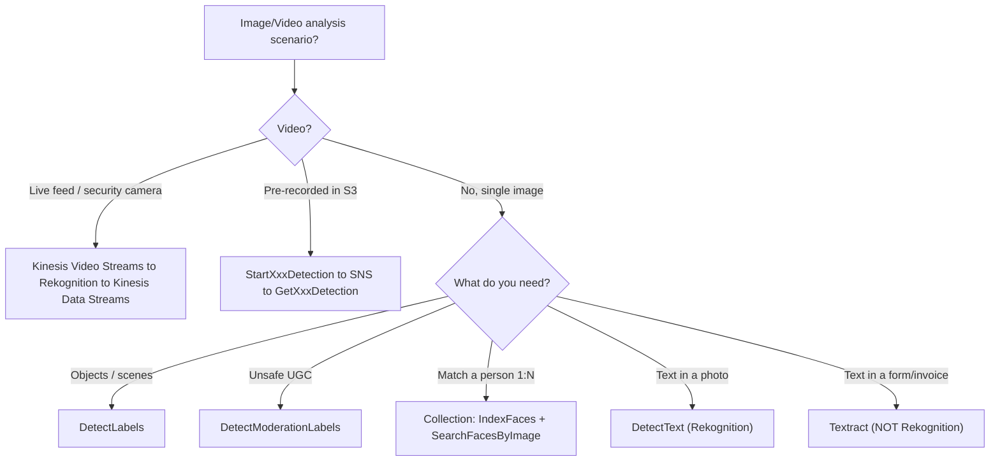

# Amazon Rekognition - Exam Scenarios & Troubleshooting

> Exam-style MCQs and an SRE troubleshooting reference for Amazon Rekognition - service selection (Rekognition vs Textract vs SageMaker), UGC content moderation, face-based access, real-time camera analysis via Kinesis Video Streams, plus the common API errors, limits and cost traps.

See also: [00 - Machine Learning Overview](00%20-%20Machine%20Learning%20Overview.md) · [01 - Amazon Rekognition Deep Dive](01%20-%20Amazon%20Rekognition%20Deep%20Dive.md) · [01 - Amazon Textract Deep Dive](01%20-%20Amazon%20Textract%20Deep%20Dive.md) · [01 - Amazon SageMaker AI Deep Dive](01%20-%20Amazon%20SageMaker%20AI%20Deep%20Dive.md) · [01 - Amazon Comprehend Deep Dive](01%20-%20Amazon%20Comprehend%20Deep%20Dive.md)

---

## Table of Contents

- [Part 1: Exam-Style MCQs](#part-1-exam-style-mcqs)
- [Part 2: Common Errors & Troubleshooting (SRE Perspective)](#part-2-common-errors--troubleshooting-sre-perspective)
- [Part 3: Decision - Rekognition vs Textract vs SageMaker Custom](#part-3-decision---rekognition-vs-textract-vs-sagemaker-custom)
- [Summary: Key Takeaways for SAA-C03](#summary-key-takeaways-for-saa-c03)

---

---

## Part 1: Exam-Style MCQs

### Q1 - Moderating user-generated images on upload

A social app lets users upload profile photos to **S3**. The company must automatically flag nudity and violence **as each image is uploaded** and store the result.

- A. Run a scheduled batch job that calls Amazon Comprehend on all images nightly
- B. Use an S3 event to trigger Lambda, which calls Rekognition `DetectModerationLabels`, and store results in DynamoDB
- C. Train a SageMaker model on labelled images and host it on a real-time endpoint
- D. Use Textract `DetectDocumentText` to read the images

**Answer: B**

**Explanation:** Content moderation of images is exactly `DetectModerationLabels`. The event-driven **S3 → Lambda → Rekognition → DynamoDB** pattern handles each upload in near-real-time. Comprehend is for text, Textract is document OCR, and SageMaker is overkill for a built-in capability.

**Exam Tip:** "Flag inappropriate/unsafe user-generated images" → Rekognition **`DetectModerationLabels`**, wired via **S3 event → Lambda**.

---

### Q2 - Text in a photo vs text in a form (the classic trap)

A company processes two workloads: (1) reading the **slogan printed on a T-shirt** in marketing photos, and (2) extracting **key-value fields from scanned tax forms**. Which services fit?

- A. Rekognition for both
- B. Textract for both
- C. Rekognition `DetectText` for the T-shirt photos; Textract for the tax forms
- D. Comprehend for both

**Answer: C**

**Explanation:** Text **in a natural scene/photo** (a T-shirt slogan) → Rekognition `DetectText`. Structured **document/form** extraction with key-value pairs and tables → Textract. They are not interchangeable.

**Exam Tip:** Text **in a photo/scene** = Rekognition; text **in a document/form/invoice** = Textract.

---

### Q3 - Face-based door access

An office wants to **unlock a door** when a camera image matches an **enrolled employee** out of ~2,000 staff. Which approach?

- A. `CompareFaces` between the camera image and every employee photo, one at a time
- B. Create a Rekognition **Collection**, `IndexFaces` for all employees, then `SearchFacesByImage` on the camera frame
- C. `DetectFaces` and check the age range
- D. `RecognizeCelebrities`

**Answer: B**

**Explanation:** Matching one probe against **many** enrolled identities (1:N) is a **Collection** + `SearchFacesByImage`. `CompareFaces` is 1:1 and would require 2,000 calls. `DetectFaces` only describes attributes; celebrity recognition is unrelated.

**Exam Tip:** **1:N face search → Collection** (`IndexFaces` + `SearchFacesByImage`). **1:1 one-off → `CompareFaces`**. Collections store **face vectors, not images**.

---

### Q4 - Real-time security camera analysis

A retailer needs to analyse **live security-camera video** to detect persons of interest **in real time** and trigger alerts. Which architecture?

- A. Upload clips to S3 and call `StartFaceSearch`, notified via SNS
- B. Stream the cameras into **Kinesis Video Streams**, process with a Rekognition **stream processor**, and emit results to **Kinesis Data Streams** for a Lambda consumer
- C. Call `DetectFaces` synchronously every second from the camera
- D. Use SageMaker batch transform on recorded footage

**Answer: B**

**Explanation:** **Real-time / live** video is the **Kinesis Video Streams → Rekognition → Kinesis Data Streams** pattern. S3 + `StartFaceSearch` is for **stored** (recorded) video and is **not** real-time.

**Exam Tip:** "Live / real-time security camera" → **Kinesis Video Streams**. "Pre-recorded file in S3" → async `StartXxx` + SNS.

---

### Q5 - Analysing a long recorded video

A media company has **2-hour MP4 files in S3** and wants to detect all labels with timestamps. Which is correct?

- A. `DetectLabels` synchronously on the whole file
- B. `StartLabelDetection` (async), receive completion via SNS, then `GetLabelDetection`
- C. Split the video into images and call `DetectLabels` on each
- D. Use Kinesis Video Streams

**Answer: B**

**Explanation:** Video analysis is **asynchronous**. `StartLabelDetection` launches the job, Rekognition posts to **SNS** on completion, and `GetLabelDetection` returns labels with **timestamps**. There is no synchronous video API. KVS is for live streams, not stored files.

**Exam Tip:** Stored video = **`StartXxxDetection` → SNS → `GetXxxDetection`**. Async is mandatory for video.

---

### Q6 - Detecting a company-specific product

A manufacturer wants to detect **its own proprietary machine part** in photos. Generic `DetectLabels` does not recognise it, and they have only **~200 labelled images**.

- A. Use `DetectLabels` with a lower `MinConfidence`
- B. Use **Rekognition Custom Labels** to train a model on the 200 labelled images
- C. Build and train a CNN from scratch in SageMaker
- D. Use `DetectCustomLabels` without training

**Answer: B**

**Explanation:** **Rekognition Custom Labels** is purpose-built for detecting your **own** objects with a **small** labelled dataset and minimal ML effort. Lowering confidence won't make it recognise an unknown object. SageMaker-from-scratch is unnecessary effort for a few custom classes.

**Exam Tip:** **A few custom object types, little ML expertise → Custom Labels.** Fully bespoke model → SageMaker.

---

### Q7 - Where to send the image data

A Lambda function processes images that are already stored in **S3** (some up to 12 MB). How should it pass the image to Rekognition most reliably?

- A. Read the object and pass it as raw image bytes in the request
- B. Pass an `S3Object` reference (bucket + key) in the request
- C. Base64-encode and embed it in the URL
- D. Pass a presigned URL

**Answer: B**

**Explanation:** Passing raw **bytes** is limited to **5 MB**, so a 12 MB image would fail. The **`S3Object`** reference supports objects up to **15 MB** and avoids moving bytes through Lambda. Ensure the Rekognition/Lambda role can read the bucket.

**Exam Tip:** **Bytes ≤ 5 MB; S3 object ≤ 15 MB.** Prefer `S3Object` references for larger images.

---

### Q8 - Too many low-quality matches

A photo-library feature using `DetectLabels` returns many **irrelevant, low-confidence** labels, cluttering the UI. What is the simplest fix?

- A. Switch to Textract
- B. Increase the `MinConfidence` parameter (e.g. to 80)
- C. Train a Custom Labels model
- D. Move to a real-time endpoint in SageMaker

**Answer: B**

**Explanation:** `MinConfidence` filters out detections below the given confidence. Raising it removes the noisy low-confidence labels without changing services. Same idea applies to `FaceMatchThreshold` for face search.

**Exam Tip:** Tune **`MinConfidence`** (labels/moderation) and **`FaceMatchThreshold`** (face search) to trade off false positives vs false negatives.

---

### Q9 - Workplace safety compliance

A construction firm must verify that workers in site photos are **wearing hard hats and face covers**. Which API?

- A. `DetectFaces`
- B. `DetectProtectiveEquipment`
- C. `DetectModerationLabels`
- D. `RecognizeCelebrities`

**Answer: B**

**Explanation:** `DetectProtectiveEquipment` (PPE detection) reports whether persons are wearing **head cover, face cover, and hand cover** - the workplace-safety use case.

**Exam Tip:** "PPE / hard hat / safety gear" → **`DetectProtectiveEquipment`**.

---

### Q10 - Async job not delivering results

An engineer calls `StartContentModeration` for stored videos, but the subscribed Lambda **never fires** and no error is returned at start time. What is the most likely cause?

- A. Rekognition does not support content moderation on video
- B. The `NotificationChannel` SNS topic/role is misconfigured - the role lacks permission to publish to SNS, or the wrong topic ARN was supplied
- C. Lambda cannot be triggered by SNS
- D. The video must be under 5 MB

**Answer: B**

**Explanation:** Async video jobs notify via the **`NotificationChannel`** (SNS topic + IAM role). If the role can't publish to the topic, or the ARN is wrong, completion is never delivered even though the job starts fine. Verify the **role trust + `sns:Publish`** permission and the topic ARN.

**Exam Tip:** Async video = **SNS topic + IAM role**. No notification almost always means **SNS/role misconfiguration**, not a Rekognition failure.

---

### Q11 - Searching a collection that returns an error

`SearchFacesByImage` returns `ResourceNotFoundException`. What should you check first?

- A. The image format
- B. That the **CollectionId exists** (it was created with `CreateCollection` and the name/region matches)
- C. The `MinConfidence` value
- D. The SNS topic

**Answer: B**

**Explanation:** `ResourceNotFoundException` on a collection operation means the **CollectionId does not exist** in that region/account - it was never created, was deleted, or there's a typo/region mismatch. Create it and `IndexFaces` before searching.

**Exam Tip:** Collections are **regional**; a missing/typo'd `CollectionId` → `ResourceNotFoundException`.

---

## Part 2: Common Errors & Troubleshooting (SRE Perspective)

| Symptom / Error                                                      | Likely Cause                                                                                                       | Resolution                                                                                                                        |
| :------------------------------------------------------------------- | :----------------------------------------------------------------------------------------------------------------- | :-------------------------------------------------------------------------------------------------------------------------------- |
| **`ImageTooLargeException`**                                         | Raw bytes > 5 MB, or S3 object > 15 MB, or pixel dimensions exceed limits                                          | Pass an **`S3Object`** reference (≤ 15 MB) instead of bytes; **resize/downscale** before sending; respect min/max resolution      |
| **`InvalidImageFormatException`**                                    | Unsupported format (only **JPEG/PNG** for images) or corrupt file                                                  | Convert to JPEG/PNG; validate the file before calling                                                                             |
| **`InvalidS3ObjectException` / access denied on S3**                 | Rekognition (or Lambda) role lacks **`s3:GetObject`**, wrong bucket/key, cross-region, or bucket-policy/KMS denial | Grant least-privilege **S3 read** to the role; verify bucket/key/region; allow the **KMS key** if the object is SSE-KMS encrypted |
| **`ProvisionedThroughputExceededException` / `ThrottlingException`** | Burst of synchronous calls exceeds the per-second quota                                                            | **Exponential backoff + jitter**; smooth traffic via SQS/queueing; request a **Service Quotas** increase                          |
| **Async job starts but no SNS notification**                         | `NotificationChannel` role can't **`sns:Publish`**, wrong topic ARN, or Lambda not subscribed                      | Fix the IAM **role trust + `sns:Publish`**; confirm topic ARN; subscribe Lambda to the topic                                      |
| **`AccessDeniedException` calling Rekognition**                      | IAM principal lacks the specific action (e.g. `rekognition:DetectLabels`)                                          | Add least-privilege Rekognition action to the caller's policy                                                                     |
| **`ResourceNotFoundException`** on face search                       | **CollectionId** doesn't exist / deleted / wrong region                                                            | `CreateCollection`, then `IndexFaces`; verify region & spelling                                                                   |
| **Too many false positives / poor matches**                          | `MinConfidence` / `FaceMatchThreshold` too low; low-quality input image                                            | Raise thresholds; improve image quality/resolution; re-index better reference faces                                               |
| **Missed detections (false negatives)**                              | Threshold too high; tiny/blurry objects or faces                                                                   | Lower threshold cautiously; ensure adequate resolution                                                                            |
| **Unexpected cost spike**                                            | Continuous **streaming** pipeline, large volumes of **video minutes**, or an **always-on Custom Labels** model     | **`StopProjectVersion`** when idle; set **AWS Budgets + CloudWatch alarms**; batch via async; review KVS/KDS charges              |
| **No CloudWatch visibility**                                         | Default metrics not reviewed                                                                                       | Use **CloudWatch** metrics (success/error/throttle) + **CloudTrail** for API audit                                                |

[⬆ Back to top](#table-of-contents)

---

## Part 3: Decision - Rekognition vs Textract vs SageMaker Custom

| Dimension          | **Amazon Rekognition**                                                   | **Amazon Textract**                                 | **SageMaker (Custom)**                                   |
| :----------------- | :----------------------------------------------------------------------- | :-------------------------------------------------- | :------------------------------------------------------- |
| **Primary job**    | Analyse **images/video**: objects, faces, moderation, text-in-scene, PPE | **Document OCR**: text, **key-value forms, tables** | Build/train/deploy **any custom model**                  |
| **Text use case**  | Words **in a photo/scene** (signs, T-shirts, plates)                     | **Documents/forms/invoices/IDs**, structured layout | Custom NLP/vision pipelines                              |
| **Faces**          | **Yes** - detect, compare, 1:N search (Collections), celebrities         | No                                                  | Only if you build it                                     |
| **Custom objects** | **Custom Labels** (few images, low effort)                               | No                                                  | Full control, more effort                                |
| **ML expertise**   | **None** (managed API)                                                   | **None** (managed API)                              | **High** (data science)                                  |
| **Sync/async**     | Image sync; video async (S3+SNS) or live (KVS)                           | Sync for single page; **async** for multi-page docs | You choose (real-time / batch / async endpoints)         |
| **Pick when**      | "objects/faces/moderation/text-in-photo/PPE in **images or video**"      | "extract data from **scanned documents/forms**"     | "managed services can't do it; need a **bespoke model**" |

> **One-line rule:** Photo/video content → **Rekognition**; document text & forms → **[Textract](01%20-%20Amazon%20Textract%20Deep%20Dive.md)**; anything custom the managed services can't do → **[SageMaker AI](01%20-%20Amazon%20SageMaker%20AI%20Deep%20Dive.md)** (and for a _few_ custom visual objects, **Rekognition Custom Labels** is the middle ground).

[⬆ Back to top](#table-of-contents)

---

## Summary: Key Takeaways for SAA-C03

| Concept             | What You Must Know                                                                                                                                        |
| :------------------ | :-------------------------------------------------------------------------------------------------------------------------------------------------------- |
| **Moderation**      | Unsafe UGC images → `DetectModerationLabels`, via S3 → Lambda                                                                                             |
| **Text trap**       | Photo/scene text → Rekognition `DetectText`; form/document → Textract                                                                                     |
| **Face access**     | 1:N → Collection (`IndexFaces` + `SearchFacesByImage`); 1:1 → `CompareFaces`                                                                              |
| **Real-time video** | Live camera → **Kinesis Video Streams → Rekognition → Kinesis Data Streams**                                                                              |
| **Stored video**    | `StartXxxDetection` → **SNS** → `GetXxxDetection` (async only)                                                                                            |
| **Limits**          | Bytes ≤ 5 MB, S3 object ≤ 15 MB → else `ImageTooLargeException`                                                                                           |
| **Errors**          | `InvalidS3ObjectException` = IAM/S3 access; throttling = backoff + quota; missing SNS = role/topic config; `ResourceNotFoundException` = bad CollectionId |
| **Cost**            | Watch always-on Custom Labels + video minutes; stop idle models, set budgets                                                                              |

[⬆ Back to top](#table-of-contents)
