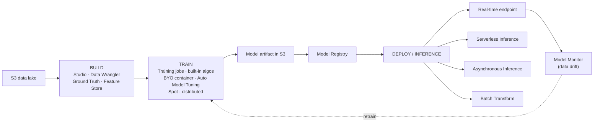

# Amazon SageMaker AI - SAA-C03 Deep Dive

> **Amazon SageMaker AI** is the **fully managed platform to build, train, and deploy custom ML models** end-to-end. On SAA-C03 it is the **fallback answer when no pre-built managed AI service (Rekognition, Comprehend, Kendra, Transcribe, etc.) fits** - i.e. "we need a _custom_ model trained on _our_ data."

See also: [00 - Machine Learning Overview](00%20-%20Machine%20Learning%20Overview.md) · [01 - Amazon Rekognition Deep Dive](01%20-%20Amazon%20Rekognition%20Deep%20Dive.md) · [01 - Amazon Comprehend Deep Dive](01%20-%20Amazon%20Comprehend%20Deep%20Dive.md) · [01 - Amazon Kendra Deep Dive](01%20-%20Amazon%20Kendra%20Deep%20Dive.md)

---

## Table of Contents

- [1. What SageMaker AI Is (and the SAA-C03 Framing)](#1-what-sagemaker-ai-is-and-the-saa-c03-framing)
- [2. The ML Lifecycle on SageMaker](#2-the-ml-lifecycle-on-sagemaker)
- [3. Build - Prepare Data & Author Models](#3-build---prepare-data--author-models)
- [4. Train - Training Jobs, Tuning, Spot & Distributed](#4-train---training-jobs-tuning-spot--distributed)
- [5. Deploy & Inference - The Four Options (Exam Core)](#5-deploy--inference---the-four-options-exam-core)
- [6. Multi-Model Endpoints & Autoscaling](#6-multi-model-endpoints--autoscaling)
- [7. MLOps - Pipelines, Registry, Monitor, Clarify](#7-mlops---pipelines-registry-monitor-clarify)
- [8. Autopilot & JumpStart](#8-autopilot--jumpstart)
- [9. Security - VPC Mode, Network Isolation, No-Internet](#9-security---vpc-mode-network-isolation-no-internet)
- [10. Conceptual Example (SDK / CLI Names)](#10-conceptual-example-sdk--cli-names)
- [11. Cost Model](#11-cost-model)
- [12. Best Practices](#12-best-practices)
- [13. Key Exam Facts (SAA-C03)](#13-key-exam-facts-saa-c03)
- [Summary](#summary)

---

---

## 1. What SageMaker AI Is (and the SAA-C03 Framing)

SageMaker AI is a **fully managed, end-to-end ML platform**. It removes the undifferentiated heavy lifting of provisioning training clusters, managing inference servers, and wiring an MLOps pipeline together.

**The decision the exam tests:**

- The managed AI services (Rekognition for images/video, Comprehend for NLP, Kendra for search, Transcribe for speech, Polly, Translate, Textract, Forecast, Personalize) are **pre-trained / API-only** - you bring _data_, not a _model_.
- **SageMaker AI is the choice when those don't fit**: you need a **custom model**, your **own algorithm**, **full control over training**, or to deploy a model the managed services can't produce.

> Exam cue: "**custom model trained on the company's own labeled data**", "**bring your own algorithm/framework**", "**full control of training and inference**" → **SageMaker AI**.

[⬆ Back to top](#table-of-contents)

---

## 2. The ML Lifecycle on SageMaker

| Phase       | What happens                            | Key SageMaker features                                                                               |
| :---------- | :-------------------------------------- | :--------------------------------------------------------------------------------------------------- |
| **Build**   | Prepare/label/explore data, author code | Studio, Notebooks, Data Wrangler, Ground Truth, Feature Store                                        |
| **Train**   | Fit the model, tune hyperparameters     | Training Jobs, built-in algorithms, BYO container, Automatic Model Tuning, Spot/distributed training |
| **Deploy**  | Serve predictions                       | Real-time, Serverless, Async, Batch Transform endpoints                                              |
| **Operate** | Govern & watch in production            | Pipelines, Model Registry, Model Monitor, Clarify                                                    |

[⬆ Back to top](#table-of-contents)

---

## 3. Build - Prepare Data & Author Models

| Feature              | Purpose                                                                                                              | Exam relevance                                   |
| :------------------- | :------------------------------------------------------------------------------------------------------------------- | :----------------------------------------------- |
| **SageMaker Studio** | Web-based IDE for the whole lifecycle                                                                                | The single managed workbench                     |
| **Notebooks**        | Managed Jupyter notebook instances                                                                                   | Interactive dev/experimentation                  |
| **Data Wrangler**    | Visual data prep / feature engineering                                                                               | "Prepare & transform data with minimal code"     |
| **Ground Truth**     | **Managed data-labeling service** (human labelers via Mechanical Turk, vendors, or private workforce; auto-labeling) | "**Need to label a raw dataset**" → Ground Truth |
| **Feature Store**    | Central, reusable store for ML features (online + offline)                                                           | Consistent features across training & inference  |

> Exam cue: "**we have unlabeled data and need it labeled for training**" → **SageMaker Ground Truth**.

[⬆ Back to top](#table-of-contents)

---

## 4. Train - Training Jobs, Tuning, Spot & Distributed

A **training job** reads data from **S3**, runs a container on managed compute, and writes the **model artifact back to S3**.

| Capability                                         | What it does                                                                                         |
| :------------------------------------------------- | :--------------------------------------------------------------------------------------------------- |
| **Built-in algorithms**                            | XGBoost, Linear Learner, k-means, image classification, etc. - no code to write                      |
| **Bring Your Own (BYO) container**                 | Package any framework (TensorFlow, PyTorch, scikit-learn, custom) as a Docker image in ECR           |
| **Script mode**                                    | Use AWS-managed framework containers, supply just your training script                               |
| **Automatic Model Tuning (Hyperparameter Tuning)** | Runs many training jobs to **search hyperparameters** (Bayesian/random/grid) and pick the best model |
| **Managed Spot Training**                          | Uses **Spot instances** to cut training cost up to ~90%; checkpoints to S3 to survive interruptions  |
| **Distributed training**                           | Data-parallel and model-parallel libraries for large datasets/models                                 |

> Exam cue: "**reduce training cost**" → **Managed Spot Training**. "**Automatically find the best hyperparameters**" → **Automatic Model Tuning**.

[⬆ Back to top](#table-of-contents)

---

## 5. Deploy & Inference - The Four Options (Exam Core)

This is the **most heavily tested SageMaker topic**. Memorize the match between traffic pattern and inference type.

| Option                     | Traffic / payload pattern                                                                                      | Latency                           | Scale-to-zero?                            | Exam cue                                                          |
| :------------------------- | :------------------------------------------------------------------------------------------------------------- | :-------------------------------- | :---------------------------------------- | :---------------------------------------------------------------- |
| **Real-time endpoint**     | **Steady, sustained** request rate; needs **low, consistent latency**                                          | Low (ms), always-on               | No (instance runs 24/7)                   | "**Persistent, low-latency online predictions**"                  |
| **Serverless Inference**   | **Intermittent / spiky / unpredictable** traffic with **idle periods**; tolerates **cold starts**              | Low, but **cold start** when idle | **Yes** - pay per request, scales to zero | "**Spiky/infrequent traffic, no idle cost, no server mgmt**"      |
| **Asynchronous Inference** | **Large payloads (up to 1 GB)** and/or **long processing times (up to ~1 hr)**; results delivered via S3 + SNS | Queued (near-real-time)           | Yes (can scale to zero)                   | "**Large input, long-running inference, don't block the caller**" |
| **Batch Transform**        | **Whole dataset scored offline**, no persistent endpoint                                                       | N/A (batch job)                   | N/A (job ends)                            | "**Score a large batch, no live endpoint needed**"                |

> **Disambiguation drill (exam favorite):**
>
> - Steady online traffic → **Real-time**
> - Spiky/intermittent, want scale-to-zero → **Serverless**
> - Big payload AND long processing → **Asynchronous**
> - Predict over an entire dataset, no endpoint → **Batch Transform**

[⬆ Back to top](#table-of-contents)

---

## 6. Multi-Model Endpoints & Autoscaling

- **Multi-Model Endpoints (MME):** host **many models behind one endpoint**, loading models into memory on demand. Slashes cost when you have **many small/similar models** that aren't all hot at once (e.g. one model per customer).
- **Multi-Container Endpoints:** host multiple distinct containers behind one endpoint.
- **Inference Pipelines:** chain pre-processing → model → post-processing in one endpoint.
- **Endpoint autoscaling:** real-time endpoints support **Application Auto Scaling** on metrics like `SageMakerVariantInvocationsPerInstance` - scale instance count with load.

> Exam cue: "**hundreds of similar models, minimize cost, one endpoint**" → **Multi-Model Endpoint**.

[⬆ Back to top](#table-of-contents)

---

## 7. MLOps - Pipelines, Registry, Monitor, Clarify

| Service                 | Purpose                                                                                             | Exam cue                                        |
| :---------------------- | :-------------------------------------------------------------------------------------------------- | :---------------------------------------------- |
| **SageMaker Pipelines** | CI/CD workflow orchestration for ML (build → train → eval → deploy)                                 | "**Automate the ML workflow / MLOps pipeline**" |
| **Model Registry**      | Catalog, **version**, and approve models for deployment                                             | "**Version & govern model promotion**"          |
| **Model Monitor**       | Continuously watches a deployed endpoint for **data drift / quality drift / bias drift** and alerts | "**Detect model/data drift in production**"     |
| **Clarify**             | **Bias detection** (pre/post training) and **explainability** (feature importance)                  | "**Explain predictions / detect bias**"         |

> Exam cue: "**model accuracy degrading over time in production**" → **Model Monitor** detects drift; retrain via **Pipelines**.

[⬆ Back to top](#table-of-contents)

---

## 8. Autopilot & JumpStart

| Feature       | What it is                                                                                                                     | Exam cue                                               |
| :------------ | :----------------------------------------------------------------------------------------------------------------------------- | :----------------------------------------------------- |
| **Autopilot** | **AutoML** - point at tabular data, it auto-builds, trains, and ranks candidate models with **full visibility** (no black box) | "**Build a model with minimal ML expertise / AutoML**" |
| **JumpStart** | Hub of **pre-trained models & foundation models (LLMs)** plus solution templates; deploy/fine-tune quickly                     | "**Start from a pre-trained / foundation model**"      |

[⬆ Back to top](#table-of-contents)

---

## 9. Security - VPC Mode, Network Isolation, No-Internet

| Control                         | What it does                                                                                                    |
| :------------------------------ | :-------------------------------------------------------------------------------------------------------------- |
| **VPC mode**                    | Launch training jobs & endpoints **inside your VPC**, into private subnets                                      |
| **VPC endpoints (PrivateLink)** | Reach the SageMaker API and S3 **without traversing the public internet**                                       |
| **Network isolation**           | Container runs with **no inbound/outbound network access** at all (no internet)                                 |
| **Encryption**                  | **KMS** for data at rest (S3, EBS, model artifacts); **TLS** in transit. See [20 - KMS & Envelope Encryption](20%20-%20KMS%20%26%20Envelope%20Encryption.md) |
| **IAM**                         | Execution role grants the job/endpoint scoped access to S3, ECR, KMS                                            |

> Exam cue: "**training must run with no internet access / data can't leave the VPC**" → **VPC mode + network isolation + VPC endpoints for S3 & SageMaker**.

[⬆ Back to top](#table-of-contents)

---

## 10. Conceptual Example (SDK / CLI Names)

High-level flow (Python SDK / `aws sagemaker` CLI - names only, no invented APIs):

1. **Train** - create a training job:
   - SDK: `Estimator(...).fit(s3_input)`
   - CLI: `aws sagemaker create-training-job`
   - Output: model artifact (`model.tar.gz`) in S3.
2. **Register** the model: `aws sagemaker create-model`, then add to the **Model Registry**.
3. **Deploy** to a real-time endpoint:
   - `aws sagemaker create-endpoint-config` (instance type/count or serverless config)
   - `aws sagemaker create-endpoint`
   - SDK shortcut: `model.deploy(instance_type=..., initial_instance_count=...)`
4. **Invoke**: `aws sagemaker-runtime invoke-endpoint` (real-time) or `invoke-endpoint-async`.
5. **Batch** instead: `aws sagemaker create-transform-job` (Batch Transform - no endpoint).

> Inference choice is expressed in the **endpoint config**: real-time (instances), **serverless** (memory + max concurrency), or **async** (S3 output + SNS); Batch Transform is a separate transform job.

[⬆ Back to top](#table-of-contents)

---

## 11. Cost Model

- **Dominated by instance-hours**: **endpoint instance-hours** (real-time runs 24/7) and **training instance-hours**.
- **Serverless / Async** can **scale to zero** → no idle cost during quiet periods.
- **Batch Transform** only bills for the job duration.
- **Managed Spot Training** can cut training cost up to ~90%.
- **Idle real-time endpoints are the #1 surprise bill** - they keep billing until deleted.

[⬆ Back to top](#table-of-contents)

---

## 12. Best Practices

1. **Right-size endpoints** and enable **autoscaling** so capacity tracks load.
2. **Match inference type to traffic**: serverless/async for **spiky or bursty**; real-time only for **sustained low-latency**.
3. **Delete idle endpoints** (and stop idle notebook instances) to stop runaway cost.
4. **Use Managed Spot Training** for cost-sensitive, checkpointable training.
5. **Use Multi-Model Endpoints** when hosting many models that aren't all hot.
6. **Run in VPC mode with network isolation** for sensitive data; reach S3/SageMaker via **VPC endpoints**.
7. **Monitor with Model Monitor**; automate retraining via **Pipelines**.
8. **Version models in the Model Registry** before promotion.

[⬆ Back to top](#table-of-contents)

---

## 13. Key Exam Facts (SAA-C03)

1. **No managed AI service fits / need a custom model** → **SageMaker AI**.
2. **Inference selection**: steady → **Real-time**; spiky/scale-to-zero → **Serverless**; large payload + long processing → **Asynchronous**; whole-dataset offline → **Batch Transform**.
3. **Label a dataset** → **Ground Truth**.
4. **Cheaper training** → **Managed Spot Training**; **best hyperparameters** → **Automatic Model Tuning**.
5. **Detect drift** → **Model Monitor**; **bias/explainability** → **Clarify**; **AutoML** → **Autopilot**; **pre-trained/foundation models** → **JumpStart**.
6. **No internet / data stays in VPC** → **VPC mode + network isolation + VPC endpoints**.
7. **Many similar models, one endpoint, low cost** → **Multi-Model Endpoints**.
8. **Cost is mostly endpoint & training instance-hours; delete idle endpoints.**

[⬆ Back to top](#table-of-contents)

---

## Summary

- **SageMaker AI = fully managed build/train/deploy platform**; the **custom-model fallback** when Rekognition/Comprehend/Kendra/etc. don't fit.
- Lifecycle: **Build** (Studio, Data Wrangler, Ground Truth, Feature Store) → **Train** (jobs, tuning, Spot, distributed) → **Deploy** (real-time, serverless, async, batch).
- **Four inference options** are the exam's core disambiguation.
- **MLOps**: Pipelines, Model Registry, Model Monitor, Clarify; plus **Autopilot** (AutoML) and **JumpStart** (foundation models).
- **Secure** with VPC mode + network isolation; **cost** is driven by instance-hours - **delete idle endpoints** and use Spot/serverless.

Next: [02 - Amazon SageMaker AI Exam Scenarios & Troubleshooting](02%20-%20Amazon%20SageMaker%20AI%20Exam%20Scenarios%20%26%20Troubleshooting.md)

[⬆ Back to top](#table-of-contents)
