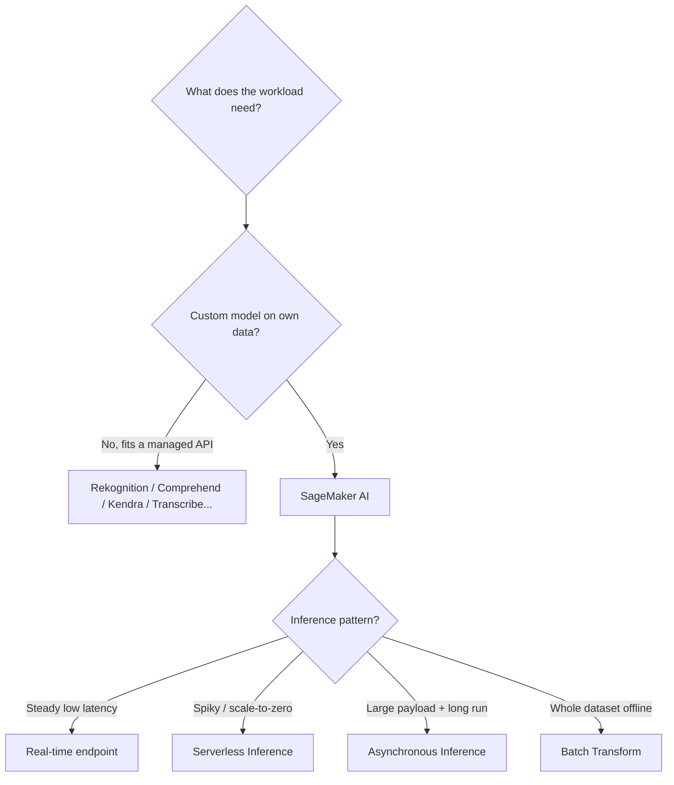

# Amazon SageMaker AI - Exam Scenarios & Troubleshooting

> Scenario-driven SAA-C03 practice for **Amazon SageMaker AI**: choosing the right **inference type**, knowing when **SageMaker beats a managed AI service**, securing training with **VPC mode**, and an SRE-style troubleshooting table for the failures the exam loves.

See also: [00 - Machine Learning Overview](00%20-%20Machine%20Learning%20Overview.md) · [01 - Amazon SageMaker AI Deep Dive](01%20-%20Amazon%20SageMaker%20AI%20Deep%20Dive.md) · [01 - Amazon Rekognition Deep Dive](01%20-%20Amazon%20Rekognition%20Deep%20Dive.md) · [01 - Amazon Comprehend Deep Dive](01%20-%20Amazon%20Comprehend%20Deep%20Dive.md) · [01 - Amazon Kendra Deep Dive](01%20-%20Amazon%20Kendra%20Deep%20Dive.md)

---

## Table of Contents

- [1. Exam-Style Questions (MCQ)](#1-exam-style-questions-mcq)
- [2. Common Errors & Troubleshooting (SRE Perspective)](#2-common-errors--troubleshooting-sre-perspective)
- [3. Decision: SageMaker vs Managed AI Services](#3-decision-sagemaker-vs-managed-ai-services)
- [4. Rapid-Fire Cue Sheet](#4-rapid-fire-cue-sheet)
- [Summary](#summary)

---

---

## 1. Exam-Style Questions (MCQ)

**Q1. Custom model needed**
A company has a unique tabular fraud-detection problem and labeled historical data. No AWS pre-built API matches their use case; they need full control over the algorithm. Which service?

- A. Amazon Comprehend
- B. Amazon Rekognition
- C. **Amazon SageMaker AI**
- D. Amazon Fraud Detector only

**Answer: C.** **Exam Tip:** Pre-built managed AI services give you an API, not a custom model. "Custom algorithm / own labeled data / full control" → **SageMaker AI**.

---

**Q2. Spiky, intermittent traffic**
An internal app calls a model only a few times an hour in unpredictable bursts; the team wants **no idle cost and no servers to manage**, and can tolerate brief cold starts. Which inference option?

- A. Real-time endpoint
- B. **Serverless Inference**
- C. Batch Transform
- D. Asynchronous Inference

**Answer: B.** **Exam Tip:** Intermittent/spiky + scale-to-zero + no infra mgmt → **Serverless Inference**. Cold starts are the trade-off.

---

**Q3. Steady, low-latency online predictions**
A customer-facing recommendation API receives **constant high-volume traffic** and must return predictions in single-digit milliseconds 24/7. Which option?

- A. **Real-time endpoint (with autoscaling)**
- B. Serverless Inference
- C. Batch Transform
- D. Asynchronous Inference

**Answer: A.** **Exam Tip:** Sustained traffic + consistent low latency → **Real-time endpoint**. Add Application Auto Scaling for load.

---

**Q4. Large payload, long processing**
A model processes **800 MB inputs** and each inference takes **several minutes**; the caller should not block and can collect results later from S3. Which option?

- A. Real-time endpoint
- B. Serverless Inference
- C. **Asynchronous Inference**
- D. Batch Transform

**Answer: C.** **Exam Tip:** **Large payloads (up to 1 GB)** and/or **long processing (up to ~1 hr)** with queued, non-blocking delivery → **Asynchronous Inference**. (Serverless has smaller payload/timeout limits.)

---

**Q5. Score an entire dataset offline**
A nightly job must generate predictions for **10 million records** stored in S3. There is **no need for a live endpoint**. Which option is most cost-effective?

- A. Real-time endpoint
- B. **Batch Transform**
- C. Asynchronous Inference
- D. Multi-Model Endpoint

**Answer: B.** **Exam Tip:** Whole-dataset offline scoring, no persistent endpoint → **Batch Transform** (bills only for job duration).

---

**Q6. Labeling a raw dataset**
A team has thousands of unlabeled images and needs a **labeled training set**, optionally using a human workforce. Which feature?

- A. SageMaker Clarify
- B. SageMaker Model Monitor
- C. **SageMaker Ground Truth**
- D. SageMaker Feature Store

**Answer: C.** **Exam Tip:** "Need to **label** data (human workforce / auto-labeling)" → **Ground Truth**.

---

**Q7. Secure training with no internet**
A regulated company requires that training jobs run with **no internet access** and that data **never leave their VPC**, including access to S3. What should they configure?

- A. A public endpoint with an IAM policy
- B. **VPC mode with network isolation, plus VPC (gateway/interface) endpoints for S3 and SageMaker**
- C. A NAT gateway for the training job
- D. Disable encryption to simplify networking

**Answer: B.** **Exam Tip:** No-internet + data-stays-in-VPC → **VPC mode + network isolation + VPC endpoints**. A NAT gateway would _give_ internet access - the opposite of the requirement.

---

**Q8. Cheaper training**
A research team runs long, **checkpointable** training jobs and wants to **cut training cost** as much as possible, tolerating interruptions. What should they use?

- A. **Managed Spot Training**
- B. Larger On-Demand instances
- C. Serverless Inference
- D. Reserved Instances for the endpoint

**Answer: A.** **Exam Tip:** "Reduce training cost, can tolerate interruption, checkpoints" → **Managed Spot Training** (up to ~90% savings).

---

**Q9. Detecting accuracy decay in production**
A deployed model's predictions are drifting from real-world outcomes over time. The team wants automatic detection and alerts. Which feature?

- A. SageMaker Clarify
- B. **SageMaker Model Monitor**
- C. SageMaker JumpStart
- D. SageMaker Autopilot

**Answer: B.** **Exam Tip:** "Detect **data/model drift** in production" → **Model Monitor**. (Clarify = bias + explainability; Autopilot = AutoML; JumpStart = pre-trained/foundation models.)

---

**Q10. Many models, minimize cost**
A SaaS platform must serve a **separate small model per tenant (hundreds of them)** but only a few are active at any moment, and wants to **minimize endpoint cost**. What fits best?

- A. One real-time endpoint per model
- B. **A Multi-Model Endpoint**
- C. Batch Transform per tenant
- D. Serverless endpoint per model

**Answer: B.** **Exam Tip:** Many similar models, not all hot, one endpoint, low cost → **Multi-Model Endpoint**.

---

**Q11. Best hyperparameters automatically**
A data scientist wants SageMaker to **search hyperparameters** and return the best-performing model without manual trial-and-error. Which feature?

- A. **Automatic Model Tuning (Hyperparameter Tuning)**
- B. Model Monitor
- C. Feature Store
- D. Inference Pipelines

**Answer: A.** **Exam Tip:** "Automatically find best hyperparameters" → **Automatic Model Tuning**.

---

**Q12. AutoML with minimal expertise**
A business analyst with limited ML experience wants to build a model from a tabular dataset and still see how candidate models were built. Which feature?

- A. JumpStart
- B. Ground Truth
- C. **Autopilot**
- D. Clarify

**Answer: C.** **Exam Tip:** "AutoML with visibility / minimal ML expertise on tabular data" → **Autopilot**.

[⬆ Back to top](#table-of-contents)

---

## 2. Common Errors & Troubleshooting (SRE Perspective)

| Symptom                                                           | Likely cause                                                                 | Fix / mitigation                                                                                                                         |
| :---------------------------------------------------------------- | :--------------------------------------------------------------------------- | :--------------------------------------------------------------------------------------------------------------------------------------- |
| **High first-request latency on serverless / cold start**         | Endpoint scaled to zero; container/model load on first hit                   | Use **Provisioned Concurrency** on Serverless, or switch steady traffic to a **real-time endpoint (warm)**                               |
| **`ResourceLimitExceeded` when creating a training job/endpoint** | **Per-account/per-instance-type service quota** hit                          | Request a **quota increase** (Service Quotas); choose an available instance type or Region                                               |
| **`ThrottlingException` / 429 on `invoke-endpoint`**              | Request rate exceeds endpoint capacity / API throttling                      | **Exponential backoff with jitter** on the client; **autoscale** instance count; right-size instances                                    |
| **Training job fails immediately**                                | Bad **S3 path / data format**, or **execution role lacks S3/ECR/KMS access** | Verify the **IAM execution role** can read input S3, write output S3, pull the ECR image, use the KMS key; validate input channel format |
| **Endpoint cost runaway**                                         | **Idle real-time endpoint left running 24/7**                                | **Delete idle endpoints**; use **serverless/async** for spiky traffic; stop idle notebook instances                                      |
| **Predictions drifting / accuracy dropping**                      | **Data drift** vs training distribution                                      | **Model Monitor** detects drift → trigger **retraining via Pipelines** → deploy new version from **Model Registry**                      |
| **Autoscaling not kicking in (overload or over-provision)**       | Misconfigured scaling policy / wrong target metric/cooldown                  | Set target tracking on **`SageMakerVariantInvocationsPerInstance`** with sensible target value and cooldowns                             |
| **Async/training job can't reach S3 in VPC mode**                 | **Network isolation** on + no **VPC endpoint** for S3/SageMaker              | Add **gateway endpoint for S3** and **interface endpoints** for SageMaker API/runtime; check security groups                             |
| **`AccessDenied` pulling container image**                        | Execution role missing **ECR** permissions or image in another account       | Grant `ecr:GetAuthorizationToken` + pull perms; verify image URI/Region                                                                  |

[⬆ Back to top](#table-of-contents)

---

## 3. Decision: SageMaker vs Managed AI Services

| Need                                                     | Choose                                               | Why                               |
| :------------------------------------------------------- | :--------------------------------------------------- | :-------------------------------- |
| **Custom model on your own data / own algorithm**        | **SageMaker AI**                                     | Full build-train-deploy control   |
| Detect objects, faces, moderation in **images/video**    | [Rekognition](01%20-%20Amazon%20Rekognition%20Deep%20Dive.md)   | Pre-built vision API, no training |
| **NLP**: sentiment, entities, key phrases, PII, language | [Comprehend](01%20-%20Amazon%20Comprehend%20Deep%20Dive.md)     | Pre-built NLP API                 |
| **Intelligent enterprise search** over documents         | [Kendra](01%20-%20Amazon%20Kendra%20Deep%20Dive.md)             | Managed semantic search           |
| Speech-to-text / text-to-speech / translation            | Transcribe / Polly / Translate                       | Pre-built API                     |
| Extract text/forms from documents                        | Textract                                             | Pre-built OCR API                 |
| **General rule**                                         | Managed API if one fits; **SageMaker if it doesn't** | Less ops vs full control          |

> **Exam heuristic:** A named managed service in the options that exactly matches the task usually **beats** SageMaker (less heavy lifting). Pick **SageMaker only when the use case is custom** or no managed service fits.

[⬆ Back to top](#table-of-contents)

---

## 4. Rapid-Fire Cue Sheet

| Cue in the question                             | Answer                                           |
| :---------------------------------------------- | :----------------------------------------------- |
| "Custom model / own algorithm / full control"   | **SageMaker AI**                                 |
| "Steady, low-latency online predictions"        | **Real-time endpoint**                           |
| "Spiky/intermittent, no idle cost, no servers"  | **Serverless Inference**                         |
| "Large payload + long processing, non-blocking" | **Asynchronous Inference**                       |
| "Score a whole dataset, no live endpoint"       | **Batch Transform**                              |
| "Many small models, one endpoint, low cost"     | **Multi-Model Endpoint**                         |
| "Label raw data"                                | **Ground Truth**                                 |
| "Reduce training cost, interruption OK"         | **Managed Spot Training**                        |
| "Find best hyperparameters automatically"       | **Automatic Model Tuning**                       |
| "Detect drift in production"                    | **Model Monitor**                                |
| "Bias / explain predictions"                    | **Clarify**                                      |
| "AutoML, minimal expertise"                     | **Autopilot**                                    |
| "Pre-trained / foundation models"               | **JumpStart**                                    |
| "No internet, data stays in VPC"                | **VPC mode + network isolation + VPC endpoints** |
| "Surprise SageMaker bill"                       | **Idle endpoint left running - delete it**       |

[⬆ Back to top](#table-of-contents)

---

## Summary

- **Inference selection is the most-tested theme**: steady → **real-time**, spiky → **serverless**, big+long → **async**, whole-dataset → **batch**.
- **SageMaker is the custom-model fallback**; prefer a matching **managed AI service** when one fits.
- **Ground Truth** labels data, **Spot** cuts training cost, **Auto Model Tuning** finds hyperparameters, **Model Monitor** catches drift.
- **VPC mode + network isolation + VPC endpoints** = no-internet, data-in-VPC training/inference.
- Watch for **idle-endpoint cost runaway**, **quota (`ResourceLimitExceeded`)**, **throttling (backoff)**, and **IAM/S3/ECR** training failures.

Back to: [01 - Amazon SageMaker AI Deep Dive](01%20-%20Amazon%20SageMaker%20AI%20Deep%20Dive.md)

[⬆ Back to top](#table-of-contents)
