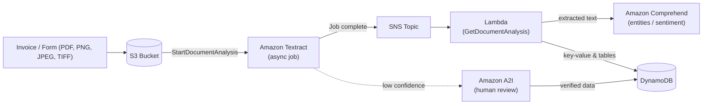
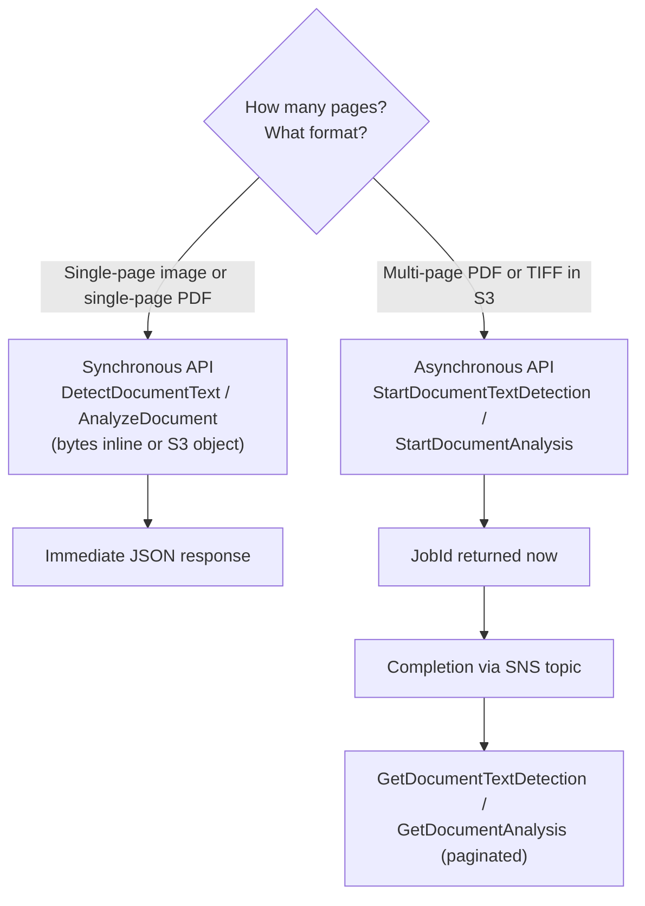
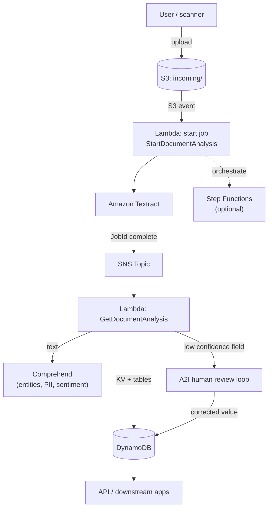

# Amazon Textract - SAA-C03 Deep Dive

> **Amazon Textract** is a fully managed OCR service that goes **beyond plain text** - it extracts structured data (key-value form pairs, tables, query answers, signatures, layout) from scanned documents and PDFs, with confidence scores and bounding boxes for every element.

See also: [00 - Machine Learning Overview](00%20-%20Machine%20Learning%20Overview.md) · [01 - Amazon Rekognition Deep Dive](01%20-%20Amazon%20Rekognition%20Deep%20Dive.md) · [01 - Amazon Comprehend Deep Dive](01%20-%20Amazon%20Comprehend%20Deep%20Dive.md) · [01 - Amazon Transcribe Deep Dive](01%20-%20Amazon%20Transcribe%20Deep%20Dive.md)

---

## Table of Contents

- [1. Textract in a Sentence](#1-textract-in-a-sentence)
- [2. Textract vs Rekognition DetectText (The Classic Trap)](#2-textract-vs-rekognition-detecttext-the-classic-trap)
- [3. Core APIs - Text & Document Analysis](#3-core-apis---text--document-analysis)
- [4. AnalyzeDocument Feature Types](#4-analyzedocument-feature-types)
- [5. Specialized Analyzers](#5-specialized-analyzers)
- [6. Synchronous vs Asynchronous Processing](#6-synchronous-vs-asynchronous-processing)
- [7. The Blocks Model - Confidence & Bounding Boxes](#7-the-blocks-model---confidence--bounding-boxes)
- [8. Reference Architecture](#8-reference-architecture)
- [9. Integrations](#9-integrations)
- [10. CLI & API Examples](#10-cli--api-examples)
- [11. Best Practices](#11-best-practices)
- [12. Limits, Formats & Pricing](#12-limits-formats--pricing)
- [13. Key Exam Facts (SAA-C03)](#13-key-exam-facts-saa-c03)
- [Summary](#summary)

---



---

## 1. Textract in a Sentence

Textract is **machine-learning OCR plus document understanding**. Where a classic OCR engine returns a flat stream of characters, Textract returns the **relationships** between those characters: which word is a form **key** and which is its **value**, which cells make up a **table**, the **answer** to a natural-language question about the document, whether a **signature** is present, and the document's reading **layout** (titles, headers, paragraphs, lists).

You give it a document; it gives you back structured JSON with confidence scores and pixel coordinates - no template, no manual zone configuration required.

| Why Textract exists                      | What it gives you                                         |
| :--------------------------------------- | :-------------------------------------------------------- |
| OCR alone loses structure                | Key-value pairs, tables, layout - not just raw text       |
| Document workflows need data, not images | Machine-readable JSON ready for databases / APIs          |
| Manual data entry is slow & error-prone  | Automated extraction with confidence scoring              |
| Compliance needs human verification      | Built-in routing to [5. Specialized Analyzers](#5-specialized-analyzers) and A2I |

[⬆ Back to top](#table-of-contents)

---

## 2. Textract vs Rekognition DetectText (The Classic Trap)

This is one of the most frequently tested distinctions in the ML domain. Both services "read text from images," but they are tuned for **opposite** use cases.

| Dimension            | **Amazon Textract**                                                            | **Amazon Rekognition DetectText**                                                       |
| :------------------- | :----------------------------------------------------------------------------- | :-------------------------------------------------------------------------------------- |
| Designed for         | **Dense documents** - forms, invoices, contracts, scanned pages                | **Text in natural scenes / photos** - street signs, product labels, social media images |
| Input                | Scanned PDFs, multi-page TIFF, document images                                 | Photographs, video frames                                                               |
| Output               | Structured data: forms (KV), tables, queries, layout, signatures               | Detected words/lines in the scene + bounding boxes                                      |
| Page volume          | Optimized for many words per page (paragraphs, columns)                        | Limited words per image (~100 words, scene-oriented)                                    |
| Multi-page           | Yes (async multi-page PDF/TIFF)                                                | No - single image                                                                       |
| Typical question cue | "scanned **form**", "**invoice**", "**document**", "extract **fields/tables**" | "text in a **photo**", "**sign** in an image", "frame of a **video**"                   |

**Exam mnemonic:** _Document = Textract. Scene/photo = Rekognition._ If the prompt says "scanned form," "invoice," "key-value pairs," or "tables," it is **always Textract**.

[⬆ Back to top](#table-of-contents)

---

## 3. Core APIs - Text & Document Analysis

Textract exposes two families of text-extraction APIs.

### DetectDocumentText - raw OCR

- Returns **plain text only** (LINE and WORD blocks) plus geometry/confidence.
- Cheapest API; use when you just need the text content, no structure.
- Sync: `DetectDocumentText`. Async: `StartDocumentTextDetection` / `GetDocumentTextDetection`.

### AnalyzeDocument - structured analysis

- Returns text **plus** structured features you request via `FeatureTypes` (see [4. AnalyzeDocument Feature Types](#4-analyzedocument-feature-types)).
- More expensive per page than DetectDocumentText (you pay per feature type enabled).
- Sync: `AnalyzeDocument`. Async: `StartDocumentAnalysis` / `GetDocumentAnalysis`.

| API                  | Returns                                               | Cost tier            | When to use              |
| :------------------- | :---------------------------------------------------- | :------------------- | :----------------------- |
| `DetectDocumentText` | Raw text (lines/words)                                | Lowest               | You only need the text   |
| `AnalyzeDocument`    | Text + FORMS / TABLES / QUERIES / SIGNATURES / LAYOUT | Higher (per feature) | You need structured data |

[⬆ Back to top](#table-of-contents)

---

## 4. AnalyzeDocument Feature Types

`AnalyzeDocument` (and its async `StartDocumentAnalysis`) accepts a `FeatureTypes` list. **You are billed per feature type per page**, so request only what you need.

| FeatureType    | Extracts                                                                | Example                                             |
| :------------- | :---------------------------------------------------------------------- | :-------------------------------------------------- |
| **FORMS**      | Key-value pairs                                                         | `Name: Jane Doe`, `Date: 2026-06-01`                |
| **TABLES**     | Rows, columns, cell relationships                                       | Line-items grid on an invoice                       |
| **QUERIES**    | Answers to natural-language questions you supply                        | "What is the total amount due?" - returns the value |
| **SIGNATURES** | Presence and location of handwritten signatures                         | Detects a signed line on a contract                 |
| **LAYOUT**     | Document structure: titles, headers, paragraphs, lists, figures, tables | Reading order for downstream NLP                    |

**QUERIES** is powerful for variable-layout documents: instead of mapping coordinates, you literally ask the document a question (`"What is the invoice number?"`) and Textract returns the answer with a confidence score - no template needed.

[⬆ Back to top](#table-of-contents)

---

## 5. Specialized Analyzers

For common document types, Textract ships purpose-built APIs that return **normalized, named fields** instead of generic key-value pairs.

| API                | Document type                  | Normalized output                                                                  |
| :----------------- | :----------------------------- | :--------------------------------------------------------------------------------- |
| **AnalyzeExpense** | Invoices & receipts            | Vendor name, total, tax, line items, invoice/receipt date - as standardized fields |
| **AnalyzeID**      | US driver licenses & passports | First/last name, DOB, document number, expiration, address                         |
| **AnalyzeLending** | Mortgage / loan packages       | Classifies and splits a loan packet, extracts fields per document type             |

These save you from writing parsing logic: `AnalyzeExpense` knows that `Subtotal`, `Sub-total`, and `Amount before tax` all map to the same normalized `SUBTOTAL` field. `AnalyzeID` has sync and async variants; `AnalyzeExpense` and `AnalyzeLending` likewise offer async `StartExpenseAnalysis` / `StartLendingAnalysis` for multi-page input.

**Exam cue:** "extract data from **receipts/invoices**" -> `AnalyzeExpense`. "verify identity from a **driver license / passport**" -> `AnalyzeID`.

[⬆ Back to top](#table-of-contents)

---

## 6. Synchronous vs Asynchronous Processing

This distinction is heavily tested - it maps directly to page count and input format.



| Mode             | Trigger APIs                                                                                          | Input                                                                         | Result delivery                                                                         |
| :--------------- | :---------------------------------------------------------------------------------------------------- | :---------------------------------------------------------------------------- | :-------------------------------------------------------------------------------------- |
| **Synchronous**  | `DetectDocumentText`, `AnalyzeDocument`, `AnalyzeExpense`, `AnalyzeID`                                | Single-page image (PNG/JPEG) or single-page PDF; bytes inline or S3 reference | Returned immediately in the API response                                                |
| **Asynchronous** | `StartDocumentTextDetection`, `StartDocumentAnalysis`, `StartExpenseAnalysis`, `StartLendingAnalysis` | **Multi-page PDF / TIFF stored in S3**                                        | Returns `JobId`; on completion publishes to **SNS**; you call the matching `Get...` API |

**Key rule:** Multi-page PDF or TIFF **must** use the asynchronous APIs. Synchronous APIs accept only single-page documents (and inline byte payloads are limited in size). Async input **must come from an S3 object** - you cannot pass multi-page bytes inline.

[⬆ Back to top](#table-of-contents)

---

## 7. The Blocks Model - Confidence & Bounding Boxes

Every Textract response is a list of **Block** objects. Each Block has a `BlockType`, a `Confidence` score (0-100), `Geometry` (a `BoundingBox` plus `Polygon`), and `Relationships` linking it to child blocks.

| BlockType                | Meaning                                  |
| :----------------------- | :--------------------------------------- |
| `PAGE`                   | A page of the document                   |
| `LINE` / `WORD`          | OCR text units                           |
| `KEY_VALUE_SET`          | A form key or value (FORMS feature)      |
| `TABLE` / `CELL`         | Table structure (TABLES feature)         |
| `QUERY` / `QUERY_RESULT` | A query and its answer (QUERIES feature) |
| `SIGNATURE`              | Detected signature (SIGNATURES feature)  |
| `LAYOUT_*`               | Layout elements (LAYOUT feature)         |

The `Confidence` score is the basis for **human-review routing**: if a critical field's confidence falls below your threshold, route the document to [9. Integrations](#9-integrations) (Amazon A2I) for a human to verify. `BoundingBox` coordinates are **normalized 0-1 ratios** relative to page width/height - multiply by pixel dimensions to draw overlays.

[⬆ Back to top](#table-of-contents)

---

## 8. Reference Architecture

A typical serverless invoice-processing pipeline:



Flow: a document lands in S3 -> S3 event triggers a "start" Lambda -> Textract runs the async job -> on completion Textract publishes to SNS -> a "get" Lambda fetches paginated results -> high-confidence fields go straight to DynamoDB, raw text flows to Comprehend for NLP, and **low-confidence fields are routed to A2I** for a human to confirm. Step Functions can orchestrate the start/poll/aggregate steps for larger batches.

[⬆ Back to top](#table-of-contents)

---

## 9. Integrations

| Service                       | Role in a Textract workflow                                                                 |
| :---------------------------- | :------------------------------------------------------------------------------------------ |
| **Amazon S3**                 | Source for async multi-page documents; common destination for results                       |
| **AWS Lambda**                | Glue: start jobs on upload, fetch results on SNS completion                                 |
| **Amazon SNS**                | Receives async job-completion notifications (you set `NotificationChannel`)                 |
| **Amazon A2I (Augmented AI)** | **Human-in-the-loop review** of low-confidence extractions; native flow for AnalyzeDocument |
| **Amazon Comprehend**         | Downstream NLP on extracted text - entities, key phrases, PII detection, sentiment          |
| **AWS Step Functions**        | Orchestrate multi-step / batch document pipelines                                           |
| **AWS KMS**                   | Encrypt output and async results at rest                                                    |

**A2I is the answer** whenever a question mentions "human review," "manual verification," "confidence threshold," or "review uncertain results."

[⬆ Back to top](#table-of-contents)

---

## 10. CLI & API Examples

Synchronous form + table extraction on an S3 object:

```bash
aws textract analyze-document \
  --document '{"S3Object":{"Bucket":"my-docs","Name":"form.png"}}' \
  --feature-types '["FORMS","TABLES"]'
```

Asking the document a question (QUERIES feature):

```bash
aws textract analyze-document \
  --document '{"S3Object":{"Bucket":"my-docs","Name":"invoice.png"}}' \
  --feature-types '["QUERIES"]' \
  --queries-config '{"Queries":[{"Text":"What is the total amount due?"}]}'
```

Asynchronous multi-page PDF: start the job, then fetch results when SNS fires:

```bash
# Start the async job (multi-page PDF in S3)
aws textract start-document-analysis \
  --document-location '{"S3Object":{"Bucket":"my-docs","Name":"contract.pdf"}}' \
  --feature-types '["FORMS","SIGNATURES"]' \
  --notification-channel '{"SNSTopicArn":"arn:aws:sns:us-east-1:111122223333:textract-done","RoleArn":"arn:aws:iam::111122223333:role/TextractSNSRole"}'

# Later, after SNS notification, fetch paginated results
aws textract get-document-analysis --job-id <JobId>
```

Raw OCR only (cheapest):

```bash
aws textract detect-document-text \
  --document '{"S3Object":{"Bucket":"my-docs","Name":"scan.png"}}'
```

[⬆ Back to top](#table-of-contents)

---

## 11. Best Practices

- **Pick the right API tier.** Use `DetectDocumentText` if you only need text; reserve `AnalyzeDocument` features for when you truly need structure - you pay per feature type per page.
- **Use specialized analyzers** (`AnalyzeExpense` / `AnalyzeID`) for receipts and IDs instead of parsing generic FORMS output yourself - normalized fields save development and improve accuracy.
- **Always check confidence scores** and define a threshold; route below-threshold fields to **A2I** rather than trusting them blindly.
- **Multi-page = async + S3.** Never try to brute-force multi-page through the sync API.
- **Handle pagination** on `Get...` calls (`NextToken`) - large documents span many pages of results.
- **Implement exponential backoff** for `ProvisionedThroughputExceededException` and throttling.
- **Scope IAM tightly:** the Textract execution role needs `s3:GetObject` on the input bucket and `sns:Publish` on the completion topic; the SNS role needs publish rights.
- **Pre-process scans** (deskew, sufficient DPI ~150-300) - clean inputs raise OCR confidence.

[⬆ Back to top](#table-of-contents)

---

## 12. Limits, Formats & Pricing

### Supported formats

| Mode         | Formats                                   |
| :----------- | :---------------------------------------- |
| Synchronous  | **PNG, JPEG**, single-page **PDF**        |
| Asynchronous | **PDF, TIFF** (multi-page), plus PNG/JPEG |

### Key limits (memorize the shape, not exact bytes)

| Limit                                | Value (typical)               |
| :----------------------------------- | :---------------------------- |
| Sync single-page input               | One page per call             |
| Max document size (sync image bytes) | ~5 MB inline / ~10 MB for PDF |
| Async PDF/TIFF max pages             | Up to ~3,000 pages            |
| Async object size                    | Up to ~500 MB (PDF/TIFF)      |
| Min/typical resolution               | ~150 DPI recommended          |

Exceeding these raises `DocumentTooLargeException` or `UnsupportedDocumentException`.

### Pricing model

- **Per page**, priced **by API type** - `DetectDocumentText` is cheapest; `AnalyzeDocument` costs more and **each FeatureType (FORMS, TABLES, QUERIES, etc.) is billed separately** per page.
- Specialized analyzers (`AnalyzeExpense`, `AnalyzeID`, `AnalyzeLending`) have their own per-page rates.
- No charge for SNS/Lambda glue beyond those services' own pricing; A2I human review is billed separately.

[⬆ Back to top](#table-of-contents)

---

## 13. Key Exam Facts (SAA-C03)

- **Textract = documents (forms, invoices, tables); Rekognition DetectText = scene/photo text.** This is the #1 trap.
- **Multi-page PDF/TIFF must use async APIs** (`StartDocumentAnalysis` / `StartDocumentTextDetection`) with input in **S3**; completion via **SNS**.
- **Sync APIs handle single-page** images and single-page PDFs only.
- **FORMS** = key-value pairs; **TABLES** = grids; **QUERIES** = ask questions; **SIGNATURES** = signature detection; **LAYOUT** = structure.
- **AnalyzeExpense** for invoices/receipts; **AnalyzeID** for licenses/passports; **AnalyzeLending** for mortgage docs.
- **Human review of low-confidence output = Amazon A2I.**
- **Downstream NLP on extracted text = Amazon Comprehend.**
- Billing is **per page, by API type**, with each `AnalyzeDocument` feature charged separately.

[⬆ Back to top](#table-of-contents)

---

## Summary

Amazon Textract is OCR that understands **document structure**: it returns key-value pairs, tables, query answers, signatures, and layout - not just raw text - each with a confidence score and bounding box. Choose **sync** for single-page images/PDFs and **async + S3 + SNS** for multi-page PDF/TIFF. Use specialized analyzers (`AnalyzeExpense`, `AnalyzeID`, `AnalyzeLending`) for common document types, route low-confidence fields to **A2I** for human review, and pipe extracted text into **Comprehend** for NLP. On the exam, remember the dividing line: **documents -> Textract, scenes/photos -> Rekognition.**

See also: [02 - Amazon Textract Exam Scenarios & Troubleshooting](02%20-%20Amazon%20Textract%20Exam%20Scenarios%20%26%20Troubleshooting.md)

[⬆ Back to top](#table-of-contents)
