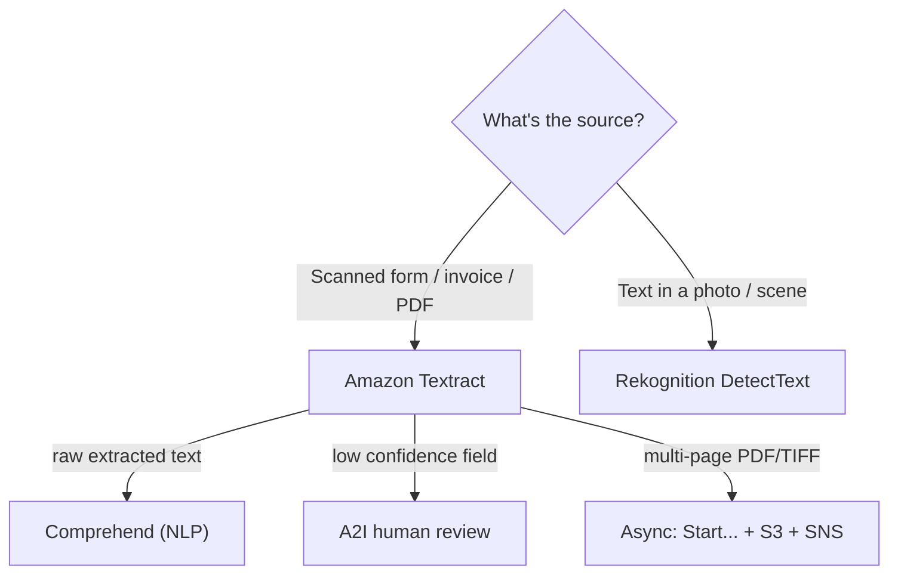

# Amazon Textract - Exam Scenarios & Troubleshooting

> Practice MCQs and an SRE-style troubleshooting reference for **Amazon Textract** - covering invoice/forms extraction, ID verification, the Textract-vs-Rekognition "scanned form vs photo text" trap, human-in-the-loop review with A2I, and multi-page async processing.

See also: [00 - Machine Learning Overview](00%20-%20Machine%20Learning%20Overview.md) · [01 - Amazon Textract Deep Dive](01%20-%20Amazon%20Textract%20Deep%20Dive.md) · [01 - Amazon Rekognition Deep Dive](01%20-%20Amazon%20Rekognition%20Deep%20Dive.md) · [01 - Amazon Comprehend Deep Dive](01%20-%20Amazon%20Comprehend%20Deep%20Dive.md) · [01 - Amazon Transcribe Deep Dive](01%20-%20Amazon%20Transcribe%20Deep%20Dive.md)

---

## Table of Contents

- [1. Exam-Style MCQs](#1-exam-style-mcqs)
- [2. Common Errors & Troubleshooting (SRE Perspective)](#2-common-errors--troubleshooting-sre-perspective)
- [3. Decision: Textract vs Rekognition vs Comprehend](#3-decision-textract-vs-rekognition-vs-comprehend)
- [4. Rapid-Fire Cue Sheet](#4-rapid-fire-cue-sheet)
- [Summary](#summary)

---

---

## 1. Exam-Style MCQs

### Q1 - Invoice data extraction

A finance team uploads thousands of **scanned vendor invoices** (single-page PDFs) to S3 and needs vendor name, invoice date, totals, and line items as structured fields with minimal custom parsing code. Which service/API?

- A. Rekognition `DetectText`
- B. Textract `DetectDocumentText`
- C. Textract `AnalyzeExpense`
- D. Comprehend `DetectEntities`

**Answer: C**

**Explanation:** `AnalyzeExpense` is purpose-built for invoices and receipts and returns **normalized fields** (vendor, total, tax, line items), eliminating custom parsing. `DetectDocumentText` (B) returns raw text only; Rekognition (A) is for scene text; Comprehend (D) does NLP, not OCR.

**Exam Tip:** "Invoice/receipt + structured fields, little code" -> `AnalyzeExpense`.

---

### Q2 - Scanned form vs photo (the classic trap)

Two requirements: (1) extract **key-value pairs from scanned application forms**; (2) read **text from photographs of storefronts**. Which pairing is correct?

- A. Textract for both
- B. Rekognition for both
- C. Textract for forms, Rekognition `DetectText` for storefront photos
- D. Rekognition for forms, Textract for storefront photos

**Answer: C**

**Explanation:** Textract targets **dense documents/forms** (key-value, tables); Rekognition `DetectText` targets **text in natural scenes/photos**. The two requirements map to the two services respectively.

**Exam Tip:** Document/form -> Textract. Photo/scene -> Rekognition. This dividing line is tested constantly.

---

### Q3 - Multi-page PDF

A legal firm processes **80-page contract PDFs** stored in S3 and needs both text and detection of where signatures appear. Which approach?

- A. `AnalyzeDocument` synchronously with FeatureTypes FORMS
- B. `StartDocumentAnalysis` with FeatureTypes SIGNATURES, results via SNS, then `GetDocumentAnalysis`
- C. `DetectDocumentText` synchronously in a loop per page
- D. Rekognition video analysis

**Answer: B**

**Explanation:** Multi-page PDFs **must** use the asynchronous APIs. `StartDocumentAnalysis` accepts the S3 object, runs the job, and notifies via SNS; you then page through `GetDocumentAnalysis`. SIGNATURES feature finds signature locations. Sync APIs (A, C) reject multi-page input.

**Exam Tip:** Multi-page PDF/TIFF = **async + S3 + SNS**, every time.

---

### Q4 - Human-in-the-loop review

An insurance claims pipeline auto-extracts fields with Textract but must send **low-confidence extractions to a human reviewer** before posting to the database. Which service?

- A. Amazon A2I (Augmented AI)
- B. Amazon SQS dead-letter queue
- C. Amazon SNS
- D. AWS Config

**Answer: A**

**Explanation:** **Amazon A2I** provides human-in-the-loop review and integrates natively with Textract `AnalyzeDocument`; you define a confidence threshold and below-threshold results are routed to human reviewers. SQS/SNS are messaging, not review workflows.

**Exam Tip:** "Human review / manual verification / confidence threshold" -> **A2I**.

---

### Q5 - Identity verification

A bank's onboarding flow must extract name, DOB, and document number from **uploaded US driver licenses and passports**. Which API?

- A. Textract `AnalyzeID`
- B. Textract `AnalyzeDocument` FORMS
- C. Rekognition `CompareFaces`
- D. Textract `DetectDocumentText`

**Answer: A**

**Explanation:** `AnalyzeID` is built for identity documents (US driver licenses, passports) and returns normalized identity fields. FORMS (B) would return generic key-value pairs needing parsing; `CompareFaces` (C) does face matching, not field extraction.

**Exam Tip:** "Driver license / passport field extraction" -> `AnalyzeID`. (Face match would be Rekognition `CompareFaces`.)

---

### Q6 - Downstream NLP

After Textract extracts the **raw text** from medical intake documents, the team wants to detect entities and **PII** in that text. Which service comes next?

- A. Amazon Comprehend (and Comprehend Medical for PHI)
- B. Amazon Translate
- C. Amazon Kendra
- D. Amazon Polly

**Answer: A**

**Explanation:** Once Textract produces text, **Comprehend** performs NLP - entity detection, key phrases, sentiment, and PII detection (Comprehend Medical for clinical PHI). Textract does OCR; Comprehend does the language understanding.

**Exam Tip:** Textract (text) -> Comprehend (meaning/PII). They are a classic pipeline pair.

---

### Q7 - Asking the document a question

A vendor's invoices have **wildly varying layouts**, so coordinate-based templates keep breaking. The team wants to simply ask "What is the total due?" and "What is the invoice number?". Which feature?

- A. `AnalyzeDocument` with FeatureTypes QUERIES
- B. `AnalyzeDocument` with FeatureTypes TABLES
- C. `DetectDocumentText`
- D. A custom regex over `DetectDocumentText` output

**Answer: A**

**Explanation:** The **QUERIES** feature lets you pass natural-language questions and returns answers with confidence - ideal for variable layouts where templating fails. TABLES extracts grids but not specific answers; raw OCR (C/D) requires brittle parsing.

**Exam Tip:** "Variable layouts, ask natural-language questions of a doc" -> **QUERIES**.

---

### Q8 - Cost optimization

A pipeline currently calls `AnalyzeDocument` with `FORMS, TABLES, QUERIES, SIGNATURES, LAYOUT` on every page, but only actually needs the **plain text**. Costs are high. Best fix?

- A. Switch to `DetectDocumentText`
- B. Keep AnalyzeDocument but reduce image resolution
- C. Move to Rekognition
- D. Batch the AnalyzeDocument calls

**Answer: A**

**Explanation:** `AnalyzeDocument` is billed **per feature type per page** - enabling five features multiplies cost. If only raw text is needed, `DetectDocumentText` is the cheapest API and the correct choice. Resolution (B) and batching (D) do not change per-feature billing.

**Exam Tip:** Pay only for the features you use. Need just text? Use `DetectDocumentText`.

---

### Q9 - Async result delivery

A developer calls `StartDocumentTextDetection` and immediately calls `GetDocumentTextDetection`, but gets a job status of `IN_PROGRESS` with no blocks. What is the correct design?

- A. Poll synchronously in a tight loop until done
- B. Configure an SNS `NotificationChannel`; trigger result retrieval when SNS publishes job completion
- C. Increase the Lambda timeout to 15 minutes and block
- D. Switch to the synchronous API

**Answer: B**

**Explanation:** Async jobs are **not instantaneous**. The correct pattern is to set a `NotificationChannel` (SNS topic) so Textract notifies you on completion, then call the `Get...` API. Tight polling (A) wastes resources; blocking a Lambda (C) is anti-pattern; sync (D) cannot handle the multi-page workload.

**Exam Tip:** Async = `JobId` now, **SNS** later, then `Get...`. Don't poll blindly.

---

### Q10 - Unsupported input

Uploading a **`.docx` Word file** to `AnalyzeDocument` fails. Why, and what is the fix?

- A. Textract supports only PDF/PNG/JPEG/TIFF - convert the document to a supported format first
- B. The IAM role lacks permission - add `textract:*`
- C. The file is too large - split it
- D. Region mismatch - move to us-east-1

**Answer: A**

**Explanation:** Textract accepts **PNG, JPEG, PDF (sync), and PDF/TIFF (async)** - not native Office formats. A `.docx` raises `UnsupportedDocumentException`; convert/render it to PDF or an image first.

**Exam Tip:** Supported formats = **PDF, PNG, JPEG, TIFF**. Office docs must be converted.

---

### Q11 - Throttling under load

During a nightly batch, the pipeline intermittently receives `ProvisionedThroughputExceededException`. Best remediation?

- A. Implement exponential backoff with jitter and retry
- B. Request a Region change
- C. Switch every call to synchronous
- D. Disable SNS notifications

**Answer: A**

**Explanation:** This is a **throttling** signal; the AWS-recommended response is **exponential backoff with jitter** (the SDKs do this automatically, but custom code should too). For sustained higher throughput, also request a service quota increase. Region/sync changes don't address rate limits.

**Exam Tip:** Any `...ThroughputExceeded`/throttling -> **backoff + retry**, and consider a quota increase.

---

## 2. Common Errors & Troubleshooting (SRE Perspective)

| Symptom / Error                                                  | Likely cause                                                                                                  | Resolution                                                                                                              |
| :--------------------------------------------------------------- | :------------------------------------------------------------------------------------------------------------ | :---------------------------------------------------------------------------------------------------------------------- |
| `UnsupportedDocumentException`                                   | Input is not PDF/PNG/JPEG/TIFF (e.g. `.docx`, corrupt, password-protected PDF)                                | Convert/render to a supported format; remove PDF password; validate magic bytes before upload                           |
| `DocumentTooLargeException`                                      | File exceeds size limits, or sync API given a multi-page doc                                                  | Stay within size limits (~5-10 MB sync image/PDF); for large/multi-page use **async + S3**                              |
| Multi-page doc returns only page 1 / errors on sync              | Sync API used for multi-page PDF/TIFF                                                                         | Use `StartDocumentAnalysis` / `StartDocumentTextDetection` (async); read input from S3                                  |
| `JobId` returned but no results yet                              | Async job still `IN_PROGRESS`; result fetched too early                                                       | Wait for **SNS** completion notification, then call `Get...`; handle `NextToken` pagination                             |
| `ProvisionedThroughputExceededException` / `ThrottlingException` | Request rate above account/service limits                                                                     | **Exponential backoff with jitter**; spread load; request a **quota increase**                                          |
| `AccessDeniedException` on async job                             | Textract role lacks `s3:GetObject` on input bucket or `sns:Publish` on topic; bucket policy/KMS denies access | Grant the execution role S3 read + SNS publish; allow KMS `Decrypt` if bucket is encrypted; fix bucket policy           |
| SNS notification never arrives                                   | Wrong `SNSTopicArn`/`RoleArn` in `NotificationChannel`; topic policy blocks Textract                          | Verify ARNs; ensure the SNS role can publish and the topic policy allows it                                             |
| Garbled / missing text, low confidence                           | Poor scan quality, low DPI, skew, handwriting                                                                 | Pre-process (deskew, ~150-300 DPI); set a confidence threshold; route low-confidence fields to **A2I**                  |
| Important fields silently wrong                                  | No confidence gating; trusting all output                                                                     | Enforce a `Confidence` threshold per field; below threshold -> **A2I** human review before persisting                   |
| Unexpectedly high bill                                           | `AnalyzeDocument` with many FeatureTypes on every page; reprocessing                                          | Enable only needed features; use `DetectDocumentText` when only text is needed; cache/idempotency to avoid reprocessing |
| Paginated results truncated                                      | Ignoring `NextToken` on `Get...` calls                                                                        | Loop on `NextToken` until null to assemble all blocks                                                                   |

[⬆ Back to top](#table-of-contents)

---

## 3. Decision: Textract vs Rekognition vs Comprehend

| Need                                                                 | Service                        | Why                                              |
| :------------------------------------------------------------------- | :----------------------------- | :----------------------------------------------- |
| Extract text/forms/tables from **scanned documents, invoices, PDFs** | **Textract**                   | OCR with structure (FORMS/TABLES/QUERIES/LAYOUT) |
| Read **text in photos / scenes** (signs, labels, video frames)       | **Rekognition** `DetectText`   | Tuned for scene text, not dense docs             |
| Detect **objects, faces, moderation, celebrities** in images/video   | **Rekognition**                | Computer vision beyond text                      |
| Extract **invoice/receipt** fields                                   | **Textract** `AnalyzeExpense`  | Normalized expense fields                        |
| Extract **driver license / passport** fields                         | **Textract** `AnalyzeID`       | Normalized identity fields                       |
| **Face match / identity verification by face**                       | **Rekognition** `CompareFaces` | Face similarity, not field extraction            |
| Find **entities, key phrases, sentiment, PII** in **text**           | **Comprehend**                 | NLP on already-extracted text                    |
| Detect **PHI** in clinical text                                      | **Comprehend Medical**         | Medical NLP                                      |
| **Human review** of low-confidence extractions                       | **Amazon A2I**                 | Human-in-the-loop workflow                       |

Pipeline pattern: **Textract** (image/PDF -> text & structure) -> **Comprehend** (text -> meaning/PII), with **A2I** gating low-confidence fields. Rekognition is the **photo/scene** sibling - use it for natural-image text and general vision, not documents.

[⬆ Back to top](#table-of-contents)

---

## 4. Rapid-Fire Cue Sheet

| Prompt keyword                                      | Answer                                    |
| :-------------------------------------------------- | :---------------------------------------- |
| "scanned form", "key-value pairs", "tables"         | Textract `AnalyzeDocument` (FORMS/TABLES) |
| "invoice", "receipt"                                | Textract `AnalyzeExpense`                 |
| "driver license", "passport"                        | Textract `AnalyzeID`                      |
| "mortgage / loan package"                           | Textract `AnalyzeLending`                 |
| "ask a question of the document", "variable layout" | Textract QUERIES                          |
| "text in a photo / sign / scene"                    | Rekognition `DetectText`                  |
| "multi-page PDF / TIFF"                             | Async `Start...` + S3 + SNS               |
| "human review / confidence threshold"               | Amazon A2I                                |
| "entities / sentiment / PII in text"                | Comprehend                                |
| "throttling / ProvisionedThroughputExceeded"        | Backoff + quota increase                  |
| "only need plain text, reduce cost"                 | `DetectDocumentText`                      |

[⬆ Back to top](#table-of-contents)

---

## Summary

Textract questions almost always test one of a few decisions: **document vs photo** (Textract vs Rekognition), **single-page vs multi-page** (sync vs async + S3 + SNS), **which API** (DetectDocumentText vs AnalyzeDocument features vs AnalyzeExpense/AnalyzeID/AnalyzeLending), and **what comes next** (A2I for human review, Comprehend for NLP). On the operations side, the recurring failures are unsupported formats, size limits, sync-on-multipage misuse, throttling (fix with backoff), and IAM/S3/SNS permissions for async jobs - plus confidence-based routing to A2I to keep bad extractions out of your data store.

[⬆ Back to top](#table-of-contents)
