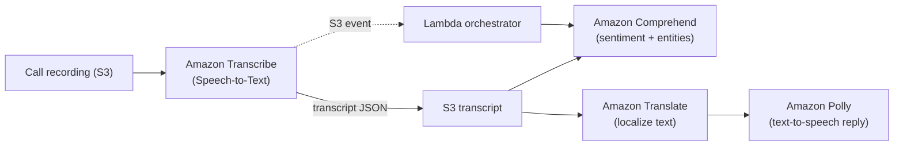

# Amazon Transcribe - SAA-C03 Deep Dive

> **Amazon Transcribe** is AWS's fully-managed **Speech-to-Text (STT)** service: it takes spoken audio (a call recording, a meeting, a live mic stream) and turns it into accurate, time-stamped text. It is the exact **opposite of Amazon Polly** (text-to-speech). On the exam, "audio in, text out" = Transcribe.

See also: [00 - Machine Learning Overview](00%20-%20Machine%20Learning%20Overview.md) · [01 - Amazon Polly Deep Dive](01%20-%20Amazon%20Polly%20Deep%20Dive.md) · [01 - Amazon Comprehend Deep Dive](01%20-%20Amazon%20Comprehend%20Deep%20Dive.md) · [01 - Amazon Translate Deep Dive](01%20-%20Amazon%20Translate%20Deep%20Dive.md)

---

## Table of Contents

- [1. What Transcribe Is (and the Polly Mirror)](#1-what-transcribe-is-and-the-polly-mirror)
- [2. Two Operating Modes - Batch vs Streaming](#2-two-operating-modes---batch-vs-streaming)
- [3. Core Features](#3-core-features)
- [4. PII Redaction, Subtitles & Confidence](#4-pii-redaction-subtitles--confidence)
- [5. Transcribe Call Analytics](#5-transcribe-call-analytics)
- [6. Transcribe Medical](#6-transcribe-medical)
- [7. Integrations & Reference Pipelines](#7-integrations--reference-pipelines)
- [8. CLI & API Walkthrough](#8-cli--api-walkthrough)
- [9. Audio Formats, Sample Rates & Limits](#9-audio-formats-sample-rates--limits)
- [10. Pricing](#10-pricing)
- [11. Best Practices](#11-best-practices)
- [12. Key Exam Facts (SAA-C03)](#12-key-exam-facts-saa-c03)
- [Summary](#summary)

---



---

## 1. What Transcribe Is (and the Polly Mirror)

Amazon Transcribe uses an **Automatic Speech Recognition (ASR)** deep-learning model to convert audio into readable text. You never train or manage the model - you submit audio, you get back text plus metadata.

The single most important framing for SAA-C03 is the **direction**:

| Direction         | Service               | Input                          | Output                                             |
| :---------------- | :-------------------- | :----------------------------- | :------------------------------------------------- |
| **Speech → Text** | **Amazon Transcribe** | Audio (S3 file or live stream) | Text transcript (JSON, with timestamps/confidence) |
| **Text → Speech** | **Amazon Polly**      | Text                           | Audio (MP3 / OGG / PCM)                            |

If a question describes "convert a customer call / voicemail / podcast into searchable text" → Transcribe. If it describes "read this text out loud / generate an audio prompt" → Polly. They are frequently presented as distractors for each other.

What you get back is not just a string - it is a JSON document containing the full transcript, per-word **start/end timestamps**, per-word **confidence scores**, and optional **speaker labels** and **channel labels**.

[⬆ Back to top](#table-of-contents)

---

## 2. Two Operating Modes - Batch vs Streaming

Transcribe has exactly two ways to feed it audio. Choosing between them is a common exam decision.

### Batch transcription (asynchronous)

- You place the audio file in **Amazon S3**, then call **`StartTranscriptionJob`**.
- The job runs asynchronously; you poll with `GetTranscriptionJob` or react to a **CloudWatch Events / EventBridge** completion event (or an S3 output event) and trigger **Lambda**.
- Output transcript is written to an S3 bucket (a service-managed bucket or your own bucket).
- Best for **recorded** content: meeting recordings, voicemails, archived call recordings, podcasts, media libraries.

### Streaming transcription (real-time)

- You stream live audio over **HTTP/2** or **WebSocket** (also via the AWS SDKs) and receive **partial + final** transcript results back in near real-time.
- Best for **live** scenarios: live captioning, real-time agent assist in a contact center, live event subtitles.
- Lower latency, but designed for live audio rather than large archived files.

| Dimension       | Batch                                | Streaming                        |
| :-------------- | :----------------------------------- | :------------------------------- |
| Trigger         | `StartTranscriptionJob` on S3 object | Open HTTP/2 or WebSocket stream  |
| Latency         | Minutes (async job)                  | Sub-second / near real-time      |
| Source          | File in S3                           | Live audio chunks                |
| Typical use     | Recorded media, voicemail, archives  | Live captions, live agent assist |
| Result delivery | Transcript file in S3 + job status   | Streamed partial/final results   |

**Exam heuristic:** "already-recorded file in S3" → batch; "live / real-time / as the person speaks" → streaming.

[⬆ Back to top](#table-of-contents)

---

## 3. Core Features

These features apply across batch and (mostly) streaming modes:

- **Speaker diarization (speaker labels)** - identifies _who said what_ by labeling distinct speakers (`spk_0`, `spk_1`, …) in a single audio channel. Great for meeting recordings or two people on one mic.
- **Channel identification** - when speakers are on **separate audio channels** (e.g., agent on left channel, customer on right), Transcribe transcribes each channel separately and merges by timestamp. Cleaner than diarization when channels are physically separate.
- **Custom vocabulary** - a list of domain-specific words/phrases (product names, acronyms, jargon) so Transcribe recognizes them correctly. Directly raises accuracy for niche terms.
- **Vocabulary filtering** - mask, remove, or tag unwanted words (profanity filtering / word masking) in the output transcript.
- **Automatic language identification** - Transcribe can detect the spoken language automatically instead of you specifying it, and can even identify multiple languages in one file.
- **Custom language models (CLM)** - train a custom model on your own domain text data to improve accuracy for a specialized domain (legal, finance, scientific) - goes beyond simple word lists.
- **Word-level timestamps & confidence** - every word carries start/end time and a confidence value, enabling search, highlighting, and quality gating.

[⬆ Back to top](#table-of-contents)

---

## 4. PII Redaction, Subtitles & Confidence

### PII redaction

Transcribe can automatically **identify and redact personally identifiable information** (names, SSNs, credit card numbers, addresses, phone numbers, etc.) in the transcript, replacing it with `[PII]` tags. Critical for compliance when transcribing **call-center recordings** that contain customer data. This is a built-in Transcribe feature - you do **not** need a separate service to redact PII from the audio transcript (though Comprehend also offers PII detection on text).

### Subtitles / captions

For **batch** jobs on media files, Transcribe can emit subtitle files in **SRT** and **VTT** formats directly - the standard answer for "generate closed captions / subtitles for a video library."

### Timestamps & confidence

Word-level timestamps power features like clickable transcripts and caption alignment. Confidence scores let you flag low-confidence segments for human review (a common Ground Truth / human-in-the-loop pattern).

[⬆ Back to top](#table-of-contents)

---

## 5. Transcribe Call Analytics

**Transcribe Call Analytics** is a specialized API purpose-built for **contact center / customer-service call recordings**. Beyond a plain transcript it produces analytics:

- **Sentiment** (caller and agent, over the course of the call)
- **Talk-time / talk-speed / interruptions / non-talk (silence) metrics**
- **Call categorization** - rules that flag calls matching patterns (e.g., specific phrases, escalation language)
- **Issue / outcome / action-item detection** and **call summarization**
- **PII redaction** built in (audio + transcript)

It uses **channel identification** (agent vs customer channels) and is offered for both **post-call (batch)** and **real-time** call analytics. On the exam, "analyze support calls for sentiment, talk-time, and categories with minimal custom code" points to Transcribe Call Analytics rather than wiring Transcribe + Comprehend manually.

[⬆ Back to top](#table-of-contents)

---

## 6. Transcribe Medical

**Amazon Transcribe Medical** is an ASR service tuned specifically for **clinical / medical speech** (physician dictation, clinician-patient conversations, medical terminology and drug names). It is intended **only for healthcare use cases**.

- Two input types conceptually: **conversation** (clinician-patient) and **dictation** (provider dictating notes).
- HIPAA-eligible.
- Pairs naturally with **Amazon Comprehend Medical** to extract medical entities (medications, conditions, dosages) from the resulting transcript.

If a scenario mentions doctors, clinical notes, or patient encounters → Transcribe Medical (and Comprehend Medical for entity extraction).

[⬆ Back to top](#table-of-contents)

---

## 7. Integrations & Reference Pipelines

Transcribe is rarely used alone - it is the **first stage** that turns audio into text so downstream text services can work.

| Combine Transcribe with                                 | To do                                                   | Outcome                                   |
| :------------------------------------------------------ | :------------------------------------------------------ | :---------------------------------------- |
| [Amazon Comprehend](01%20-%20Amazon%20Comprehend%20Deep%20Dive.md) | Sentiment, key phrases, entities, PII on the transcript | "Transcribe then analyze sentiment" stack |
| [Amazon Translate](01%20-%20Amazon%20Translate%20Deep%20Dive.md)   | Translate the transcript into other languages           | Multilingual captions / localization      |
| [Amazon Polly](01%20-%20Amazon%20Polly%20Deep%20Dive.md)           | Speak a translated/processed text reply                 | Full speech-to-speech round trip          |
| **Amazon S3**                                           | Store input audio + output transcripts                  | Durable storage, event source             |
| **AWS Lambda**                                          | React to job completion / orchestrate                   | Serverless processing pipeline            |
| **Amazon Connect**                                      | Contact-center voice → real-time / post-call analytics  | Agent assist, call analytics              |

**Classic "Contact Lens"-style pipeline:** call recording lands in **S3** → S3 event triggers **Lambda** → Lambda starts a **Transcribe** (or Call Analytics) job → transcript stored in S3 → **Comprehend** runs sentiment/entities → optionally **Translate** for multilingual support → results indexed for search / dashboards.

[⬆ Back to top](#table-of-contents)

---

## 8. CLI & API Walkthrough

Start a **batch** transcription job from audio in S3:

```bash
aws transcribe start-transcription-job \
  --transcription-job-name "support-call-2026-06-01-001" \
  --language-code "en-US" \
  --media-format "wav" \
  --media MediaFileUri="s3://my-call-recordings/2026/06/01/call-001.wav" \
  --output-bucket-name "my-transcripts" \
  --settings ShowSpeakerLabels=true,MaxSpeakerLabels=2
```

Enable PII redaction and a custom vocabulary:

```bash
aws transcribe start-transcription-job \
  --transcription-job-name "redacted-call-001" \
  --language-code "en-US" \
  --media MediaFileUri="s3://my-call-recordings/call-001.wav" \
  --content-redaction RedactionType=PII,RedactionOutput=redacted \
  --settings VocabularyName="finance-terms"
```

Check status / fetch the result:

```bash
aws transcribe get-transcription-job \
  --transcription-job-name "support-call-2026-06-01-001"
# TranscriptionJobStatus: IN_PROGRESS | COMPLETED | FAILED
# Transcript.TranscriptFileUri points to the JSON output
```

Key API operations to recognize:

| API                                             | Purpose                             |
| :---------------------------------------------- | :---------------------------------- |
| `StartTranscriptionJob`                         | Begin a batch (async) transcription |
| `GetTranscriptionJob` / `ListTranscriptionJobs` | Poll status / enumerate jobs        |
| `StartStreamTranscription`                      | Real-time streaming (HTTP/2 SDK)    |
| `StartCallAnalyticsJob`                         | Batch Call Analytics                |
| `CreateVocabulary` / `CreateVocabularyFilter`   | Custom vocabulary / filtering       |
| `CreateLanguageModel`                           | Custom language model (CLM)         |

[⬆ Back to top](#table-of-contents)

---

## 9. Audio Formats, Sample Rates & Limits

You don't need to memorize every codec, but know the shape of the answer:

- **Supported audio formats** (batch): common ones include **WAV, MP3, MP4, FLAC, Ogg, AMR, WebM**. If a question says an exotic/unsupported container fails, the fix is to transcode to a supported format.
- **Sample rates:** Transcribe accepts a wide range; **8,000 Hz (8 kHz)** is typical for telephony audio and **16,000 Hz (16 kHz)+** for higher-quality/streaming. A mismatch between declared and actual sample rate causes a `BadRequestException`.
- **Channels:** mono or multi-channel; multi-channel enables channel identification.
- Batch jobs handle **large/long recordings** (hours of audio) well; streaming is for live audio chunks and has per-stream duration considerations rather than huge file sizes.

**Decision shortcut:** large recorded file → **batch**; live mic / real-time captions → **streaming**.

[⬆ Back to top](#table-of-contents)

---

## 10. Pricing

- Billed **per second of audio transcribed** (commonly expressed as a per-minute rate), with a small minimum per request.
- **Call Analytics**, **Transcribe Medical**, and features like **PII redaction / custom language models** are priced at **higher tiers** than standard transcription.
- **Custom vocabulary** itself is free to use; **custom language model** training/usage carries cost.
- No idle/provisioning cost - you pay only for audio processed, which makes runaway cost a function of _how much audio you send_, not standing infrastructure.

[⬆ Back to top](#table-of-contents)

---

## 11. Best Practices

- Use **channel identification** when agent and customer are on separate channels (cleaner than diarization); use **speaker diarization** only when they share one channel.
- Add a **custom vocabulary** for domain terms before reaching for a full **custom language model** - it's cheaper and often enough.
- Enable **PII content redaction** for any pipeline touching customer call recordings to stay compliant.
- For "transcribe then analyze," let **S3 events → Lambda** orchestrate Transcribe → Comprehend rather than polling synchronously.
- Prefer **Transcribe Call Analytics** over a hand-rolled Transcribe + Comprehend stack when the requirement is "sentiment + talk-time + categories with least operational effort."
- Match the **declared sample rate / format** to the actual audio to avoid `BadRequestException`.
- Use **unique job names** (e.g., include a timestamp/UUID) to avoid conflict errors.

[⬆ Back to top](#table-of-contents)

---

## 12. Key Exam Facts (SAA-C03)

- **Transcribe = Speech-to-Text; Polly = Text-to-Speech.** Opposite directions - the #1 trap.
- **Batch** = `StartTranscriptionJob` on **audio in S3**, async; **streaming** = real-time over HTTP/2 / WebSocket.
- **Subtitles/captions** for video → Transcribe outputs **SRT / VTT**.
- **"Transcribe then sentiment"** = **Transcribe + Comprehend** (Transcribe makes text, Comprehend reads sentiment).
- **Translate** the transcript for multilingual; **Polly** to voice a reply back.
- **PII redaction** is built into Transcribe (and Call Analytics) - no separate service required to redact the transcript.
- **Call Analytics** = sentiment + talk-time + categories + summarization for contact centers.
- **Transcribe Medical** is healthcare-only clinical speech.
- Fully managed, **pay per second/minute of audio**, no model training required (except optional custom language models).

[⬆ Back to top](#table-of-contents)

---

## Summary

Amazon Transcribe converts **speech to text** - the mirror image of Polly. Feed it recorded audio from **S3** via **batch** `StartTranscriptionJob`, or live audio via **streaming** (HTTP/2 / WebSocket). It enriches transcripts with **speaker labels, channel identification, custom vocabulary, language ID, timestamps, confidence, PII redaction, and SRT/VTT subtitles**. Specialized variants - **Call Analytics** (contact centers) and **Transcribe Medical** (healthcare) - add domain analytics. In real architectures it's the front door of a pipeline that hands text to **Comprehend** (sentiment), **Translate** (localization), and **Polly** (voice reply), often glued together with **S3 + Lambda + Amazon Connect**.

[⬆ Back to top](#table-of-contents)
