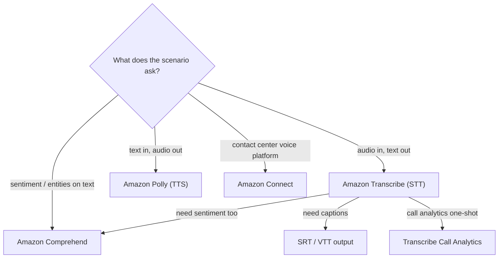

# Amazon Transcribe - Exam Scenarios & Troubleshooting

> Scenario drills and operational failure modes for **Amazon Transcribe**. Master the **Speech-to-Text direction** (vs Polly), the **Transcribe + Comprehend** sentiment stack, captions (SRT/VTT), call-center analytics, PII redaction, and the SRE-grade errors (bad format/sample rate, job-name conflicts, throttling, IAM/S3 access, cost runaway).

See also: [00 - Machine Learning Overview](00%20-%20Machine%20Learning%20Overview.md) · [01 - Amazon Transcribe Deep Dive](01%20-%20Amazon%20Transcribe%20Deep%20Dive.md) · [01 - Amazon Polly Deep Dive](01%20-%20Amazon%20Polly%20Deep%20Dive.md) · [01 - Amazon Comprehend Deep Dive](01%20-%20Amazon%20Comprehend%20Deep%20Dive.md) · [01 - Amazon Translate Deep Dive](01%20-%20Amazon%20Translate%20Deep%20Dive.md)

---

## Table of Contents

- [1. Exam-Style MCQs](#1-exam-style-mcqs)
- [2. Common Errors & Troubleshooting (SRE Perspective)](#2-common-errors--troubleshooting-sre-perspective)
- [3. Decision: Transcribe vs Polly vs Comprehend vs Connect](#3-decision-transcribe-vs-polly-vs-comprehend-vs-connect)
- [4. Rapid-Fire Recall](#4-rapid-fire-recall)
- [Summary](#summary)

---

---

## 1. Exam-Style MCQs

### Q1 - Searchable text from call recordings

A company stores thousands of customer call recordings (WAV) in S3 and wants to make them **searchable as text**, with the least operational effort.

- **A.** Stream each file through Amazon Polly
- **B.** Run a batch `StartTranscriptionJob` in Amazon Transcribe for each S3 object
- **C.** Use Amazon Comprehend to read the audio
- **D.** Use Amazon Translate on the audio files

**Answer: B**

**Explanation:** Audio files already in S3 → **batch transcription** via `StartTranscriptionJob`. Polly is text-to-speech (wrong direction). Comprehend and Translate work on **text**, not audio, so they cannot consume the recordings directly.

**Exam Tip:** "Recorded audio file already in S3" almost always = **batch Transcribe job**.

---

### Q2 - The Polly vs Transcribe direction trap

An IVR system needs to **read account balances aloud** to callers from text generated by a Lambda function. Which service?

- **A.** Amazon Transcribe
- **B.** Amazon Polly
- **C.** Amazon Comprehend
- **D.** Amazon Transcribe Medical

**Answer: B**

**Explanation:** Text → speech is **Polly**. Transcribe goes the **opposite** direction (speech → text). This pairing is the single most common distractor on ML questions.

**Exam Tip:** "Read aloud / generate audio prompt" = Polly. "Convert recording to text" = Transcribe. Memorize the arrow direction.

---

### Q3 - Transcribe then analyze sentiment

A support team wants to **transcribe** call recordings and then determine **caller sentiment** and extract **entities** from the text, using managed services.

- **A.** Transcribe only
- **B.** Comprehend only
- **C.** Transcribe to produce text, then Amazon Comprehend for sentiment and entities
- **D.** Polly then Translate

**Answer: C**

**Explanation:** Comprehend works on **text**, not audio. So you first **Transcribe** the audio to text, then feed that text to **Comprehend** for sentiment/entity analysis. This "Transcribe + Comprehend" stack is a canonical pipeline.

**Exam Tip:** Comprehend never touches audio - always put Transcribe in front of it.

---

### Q4 - Captions / subtitles for a video library

A media company must generate **closed captions** in standard subtitle formats for a large library of recorded videos. Minimal custom code.

- **A.** Transcribe batch job with SRT/VTT subtitle output
- **B.** Polly with speech marks
- **C.** Comprehend topic modeling
- **D.** Connect contact flows

**Answer: A**

**Explanation:** Transcribe **batch** transcription can emit **SRT** and **VTT** subtitle files directly - exactly the artifacts needed for captions. Polly speech marks are for TTS lip-sync/highlighting, not captioning existing media.

**Exam Tip:** "Generate subtitles/captions (SRT/VTT) for video" → Transcribe batch subtitle output.

---

### Q5 - Live captioning of an event

An online conference needs **real-time captions** displayed as speakers talk.

- **A.** Batch `StartTranscriptionJob` after the event
- **B.** Transcribe **streaming** transcription over HTTP/2 / WebSocket
- **C.** Polly streaming
- **D.** Comprehend real-time

**Answer: B**

**Explanation:** "Real-time / as they speak" = **streaming** transcription. Batch is asynchronous and only runs after a file exists in S3 - too late for live captions.

**Exam Tip:** Live/real-time = streaming; recorded file = batch.

---

### Q6 - Redact PII from call recordings

A bank must store transcripts of customer calls but must **remove personally identifiable information** (card numbers, SSNs) from the transcripts for compliance.

- **A.** Manually scrub transcripts with a Lambda regex
- **B.** Enable **content redaction (PII)** in Amazon Transcribe
- **C.** Use Polly to mask audio
- **D.** Encrypt the bucket with KMS and call it done

**Answer: B**

**Explanation:** Transcribe has **built-in PII content redaction** that detects and masks PII in the transcript automatically - no custom regex pipeline needed. KMS encryption protects the bucket but does not remove PII from the transcript content.

**Exam Tip:** "Redact PII from call transcripts" → Transcribe content redaction (Call Analytics offers it too).

---

### Q7 - Contact-center call analytics with least effort

A contact center wants **per-call sentiment, talk-time, interruptions, and category tagging** from recorded calls, with minimal engineering.

- **A.** Transcribe + Comprehend + custom aggregation Lambda
- **B.** **Transcribe Call Analytics** (`StartCallAnalyticsJob`)
- **C.** Polly + Connect
- **D.** Comprehend Call Analytics

**Answer: B**

**Explanation:** **Transcribe Call Analytics** is purpose-built for this: it returns sentiment, talk-time/interruptions, categories, summarization, and PII redaction in one managed API - less effort than wiring Transcribe + Comprehend yourself. (Option A also works but is more operational overhead; "least effort" favors B.)

**Exam Tip:** "Call sentiment + talk-time + categories, least effort" → Transcribe Call Analytics.

---

### Q8 - Improving accuracy for domain jargon

Transcripts keep mis-spelling product names and industry acronyms. Cheapest fix to improve accuracy.

- **A.** Train a custom language model
- **B.** Add a **custom vocabulary** of the product names/acronyms
- **C.** Switch to streaming mode
- **D.** Increase the sample rate

**Answer: B**

**Explanation:** A **custom vocabulary** (a word/phrase list) is the simplest, lowest-cost way to make Transcribe recognize domain terms. A **custom language model** is more powerful but more involved - reach for it only when a vocabulary isn't enough.

**Exam Tip:** Low accuracy on specific terms → custom vocabulary first; custom language model only for broad domain shifts.

---

### Q9 - Clinical speech

A hospital wants to transcribe **clinician-patient conversations** with accurate medical terminology.

- **A.** Standard Amazon Transcribe
- **B.** **Amazon Transcribe Medical**
- **C.** Amazon Polly
- **D.** Amazon Comprehend Medical

**Answer: B**

**Explanation:** **Transcribe Medical** is the ASR service tuned for clinical speech/medical terminology and is healthcare-specific. Comprehend Medical extracts entities from the **text** afterward but does not transcribe audio.

**Exam Tip:** Doctors/clinical notes/patient encounters → Transcribe Medical (+ Comprehend Medical for entities).

---

### Q10 - Separating agent and customer

A call recording has the **agent on one stereo channel and the customer on the other**, and the company wants each transcribed separately.

- **A.** Speaker diarization (speaker labels)
- **B.** **Channel identification**
- **C.** Custom vocabulary
- **D.** Vocabulary filtering

**Answer: B**

**Explanation:** When speakers are on **physically separate channels**, **channel identification** transcribes each channel and merges by timestamp - cleaner than diarization. Speaker diarization is for distinguishing speakers within a **single** channel.

**Exam Tip:** Separate channels → channel identification; same channel, multiple people → speaker diarization.

---

### Q11 - Multilingual support pipeline

After transcribing English support calls, the company wants the transcripts available in **Spanish and French**.

- **A.** Transcribe in each language separately from the same audio
- **B.** Transcribe (English) → **Amazon Translate** to Spanish/French
- **C.** Polly to Spanish
- **D.** Comprehend language detection

**Answer: B**

**Explanation:** Transcribe produces the English text; **Translate** localizes that text into other languages. You don't re-transcribe the same audio per language.

**Exam Tip:** "Make the transcript available in other languages" → Transcribe + Translate (+ optionally Polly to voice it).

---

### Q12 - Event-driven transcription pipeline

A team wants transcription to start **automatically** whenever a new recording lands in S3, with no servers.

- **A.** Poll S3 every minute from an EC2 cron
- **B.** **S3 event → Lambda → `StartTranscriptionJob`**, then EventBridge on completion → Comprehend
- **C.** Schedule a daily batch on a fleet
- **D.** Amazon Connect contact flow

**Answer: B**

**Explanation:** The serverless, event-driven pattern is **S3 event notification → Lambda → StartTranscriptionJob**, then react to job completion via **EventBridge/CloudWatch Events** to invoke downstream processing (Comprehend). No standing compute.

**Exam Tip:** "Automatically / serverless / on upload" → S3 events + Lambda orchestrating Transcribe.

[⬆ Back to top](#table-of-contents)

---

## 2. Common Errors & Troubleshooting (SRE Perspective)

| Symptom / Error                                         | Likely Cause                                                                                                             | Fix / Mitigation                                                                                                                                      |
| :------------------------------------------------------ | :----------------------------------------------------------------------------------------------------------------------- | :---------------------------------------------------------------------------------------------------------------------------------------------------- |
| `BadRequestException` on job start                      | Unsupported **audio format/codec**, or declared **sample rate / media format** doesn't match the actual file             | Transcode to a supported format (WAV/MP3/FLAC/MP4/Ogg/AMR/WebM); set correct `MediaFormat` and `MediaSampleRateHertz` (or let Transcribe auto-detect) |
| Job fails on very large / long audio                    | Exceeds **file size or audio-duration limits** for batch                                                                 | Split the recording, or use a supported large-file workflow; for live audio use **streaming** instead of forcing one huge batch file                  |
| `ConflictException` / job name already exists           | Reusing a **`TranscriptionJobName`** (must be unique per account/region)                                                 | Generate **unique job names** (append timestamp/UUID); delete or rename prior jobs                                                                    |
| `AccessDeniedException` reading audio or writing output | Transcribe's IAM role / data-access role lacks **S3 GetObject / PutObject**, or bucket policy / KMS key policy denies it | Grant the job role `s3:GetObject` on input and `s3:PutObject` on output bucket; allow the KMS key if buckets are SSE-KMS encrypted                    |
| `ThrottlingException` / `LimitExceededException`        | Too many **concurrent transcription jobs** / API rate exceeded                                                           | Implement **exponential backoff + jitter**, queue jobs (SQS), request a **service quota** increase for concurrent jobs                                |
| Transcript stuck `IN_PROGRESS` forever / never notified | Polling instead of event-driven, or missing completion handler                                                           | Use **EventBridge** rule on Transcribe job-state change → Lambda; don't tight-loop `GetTranscriptionJob`                                              |
| Low accuracy / wrong words for jargon                   | Domain terms unknown to the base model                                                                                   | Add a **custom vocabulary**; for broad domain mismatch train a **custom language model**; ensure correct **language code** (or use language ID)       |
| Speakers all merged together                            | Diarization/channel ID not enabled                                                                                       | Enable `ShowSpeakerLabels` + `MaxSpeakerLabels` (single channel) or **channel identification** (separate channels)                                    |
| PII still present in transcript                         | Content redaction not enabled                                                                                            | Set `ContentRedaction` (RedactionType=PII); use Call Analytics for combined audio+transcript redaction                                                |
| Unexpected cost runaway                                 | Processing far more audio than expected; using higher-priced tiers (Call Analytics / Medical / CLM) unnecessarily        | Set **budgets/alarms**, batch only what's needed, use standard tier unless analytics required, cache/avoid re-transcribing the same audio             |

[⬆ Back to top](#table-of-contents)

---

## 3. Decision: Transcribe vs Polly vs Comprehend vs Connect

| Service               | Direction / Job      | Input                          | Output                                                                      | Pick it when                                                                                    |
| :-------------------- | :------------------- | :----------------------------- | :-------------------------------------------------------------------------- | :---------------------------------------------------------------------------------------------- |
| **Amazon Transcribe** | **Speech → Text**    | Audio (S3 file or live stream) | Text transcript + timestamps, speaker/channel labels, SRT/VTT, PII-redacted | You have **audio** and need **text** (transcribe calls/meetings/media, captions)                |
| **Amazon Polly**      | **Text → Speech**    | Text                           | Audio (MP3/OGG/PCM)                                                         | You have **text** and need it **spoken** (IVR prompts, audio articles)                          |
| **Amazon Comprehend** | **Text → Insight**   | **Text**                       | Sentiment, entities, key phrases, language, PII, topics                     | You already have **text** and need **NLP analysis** (often _after_ Transcribe)                  |
| **Amazon Connect**    | Cloud contact center | Voice/chat interactions        | Calls routed, recorded, analyzed (integrates Transcribe/Call Analytics)     | You need a **full contact-center platform** (telephony + routing), not just a transcription API |

**Mental model:** Transcribe and Polly are inverse audio↔text converters; Comprehend is the text-understanding layer that sits **after** Transcribe; Connect is the **platform** that orchestrates the voice channel and can use all of them.

[⬆ Back to top](#table-of-contents)

---

## 4. Rapid-Fire Recall

- Audio → text = **Transcribe**; text → audio = **Polly** (opposite directions).
- Recorded file in S3 → **batch** (`StartTranscriptionJob`); live → **streaming** (HTTP/2 / WebSocket).
- Sentiment/entities on the transcript → add **Comprehend** after Transcribe.
- Subtitles → Transcribe **SRT/VTT** output.
- Sentiment + talk-time + categories, least effort → **Transcribe Call Analytics**.
- Redact PII from transcripts → Transcribe **content redaction**.
- Domain accuracy fix → **custom vocabulary** first, **custom language model** if needed.
- Separate channels → **channel identification**; same channel → **speaker diarization**.
- Healthcare speech → **Transcribe Medical**.
- Auto-start on upload → **S3 event + Lambda**; completion → **EventBridge**.
- Job-name conflicts → **unique names**; throttling → **backoff + quota increase**.

[⬆ Back to top](#table-of-contents)

---

## Summary

For SAA-C03, anchor on the **direction** (Transcribe = speech-to-text, the mirror of Polly), the **batch vs streaming** choice (S3 file vs live), and the **Transcribe → Comprehend → Translate → Polly** pipeline where Transcribe is the front door. Know that captions come out as **SRT/VTT**, **PII redaction** is built in, contact-center analytics is **Call Analytics**, and clinical audio is **Transcribe Medical**. Operationally, watch for **BadRequestException** (format/sample-rate mismatch), **unique job names**, **IAM/S3/KMS access** for the job role, **throttling/concurrent-job limits** (backoff + quotas), accuracy fixes via **custom vocabulary**, and **cost runaway** from over-processing or higher-priced tiers.

[⬆ Back to top](#table-of-contents)
