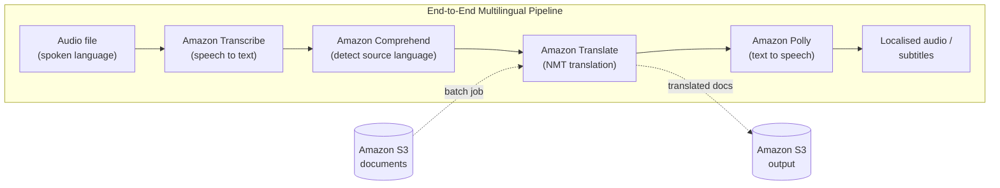

# Amazon Translate - SAA-C03 Deep Dive

> **Amazon Translate** is a fully managed **neural machine translation (NMT)** service that delivers fast, high-quality, and affordable language translation. It powers real-time and batch translation, plugs into Comprehend, Transcribe, and Polly, and is the go-to service for any "localise / translate text" SAA-C03 scenario.

See also: [00 - Machine Learning Overview](00%20-%20Machine%20Learning%20Overview.md) · [01 - Amazon Comprehend Deep Dive](01%20-%20Amazon%20Comprehend%20Deep%20Dive.md) · [01 - Amazon Transcribe Deep Dive](01%20-%20Amazon%20Transcribe%20Deep%20Dive.md) · [01 - Amazon Polly Deep Dive](01%20-%20Amazon%20Polly%20Deep%20Dive.md)

---

## Table of Contents

- [1. Amazon Translate in a Sentence](#1-amazon-translate-in-a-sentence)
- [2. Neural Machine Translation (NMT)](#2-neural-machine-translation-nmt)
- [3. Operating Modes - Real-Time vs Batch](#3-operating-modes---real-time-vs-batch)
- [4. Automatic Source Language Detection](#4-automatic-source-language-detection)
- [5. Custom Terminology](#5-custom-terminology)
- [6. Parallel Data & Active Custom Translation (ACT)](#6-parallel-data--active-custom-translation-act)
- [7. Formality & Profanity Masking](#7-formality--profanity-masking)
- [8. Document Translation (Formatted Files)](#8-document-translation-formatted-files)
- [9. Integrations - The Localisation Pipeline](#9-integrations---the-localisation-pipeline)
- [10. API & CLI Cheat Sheet](#10-api--cli-cheat-sheet)
- [11. Limits, Quotas & Pricing](#11-limits-quotas--pricing)
- [12. Best Practices](#12-best-practices)
- [13. Exam Tips (SAA-C03)](#13-exam-tips-saa-c03)
- [Summary](#summary)

---



---

## 1. Amazon Translate in a Sentence

Amazon Translate **takes text in one language and returns it in another**, using deep learning models rather than old-style phrase tables. You send text (or point it at documents in S3), optionally tell it the source and target language, and it returns natural-sounding translated text.

| Why it exists                               | What it gives you                         |
| :------------------------------------------ | :---------------------------------------- |
| Translation is hard and language-specific   | A single managed API across 75+ languages |
| Self-hosted NMT needs GPUs and ML expertise | Pay-per-character, no infrastructure      |
| Apps need to localise dynamically           | Real-time, low-latency `TranslateText`    |
| Bulk content needs translating cheaply      | Asynchronous S3 batch jobs                |

[⬆ Back to top](#table-of-contents)

---

## 2. Neural Machine Translation (NMT)

Translate uses **neural machine translation** - encoder/decoder deep learning models that consider the **full context of a sentence**, not word-by-word substitution. This produces more fluent, human-like output than legacy statistical machine translation.

Key points for the exam:

- You never train or manage the base model - it is **fully managed**.
- You can **adapt** the output to your domain (jargon, brand voice) using **Custom Terminology** and **Parallel Data**, without building or training a model yourself.
- Translate is a **language** service, alongside Comprehend (NLP/insights), Transcribe (speech to text), and Polly (text to speech).

[⬆ Back to top](#table-of-contents)

---

## 3. Operating Modes - Real-Time vs Batch

This is the single most-tested distinction. Translate offers two modes:

|             | **Real-Time**                                                       | **Asynchronous Batch**                                                   |
| :---------- | :------------------------------------------------------------------ | :----------------------------------------------------------------------- |
| API         | `TranslateText` (text), `TranslateDocument` (single formatted file) | `StartTextTranslationJob`                                                |
| Input       | Inline text / one document in the request                           | Many documents in an **S3** input prefix                                 |
| Output      | Returned synchronously in the response                              | Written to an **S3** output prefix                                       |
| Latency     | Low, interactive (chat, UI, on-the-fly)                             | Long-running, eventually-consistent job                                  |
| Size        | Small (per-request character limit)                                 | Large volumes / many files                                               |
| Auth for S3 | N/A (no S3)                                                         | Needs a **data-access IAM role** that Translate assumes to read/write S3 |
| Use case    | Live chat, website widget, dynamic app content                      | Translate a corpus of docs, manuals, knowledge base                      |

Batch jobs are managed with `StartTextTranslationJob`, `DescribeTextTranslationJob`, `ListTextTranslationJobs`, and `StopTextTranslationJob`.

> **Exam rule of thumb:** "interactive / on-the-fly / chat / per-request" = real-time `TranslateText`. "Large number of documents in S3 / nightly / bulk" = asynchronous `StartTextTranslationJob`.

[⬆ Back to top](#table-of-contents)

---

## 4. Automatic Source Language Detection

If you do not know the input language, set the source language code to **`auto`**. Translate then calls **Amazon Comprehend** under the hood to detect the dominant language before translating.

- Saves you from running a separate detect-language step.
- Note the extra dependency: the **data-access role / permissions** must allow `comprehend:DetectDominantLanguage`, and you are billed for the Comprehend language-detection call.
- You always specify a **target** language; only the source can be `auto`.

[⬆ Back to top](#table-of-contents)

---

## 5. Custom Terminology

**Custom Terminology** lets you supply a CSV/TMX glossary of source-to-target term mappings so specific words are translated exactly as you want - **brand names, product names, trademarks, abbreviations**.

- Upload with `ImportTerminology`; reference it by name in `TranslateText` / batch jobs.
- Ensures **brand consistency** (e.g. keep "Amazon" or a product name untranslated, or force a preferred rendering).
- Supports **case-sensitive** or case-insensitive matching - a common gotcha when terms "don't apply" is a case mismatch.

> **Exam signal:** "keep brand names / product names intact" or "consistent translation of company-specific terms" = **Custom Terminology**.

[⬆ Back to top](#table-of-contents)

---

## 6. Parallel Data & Active Custom Translation (ACT)

**Active Custom Translation (ACT)** adapts translation output to your domain **at request time** using **Parallel Data** - example source/target sentence pairs you provide.

| Feature                 | What it does                                       | When to use                                                             |
| :---------------------- | :------------------------------------------------- | :---------------------------------------------------------------------- |
| **Custom Terminology**  | Hard word-level overrides (glossary)               | Brand/product names, fixed terms                                        |
| **Parallel Data / ACT** | Style and domain adaptation from example sentences | Domain tone (legal, medical, marketing) without custom-training a model |

- Import parallel data with `CreateParallelData` / `UpdateParallelData`.
- ACT influences phrasing and style, not just individual words - it is broader than Custom Terminology.
- Both are **adaptation** features; you still use the managed base model.

[⬆ Back to top](#table-of-contents)

---

## 7. Formality & Profanity Masking

Two output-tuning settings passed as translation settings:

| Setting               | Effect                                                                                                                                               |
| :-------------------- | :--------------------------------------------------------------------------------------------------------------------------------------------------- |
| **Formality**         | Force **formal** or **informal** tone in supported languages (e.g. German, Spanish, French, Japanese). Useful for customer-facing vs casual content. |
| **Profanity masking** | Mask profane words/phrases in the output with a placeholder, regardless of the source.                                                               |

Both are optional request parameters and degrade gracefully where unsupported.

[⬆ Back to top](#table-of-contents)

---

## 8. Document Translation (Formatted Files)

Translate can translate **formatted documents while preserving layout/formatting**:

- **Real-time `TranslateDocument`** - translate a single document (e.g. **HTML, plain text, Word `.docx`**) and get the formatted result back, formatting preserved.
- **Batch jobs** support additional formats in S3 (e.g. HTML, plain text, Word, PowerPoint, Excel, XLIFF) across many files.

This avoids stripping documents to plain text and re-applying styling.

[⬆ Back to top](#table-of-contents)

---

## 9. Integrations - The Localisation Pipeline

Translate is rarely used alone. The classic SAA-C03 stacks:

| Combine with          | Result                                                                                      |
| :-------------------- | :------------------------------------------------------------------------------------------ |
| **Amazon S3**         | Source/destination for batch document translation jobs                                      |
| **AWS Lambda**        | Event-driven on-the-fly translation (e.g. translate on S3 upload, API Gateway chat backend) |
| **Amazon Comprehend** | Detect the source language (auto detect) before translating                                 |
| **Amazon Transcribe** | Speech to text, then translate the transcript                                               |
| **Amazon Polly**      | Translate text, then synthesise speech in the target language                               |
| **Amazon CloudWatch** | Metrics/logs/usage monitoring of Translate calls                                            |

The **Transcribe to Translate to Polly** chain is the canonical "translate spoken audio / generate localised subtitles or dubbed audio" answer (see the mermaid diagram at the top).

[⬆ Back to top](#table-of-contents)

---

## 10. API & CLI Cheat Sheet

| Action             | API / CLI                                     |
| :----------------- | :-------------------------------------------- |
| Real-time text     | `aws translate translate-text`                |
| Real-time document | `aws translate translate-document`            |
| Start batch job    | `aws translate start-text-translation-job`    |
| Check batch job    | `aws translate describe-text-translation-job` |
| Import glossary    | `aws translate import-terminology`            |
| Manage domain data | `aws translate create-parallel-data`          |

Real-time example (auto-detect source, target French):

```bash
aws translate translate-text \
  --source-language-code auto \
  --target-language-code fr \
  --text "Hello, welcome to the AWS Certified Solutions Architect exam."
```

Batch example (documents in S3, with a data-access role):

```bash
aws translate start-text-translation-job \
  --job-name my-batch-job \
  --source-language-code en \
  --target-language-codes es de \
  --input-data-config S3Uri=s3://my-bucket/input/,ContentType=text/plain \
  --output-data-config S3Uri=s3://my-bucket/output/ \
  --data-access-role-arn arn:aws:iam::123456789012:role/TranslateBatchRole
```

[⬆ Back to top](#table-of-contents)

---

## 11. Limits, Quotas & Pricing

| Aspect                 | Detail                                                                                                                                                                                                                        |
| :--------------------- | :---------------------------------------------------------------------------------------------------------------------------------------------------------------------------------------------------------------------------- |
| Real-time request size | Per-request **character limit** (UTF-8 bytes). Oversized text raises **`TextSizeLimitExceededException`** - split or move to batch.                                                                                           |
| Batch                  | Designed for large volumes; documents staged in **S3**.                                                                                                                                                                       |
| Throttling             | Per-account TPS limits; handle **`ThrottlingException`** with exponential backoff/retries.                                                                                                                                    |
| Language pairs         | 75+ languages; an unsupported pair raises **`UnsupportedLanguagePairException`**.                                                                                                                                             |
| **Pricing**            | **Per character** of input text. Auto language detection adds a small Comprehend charge per call. ACT/Custom Terminology priced per character (ACT slightly higher). Batch and real-time billed the same per-character basis. |

> **Pricing exam fact:** Amazon Translate is billed **per character of submitted text** - there is no per-request or per-document flat fee.

[⬆ Back to top](#table-of-contents)

---

## 12. Best Practices

- Use **Custom Terminology** for brand/product names to guarantee consistency across all translations.
- Use **batch `StartTextTranslationJob`** for large document volumes - cheaper to operate and avoids per-request size limits.
- **Cache** translations of repeated/static strings (e.g. UI labels) instead of re-translating on every request - reduces cost and latency.
- Scope the **data-access IAM role** tightly to the specific S3 input/output prefixes.
- Use **`auto`** detection only when needed; specify the source language when known to avoid the extra Comprehend cost.
- Monitor character volume in **CloudWatch / Cost Explorer** to catch cost runaway early.

[⬆ Back to top](#table-of-contents)

---

## 13. Exam Tips (SAA-C03)

- **Real-time `TranslateText`** = interactive/chat/UI; **batch `StartTextTranslationJob`** = many docs in S3.
- "Translate spoken audio into another language / generate dubbed audio or subtitles" = **Transcribe to Translate to Polly**.
- "Keep brand/product names consistent" = **Custom Terminology**.
- "Don't know the input language" = source `auto` (Translate uses **Comprehend** to detect).
- Batch jobs need a **data-access role** with S3 (and Comprehend for auto) permissions.
- Billing is **per character** - watch large-volume cost.
- Translate does **not** do speech (that's Polly/Transcribe) and does **not** do sentiment/entities (that's Comprehend).

[⬆ Back to top](#table-of-contents)

---

## Summary

Amazon Translate is the managed **neural machine translation** service for the SAA-C03. Remember the **real-time vs batch** split, the **Custom Terminology / Parallel Data (ACT)** adaptation features, **auto source detection via Comprehend**, the **Transcribe to Translate to Polly** localisation pipeline, the **per-character pricing**, and the need for a **data-access IAM role** on batch S3 jobs.

[⬆ Back to top](#table-of-contents)
