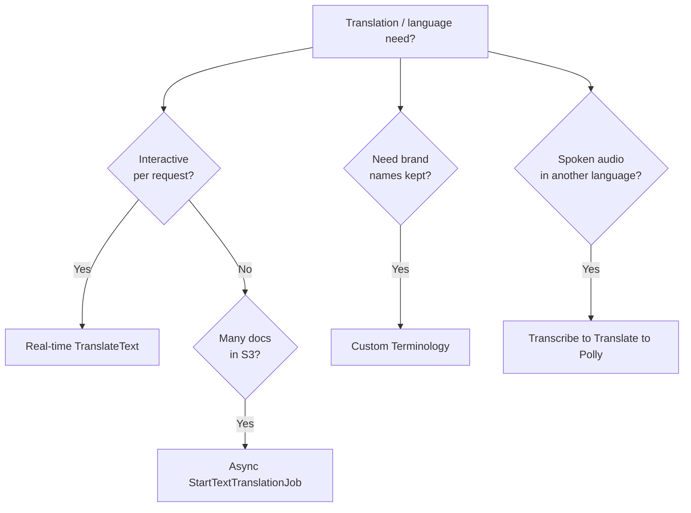

# Amazon Translate - Exam Scenarios & Troubleshooting

> Scenario-driven drills for **Amazon Translate** on the SAA-C03 - localisation pipelines, real-time vs batch selection, Custom Terminology, plus an SRE-style errors table and a "which language service?" decision matrix.

See also: [00 - Machine Learning Overview](00%20-%20Machine%20Learning%20Overview.md) · [01 - Amazon Translate Deep Dive](01%20-%20Amazon%20Translate%20Deep%20Dive.md) · [01 - Amazon Comprehend Deep Dive](01%20-%20Amazon%20Comprehend%20Deep%20Dive.md) · [01 - Amazon Transcribe Deep Dive](01%20-%20Amazon%20Transcribe%20Deep%20Dive.md) · [01 - Amazon Polly Deep Dive](01%20-%20Amazon%20Polly%20Deep%20Dive.md)

---

## Table of Contents

- [1. Exam-Style MCQs](#1-exam-style-mcqs)
- [2. Common Errors & Troubleshooting (SRE Perspective)](#2-common-errors--troubleshooting-sre-perspective)
- [3. Decision: Translate vs Comprehend vs Transcribe vs Polly](#3-decision-translate-vs-comprehend-vs-transcribe-vs-polly)
- [4. Rapid-Fire Recall](#4-rapid-fire-recall)
- [Summary](#summary)

---

---

## 1. Exam-Style MCQs

### Q1 - Website localisation, dynamic content

A SaaS company wants to display its web UI and dynamically generated content in the visitor's preferred language, on the fly, with low latency. What should they use?

- A. Batch `StartTextTranslationJob` per page load
- B. Real-time `TranslateText` from a Lambda/API backend
- C. Amazon Comprehend
- D. Amazon Polly

**Answer:** B

**Explanation:** On-the-fly, low-latency, per-request translation is the **real-time `TranslateText`** mode, typically called from Lambda/API Gateway. Batch is for bulk S3 documents. Comprehend does NLP insights, Polly does speech.

**Exam Tip:** "Dynamic / on-the-fly / per request" = real-time `TranslateText`.

---

### Q2 - Real-time chat translation

A customer-support chat app must translate messages between agents and customers instantly as they type. Which design fits?

- A. Async batch job triggered nightly
- B. Lambda calling `TranslateText` on each message
- C. Store messages and translate weekly with a batch job
- D. Amazon Transcribe

**Answer:** B

**Explanation:** Live chat requires **synchronous, low-latency** translation - `TranslateText` invoked per message. Batch jobs are asynchronous and unsuitable for interactive chat.

**Exam Tip:** Chat/messaging in real time = `TranslateText`, never a batch job.

---

### Q3 - Subtitles from recorded audio (the canonical stack)

A media company has English video recordings and wants **Spanish subtitles and a Spanish audio track**. Which fully managed pipeline achieves this?

- A. Translate to Comprehend to Polly
- B. Transcribe to Translate to Polly
- C. Polly to Translate to Transcribe
- D. Rekognition to Translate to Polly

**Answer:** B

**Explanation:** **Transcribe** converts speech to text (subtitles), **Translate** converts the transcript to Spanish, and **Polly** synthesises Spanish speech (audio track). This is the canonical localisation chain.

**Exam Tip:** "Spoken audio in language X to spoken/subtitled language Y" = **Transcribe to Translate to Polly**.

---

### Q4 - Keep brand names intact

A company finds that its product and brand names are being incorrectly translated. They need every translation to render these terms exactly as specified. What feature solves this?

- A. Formality setting
- B. Profanity masking
- C. Custom Terminology
- D. Parallel Data / ACT only

**Answer:** C

**Explanation:** **Custom Terminology** is a glossary of source-to-target term overrides - ideal for brand names, product names, and trademarks. Formality and profanity masking tune tone/content, not specific terms.

**Exam Tip:** "Brand/product names consistent or untranslated" = **Custom Terminology**.

---

### Q5 - Large document corpus

A legal firm needs to translate 50,000 contract documents stored in S3 into three languages overnight, cost-effectively. Best approach?

- A. Loop over each file calling `TranslateText`
- B. `StartTextTranslationJob` against the S3 prefix with multiple target languages
- C. Translate manually
- D. Use Comprehend

**Answer:** B

**Explanation:** **Asynchronous batch `StartTextTranslationJob`** reads documents from an S3 input prefix, supports **multiple target languages** in one job, and writes results back to S3 - far better than per-file real-time calls (which hit size/throttle limits and cost more to operate).

**Exam Tip:** Bulk documents in S3 = async `StartTextTranslationJob` with a data-access role.

---

### Q6 - Unknown source language

User-generated reviews arrive in many unknown languages and must all be translated to English. What is the simplest design?

- A. Run a separate detection step in every language manually
- B. Set source language to `auto` in Translate (uses Comprehend to detect)
- C. Reject inputs without a language tag
- D. Use Polly

**Answer:** B

**Explanation:** Setting the source to **`auto`** makes Translate call **Amazon Comprehend** internally to detect the dominant language, then translate. No separate pipeline step needed.

**Exam Tip:** "Unknown input language" = source `auto` (Comprehend under the hood; extra small charge).

---

### Q7 - Preserve document formatting

A team must translate Word `.docx` and HTML files while keeping their formatting, returned in the same request. Which API?

- A. `TranslateText`
- B. `TranslateDocument`
- C. `DetectDominantLanguage`
- D. `SynthesizeSpeech`

**Answer:** B

**Explanation:** **`TranslateDocument`** is the real-time API for a single formatted file (HTML, plain text, Word) that **preserves formatting**. `TranslateText` is plain text only; `SynthesizeSpeech` is Polly.

**Exam Tip:** Single formatted file, formatting preserved, synchronous = `TranslateDocument`.

---

### Q8 - Per-request size limit error

A developer's `TranslateText` calls fail with `TextSizeLimitExceededException` when translating long articles. Best fix?

- A. Retry with the same payload
- B. Split text below the per-request limit, or use the batch job for large content
- C. Switch to Polly
- D. Request a region change

**Answer:** B

**Explanation:** Real-time `TranslateText` has a **per-request character limit**. For long content, **chunk** it under the limit or move to **`StartTextTranslationJob`** (S3 batch), which is built for large volumes.

**Exam Tip:** `TextSizeLimitExceededException` = too big for real-time; chunk or go batch.

---

### Q9 - Batch job cannot access S3

A `StartTextTranslationJob` fails because Translate cannot read the input bucket or write output. What is missing?

- A. A VPC endpoint
- B. A data-access IAM role that Translate assumes with S3 read/write (and Comprehend if auto-detect)
- C. A KMS grant only
- D. Public bucket access

**Answer:** B

**Explanation:** Batch jobs run under a **data-access IAM role** that Translate assumes. It must grant `s3:GetObject`/`s3:ListBucket` on input and `s3:PutObject` on output (plus `comprehend:DetectDominantLanguage` if source is `auto`, and KMS permissions if buckets are encrypted).

**Exam Tip:** Batch S3 access failures = check the **data-access role** and its S3/KMS permissions.

---

### Q10 - Formal tone requirement

A government portal must produce **formal** German and Spanish translations. Which setting?

- A. Profanity masking
- B. Custom Terminology
- C. Formality = FORMAL
- D. Parallel Data

**Answer:** C

**Explanation:** The **Formality** setting forces formal (or informal) output in supported languages. It is the direct lever for tone.

**Exam Tip:** "Formal vs informal tone" = Formality setting (supported languages only).

---

### Q11 - Throttling under spike

During a traffic spike, real-time translation calls intermittently fail with `ThrottlingException`. What is the right mitigation?

- A. Ignore the errors
- B. Implement exponential backoff with retries; request a quota increase if sustained
- C. Switch the whole app to batch
- D. Disable Translate

**Answer:** B

**Explanation:** Throttling is normal under burst load. Handle `ThrottlingException` with **exponential backoff and jitter**; for sustained higher TPS, request a **service quota increase**. Caching repeated strings also reduces call volume.

**Exam Tip:** Throttling = client-side backoff/retry first, then quota increase.

---

### Q12 - Cost runaway

A static product catalogue's UI labels are re-translated by Translate on every page render, and the bill is climbing. What reduces cost most?

- A. Translate more often
- B. Cache the translated strings and reuse them instead of re-calling Translate
- C. Switch to Comprehend
- D. Add more languages

**Answer:** B

**Explanation:** Translate is billed **per character**. Static/repeated strings should be translated **once and cached**, not re-translated per request. This is the primary cost-control technique.

**Exam Tip:** Per-character pricing = cache static translations to avoid runaway cost.

[⬆ Back to top](#table-of-contents)

---

## 2. Common Errors & Troubleshooting (SRE Perspective)

| Symptom / Error                                              | Likely Cause                                                                 | Fix                                                                                                          |
| :----------------------------------------------------------- | :--------------------------------------------------------------------------- | :----------------------------------------------------------------------------------------------------------- |
| **`TextSizeLimitExceededException`**                         | Real-time payload exceeds per-request **character limit**                    | Chunk text below the limit, or use **`StartTextTranslationJob`** (S3 batch) for large content                |
| **`UnsupportedLanguagePairException`**                       | Requested source-to-target pair not supported                                | Verify both language codes are valid and the **pair** is supported; pivot via English if needed              |
| **`ThrottlingException`**                                    | Request rate exceeds account TPS                                             | **Exponential backoff + jitter** retries; cache repeated strings; request a **quota increase** if sustained  |
| **`AccessDeniedException`** on batch job (S3)                | **Data-access role** lacks S3 (or KMS) permissions                           | Grant role `s3:GetObject`/`ListBucket` on input, `s3:PutObject` on output, KMS decrypt/encrypt if encrypted  |
| Auto-detect fails / `DetectedLanguageLowConfidenceException` | Source `auto` but text too short/ambiguous, or missing Comprehend permission | Ensure `comprehend:DetectDominantLanguage` is allowed; provide an explicit source when known                 |
| **Custom Terminology not applied**                           | Glossary name not referenced, or **case sensitivity** mismatch               | Reference the terminology in the request; align term **case** (case-sensitive vs insensitive) with the input |
| Formality/profanity setting ignored                          | Feature unsupported for that target language                                 | Confirm the target language supports the setting; it degrades gracefully where unsupported                   |
| **Cost runaway**                                             | Re-translating static/repeated text; per-character billing                   | **Cache** translations; use batch for bulk; monitor character volume in CloudWatch/Cost Explorer             |
| `ValidationException` (`InvalidRequestException`)            | Bad language code, malformed input, unsupported content type                 | Validate language codes and `ContentType`; check supported document formats                                  |

[⬆ Back to top](#table-of-contents)

---

## 3. Decision: Translate vs Comprehend vs Transcribe vs Polly

| Need                                                     | Service                              | Direction        | Notes                                             |
| :------------------------------------------------------- | :----------------------------------- | :--------------- | :------------------------------------------------ |
| Convert text from one language to another                | **Amazon Translate**                 | text to text     | NMT; real-time or batch; Custom Terminology, ACT  |
| Detect language, sentiment, entities, key phrases, PII   | **Amazon Comprehend**                | text to insights | NLP analysis; also powers Translate `auto` detect |
| Convert **speech (audio) to text**                       | **Amazon Transcribe**                | speech to text   | Transcription, speaker labels, subtitles          |
| Convert **text to speech (audio)**                       | **Amazon Polly**                     | text to speech   | Lifelike voices, SSML, neural voices              |
| Spoken audio in language X to spoken audio in language Y | **Transcribe to Translate to Polly** | speech to speech | The canonical localisation/dubbing pipeline       |

> If the question is about **language pairs and translating words/documents**, the answer is **Translate**. If it's about **understanding** text, it's **Comprehend**. Audio in = **Transcribe**; audio out = **Polly**.

[⬆ Back to top](#table-of-contents)

---

## 4. Rapid-Fire Recall

- Real-time = **`TranslateText`** / `TranslateDocument`; batch = **`StartTextTranslationJob`** (S3).
- Brand names consistent = **Custom Terminology**; domain tone/style = **Parallel Data / ACT**.
- Unknown source = `auto` (uses **Comprehend**).
- Audio localisation = **Transcribe to Translate to Polly**.
- Batch needs a **data-access IAM role** for S3/KMS (and Comprehend if auto).
- Billing is **per character** - cache static strings; batch large volumes.
- Big-text error = **`TextSizeLimitExceededException`**; bad pair = **`UnsupportedLanguagePairException`**; rate = **`ThrottlingException`** + backoff.

[⬆ Back to top](#table-of-contents)

---

## Summary

For the SAA-C03, Amazon Translate scenarios reduce to a few reflexes: pick **real-time vs batch** correctly, reach for **Custom Terminology** to protect brand names, use **`auto`** detection (Comprehend) for unknown input, and chain **Transcribe to Translate to Polly** for spoken-language localisation. Operationally, know the per-request **size limit**, the **data-access role** for batch S3 jobs, **throttling backoff**, and **per-character cost control via caching**.

[⬆ Back to top](#table-of-contents)
