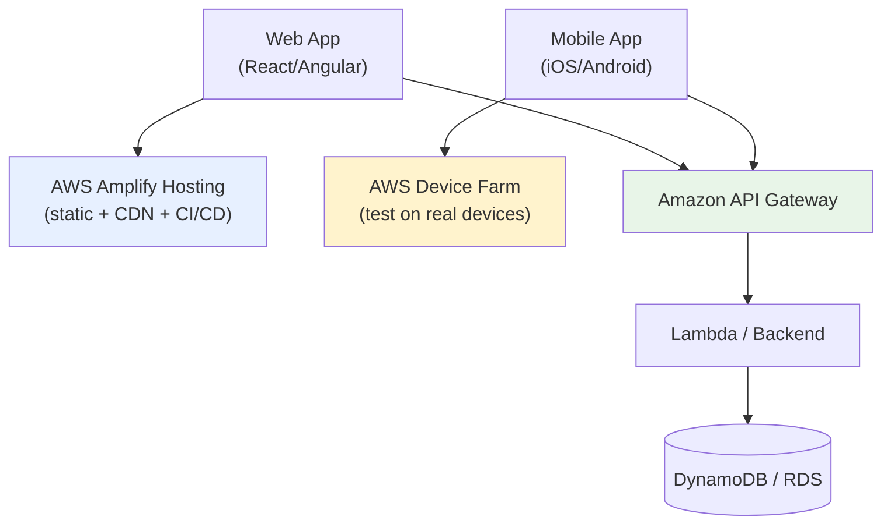
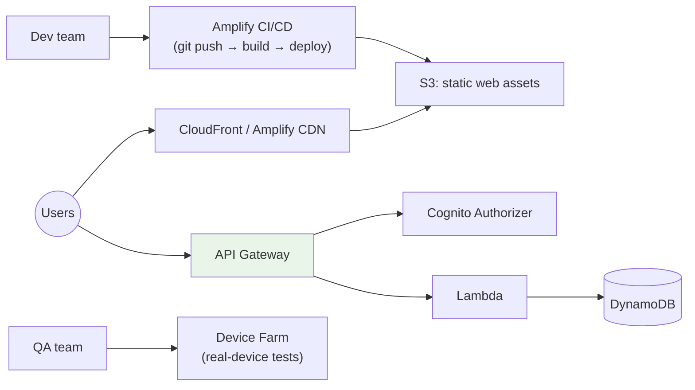
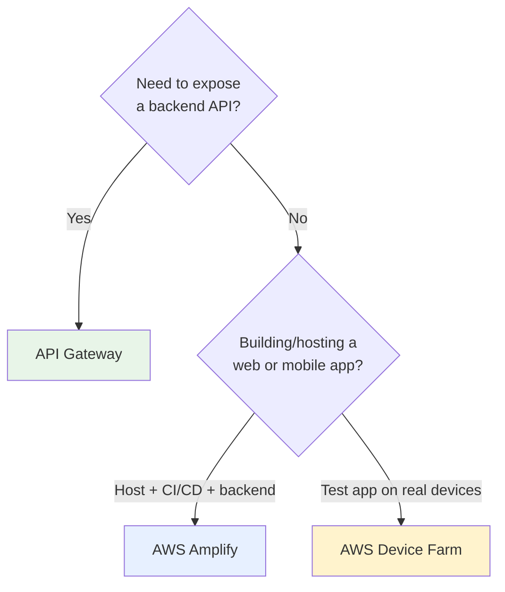

# Front-End Web & Mobile on AWS - SAA-C03 Intro & Landscape

> This category covers the services that sit between your **users' browsers/devices** and your **backend**: **Amazon API Gateway** (the managed API front door), **AWS Amplify** (full-stack web/mobile build + host + CI/CD), and **AWS Device Farm** (real-device app testing). For SAA-C03, **API Gateway is the heavyweight** - Amplify and Device Farm are recognition-level topics.

See also: [02 - Amazon API Gateway](02%20-%20Amazon%20API%20Gateway.md) · [03 - AWS Amplify](03%20-%20AWS%20Amplify.md) · [04 - AWS Device Farm](04%20-%20AWS%20Device%20Farm.md) · [02 - AWS X-Ray](02%20-%20AWS%20X-Ray.md) · [AWS Glossary](AWS%20Glossary.md)

---

## Table of Contents

- [1. What This Category Covers](#1-what-this-category-covers)
- [2. The Three Services at a Glance](#2-the-three-services-at-a-glance)
- [3. How They Fit Together (Reference Architecture)](#3-how-they-fit-together-reference-architecture)
- [4. What the Exam Tests](#4-what-the-exam-tests)
- [5. Choosing the Right Front-End Service](#5-choosing-the-right-front-end-service)
- [6. SRE Perspective](#6-sre-perspective)
- [7. Quick Self-Check](#7-quick-self-check)

---

---

## 1. What This Category Covers

A front-end (web SPA or mobile app) needs three things from the cloud:

1. **A way to talk to the backend** over HTTP/WebSocket - securely, with auth, throttling, and scaling. → **Amazon API Gateway**.
2. **A place to build, host, and continuously deploy** the app and its backend resources. → **AWS Amplify**.
3. **A way to verify the app works on real hardware** before shipping to the store. → **AWS Device Farm**.

These are the "edge of the system" services - they face the user directly, so **availability, latency, security, and scaling** dominate the design conversation.

[⬆ Back to top](#table-of-contents)

---

## 2. The Three Services at a Glance

| Service                | One-Line Job                                                                            | Exam Weight |
| :--------------------- | :-------------------------------------------------------------------------------------- | :---------- |
| **Amazon API Gateway** | Fully managed front door for REST/HTTP/WebSocket APIs; auth, throttle, cache, transform | ⭐⭐⭐ High |
| **AWS Amplify**        | Full-stack framework: host web apps + CI/CD + backend (auth, data, storage)             | ⭐⭐ Medium |
| **AWS Device Farm**    | Test & interact with web/mobile apps on **real physical devices** in the cloud          | ⭐ Low      |

> **Where your study time goes:** ~70% API Gateway, ~20% Amplify, ~10% Device Farm. API Gateway shows up in serverless, security, and resilience questions across the whole exam.

[⬆ Back to top](#table-of-contents)

---

## 3. How They Fit Together (Reference Architecture)

A typical serverless web + mobile stack:

- **Amplify** hosts the static front-end and can provision the backend.
- **API Gateway** is the secure, scalable entry to backend logic (often Lambda).
- **Cognito** (from [02-IAM-Security](02-IAM-Security.md)) typically handles user auth, plugged into API Gateway.
- **Device Farm** validates the mobile build before release.

[⬆ Back to top](#table-of-contents)

---

## 4. What the Exam Tests

| Question Signal                                                          | Service                              |
| :----------------------------------------------------------------------- | :----------------------------------- |
| "Expose a Lambda/backend as a secure, throttled, scalable REST/HTTP API" | **API Gateway**                      |
| "Real-time bidirectional messaging (chat, live feed)"                    | **API Gateway WebSocket API**        |
| "Cache API responses / protect backend from spikes"                      | **API Gateway caching + throttling** |
| "Authenticate API callers with JWT / Cognito / custom logic"             | **API Gateway authorizers**          |
| "Host a React/Angular SPA with CI/CD from Git, globally cached"          | **Amplify Hosting**                  |
| "Rapidly build a full-stack app with auth + GraphQL data + storage"      | **Amplify (Gen 2 / libraries)**      |
| "Test our mobile app on hundreds of real Android/iOS devices"            | **Device Farm**                      |

[⬆ Back to top](#table-of-contents)

---

## 5. Choosing the Right Front-End Service

- They are **complementary, not competing**: a real app often uses all three (Amplify to host/deploy, API Gateway as the API layer, Device Farm to test).

[⬆ Back to top](#table-of-contents)

---

## 6. SRE Perspective

- **API Gateway** is a managed, highly-available, auto-scaling layer - it absorbs traffic spikes and protects fragile backends via **throttling** and **caching** (blast-radius control).
- **Amplify** standardizes deployments (atomic, rollback-able, branch-per-environment) - reducing release risk.
- **Device Farm** shifts device-compatibility failures _left_, catching them before they become production incidents/1-star reviews.
- Pair all of these with **X-Ray** ([02 - AWS X-Ray](02%20-%20AWS%20X-Ray.md)) and **CloudWatch** for tracing and metrics across the front-end → backend path.

[⬆ Back to top](#table-of-contents)

---

## 7. Quick Self-Check

**Q1:** You must expose a Lambda function as a public REST API with usage plans, API keys, and request throttling. Which service?
_A:_ **Amazon API Gateway** (REST API).

**Q2:** A startup wants to deploy a React app from a GitHub repo with automatic builds on every push, global CDN, and preview environments per branch. Which service?
_A:_ **AWS Amplify Hosting**.

**Q3:** QA needs to run automated UI tests of an Android app across 200 real device/OS combinations. Which service?
_A:_ **AWS Device Farm**.

[⬆ Back to top](#table-of-contents)
