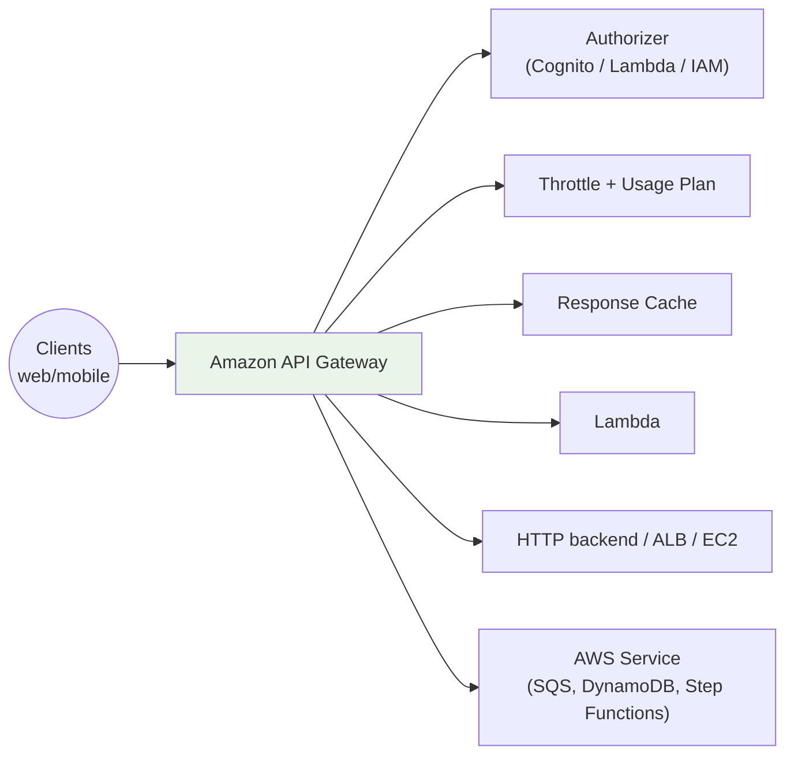
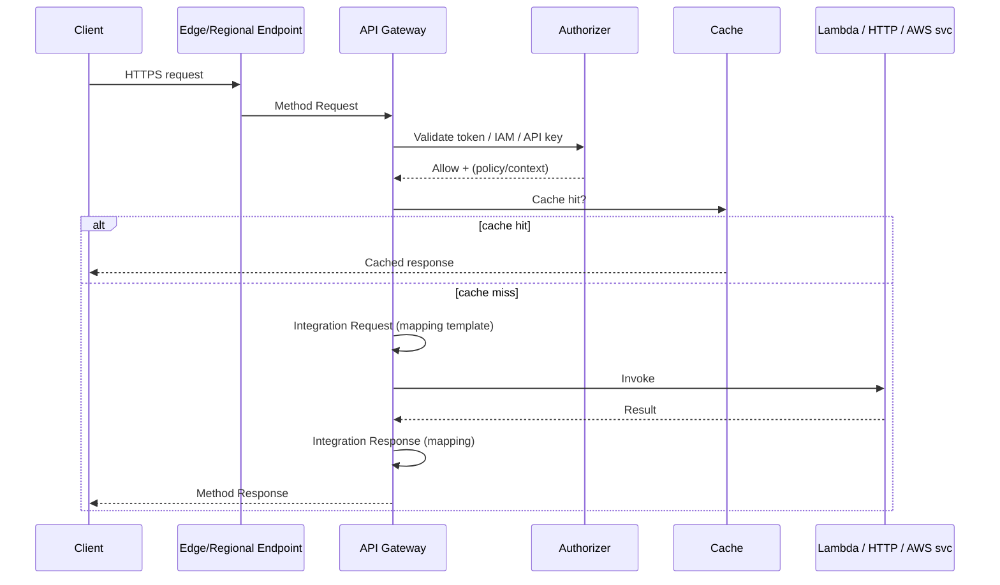
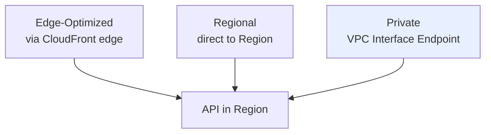
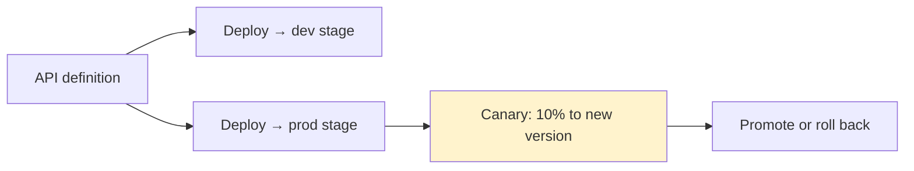
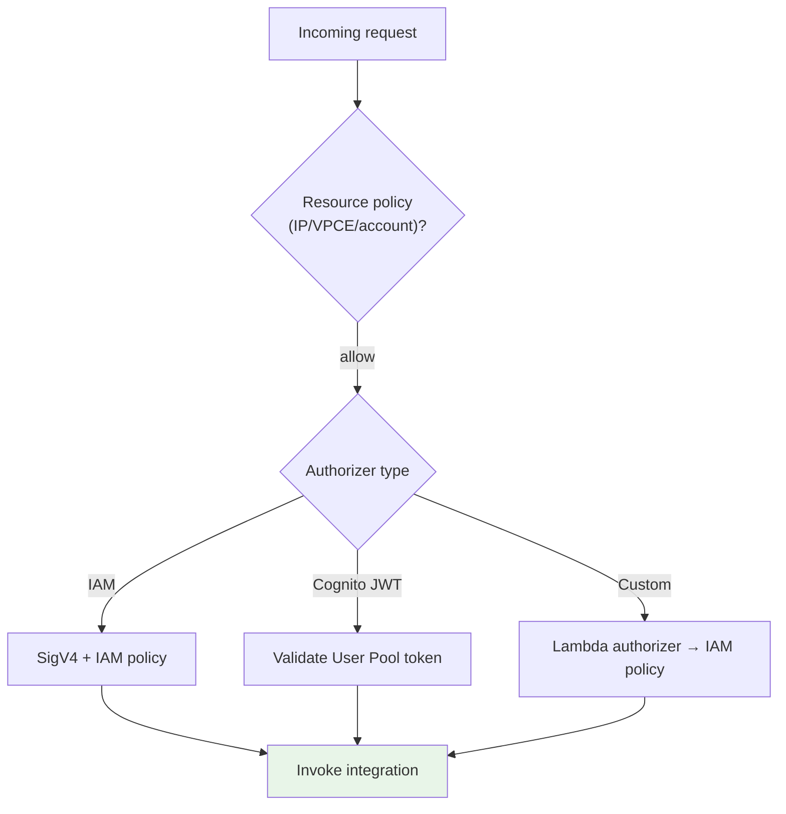
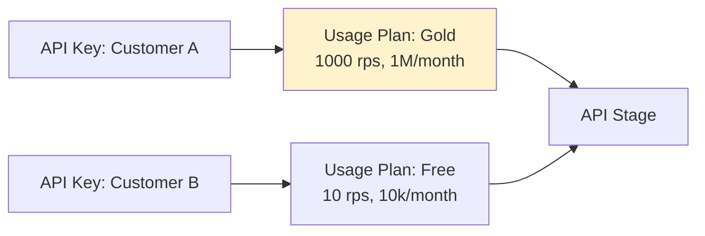
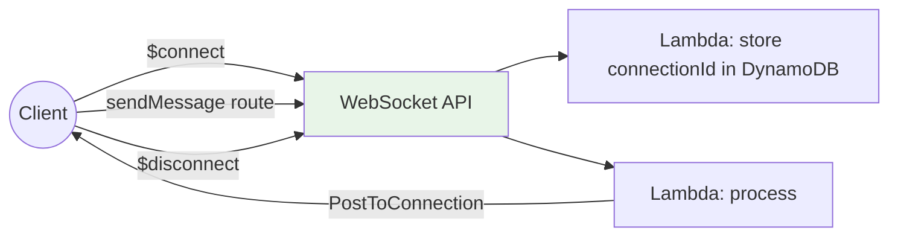

# Amazon API Gateway - SAA-C03 Deep Dive

> API Gateway is the **fully managed front door** for your APIs. It accepts HTTP/WebSocket calls from clients, then handles **authentication, authorization, throttling, caching, request/response transformation, and routing** to backends (Lambda, HTTP endpoints, or any AWS service) - all serverless and auto-scaling. It is the single most-tested service in this category and appears across the serverless, security, and resilience domains.

See also: [01 - Front-End Web & Mobile Intro](01%20-%20Front-End%20Web%20%26%20Mobile%20Intro.md) · [03 - AWS Amplify](03%20-%20AWS%20Amplify.md) · [02 - AWS X-Ray](02%20-%20AWS%20X-Ray.md) · [15 - Cognito User Pools & Identity Pools](15%20-%20Cognito%20User%20Pools%20%26%20Identity%20Pools.md) · [AWS Glossary](AWS%20Glossary.md)

---

## Table of Contents

- [1. What Is API Gateway & Why It Exists](#1-what-is-api-gateway--why-it-exists)
- [2. The Three API Types (Critical Comparison)](#2-the-three-api-types-critical-comparison)
- [3. Core Architecture & Request Lifecycle](#3-core-architecture--request-lifecycle)
- [4. Endpoint Types - Edge, Regional, Private](#4-endpoint-types---edge-regional-private)
- [5. Integration Types - Lambda, HTTP, AWS Service, Mock](#5-integration-types---lambda-http-aws-service-mock)
- [6. Stages, Deployments & Stage Variables](#6-stages-deployments--stage-variables)
- [7. Security - Authentication & Authorization](#7-security---authentication--authorization)
- [8. Throttling, Usage Plans & API Keys](#8-throttling-usage-plans--api-keys)
- [9. Caching](#9-caching)
- [10. Request/Response Mapping & Transformation](#10-requestresponse-mapping--transformation)
- [11. CORS](#11-cors)
- [12. WebSocket APIs (Real-Time)](#12-websocket-apis-real-time)
- [13. Monitoring, Logging & X-Ray](#13-monitoring-logging--x-ray)
- [14. Limits & Quotas You Must Know](#14-limits--quotas-you-must-know)
- [15. Pricing Model](#15-pricing-model)
- [16. Best Practices](#16-best-practices)
- [17. Common Errors & Troubleshooting (SRE Lens)](#17-common-errors--troubleshooting-sre-lens)
- [18. Exam Scenario Questions](#18-exam-scenario-questions)
- [19. Summary - Key Takeaways](#19-summary---key-takeaways)

---

---

## 1. What Is API Gateway & Why It Exists

Without API Gateway, exposing a Lambda function or microservice to the internet means building and operating your own API tier: TLS termination, request validation, authentication, rate limiting, throttling, caching, versioning, and scaling. **API Gateway provides all of that as a managed, serverless service** - you define resources/methods and an integration, and AWS runs the rest.

**What it does for you:**

- **Front door / reverse proxy** for one or many backends ("API facade" over microservices).
- **Security:** authN/authZ (Cognito, IAM, Lambda authorizers), API keys, WAF integration, mTLS.
- **Traffic management:** throttling, usage plans, caching.
- **Transformation:** map/validate requests and responses, change formats.
- **Scaling & HA:** automatically scales to handle traffic; multi-AZ within a Region.
- **Observability:** CloudWatch metrics/logs + X-Ray tracing.

> **Mental model:** API Gateway decouples clients from backends. Clients call a stable API; you can swap, version, throttle, or cache the backend behind it without breaking callers.

[⬆ Back to top](#table-of-contents)

---

## 2. The Three API Types (Critical Comparison)

API Gateway offers **three** API products. The exam expects you to pick the right one:

| Feature                                   | **REST API**                              | **HTTP API**                                             | **WebSocket API**                                    |
| :---------------------------------------- | :---------------------------------------- | :------------------------------------------------------- | :--------------------------------------------------- |
| **Best for**                              | Full-featured, mature REST APIs           | Simple, low-latency, **low-cost** proxies to Lambda/HTTP | **Real-time, bidirectional** (chat, live dashboards) |
| **Cost**                                  | Higher                                    | **~70% cheaper** than REST                               | Per message + connection minutes                     |
| **Latency**                               | Higher                                    | **Lower**                                                | n/a                                                  |
| **Auth**                                  | IAM, Cognito, Lambda authorizer, API keys | IAM, **JWT (Cognito/OIDC)**, Lambda authorizer           | IAM, Lambda authorizer                               |
| **API keys / usage plans**                | ✅ Yes                                    | ❌ No (native)                                           | ❌                                                   |
| **Caching**                               | ✅ Yes                                    | ❌ No                                                    | ❌                                                   |
| **Request/response transformation (VTL)** | ✅ Yes (mapping templates)                | ❌ Limited                                               | n/a                                                  |
| **Edge-optimized endpoint**               | ✅ Yes                                    | ❌ (Regional only)                                       | n/a                                                  |
| **Private endpoint (VPC)**                | ✅ Yes                                    | ✅ Yes                                                   | n/a                                                  |
| **WAF integration**                       | ✅ Yes                                    | ❌ No                                                    | ❌                                                   |
| **Request validation / models**           | ✅ Yes                                    | ❌ Limited                                               | n/a                                                  |

> **Exam decision rule:**
>
> - Need **API keys, usage plans, caching, request transformation, WAF, or edge-optimized**? → **REST API**.
> - Just need a **cheap, fast proxy to Lambda/HTTP with JWT auth**? → **HTTP API**.
> - Need **real-time two-way communication**? → **WebSocket API**.

[⬆ Back to top](#table-of-contents)

---

## 3. Core Architecture & Request Lifecycle

A REST API is structured as **Resources** (URL paths like `/orders`) with **Methods** (`GET`, `POST`) that connect to an **Integration** (the backend). Each method has a **method request → integration request → backend → integration response → method response** pipeline.

**Order of operations (high-yield):** request → **authorizer** → **throttling/usage plan check** → **cache** → integration request mapping → **backend** → integration response mapping → client.

[⬆ Back to top](#table-of-contents)

---

## 4. Endpoint Types - Edge, Regional, Private

REST APIs support three **endpoint types**:

| Endpoint Type                | Where it lives                                                                        | Use when                                                                                          |
| :--------------------------- | :------------------------------------------------------------------------------------ | :------------------------------------------------------------------------------------------------ |
| **Edge-Optimized** (default) | Requests routed via **CloudFront edge locations** to the API in its home Region       | Global clients; lowest latency for geographically distributed users                               |
| **Regional**                 | API served from the **Region** directly (no managed CloudFront)                       | Clients in the same Region; or you want **your own CloudFront** distribution in front for control |
| **Private**                  | Accessible **only from within a VPC** via an **Interface VPC Endpoint** (PrivateLink) | Internal-only APIs that must never traverse the public internet                                   |

> **Exam cues:**
>
> - "API reachable only inside the VPC / no public internet" → **Private endpoint** + Interface VPC Endpoint + a **resource policy** restricting to the VPCE.
> - "Globally distributed users, lowest latency" → **Edge-optimized**.
> - "I want my own CloudFront / WAF / custom caching in front" → **Regional**.

[⬆ Back to top](#table-of-contents)

---

## 5. Integration Types - Lambda, HTTP, AWS Service, Mock

API Gateway can route to many backend types:

| Integration                    | Description                                                                                                                                             | Notes                                                |
| :----------------------------- | :------------------------------------------------------------------------------------------------------------------------------------------------------ | :--------------------------------------------------- |
| **Lambda Proxy** (`AWS_PROXY`) | Passes the whole request to Lambda; Lambda returns the full response. **Most common.**                                                                  | Minimal config; Lambda handles mapping.              |
| **Lambda (custom)**            | Uses **mapping templates (VTL)** to transform request/response.                                                                                         | More control; used with REST APIs.                   |
| **HTTP / HTTP Proxy**          | Forwards to any HTTP(S) endpoint (ALB, EC2, on-prem, 3rd-party).                                                                                        | Good for fronting existing APIs.                     |
| **AWS Service**                | Calls an AWS service API directly (e.g., put a message to **SQS**, write to **DynamoDB**, start a **Step Functions** execution) - **no Lambda needed**. | "Direct service integration" - reduces cost/latency. |
| **Mock**                       | Returns a response without any backend.                                                                                                                 | Great for stubbing/CORS preflight.                   |

> **Powerful exam pattern:** "Accept API requests and buffer them to **SQS** without writing code/Lambda" → use API Gateway **AWS Service integration to SQS** directly. Same idea for DynamoDB, Kinesis, Step Functions, EventBridge.

For **VPC backends** (private ALB/NLB/ECS), use a **VPC Link**:

- **REST API** → VPC Link to a **Network Load Balancer (NLB)**.
- **HTTP API** → VPC Link to **ALB, NLB, or Cloud Map** services.

[⬆ Back to top](#table-of-contents)

---

## 6. Stages, Deployments & Stage Variables

- A **Deployment** is a snapshot of your API config. Changes are **not live** until you deploy.
- A **Stage** is a named, addressable environment (`dev`, `test`, `prod`) - each has its own URL, throttling, caching, and logging settings.
- **Stage Variables** are like environment variables for a stage - inject them into integrations (e.g., point `prod` at a Lambda **alias** `prod`, `dev` at `dev`), enabling one API definition across environments.
- **Canary deployments:** route a **percentage of traffic** to a new deployment within a stage, monitor, then promote - safe rollouts.

> **Exam cue:** "Use the same API for dev and prod pointing to different Lambda versions" → **Stage variables** mapped to Lambda **aliases**. "Gradually shift traffic to a new API version" → **canary deployment**.

[⬆ Back to top](#table-of-contents)

---

## 7. Security - Authentication & Authorization

API Gateway offers several access-control mechanisms - **know each trigger phrase**:

| Mechanism                                    | How it works                                                                    | Use when                                                   |
| :------------------------------------------- | :------------------------------------------------------------------------------ | :--------------------------------------------------------- |
| **IAM authorization (SigV4)**                | Caller signs request with IAM credentials; GW checks IAM policy                 | Internal service-to-service, AWS-credentialed callers      |
| **Cognito User Pools authorizer**            | Client sends a **JWT** from a Cognito User Pool; GW validates it                | User sign-in/sign-up for web/mobile apps                   |
| **Lambda authorizer** (custom/token/request) | A Lambda validates a token/header and returns an **IAM policy** + context       | Custom auth (3rd-party OAuth, custom tokens, header logic) |
| **JWT authorizer** (HTTP API only)           | Native OIDC/OAuth 2.0 JWT validation                                            | HTTP APIs with Cognito/Okta/Auth0                          |
| **Resource policy**                          | JSON policy on the API controlling **who/where** can invoke (IP, VPCE, account) | Restrict to a VPC endpoint, IP range, or specific accounts |
| **mTLS**                                     | Mutual TLS client certificate validation (custom domain)                        | B2B/regulated clients requiring client certs               |
| **API keys**                                 | Identify a caller for **usage plans** (NOT a security mechanism by itself)      | Metering/quotas, not authentication                        |

> **Key clarifications:**
>
> - **API keys are NOT authentication** - they identify callers for usage plans. Don't pick "API key" for "secure the API."
> - **Cognito User Pool** = authenticate end users; **IAM** = authenticate AWS principals; **Lambda authorizer** = custom logic.
> - **WAF** attaches to **REST APIs** (regional/edge) to filter SQLi/XSS/bad bots - the named answer for "protect API from common web exploits."

[⬆ Back to top](#table-of-contents)

---

## 8. Throttling, Usage Plans & API Keys

API Gateway protects backends from overload via throttling:

- **Account-level throttle** (default soft limit): a steady-state **rate** (requests/sec) and **burst** (token-bucket) per Region - raise via support.
- **Stage / method-level throttling:** override limits per stage or method.
- **Usage Plans + API Keys:** assign customers an **API key**, attach it to a **usage plan** that defines:
  - **Throttle** (rate + burst) per key.
  - **Quota** (e.g., 10,000 requests/day/month).
- When a client exceeds throttle limits, API Gateway returns **`429 Too Many Requests`**.

> **Exam cues:**
>
> - "Different rate limits/quotas per customer or tier" → **Usage Plans + API Keys**.
> - "Protect the backend from traffic spikes" → **throttling** (and caching).
> - Client getting **429** → throttle/quota exceeded.

[⬆ Back to top](#table-of-contents)

---

## 9. Caching

- Enabled **per stage** (REST APIs only). API Gateway caches integration responses for a configurable **TTL** (default 300s, 0-3600s).
- **Cache capacity** is provisioned (0.5 GB to 237 GB) and **billed hourly** - it is **not** in the free tier.
- Cache keys can include specific **query strings / headers / path parameters**.
- Clients can be allowed to **invalidate** the cache with the `Cache-Control: max-age=0` header (gated by an IAM permission `InvalidateCache`).

> **Exam cues:**
>
> - "Reduce number of calls to the backend / lower latency for repeated reads" → **enable API Gateway caching**.
> - "Caching is increasing cost" - remember cache capacity is **billed separately, per hour**.
> - HTTP APIs and WebSocket APIs do **not** support caching - that's a REST API feature.

[⬆ Back to top](#table-of-contents)

---

## 10. Request/Response Mapping & Transformation

REST APIs support **mapping templates** written in **VTL (Velocity Template Language)** to transform between the client's format and the backend's format:

- **Integration request mapping:** reshape the incoming request before sending to backend (e.g., wrap a REST body into the format SQS/DynamoDB expects).
- **Integration response mapping:** reshape backend output before returning to client.
- **Request validation:** define **models (JSON Schema)** to reject malformed requests **before** they reach the backend (saves Lambda invocations/cost).
- **Gateway responses:** customize error responses (e.g., 4xx/5xx bodies, CORS headers).

> **Exam cue:** "Transform SOAP/XML to JSON" or "reformat a request to match a legacy backend without changing the backend" → **mapping templates (VTL)** on a **REST API** (non-proxy integration). "Reject invalid payloads before invoking Lambda" → **request validation with models**.

[⬆ Back to top](#table-of-contents)

---

## 11. CORS

**Cross-Origin Resource Sharing (CORS)** lets a browser on `https://app.example.com` call your API on a different domain. Browsers send a **preflight `OPTIONS`** request; the API must return the right `Access-Control-Allow-*` headers.

- For REST APIs you enable CORS (adds an `OPTIONS` method, often a **Mock** integration) and set allowed origins/methods/headers.
- For HTTP APIs CORS is a simple stage-level config.

> **Exam cue:** "Browser SPA gets a CORS error calling the API" → **enable/configure CORS** on API Gateway (allowed origin/headers), and ensure the **`OPTIONS` preflight** is handled. This is a very common gotcha.

[⬆ Back to top](#table-of-contents)

---

## 12. WebSocket APIs (Real-Time)

For **bidirectional, stateful** communication (chat, multiplayer, live dashboards, trading tickers):

- The client opens a **persistent connection**; each connection has a **`connectionId`**.
- Three predefined routes: **`$connect`**, **`$disconnect`**, and **`$default`**, plus custom routes selected by a **route selection expression** on the message body.
- The backend (Lambda) pushes messages **to clients** via the **`@connections` API** (`PostToConnection`) using the `connectionId`.
- Connection state often stored in **DynamoDB**.

> **Exam cue:** "Real-time two-way / server push to clients (chat, live feed)" → **API Gateway WebSocket API** (often + Lambda + DynamoDB for connection state).

[⬆ Back to top](#table-of-contents)

---

## 13. Monitoring, Logging & X-Ray

- **CloudWatch Metrics** (per stage/method): `Count`, `Latency`, `IntegrationLatency`, **`4XXError`**, **`5XXError`**, `CacheHitCount`, `CacheMissCount`, **`ThrottleCount`**.
- **CloudWatch Logs:**
  - **Execution logs** - detailed per-request logs (errors, mapping, authorizer results).
  - **Access logs** - customizable per-request access records (who called, status, latency).
- **X-Ray:** enable **Active Tracing** on the stage to trace requests from API Gateway into Lambda and downstream - see [02 - AWS X-Ray](02%20-%20AWS%20X-Ray.md).

| Metric                                 | What it tells you                                          |
| :------------------------------------- | :--------------------------------------------------------- |
| **`Latency`**                          | Total time API Gateway took (includes integration)         |
| **`IntegrationLatency`**               | Time the **backend** took (isolate GW overhead vs backend) |
| **`4XXError`**                         | Client errors (bad request, unauthorized, throttled-429)   |
| **`5XXError`**                         | Server/integration errors                                  |
| **`CacheHitCount` / `CacheMissCount`** | Cache effectiveness                                        |

> **SRE cue:** High `Latency` but low `IntegrationLatency` → overhead in API Gateway (auth/mapping). High `IntegrationLatency` → the **backend** is slow (jump to X-Ray to find which downstream call).

[⬆ Back to top](#table-of-contents)

---

## 14. Limits & Quotas You Must Know

| Limit                   | Value                                                                | Exam relevance                                                                   |
| :---------------------- | :------------------------------------------------------------------- | :------------------------------------------------------------------------------- |
| **Integration timeout** | **29 seconds max** (default and hard cap for REST/HTTP integrations) | Long-running backends must go async (return 202, process via SQS/Step Functions) |
| **Payload size**        | **10 MB** max (request/response)                                     | Large files → upload to **S3 (pre-signed URL)** instead                          |
| **Default throttle**    | ~**10,000 rps** rate, **5,000** burst per Region (account, soft)     | Raise via support; protects backends                                             |
| **API keys**            | Identify callers; not auth                                           | For usage plans only                                                             |

> **High-yield traps:**
>
> - **29-second timeout:** a backend that may run longer must be **asynchronous** - API Gateway can't wait. Pattern: API Gateway → SQS/Step Functions → return immediately.
> - **10 MB payload:** for large uploads, hand the client an **S3 pre-signed URL** instead of routing the file through API Gateway.

[⬆ Back to top](#table-of-contents)

---

## 15. Pricing Model

- **Pay-per-request** (no upfront, no minimum). REST and HTTP APIs priced per million calls; **HTTP API is significantly cheaper than REST**.
- **WebSocket:** charged per **message** transferred + **connection minutes**.
- **Caching:** **extra hourly charge** based on provisioned cache memory (not pay-per-request, not free tier).
- **Data transfer out** charged separately.

> **Exam cue:** "Lower cost for a simple Lambda proxy API" → choose **HTTP API** over REST API.

[⬆ Back to top](#table-of-contents)

---

## 16. Best Practices

- **Pick the right API type:** HTTP API for simple/cheap proxies; REST for full features; WebSocket for real-time.
- **Authenticate properly:** Cognito for end users, IAM for AWS principals, Lambda authorizers for custom logic - **never rely on API keys as security**.
- **Protect backends:** enable **throttling** + **usage plans**; turn on **caching** for read-heavy GETs.
- **Validate requests** with models to reject junk before invoking Lambda (saves cost).
- **Use stages + stage variables** for clean dev/test/prod separation; **canary** for safe rollouts.
- **Front with WAF** (REST) for SQLi/XSS/rate-based rules; **CloudFront** for edge caching/control (Regional endpoint).
- **Go async for long work:** never block on >29s; offload to SQS/Step Functions.
- **Large payloads → S3 pre-signed URLs**, not through the API.
- **Enable access logs + X-Ray** for observability; alarm on `5XXError`, `Latency`, `ThrottleCount`.
- **Use Private endpoints + resource policies** for internal-only APIs.

[⬆ Back to top](#table-of-contents)

---

## 17. Common Errors & Troubleshooting (SRE Lens)

| Symptom / Error                          | Likely Cause                                                     | Fix                                                                          |
| :--------------------------------------- | :--------------------------------------------------------------- | :--------------------------------------------------------------------------- |
| **`429 Too Many Requests`**              | Throttle or usage-plan quota exceeded                            | Raise stage/account throttle or usage-plan limits; add caching               |
| **`504 Integration timeout`**            | Backend took **> 29s**                                           | Make the call **async** (SQS/Step Functions); optimize backend               |
| **`502 Bad Gateway`**                    | Lambda returned malformed proxy response / crashed               | Ensure Lambda returns valid `{statusCode, body, headers}`; check Lambda logs |
| **`403 Missing Authentication Token`**   | Wrong path/method (resource doesn't exist) or auth missing       | Verify resource/method exists and is deployed; check authorizer              |
| **`403` from resource policy**           | Resource policy denies caller IP/VPCE/account                    | Update resource policy to allow the source                                   |
| **CORS error in browser**                | CORS not enabled / preflight `OPTIONS` not handled               | Enable CORS; return `Access-Control-Allow-*` headers; add `OPTIONS`          |
| **Changes not taking effect**            | API not **deployed** to the stage                                | **Deploy** the API to the stage (config changes aren't live until deployed)  |
| **Lambda authorizer always denies**      | Authorizer returns wrong/Deny IAM policy or caching stale result | Fix policy document; check authorizer **result TTL** caching                 |
| **High latency, low IntegrationLatency** | API Gateway overhead (auth/mapping)                              | Simplify authorizer/mapping; cache authorizer results                        |
| **High IntegrationLatency**              | Slow backend                                                     | Use **X-Ray** to find slow downstream; optimize/cache                        |
| **Payload rejected (large file)**        | Exceeds **10 MB**                                                | Use **S3 pre-signed URL** for the upload/download                            |

> **SRE triage flow:** alarm on `5XXError`/`Latency` → check whether it's GW vs backend via `IntegrationLatency` → open **X-Ray trace** → fix the offending segment. Use **access logs** to identify which caller/route is affected.

[⬆ Back to top](#table-of-contents)

---

## 18. Exam Scenario Questions

### Q1 (API type selection)

A team needs a **cheap, low-latency** API that simply proxies requests to a Lambda function and validates **Cognito JWT** tokens. No API keys, caching, or transformation needed. Which API type?
**A:** **HTTP API** - lower cost/latency, native JWT authorizer; you don't need REST-only features.

### Q2 (Long-running backend)

An API triggers a backend job that can take **2-3 minutes**. Clients get timeouts. What's the right design?
**A:** Don't block - the integration **times out at 29s**. Have API Gateway drop the request onto **SQS** (or start a **Step Functions** execution) and **return 202 Accepted** immediately; the client polls or is notified later.

### Q3 (Per-customer limits)

A SaaS exposes an API to many customers and must enforce **different request quotas and rate limits per customer tier**. How?
**A:** **API keys + Usage Plans** (REST API) - one plan per tier with its own throttle + quota.

### Q4 (Internal-only API)

An API must be reachable **only from within the corporate VPC**, never the public internet. Which configuration?
**A:** **Private REST API** endpoint accessed via an **Interface VPC Endpoint (PrivateLink)**, with a **resource policy** restricting access to that VPCE.

### Q5 (Protect from web exploits)

Management wants to block **SQL injection and XSS** at the API edge. What do you add?
**A:** **AWS WAF** attached to the **REST API** stage (with managed rule groups).

### Q6 (Real-time)

Build a **chat application** where the server pushes messages to connected clients instantly. Which API?
**A:** **API Gateway WebSocket API** (with Lambda + DynamoDB for connection state, using `PostToConnection`).

### Q7 (No-Lambda buffering)

Requests must be **accepted and buffered to SQS** with no custom compute. How?
**A:** API Gateway **AWS Service integration directly to SQS** (no Lambda required).

### Q8 (Reduce backend load)

A read-heavy `GET` endpoint hits the backend on every call. Reduce backend load and latency.
**A:** Enable **API Gateway caching** on the stage with an appropriate TTL.

### Q9 (Large upload)

Clients need to upload **50 MB files** through the API. What do you do?
**A:** API Gateway max payload is **10 MB** - instead issue an **S3 pre-signed URL** so the client uploads directly to S3.

### Q10 (Edge vs Regional)

Users are **global** and you want lowest latency without managing your own CDN. Endpoint type?
**A:** **Edge-optimized** REST endpoint (routes via CloudFront edge locations).

[⬆ Back to top](#table-of-contents)

---

## 19. Summary - Key Takeaways

- **API Gateway = managed, serverless, auto-scaling API front door**: auth, throttle, cache, transform, route.
- **Three types:** **REST** (full features: API keys, usage plans, caching, VTL, WAF, edge), **HTTP** (cheap/fast proxy + JWT), **WebSocket** (real-time bidirectional).
- **Endpoints:** **Edge-optimized** (global via CloudFront), **Regional** (same-region / your own CDN), **Private** (VPC-only via Interface Endpoint + resource policy).
- **Integrations:** Lambda proxy, HTTP, **AWS Service (direct to SQS/DynamoDB/Step Functions - no Lambda)**, Mock; **VPC Link** for private ALB/NLB.
- **Security:** Cognito (end users), IAM (AWS principals), Lambda authorizer (custom), JWT (HTTP), resource policies, mTLS, WAF. **API keys ≠ authentication** (they're for usage plans).
- **Traffic control:** throttling + usage plans (429 on exceed); **caching** per stage (extra hourly cost).
- **Hard limits:** **29s integration timeout** (go async for longer), **10 MB payload** (use S3 pre-signed URLs).
- **Stages + stage variables + canary** for environments and safe rollouts.
- **Observe** with CloudWatch (`Latency` vs `IntegrationLatency`, `4XX/5XX`, `ThrottleCount`) + **X-Ray** tracing.

[⬆ Back to top](#table-of-contents)
