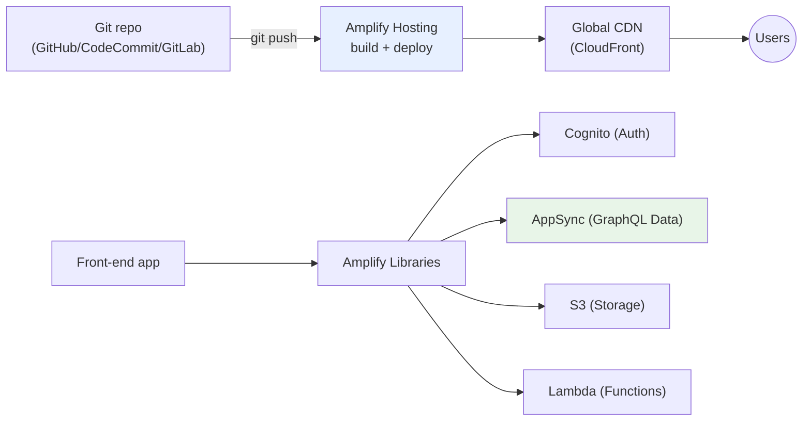
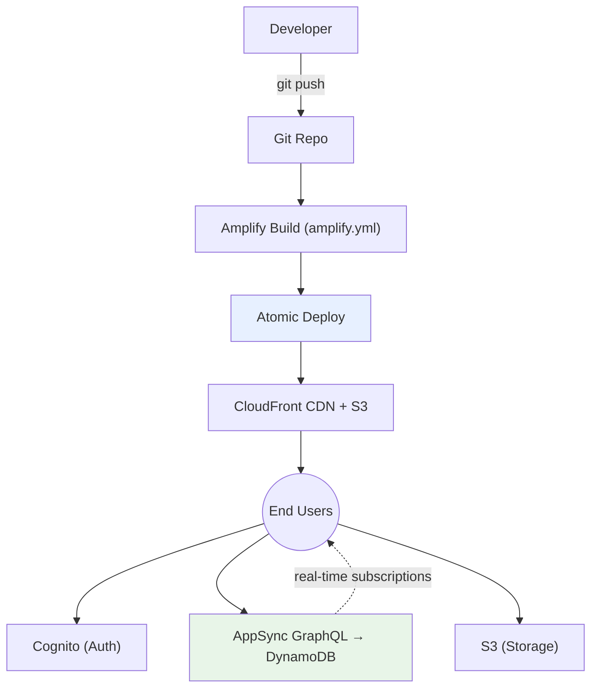
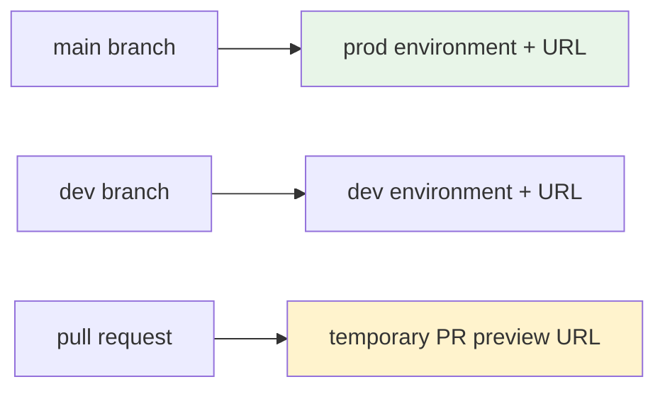

# AWS Amplify - SAA-C03 Deep Dive

> AWS Amplify is a **full-stack development platform** for web and mobile apps. It bundles **hosting** (static sites + SSR with a global CDN and Git-based CI/CD), **backend building blocks** (auth, data/GraphQL, storage, functions), and **client libraries/UI components**. For SAA-C03, recognize Amplify as the **fast path to deploy front-ends and serverless backends** without wiring every service by hand.

See also: [01 - Front-End Web & Mobile Intro](01%20-%20Front-End%20Web%20%26%20Mobile%20Intro.md) · [02 - Amazon API Gateway](02%20-%20Amazon%20API%20Gateway.md) · [04 - AWS Device Farm](04%20-%20AWS%20Device%20Farm.md) · [15 - Cognito User Pools & Identity Pools](15%20-%20Cognito%20User%20Pools%20%26%20Identity%20Pools.md) · [AWS Glossary](AWS%20Glossary.md)

---

## Table of Contents

- [1. What Is Amplify & Why It Exists](#1-what-is-amplify--why-it-exists)
- [2. The Two Halves - Hosting & Backend](#2-the-two-halves---hosting--backend)
- [3. Amplify Hosting Deep Dive](#3-amplify-hosting-deep-dive)
- [4. Amplify Backend Building Blocks](#4-amplify-backend-building-blocks)
- [5. Architecture Diagram](#5-architecture-diagram)
- [6. CI/CD, Branches & Environments](#6-cicd-branches--environments)
- [7. Amplify vs Other AWS Options](#7-amplify-vs-other-aws-options)
- [8. Security](#8-security)
- [9. Best Practices](#9-best-practices)
- [10. Common Errors & Troubleshooting (SRE Lens)](#10-common-errors--troubleshooting-sre-lens)
- [11. Pricing Model](#11-pricing-model)
- [12. Exam Scenario Questions](#12-exam-scenario-questions)
- [13. Summary - Key Takeaways](#13-summary---key-takeaways)

---

---

## 1. What Is Amplify & Why It Exists

Building a modern web/mobile app means assembling many AWS services: a CDN for the front-end, Cognito for auth, AppSync/DynamoDB for data, S3 for storage, Lambda for logic, plus a CI/CD pipeline. **Amplify wraps all of that in one opinionated, developer-friendly platform** so a small team (or a single developer) can ship a full-stack app quickly.

**Amplify is essentially three things:**

1. **Amplify Hosting** - build & host static/SSR web apps with Git-based CI/CD and a global CDN.
2. **Amplify Backend** - provision auth, data (GraphQL/REST), storage, and functions (under the hood it generates **CloudFormation** and uses Cognito, AppSync, DynamoDB, S3, Lambda, etc.).
3. **Amplify Libraries & UI Components** - client SDKs (JS, iOS, Android, Flutter, React Native) and pre-built UI (e.g., an Authenticator) to connect the front-end to that backend.

> **Mental model:** Amplify is the **"Firebase of AWS"** - an integrated layer that orchestrates underlying AWS services so you don't configure each one manually.

[⬆ Back to top](#table-of-contents)

---

## 2. The Two Halves - Hosting & Backend

| Half                | What it gives you                                                                 | Underlying services                                                                          |
| :------------------ | :-------------------------------------------------------------------------------- | :------------------------------------------------------------------------------------------- |
| **Amplify Hosting** | Static + SSR hosting, global CDN, Git CI/CD, custom domains, preview environments | **CloudFront** + **S3** + build pipeline                                                     |
| **Amplify Backend** | Auth, data/API, storage, functions provisioned from code/CLI                      | **Cognito**, **AppSync** (GraphQL), **API Gateway** (REST), **DynamoDB**, **S3**, **Lambda** |

You can use **only Hosting** (host a React app, backend elsewhere) or the **full stack**. The exam usually tests Hosting (the "deploy a web app with CI/CD" pattern).

[⬆ Back to top](#table-of-contents)

---

## 3. Amplify Hosting Deep Dive

Amplify Hosting is the most exam-relevant piece:

- **Git-based CI/CD:** Connect a repo (GitHub, GitLab, Bitbucket, CodeCommit). Every **push** triggers a build (per your `amplify.yml`) and an **atomic deploy**.
- **Global CDN:** Built on **CloudFront** - assets cached worldwide for low latency.
- **Static + SSR:** Hosts SPAs/static sites and **server-side rendered** frameworks (Next.js, Nuxt) with SSR compute.
- **Feature/branch deployments:** Each Git **branch** can map to its own environment + URL (e.g., `dev`, `staging`, `prod`).
- **Pull-request previews:** Spin up a temporary environment per PR for review.
- **Atomic deployments & instant rollback:** A deploy is all-or-nothing; you can redeploy a previous build instantly.
- **Custom domains + free managed TLS** via ACM.
- **Password protection, redirects/rewrites, custom headers** at the hosting layer.

> **Exam cue:** "Host a React/Angular/Vue SPA from a Git repo with automatic builds on each commit, global CDN, and per-branch environments" → **AWS Amplify Hosting**. (Compare: raw **S3 + CloudFront** also hosts static sites but you build the CI/CD yourself - Amplify bundles it.)

[⬆ Back to top](#table-of-contents)

---

## 4. Amplify Backend Building Blocks

When you use the backend (Amplify Gen 2 / CLI / Studio), you declaratively add capabilities that map to AWS services:

| Capability               | Backed by                  | Purpose                                          |
| :----------------------- | :------------------------- | :----------------------------------------------- |
| **Auth**                 | **Amazon Cognito**         | Sign-up/sign-in, social/SAML federation, MFA     |
| **Data / API (GraphQL)** | **AWS AppSync + DynamoDB** | Managed GraphQL API with real-time subscriptions |
| **API (REST)**           | **API Gateway + Lambda**   | REST endpoints                                   |
| **Storage**              | **Amazon S3**              | File/object storage (user uploads, media)        |
| **Functions**            | **AWS Lambda**             | Custom business logic                            |
| **Analytics**            | **Pinpoint / Kinesis**     | Usage analytics                                  |

Amplify generates and manages the **CloudFormation** stacks for these - so it's IaC under the hood, with environments you can `push`/`pull`.

> **Exam cue:** "Rapidly build a full-stack app with managed auth, a GraphQL API with real-time updates, and file storage" → **AWS Amplify** (it stitches **Cognito + AppSync/DynamoDB + S3**).

[⬆ Back to top](#table-of-contents)

---

## 5. Architecture Diagram

[⬆ Back to top](#table-of-contents)

---

## 6. CI/CD, Branches & Environments

- **Branch = environment:** map each Git branch to an isolated deployment with its own backend resources and URL.
- **PR previews:** reviewers get a live URL before merge.
- **Build settings** live in `amplify.yml` (install → build → artifacts).
- **Rollback:** redeploy any previous successful build instantly (atomic deploys make this safe).

> **Exam cue:** "Each developer branch should deploy to its own isolated environment automatically" → Amplify **branch-based deployments**.

[⬆ Back to top](#table-of-contents)

---

## 7. Amplify vs Other AWS Options

| Need                                               | Amplify                        | Alternative                                     |
| :------------------------------------------------- | :----------------------------- | :---------------------------------------------- |
| **Static web hosting + CI/CD, batteries included** | ✅ Amplify Hosting             | S3 + CloudFront + CodePipeline (more manual)    |
| **Full-stack serverless app, fast**                | ✅ Amplify (auth+data+storage) | Hand-assemble Cognito + AppSync + DynamoDB + S3 |
| **Just an API in front of Lambda**                 | ⚠️ overkill                    | **API Gateway** ([02 - Amazon API Gateway](02%20-%20Amazon%20API%20Gateway.md))   |
| **Fine-grained control / large enterprise IaC**    | ⚠️ opinionated                 | **CDK / CloudFormation / Terraform** directly   |
| **Containerized backend**                          | ❌ not its focus               | ECS/EKS/App Runner                              |

> **Exam framing:** Amplify wins when the scenario stresses **speed, developer productivity, front-end + serverless backend, built-in CI/CD**. If it stresses **fine control, containers, or complex enterprise networking**, prefer the discrete services.

[⬆ Back to top](#table-of-contents)

---

## 8. Security

- **Auth** via **Cognito User Pools/Identity Pools** - federate with social IdPs or SAML; supports MFA. See [15 - Cognito User Pools & Identity Pools](15%20-%20Cognito%20User%20Pools%20%26%20Identity%20Pools.md).
- **Fine-grained data authorization** in AppSync (owner-based, group-based rules).
- **HTTPS everywhere** with free ACM-managed certificates on custom domains.
- **IAM** governs what the Amplify backend resources can do; build roles follow least privilege.
- **Access control on hosting:** basic-auth password protection for non-prod branches.
- **Secrets/env vars** managed per branch in build settings (don't commit secrets).

[⬆ Back to top](#table-of-contents)

---

## 9. Best Practices

- **Use branch-per-environment** + PR previews to isolate dev/staging/prod.
- **Keep secrets in environment variables**, not in the repo.
- **Use Amplify Hosting for the front-end**, but consider discrete services if you need deep customization.
- **Leverage atomic deploys/rollback** to recover instantly from a bad release.
- **Pair with Cognito** for auth and **AppSync** for real-time data instead of rolling your own.
- **Add a custom domain + ACM TLS** for production.
- **Monitor builds and access** via CloudWatch; integrate alerts on failed deploys.

[⬆ Back to top](#table-of-contents)

---

## 10. Common Errors & Troubleshooting (SRE Lens)

| Symptom                                           | Likely Cause                                         | Fix                                                                          |
| :------------------------------------------------ | :--------------------------------------------------- | :--------------------------------------------------------------------------- |
| **Build fails on every push**                     | Wrong build commands / Node version in `amplify.yml` | Fix build spec; pin runtime versions; check build logs                       |
| **SPA routes 404 on refresh**                     | Missing rewrite of all paths to `index.html`         | Add a **rewrite rule** (`/<*>` → `/index.html`, 200) for client-side routing |
| **Custom domain not serving HTTPS**               | ACM cert/DNS validation incomplete                   | Complete DNS validation records; wait for cert issuance                      |
| **CORS errors calling backend API**               | API/AppSync CORS not configured                      | Configure CORS on API Gateway/AppSync; check allowed origins                 |
| **Environment variable not available at runtime** | Vars are **build-time** for static sites             | Inject at build, or fetch config at runtime via a secure endpoint            |
| **Stale content after deploy**                    | CDN cache                                            | Trigger redeploy (atomic) / invalidation; set proper cache headers           |
| **Backend `amplify push` fails**                  | CloudFormation stack drift / permissions             | Review the failed CFN events; fix IAM permissions; resolve drift             |

> **SRE note:** Treat Amplify like any CI/CD system - watch **build success rate** and **deploy frequency/rollback rate** as reliability signals, and alarm on failed builds.

[⬆ Back to top](#table-of-contents)

---

## 11. Pricing Model

- **Hosting:** charged for **build minutes**, **data stored**, and **data served** (CDN egress). Generous free tier for new accounts.
- **Backend resources:** you pay for the **underlying services** (Cognito MAUs, AppSync queries, DynamoDB, S3, Lambda) at their normal rates.
- **No separate license fee** for Amplify itself beyond hosting build/serve and the backing services.

[⬆ Back to top](#table-of-contents)

---

## 12. Exam Scenario Questions

### Q1 (Static hosting + CI/CD)

A startup wants to deploy a **React SPA** from GitHub with **automatic builds on each commit**, a **global CDN**, and **per-branch preview environments** - with minimal ops effort. Which service?
**A:** **AWS Amplify Hosting**.

### Q2 (Full-stack speed)

A small team must ship a mobile app with **user sign-in (incl. social login)**, a **real-time data API**, and **photo storage** as fast as possible. Which AWS approach?
**A:** **AWS Amplify** - it provisions **Cognito** (auth), **AppSync + DynamoDB** (real-time GraphQL data), and **S3** (storage) with client libraries.

### Q3 (Amplify vs raw S3/CloudFront)

When would you choose **Amplify Hosting** over **S3 + CloudFront** for a static site?
**A:** When you want **built-in Git CI/CD, atomic deploys/rollback, and per-branch environments** without assembling a pipeline yourself.

### Q4 (When NOT Amplify)

A large enterprise needs **fine-grained, version-controlled infrastructure** for a containerized backend with complex VPC networking. Is Amplify the right fit?
**A:** **No** - prefer **CDK/CloudFormation/Terraform** + ECS/EKS; Amplify is optimized for front-end + serverless productivity, not deep enterprise infra control.

### Q5 (SPA routing bug)

After deploying a React app to Amplify, refreshing a deep link returns **404**. Fix?
**A:** Add a **rewrite rule** sending all paths to `/index.html` (200) so the client-side router handles them.

[⬆ Back to top](#table-of-contents)

---

## 13. Summary - Key Takeaways

- **Amplify = full-stack platform** for web/mobile: **Hosting + Backend + Libraries**.
- **Hosting:** Git-based **CI/CD**, **global CDN (CloudFront)**, static + **SSR**, **branch = environment**, **PR previews**, **atomic deploy + instant rollback**, custom domains with free TLS.
- **Backend** building blocks map to real services: **Cognito** (auth), **AppSync+DynamoDB** (GraphQL/real-time), **API Gateway+Lambda** (REST/functions), **S3** (storage) - generated as **CloudFormation**.
- **Choose Amplify** for speed/productivity on front-end + serverless; **choose discrete services / IaC** for fine control, containers, or complex networking.
- It's the **"Firebase of AWS"** - integrated, opinionated, developer-first.

[⬆ Back to top](#table-of-contents)
