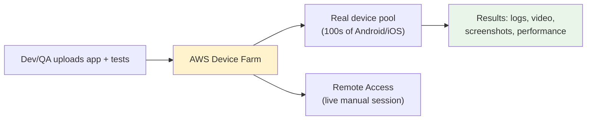
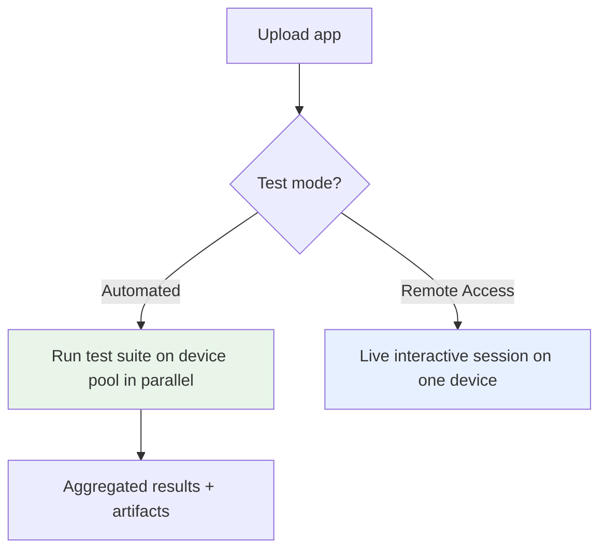
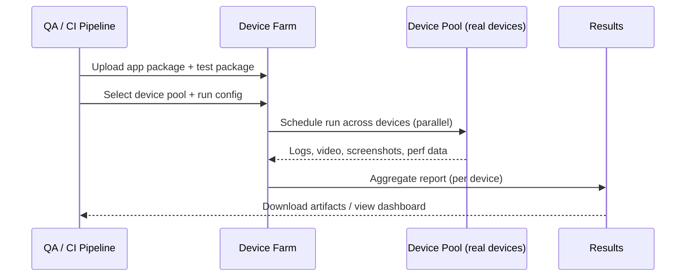
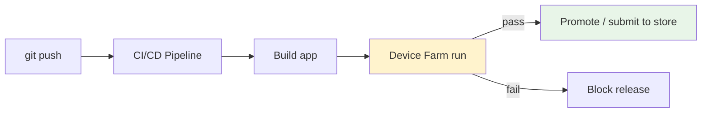

# AWS Device Farm - SAA-C03 Deep Dive

> AWS Device Farm is an **app-testing service** that runs your **web and mobile apps on real, physical devices** (hundreds of Android/iOS phones and tablets, plus desktop browsers) hosted in the AWS cloud. You can run **automated test suites** in parallel or **remotely interact** with a device in real time. For SAA-C03 it's a **recognition-level** topic: "test on real devices in the cloud" = **Device Farm**.

See also: [01 - Front-End Web & Mobile Intro](01%20-%20Front-End%20Web%20%26%20Mobile%20Intro.md) · [03 - AWS Amplify](03%20-%20AWS%20Amplify.md) · [02 - Amazon API Gateway](02%20-%20Amazon%20API%20Gateway.md) · [AWS Glossary](AWS%20Glossary.md)

---

## Table of Contents

- [1. What Is Device Farm & Why It Exists](#1-what-is-device-farm--why-it-exists)
- [2. Two Ways to Test - Automated & Remote Access](#2-two-ways-to-test---automated--remote-access)
- [3. Real Devices vs Emulators](#3-real-devices-vs-emulators)
- [4. Supported Apps & Test Frameworks](#4-supported-apps--test-frameworks)
- [5. Architecture & Workflow](#5-architecture--workflow)
- [6. Private Devices & Device Pools](#6-private-devices--device-pools)
- [7. CI/CD Integration](#7-cicd-integration)
- [8. Security](#8-security)
- [9. Best Practices](#9-best-practices)
- [10. Common Errors & Troubleshooting (SRE Lens)](#10-common-errors--troubleshooting-sre-lens)
- [11. Pricing Model](#11-pricing-model)
- [12. Exam Scenario Questions](#12-exam-scenario-questions)
- [13. Summary - Key Takeaways](#13-summary---key-takeaways)

---

---

## 1. What Is Device Farm & Why It Exists

Mobile apps must work across a **huge matrix** of device models, screen sizes, OS versions, and manufacturers. Maintaining a physical "device lab" is expensive and doesn't scale. **AWS Device Farm gives you on-demand access to real devices in AWS data centers** so you can:

- Run **automated tests in parallel** across many real device/OS combinations.
- **Manually interact** with a real device from your browser (gestures, typing, installing).
- Capture **videos, screenshots, logs, and performance data** (CPU, memory, threads) from each run.
- Reproduce **device-specific bugs** you can't see on an emulator.

> **Mental model:** Device Farm is a **cloud-hosted, on-demand physical device lab** for testing apps before release.

[⬆ Back to top](#table-of-contents)

---

## 2. Two Ways to Test - Automated & Remote Access

| Mode                            | What it does                                                                                                        | Use when                                               |
| :------------------------------ | :------------------------------------------------------------------------------------------------------------------ | :----------------------------------------------------- |
| **Automated testing**           | Upload your app + a **test suite**; Device Farm runs it across selected devices **in parallel** and returns results | CI/CD regression, broad compatibility coverage         |
| **Remote access (interactive)** | Stream a **live session** of a real device to your browser; swipe, type, install apps in real time                  | Manual exploratory testing, reproducing a reported bug |

[⬆ Back to top](#table-of-contents)

---

## 3. Real Devices vs Emulators

The **defining feature**: Device Farm uses **real, physical devices**, not emulators/simulators.

| Aspect                   | Real device (Device Farm)                | Emulator/Simulator        |
| :----------------------- | :--------------------------------------- | :------------------------ |
| **Hardware behavior**    | Accurate (sensors, GPU, radios, battery) | Approximate               |
| **Device-specific bugs** | Caught                                   | Often missed              |
| **Performance numbers**  | Real CPU/memory/thread data              | Not representative        |
| **Cost/scale**           | Pay per device-minute, AWS-managed       | Free but limited fidelity |

> **Exam cue:** Any scenario emphasizing **"real/physical devices," "hundreds of device models," or "device-specific issues"** → **AWS Device Farm**.

[⬆ Back to top](#table-of-contents)

---

## 4. Supported Apps & Test Frameworks

- **App types:** native and hybrid **Android** & **iOS** apps, plus **web apps** (tested in desktop/mobile browsers).
- **Built-in fuzz test:** a "Built-in: Fuzz" test randomly exercises the UI without writing test code.
- **Popular frameworks supported (recognition only):** Appium (Java/Python/Node/Ruby), Espresso (Android), XCUITest/XCTest (iOS), Calabash, and more.
- **Artifacts per run:** pass/fail, **video recording**, **screenshots**, **device/app logs**, and **performance metrics**.

> You don't need to memorize the framework list for the exam - just know Device Farm runs **standard automated test frameworks on real devices** and also offers a no-code fuzz test.

[⬆ Back to top](#table-of-contents)

---

## 5. Architecture & Workflow

**Project → Run → Device Pool → Results.** You organize testing into **projects**; each **run** targets a **device pool** and produces a per-device report.

[⬆ Back to top](#table-of-contents)

---

## 6. Private Devices & Device Pools

- **Device pools:** named sets of devices (by manufacturer, OS version, form factor) you target for a run - control your test matrix.
- **Private devices:** dedicated device instances **reserved exclusively for your account** (for consistent performance, special carrier/network setups, or pre-release OS testing) - billed differently from the shared public fleet.

> **Exam cue:** "We need a **dedicated/reserved device** configured to our exact specs, not the shared pool" → **Device Farm private devices**.

[⬆ Back to top](#table-of-contents)

---

## 7. CI/CD Integration

- Trigger Device Farm runs from CI/CD (CodePipeline, Jenkins, GitHub Actions) via the **AWS CLI/SDK** or plugins.
- Gate releases on test results - fail the pipeline if device tests fail.
- Fits the "shift testing left" pattern: catch device-specific regressions **before** production / app-store submission.

[⬆ Back to top](#table-of-contents)

---

## 8. Security

- **IAM** controls who can create projects/runs and access results.
- App packages and artifacts are stored in **AWS-managed storage**; devices are **wiped/reset** between sessions to protect data.
- **Private devices** add isolation for sensitive pre-release testing.
- Use **least-privilege IAM policies** for CI service roles invoking Device Farm.

[⬆ Back to top](#table-of-contents)

---

## 9. Best Practices

- **Define focused device pools** that mirror your real user base (top device/OS combos) rather than "everything."
- **Run automated suites in parallel** to cut feedback time.
- **Integrate into CI/CD** and gate releases on results.
- **Use remote access** for reproducing one-off, device-specific bug reports.
- **Capture and review artifacts** (video/logs/perf) to diagnose failures quickly.
- **Reserve private devices** only when you need dedicated/consistent hardware.

[⬆ Back to top](#table-of-contents)

---

## 10. Common Errors & Troubleshooting (SRE Lens)

| Symptom                                        | Likely Cause                                              | Fix                                                                               |
| :--------------------------------------------- | :-------------------------------------------------------- | :-------------------------------------------------------------------------------- |
| **Test run fails to start**                    | Invalid app/test package or unsupported framework version | Validate package format; match framework versions to Device Farm support          |
| **Tests pass locally but fail on Device Farm** | Real-device differences (permissions, network, timing)    | Add waits/retries; handle runtime permission prompts; test on representative pool |
| **Run times out**                              | Default per-test/run timeout exceeded                     | Increase timeout in run config; split long suites                                 |
| **No devices available in pool**               | Pool too narrow or high demand                            | Broaden the device pool or use **private devices**                                |
| **Flaky results across devices**               | Device-specific timing / resource limits                  | Inspect per-device video/logs/perf metrics to isolate                             |
| **Can't access results**                       | IAM permissions missing                                   | Grant `devicefarm:*` read actions to the role/user                                |

> **SRE framing:** Device Farm shifts compatibility failures **left** - treat failed device runs as **release-blocking signals**, reducing production incidents and bad app-store reviews (which directly hurt reliability/UX SLOs).

[⬆ Back to top](#table-of-contents)

---

## 11. Pricing Model

- **Pay-as-you-go by device-minutes** for the shared public fleet (also an **unmetered monthly** option for high-volume teams).
- **Private devices** billed at a separate monthly/dedicated rate.
- **Free trial minutes** available for new users.
- No infrastructure to manage - you only pay for testing time.

[⬆ Back to top](#table-of-contents)

---

## 12. Exam Scenario Questions

### Q1 (Core use case)

A mobile team must verify their Android app works correctly across **hundreds of real device and OS combinations** before release, with **automated tests run in parallel**. Which service?
**A:** **AWS Device Farm**.

### Q2 (Real vs emulator)

QA can't reproduce a crash that only happens on certain physical devices; emulators don't show it. What should they use?
**A:** **AWS Device Farm** - it runs on **real physical devices** (use **remote access** to reproduce interactively, or automated runs on the affected models).

### Q3 (Dedicated hardware)

A company needs a **device reserved exclusively** for them, configured with a specific OS build for pre-release testing. Which Device Farm feature?
**A:** **Private devices**.

### Q4 (CI/CD gating)

The team wants to **automatically run device tests in their pipeline** and block releases that fail. How?
**A:** Invoke **Device Farm** from CI/CD (CLI/SDK/plugin) and gate the pipeline on the run result.

### Q5 (Service disambiguation)

Which service tests apps on real devices - **Device Farm**, **Amplify**, or **API Gateway**?
**A:** **Device Farm** (Amplify = build/host/deploy; API Gateway = API front door).

[⬆ Back to top](#table-of-contents)

---

## 13. Summary - Key Takeaways

- **Device Farm = test web/mobile apps on real, physical devices** in the AWS cloud.
- **Two modes:** **automated testing** (parallel suites across a device pool) and **remote access** (live interactive session).
- **Real devices, not emulators** - catches hardware/OS-specific bugs and gives true performance data.
- Supports **Android, iOS, and web** apps with standard frameworks (Appium, Espresso, XCUITest) + a no-code **fuzz** test.
- **Device pools** target your matrix; **private devices** give dedicated/reserved hardware.
- **Integrates with CI/CD** to gate releases; **pay per device-minute** (private devices billed separately).
- Exam trigger: **"test on real/physical devices, hundreds of models"** → **Device Farm**.

[⬆ Back to top](#table-of-contents)
