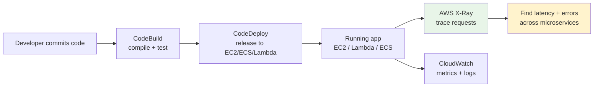
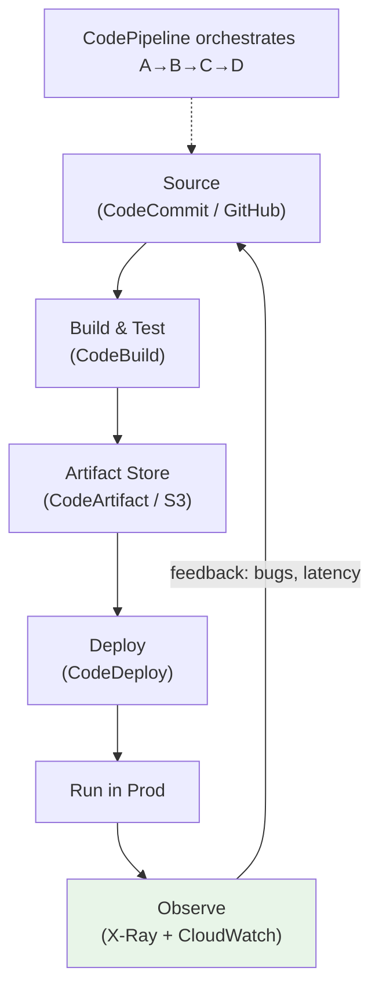
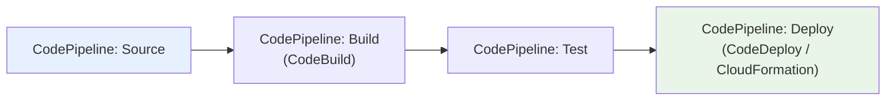

# Developer Tools on AWS - SAA-C03 Intro & Landscape

> The "Developer Tools" category covers the services you use to **build, test, observe, and ship** code on AWS. For the SAA-C03 exam the single most-tested service here is **AWS X-Ray** (distributed tracing); the CI/CD pipeline services (CodeBuild, CodeDeploy, CodePipeline, CodeArtifact) appear as supporting characters in architecture questions.

See also: [02 - AWS X-Ray](02%20-%20AWS%20X-Ray.md) · [01 - Front-End Web & Mobile Intro](01%20-%20Front-End%20Web%20%26%20Mobile%20Intro.md) · [03 - Amazon API Gateway](03%20-%20Amazon%20API%20Gateway.md) · [AWS Glossary](AWS%20Glossary.md)

---

## Table of Contents

- [1. Why This Category Exists](#1-why-this-category-exists)
- [2. The Developer Tools Family at a Glance](#2-the-developer-tools-family-at-a-glance)
- [3. Where Each Tool Fits in the SDLC](#3-where-each-tool-fits-in-the-sdlc)
- [4. What the Exam Actually Tests](#4-what-the-exam-actually-tests)
- [5. The CI/CD Pipeline Services (Supporting Cast)](#5-the-cicd-pipeline-services-supporting-cast)
- [6. Observability vs CI/CD - Don't Confuse Them](#6-observability-vs-cicd---dont-confuse-them)
- [7. SRE Perspective - Why a Solutions Architect Cares](#7-sre-perspective---why-a-solutions-architect-cares)
- [8. Quick Self-Check](#8-quick-self-check)

---

---

## 1. Why This Category Exists

Modern applications are no longer single monoliths on a single server. A request might pass through an **API Gateway**, hit a **Lambda** function, call **DynamoDB**, publish to **SNS**, and trigger another Lambda - all for one user click. When something is slow or broken, the operational question becomes: **"Which hop caused the problem?"**

The Developer Tools category answers two distinct needs:

1. **Ship code reliably** - the \*Code\*\* suite (CodeCommit, CodeBuild, CodeDeploy, CodePipeline, CodeArtifact) automates build, test, and release.
2. **Understand code in production** - **AWS X-Ray** provides distributed tracing so you can see the full journey of a request across many services.

For SAA-C03, treat this category as **"how do I observe and release a distributed system?"** rather than a pure developer concern.

[⬆ Back to top](#table-of-contents)

---

## 2. The Developer Tools Family at a Glance

| Service                                                       | One-Line Job                                                            | Exam Weight |
| :------------------------------------------------------------ | :---------------------------------------------------------------------- | :---------- |
| **AWS X-Ray**                                                 | Distributed tracing - end-to-end request maps, latency & error analysis | ⭐⭐⭐ High |
| **AWS CodeBuild**                                             | Fully managed build server (compile, test, produce artifacts)           | ⭐⭐ Medium |
| **AWS CodeDeploy**                                            | Automated deployments to EC2, ECS, Lambda, on-prem (blue/green, canary) | ⭐⭐ Medium |
| **AWS CodePipeline**                                          | Orchestrates the CI/CD workflow (source → build → deploy)               | ⭐⭐ Medium |
| **AWS CodeArtifact**                                          | Managed artifact repository (npm, Maven, PyPI, NuGet)                   | ⭐ Low      |
| **AWS CodeCommit**                                            | Managed private Git repos (now de-emphasized by AWS)                    | ⭐ Low      |
| **CloudWatch** _(Mgmt & Governance, but tightly paired here)_ | Metrics, logs, alarms, dashboards                                       | ⭐⭐⭐ High |

> **Exam reality:** You will rarely be asked to configure CodeBuild buildspec files. You **will** be asked _"a request crossing five microservices is slow - which AWS service identifies the bottleneck?"_ → **X-Ray**.

[⬆ Back to top](#table-of-contents)

---

## 3. Where Each Tool Fits in the SDLC

- **Pre-production** (left side): the \*Code\*\* suite gets a tested artifact into production safely.
- **Production** (right side): **X-Ray** and **CloudWatch** tell you whether the running system is healthy and _where_ it hurts.

[⬆ Back to top](#table-of-contents)

---

## 4. What the Exam Actually Tests

The SAA-C03 blueprint weights **"Design High-Performing"** and **"Design Resilient"** architectures heavily. Developer Tools appears through these lenses:

| Question Signal                                                           | Correct Service              |
| :------------------------------------------------------------------------ | :--------------------------- |
| "Trace a request across multiple microservices / find the slow component" | **X-Ray**                    |
| "Visualize dependencies between services as a map"                        | **X-Ray Service Map**        |
| "Identify which downstream call (DynamoDB, SNS) adds latency"             | **X-Ray**                    |
| "Automate deployment with minimal downtime / canary / blue-green"         | **CodeDeploy**               |
| "Orchestrate the full source→build→deploy flow"                           | **CodePipeline**             |
| "Centralize logs / set an alarm on a metric"                              | **CloudWatch**               |
| "Aggregate, search, and analyze logs across accounts"                     | **CloudWatch Logs Insights** |

> **Trap to avoid:** CloudWatch tells you **what** (CPU is 90%, errors spiked). X-Ray tells you **where & why** (the call to the payments service is timing out). The exam loves to contrast these.

[⬆ Back to top](#table-of-contents)

---

## 5. The CI/CD Pipeline Services (Supporting Cast)

You don't need deep configuration knowledge, but you must recognize each service's role:

- **CodeCommit** - Private Git hosting. _Note: AWS has reduced investment; new questions trend toward GitHub/GitLab as the source._
- **CodeBuild** - Spins up ephemeral build containers, runs your `buildspec.yml`, outputs artifacts. Pay-per-build-minute, no servers to manage.
- **CodeDeploy** - Pushes a release to compute targets. Supports:
  - **In-place** (rolling) deployments on EC2.
  - **Blue/Green** - launch a new fleet, shift traffic, then retire old (zero-downtime, easy rollback).
  - **Canary / Linear** - for **Lambda** and **ECS**, shift a percentage of traffic over time.
- **CodePipeline** - The conductor. Defines **stages** (Source, Build, Deploy) and **actions**; integrates with CodeBuild, CodeDeploy, CloudFormation, and third parties.
- **CodeArtifact** - Private package registry; proxies and caches public repos (npm, PyPI, Maven, NuGet) so builds are reproducible and secure.

[⬆ Back to top](#table-of-contents)

---

## 6. Observability vs CI/CD - Don't Confuse Them

A frequent point of confusion. Keep these mental buckets clean:

| Concern     | Question it answers                                                  | Service(s)                    |
| :---------- | :------------------------------------------------------------------- | :---------------------------- |
| **Tracing** | "What path did this single request take and where did it slow down?" | **X-Ray**                     |
| **Metrics** | "What is the aggregate CPU / latency / error rate over time?"        | **CloudWatch Metrics**        |
| **Logs**    | "What did the application print for this event?"                     | **CloudWatch Logs**           |
| **Release** | "How do I get new code into production safely?"                      | **CodeDeploy / CodePipeline** |

The **three pillars of observability** are _metrics, logs, traces_. AWS maps them to _CloudWatch Metrics, CloudWatch Logs, X-Ray_. (Newer **CloudWatch Application Signals** and **AWS Distro for OpenTelemetry / ADOT** unify them, but X-Ray remains the exam's named tracing service.)

[⬆ Back to top](#table-of-contents)

---

## 7. SRE Perspective - Why a Solutions Architect Cares

Even though "Developer Tools" sounds developer-only, the SRE/architect responsibilities are:

- **Mean Time To Resolution (MTTR):** Distributed tracing (X-Ray) collapses "which of 12 services is broken?" from hours to minutes.
- **Error budgets & SLOs:** X-Ray latency distributions and CloudWatch alarms feed the data behind your SLO dashboards.
- **Safe rollouts:** Canary/blue-green via CodeDeploy limits blast radius - a bad release affects 10% of traffic, not 100%.
- **Cost of observability:** Tracing isn't free. You'll **sample** (e.g., 1 request/sec + 5% of the rest) to control X-Ray cost - a recurring real-world and exam theme.

[⬆ Back to top](#table-of-contents)

---

## 8. Quick Self-Check

**Q1:** A serverless app (API Gateway → Lambda → DynamoDB → SNS) intermittently returns slow responses. The team can't tell which component is responsible. What do you recommend?
_A:_ **Enable AWS X-Ray** tracing across API Gateway, Lambda, and downstream SDK calls. The **service map** and **trace timeline** reveal the slow segment.

**Q2:** You need zero-downtime deployments to a Lambda function, shifting 10% of traffic first and watching for errors before completing. Which service and strategy?
_A:_ **CodeDeploy** with a **Canary** (or Linear) traffic-shifting deployment for Lambda, backed by a CloudWatch alarm for automatic rollback.

**Q3:** Which service answers "what was the aggregate p99 latency last hour" vs "where did _this_ request spend its time"?
_A:_ **CloudWatch** (aggregate metric) vs **X-Ray** (per-request trace). Different jobs.

[⬆ Back to top](#table-of-contents)
