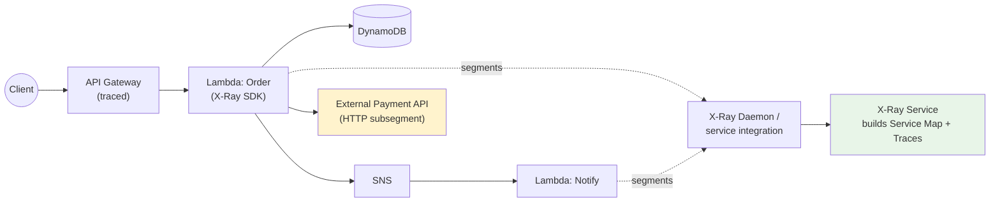
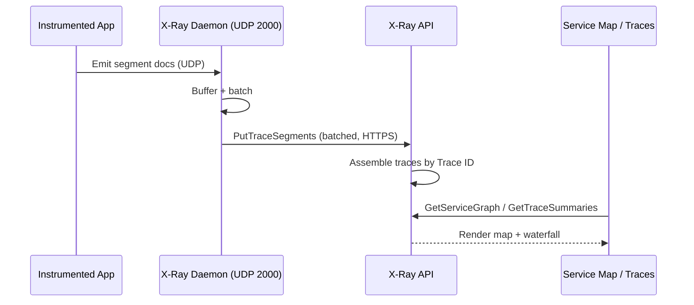
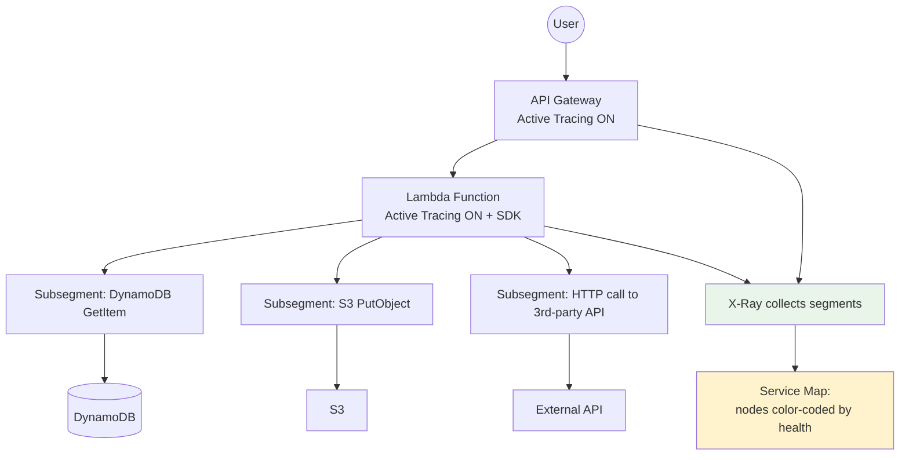
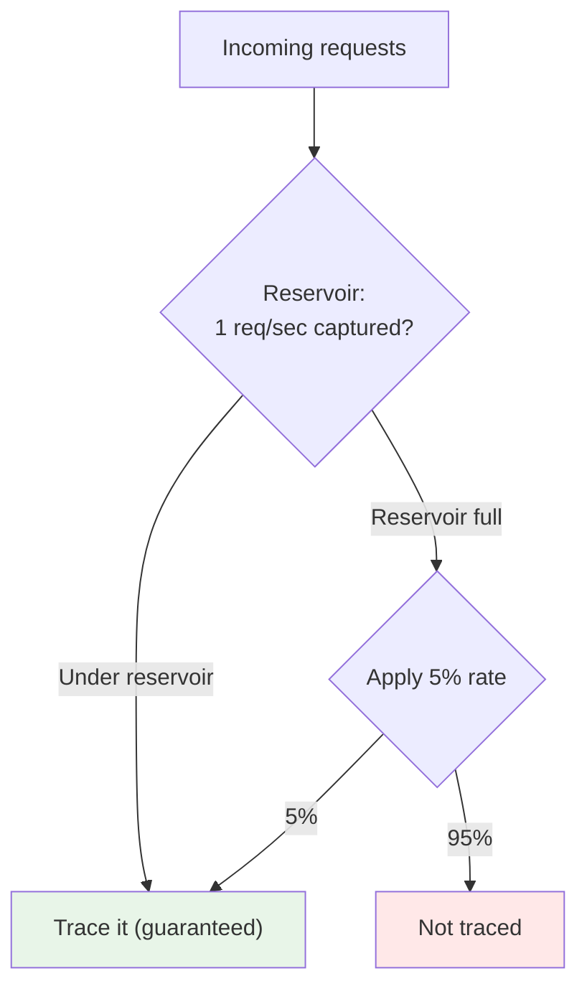

# AWS X-Ray - SAA-C03 Deep Dive

> AWS X-Ray is the **distributed tracing** service. It follows a single request as it hops across API Gateway, Lambda, EC2/ECS, and downstream calls (DynamoDB, S3, SNS, HTTP), then draws a **service map** and **trace timeline** so you can pinpoint _where_ latency or errors occur. Think: **"CloudWatch tells you something is wrong; X-Ray tells you which microservice did it."**

See also: [01 - Developer Tools Intro](01%20-%20Developer%20Tools%20Intro.md) · [03 - Amazon API Gateway](03%20-%20Amazon%20API%20Gateway.md) · [04 - AWS Device Farm](04%20-%20AWS%20Device%20Farm.md) · [AWS Glossary](AWS%20Glossary.md)

---

## Table of Contents

- [1. What Is X-Ray & The Problem It Solves](#1-what-is-x-ray--the-problem-it-solves)
- [2. Core Concepts - The X-Ray Vocabulary](#2-core-concepts---the-x-ray-vocabulary)
- [3. How X-Ray Works - The Data Path](#3-how-x-ray-works---the-data-path)
- [4. Architecture Diagram](#4-architecture-diagram)
- [5. Instrumentation - SDK, Daemon, Auto-Instrument](#5-instrumentation---sdk-daemon-auto-instrument)
- [6. Integration with AWS Services](#6-integration-with-aws-services)
- [7. Sampling - Controlling Cost & Volume](#7-sampling---controlling-cost--volume)
- [8. Annotations vs Metadata (Filtering)](#8-annotations-vs-metadata-filtering)
- [9. The Service Map & Trace Analysis](#9-the-service-map--trace-analysis)
- [10. X-Ray Insights & Groups](#10-x-ray-insights--groups)
- [11. Security - IAM & Encryption](#11-security---iam--encryption)
- [12. X-Ray vs CloudWatch vs OpenTelemetry (ADOT)](#12-x-ray-vs-cloudwatch-vs-opentelemetry-adot)
- [13. Best Practices](#13-best-practices)
- [14. Common Errors & Troubleshooting (SRE Lens)](#14-common-errors--troubleshooting-sre-lens)
- [15. Pricing Model](#15-pricing-model)
- [16. Exam Scenario Questions](#16-exam-scenario-questions)
- [17. Summary - Key Takeaways](#17-summary---key-takeaways)

---

---

## 1. What Is X-Ray & The Problem It Solves

In a monolith, a stack trace and a single log file tell you everything. In a **microservices / serverless** architecture, one user action fans out across many independent services, each with its own logs. When the request is slow or fails, the hard question is **"which hop is responsible?"**

**AWS X-Ray** solves this by collecting **traces** - the end-to-end record of a single request as it travels through your system. It then:

- Builds a **service map** (a visual graph of every component and the calls between them).
- Shows a **trace timeline** (a waterfall of how long each segment took).
- Highlights **errors (4xx), faults (5xx), and throttles** per node.
- Surfaces **latency distributions** so you can investigate outliers (p90/p99), not just averages.

> **Mental model:** X-Ray is _request-centric_ tracing. CloudWatch is _resource-centric_ metrics/logs. The exam contrasts these constantly.

[⬆ Back to top](#table-of-contents)

---

## 2. Core Concepts - The X-Ray Vocabulary

| Term                 | Definition                                                                                                  |
| :------------------- | :---------------------------------------------------------------------------------------------------------- |
| **Trace**            | The complete end-to-end path of **one request** through the system. Identified by a **Trace ID**.           |
| **Segment**          | The work done by **one service/resource** (e.g., the Lambda function). Contains timing, host, request data. |
| **Subsegment**       | A finer slice **inside a segment** - e.g., a specific DynamoDB call or HTTP call made by that service.      |
| **Trace ID**         | Unique identifier propagated across services via the `X-Amzn-Trace-Id` HTTP header.                         |
| **Sampling**         | The rule that decides **which requests** get traced (you don't trace 100% in production - too costly).      |
| **Annotation**       | **Indexed** key-value data you can **filter/search** traces by (e.g., `customer_tier = gold`).              |
| **Metadata**         | **Non-indexed** key-value data attached for context but **not searchable**.                                 |
| **Service Map**      | The visual dependency graph X-Ray builds from segments.                                                     |
| **Segment Document** | The JSON payload an instrumented app sends describing a segment.                                            |
| **X-Ray Daemon**     | A lightweight process that buffers segments and batches them to the X-Ray API (used on EC2/ECS/on-prem).    |

> **High-yield exam pair:** **Annotations are indexed and filterable; Metadata is not.** If a question says "search/filter traces by a business value," the answer is **Annotation**.

[⬆ Back to top](#table-of-contents)

---

## 3. How X-Ray Works - The Data Path

1. Your app is **instrumented** with the X-Ray SDK (or OpenTelemetry/ADOT).
2. For each traced request, the SDK creates **segments/subsegments** and sends them to the **X-Ray daemon** over **UDP port 2000** (on EC2/ECS). On **Lambda/API Gateway**, AWS manages this for you.
3. The daemon **batches** segment documents and calls the X-Ray API.
4. X-Ray stitches segments sharing a **Trace ID** into a complete trace and continuously updates the **service map**.

> **Why UDP + a daemon?** To avoid blocking the app on network I/O for telemetry. The daemon decouples your request path from the X-Ray API.

[⬆ Back to top](#table-of-contents)

---

## 4. Architecture Diagram

A typical traced serverless workload:

For **EC2/ECS** you add the **X-Ray daemon** (a sidecar container on ECS, or a process/agent on EC2). For **Lambda**, you just toggle **Active Tracing** and add the SDK for richer subsegments.

[⬆ Back to top](#table-of-contents)

---

## 5. Instrumentation - SDK, Daemon, Auto-Instrument

There are three layers of instrumentation depth:

1. **Auto / passive (AWS-managed):** Toggle **Active Tracing** on API Gateway and Lambda. AWS emits segments for the service boundary automatically - **no code change**. Good for a quick service map but limited internal detail.

2. **SDK (manual/auto patching):** Add the **AWS X-Ray SDK** to your app (Node.js, Python, Java, Go, .NET, Ruby). The SDK can **auto-instrument** AWS SDK calls, HTTP clients, and SQL queries, creating subsegments automatically. You can also create **custom subsegments** around your own logic.

3. **OpenTelemetry / ADOT:** Use the **AWS Distro for OpenTelemetry (ADOT)** Collector to emit traces to X-Ray using the vendor-neutral OTel standard - the modern, recommended path for new/multi-backend systems.

**The X-Ray daemon** is required wherever AWS doesn't manage telemetry for you:

| Compute               | How traces leave the app                                                       |
| :-------------------- | :----------------------------------------------------------------------------- |
| **Lambda**            | AWS-managed - just enable Active Tracing (+ SDK for detail). No daemon to run. |
| **API Gateway**       | AWS-managed - enable Active Tracing on the stage.                              |
| **EC2**               | Run the **X-Ray daemon** as a process/service on the instance.                 |
| **ECS / Fargate**     | Run the daemon as a **sidecar container** (or use ADOT).                       |
| **On-premises**       | Run the daemon locally with AWS credentials.                                   |
| **Elastic Beanstalk** | Built-in option to enable the daemon.                                          |

> **Exam cue:** "Trace a containerized app on ECS" → run the **X-Ray daemon as a sidecar** (or ADOT collector). "Trace a Lambda function" → just **enable Active Tracing** + add SDK; **no daemon**.

[⬆ Back to top](#table-of-contents)

---

## 6. Integration with AWS Services

X-Ray integrates natively with many services - know which ones:

| Service                          | X-Ray Behavior                                                                                                                       |
| :------------------------------- | :----------------------------------------------------------------------------------------------------------------------------------- |
| **API Gateway**                  | Enable **Active Tracing** per stage; becomes the entry node in the map.                                                              |
| **AWS Lambda**                   | Enable **Active Tracing**; AWS records the function segment; SDK adds subsegments.                                                   |
| **Elastic Beanstalk**            | Toggle the daemon in the environment config.                                                                                         |
| **ECS / EKS / Fargate**          | Daemon sidecar or ADOT collector.                                                                                                    |
| **EC2**                          | Install/run the daemon.                                                                                                              |
| **Elastic Load Balancing (ALB)** | ALB does **not** generate X-Ray segments itself, but **passes through** the trace header. _(Exam nuance: ALB is not an X-Ray node.)_ |
| **SNS / SQS**                    | **Trace context is propagated** through messages so producer and consumer traces link up.                                            |
| **DynamoDB, S3, etc.**           | Appear as **downstream subsegments** when the SDK instruments AWS SDK calls.                                                         |

> **Note:** **CloudFront** and **ALB** are _not_ directly traced by X-Ray. The trace usually **starts at API Gateway or your application tier.**

[⬆ Back to top](#table-of-contents)

---

## 7. Sampling - Controlling Cost & Volume

You almost never trace 100% of production traffic - it's expensive and unnecessary. **Sampling rules** decide which requests are recorded.

**Default reservoir + rate rule:**

- **Reservoir:** trace the **first 1 request per second** (guarantees you always capture a baseline).
- **Rate:** then trace **5% of additional requests** beyond the reservoir.

You can create **custom sampling rules** (configured centrally in the X-Ray console / API, no redeploy needed) that match by:

- **Service name**, **HTTP method**, **URL path**, **host**.
- Each rule sets its own **reservoir** (fixed number/sec) and **rate** (percentage).

> **Exam cues:**
>
> - "Reduce X-Ray cost / volume on a high-traffic service" → **adjust the sampling rule** (lower the rate / reservoir).
> - "Always capture a minimum number of traces even at low traffic" → that's the **reservoir**.
> - Sampling rules are **centralized** - changing them does **not** require an app redeploy.

[⬆ Back to top](#table-of-contents)

---

## 8. Annotations vs Metadata (Filtering)

When you add custom data to a trace, you choose between two types - and the difference is a classic exam question:

| Feature                      | **Annotation**                                                         | **Metadata**                                         |
| :--------------------------- | :--------------------------------------------------------------------- | :--------------------------------------------------- |
| **Indexed?**                 | ✅ Yes                                                                 | ❌ No                                                |
| **Searchable / filterable?** | ✅ Yes (filter expressions)                                            | ❌ No                                                |
| **Use for**                  | Business keys you want to query by (`customerId`, `tier`, `cartValue`) | Extra context/debug detail (large objects, payloads) |
| **Data types**               | String, number, boolean                                                | Any JSON                                             |

Example filter expression in the console: `annotation.tier = "gold" AND service("payments") { error }`.

> **Memory hook:** **A**nnotation = **A**ble to search. **M**etadata = **M**ore detail, not searchable.

[⬆ Back to top](#table-of-contents)

---

## 9. The Service Map & Trace Analysis

**Service Map** - a node-and-edge graph auto-built from segments:

- Each **node** is a service/resource; each **edge** is a call.
- Nodes are **color-coded**: green (healthy), orange (errors/4xx), red (faults/5xx), and show throttling.
- Circle size/health reflects traffic and error rate, helping you spot the failing component at a glance.

**Trace timeline (waterfall)** - for an individual trace, a horizontal bar chart of each segment/subsegment's duration, so you can see exactly which call dominated the latency.

**Latency histograms** - distribution of response times per node; click a slow bucket to inspect those specific traces (great for chasing p99 outliers rather than misleading averages).

> **Exam cue:** "Visualize dependencies between microservices and instantly see which one is erroring" → **X-Ray Service Map**.

[⬆ Back to top](#table-of-contents)

---

## 10. X-Ray Insights & Groups

- **X-Ray Insights:** Automatically detects **anomalies** (e.g., a sudden spike in fault rate), estimates the **affected request count**, tracks the incident over time, and can notify via **EventBridge**. Turns reactive trace-hunting into proactive alerting. Enabled per **group**.
- **Groups:** A way to **filter the service map and traces** using a filter expression (e.g., a group for one critical API or one customer segment). Groups also produce their own CloudWatch metrics, so you can alarm on a subset of traffic.

> **Exam cue:** "Automatically surface an unusual increase in errors and estimate impact" → **X-Ray Insights**.

[⬆ Back to top](#table-of-contents)

---

## 11. Security - IAM & Encryption

- **IAM permissions** split by role:
  - **Sending data** (your app/daemon): needs `xray:PutTraceSegments`, `xray:PutTelemetryRecords`. The managed policy is **`AWSXRayDaemonWriteAccess`** (write-only).
  - **Reading data** (console/operators): needs `xray:GetTraceSummaries`, `xray:BatchGetTraces`, `xray:GetServiceGraph`, plus `xray:GetSamplingRules`. The managed policy is **`AWSXRayReadOnlyAccess`**.
- **Encryption at rest:** X-Ray encrypts trace data by default with an AWS-owned key; you can switch to a **customer-managed KMS key (CMK)** for compliance.
- **In transit:** All segment uploads use **TLS** to the X-Ray API.

> **Exam cue:** "Daemon can't send traces / AccessDenied on PutTraceSegments" → the instance/task role is missing **`AWSXRayDaemonWriteAccess`** (or equivalent `xray:PutTraceSegments`).

[⬆ Back to top](#table-of-contents)

---

## 12. X-Ray vs CloudWatch vs OpenTelemetry (ADOT)

| Capability            | **X-Ray**                          | **CloudWatch**                    | **ADOT (OpenTelemetry)**             |
| :-------------------- | :--------------------------------- | :-------------------------------- | :----------------------------------- |
| **Primary data**      | Traces (per request)               | Metrics + Logs                    | Traces/Metrics/Logs (vendor-neutral) |
| **Question answered** | _Where_ did the request slow/fail? | _What_ is the aggregate health?   | Same as X-Ray, but portable          |
| **Service map**       | ✅ Yes                             | ⚠️ via Application Signals        | Exports to X-Ray (which draws map)   |
| **Lock-in**           | AWS-native                         | AWS-native                        | Open standard, multi-backend         |
| **Use when**          | AWS-centric distributed tracing    | Metrics, logs, alarms, dashboards | You want OTel portability / hybrid   |

> **Modern note:** AWS now positions **CloudWatch Application Signals** (built on ADOT + X-Ray) as the unified APM. For the exam, the **named tracing service is still X-Ray**. ADOT is the recommended _agent_ to emit those traces.

[⬆ Back to top](#table-of-contents)

---

## 13. Best Practices

- **Enable Active Tracing** on API Gateway + Lambda first - instant service map, zero code.
- **Use the SDK** (or ADOT) to add **custom subsegments** around external/DB calls so the timeline is meaningful.
- **Tune sampling** to balance visibility vs cost; keep a small **reservoir** for low-traffic baselines and a modest **rate** for spikes.
- **Add annotations** for the few business keys you'll actually search by; dump bulk context into **metadata**.
- **Propagate the trace header** (`X-Amzn-Trace-Id`) through SQS/SNS and custom HTTP calls so traces stay connected end-to-end.
- **Use Groups + Insights** to get proactive anomaly alerts via EventBridge instead of manually scanning maps.
- **Least-privilege IAM:** write-only for senders, read-only for operators.
- **Pair with CloudWatch:** alarm on CloudWatch metrics, then jump to X-Ray to diagnose root cause.

[⬆ Back to top](#table-of-contents)

---

## 14. Common Errors & Troubleshooting (SRE Lens)

| Symptom                                           | Likely Cause                                                      | Fix                                                                           |
| :------------------------------------------------ | :---------------------------------------------------------------- | :---------------------------------------------------------------------------- |
| **No traces appear at all**                       | Active Tracing not enabled / SDK not initialized                  | Enable Active Tracing on API GW + Lambda; verify SDK setup                    |
| **`AccessDeniedException` on PutTraceSegments**   | Task/instance role lacks X-Ray write permission                   | Attach **`AWSXRayDaemonWriteAccess`** (or `xray:PutTraceSegments`)            |
| **Traces from EC2/ECS missing**                   | Daemon not running / wrong port                                   | Confirm daemon process or **sidecar** is up and listening on **UDP 2000**     |
| **Broken/disconnected traces across services**    | Trace header not propagated (esp. through SQS/SNS or custom HTTP) | Forward `X-Amzn-Trace-Id`; use SDK-instrumented clients                       |
| **Too few traces to debug a rare issue**          | Sampling rate too low                                             | Temporarily raise reservoir/rate via a **custom sampling rule** (no redeploy) |
| **X-Ray bill higher than expected**               | Sampling too aggressive / 100% tracing                            | Lower the rate; recorded traces and retrieved scans both cost money           |
| **Can't filter traces by a business attribute**   | Stored it as **metadata** (not indexed)                           | Re-emit it as an **annotation**                                               |
| **ECS Fargate daemon container keeps restarting** | Missing IAM task role or wrong region endpoint                    | Set task role + correct `AWS_REGION` for the daemon sidecar                   |

> **SRE workflow:** CloudWatch alarm fires (error rate ↑) → open **X-Ray service map** → spot the **red node** → open a representative **trace timeline** → identify the slow/failing **subsegment** → fix. MTTR drops dramatically vs. grepping logs across services.

[⬆ Back to top](#table-of-contents)

---

## 15. Pricing Model

- **Pay-per-use**, no upfront cost. You pay for:
  - **Traces recorded** (segments stored).
  - **Traces retrieved/scanned** (queries/analysis).
- A **free tier** covers a baseline number of traces recorded and retrieved per month.
- **Sampling is your primary cost lever** - fewer recorded traces = lower bill.

> **Exam cue:** "Keep tracing cost predictable on a very high-throughput API" → **sampling rules** (cap reservoir + rate), not turning X-Ray off.

[⬆ Back to top](#table-of-contents)

---

## 16. Exam Scenario Questions

### Q1 (Core use case)

A serverless app is **API Gateway → Lambda → DynamoDB → external payment API**. Users report intermittent slowness and the team can't isolate the cause. What should the architect recommend?
**A:** Enable **AWS X-Ray Active Tracing** on API Gateway and Lambda, and use the X-Ray SDK to instrument the DynamoDB and external HTTP calls. The **service map** and **trace timeline** reveal which subsegment (e.g., the payment API) adds latency.

### Q2 (Cost control)

A traced API now handles 50,000 req/sec and X-Ray costs have spiked. How do you reduce cost while keeping visibility?
**A:** Adjust the **sampling rule** - lower the **rate** (and tune the **reservoir**). No redeploy needed; sampling is centrally managed.

### Q3 (Containers)

How do you enable X-Ray tracing for a microservice running on **ECS Fargate**?
**A:** Run the **X-Ray daemon as a sidecar container** (or an **ADOT collector**) in the task, give the task role X-Ray write permissions, and instrument the app with the SDK.

### Q4 (Annotations)

Operators need to **filter traces by `customerId`** to investigate one customer's slow requests. How?
**A:** Record `customerId` as an **annotation** (indexed/searchable). Metadata would not be filterable.

### Q5 (X-Ray vs CloudWatch)

Which service tells you the **aggregate p99 latency** of a service, and which tells you **where a single slow request spent its time**?
**A:** **CloudWatch** for aggregate metrics; **X-Ray** for per-request trace breakdown.

### Q6 (Anomaly detection)

The team wants to be **automatically notified** when fault rates spike and to know **how many requests were affected**. Which X-Ray feature?
**A:** **X-Ray Insights** (with EventBridge notifications), enabled on a **group**.

### Q7 (Permissions)

The X-Ray daemon on EC2 logs `AccessDenied` when sending segments. Fix?
**A:** Attach an IAM role with **`AWSXRayDaemonWriteAccess`** (grants `xray:PutTraceSegments`/`PutTelemetryRecords`) to the instance.

[⬆ Back to top](#table-of-contents)

---

## 17. Summary - Key Takeaways

- **X-Ray = distributed tracing.** Follows one request across many services; builds a **service map** + **trace timeline**.
- **Vocabulary:** Trace → Segment → Subsegment; **Trace ID** propagated via `X-Amzn-Trace-Id`.
- **Lambda & API Gateway** = enable **Active Tracing** (AWS-managed, no daemon). **EC2/ECS/on-prem** = run the **X-Ray daemon** (sidecar on ECS), listening on **UDP 2000**.
- **Sampling** controls volume & cost: default **1 req/sec reservoir + 5% rate**; customizable centrally without redeploy.
- **Annotations = indexed/searchable; Metadata = context only, not searchable.**
- **Insights** = automatic anomaly detection + impact estimation; **Groups** = filtered views/metrics.
- **IAM:** write-only (`AWSXRayDaemonWriteAccess`) for senders, read-only for operators; KMS for at-rest encryption.
- **X-Ray (where/why) complements CloudWatch (what/how-much).** ADOT is the modern OTel agent that exports to X-Ray.

[⬆ Back to top](#table-of-contents)
