### Question 1

A company uses an Application Load Balancer (ALB) for its public-facing multi-tier web applications. The security team has recently reported that there has been a surge of SQL injection attacks lately, which causes critical data discrepancy issues. The same issue is also encountered by its other web applications in other AWS accounts that are behind an ALB. An immediate solution is required to prevent the remote injection of unauthorized SQL queries and protect their applications hosted across multiple accounts.
As a Solutions Architect, what solution would you recommend?

**Answer:**

Use AWS WAF and set up a managed rule to block request patterns associated with the exploitation of SQL databases, like SQL injection attacks. Associate it with the Application Load Balancer. Integrate AWS WAF with AWS Firewall Manager to reuse the rules across all the AWS accounts.

**Overall Explanation:**

The problem has two parts: stop SQL injection (SQLi) at the application edge, and apply the same protection consistently across many AWS accounts. The right tool for inspecting and blocking malicious HTTP(S) request content is **AWS WAF**, and the tool for fanning a WAF policy out across an Organization is **AWS Firewall Manager**.

**AWS WAF** is a Layer 7 (application-layer) web application firewall. It inspects the actual HTTP(S) requests - URI, query string, headers, and body - that reach a supported front end (CloudFront, Application Load Balancer, API Gateway REST API, AppSync, or Cognito). Because SQL injection is an attack carried inside HTTP request content, only a Layer 7 inspector can recognize and block it; a network/transport-layer firewall cannot see SQL payloads.

How WAF is structured:

- **Web ACL** - the container you associate with a protected resource (here, the ALB). It holds an ordered list of rules and a default action (allow or block) for requests that match nothing.
- **Rule** - a match statement plus an action (block, allow, count, or CAPTCHA). When a request matches the statement, WAF takes the action.
- **Rule group** - a reusable bundle of rules. AWS publishes free **AWS Managed Rules** so you do not have to author signatures yourself.

The relevant managed group is **AWSManagedRulesSQLiRuleSet**. It carries patterns tuned to detect SQL-injection attempts inside request parameters and bodies, so it blocks the "remote injection of unauthorized queries" the scenario describes - with no code refactor required, which matters because the fix is needed immediately.

To reuse the same protection across every account, **AWS Firewall Manager** lets you author the WAF policy once at the AWS Organizations level and automatically apply and enforce it on in-scope ALBs in all member accounts, including resources created later.

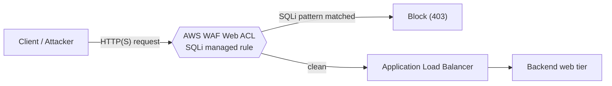

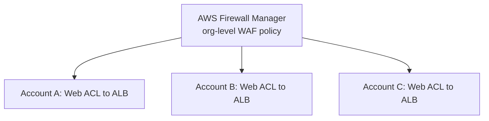

Therefore, the correct answer is: **Use AWS WAF and set up a managed rule to block request patterns associated with the exploitation of SQL databases, like SQL injection attacks. Associate it with the Application Load Balancer. Integrate AWS WAF with AWS Firewall Manager to reuse the rules across all the AWS accounts.**

**Why the other options are wrong:**

- **Amazon GuardDuty + Security Hub** - GuardDuty is a detection-only service; it analyzes logs (VPC Flow Logs, DNS query logs, CloudTrail) to surface findings, but it cannot be attached to an ALB and cannot block a request inline. It has no managed rule that filters HTTP traffic, so it cannot stop the injection from reaching the backend.
- **AWS Network Firewall + refactor the app** - Network Firewall operates at the VPC network layer (stateful/stateless inspection of traffic crossing subnet and VPC boundaries), not in front of an ALB. It is not designed to inspect Layer 7 SQLi payloads arriving at a load balancer. It is also account-specific and would itself need Firewall Manager to share. Refactoring the application is sound long-term hardening but takes significant time, conflicting with the "immediate solution" requirement.
- **Amazon Macie + Audit Manager + refactor** - Macie is a data-discovery/classification service that finds sensitive data (e.g., PII) in Amazon S3; it does not inspect or block live web traffic. Audit Manager only collects compliance evidence and runs assessments. Neither blocks SQL injection, and again the refactor is too slow for an urgent fix.

**References:**

[https://docs.aws.amazon.com/waf/latest/developerguide/how-aws-waf-works.html](https://docs.aws.amazon.com/waf/latest/developerguide/how-aws-waf-works.html)

[https://docs.aws.amazon.com/waf/latest/developerguide/fms-chapter.html](https://docs.aws.amazon.com/waf/latest/developerguide/fms-chapter.html)

[SQL database - AWS managed rule group - WAF](https://docs.aws.amazon.com/waf/latest/developerguide/aws-managed-rule-groups-use-case.html#aws-managed-rule-groups-use-case-sql-db)

---

### Question 2

A company needs to deploy at least two Amazon EC2 instances to support the normal workloads of its application and automatically scale up to six EC2 instances to handle the peak load. The architecture must be highly available and fault-tolerant as it is processing mission-critical workloads.
As a Solutions Architect, what should be done to meet this requirement?
**Answer:**

Create an Auto Scaling group of EC2 instances and set the minimum capacity to 4 and the maximum capacity to 6. Deploy 2 instances in Availability Zone A and another 2 instances in Availability Zone B.\*\*

**Overall Explanation:**

This question tests how Auto Scaling capacity settings interact with multi-AZ placement to deliver both high availability and fault tolerance. The key requirements are: keep at least 2 instances serving normal load at all times, scale up to 6 at peak, and survive the loss of an entire Availability Zone without dropping below the baseline.

**Amazon EC2 Auto Scaling** keeps the right number of instances running. An Auto Scaling group (ASG) has a **minimum** (the floor it will never go below), a **maximum** (the ceiling it will never exceed), and a **desired capacity** (the current target). Spreading the ASG across multiple Availability Zones is what provides fault tolerance: if one AZ fails, instances in the other AZ continue serving traffic.

The distinction that drives the answer is **high availability vs. fault tolerance**. High availability means recovering quickly from a failure; fault tolerance means continuing to operate with no service degradation even during the failure. Fault tolerance therefore requires redundant capacity that is already running - you cannot wait for replacement instances to launch, because launching takes time during which you would be under-provisioned.

To guarantee 2 healthy instances at all times even if an entire AZ is lost, you must run the baseline in each AZ. With 2 instances in AZ A and 2 in AZ B, losing either AZ still leaves 2 running. That requires a **minimum of 4**. The peak requirement of 6 instances sets the **maximum to 6**.

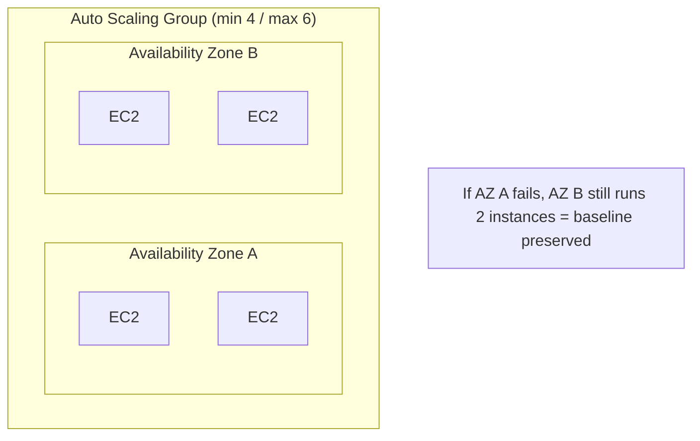

Hence, the correct answer is: **Create an Auto Scaling group of EC2 instances and set the minimum capacity to 4 and the maximum capacity to 6. Deploy 2 instances in Availability Zone A and another 2 instances in Availability Zone B.**

**Why the other options are wrong:**

- **Min 2 / max 6, all 4 in AZ A** - everything sits in a single Availability Zone, so an AZ outage (or data center failure) takes down the entire application. Single-AZ placement provides neither high availability nor fault tolerance.
- **Min 2 / max 6, 1 instance per AZ across 2 AZs** - the baseline must always be 2 instances. With only 1 per AZ, an AZ failure leaves a single instance until the ASG launches a replacement in the surviving AZ. That launch is not instantaneous, so there is a window where only 1 instance is running, violating the "at least 2 at all times" requirement.
- **Min 2 / max 4, 2 per AZ across 2 AZs** - placement is fine, but the maximum of 4 cannot reach the required peak of 6. Worse, if an AZ is lost while at peak, only 4 instances (one AZ's worth plus scaling room) would remain available, degrading performance precisely when load is highest.

**References:**

[https://docs.aws.amazon.com/autoscaling/ec2/userguide/what-is-amazon-ec2-auto-scaling.html](https://docs.aws.amazon.com/autoscaling/ec2/userguide/what-is-amazon-ec2-auto-scaling.html)

[https://docs.aws.amazon.com/autoscaling/ec2/userguide/auto-scaling-benefits.html](https://docs.aws.amazon.com/autoscaling/ec2/userguide/auto-scaling-benefits.html)

**Domain:** - Design Resilient Architectures

---

### Question 3

A cryptocurrency trading platform is using an API built in AWS Lambda and API Gateway. Due to the recent news and rumors about the upcoming price surge of Bitcoin, Ethereum and other cryptocurrencies, it is expected that the trading platform would have a significant increase in site visitors and new users in the coming days ahead.
In this scenario, how can you protect the backend systems of the platform from traffic spikes?

**Answer:**

Enable throttling limits and result caching in API Gateway.

**Overall Explanation:**

The scenario expects a sudden surge of traffic against a serverless API (API Gateway in front of Lambda) and asks how to shield the backend from those spikes. The answer combines two native API Gateway features: **throttling** (to cap the request rate hitting Lambda) and **caching** (to serve repeated reads without invoking Lambda at all).

**Amazon API Gateway throttling** limits how many requests flow through, protecting the backend from being overwhelmed. It applies limits at multiple scopes (account, stage, and per-method) using a token-bucket model with a steady-state **rate** and a **burst** allowance. For example, you can allow 1,000 requests/second steady with a short burst of 2,000/second. Requests over the limit are rejected with **HTTP 429 (Too Many Requests)**, and the AWS-generated SDKs automatically retry on that response. This keeps a traffic spike from translating into an unbounded flood of Lambda invocations.

**API Gateway caching** provisions a dedicated cache for a stage; you choose the cache size and a time-to-live (TTL). When a response is cached, identical subsequent requests are answered directly from the cache, so the request never reaches Lambda. This cuts both latency and backend load during a surge. You can tune the cache key and invalidate entries as needed.

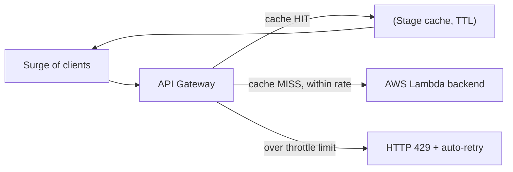

Hence, the correct answer is: **Enable throttling limits and result caching in API Gateway.**

**Why the other options are wrong:**

- **Re-platform to EC2 + ELB + Auto Scaling** - this throws away the serverless model for no benefit. Lambda already scales automatically, and migrating is slow, costly, and adds operational overhead. It also does not directly answer how to protect the backend; throttling/caching solves the problem without re-architecting.
- **Put CloudFront in front of API Gateway as a cache** - CloudFront is a CDN that accelerates content delivery and improves client-side latency, but its primary job is edge distribution, not rate-limiting your origin. API Gateway already has an integrated cache and throttling, so this adds a layer that does little to protect the Lambda backend from request-rate spikes.
- **Move the Lambda function into a VPC** - placing Lambda in a VPC only changes its network reachability (e.g., to reach private resources). It does nothing to control inbound request rate or cache responses, so it is irrelevant to spike protection and can even add cold-start/ENI overhead.

**Reference:**

[https://aws.amazon.com/api-gateway/faqs/](https://aws.amazon.com/api-gateway/faqs/)

[https://docs.aws.amazon.com/apigateway/latest/developerguide/api-gateway-request-throttling.html](https://docs.aws.amazon.com/apigateway/latest/developerguide/api-gateway-request-throttling.html)

[https://docs.aws.amazon.com/apigateway/latest/developerguide/api-gateway-caching.html](https://docs.aws.amazon.com/apigateway/latest/developerguide/api-gateway-caching.html)

**Domain:** Design High-Performing Architectures

---

### Question 4

A Solutions Architect needs to make sure that the On-Demand Amazon EC2 instance can only be accessed from this IP address (110.238.98.71) via an SSH connection.
Which configuration below will satisfy this requirement?

**Answer:**

Security Group Inbound Rule: Protocol – TCP. Port Range – 22, Source 110.238.98.71/32

**Overall Explanation:**

This question checks your understanding of security group rule direction, protocol, port, and CIDR notation. The goal is to permit SSH from exactly one IP address and nothing else.

A **security group** is a stateful virtual firewall attached at the **instance (ENI) level**, not the subnet level. You can attach multiple security groups to an instance, and rules are evaluated as an allow-list (there are no explicit deny rules; anything not allowed is denied).

Breaking down the requirement:

- **Direction:** the client initiates a connection _into_ the instance, so this must be an **inbound** rule. Outbound rules govern traffic the instance starts toward other destinations and are irrelevant here.
- **Protocol:** SSH runs over **TCP**, not UDP. UDP is connectionless and is not used by SSH, so a UDP rule would never permit the session.
- **Port:** SSH listens on **port 22** by default.
- **Source:** to restrict access to a single host, use the **/32** CIDR suffix, which represents exactly one IP address (110.238.98.71/32). A wider mask such as /24 or 0.0.0.0/0 would open access to many hosts or the entire internet.

Because security groups are **stateful**, you do not need a matching outbound rule for the reply: return traffic for an allowed inbound connection is permitted automatically.

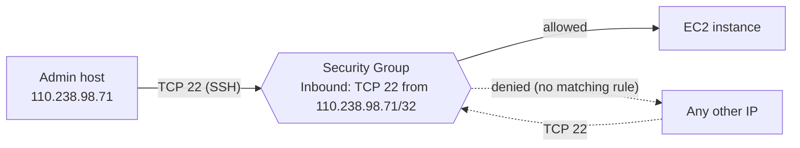

Hence, the correct answer is: **Security Group Inbound Rule: Protocol - TCP, Port Range - 22, Source 110.238.98.71/32**

**Why the other options are wrong:**

- **Inbound, Protocol UDP, Port 22, Source .../32** - the source and port are right, but SSH uses TCP. A UDP rule will not match the TCP handshake, so the connection still fails.
- **Outbound, Protocol TCP, Port 22, Destination .../32** - the protocol and port are correct, but it is an outbound rule. Outbound rules control traffic leaving the instance; they do not authorize an inbound SSH session from the client.
- **Outbound, Protocol UDP, Port 22, Destination 0.0.0.0/0** - wrong on three counts: it is outbound (not inbound), it uses UDP (not TCP), and 0.0.0.0/0 targets everything rather than the single required address.

**References:**

[https://docs.aws.amazon.com/AWSEC2/latest/UserGuide/using-network-security.html#security-group-rules](https://docs.aws.amazon.com/AWSEC2/latest/UserGuide/using-network-security.html#security-group-rules)

[https://docs.aws.amazon.com/vpc/latest/userguide/vpc-security-groups.html](https://docs.aws.amazon.com/vpc/latest/userguide/vpc-security-groups.html)

**Domain:** Design Secure Architectures

---

### Question 5

A company requires all the data stored in the cloud to be encrypted at rest. To easily integrate this with other AWS services, they must have full control over the encryption of the created keys and also the ability to immediately remove the key material from AWS KMS. The solution should also be able to audit the key usage independently of AWS CloudTrail.
Which of the following options will meet this requirement?
**Answer:**

Use AWS Key Management Service to create a KMS key in a custom key store and store the non-extractable key material in AWS CloudHSM.

**Overall Explanation:**

The requirement set points to one specific KMS feature. The company wants: encryption at rest that integrates easily with AWS services, full control over the keys, the ability to _immediately_ destroy the key material, and independent auditing of key usage outside of AWS CloudTrail. That precise combination is the purpose of an **AWS KMS custom key store backed by AWS CloudHSM**.

A KMS **custom key store** keeps the convenience and broad service integration of AWS KMS (S3, EBS, RDS, etc. all call KMS the same way) while relocating the actual key material into a **CloudHSM cluster that you own and operate**. When you create a KMS key in a custom key store, KMS generates the key material inside your CloudHSM cluster; the **non-extractable** key material never leaves the HSMs in plaintext, and every cryptographic operation using that key is performed on your HSMs.

This is exactly what satisfies each requirement:

1. **Full control / single-tenancy** - keys live in dedicated HSMs under your direct control, meeting strict hardware single-tenancy needs.
2. **Immediate removal** - because you manage the CloudHSM cluster, you can disconnect the custom key store or delete the key material right away, independently of KMS's normal key-deletion waiting period.
3. **Independent auditing** - CloudHSM produces its own audit logs, so you can monitor key usage separately from AWS KMS and AWS CloudTrail.

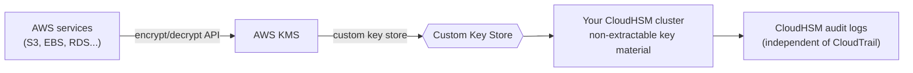

Hence, the correct answer is: **Use AWS Key Management Service to create a KMS key in a custom key store and store the non-extractable key material in AWS CloudHSM.**

**Why the other options are wrong:**

- **KMS key in a custom key store with material in Amazon S3** - a custom key store must be backed by a CloudHSM cluster, not S3. S3 is object storage and provides none of the single-tenant hardware control, immediate key-material destruction, or HSM-level auditing the scenario demands.
- **AWS owned keys stored in CloudHSM** - AWS owned keys are created and controlled entirely by AWS and are shared across many accounts; you get no visibility or control over them, which directly contradicts the "full control" requirement, and they cannot be audited independently.
- **AWS managed keys stored in CloudHSM** - AWS managed keys (created automatically by integrated services) are also managed by AWS on your behalf. You cannot fully control their lifecycle or immediately purge their material, and their usage is logged only through CloudTrail - failing the independent-audit requirement.

**References:**

[https://docs.aws.amazon.com/kms/latest/developerguide/custom-key-store-overview.html](https://docs.aws.amazon.com/kms/latest/developerguide/custom-key-store-overview.html)

[https://docs.aws.amazon.com/kms/latest/developerguide/keystore-cloudhsm.html](https://docs.aws.amazon.com/kms/latest/developerguide/keystore-cloudhsm.html)

[https://aws.amazon.com/blogs/security/are-kms-custom-key-stores-right-for-you/](https://aws.amazon.com/blogs/security/are-kms-custom-key-stores-right-for-you/)

**Domain:** Design Secure Architectures

---

### Question 6

A company is using AWS Fargate to run a batch job whenever an object is uploaded to an Amazon S3 bucket. The minimum ECS task count is initially set to 1 to save on costs and should only be increased based on new objects uploaded to the S3 bucket.

Which is the most suitable option to implement with the LEAST amount of effort?

**Answer:**

Set up an Amazon EventBridge (Amazon CloudWatch Events) rule to detect S3 object PUT operations and set the target to the ECS cluster to run a new ECS task.

**Overall Explanation:**

The requirement is purely reactive: each new S3 object should result in one ECS task running, and the chosen solution must use the LEAST amount of effort. Amazon EventBridge is a serverless event bus that ingests events from AWS services (including Amazon S3) and routes them to targets you select. The key fact is that **an Amazon ECS task is a native, first-class EventBridge target** - you can point a rule directly at an ECS cluster/task definition (EventBridge calls `RunTask` for you) without writing any glue code. The pipeline is therefore fully managed, event-driven, and effectively zero-maintenance.

The flow: S3 emits an object-created (PUT) event, an EventBridge rule pattern matches it, and EventBridge launches the ECS task as the rule target.

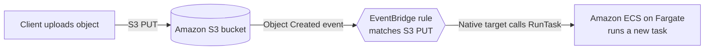

Because EventBridge can invoke `RunTask` on the cluster itself, no intermediate compute is needed (no Lambda, no CloudWatch alarm). That is precisely why this option wins on the "least effort" criterion.

Hence, the correct answer is: **Set up an Amazon EventBridge (Amazon CloudWatch Events) rule to detect S3 object PUT operations and set the target to the ECS cluster to run a new ECS task.**

**Why the other options are wrong:**

- **EventBridge rule targeting a Lambda function that calls the** `StartTask` **API** - This is functionally valid, but it adds a custom Lambda you must author, deploy, and maintain solely to call an API that EventBridge already calls natively. More code and more moving parts for no benefit, so it loses on "least effort."
- **CloudWatch alarm on CloudTrail S3 object-level events, then an EventBridge rule that triggers the cluster** - This bolts CloudTrail data-event logging plus a CloudWatch alarm in front of EventBridge. EventBridge already receives S3 events directly, so this extra layer is needless complexity, added cost (CloudTrail data events are billed), and added latency.
- **CloudWatch alarm on CloudTrail with two alarm actions that update the ECS task count to scale out/in** - A CloudWatch alarm action cannot directly change an ECS service's desired task count. Alarm actions are limited to SNS notifications, EC2/Auto Scaling actions, and a few others; there is no "set ECS desired count" action, so this design is impossible as written.

**References:**

[https://docs.aws.amazon.com/AmazonCloudWatch/latest/events/CloudWatch-Events-tutorial-ECS.html](https://docs.aws.amazon.com/AmazonCloudWatch/latest/events/CloudWatch-Events-tutorial-ECS.html)

[https://docs.aws.amazon.com/AmazonCloudWatch/latest/events/Create-CloudWatch-Events-Rule.html](https://docs.aws.amazon.com/AmazonCloudWatch/latest/events/Create-CloudWatch-Events-Rule.html)

**Domain:** Design Cost-Optimized Architectures

---

### Question 7

There was an incident in a production environment where user data stored in an Amazon S3 bucket was accidentally deleted by a Junior DevOps Engineer. The issue was escalated to management, and after a few days, an instruction was given to improve the security and protection of AWS resources. What combination of the following options will protect the S3 objects in the bucket from both accidental deletion and overwriting? (Select TWO.)

**Answer:**

Enable Versioning, Enable Multi-Factor Authentication Delete

**Overall Explanation:**

The objects must survive two distinct accidents: an accidental **delete** and an accidental **overwrite** (a PUT to the same key). Two S3 features combined cover both cases.

**S3 Versioning** keeps every variant of an object under the same key. When versioning is on, an overwrite does not destroy the previous data - it simply creates a new version while the old version remains retrievable, and a "delete" only inserts a delete marker rather than erasing data. This directly defeats both accidental overwrites and accidental deletes because any prior state can be restored.

**MFA Delete** adds a second control on top of versioning. With MFA Delete enabled, two especially destructive operations require a one-time MFA code in addition to normal credentials:

- permanently deleting a specific object version, and
- suspending (changing) the bucket's versioning state.

So even a user who has delete permissions cannot permanently purge a version without the physical/virtual MFA token, which is exactly the guardrail you want after a junior engineer wiped data.

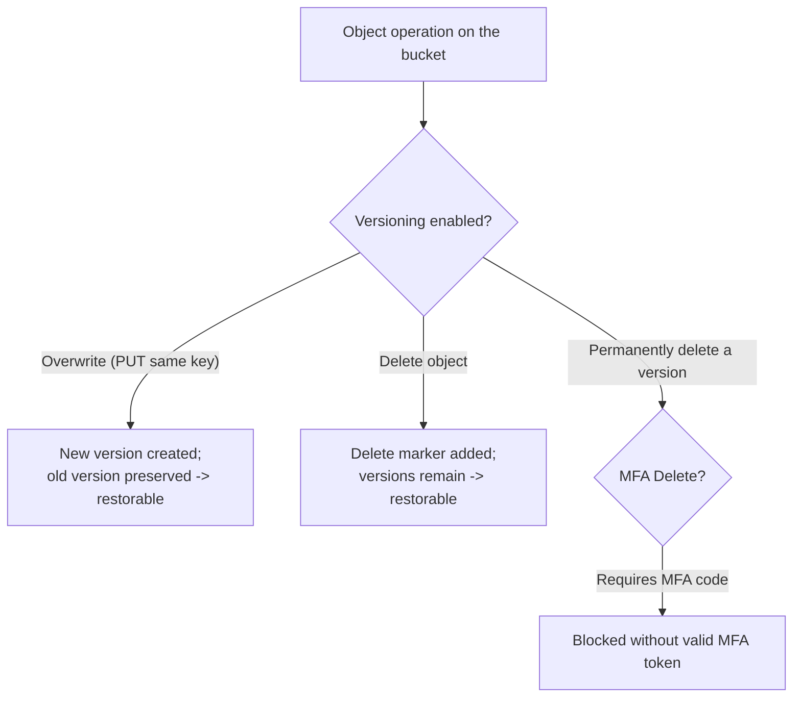

Hence, the correct answers are:

**- Enable Versioning**

**- Enable Multi-Factor Authentication Delete**

**Why the other options are wrong:**

- **Provide access to S3 data strictly through pre-signed URLs only** - A pre-signed URL just grants temporary, signed access to a specific object operation. It controls who can reach an object, but it does nothing to retain prior versions, so it cannot recover an object that was overwritten or deleted.
- **Disallow S3 Delete using a bucket policy** - Blanket-denying `s3:DeleteObject` would stop legitimate deletions too, and the goal is to prevent _accidental_ loss while still permitting normal deletes. It also offers no protection against accidental overwrites.
- **Enable S3 Intelligent-Tiering** - This is a cost-optimization storage class that moves objects between access tiers based on usage. It has nothing to do with data recovery or deletion protection.

**References:**

[https://docs.aws.amazon.com/AmazonS3/latest/dev/Versioning.html](https://docs.aws.amazon.com/AmazonS3/latest/dev/Versioning.html)

[https://docs.aws.amazon.com/AmazonS3/latest/userguide/Welcome.html](https://docs.aws.amazon.com/AmazonS3/latest/userguide/Welcome.html)

**Domain:** Design Resilient Architectures

---

### Question 8

A company is in the process of migrating their applications to AWS. One of their systems requires a database that can scale globally and handle frequent schema changes. The application should not have any downtime or performance issues whenever there is a schema change in the database. It should also provide a low latency response to high-traffic queries.

Which is the most suitable database solution to use to achieve this requirement?

**Answer:**

DynamoDB

**Overall Explanation:**

The decisive phrases are "frequent schema changes with no downtime" and "low-latency response to high-traffic queries that scales globally." A _schema_ is simply the structure or shape of your data. A relational engine enforces that structure rigidly: columns, data types, and constraints are fixed up front, and altering them (an `ALTER TABLE` on a large table) can lock rows, degrade performance, or require a maintenance window - the opposite of "no downtime during schema changes."

A NoSQL store such as **Amazon DynamoDB** uses a flexible, item-level structure. Aside from the primary key, attributes are not fixed across items, so you can add or change fields per item with no global schema migration and therefore no downtime. DynamoDB is fully managed, delivers single-digit-millisecond latency at any scale, and (via global tables) can replicate across Regions for global, low-latency access - matching every requirement.

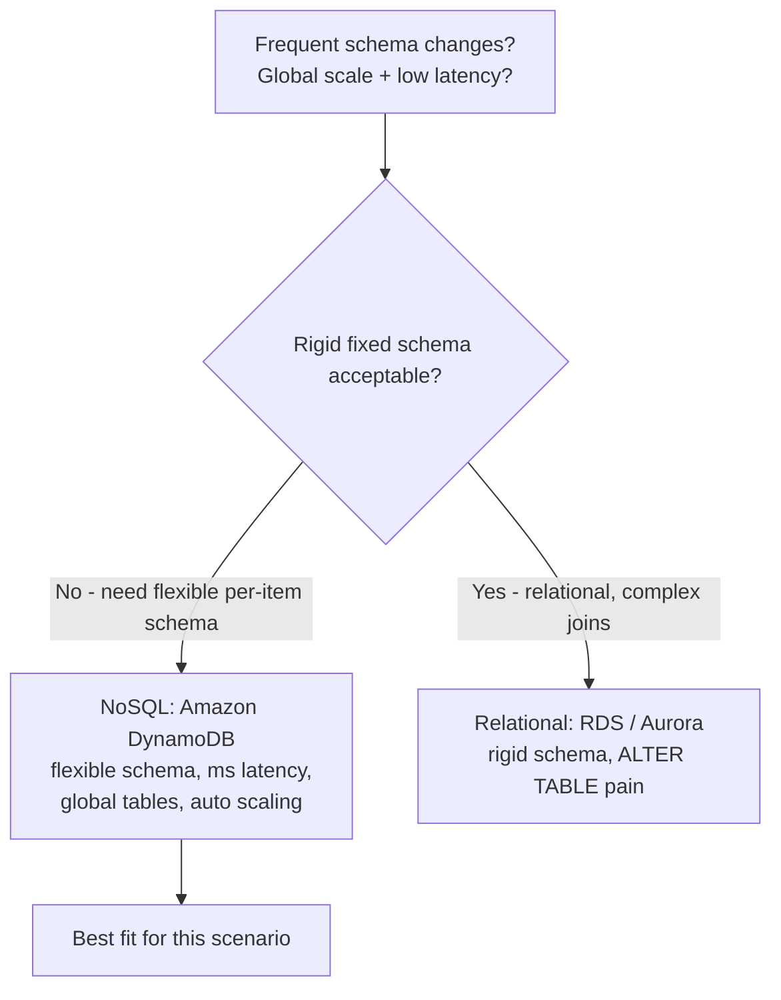

Why relational databases scale poorly here: data is normalized across many tables (multiple writes), ACID transaction overhead is paid on every write, and reads often need expensive joins to reassemble results. DynamoDB sidesteps all three - flexible items store hierarchical data in a single record, and composite-key design colocates related items for fast access.

Hence, the correct answer is: **DynamoDB**

**Why the other options are wrong:**

- **An Amazon RDS instance in a Multi-AZ deployment** - RDS is a relational database with a rigid schema. Multi-AZ only provides high availability via a standby replica; it does nothing to ease frequent, downtime-free schema changes.
- **An Amazon Aurora database with Read Replicas** - Aurora is also relational and schema-rigid. Read replicas scale read throughput but do not solve the flexible-schema or zero-downtime-schema-change requirement.
- **Redshift** - Redshift is a columnar data warehouse built for OLAP / analytical queries over large datasets, not for low-latency, high-traffic operational (OLTP-style) access with a frequently changing schema.

**References:**

[https://docs.aws.amazon.com/amazondynamodb/latest/developerguide/bp-general-nosql-design.html](https://docs.aws.amazon.com/amazondynamodb/latest/developerguide/bp-general-nosql-design.html)

[https://docs.aws.amazon.com/amazondynamodb/latest/developerguide/bp-relational-modeling.html](https://docs.aws.amazon.com/amazondynamodb/latest/developerguide/bp-relational-modeling.html)

[https://docs.aws.amazon.com/amazondynamodb/latest/developerguide/SQLtoNoSQL.html](https://docs.aws.amazon.com/amazondynamodb/latest/developerguide/SQLtoNoSQL.html)

**Domain:** Design Secure Applications and Architectures

---

### Question 9

A car dealership website hosted in Amazon EC2 stores car listings in an Amazon Aurora database managed by Amazon RDS. Once a vehicle has been sold, its data must be removed from the current listings and forwarded to a distributed processing system.

Which of the following options can satisfy the given requirement?

**Answer:**

Use an Aurora MySQL native function to invoke an AWS Lambda function whenever a vehicle listing is deleted. Configure the Lambda function to send the data to an Amazon SQS queue for the distributed processing system to consume.

**Overall Explanation:**

The trigger here is a _data change_ inside the database: when a row representing a sold vehicle is deleted, that record must be pushed to a downstream distributed processing system. The cleanest way to react to row-level DML on Aurora MySQL is its **native Lambda invocation functions** (`lambda_sync` / `lambda_async`), which can be called from a trigger or stored procedure. So you attach an `AFTER DELETE` trigger to the listings table; the trigger calls the native function, which invokes a Lambda; the Lambda writes the deleted record's data to an Amazon SQS queue that the processing system consumes. SQS provides durable buffering and lets multiple independent consumers process the work.

```mermaid
flowchart LR
    DEL["Vehicle sold:<br/>row DELETE on Aurora MySQL"] --> TRG["AFTER DELETE trigger<br/>calls lambda_async()"]
    TRG --> L["AWS Lambda function"]
    L --> SQS["Amazon SQS queue"](%22Amazon%20SQS%20queue%22.md)
    SQS --> DP["Distributed processing system<br/>(consumers)"]
```

Hence, the correct answer is: **Use an Aurora MySQL native function to invoke an AWS Lambda function whenever a vehicle listing is deleted. Configure the Lambda function to send the data to an Amazon SQS queue for the distributed processing system to consume.**

**Why the other options are wrong:**

All three remaining options rely on an **RDS event subscription**, which is the fundamental flaw they share. RDS event subscriptions report _operational / infrastructure_ events about the DB instance itself - things like a failover, a backup completing, a parameter group change, low storage, or instance start/stop. They do **not** surface row-level data changes such as `INSERT`, `UPDATE`, or `DELETE`. Therefore none of these designs can detect "a listing was deleted," regardless of whether the notifications fan out through SNS, SQS, or Lambda:

- **RDS event subscription to SQS, fan out to multiple SNS topics, process with Lambda** - Wrong event source (operational, not data changes); also SQS does not natively fan out to SNS topics.
- **RDS event subscription to Lambda, fan out to multiple SQS queues** - Same root problem: the subscription never fires on a row deletion.
- **RDS event subscription to SNS, fan out to multiple SQS queues, process with Lambda** - The SNS-to-SQS fan-out pattern is valid in general, but the trigger source (RDS event subscription) cannot detect the data deletion that drives this scenario.

**References:**

[https://docs.aws.amazon.com/AmazonRDS/latest/AuroraUserGuide/AuroraMySQL.Integrating.Lambda.html](https://docs.aws.amazon.com/AmazonRDS/latest/AuroraUserGuide/AuroraMySQL.Integrating.Lambda.html)

[https://aws.amazon.com/blogs/database/capturing-data-changes-in-amazon-aurora-using-aws-lambda/](https://aws.amazon.com/blogs/database/capturing-data-changes-in-amazon-aurora-using-aws-lambda/)

**Domain:** Design High-Performing Architectures

---

### Question 10

An online shopping platform is hosted on an Auto Scaling group of Amazon EC2 Spot instances and utilizes Amazon Aurora PostgreSQL as its database. It is required to optimize database workloads in the cluster by directing the production traffic to high-capacity instances and routing the reporting queries from the internal staff to the low-capacity instances. Which is the most suitable configuration for the application as well as the Aurora database cluster to achieve this requirement?

**Answer:**

Create a custom endpoint in Aurora based on the specified criteria for the production traffic and another custom endpoint to handle the reporting queries.

**Overall Explanation:**

An Amazon Aurora cluster is a group of DB instances (one writer plus up to 15 readers), and you connect to it through **endpoints** rather than instance hostnames. Aurora offers four endpoint types, and picking the right one is the whole question:

- **Cluster (writer) endpoint** - always points to the current primary instance; used for writes/DDL.
- **Reader endpoint** - load-balances read-only connections across all replicas, but treats them as one undifferentiated pool.
- **Instance endpoint** - targets one specific DB instance.
- **Custom endpoint** - a user-defined endpoint that load-balances across a _chosen subset_ of instances based on criteria such as instance class/capacity.

The requirement is to send production traffic to high-capacity instances and reporting queries to low-capacity instances - i.e., split traffic by _instance capacity_, not merely by read vs. write. Only the **custom endpoint** can group instances by capacity, so you create one custom endpoint scoped to the high-capacity instances for production and a second custom endpoint scoped to the low-capacity instances for reporting.

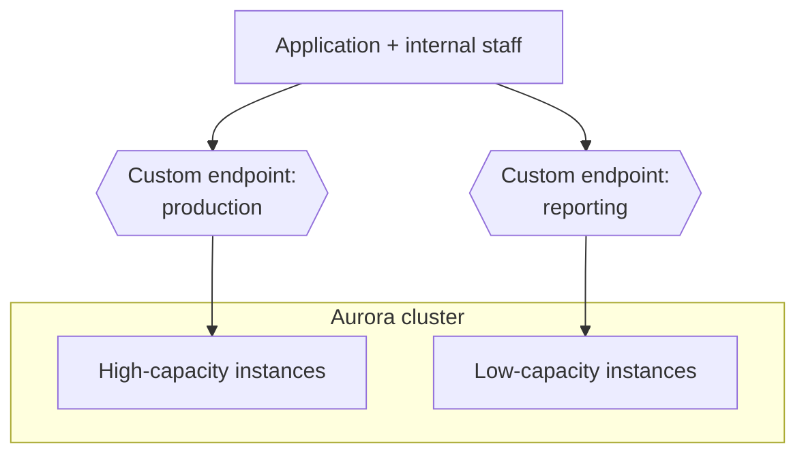

Hence, the correct answer is: **Create a custom endpoint in Aurora based on the specified criteria for the production traffic and another custom endpoint to handle the reporting queries.**

**Why the other options are wrong:**

- **Use the reader endpoint for both production and reporting traffic** - The reader endpoint load-balances across _all_ replicas indiscriminately and only serves read-only queries. It cannot steer reporting traffic specifically to low-capacity instances, nor can it carry production write traffic.
- **Use the instance endpoint for production and the cluster (writer) endpoint for reporting** - This is backwards. The cluster endpoint always points to the single primary (write) instance, which is suited to writes/DDL, not read-heavy reporting, and an instance endpoint pins you to one box with no load balancing. Neither selects instances by capacity.
- **Do nothing - Aurora routes by capacity automatically** - False. Aurora has no built-in notion of "production vs. reporting" or capacity-based routing. You must explicitly define custom endpoints to achieve this.

**References:**

[https://docs.aws.amazon.com/AmazonRDS/latest/AuroraUserGuide/Aurora.Overview.Endpoints.html](https://docs.aws.amazon.com/AmazonRDS/latest/AuroraUserGuide/Aurora.Overview.Endpoints.html)

[https://docs.aws.amazon.com/AmazonRDS/latest/AuroraUserGuide/Aurora.Endpoints.Custom.html](https://docs.aws.amazon.com/AmazonRDS/latest/AuroraUserGuide/Aurora.Endpoints.Custom.html)

**Domain:** Design Resilient Architectures

---

### Question 11

A company has a hybrid cloud architecture that connects its on-premises data center and cloud infrastructure in AWS. It requires a durable storage backup for its corporate documents stored on-premises and a local cache that provides low-latency access to recently accessed data to reduce data egress charges. The documents must be stored on and retrieved from AWS via the Server Message Block (SMB) protocol. These files must be immediately accessible within minutes for six months and archived for another decade to meet data compliance. Which of the following is the best and most cost-effective approach to implement in this scenario?

**Answer:**

Launch a new file gateway that connects to your on-premises data center using AWS Storage Gateway. Upload the documents to the file gateway and set up a lifecycle policy to move the data into Glacier for data archival.

**Overall Explanation:**

Break the requirements into checklist items: (1) access from on-premises over the **SMB** protocol, (2) a **durable cloud backup** of corporate documents, (3) a **local cache** for low-latency access to recently used files (which also cuts egress charges), (4) files retrievable **within minutes for six months**, then (5) **archived for ~10 years** cost-effectively.

The **Amazon S3 File Gateway** (a mode of AWS Storage Gateway) satisfies all of these. It deploys as a VM on-premises and presents an S3 bucket as an NFS or **SMB** file share. Files written to the share are stored as durable S3 objects, and the gateway keeps a **local cache** of recently accessed data for low-latency reads and reduced data transfer. Because the data lives in S3, you can attach an **S3 Lifecycle policy** that keeps objects in an immediately-accessible class for six months and then transitions them to **S3 Glacier** for long-term, low-cost archival. (Standard Glacier still allows retrieval in minutes with expedited/standard retrieval, satisfying the compliance access window.)

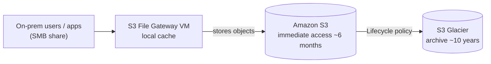

Therefore, the correct answer is: **Launch a new file gateway that connects to your on-premises data center using AWS Storage Gateway. Upload the documents to the file gateway and set up a lifecycle policy to move the data into Glacier for data archival.**

**Why the other options are wrong:**

- **Tape Gateway (VTL) with a lifecycle policy into Glacier** - A tape gateway emulates a virtual tape library for backup software and writes virtual tapes to S3/Glacier. It does not expose an SMB/NFS file share and does not provide a low-latency local cache of recently accessed files, so it fails the SMB-access, caching, and immediate-retrieval requirements.
- **Direct Connect + store documents on EBS volumes, snapshot to S3 then Glacier** - Amazon EBS is single-AZ block storage that is far less durable than S3's eleven-nines design, and EBS snapshots are not file-level SMB access. This is more expensive and weaker on durability; storing documents directly in S3 is the better pattern.
- **AWS DataSync to copy files to S3, then lifecycle to Glacier** - DataSync is a one-way bulk _migration/transfer_ service. It provides no persistent SMB file share for ongoing access and no local cache, so recently accessed files would be re-fetched from S3, increasing egress charges and latency - the opposite of the requirement.

**References:**

[https://docs.aws.amazon.com/AmazonS3/latest/dev/object-lifecycle-mgmt.html](https://docs.aws.amazon.com/AmazonS3/latest/dev/object-lifecycle-mgmt.html)

[https://docs.aws.amazon.com/storagegateway/latest/userguide/StorageGatewayConcepts.html](https://docs.aws.amazon.com/storagegateway/latest/userguide/StorageGatewayConcepts.html)

**Domain:** Design Resilient Architectures

---

### Question 12

A retail company receives raw `.csv` data files into its Amazon S3 bucket from multiple sources on an hourly basis, with an average file size of 2 GB. The bucket is managed using S3 Access Grants for fine‑grained access control. An automated process must be implemented to convert these `.csv` files into the more efficient Apache Parquet format and store the converted files in another S3 bucket. Additionally, the conversion process must be automatically initiated each time a new file is uploaded into the S3 bucket. Which of the following options must be implemented to meet these requirements with the LEAST operational overhead?

**Answer:**

Utilize an AWS Glue extract, transform, and load (ETL) job to process and convert the `.csv` files to Apache Parquet format and then store the output files into the target S3 bucket. Configure an Amazon EventBridge rule to trigger the Glue job on S3 Object Created events.

**Overall Explanation:**

The workload is: large (about 2 GB) `.csv` files land in S3 hourly, each upload must automatically trigger a conversion to **Apache Parquet** (a compressed, columnar format that speeds and cheapens later analytics), and output goes to a second bucket - all with the **LEAST operational overhead**.

**AWS Glue** is a fully managed, serverless ETL service: there are no servers to provision, patch, or scale, and a Glue Spark job comfortably reads multi-GB files (no per-invocation time or memory ceiling). To make it event-driven, you configure an **Amazon EventBridge** rule on the source bucket's **S3 "Object Created"** events to start the Glue job the moment a file arrives. This combination is fully managed end to end, which is why it carries the lowest operational burden.

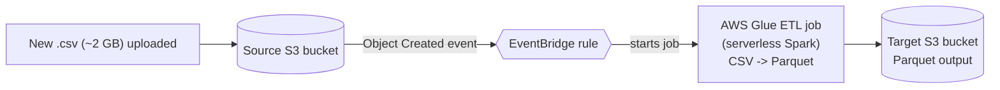

Hence, the correct answer is: **Utilize an AWS Glue extract, transform, and load (ETL) job to process and convert the `.csv` files to Apache Parquet format and then store the output files into the target S3 bucket. Configure an Amazon EventBridge rule to trigger the Glue job on S3 Object Created events.**

**Why the other options are wrong:**

- **Lambda (triggered by S3 Object Created) does the conversion, then AWS Transfer Family (SFTP) moves output to the target bucket** - AWS Lambda has a 15-minute maximum runtime and a hard memory cap; converting 2 GB files risks timeouts and out-of-memory failures and would force awkward streaming. Adding AWS Transfer Family/SFTP just to copy objects between two S3 buckets is unnecessary - the Glue job can write to the target bucket directly. More components, more overhead.
- **Apache Spark on an EC2 instance, with EventBridge invoking the Spark job via a Function URL** - Running Spark on self-managed EC2 means you own provisioning, patching, scaling, and availability of that instance, which is exactly the operational overhead Glue removes. A "Function URL" also belongs to Lambda, not EC2/Spark, so the wiring is incoherent.
- **Glue ETL job + Data Catalog table, with a Glue crawler running hourly on a schedule** - Using Glue for the conversion is right, but a scheduled (hourly) crawler is _not_ event-driven. Files would wait up to an hour to be processed, violating the "automatically initiated each time a new file is uploaded" requirement. An S3-event trigger via EventBridge processes each file immediately.

**References:**

[https://docs.aws.amazon.com/glue/latest/dg/aws-glue-programming-etl-format-parquet-home.html](https://docs.aws.amazon.com/glue/latest/dg/aws-glue-programming-etl-format-parquet-home.html)

[https://docs.aws.amazon.com/glue/latest/dg/starting-workflow-eventbridge.html](https://docs.aws.amazon.com/glue/latest/dg/starting-workflow-eventbridge.html)

[https://docs.aws.amazon.com/AmazonS3/latest/userguide/EventBridge.html](https://docs.aws.amazon.com/AmazonS3/latest/userguide/EventBridge.html)

[https://aws.amazon.com/blogs/big-data/build-a-serverless-event-driven-workflow-with-aws-glue-and-amazon-eventbridge/](https://aws.amazon.com/blogs/big-data/build-a-serverless-event-driven-workflow-with-aws-glue-and-amazon-eventbridge/)

**Domain:** Design High-Performing Architectures

---

### Question 13

A company has recently migrated its microservices-based application to Amazon Elastic Kubernetes Service (Amazon EKS). As part of the migration, the company must ensure that all sensitive configuration data and credentials, such as database passwords and API keys, are stored securely and encrypted within the Amazon EKS cluster's etcd key-value store.

What is the most suitable solution to meet the company's requirements?

**Answer:**

Enable secret encryption with a new AWS KMS key on an existing Amazon EKS cluster to encrypt sensitive data stored in the EKS cluster's etcd key-value store.

**Overall Explanation:**

Amazon EKS stores all Kubernetes objects, including `Secret` resources, in an internal **etcd** key-value store that AWS manages on the control plane. By default the values inside those `Secret` objects are only base64-encoded, not encrypted, so anyone who can read etcd (or a backup of it) can recover plaintext credentials. The requirement is specifically to protect the data **at rest inside etcd**, so the right control is EKS **envelope encryption of Kubernetes secrets** backed by an AWS KMS key.

When you associate a KMS key with the cluster, EKS uses the Kubernetes KMS provider: each secret is encrypted with a data encryption key, and that data key is itself encrypted ("wrapped") by your customer-managed KMS key. Only the wrapped key is written to etcd, so a leaked etcd snapshot is useless without access to KMS. You retain full control of the key (rotation, key policies, CloudTrail auditing of every decrypt call), which satisfies typical compliance and confidentiality requirements.

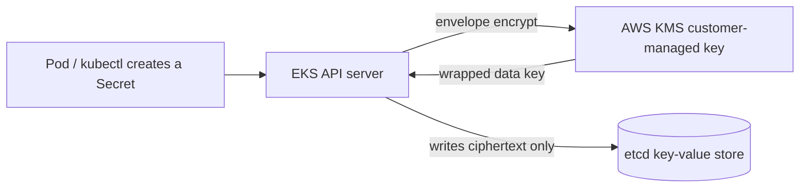

**Why the other options are wrong:**

- **Use AWS Secrets Manager with a new KMS key** - Secrets Manager is an external store for application secrets that apps fetch via API; it does nothing to the contents of the cluster's own etcd database. The Kubernetes `Secret` objects already living in etcd would still be unencrypted, so the stated requirement is not met.
- **Enable default EBS volume encryption with a new KMS key** - This encrypts the EBS volumes attached to worker nodes (the data plane). The etcd store sits on the AWS-managed control plane, not on your worker-node EBS volumes, so encrypting EBS leaves etcd contents untouched.
- **Use EKS default options plus the EBS CSI driver add-on** - The EBS CSI driver only provisions persistent volumes for stateful pods. It is unrelated to how `Secret` objects are stored in etcd and provides no etcd encryption at all.

**References:**

[https://docs.aws.amazon.com/eks/latest/userguide/enable-kms.html](https://docs.aws.amazon.com/eks/latest/userguide/enable-kms.html)

[https://docs.aws.amazon.com/eks/latest/userguide/what-is-eks.html](https://docs.aws.amazon.com/eks/latest/userguide/what-is-eks.html)

**Domain:** Design Resilient Architectures

---

### Question 14

A Solutions Architect is hosting a website in an Amazon S3 bucket named `tutorialsdojo`. The users load the website using the following URL: `http://tutorialsdojo.s3-website-us-east-1.amazonaws.com`. A new requirement has been introduced to add JavaScript on the webpages to make authenticated HTTP `GET` requests against the same bucket using the S3 API endpoint (`tutorialsdojo.s3.amazonaws.com`). However, upon testing, the web browser blocks JavaScript from allowing those requests.

Which of the following options is the MOST suitable solution to implement for this scenario?

**Answer:**

Enable Cross-origin resource sharing (CORS) configuration in the bucket.

**Overall Explanation:**

A web browser enforces the **same-origin policy**: JavaScript loaded from one origin (scheme + host + port) is blocked from reading responses of requests sent to a _different_ origin. In this scenario the page is served from the S3 website endpoint `tutorialsdojo.s3-website-us-east-1.amazonaws.com`, but the `GET` calls target the S3 REST API endpoint `tutorialsdojo.s3.amazonaws.com`. Even though both point at the same bucket, the hostnames differ, so the browser treats them as separate origins and blocks the cross-origin response.

**Cross-Origin Resource Sharing (CORS)** is the mechanism that lets a server explicitly opt in to cross-origin access. Adding a CORS configuration to the S3 bucket tells S3 to return the `Access-Control-Allow-Origin` header for requests coming from the website endpoint, so the browser permits the JavaScript to read the responses. This is the only option that addresses a browser same-origin restriction.

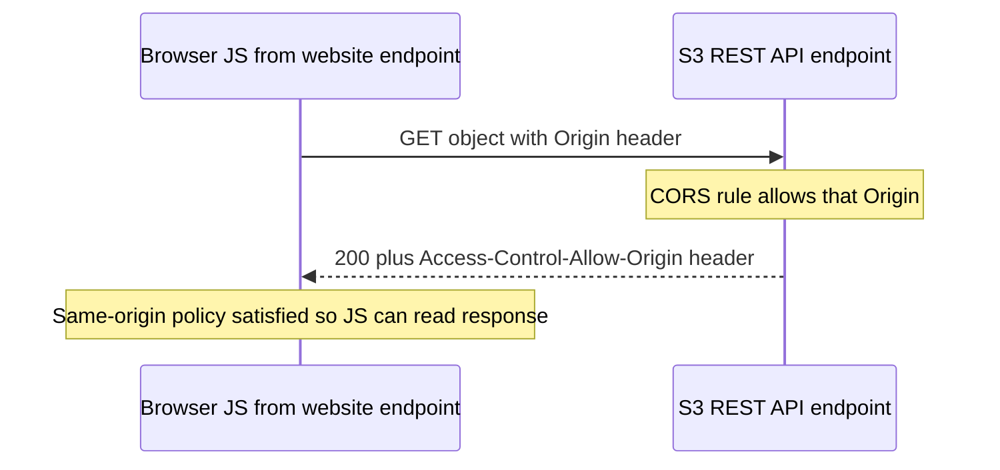

**Why the other options are wrong:**

- **Enable cross-account access** - This is an IAM/bucket-policy concept for granting another AWS account access to a resource. It has nothing to do with a browser's same-origin policy and would not unblock the JavaScript.
- **Enable Cross-Zone Load Balancing** - This is an Elastic Load Balancing feature that spreads traffic evenly across instances in multiple Availability Zones. It is unrelated to S3 or browser CORS behavior.
- **Enable Cross-Region Replication (CRR)** - CRR asynchronously copies objects to a bucket in another Region for durability/compliance. It does not affect how a browser evaluates cross-origin requests.

**References:**

[https://docs.aws.amazon.com/AmazonS3/latest/userguide/cors.html](https://docs.aws.amazon.com/AmazonS3/latest/userguide/cors.html)

[https://docs.aws.amazon.com/AmazonS3/latest/userguide/ManageCorsUsing.html](https://docs.aws.amazon.com/AmazonS3/latest/userguide/ManageCorsUsing.html)

**Domain:** Design Secure Architectures

---

### Question 15

A company is using Amazon S3 to store frequently accessed data. When an object is created or deleted, the S3 bucket will send an event notification to the Amazon SQS queue. A solutions architect needs to create a solution that will notify the development and operations team about the created or deleted objects.

Which of the following would satisfy this requirement?

**Answer:**

Create an Amazon SNS topic and configure two SQS queues to subscribe to the topic. Grant S3 permission to send notifications to SNS and update the bucket to use the new SNS topic.

**Overall Explanation:**

An S3 event notification can be delivered to **only one destination per event type**, and S3 supports exactly three targets: an SNS topic, an SQS queue, or a Lambda function. You cannot attach two SQS queues (or two SNS topics) to the same event. Today the bucket points at a single SQS queue, but two separate teams now need to be notified, so you need a way to duplicate one event into two independent consumers.

The clean pattern is **SNS fan-out**: point the S3 event at one SNS topic, then subscribe two SQS queues to that topic. When S3 publishes the event, SNS pushes an identical copy to every subscribed queue, so each team gets its own queue to poll and process independently without interfering with the other. This keeps the existing queue-based consumption model while adding a second consumer cleanly.

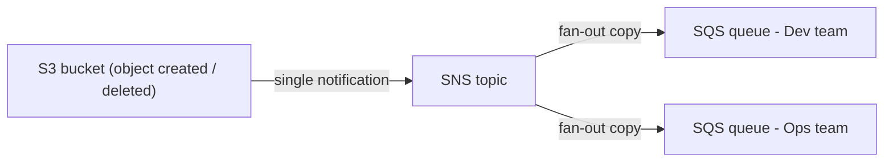

**Why the other options are wrong:**

- **Set up a second SQS queue and grant S3 permission to send to it** - S3 allows only one destination for a given event type, so you cannot wire a second SQS queue directly to the same notification. Fan-out via SNS is required to reach two queues.
- **Create an SNS FIFO topic for the other team and let S3 send to it** - Same one-destination limit applies; you also cannot point S3 at two topics. FIFO topics/queues add strict ordering and deduplication that this notification use case does not need.
- **Two SQS queues that poll the SNS topic** - SNS is push-based, not pull-based; consumers cannot poll an SNS topic. SQS queues must _subscribe_ to the topic so SNS pushes messages to them.

**References:**

[https://docs.aws.amazon.com/AmazonS3/latest/userguide/NotificationHowTo.html](https://docs.aws.amazon.com/AmazonS3/latest/userguide/NotificationHowTo.html)

[https://docs.aws.amazon.com/sns/latest/dg/sns-common-scenarios.html](https://docs.aws.amazon.com/sns/latest/dg/sns-common-scenarios.html)

**Domain:** Design High-Performing Architectures

---

### Question 16

A Docker application, which is running on an Amazon ECS cluster behind a load balancer, is heavily using Amazon DynamoDB. The application requires improved database performance by distributing the workload evenly and utilizing the provisioned throughput efficiently. Currently, the table's write capacity units (WCU) are unevenly consumed due to key distribution.

Which of the following should be implemented for the DynamoDB table?

**Answer:**

Use partition keys with high-cardinality attributes, which have a large number of distinct values for each item.

**Overall Explanation:**

DynamoDB splits a table's data across **physical partitions**, and the **partition key** value of each item determines which partition stores it (DynamoDB hashes the partition key). Provisioned throughput (WCU/RCU) is divided across those partitions, so if many writes land on the same few partition-key values, they concentrate on a small number of partitions. Those become **"hot" partitions** that throttle requests while the rest of your provisioned capacity sits idle - exactly the uneven WCU consumption described.

The fix is to choose a partition key with **high cardinality** - a large number of distinct values (for example a user ID, device ID, or request ID rather than a status flag). The more distinct key values the workload touches, the more evenly DynamoDB spreads requests across partitions, so throughput is consumed uniformly and throttling drops. (Adaptive capacity helps automatically with short-lived skew, but good key design is the durable solution.)

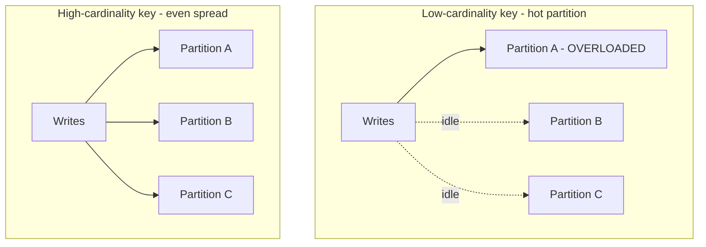

**Why the other options are wrong:**

- **Reduce the number of partition keys** - Fewer distinct key values concentrates traffic onto fewer partitions, making hot partitions and throttling worse, not better. You want more distinct values, not fewer.
- **Use low-cardinality partition keys** - This is the opposite of the goal. Few distinct values (e.g., a boolean or small enum) cluster items together and cause uneven load and throttling.
- **Avoid a composite primary key (partition + sort key)** - A composite key is fine and often beneficial; it lets you store many items under well-distributed partition keys while organizing them by sort key. Avoiding it does nothing to improve write distribution.

**References:**

[https://docs.aws.amazon.com/amazondynamodb/latest/developerguide/bp-partition-key-uniform-load.html](https://docs.aws.amazon.com/amazondynamodb/latest/developerguide/bp-partition-key-uniform-load.html)

[https://aws.amazon.com/blogs/database/choosing-the-right-dynamodb-partition-key/](https://aws.amazon.com/blogs/database/choosing-the-right-dynamodb-partition-key/)

**Domain:** Design High-Performing Architectures

---

### Question 17

A company plans to launch an Amazon EC2 instance in a private subnet for its internal corporate web portal. For security purposes, the EC2 instance must send data to Amazon DynamoDB and Amazon S3 via private endpoints that don't pass through the public Internet, which does not involve NAT Instances.

Which of the following can meet the above requirements?

**Answer:**

Use a DynamoDB VPC endpoint and an S3 VPC endpoint to route all access to these services via private endpoints.

**Overall Explanation:**

DynamoDB and S3 are **regional services with public API endpoints**, so by default an EC2 instance in a private subnet would have to reach them over the Internet (typically through a NAT gateway and Internet gateway). The requirement is to reach both services **privately, without traversing the public Internet and without NAT**. The purpose-built answer is a **Gateway VPC endpoint** for each service.

A Gateway VPC endpoint adds a route in the subnet's route table (via a prefix list) that sends traffic destined for S3 or DynamoDB straight onto the AWS network through the endpoint, never leaving Amazon's backbone. The instance needs no public IP, no NAT instance, and no NAT gateway. Gateway endpoints (S3 and DynamoDB) also incur no hourly or data-processing charge, so they are cheaper than routing the same traffic through NAT.

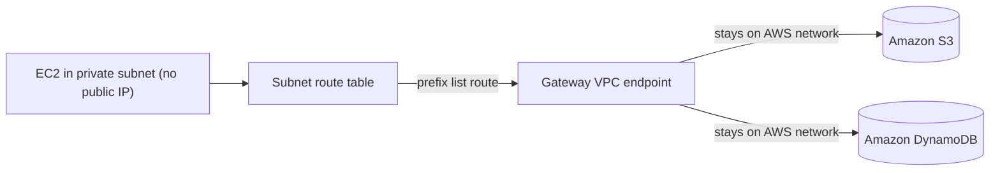

**Why the other options are wrong:**

- **Enable DynamoDB encryption at rest and S3 server-side encryption** - Encryption protects stored data confidentiality; it does not change network routing. Traffic would still go over the public path, so the "no public Internet" requirement is unmet.
- **Use AWS Direct Connect** - Direct Connect provides a dedicated link between an on-premises data center and AWS. There is no on-premises/hybrid component here, and it is not how an in-VPC instance privately reaches S3/DynamoDB.
- **Use AWS VPN CloudHub** - CloudHub is a hub-and-spoke pattern for connecting multiple remote sites over VPN. It is for site-to-site connectivity, not for giving a VPC private access to S3 and DynamoDB.

**References:**

[https://docs.aws.amazon.com/amazondynamodb/latest/developerguide/vpc-endpoints-dynamodb.html](https://docs.aws.amazon.com/amazondynamodb/latest/developerguide/vpc-endpoints-dynamodb.html)

[https://docs.aws.amazon.com/vpc/latest/privatelink/gateway-endpoints.html](https://docs.aws.amazon.com/vpc/latest/privatelink/gateway-endpoints.html)

**Domain:** Design High-Performing Architectures

---

### Question 18

An online learning company hosts its Microsoft .NET e-Learning application on a Windows Server in its on-premises data center. The application uses an Oracle Database Standard Edition as its backend database.

The company wants a high-performing solution to migrate this workload to the AWS cloud to take advantage of the cloud’s high availability. The migration process should minimize development changes, and the environment should be easier to manage.

Which of the following options should be implemented to meet the company requirements? (Select TWO.)

**Answer:**

- Rehost the on-premises .NET application to an AWS Elastic Beanstalk Multi-AZ environment which runs in multiple Availability Zones.
- Perform a homogeneous migration by moving the Oracle database to Amazon RDS for Oracle in a Multi-AZ deployment using AWS Database Migration Service (AWS DMS).

**Overall Explanation:**

Two requirements drive this design: the migration must **minimize development (code) changes** and the result must be **highly available and easier to manage**. That points to a **rehost ("lift-and-shift")** strategy for the app and a **homogeneous database migration** (Oracle to Oracle), avoiding any engine conversion or code rewrite.

For the application, **AWS Elastic Beanstalk** runs ASP.NET/IIS workloads natively and handles provisioning, load balancing, auto scaling, and health monitoring for you. Deploying to a **Multi-AZ** Elastic Beanstalk environment spreads instances across Availability Zones for high availability with essentially no code change - a true rehost. For the database, the source and target engine are both Oracle, so a **homogeneous** migration with **AWS DMS** into **Amazon RDS for Oracle (Multi-AZ)** copies the data (and can keep changes replicating until cutover) while RDS provides managed backups, patching, and synchronous standby failover.

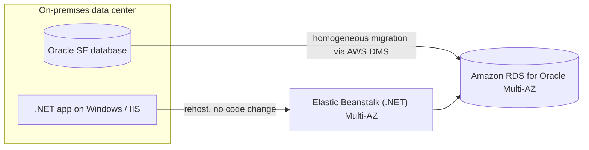

**Why the other options are wrong:**

- **Refactor to .NET Core on EKS with Fargate** - Refactoring to .NET Core and containerizing is a significant code change, directly violating the "minimize development changes" requirement.
- **Use AWS Application Migration Service (MGN) to move the Oracle DB to an EC2 instance** - MGN lift-and-shifts whole servers to self-managed EC2, leaving you to manage and patch the database yourself. A managed Amazon RDS for Oracle target via DMS is the better, easier-to-manage fit for a homogeneous Oracle migration.
- **Replatform to ECS on EC2 worker nodes using a Windows AMI / ECS Anywhere** - This is a replatform that requires containerization work and still leaves you managing the EC2 worker nodes. Elastic Beanstalk meets the "no code change / easier to manage" goals far better.

**References:**

[https://docs.aws.amazon.com/dms/latest/userguide/Welcome.html](https://docs.aws.amazon.com/dms/latest/userguide/Welcome.html)

[https://docs.aws.amazon.com/elasticbeanstalk/latest/dg/create_deploy_NET.html](https://docs.aws.amazon.com/elasticbeanstalk/latest/dg/create_deploy_NET.html)

**Domain:** Design High-Performing Architectures

---

### Question 19

A company has 3 DevOps engineers that are handling its software development and infrastructure management processes. One of the engineers accidentally deleted a file hosted in Amazon S3 which has caused disruption of service.

What can the DevOps engineers do to prevent this from happening again?

**Answer:**

Enable S3 Versioning and Multi-Factor Authentication Delete on the bucket.

**Overall Explanation:**

The problem is an **accidental, irreversible deletion** of an S3 object. Two S3 features work together to guard against this:

- **S3 Versioning** keeps every version of an object in the bucket. A "delete" on a versioned object simply adds a _delete marker_ instead of removing data, so you can restore the previous version instantly - this recovers from the accidental delete.
- **MFA Delete** adds a second layer: it requires a valid multi-factor authentication code (presented by the bucket owner/root) to permanently delete an object version or to change the bucket's versioning state. This stops a casual or accidental permanent deletion even by someone with credentials.

Together they let you both recover deleted objects and block irreversible deletes, which is exactly what the engineers need.

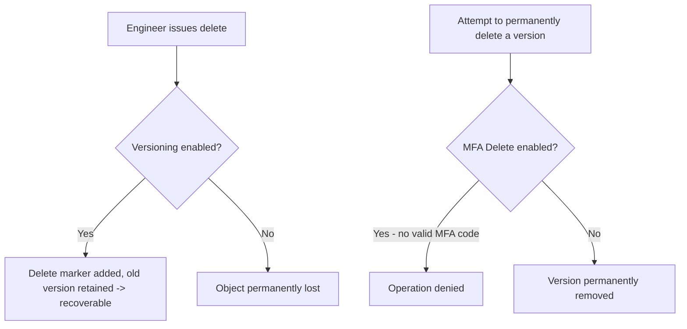

**Why the other options are wrong:**

- **Use S3 Infrequent Access storage** - Storage classes only change cost/access-frequency tradeoffs and durability tiers; they do nothing to prevent or recover from deletions.
- **Set up a signed (pre-signed) URL for all users** - Pre-signed URLs grant temporary, controlled _access_ to objects. They govern who can read/write, not protection against accidental deletion.
- **Create a bucket policy that disables the delete operation** - Blanket-blocking deletes prevents legitimate deletions too, breaking normal operations. The goal is to prevent _accidental_ loss while still allowing intentional deletes (which Versioning + MFA Delete achieve).

**References:**

[https://docs.aws.amazon.com/AmazonS3/latest/userguide/Versioning.html](https://docs.aws.amazon.com/AmazonS3/latest/userguide/Versioning.html)

[https://docs.aws.amazon.com/AmazonS3/latest/userguide/MultiFactorAuthenticationDelete.html](https://docs.aws.amazon.com/AmazonS3/latest/userguide/MultiFactorAuthenticationDelete.html)

**Domain:** Design Secure Architectures

---

### Question 20

A company hosted an e-commerce website on an Auto Scaling group of Amazon EC2 instances behind an Application Load Balancer. The Solutions Architect noticed that the website is receiving a high number of illegitimate external requests from multiple systems with frequently changing IP addresses. To address the performance issues, the Solutions Architect must implement a solution that would block these requests while having minimal impact on legitimate traffic.

Which of the following options fulfills this requirement?

**Answer:**

Create a rate-based rule in AWS WAF and associate the web ACL to an Application Load Balancer.

**Overall Explanation:**

Amazon EC2 instances sitting behind an Application Load Balancer operate at the HTTP layer (OSI Layer 7), so the right tool to inspect and filter web requests is **AWS WAF (Web Application Firewall)**. WAF attaches a _web ACL_ directly to the ALB and evaluates every incoming HTTP/HTTPS request in-region before it ever reaches the EC2 fleet, so malicious traffic is dropped at the edge of your application tier rather than consuming compute capacity.

The attack described is a flood of requests coming from many machines whose IP addresses keep changing. A static IP block list is useless here because the source IPs are not stable. The feature designed for exactly this situation is a **rate-based rule**.

A rate-based rule counts the number of requests arriving from each individual source IP over a rolling **5-minute window**. When an IP exceeds the configured threshold, WAF automatically blocks (or applies the chosen action to) further requests from that IP until its rate drops back below the limit. Legitimate users almost never breach a sensibly set threshold, so genuine traffic is largely unaffected while abusive senders are throttled. This satisfies the requirement of blocking the bad traffic with minimal impact on real customers.

```mermaid
flowchart LR
    A["Many clients<br/>(changing IPs)"] -->|HTTP requests| W["AWS WAF web ACL<br/>(rate-based rule)"]
    W -->|"rate &gt; limit / 5 min"| B["Block IP<br/>until rate drops"]
    W -->|"rate within limit"| ALB[Application Load Balancer]
    ALB --> ASG["Auto Scaling group<br/>of EC2 instances"]
```

Hence, the correct answer is: **Create a rate-based rule in AWS WAF and associate the web ACL to an Application Load Balancer.**

**Why the other options are wrong:**

- **Create a regular rule in AWS WAF and associate the web ACL to an Application Load Balancer** — A regular (non rate-based) rule only matches on static conditions such as a string, header, IP set, or SQLi/XSS pattern. It has no notion of request _frequency_, so it cannot throttle an IP that is simply sending too many otherwise-valid requests. You specifically need the rate-based variant to enforce a per-IP request limit.
- **Create a custom network ACL and associate it with the subnet of the Application Load Balancer to block the offending requests** — A network ACL operates at Layer 3/4 (IP/port) and can only allow or deny by static CIDR ranges. It cannot count requests per IP, cannot react to constantly rotating source IPs, and would require manual rule edits. NACLs also have a limited number of entries, making this approach unworkable against a distributed, dynamic source set.
- **Create a private connection using AWS PrivateLink to block the offending requests** — PrivateLink only provides private network connectivity between VPCs and AWS services over the AWS backbone. It is a connectivity feature, not a request-filtering or security-inspection service: it cannot read HTTP traffic, measure request rates, or block abusive IPs.

**References:**

[https://docs.aws.amazon.com/waf/latest/developerguide/waf-rule-statement-type-rate-based.html](https://docs.aws.amazon.com/waf/latest/developerguide/waf-rule-statement-type-rate-based.html)

[https://aws.amazon.com/waf/faqs/](https://aws.amazon.com/waf/faqs/)

**Domain:** Design Secure Architectures

---

### Question 21

A tech company has a CRM application hosted on an Auto Scaling group of On-Demand EC2 instances with different instance types and sizes. The application is extensively used during office hours from 9 in the morning to 5 in the afternoon. Their users are complaining that the performance of the application is slow during the start of the day but then works normally after a couple of hours.

Which of the following is the MOST operationally efficient solution to implement to ensure the application works properly at the beginning of the day?

**Answer:**

Configure a Scheduled scaling policy for the Auto Scaling group to launch new instances before the start of the day.

**Overall Explanation:**

The application's load is **predictable**: it ramps up sharply at 9 a.m. and stays busy until 5 p.m. The slowness reported "at the start of the day" is the classic symptom of _reactive_ scaling — the group only adds instances after metrics climb, so users feel pain during the warm-up gap while new instances launch, boot, and pass health checks.

Because the timing of the peak is known in advance, the most operationally efficient fix is a **scheduled scaling action**. You tell EC2 Auto Scaling to change the minimum, maximum, and desired capacity at a specific time (for example, bump desired capacity just before 9 a.m. and lower it after 5 p.m.). The extra instances are therefore already running and in-service the moment demand arrives, eliminating the start-of-day lag entirely. Scheduled actions can be one-time or recurring (cron-style).

```mermaid
flowchart TD
    subgraph Scheduled["Scheduled scaling (chosen)"]
        T1["~8:30 AM trigger"] --> S1["Raise desired capacity<br/>BEFORE peak"]
        S1 --> R1["Instances ready at 9 AM<br/>no slowdown"]
    end
    subgraph Dynamic["Dynamic / target tracking"]
        M["CPU or memory climbs"] --> D1["Then add instances"]
        D1 --> L1["Warm-up gap = slow start"]
    end
```

Hence, **configuring a Scheduled scaling policy for the Auto Scaling group to launch new instances before the start of the day** is the correct answer. Capacity is provisioned ahead of the rush so the application performs well from the first request.

**Why the other options are wrong:**

- **Configure a Dynamic scaling policy ... based on CPU utilization** and **Configure a Dynamic scaling policy ... based on Memory utilization** — Both are valid scaling techniques, but they are _reactive_: scaling only begins after the metric crosses a threshold, by which point users are already experiencing the slowness. Since the peak time is known precisely, pre-provisioning on a schedule is more efficient and avoids the warm-up delay these options suffer from.
- **Configure a Predictive scaling policy for the Auto Scaling group to automatically adjust the number of Amazon EC2 instances** — Predictive scaling can forecast load, but it assumes a _homogeneous_ group where every instance contributes roughly equal capacity. This group deliberately mixes different instance types and sizes, so the capacity forecast would be unreliable. With a known, fixed schedule, scheduled scaling is the simpler and more dependable choice.

**References:**

[https://docs.aws.amazon.com/autoscaling/ec2/userguide/schedule_time.html](https://docs.aws.amazon.com/autoscaling/ec2/userguide/schedule_time.html)

[https://docs.aws.amazon.com/autoscaling/ec2/userguide/ec2-auto-scaling-scheduled-scaling.html](https://docs.aws.amazon.com/autoscaling/ec2/userguide/ec2-auto-scaling-scheduled-scaling.html)

[https://docs.aws.amazon.com/autoscaling/ec2/userguide/ec2-auto-scaling-predictive-scaling.html#predictive-scaling-limitations](https://docs.aws.amazon.com/autoscaling/ec2/userguide/ec2-auto-scaling-predictive-scaling.html#predictive-scaling-limitations)

**Domain:** Design High-Performing Architectures

---

### Question 22

A global IT company with offices around the world has multiple AWS accounts. To improve efficiency and drive costs down, the Chief Information Officer (CIO) wants to set up a solution that centrally manages their AWS resources. This will allow them to procure AWS resources centrally and share resources such as AWS Transit Gateways, AWS License Manager configurations, or Amazon Route 53 Resolver rules across their various accounts.

As the Solutions Architect, which combination of options should you implement in this scenario? (Select TWO.)

**Answer:**

- Use the AWS Resource Access Manager (RAM) service to easily and securely share your resources with your AWS accounts.
- Consolidate all of the company's accounts using AWS Organizations.

**Overall Explanation:**

This scenario has two distinct needs that map to two distinct services: (1) bring many independent AWS accounts under one centrally managed umbrella, and (2) share specific resources across those accounts without duplicating them.

**AWS Organizations** solves the first need. It consolidates separate AWS accounts into a single organization, giving you consolidated billing, the ability to create or invite member accounts, group them into organizational units, and apply organization-wide policy controls (such as SCPs). This is the foundation for governing a multi-account estate centrally.

**AWS Resource Access Manager (RAM)** solves the second need. RAM lets one account create a resource once and securely _share_ it with other accounts (or with the whole organization) instead of provisioning a copy in each account. The exact resource types named in the question — **Transit Gateways, AWS License Manager configurations, and Route 53 Resolver rules** — are all RAM-shareable. You create a resource share, add the resources, and add the principals (accounts or OUs). RAM itself carries no additional charge, which directly supports the CIO's cost-reduction goal by removing duplicate resources and their operational overhead.

```mermaid
flowchart TD
    Org["AWS Organizations<br/>(central governance &amp; billing)"]
    Org --> A1[Account A]
    Org --> A2[Account B]
    Org --> A3[Account C]
    Share["AWS RAM resource share<br/>(Transit Gateway, License Manager,<br/>Route 53 Resolver rules)"]
    A1 -. owns &amp; shares .-> Share
    Share -. shared with .-> A2
    Share -. shared with .-> A3
```

Hence, the correct combination is **Consolidate all of the company's accounts using AWS Organizations** and **Use the AWS Resource Access Manager (RAM) service to easily and securely share your resources with your AWS accounts.**

**Why the other options are wrong:**

- **Use AWS Identity and Access Management to set up cross-account access ...** — IAM cross-account roles can delegate access, but doing this for resource sharing across many accounts is manual, repetitive, and high-overhead: you would hand-craft trust and permission policies for each account pair. RAM is purpose-built for sharing resources across accounts with far less effort.
- **Use AWS Control Tower to easily and securely share your resources ...** — Control Tower automates the _setup and governance_ of a new, well-architected multi-account landing zone. It is not a resource-sharing mechanism; the actual cross-account sharing of Transit Gateways or Resolver rules is still done with RAM.
- **Consolidate all of the company's accounts using AWS ParallelCluster** — ParallelCluster is an open-source tool for deploying and managing High-Performance Computing (HPC) clusters. It has nothing to do with consolidating or governing AWS accounts; AWS Organizations is the correct service for that.

**References:**

[https://aws.amazon.com/ram/](https://aws.amazon.com/ram/)

[https://docs.aws.amazon.com/ram/latest/userguide/shareable.html](https://docs.aws.amazon.com/ram/latest/userguide/shareable.html)

**Domain:** Design High-Performing Architectures

---

### Question 23

An organization requires a persistent block storage volume to support its mission-critical workloads. The backup data will be stored in an object storage service and, after 30 days, transitioned to an archival storage service for long-term retention. The team has already configured an Amazon EBS snapshot retention rule for point-in-time recovery.

What should be done to meet the above requirement?

**Answer:**

Attach an EBS volume to your Amazon EC2 instance. Use Amazon S3 to store your backup data and configure a lifecycle policy to transition your objects to S3 Glacier Flexible Retrieval.

**Overall Explanation:**

The requirement breaks into three storage tiers, each served by a different AWS service:

1. **Persistent block storage for mission-critical workloads** → **Amazon EBS**. EBS volumes provide durable, low-latency block storage that survives instance stop/start and can be detached and re-attached. This durability is exactly why it suits mission-critical data, unlike ephemeral instance store.
2. **Object storage for backups** → **Amazon S3**. S3 gives highly durable, scalable object storage and, crucially, supports **lifecycle policies** that automatically transition objects between storage classes over time.
3. **Archival storage after 30 days** → **S3 Glacier Flexible Retrieval**, a low-cost class purpose-built for long-term archival where retrieval latency is acceptable in exchange for much cheaper storage.

So the design is: attach an EBS volume to the EC2 instance, write backups to S3, and add an S3 lifecycle rule that transitions objects to Glacier Flexible Retrieval after 30 days.

```mermaid
flowchart LR
    EC2[EC2 instance] -->|persistent block storage| EBS["Amazon EBS volume<br/>(mission-critical data)"]
    EC2 -->|write backups| S3["Amazon S3<br/>(S3 Standard)"]
    S3 -->|"lifecycle rule: after 30 days"| GFR["S3 Glacier<br/>Flexible Retrieval<br/>(long-term archive)"]
```

The mention of an **EBS snapshot retention rule is a distractor**. EBS snapshots are stored in S3 internally but are managed by the EBS/EC2 service, not as ordinary S3 objects — you cannot point an S3 lifecycle policy at them or transition them to a Glacier class via S3 lifecycle. The archival here must come from S3 lifecycle acting on the backup objects, not on snapshots.

Hence, the correct answer is: **Attach an EBS volume to your Amazon EC2 instance. Use Amazon S3 to store your backup data and configure a lifecycle policy to transition your objects to S3 Glacier Flexible Retrieval.**

**Why the other options are wrong:**

- **Attach an EBS volume ... transition your objects to S3 One Zone-IA** — One Zone-IA is an _infrequent access_ class (data kept in a single AZ), not an archival class. It does not meet the long-term archival requirement and offers less durability than the multi-AZ classes; Glacier Flexible Retrieval is the correct archival target.
- **Attach an instance store volume ... transition your objects to S3 Glacier Flexible Retrieval** — Instance store is ephemeral: its data is lost when the instance stops, terminates, or the underlying hardware fails, which disqualifies it for mission-critical persistent storage. It also can only be specified at launch and cannot be attached to an already-running instance.
- **Attach an instance store volume ... transition your objects to S3 One Zone-IA** — This fails on both counts: ephemeral instance store is unsuitable for mission-critical data, and One Zone-IA is an infrequent-access tier rather than the required archival storage class.

**References:**

[https://docs.aws.amazon.com/AWSEC2/latest/UserGuide/AmazonEBS.html](https://docs.aws.amazon.com/AWSEC2/latest/UserGuide/AmazonEBS.html)

[https://aws.amazon.com/s3/storage-classes/](https://aws.amazon.com/s3/storage-classes/)

[https://docs.aws.amazon.com/AmazonS3/latest/userguide/lifecycle-transition-general-considerations.html](https://docs.aws.amazon.com/AmazonS3/latest/userguide/lifecycle-transition-general-considerations.html)

**Domain:** Design Resilient Architectures

---

### Question 24

A government entity is conducting a population and housing census in the city. Each household information uploaded on their online portal is stored in encrypted files in Amazon S3. The government assigned its Solutions Architect to set compliance policies that verify data containing personally identifiable information (PII) in a manner that meets their compliance standards. They should also be alerted if there are potential policy violations with the privacy of their S3 buckets.

Which of the following should the Architect implement to satisfy this requirement?

**Answer:**

m  
Set up and configure Amazon Macie to monitor their Amazon S3 data.

**Overall Explanation:**

The requirement is to automatically discover and classify **personally identifiable information (PII)** sitting in Amazon S3, verify it against compliance policies, and raise alerts when a bucket's security or privacy posture is at risk. The AWS service built specifically for this is **Amazon Macie**.

Macie is a managed data-security service that uses machine learning and pattern matching to inspect S3 objects, recognize sensitive data such as PII, and report where that data lives. It continuously evaluates buckets and produces two kinds of findings:

- **Policy findings** — flag a bucket whose security or privacy settings create a potential violation (for example, a bucket that becomes public or loses encryption). This is what generates the privacy-violation alerts the scenario asks for.
- **Sensitive data findings** — detailed reports identifying the actual sensitive data (like PII) discovered by a sensitive-data discovery job.

```mermaid
flowchart LR
    S3["Amazon S3 buckets<br/>(census data with PII)"] --> Macie[Amazon Macie]
    Macie --> SDF["Sensitive data findings<br/>(detected PII)"]
    Macie --> PF["Policy findings<br/>(bucket privacy / security risk)"]
    PF --> Alert["Alerts to security team<br/>(via EventBridge / Security Hub)"]
```

Hence, the correct answer is: **Set up and configure Amazon Macie to monitor their Amazon S3 data.**

**Why the other options are wrong:**

- **Set up and configure Amazon Polly to scan for usage patterns on Amazon S3 data** — Polly is a text-to-speech service that synthesizes lifelike audio from text. It has no ability to scan S3, classify data, or detect PII.
- **Set up and configure Amazon Kendra to monitor malicious activity on their Amazon S3 data** — Kendra is an enterprise _search_ service that helps users find information across content repositories. It does not perform security monitoring, data classification, or PII detection.
- **Set up and configure Amazon Fraud Detector to send out alert notifications whenever a security violation is detected** — Fraud Detector is a managed service for identifying potentially fraudulent online activity (e.g., fake accounts, payment fraud). It does not inspect S3 objects for PII or evaluate bucket privacy, which is precisely Macie's role.

**References:**

[https://docs.aws.amazon.com/macie/latest/userguide/what-is-macie.html](https://docs.aws.amazon.com/macie/latest/userguide/what-is-macie.html)

[https://aws.amazon.com/macie/faq/](https://aws.amazon.com/macie/faq/)

[https://docs.aws.amazon.com/macie/index.html](https://docs.aws.amazon.com/macie/index.html)

**Domain:** Design Secure Architectures

---

### Question 25

A medical records company is planning to store sensitive clinical trial data in an Amazon S3 repository with the object-level versioning feature enabled. The Solutions Architect is tasked with ensuring that no object can be overwritten or deleted by any user for a period of one year only. To meet the strict compliance requirements, the root user of the company’s AWS account must also be restricted from making any changes to an object in the S3 bucket. Backup Vault Lock offers similar immutability, but the company requires object-level protection in S3.

Which of the following is the most secure way of storing the data in S3?

**Answer:**

Enable S3 Object Lock in compliance mode with a retention period of one year.

**Overall Explanation:**

The defining clause in this scenario is that **even the AWS account root user must be unable to delete or overwrite an object** for a fixed one-year period. That single requirement points to exactly one configuration: **S3 Object Lock in compliance mode with a one-year retention period**.

S3 Object Lock implements a **write-once-read-many (WORM)** model. It must be enabled when the bucket is created (and the bucket must have versioning), after which individual object versions can be protected. Object Lock offers two retention modes:

```mermaid
flowchart TD
    OL["S3 Object Lock (WORM)"] --> G["Governance mode"]
    OL --> C["Compliance mode"]
    G --> G1["Privileged users with<br/>s3:BypassGovernanceRetention<br/>CAN delete / shorten"]
    C --> C1["NO ONE can delete or overwrite<br/>— not even the root user"]
    C --> C2["Retention period cannot be<br/>shortened or removed"]
    C --> C3["Retention period: 1 year<br/>(time-bound, then unlocks)"]
```

- **Governance mode** protects objects from most users, but anyone holding the `s3:BypassGovernanceRetention` permission (and the root user) can still override the lock, shorten the period, or delete the object. That is insufficient when the root user itself must be blocked.
- **Compliance mode** is absolute: for the duration of the retention period, _no one_ — including the root user — can overwrite or delete the object version, and the retention period cannot be shortened or removed. This is the only mode that satisfies the "restrict even the root user" requirement.

A **retention period** is the correct mechanism for the "one year only" constraint because it is time-bound and automatically expires. A **legal hold**, by contrast, has no time component: it stays in effect until someone with `s3:PutObjectLegalHold` manually removes it, so it cannot express a fixed one-year duration. (Backup Vault Lock offers comparable immutability, but it protects backup recovery points, not S3 objects, so it does not fit the object-level requirement here.)

Hence, the correct answer is: **Enable S3 Object Lock in compliance mode with a retention period of one year.**

**Why the other options are wrong:**

- **Enable S3 Object Lock in governance mode with a retention period of one year** — Governance mode can be bypassed by privileged users and the root user, so it fails the explicit requirement that the root user be unable to change objects. Compliance mode is required.
- **Enable S3 Object Lock in governance mode with a legal hold of one year** — Two problems: a legal hold cannot be given a fixed duration (it persists until manually removed, so it would not cleanly end after one year), and governance mode still allows the root user to override protection.
- **Enable S3 Object Lock in compliance mode with a legal hold of one year** — Compliance mode is right, but a legal hold has no associated time period, so you cannot configure it for "one year." The one-year, time-bound constraint must be expressed as a retention period.

**References:**

[https://docs.aws.amazon.com/AmazonS3/latest/userguide/object-lock.html](https://docs.aws.amazon.com/AmazonS3/latest/userguide/object-lock.html)

[https://docs.aws.amazon.com/AmazonS3/latest/userguide/object-lock-overview.html](https://docs.aws.amazon.com/AmazonS3/latest/userguide/object-lock-overview.html)

**Domain:** Design Secure Architectures

---

### Question 26

A healthcare organization wants to build a system that can predict drug prescription abuse. The organization will gather real-time data from multiple sources, which include Personally Identifiable Information (PII). It's crucial that this sensitive information is anonymized prior to landing in a NoSQL database for further processing.

Which solution would meet the requirements?

**Answer:**

Ingest real-time data using Amazon Kinesis Data Stream. Use an AWS Lambda function to anonymize the PII, then store it in Amazon DynamoDB.

**Overall Explanation:**

The hard constraint is in the wording: PII must be anonymized **before it lands in any storage system**. So the anonymization step has to happen _in transit_, while the data is still flowing through the pipeline — never after it has already been written somewhere. The destination is also specified as a **NoSQL database**.

**Amazon Kinesis Data Streams (KDS)** is a massively scalable, durable real-time streaming service that can ingest data from many producers simultaneously. It integrates natively with **AWS Lambda**: as records flow through the stream, Lambda is invoked to transform them — here, to strip or anonymize the PII — _before_ anything is persisted. The cleaned records are then written to **Amazon DynamoDB**, a fully managed NoSQL database, which matches both the storage type and the downstream analytics need (predicting prescription abuse). This ordering guarantees no raw PII is ever stored.

```mermaid
flowchart LR
    Src["Real-time sources<br/>(contains PII)"] --> KDS[Amazon Kinesis Data Streams]
    KDS --> L["AWS Lambda<br/>(anonymize PII in transit)"]
    L --> DDB["Amazon DynamoDB<br/>(NoSQL — anonymized data only)"]
    DDB --> An["Further processing<br/>(abuse prediction)"]
```

Hence, the correct answer is: **Ingest real-time data using Amazon Kinesis Data Stream. Use an AWS Lambda function to anonymize the PII, then store it in Amazon DynamoDB.**

**Why the other options are wrong:**

- **Create a data lake in Amazon S3 ... use an S3 trigger to run a Lambda that performs anonymization. Send the anonymized data to DynamoDB** — This writes raw PII to S3 _first_ and only anonymizes afterward, when the S3 event fires. Storing unanonymized PII even briefly violates the "anonymize before landing in storage" requirement and needlessly increases exposure risk.
- **Stream the data into a DynamoDB table, enable DynamoDB Streams, and run a Lambda with `AmazonDynamoDBFullAccess` to anonymize newly written items** — DynamoDB Streams reacts to items _after_ they are already written, so raw PII is persisted before anonymization — again breaking the requirement. Granting `AmazonDynamoDBFullAccess` also violates least privilege by giving far broader permissions than the task needs.
- **Deploy an Amazon Data Firehose stream to capture and transform the data, then deliver it to Amazon Redshift** — Although Firehose can transform in transit, the destination Redshift is a _relational_ data warehouse, not a NoSQL database. The requirement explicitly calls for a NoSQL store, so this option does not fit.

**References:**

[https://aws.amazon.com/kinesis/data-streams/](https://aws.amazon.com/kinesis/data-streams/)

[https://docs.aws.amazon.com/lambda/latest/dg/with-kinesis.html](https://docs.aws.amazon.com/lambda/latest/dg/with-kinesis.html)

**Domain:** Design High-Performing Architectures

---

### Question 27

An application that records weather data every minute is deployed in a fleet of Amazon EC2 Spot instances and uses a MySQL RDS database instance. Currently, there is only one Amazon RDS instance running in one Availability Zone. The database needs to be improved to ensure high availability by enabling synchronous data replication to another RDS instance.

Which of the following performs synchronous data replication in RDS?

**Answer:**

RDS DB instance running as a Multi-AZ deployment

**Overall Explanation:**

The keyword in this scenario is _synchronous_ replication, and within Amazon RDS that capability is delivered by a **Multi-AZ deployment**. When you enable Multi-AZ, RDS provisions a standby copy of your database in a _different_ Availability Zone and commits every write to both the primary and the standby before acknowledging the transaction to the application. Because the standby is always byte-for-byte current, RDS can automatically fail over to it (updating the DB endpoint's DNS record) if the primary instance, its storage, or the entire AZ becomes unavailable, with no data loss. Note that the standby is not used for read traffic; its sole purpose is durability and high availability.

```mermaid
flowchart LR
    APP["Weather app on EC2 Spot fleet"] -->|writes| P[("Primary RDS MySQL - AZ-a")]
    P -->|"synchronous replication (commit on both)"| S[("Standby RDS MySQL - AZ-b")]
    P -.->|"automatic failover on AZ/instance failure"| S
```

Therefore, the correct answer is: **RDS DB instance running as a Multi-AZ deployment**

**Why the other options are wrong:**

- **RDS Read Replica** uses _asynchronous_ replication. Writes are applied to the source first and streamed to the replica afterward, so the replica can lag behind. This is built for scaling read traffic, not for the zero-data-loss synchronous requirement described here.
- **Amazon DynamoDB Read Replica** is not a real feature. DynamoDB scales reads/writes on its own and replicates across Regions using _global tables_; it is also a NoSQL service, not the MySQL engine the application uses.
- **Amazon CloudFront running as a Multi-AZ deployment** is a content delivery network that caches static and dynamic content at edge locations. It performs no database replication of any kind and cannot satisfy the requirement.

**References:**

[https://aws.amazon.com/rds/details/multi-az/](https://aws.amazon.com/rds/details/multi-az/)

[https://aws.amazon.com/rds/features/multi-az/](https://aws.amazon.com/rds/features/multi-az/)

**Domain:** Design Secure Applications and Architectures

---

### Question 28

An online medical system hosted in AWS stores sensitive Personally Identifiable Information (PII) of the users in an Amazon S3 bucket. Both the master keys and the unencrypted data should never be sent to AWS to comply with the strict compliance and regulatory requirements of the company.

Which S3 encryption technique should the Architect use?

**Answer:**

Use S3 client-side encryption with a client-side master key.

**Overall Explanation:**

The compliance rule here is absolute: _neither the master key nor any unencrypted data may ever reach AWS_. That eliminates every server-side option (where AWS performs the encryption on its disks) and even client-side encryption that relies on KMS (where you hand AWS a KMS key reference and AWS does the data-key work). The only design that keeps both the keys and the plaintext entirely outside AWS is **S3 client-side encryption with a client-side master key**: your application encrypts each object locally before the upload, and your root/master key never leaves your environment.

How the client-side master key flow works:

- **Upload:** The Amazon S3 encryption client generates a fresh one-time symmetric data key locally and uses it to encrypt the object. It then wraps (encrypts) that data key with _your_ client-side master key, and stores the wrapped data key plus a material description in the object metadata. Only ciphertext is sent to S3.
- **Download:** The client reads the material description from the object metadata to identify which master key to use, unwraps the data key with that master key, and finally decrypts the object locally.

Because AWS only ever sees ciphertext and a wrapped key it cannot open, the requirement is fully met. The trade-off is that _you_ are solely responsible for safeguarding the master key; if you lose it, the data is unrecoverable.

```mermaid
flowchart TD
    subgraph onprem["Customer environment (keys never leave here)"]
        MK["Client-side master key"]
        DK["Random data key (per object)"]
        PLAIN["Plaintext PII object"]
        PLAIN -->|"encrypt with data key"| CIPHER["Encrypted object"]
        MK -->|wrap| EDK["Encrypted data key"]
        DK --> EDK
        DK --> PLAIN
    end
    CIPHER -->|upload ciphertext only| S3[("Amazon S3 bucket")]
    EDK -->|stored as object metadata| S3
```

Hence, the correct answer is: **Use S3 client-side encryption with a client-side master key**.

**Why the other options are wrong:**

- **Use S3 client-side encryption with an AWS KMS key** still sends a KMS key identifier to AWS and lets KMS generate/decrypt the data key, so a key reference managed by AWS is involved. The scenario forbids any master key from being sent to AWS.
- **Use S3 server-side encryption with an AWS KMS key (SSE-KMS)** fails on two counts: the data is uploaded as plaintext (AWS encrypts it only after it arrives), and the customer master key is created and managed inside AWS KMS. Both violate the stated constraints.
- **Use S3 server-side encryption with a customer-provided key (SSE-C)** is also server-side: AWS receives the plaintext and does the encryption on disk, and you transmit the encryption key with each request. Sending plaintext and a key to AWS breaks the requirement.

**References:**

[https://docs.aws.amazon.com/AmazonS3/latest/dev/UsingEncryption.html](https://docs.aws.amazon.com/AmazonS3/latest/dev/UsingEncryption.html)

[https://docs.aws.amazon.com/AmazonS3/latest/dev/UsingClientSideEncryption.html](https://docs.aws.amazon.com/AmazonS3/latest/dev/UsingClientSideEncryption.html)

**Domain:** Design Secure Architectures

---

### Question 29

An AI-powered Forex trading application consumes thousands of data sets to train its machine learning model. The application’s workload requires a high-performance, parallel hot storage to process the training datasets concurrently. It also needs cost-effective cold storage to archive those datasets that yield low profit.

Which of the following Amazon storage services should the developer use?

**Answer:**

Use Amazon FSx For Lustre and Amazon S3 for hot and cold storage respectively.

**Overall Explanation:**

Data is described by how often it is touched: **hot** data is accessed constantly, **warm** data occasionally, and **cold** data rarely. As a rule, the colder the tier, the cheaper it is to store but the slower/costlier it is to retrieve. This question has two distinct needs, so the right answer pairs two services.

1. _Hot, high-performance, parallel storage_ for concurrent ML training reads -> **Amazon FSx for Lustre**, which exposes data through the open-source Lustre parallel file system. Lustre stripes a file across many storage servers so thousands of compute clients can read it in parallel with sub-millisecond latency and very high throughput, exactly what training a model on thousands of datasets demands. It also integrates natively with S3.
2. _Cold, cheap archival storage_ for low-value datasets -> **Amazon S3**, whose Glacier and Glacier Deep Archive classes give extremely low per-GB pricing for data that is seldom retrieved.

```mermaid
flowchart LR
    DS["Training datasets"] --> FSX["Amazon FSx for Lustre - HOT: parallel, high-throughput"]
    FSX -->|"concurrent reads"| ML["ML training cluster"]
    FSX <-->|"native data sync"| S3[("Amazon S3 - COLD: Glacier / Deep Archive")]
    ML -->|"archive low-profit datasets"| S3
```

Hence, the correct answer is: **Use Amazon FSx For Lustre and Amazon S3 for hot and cold storage respectively.**

**Why the other options are wrong:**

- **Amazon FSx for Lustre + EBS Provisioned IOPS SSD (io1) for cold storage** is wrong because io1 is a premium _hot_ block volume built for low-latency, I/O-intensive workloads. Even the EBS "Cold HDD" (sc1) class is far more expensive than S3 Glacier and is meant for infrequent _sequential_ access, not archival, so EBS is the wrong fit (and the wrong cost profile) for cold data.
- **Amazon EFS (hot) + Amazon S3 (cold)** is wrong because while EFS allows concurrent multi-client access, it is a general-purpose NFS file system and does not deliver the parallel, high-throughput performance that Lustre provides for ML training.
- **Amazon FSx for Windows File Server (hot) + Amazon S3 (cold)** is wrong because FSx for Windows is an SMB/NTFS file server for Windows workloads; it is not a parallel file system and cannot match Lustre's throughput for the training workload.

**References:**

[https://aws.amazon.com/fsx/](https://aws.amazon.com/fsx/)

[https://docs.aws.amazon.com/whitepapers/latest/cost-optimization-storage-optimization/aws-storage-services.html](https://docs.aws.amazon.com/whitepapers/latest/cost-optimization-storage-optimization/aws-storage-services.html)

[https://aws.amazon.com/blogs/startups/picking-the-right-data-store-for-your-workload/](https://aws.amazon.com/blogs/startups/picking-the-right-data-store-for-your-workload/)

**Domain:** Design High-Performing Architectures

---

### Question 30

A company plans to host a web application in an Auto Scaling group of Amazon EC2 instances. The application will be used globally by users to upload and store several types of files. Based on user trends, files that are older than 2 years must be stored in a different storage class. The Solutions Architect of the company needs to create a cost-effective and scalable solution to store the old files yet still provide durability and high availability.

Which of the following approach can be used to fulfill this requirement? (Select TWO.)

**Answer:**

- Use Amazon S3 and create a lifecycle policy that will move the objects to S3 Standard-IA after 2 years.
- Use Amazon S3 and create a lifecycle policy that will move the objects to S3 Glacier after 2 years.

**Overall Explanation:**

The requirement is to automatically move user-uploaded files older than 2 years (730 days) into a cheaper class while keeping the solution scalable, durable, and highly available. **Amazon S3** is the natural fit: it stores objects in buckets with eleven-nines (99.999999999%) durability across multiple AZs, scales without provisioning, and supports **lifecycle rules** that transition objects between storage classes automatically based on age.

Both correct answers use the same mechanism, an S3 lifecycle policy with a 730-day transition, differing only in the destination class:

- Transition to **S3 Standard-IA** — lower storage cost than Standard, ideal when the older files are still occasionally read; data remains millisecond-accessible.
- Transition to **S3 Glacier** — even cheaper, for data that is rarely accessed; retrieval takes from minutes (expedited) up to hours depending on the option.

The contrast with EFS matters: Amazon EFS lifecycle management transitions are capped at a maximum of 365 days, so it cannot express a "older than 730 days" rule at all.

```mermaid
flowchart LR
    U["Global users upload files"] --> ASG["Auto Scaling group of EC2"]
    ASG --> S3[("Amazon S3 Standard")]
    S3 -->|"lifecycle rule: age > 730 days"| IA["S3 Standard-IA"]
    S3 -->|"lifecycle rule: age > 730 days"| GLA["S3 Glacier"]
```

Hence, the correct answers are:

**- Use Amazon S3 and create a lifecycle policy that will move the objects to S3 Glacier after 2 years.**

**- Use Amazon S3 and create a lifecycle policy that will move the objects to S3 Standard-IA after 2 years.**

**Why the other options are wrong:**

- **Amazon EFS + lifecycle policy to EFS-IA after 2 years** cannot work because EFS lifecycle transitions max out at 365 days; a 730-day rule is simply not configurable.
- **Amazon EBS volumes with Data Lifecycle Manager snapshots after 2 years** is wrong because EBS is per-instance block storage: it is more expensive per GB than S3, does not scale elastically, and cannot be shared cleanly across many globally distributed instances (multi-attach is limited and costly). DLM also schedules _snapshots_, it does not tier old files into cheaper storage as required.
- **RAID 0 across multiple EBS volumes + DLM snapshots after 2 years** has all the EBS drawbacks above and adds more. RAID 0 only stripes volumes for higher I/O performance and provides _no_ redundancy, so it actually reduces durability, the opposite of the requirement.

**References:**

[https://docs.aws.amazon.com/AmazonS3/latest/dev/object-lifecycle-mgmt.html](https://docs.aws.amazon.com/AmazonS3/latest/dev/object-lifecycle-mgmt.html)

[https://docs.aws.amazon.com/efs/latest/ug/lifecycle-management-efs.html](https://docs.aws.amazon.com/efs/latest/ug/lifecycle-management-efs.html)

[https://docs.aws.amazon.com/efs/latest/ug/API_LifecyclePolicy.html](https://docs.aws.amazon.com/efs/latest/ug/API_LifecyclePolicy.html)

[https://aws.amazon.com/s3/faqs/](https://aws.amazon.com/s3/faqs/)

**Domain:** Design Resilient Architectures

---

### Question 31

A company has a web application that uses Internet Information Services (IIS) for Windows Server. A file share is used to store the application data on the network-attached storage of the company’s on-premises data center. To achieve a highly available system, the company plans to migrate the application and file share to AWS. The team considered using Logical Volume Management (LVM) stripe on Amazon EC2, but this approach would not provide a managed, highly available SMB file service.

Which of the following can be used to fulfill this requirement?

**Answer:**

Migrate the existing file share configuration to Amazon FSx for Windows File Server.

**Overall Explanation:**

The application is a Windows IIS workload backed by a network file share, and the goal is a _managed_, _highly available_ SMB file service in AWS, something the team confirmed an LVM stripe on EC2 cannot provide. **Amazon FSx for Windows File Server** is purpose-built for this: it is a fully managed file system built on real Windows Server, natively speaks the SMB protocol, supports Windows NTFS semantics and Active Directory integration, and can be deployed Multi-AZ for high availability. Thousands of clients (Windows, Linux, macOS) can mount it concurrently, so it is a clean lift-and-shift target for the existing share. After migrating the files into FSx, you migrate the file share configuration on top of it.

```mermaid
flowchart LR
    subgraph onprem["On-premises data center"]
        IIS["IIS web app"] --> NAS["NAS SMB file share"]
    end
    NAS -->|"migrate files, then share config"| FSX["Amazon FSx for Windows File Server (Multi-AZ, SMB + AD)"]
    EC2["EC2 IIS instances in AWS"] -->|"SMB mount"| FSX
```

Hence, the correct answer is: **Migrate the existing file share configuration to Amazon FSx for Windows File Server**.

**Why the other options are wrong:**

- **AWS Storage Gateway** is a hybrid service that bridges on-premises systems to AWS storage (e.g., File Gateway presenting SMB/NFS backed by S3). Choosing it implies you keep running on-prem infrastructure rather than fully migrating the workload to a managed, highly available AWS file service, which is not the goal.
- **Amazon EFS** only supports the NFS protocol for Linux-based clients. The application runs on Windows Server and needs SMB, which EFS does not provide.
- **Amazon EBS** is block storage attached to a single EC2 instance; it is not a shared file system and does not support the SMB protocol, so it cannot serve as a Windows file share.

**References:**

[https://aws.amazon.com/fsx/windows/faqs/](https://aws.amazon.com/fsx/windows/faqs/)

[https://docs.aws.amazon.com/fsx/latest/WindowsGuide/migrate-file-share-config-to-fsx.html](https://docs.aws.amazon.com/fsx/latest/WindowsGuide/migrate-file-share-config-to-fsx.html)

**Domain:** Design High-Performing Architectures

---

### Question 32

A newly hired Solutions Architect is assigned to manage a set of CloudFormation templates that are used in the company's cloud architecture in AWS. The Architect accessed the templates and tried to analyze the configured IAM policy for an S3 bucket.

```
{
 "Version": "2012-10-17",
 "Statement": [
  {
   "Effect": "Allow",
   "Action": [
    "s3:Get*",
    "s3:List*"
   ],
   "Resource": "*"
  },
  {
   "Effect": "Allow",
   "Action": "s3:PutObject",
   "Resource": "arn:aws:s3:::boracay/*"
  }
 ]
}
```

What does the above IAM policy allow? (Select THREE.)

**Answer:**

- An IAM user with this IAM policy is allowed to read objects from all S3 buckets owned by the account.
- An IAM user with this IAM policy is allowed to read objects from the `boracay` S3 bucket.
- An IAM user with this IAM policy is allowed to write objects into the `boracay` S3 bucket.

**Overall Explanation:**

To answer this you read the IAM policy statement by statement. An IAM policy is a JSON document attached to a principal (user/group/role) or resource; AWS evaluates the matching statements on every request, and an action is permitted only if some statement explicitly **Allow**s it (and nothing denies it).

There are two `Allow` statements here:

1. `Action: ["s3:Get*", "s3:List*"]` on `Resource: "*"` — this grants every read/list S3 action (e.g., `s3:GetObject`, `s3:ListBucket`) against **all** S3 resources in the account. So the user can read and list objects in any bucket, including `boracay`.
2. `Action: "s3:PutObject"` on `Resource: "arn:aws:s3:::boracay/*"` — this grants the ability to upload (write) objects, but **only** into the `boracay` bucket.

Crucially, the actions that are _not_ present, such as `s3:DeleteObject`, `s3:PutBucketAcl`, or `s3:PutObjectAcl`, are therefore implicitly denied. So the user cannot delete objects and cannot change access rights.

```mermaid
flowchart TD
    POL["IAM policy attached to user"]
    POL --> S1["Statement 1: s3:Get* + s3:List* on Resource '*'"]
    POL --> S2["Statement 2: s3:PutObject on arn:aws:s3:::boracay/*"]
    S1 --> R1["Read objects in ALL account buckets"]
    S1 --> R2["List objects in ALL account buckets"]
    S1 --> R3["Read + list objects in 'boracay'"]
    S2 --> W1["Write objects ONLY into 'boracay'"]
    POL -.->|"no s3:Delete* / no ACL actions"| DENY["Delete and change-access-rights are implicitly denied"]
```

Hence, the correct answers are:

**- An IAM user with this IAM policy is allowed to read objects from all S3 buckets owned by the account.**

**- An IAM user with this IAM policy is allowed to write objects into the** `**boracay**` **S3 bucket.**

**- An IAM user with this IAM policy is allowed to read objects from the** `**boracay**` **S3 bucket.**

**Why the other options are wrong:**

- **Allowed to change access rights for the** `**boracay**` **bucket** is wrong because no ACL/policy actions (such as `s3:PutBucketAcl` or `s3:PutObjectAcl`) appear in the document, so changing permissions is implicitly denied.
- **Allowed to read but not list objects in** `**boracay**` is wrong because the first statement explicitly includes `s3:List*`, which grants listing.
- **Allowed to read and delete objects from** `**boracay**` is wrong because `s3:DeleteObject` is not granted anywhere; reads are allowed but deletes are denied.

**References:**

[https://docs.aws.amazon.com/AmazonS3/latest/API/RESTObjectOps.html](https://docs.aws.amazon.com/AmazonS3/latest/API/RESTObjectOps.html)

[https://docs.aws.amazon.com/IAM/latest/UserGuide/access_policies.html](https://docs.aws.amazon.com/IAM/latest/UserGuide/access_policies.html)

**Domain:** Design Secure Architectures

---

### Question 33

A logistics company plans to automate its order management application. The company wants to use SFTP file transfer for uploading business-critical documents. Since the files are confidential, encryption at rest is required, and high availability must be ensured. Additionally, each file must be automatically deleted one month after creation.

Which of the following options should be implemented to meet the company’s requirements with the least operational overhead?

**Answer:**

Create an Amazon S3 bucket with encryption enabled. Launch an AWS Transfer for SFTP endpoint to securely upload files to the S3 bucket. Configure an S3 lifecycle rule to delete files after a month.

**Overall Explanation:**

The requirements are: SFTP uploads, encryption at rest, high availability, automatic deletion of each file 30 days after creation, and the _least operational overhead_. The lowest-overhead, fully managed combination is **AWS Transfer Family (AWS Transfer for SFTP) backed by an Amazon S3 bucket**, with an **S3 lifecycle expiration rule** handling deletion.

- **AWS Transfer for SFTP** is a managed SFTP endpoint, so there are no servers to patch or scale, and it is highly available by design. It lands uploaded files directly into the S3 bucket you select.
- **Amazon S3** provides the durable, highly available storage and supports server-side encryption at rest (enable it on the bucket).
- **S3 lifecycle rules** include _expiration_ actions: an "expire objects 30 days after creation" rule makes S3 delete each file automatically, with zero custom code or cron jobs.

This puts both the storage and the deletion logic on fully managed AWS features.

```mermaid
flowchart LR
    CLIENT["SFTP client uploads docs"] -->|SFTP| TF["AWS Transfer for SFTP (managed, HA endpoint)"]
    TF --> S3[("Amazon S3 bucket - SSE encryption at rest")]
    S3 -->|"lifecycle expiration: delete 30 days after creation"| DEL["Object auto-deleted"]
```

Therefore, the correct answer is: **Create an Amazon S3 bucket with encryption enabled. Launch an AWS Transfer for SFTP endpoint to securely upload files to the S3 bucket. Configure an S3 lifecycle rule to delete files after a month.**

**Why the other options are wrong:**

- **Configure the retention/deletion on the SFTP server instead of S3** is wrong because AWS Transfer for SFTP has no retention or auto-delete setting. The expiration must be implemented with an S3 lifecycle rule on the bucket.
- **Amazon EFS + AWS Transfer for SFTP + EFS lifecycle policy to delete after 30 days** is wrong because EFS lifecycle management does not delete files; it only transitions them between the Standard and Infrequent Access tiers. It cannot satisfy the auto-deletion requirement.
- **EC2 instance running SFTP + encrypted EFS mount + cron job to delete old files** is wrong because, while technically possible, it carries the highest operational overhead: you must provision, patch, secure, and scale the EC2 instance and SFTP daemon and maintain a cron job, the opposite of "least operational overhead."

**References:**

[https://aws.amazon.com/aws-transfer-family/](https://aws.amazon.com/aws-transfer-family/)

[https://docs.aws.amazon.com/transfer/latest/userguide/create-server-sftp.html](https://docs.aws.amazon.com/transfer/latest/userguide/create-server-sftp.html)

[https://docs.aws.amazon.com/AmazonS3/latest/userguide/object-lifecycle-mgmt.html](https://docs.aws.amazon.com/AmazonS3/latest/userguide/object-lifecycle-mgmt.html)

**Domain:** Design Resilient Architectures

---

### Question 34

A Forex trading platform, which frequently processes and stores global financial data every minute, is hosted in an on-premises data center and uses an Oracle database. Due to a recent cooling problem in its data center, the company urgently needs to migrate its infrastructure to AWS to improve the performance of its applications. As the Solutions Architect, the responsibility is to ensure that the database is properly migrated and remains available in case of database server failure in the future, following AWS Prescriptive Guidance for database migration and high availability.

Which combination of actions would meet the requirement? (Select TWO.)

**Answer:**

- Create an Oracle database in Amazon RDS with Multi-AZ deployments.
- Migrate the Oracle database to AWS using the AWS Database Migration Service

**Overall Explanation:**

The scenario has two distinct needs that map cleanly onto two AWS services: a way to **move** the Oracle data from on-premises into AWS, and a way to keep that database **available** after a server failure. The combination of AWS DMS (migration) and Amazon RDS Multi-AZ (availability) satisfies both.

**Why Amazon RDS Multi-AZ delivers the high availability.** When you enable Multi-AZ on an RDS DB instance, RDS provisions a primary instance and a standby in a _different_ Availability Zone, then keeps them in sync using **synchronous** replication. Because each AZ sits on physically separate power, cooling, and networking, an AZ-level fault (exactly the kind of cooling failure that triggered this migration) cannot take down both copies at once. If the primary fails, RDS performs an automatic failover to the standby, and because the DB endpoint (DNS name) is unchanged, the application reconnects without manual administrator action. Note the standby is _not_ readable; its job is durability and failover, not scaling reads.

```mermaid
flowchart LR
    App["Forex app"] -->|writes| EP["RDS DNS endpoint<br/>stable after failover"]
    subgraph AZA["Availability Zone A"]
        P["Primary Oracle<br/>RDS instance"]
    end
    subgraph AZB["Availability Zone B"]
        S["Standby Oracle<br/>RDS instance"]
    end
    EP --> P
    P -.->|synchronous replication| S
    P -.->|automatic failover on AZ outage| S
```

**Why AWS DMS handles the migration.** AWS Database Migration Service moves the on-premises Oracle database into AWS with minimal downtime, keeping the source online while it replicates. Critically for an Oracle-to-Oracle move, DMS supports change data capture (CDC), so writes that occur during the migration are continuously applied to the target until cutover, minimizing data loss.

```mermaid
flowchart LR
    OnPrem["On-prem Oracle<br/>data center"] -->|full load + CDC| DMS["AWS DMS<br/>replication instance"]
    DMS --> RDS["Amazon RDS for Oracle<br/>Multi-AZ target"]
```

Hence, the correct answers are **Create an Oracle database in Amazon RDS with Multi-AZ deployments** and **Migrate the Oracle database to AWS using the AWS Database Migration Service.**

**Why the other options are wrong:**

- **Launch an Oracle database instance in Amazon RDS with Recovery Manager (RMAN) enabled** — RMAN is Oracle's native backup/recovery utility, and it needs OS-level access that RDS (a managed service) does not expose. RMAN is therefore not supported on RDS, so this option cannot be implemented as written.
- **Convert the database schema using the AWS Schema Conversion Tool** — SCT is only needed for _heterogeneous_ migrations, where the source and target engines differ (e.g., Oracle to PostgreSQL). This is a _homogeneous_ Oracle-to-Oracle migration, so the schema transfers as-is and no conversion step is required.
- **Migrate the Oracle database to a non-cluster Amazon Aurora with a single instance** — first, Aurora does not run the Oracle engine, so this would be a heterogeneous migration the scenario never asked for. Second, a single Aurora instance has no standby; if its AZ fails there is nothing to fail over to, which directly violates the high-availability requirement.

**References:**

[https://docs.aws.amazon.com/AmazonRDS/latest/UserGuide/Concepts.MultiAZ.html](https://docs.aws.amazon.com/AmazonRDS/latest/UserGuide/Concepts.MultiAZ.html)

[https://docs.aws.amazon.com/dms/latest/userguide/Welcome.html](https://docs.aws.amazon.com/dms/latest/userguide/Welcome.html)

**Domain:** Design Resilient Architectures

---

### Question 35

A software development company is using serverless computing with AWS Lambda to build and run applications without having to set up or manage servers. The company has a Lambda function that connects to a MongoDB Atlas, which is a popular Database as a Service (DBaaS) platform, and also uses a third-party API to fetch certain data for its application. One of the developers was instructed to create the environment variables for the MongoDB database hostname, username, and password, as well as the API credentials that will be used by the Lambda function for DEV, SIT, UAT, and PROD environments.

Considering that the Lambda function is storing sensitive database and API credentials, how can this information be secured to prevent other developers on the team, or anyone, from seeing these credentials in plain text? Select the best option that provides maximum security.

**Answer:**

Create a new AWS KMS key and use it to enable encryption helpers that leverage on AWS Key Management Service to store and encrypt the sensitive information.

**Overall Explanation:**

The goal is to keep the MongoDB and third-party API credentials out of plain sight, even from other developers who can open the Lambda console. The strongest answer is to encrypt the environment variables with a **customer managed AWS KMS key** and use Lambda's encryption helpers.

By default, when you set environment variables on a Lambda function, AWS Lambda already encrypts them at rest using an AWS managed KMS key. At invocation time those values are transparently decrypted for the function code. The problem is _visibility_: anyone with console access to the function can still read the decrypted values in the configuration pane, because the AWS managed key is implicitly usable by callers in the account. That is unacceptable for shared DB and API secrets.

The fix is to create your **own** (customer managed) KMS key and select it for the function's environment variables, then turn on the console's **encryption helpers**. With helpers enabled, the values are stored as ciphertext and are _not_ shown in plaintext in the console; only principals you explicitly grant `kms:Decrypt` on your key can read them (typically the function's execution role, which decrypts the value in code at runtime). A customer managed key also gives you key rotation, disable/enable control, fine-grained key policies, and CloudTrail auditing of every decrypt.

```mermaid
flowchart TD
    Dev["Developer in Lambda console"] -->|sees ciphertext only| Helper["Encryption helpers<br/>+ customer managed KMS key"]
    Helper -->|stored encrypted| Env["Lambda environment variables<br/>DB host / user / pass / API keys"]
    Role["Function execution role<br/>granted kms:Decrypt"] -->|decrypts at runtime| Code["Lambda code<br/>connects to MongoDB Atlas / API"]
    KMS["Customer managed KMS key<br/>rotation, key policy, CloudTrail"] --- Helper
    KMS --- Role
```

Hence, the correct answer is **Create a new AWS KMS key and use it to enable encryption helpers that leverage on AWS Key Management Service to store and encrypt the sensitive information.**

**Why the other options are wrong:**

- **There is no need to do anything because, by default, Lambda already encrypts the environment variables using the AWS Key Management Service** — default encryption protects data at rest but does not hide the values in the console. Because the AWS managed key is usable by principals in the account, other developers can still view the decrypted secrets, which defeats the purpose. Encryption helpers with a customer managed key are required to truly restrict who can read them.
- **Enable SSL encryption that leverages on AWS CloudHSM to store and encrypt the sensitive information** — SSL/TLS protects data _in transit_, not at rest. The credentials would still sit unprotected once stored, and other team members could read them. KMS (not CloudHSM TLS) is the appropriate at-rest mechanism here, and it integrates natively with Lambda.
- **Lambda does not provide encryption for the environment variables. Deploy your code to an Amazon EC2 instance instead** — the premise is false: Lambda does encrypt environment variables. Moving to EC2 adds servers to manage (contradicting the serverless design) without improving secret handling.

**References:**

[https://docs.aws.amazon.com/lambda/latest/dg/configuration-envvars.html#configuration-envvars-encryption](https://docs.aws.amazon.com/lambda/latest/dg/configuration-envvars.html#configuration-envvars-encryption)

[https://docs.aws.amazon.com/kms/latest/developerguide/concepts.html](https://docs.aws.amazon.com/kms/latest/developerguide/concepts.html)

**Domain:** Design Secure Architectures

---

### Question 36

A company plans to migrate its on-premises workload to AWS. The current architecture is composed of a Microsoft SharePoint server that uses a Windows shared file storage. The Solutions Architect needs to use a cloud storage solution that is highly available and can be integrated with Active Directory for access control and authentication, and must be accessible from on-premises via a direct connection.

Which of the following options can satisfy the given requirement?

**Answer:**

Provision an Amazon FSx for Windows File Server file system and join it to an AWS Active Directory domain.

**Overall Explanation:**

Pick apart the requirements: a SharePoint workload that today uses a **Windows shared file** (SMB), needs **Active Directory** for authentication and access control, must be **highly available**, and must be reachable **from on-premises over Direct Connect**. The only AWS file service that natively speaks SMB and joins an AD domain is **Amazon FSx for Windows File Server**, so it is the answer.

FSx for Windows File Server is a fully managed file system built on Windows Server and exposed over the standard SMB protocol, which is exactly what SharePoint and Windows clients expect. It supports Windows-native features such as user quotas, shadow copies for end-user file restore, NTFS ACLs, and most importantly direct integration with Microsoft Active Directory, either an **AWS Managed Microsoft AD** or your own **self-managed AD**. That AD join lets domain users authenticate with their existing identities and lets you control access at the file and folder level via NTFS permissions. For resilience you can deploy a Multi-AZ file system, and because it lives inside your VPC it is reachable from the corporate network over a Direct Connect (or VPN) link.

One operational caveat worth remembering: the AD configuration chosen at file-system creation cannot be changed in place. To switch AD integration you restore from a backup into a new file system with the desired configuration.

```mermaid
flowchart LR
    subgraph OnPrem["On-premises"]
        SP["SharePoint server<br/>+ Windows clients"]
    end
    SP -->|SMB over Direct Connect| FSx
    subgraph VPC["AWS VPC"]
        FSx["Amazon FSx for Windows<br/>File Server (Multi-AZ, SMB)"]
        AD["AWS Managed Microsoft AD<br/>(or self-managed AD)"]
        FSx -->|domain join: auth + NTFS ACLs| AD
    end
```

Hence, the correct answer is **Provision an Amazon FSx for Windows File Server file system and join it to an AWS Active Directory domain.**

**Why the other options are wrong:**

- **Create a file system using Amazon EFS and join it to an Active Directory domain** — EFS is an NFS file system for Linux/Unix clients only. It does not serve SMB and cannot present Windows file shares or NTFS ACLs to SharePoint, so it does not meet the Windows requirement.
- **Launch an Amazon EC2 Windows Server to mount a new Amazon S3 bucket as a file volume** — S3 is object storage, not a POSIX/Windows file system, and it has no native AD integration for file-level authentication and access control. Bolting it onto an EC2 instance also reintroduces a self-managed server, undermining the managed, highly available goal.
- **Create a Network File System (NFS) file share using AWS Storage Gateway** — NFS is the Linux/Unix protocol; the scenario explicitly needs Windows SMB shares with AD. A File Gateway _SMB_ share could front Windows clients, but the option specifies NFS, so it is the wrong protocol for this requirement.

**References:**

[https://docs.aws.amazon.com/fsx/latest/WindowsGuide/aws-ad-integration-fsxW.html](https://docs.aws.amazon.com/fsx/latest/WindowsGuide/aws-ad-integration-fsxW.html)

[https://docs.aws.amazon.com/fsx/latest/WindowsGuide/what-is.html](https://docs.aws.amazon.com/fsx/latest/WindowsGuide/what-is.html)

**Domain:** Design Resilient Architectures

---

### Question 37

A company collects atmospheric data such as temperature, air pressure, and humidity from different countries. Each site location is equipped with various weather instruments and a high-speed Internet connection. The average collected data in each location is around 500 GB and will be analyzed by a weather forecasting application hosted in Northern Virginia. The Solutions Architect must determine the fastest way to aggregate all the data. An AWS Direct Connect Partner would be too slow for a one-time aggregation.

Which of the following options can satisfy the given requirement?

**Answer:**

Enable Transfer Acceleration in the destination bucket and upload the collected data using Multipart Upload.

**Overall Explanation:**

Two facts drive the answer: each site has a **fast Internet link**, and we are moving roughly **500 GB per location, one time**, into S3 in the Northern Virginia (us-east-1) Region for analysis. The fastest network path for large objects coming from geographically distant sites over the public Internet is **S3 Transfer Acceleration**, combined with **Multipart Upload** for throughput. The question itself rules out a Direct Connect Partner as too slow to provision for a one-time job.

**Why Transfer Acceleration + Multipart Upload is fastest.** Transfer Acceleration routes the upload to the nearest CloudFront edge location, then carries the bytes to the destination bucket over Amazon's optimized backbone instead of the unpredictable public Internet. For long-distance transfers of large objects this commonly improves throughput substantially. Multipart Upload splits a 500 GB object into many parts that are uploaded **in parallel**; parts can be retried individually, and S3 reassembles them into one object on completion. Together they saturate the available bandwidth and avoid the failure-prone single-stream upload of a huge file.

```mermaid
flowchart LR
    Site["Remote site<br/>~500 GB, fast Internet"] -->|parallel parts| Edge["Nearest CloudFront<br/>edge location"]
    Edge -->|AWS backbone<br/>Transfer Acceleration| Bucket["Destination S3 bucket<br/>us-east-1 (N. Virginia)"]
    Bucket -->|reassembled object| App["Weather forecasting app"]
```

Hence, the correct answer is **Enable Transfer Acceleration in the destination bucket and upload the collected data using Multipart Upload.**

**Why the other options are wrong:**

- **Upload the data to the closest Amazon S3 bucket, set up cross-region replication, and copy the objects to the destination bucket** — this adds a second hop. Cross-Region Replication is asynchronous and only begins after the object lands, with replication typically taking minutes, so the data is not aggregated as fast as a direct accelerated upload.
- **Use AWS Snowball Edge to transfer large amounts of data** — Snowball is for offline bulk transfer when bandwidth is the bottleneck. Ordering, shipping, loading, and returning a device takes about a week end to end. The sites already have fast Internet, so a physical device is far slower for 500 GB.
- **Set up an AWS Site-to-Site VPN connection** — Site-to-Site VPN exists to securely connect an on-premises network to a VPC; it does nothing to speed an upload into S3 and is throughput-limited per tunnel. It is neither necessary nor the fastest path here.

**References:**

[https://docs.aws.amazon.com/AmazonS3/latest/userguide/transfer-acceleration.html](https://docs.aws.amazon.com/AmazonS3/latest/userguide/transfer-acceleration.html)

[https://docs.aws.amazon.com/AmazonS3/latest/userguide/mpuoverview.html](https://docs.aws.amazon.com/AmazonS3/latest/userguide/mpuoverview.html)

**Domain:** Design High-Performing Architectures

---

### Question 38

An e-commerce company utilizes a regional Amazon API Gateway to host its public REST APIs. The API Gateway endpoint is accessed through a custom domain name set up with an Amazon Route 53 alias record. To support continuous improvement, the company intends to launch a new version of its APIs with enhanced features and performance optimizations.

How can the company reduce customer disruption and ensure MINIMAL data loss during the update process in the MOST cost-effective way?

**Answer:**

Implement a canary release deployment strategy for the API Gateway. Deploy the latest version of the APIs to a canary stage and direct a portion of the user traffic to this stage. Verify the new APIs. Gradually increase the traffic percentage, monitor for any issues, and, if successful, promote the canary stage to production.

**Overall Explanation:**

The company wants to ship a new API version with **minimal customer disruption**, **minimal data loss**, and at the **lowest cost**. Amazon API Gateway has a built-in feature designed for exactly this: a **canary release** on an existing deployment stage. It is the answer because it shifts only a small slice of live traffic to the new code on the _same_ stage, requiring no second environment and no DNS change.

With a canary, you point a configurable percentage of requests at the new deployment while the remaining traffic keeps hitting the stable version, all behind the **same stage and the same custom domain / Route 53 alias**. You watch CloudWatch metrics, and if the new version is healthy you gradually raise the percentage and finally promote the canary, which makes the new version the base for everyone. If something looks wrong you simply drop the canary percentage back to zero, an instant rollback with no DNS propagation to wait on. Because nothing about the domain name or endpoint changes, in-flight clients are unaffected, which is what keeps disruption and data loss minimal. And because there is no duplicate stack to run, it is the most cost-effective choice.

```mermaid
flowchart LR
    R53["Route 53 alias<br/>custom domain"] --> Stage["API Gateway stage<br/>(unchanged endpoint)"]
    Stage -->|"e.g. 90% traffic"| Base["Base (current) version"]
    Stage -->|"e.g. 10% traffic"| Canary["Canary (new) version"]
    Canary -.->|metrics OK: raise % then promote| Base
    Canary -.->|"problem: set canary to 0% (instant rollback)"| Base
```

Hence, the correct answer is **Implement a canary release deployment strategy for the API Gateway... gradually increase the traffic percentage... and, if successful, promote the canary stage to production.**

**Why the other options are wrong:**

- **Create a new API Gateway with the updated APIs (OpenAPI JSON/YAML) but keep the same custom domain name** — repointing a custom domain to a brand-new API means relying on DNS/base-path-mapping changes that propagate slowly. During the cutover, clients can hit stale or inconsistent endpoints, causing disruption and potential lost requests.
- **Modify the existing API Gateway via the import-to-update operation in overwrite or merge mode** — importing directly overwrites or merges the live definition with no traffic isolation. There is no controlled subset or easy rollback, so a bad change hits 100% of customers at once.
- **Implement a blue-green deployment, deploying to a green environment and promoting it** — blue-green works, but it requires standing up and maintaining a _second_ full environment, which adds cost and operational complexity. The scenario explicitly asks for the most cost-effective approach, and canary achieves the same gradual, low-risk rollout without a duplicate stack.

**References:**

[https://docs.aws.amazon.com/apigateway/latest/developerguide/canary-release.html](https://docs.aws.amazon.com/apigateway/latest/developerguide/canary-release.html)

[https://docs.aws.amazon.com/apigateway/latest/developerguide/how-to-deploy-api-with-canary-release.html](https://docs.aws.amazon.com/apigateway/latest/developerguide/how-to-deploy-api-with-canary-release.html)

**Domain:** Design Resilient Architectures

---

### Question 39

A tech company that you are working for has undertaken a Total Cost Of Ownership (TCO) analysis evaluating the use of Amazon S3 versus acquiring more storage hardware. The result was that all 1200 employees would be granted access to use Amazon S3 for the storage of their personal documents.

Which of the following will you need to consider so you can set up a solution that incorporates a single sign-on feature from your corporate AD or LDAP directory and also restricts access for each individual user to a designated user folder in an S3 bucket? (Select TWO.)

**Answer:**

- Configure an IAM role and an IAM Policy to access the bucket.
- Set up a Federation proxy or an Identity provider, and use AWS Security Token Service to generate temporary tokens.

**Overall Explanation:**

Two requirements define this design: **single sign-on from the corporate AD/LDAP directory** (no separate AWS logins) and **per-user isolation** to each employee's own folder in the S3 bucket, for 1200 people. The clean, scalable pattern is **enterprise identity federation** using temporary credentials. That means you need a way to trade a corporate login for short-lived AWS credentials (an identity provider plus AWS STS), and an IAM role with a policy that scopes access to the right prefix in S3. Those are the two correct selections.

**Why an identity provider + AWS STS.** Federation lets users authenticate against your existing directory and then receive temporary AWS credentials, so you never create 1200 AWS identities. AWS STS issues these short-lived tokens. With SAML 2.0 you can wire up AD FS (over your Microsoft Active Directory) or another IdP so the corporate login becomes the AWS login, giving true SSO.

**Why an IAM role + IAM policy.** Federated users do not have their own permissions; they **assume an IAM role**. The role's policy is where you enforce the per-user folder restriction, typically by scoping `s3:` actions to a prefix built from a policy variable such as `${aws:username}` (or a SAML attribute), so each person can only touch `bucket/home/<their-name>/*`.

```mermaid
flowchart LR
    User["Employee"] -->|1. login| IdP["Corporate AD/LDAP<br/>via IdP (SAML 2.0 / AD FS)"]
    IdP -->|2. SAML assertion| STS["AWS STS"]
    STS -->|3. AssumeRole: temporary creds| Role["IAM role + policy<br/>scoped to user prefix"]
    Role -->|4. access own folder only| S3["S3 bucket<br/>home/&lt;user&gt;/*"]
```

The correct answers are **Set up a Federation proxy or an Identity provider, and use AWS Security Token Service to generate temporary tokens** and **Configure an IAM role and an IAM Policy to access the bucket.**

**Why the other options are wrong:**

- **Using 3rd-party Single Sign-On solutions such as Atlassian Crowd, OKTA, OneLogin, and many others** — these can federate, but the scenario only requires native AWS capabilities. AWS STS plus a SAML/OIDC IdP (including your own AD FS) already delivers SSO, so a paid third-party product is unnecessary here.
- **Mapping each individual user to a designated user folder in S3 using Amazon WorkDocs** — WorkDocs is a content collaboration/storage product; it does not provide a mechanism to federate AD identities and scope IAM access to S3 prefixes. There is no native S3-to-WorkDocs integration that satisfies this requirement.
- **Setting up a matching IAM user for each of the 1200 users** — creating 1200 long-lived IAM users is an operational and security burden (separate passwords/keys, no SSO) and explicitly does _not_ integrate with the corporate AD/LDAP directory. Federation with roles is the intended, scalable approach.

**References:**

[https://docs.aws.amazon.com/IAM/latest/UserGuide/id_roles_providers_saml.html](https://docs.aws.amazon.com/IAM/latest/UserGuide/id_roles_providers_saml.html)

[https://docs.aws.amazon.com/IAM/latest/UserGuide/reference_policies_variables.html](https://docs.aws.amazon.com/IAM/latest/UserGuide/reference_policies_variables.html)

**Domain:** Design Secure Architectures

---

### Question 40

A popular social media website uses a Amazon CloudFront web distribution to serve static content to millions of users around the globe. Recently, the website has received a number of complaints about long login times. Additionally, there are instances where users encounter HTTP 504 errors. The manager has instructed the team to significantly reduce login time and further optimize the system.

Which of the following options should be used together to set up a cost-effective solution that improves the application's performance? (Select TWO.)

**Answer:**

- Customize the content that the CloudFront web distribution delivers to your users using Lambda@Edge, which allows your AWS Lambda functions to execute the authentication process in AWS locations closer to the users.
- Implement an origin failover by creating an origin group that includes two origins. Assign one as the primary origin and the other as secondary, which enables CloudFront to automatically switch to if the primary origin encounters specific HTTP status code failure responses.

**Overall Explanation:**

The site has two separate symptoms, and the correct pair of actions fixes one each: **long login times** (a latency problem with the authentication step) and **intermittent HTTP 504 errors** (the origin timing out / being unavailable). The cost-effective fix is **Lambda@Edge** for the auth latency and **CloudFront origin failover** for the 504s.

**Why Lambda@Edge fixes login latency.** Lambda@Edge runs your Lambda code at CloudFront edge locations close to the viewer, triggered on CloudFront events (viewer request, origin request, origin response, viewer response). By performing the authentication/authorization logic at the edge instead of round-tripping all the way to a distant origin, you cut the per-login latency for a global audience without provisioning servers, far cheaper than replicating the whole app across regions.

```mermaid
flowchart LR
    Viewer["Global user"] --> Edge["CloudFront edge location"]
    Edge -->|"viewer request: run auth here"| LE["Lambda@Edge function"]
    LE -->|authenticated| Edge
    Edge -->|cache miss| Origin
```

**Why origin failover fixes the 504s.** An HTTP 504 (Gateway Timeout) means CloudFront could not get a timely response from the origin. By defining an **origin group** with a primary and a secondary origin, CloudFront automatically retries the request against the secondary when the primary returns configured failure status codes (such as 500/502/503/504) or times out, removing the user-visible errors.

```mermaid
flowchart LR
    CF["CloudFront distribution"] --> OG["Origin group"]
    OG -->|primary| P["Primary origin"]
    OG -.->|"on 5xx / timeout, auto-failover"| S["Secondary origin"]
```

Therefore, the correct answers are **Customize the content... using Lambda@Edge... to execute the authentication process in AWS locations closer to the users** and **Implement an origin failover by creating an origin group that includes two origins... which enables CloudFront to automatically switch... on specific HTTP status code failure responses.**

**Why the other options are wrong:**

- **Establish multiple VPCs in different regions with a transit VPC, and set up Lambda per region via SAM** — this is a heavyweight, costly multi-region build with ongoing maintenance overhead. Lambda@Edge already places auth logic near users at far lower cost, so this breaks the cost-effectiveness requirement.
- **Add a `Cache-Control max-age` directive with the longest practical value to raise the cache hit ratio** — improving cache hit ratio helps static-object delivery, but the stated pain points are slow _authentication_ and origin _504s_, neither of which is solved by caching objects longer.
- **Deploy the application to multiple AWS regions with a Route 53 latency routing policy** — full multi-region deployment can improve latency but at significant cost and complexity, again violating the minimal-cost constraint, and it does not directly address origin 504 failover the way an origin group does.

**References:**

[https://docs.aws.amazon.com/AmazonCloudFront/latest/DeveloperGuide/high_availability_origin_failover.html](https://docs.aws.amazon.com/AmazonCloudFront/latest/DeveloperGuide/high_availability_origin_failover.html)

[https://docs.aws.amazon.com/lambda/latest/dg/lambda-edge.html](https://docs.aws.amazon.com/lambda/latest/dg/lambda-edge.html)

**Domain:** Design High-Performing Architectures

---

### Question 41

A company has a cloud architecture composed of Linux and Windows Amazon EC2 instances that process high volumes of financial data 24 hours a day, 7 days a week. To ensure high availability of the systems, the Solutions Architect must create a solution that enables monitoring of memory and disk utilization metrics for all instances.

Which of the following is the most suitable monitoring solution to implement?

**Answer:**

Install the Amazon CloudWatch agent to all the EC2 instances that gather the memory and disk utilization data. View the custom metrics in the CloudWatch console.

**Overall Explanation:**

**Amazon CloudWatch** has available Amazon EC2 Metrics for you to use for monitoring CPU utilization, Network utilization, Disk performance, and Disk Reads/Writes. In case you need to monitor the below items, you need to prepare a custom metric using a Perl or other shell script, as there are no ready-to-use metrics for the following:

1. Memory utilization
2. Disk swap utilization
3. Disk space utilization
4. Page file utilization
5. Log collection


Take note that there is a multi-platform CloudWatch agent which can be installed on both Linux and Windows-based instances. You can use a single agent to collect both system metrics and log files from Amazon EC2 instances and on-premises servers. This agent supports both Windows Server and Linux and enables you to select the metrics to be collected, including sub-resource metrics such as per-CPU core. It is recommended that you use the new agent instead of the older monitoring scripts to collect metrics and logs.

Hence, the correct answer is: **Install the Amazon CloudWatch agent to all the EC2 instances that gather the memory and disk utilization data. View the custom metrics in the CloudWatch console.**

The option that says: **Use the default Amazon CloudWatch configuration to EC2 instances where the memory and disk utilization metrics are already available. Install the AWS Systems Manager (SSM) Agent on all the EC2 instances and enable AWS Systems Manager Inventory to track instance configuration and metadata** is incorrect because memory and disk utilization metrics are not available in the default CloudWatch configuration. These metrics are not natively collected by CloudWatch and require the CloudWatch agent to be installed on each instance. Furthermore, AWS Systems Manager Inventory is designed to collect instance metadata and configuration data, such as installed applications and OS details; it does not collect or report performance metrics, such as memory and disk utilization.

The option that says: **Enable the Enhanced Monitoring option in EC2 and install Amazon CloudWatch agent to all the EC2 instances to be able to view the memory and disk utilization in the CloudWatch dashboard** is incorrect because Enhanced Monitoring is only a feature of Amazon RDS. By default, Enhanced Monitoring metrics are only stored for 30 days in the CloudWatch Logs.

The option that says: **Use Amazon Inspector and install the Inspector agent to all EC2 instances** is incorrect because Amazon Inspector is primarily an automated security assessment service that helps you test the network accessibility of your Amazon EC2 instances and the security state of your applications running on the instances. It does not provide a custom metric to track the memory and disk utilization of each and every EC2 instance in your VPC.

**References:**

[https://docs.aws.amazon.com/AWSEC2/latest/UserGuide/monitoring_ec2.html](https://docs.aws.amazon.com/AWSEC2/latest/UserGuide/monitoring_ec2.html)

[https://docs.aws.amazon.com/AWSEC2/latest/UserGuide/mon-scripts.html#using_put_script](https://docs.aws.amazon.com/AWSEC2/latest/UserGuide/mon-scripts.html#using_put_script)

**Check out this Amazon CloudWatch Cheat Sheet:**

[https://tutorialsdojo.com/amazon-cloudwatch/](https://tutorialsdojo.com/amazon-cloudwatch/)

**CloudWatch Agent vs SSM Agent vs Custom Daemon Scripts:**

[https://tutorialsdojo.com/cloudwatch-agent-vs-ssm-agent-vs-custom-daemon-scripts/](https://tutorialsdojo.com/cloudwatch-agent-vs-ssm-agent-vs-custom-daemon-scripts/)

**Comparison of AWS Services Cheat Sheets:**

[https://tutorialsdojo.com/comparison-of-aws-services/](https://tutorialsdojo.com/comparison-of-aws-services/?src=udemy)

**Domain:** Design Resilient Architectures

---

### Question 42

An online cryptocurrency exchange platform is hosted in AWS, utilizing an Amazon ECS Cluster and Amazon RDS in a Multi-AZ Deployments configuration. The application heavily uses the RDS instance to process complex read and write database operations. To maintain reliability, availability, and performance, it is necessary to closely monitor how the different processes or threads on a DB instance use the CPU, including the percentage of CPU bandwidth and total memory consumed by each process.

Which of the following is the most suitable solution to monitor the database properly?

**Answer:**

Enable Enhanced Monitoring in RDS.

**Overall Explanation:**

Amazon RDS offers a powerful feature known as **Enhanced Monitoring**, which provides detailed metrics in real-time about the operating system (OS) underlying your database instances. This feature allows users to monitor performance at a granular level through the AWS Management Console or by accessing the Enhanced Monitoring JSON output via CloudWatch Logs. By default, these metrics are retained in CloudWatch Logs for 30 days, but this retention period can be adjusted by modifying the retention settings for the `RDSOSMetrics` log group in CloudWatch.


Enhanced Monitoring differs from standard CloudWatch metrics in that it gathers data directly from an agent installed on the instance, rather than from the hypervisor, which is used by CloudWatch. This distinction can lead to slight variations between the two sets of metrics. For instance, CloudWatch provides CPU utilization metrics based on the hypervisor's view, while Enhanced Monitoring captures detailed insights from the instance itself, offering a more accurate representation of resource usage at the OS level.

This feature is particularly beneficial for users who need in-depth visibility into how individual processes or threads on a DB instance utilize CPU resources. The differences in metric data may become more pronounced when using smaller instance classes, as multiple virtual machines are often managed by the same hypervisor, affecting the accuracy of hypervisor-based metrics.

Hence, the correct answer is: **Enable Enhanced Monitoring in RDS.**

The option that says: **Using Amazon CloudWatch to monitor the CPU Utilization of your database** is incorrect. Although you can use this to monitor the CPU Utilization of your database instance, it does not provide the percentage of the CPU bandwidth and total memory consumed by each database process in your RDS instance. Take note that CloudWatch primarily gathers metrics about CPU utilization from the hypervisor for a DB instance while RDS Enhanced Monitoring gathers its metrics from an agent on the instance.

The option that says: **Create a script that collects and publishes custom metrics to Amazon CloudWatch, which tracks the real-time CPU Utilization of the RDS instance, and then set up a custom CloudWatch dashboard to view the metrics** is incorrect. Although you can use Amazon CloudWatch Logs and CloudWatch dashboard to monitor the CPU Utilization of the database instance, using CloudWatch alone is just not enough to get the specific percentage of the CPU bandwidth and total memory consumed by each database processes. The data provided by CloudWatch is not as detailed as compared with the Enhanced Monitoring feature in RDS. Take note as well that you do not have direct access to the instances/servers of your RDS database instance, unlike with your EC2 instances where you can install a CloudWatch agent or a custom script to get CPU and memory utilization of your instance.

The option that says: **Check the** `**CPU%**` **and** `**MEM%**` **metrics which are readily available in the RDS console that shows the percentage of the CPU bandwidth and total memory consumed by each database process of your RDS instance** is incorrect because the CPU% and MEM% metrics are not readily available in the Amazon RDS console, which is contrary to what is being stated in this option.

**References:**

[https://docs.aws.amazon.com/AmazonRDS/latest/UserGuide/USER_Monitoring.OS.html#USER_Monitoring.OS.CloudWatchLogs](https://docs.aws.amazon.com/AmazonRDS/latest/UserGuide/USER_Monitoring.OS.html#USER_Monitoring.OS.CloudWatchLogs)

[https://docs.aws.amazon.com/AmazonRDS/latest/UserGuide/MonitoringOverview.html#monitoring-cloudwatch](https://docs.aws.amazon.com/AmazonRDS/latest/UserGuide/MonitoringOverview.html#monitoring-cloudwatch)

**Check out these Amazon CloudWatch and Amazon RDS Cheat Sheets:**

[https://tutorialsdojo.com/amazon-cloudwatch/](https://tutorialsdojo.com/amazon-cloudwatch/?src=udemy)

[https://tutorialsdojo.com/amazon-relational-database-service-amazon-rds/](https://tutorialsdojo.com/amazon-relational-database-service-amazon-rds/?src=udemy)

**Domain:** Design Resilient Architectures

---

### Question 43

A company wishes to query data that resides in multiple AWS accounts from a central data lake. Each account has its own Amazon S3 bucket that stores data unique to its business function. Access to the data lake must be granted based on user roles.

Which solution will minimize overhead and costs while meeting the required access patterns?

**Answer:**

Use AWS Lake Formation to consolidate data from multiple accounts into a single account.

**Overall Explanation:**

**AWS Lake Formation** is a service that makes it easy to set up a secure data lake in days. A data lake is a centralized, curated, and secured repository that stores all your data, both in its original form and prepared for analysis. A data lake enables you to break down data silos and combine different types of analytics to gain insights and guide better business decisions.

Amazon S3 forms the storage layer for Lake Formation. If you already use S3, you typically begin by registering existing S3 buckets that contain your data. Lake Formation creates new buckets for the data lake and imports data into them. AWS always stores this data in your account, and only you have direct access to it.


AWS Lake Formation is integrated with AWS Glue which you can use to create a data catalog that describes available datasets and their appropriate business applications. Lake Formation lets you define policies and control data access with simple “grant and revoke permissions to data” sets at granular levels. You can assign permissions to IAM users, roles, groups, and Active Directory users using federation. You specify permissions on catalog objects (like tables and columns) rather than on buckets and objects.

Thus, the correct answer is: **Use AWS Lake Formation to consolidate data from multiple accounts into a single account.**

The option that says: **Use Amazon Data Firehose to consolidate data from multiple accounts into a single account** is incorrect because setting up a Data Firehose in each and every account to move data into a single location is just costly and impractical. A better approach is to set up cross-account sharing which is free with AWS Lake Formation.

The option that says: **Create a scheduled AWS Lambda function using Amazon EventBridge for transferring data from multiple accounts to the S3 buckets of the central account** is incorrect. This could be done by utilizing the AWS SDK, but implementation would be difficult and quite challenging to manage. Remember that the scenario explicitly mentioned that the solution must minimize management overhead.

The option that says: **Use AWS Control Tower to centrally manage each account's S3 buckets** is incorrect because the AWS Central Tower service is primarily used to manage and govern multiple AWS accounts and not just S3 buckets. Using the AWS Lake Formation service is a more suitable choice.

**References:**

[https://aws.amazon.com/blogs/big-data/building-securing-and-managing-data-lakes-with-aws-lake-formation/](https://aws.amazon.com/blogs/big-data/building-securing-and-managing-data-lakes-with-aws-lake-formation)

[https://docs.aws.amazon.com/lake-formation/latest/dg/how-it-works.html](https://docs.aws.amazon.com/lake-formation/latest/dg/how-it-works.html)

**Check out this AWS Lake Formation Cheat Sheet:**

[https://tutorialsdojo.com/aws-lake-formation/](https://tutorialsdojo.com/aws-lake-formation/?src=udemy)

**Domain:** Design High-Performing Architectures

---

### Question 44

A pharmaceutical company has resources hosted on both its on-premises network and in the AWS cloud. The company requires all Software Architects to access resources in both environments using on-premises credentials, which are stored in Active Directory, rather than through an Amazon Cognito identity pool.

In this scenario, which of the following can be used to fulfill this requirement?

**Answer:**

Set up SAML 2.0-Based Federation by using a Microsoft Active Directory Federation Service.

**Overall Explanation:**

Since the company is using Microsoft Active Directory, which implements Security Assertion Markup Language (SAML), you can set up a SAML-Based Federation for API Access to your AWS cloud. In this way, you can easily connect to AWS using the login credentials of your on-premises network.


AWS supports identity federation with SAML 2.0, an open standard that many identity providers (IdPs) use. This feature enables federated single sign-on (SSO), so users can log into the AWS Management Console or call the AWS APIs without you having to create an IAM user for everyone in your organization. By using SAML, you can simplify the process of configuring federation with AWS, because you can use the IdP's service instead of writing custom identity proxy code.

Before you can use SAML 2.0-based federation as described in the preceding scenario and diagram, you must configure your organization's IdP and your AWS account to trust each other. The general process for configuring this trust is described in the following steps. Inside your organization, you must have an IdP that supports SAML 2.0, like Microsoft Active Directory Federation Service (AD FS, part of Windows Server), Shibboleth, or another compatible SAML 2.0 provider.

Hence, the correct answer is: **Set up SAML 2.0-Based Federation by using a Microsoft Active Directory Federation Service.**

The option that says: **Setting up SAML 2.0-Based Federation by using a Web Identity Federation** is incorrect because this is primarily used to let users sign in via a well-known external identity provider (IdP), such as Login with Amazon, Facebook, or Google. It does not utilize Active Directory.

The option that says: **Using IAM users** is incorrect because the situation requires you to use the existing credentials stored in their Active Directory, and not user accounts that will be generated by IAM.

The option that says: **Using Amazon VPC** is incorrect because this only lets you provision a logically isolated section of the AWS Cloud where you can launch AWS resources in a virtual network that you define. This has nothing to do with user authentication or Active Directory.

**References:**

[http://docs.aws.amazon.com/IAM/latest/UserGuide/id_roles_providers_saml.html](http://docs.aws.amazon.com/IAM/latest/UserGuide/id_roles_providers_saml.html)

[https://docs.aws.amazon.com/IAM/latest/UserGuide/id_roles_providers.html](https://docs.aws.amazon.com/IAM/latest/UserGuide/id_roles_providers.html)

**Check out this AWS IAM Cheat Sheet:**

[https://tutorialsdojo.com/aws-identity-and-access-management-iam/](https://tutorialsdojo.com/aws-identity-and-access-management-iam/?src=udemy)

**Domain:** Design Secure Architectures

---

### Question 45

An application consists of multiple Amazon EC2 instances in private subnets in different availability zones. The application uses a single NAT Gateway for downloading software patches from the Internet to the instances. There is a requirement to protect the application from a single point of failure when the NAT Gateway encounters a failure or if its availability zone goes down.

How should the Solutions Architect redesign the architecture to be more highly available and cost-effective?

**Answer:**

Create a NAT Gateway in each availability zone. Configure the route table in each private subnet to ensure that instances use the NAT Gateway in the same availability zone

**Overall Explanation:**

A **NAT Gateway** is a highly available, managed Network Address Translation (NAT) service for your resources in a private subnet to access the Internet. NAT gateway is created in a specific Availability Zone and implemented with redundancy in that zone.

You must create a NAT gateway on a public subnet to enable instances in a private subnet to connect to the Internet or other AWS services, but prevent the Internet from initiating a connection with those instances.


If you have resources in multiple Availability Zones and they share one NAT gateway, and if the NAT gateway’s Availability Zone is down, resources in the other Availability Zones lose Internet access. To create an Availability Zone-independent architecture, create a NAT gateway in each Availability Zone and configure your routing to ensure that resources use the NAT gateway in the same Availability Zone.

Hence, the correct answer is: **Create a NAT Gateway in each availability zone. Configure the route table in each private subnet to ensure that instances use the NAT Gateway in the same availability zone**.

The option that says: **Create a NAT Gateway in each availability zone. Configure the route table in each public subnet to ensure that instances use the NAT Gateway in the same availability zone** is incorrect because you should configure the route table in the private subnet and not the public subnet to associate the right instances in the private subnet.

The options that say: **Create two NAT Gateways in each availability zone. Configure the route table in each public subnet to ensure that instances use the NAT Gateway in the same availability zone** is incorrect because you are primarily required to set up the NAT Gateway in the private subnet to allow outbound internet access for private instances.

The options that say: **Create three NAT Gateways in each availability zone. Configure the route table in each private subnet to ensure that instances use the NAT Gateway in the same availability zone** is incorrect because the only necessity here is ensuring outbound traffic for private instances, and adding multiple NAT Gateways does not align with cost optimization unless explicitly required for high availability.

**References:**

[https://docs.aws.amazon.com/vpc/latest/userguide/vpc-nat-gateway.html](https://docs.aws.amazon.com/vpc/latest/userguide/vpc-nat-gateway.html)

[https://docs.aws.amazon.com/vpc/latest/userguide/vpc-nat-comparison.html](https://docs.aws.amazon.com/vpc/latest/userguide/vpc-nat-comparison.html)

**Check out this Amazon VPC Cheat Sheet:**

[https://tutorialsdojo.com/amazon-vpc/](https://tutorialsdojo.com/amazon-vpc/?src=udemy)

**Domain:** Design Resilient Architectures

---

### Question 46

A travel photo-sharing website is using Amazon S3 to serve high-quality photos to visitors. After a few days, it was discovered that other travel websites are linking to and using these photos. This has resulted in financial losses for the business. The team initially applied `PutBucketPolicy` with referrer restrictions, but found that referrer headers can be spoofed, rendering this approach insufficient.

What is the MOST effective method to mitigate this issue?

**Answer:**

Configure your S3 bucket to remove public read access and use pre-signed URLs with expiry dates.

**Overall Explanation:**

In Amazon S3, all objects are private by default. Only the object owner has permission to access these objects. However, the object owner can optionally share objects with others by creating a pre-signed URL, using their own security credentials, to grant time-limited permission to download the objects.

When you create a pre-signed URL for your object, you must provide your security credentials, specify a bucket name, an object key, specify the HTTP method (GET to download the object), and the expiration date and time. The pre-signed URLs are valid only for the specified duration.


Anyone who receives the pre-signed URL can then access the object. For example, if you have a video in your bucket and both the bucket and the object are private, you can share the video with others by generating a pre-signed URL.

Hence, the correct answer is: **Configure your S3 bucket to remove public read access and use pre-signed URLs with expiry dates.**

The option that says: **Using Amazon CloudFront distributions for your photos** is incorrect. CloudFront is primarily a content delivery network service that speeds up the delivery of content to your customers.

The option that says: **Blocking the IP addresses of the offending websites using NACL** is also incorrect. Blocking IP addresses using NACLs is not a very efficient method because a quick change in IP address would easily bypass this configuration.

The option that says: **Move the high-quality photos to Amazon WorkDocs to serve them privately** is incorrect, as WorkDocs is simply a fully managed, secure content creation, storage, and collaboration service. It is not a suitable service for storing static content. Amazon WorkDocs is more often used to easily create, edit, and share documents for collaboration and not for serving object data like Amazon S3.

**References:**

[https://docs.aws.amazon.com/AmazonS3/latest/dev/ShareObjectPreSignedURL.html](https://docs.aws.amazon.com/AmazonS3/latest/dev/ShareObjectPreSignedURL.html)

[https://docs.aws.amazon.com/AmazonS3/latest/dev/ObjectOperations.html](https://docs.aws.amazon.com/AmazonS3/latest/dev/ObjectOperations.html)

**Check out this Amazon CloudFront Cheat Sheet:**

[https://tutorialsdojo.com/amazon-cloudfront/](https://tutorialsdojo.com/amazon-cloudfront/?src=udemy)

**Comparison of AWS Services Cheat Sheets:**

[https://tutorialsdojo.com/comparison-of-aws-services/](https://tutorialsdojo.com/comparison-of-aws-services/?src=udemy)

**Domain:** Design Resilient Architectures

---

### Question 47

A Solutions Architect is designing a highly available relational database solution to mitigate the risk of a multi-region failure. The database must meet a Recovery Point Objective (RPO) of 1 second and a Recovery Time Objective (RTO) of less than 1 minute. The architect needs a disaster recovery plan that enables automatic cross-region replication with minimal data loss and rapid recovery in the event of a failure, which is a requirement beyond the regional high availability provided by Amazon RDS Multi-AZ.

Which AWS solution best fulfills this requirement?

**Answer:**

Amazon Aurora Global Database

**Overall Explanation:**

**Amazon Aurora Global Database** is designed for globally distributed applications, allowing a single Amazon Aurora database to span multiple AWS regions. It replicates your data with no impact on database performance, enables fast local reads with low latency in each region, and provides disaster recovery from region-wide outages.


Aurora Global Database supports storage-based replication that has a latency of less than 1 second. If there is an unplanned outage, one of the secondary regions you assigned can be promoted to read and write capabilities in less than 1 minute. This feature is called Cross-Region Disaster Recovery. An RPO of 1 second and an RTO of less than 1 minute provide you with a strong foundation for a global business continuity plan.

Hence, the correct answer is: **Amazon Aurora Global Database**.

The option that says: **Amazon DynamoDB Global table** is incorrect because while this supports multi-region, fully replicated tables with low latency, it's more suitable for NoSQL workloads, not relational databases.

The option that says: **RDS for PostgreSQL with cross-region read replicas** is incorrect. While this option can help with disaster recovery, it simply doesn't meet the specified RPO and RTO requirements in the scenario. Replication lag in cross-region read replicas can take several minutes to complete, which could prevent the company from meeting the RPO of 1 second.

The option that says: **Amazon Timestream for Analytics** is incorrect because it is primarily a serverless time series database service that is commonly used for IoT and operational applications. The most suitable solution for this scenario is to use the Amazon Aurora Global Database since it can provide the required RPO and RTO.

**References:**

[https://aws.amazon.com/rds/aurora/global-database/](https://aws.amazon.com/rds/aurora/global-database/)

[https://docs.aws.amazon.com/AmazonRDS/latest/AuroraUserGuide/aurora-global-database.html](https://docs.aws.amazon.com/AmazonRDS/latest/AuroraUserGuide/aurora-global-database.html)

**Check out this Amazon Aurora Cheat Sheet:**

[https://tutorialsdojo.com/amazon-aurora/](https://tutorialsdojo.com/amazon-aurora/?src=udemy)

**Domain:** Design Resilient Architectures

---

1. A payment processing company plans to migrate its on-premises application to an Amazon EC2 instance. An IPv6 CIDR block is attached to the company’s Amazon VPC. Strict security policy mandates that the production VPC must only allow outbound communication over IPv6 between the instance and the internet but should prevent the internet from initiating an inbound IPv6 connection. The new architecture should also allow traffic flow inspection and traffic filtering.

What should a solutions architect do to meet these requirements?

**Answer:**

Launch the EC2 instance to a private subnet and attach an Egress-Only Internet Gateway to the VPC to allow outbound IPv6 communication to the internet. Use AWS Network Firewall to set up the required rules for traffic inspection and traffic filtering.

**Overall Explanation:**

An **egress-only internet gateway** is a horizontally scaled, redundant, and highly available VPC component that allows outbound communication over IPv6 from instances in your VPC to the internet and prevents it from initiating an IPv6 connection with your instances.


IPv6 addresses are globally unique and are therefore public by default. If you want your instance to be able to access the internet, but you want to prevent resources on the internet from initiating communication with your instance, you can use an egress-only internet gateway.

A **subnet** is a range of IP addresses in your VPC. You can launch AWS resources into a specified subnet. Use a **public subnet** for resources that must be connected to the internet and a **private subnet** for resources that won't be connected to the internet.

AWS Network Firewall is a managed service that makes it easy to deploy essential network protections for all of your Amazon Virtual Private Clouds (VPCs). The service can be set up with just a few clicks and scales automatically with your network traffic, so you don't have to worry about deploying and managing any infrastructure. AWS Network Firewall includes features that provide protection from common network threats.


AWS Network Firewall’s stateful firewall can incorporate context from traffic flows, like tracking connections and protocol identification, to enforce policies such as preventing your VPCs from accessing domains using an unauthorized protocol. AWS Network Firewall’s intrusion prevention system (IPS) provides active traffic flow inspection so you can identify and block vulnerability exploits using signature-based detection. AWS Network Firewall also offers web filtering that can stop traffic to known bad URLs and monitor fully qualified domain names.

In this scenario, you can use an egress-only internet gateway to allow outbound IPv6 communication to the internet and then use the AWS Network Firewall to set up the required rules for traffic inspection and traffic filtering.

Hence, the correct answer is: **Launch the EC2 instance to a private subnet and attach an Egress-Only Internet Gateway to the VPC to allow outbound IPv6 communication to the internet. Use AWS Network Firewall to set up the required rules for traffic inspection and traffic filtering.**

The option that says: **Launch the EC2 instance to a private subnet and attach AWS PrivateLink interface endpoint to the VPC to control outbound IPv6 communication to the internet. Use Amazon GuardDuty to set up the required rules for traffic inspection and traffic filtering** is incorrect because the AWS PrivateLink (which is also known as VPC Endpoint) is just a highly available, scalable technology that enables you to privately connect your VPC to the AWS services as if they were in your VPC. This service is not capable of controlling outbound IPv6 communication to the Internet. Furthermore, the Amazon GuardDuty service doesn't have the features to do traffic inspection or filtering.

The option that says: **Launch the EC2 instance to a public subnet and attach an Internet Gateway to the VPC to allow outbound IPv6 communication to the internet. Use Traffic Mirroring to set up the required rules for traffic inspection and traffic filtering** is incorrect because an Internet Gateway does not limit or control any outgoing IPv6 connection. Take note that the requirement is to prevent the Internet from initiating an inbound IPv6 connection to your instance. This solution allows all kinds of traffic to initiate a connection to your EC2 instance hence, this option is wrong. In addition, the use of Traffic Mirroring is not appropriate as well. This is just an Amazon VPC feature that you can use to copy network traffic from an elastic network interface of type interface, not to filter or inspect the incoming/outgoing traffic.

The option that says: **Launch the EC2 instance to a private subnet and attach a NAT Gateway to the VPC to allow outbound IPv6 communication to the internet. Use AWS Firewall Manager to set up the required rules for traffic inspection and traffic filtering** is incorrect. While NAT Gateway has a NAT64 feature that translates an IPv6 address to IPv4, it will not prevent inbound IPv6 traffic from reaching the EC2 instance. You have to use the egress-only Internet Gateway instead. Moreover, the AWS Firewall Manager is neither capable of doing traffic inspection nor traffic filtering.

**References:**

[https://docs.aws.amazon.com/vpc/latest/userguide/egress-only-internet-gateway.html](https://docs.aws.amazon.com/vpc/latest/userguide/egress-only-internet-gateway.html)

[https://docs.aws.amazon.com/vpc/latest/userguide/configure-subnets.html](https://docs.aws.amazon.com/vpc/latest/userguide/configure-subnets.html)

[https://docs.aws.amazon.com/vpc/latest/userguide/VPC_Internet_Gateway.html](https://docs.aws.amazon.com/vpc/latest/userguide/VPC_Internet_Gateway.html)

**Check out this Amazon VPC Cheat Sheet:**

[https://tutorialsdojo.com/amazon-vpc/](https://tutorialsdojo.com/amazon-vpc/?src=udemy)

**Domain:** Design Secure Architectures

---

### Question 49

A company hosted a web application in an Auto Scaling group of EC2 instances. The IT manager is concerned about the over-provisioning of the resources that can cause higher operating costs. A Solutions Architect has been instructed to create a cost-effective solution without affecting the performance of the application.

Which dynamic scaling policy should be used to satisfy this requirement?

**Answer:**

Use target tracking scaling.

**Overall Explanation:**

An **Auto Scaling group** contains a collection of Amazon EC2 instances that are treated as a logical grouping for the purposes of automatic scaling and management. An Auto Scaling group also enables you to use Amazon EC2 Auto Scaling features such as health check replacements and scaling policies. Both maintaining the number of instances in an Auto Scaling group and automatic scaling are the core functionality of the Amazon EC2 Auto Scaling service. The size of an Auto Scaling group depends on the number of instances that you set as the desired capacity. You can adjust its size to meet demand, either manually or by using automatic scaling.

Step scaling policies and simple scaling policies are two of the dynamic scaling options available for you to use. Both require you to create CloudWatch alarms for the scaling policies. Both require you to specify the high and low thresholds for the alarms. Both require you to define whether to add or remove instances, and how many, or set the group to an exact size. The main difference between the policy types is the step adjustments that you get with step scaling policies. When step adjustments are applied, and they increase or decrease the current capacity of your Auto Scaling group, the adjustments vary based on the size of the alarm breach.


The primary issue with simple scaling is that after a scaling activity is started, the policy must wait for the scaling activity or health check replacement to complete and the cooldown period to expire before responding to additional alarms. Cooldown periods help to prevent the initiation of additional scaling activities before the effects of previous activities are visible.

With a target tracking scaling policy, you can increase or decrease the current capacity of the group based on a target value for a specific metric. This policy will help resolve the over-provisioning of your resources. The scaling policy adds or removes capacity as required to keep the metric at, or close to, the specified target value. In addition to keeping the metric close to the target value, a target tracking scaling policy also adjusts to changes in the metric due to a changing load pattern.

Hence, the correct answer is: **Use target tracking scaling.**

The option that says: **Use simple scaling** is incorrect because you need to wait for the cooldown period to complete before initiating additional scaling activities. Target tracking or step scaling policies can trigger a scaling activity immediately without waiting for the cooldown period to expire.

The option that says: **Use scheduled scaling** is incorrect because this policy is mainly used for predictable traffic patterns. You need to use the target tracking scaling policy to optimize the cost of your infrastructure without affecting the performance.

The option that says: **Use suspend and resume scaling** is incorrect because this type is used to temporarily pause scaling activities triggered by your scaling policies and scheduled actions.

**References:**

[https://docs.aws.amazon.com/autoscaling/ec2/userguide/as-scaling-target-tracking.html](https://docs.aws.amazon.com/autoscaling/ec2/userguide/as-scaling-target-tracking.html)

[https://docs.aws.amazon.com/autoscaling/ec2/userguide/AutoScalingGroup.html](https://docs.aws.amazon.com/autoscaling/ec2/userguide/AutoScalingGroup.html)

**Check out this AWS Auto Scaling Cheat Sheet:**

[https://tutorialsdojo.com/aws-auto-scaling/](https://tutorialsdojo.com/aws-auto-scaling/?src=udemy)

**Domain:** Design Cost-Optimized Architectures

---

### Question 50

A financial application consists of an Auto Scaling group of Amazon EC2 instances, an Application Load Balancer, and a MySQL RDS instance set up in a Multi-AZ Deployment configuration. To protect customers' confidential data, it must be ensured that the Amazon RDS database is only accessible using an authentication token specific to the profile credentials of EC2 instances.

Which of the following actions should be taken to meet this requirement?

**Answer:**

Enable the IAM DB Authentication.

**Overall Explanation:**

You can authenticate to your DB instance using AWS Identity and Access Management (IAM) database authentication. IAM database authentication works with MySQL and PostgreSQL. With this authentication method, you don't need to use a password when you connect to a DB instance. Instead, you use an authentication token.

An ***authentication token*** is a unique string of characters that Amazon RDS generates on request. Authentication tokens are generated using AWS Signature Version 4. Each token has a lifetime of 15 minutes. You don't need to store user credentials in the database, because authentication is managed externally using IAM. You can also still use standard database authentication.


IAM database authentication provides the following benefits:

1. Network traffic to and from the database is encrypted using Secure Sockets Layer (SSL).
2. You can use IAM to centrally manage access to your database resources, instead of managing access individually on each DB instance.
3. For applications running on Amazon EC2, you can use profile credentials specific to your EC2 instance to access your database instead of a password, for greater security

Hence, the correct answer is: **Enable the IAM DB Authentication**.

The option that says: **Configuring SSL in your application to encrypt the database connection to RDS** is incorrect because an SSL connection is not just using an authentication token from IAM. Although configuring SSL to your application can improve the security of your data in flight, it is still not a suitable option to use in this scenario.

The option that says: **Creating an IAM Role and assigning it to your EC2 instances which will grant exclusive access to your RDS instance** is incorrect because although you can create and assign an IAM Role to your EC2 instances, you still need to configure your RDS to use IAM DB Authentication.

The option that says: **Use a combination of IAM and STS to enforce restricted access to your RDS instance using a temporary authentication token** is incorrect because you have to use IAM DB Authentication for this scenario, and not simply a combination of an IAM and STS. Although STS is used to send temporary tokens for authentication, this is not a compatible use case for RDS.

**References:  
**

[https://docs.aws.amazon.com/AmazonRDS/latest/UserGuide/UsingWithRDS.IAMDBAuth.html](https://docs.aws.amazon.com/AmazonRDS/latest/UserGuide/UsingWithRDS.IAMDBAuth.html)

[https://aws.amazon.com/rds/](https://aws.amazon.com/rds/)

**Check out this Amazon RDS cheat sheet:**

[https://tutorialsdojo.com/amazon-relational-database-service-amazon-rds/](https://tutorialsdojo.com/amazon-relational-database-service-amazon-rds/?src=udemy)

**Domain:** Design Secure Architectures

---

### Question 51

A financial services company plans to migrate its trading application from on-premises Microsoft Windows Server to Amazon Web Services (AWS).  
The solution must ensure high availability across multiple Availability Zones and offer low-latency access to block storage.

Which of the following solutions will fulfill these requirements?

**Answer:**

Configure the trading application on Amazon EC2 Windows Server instances across two Availability Zones. Use Amazon FSx for NetApp ONTAP to create a Multi-AZ file system and access the data via iSCSI protocol.

**Overall Explanation:**

**Amazon FSx for NetApp ONTAP** is a fully managed AWS service that provides high-performance, scalable file storage based on NetApp's ONTAP file system. It offers versatile storage options, supporting both file (NFS, SMB) and block (iSCSI) protocols, making it compatible with Windows, Linux, and macOS environments.


The Amazon FSx for NetApp ONTAP features Multi-AZ file systems designed to ensure continuous availability across AWS Availability Zones, providing high availability for your Windows Server workloads. It offers consistent sub-millisecond file operation latencies with SSD storage, essential for block storage workloads in Windows environments. FSx for NetApp ONTAP fully supports block storage protocols like iSCSI, commonly used in Windows Server settings, and it works seamlessly with the SMB protocol, ensuring compatibility with Windows Server and related applications.

Moreover, FSx for NetApp ONTAP simplifies migrating from on-premises NetApp systems to AWS for users currently utilizing NetApp storage. It can scale to accommodate petabyte-scale datasets, making it suitable for large Windows Server environments.

Hence, the correct answer is: **Configure the trading application on Amazon EC2 Windows Server instances across two Availability Zones. Use Amazon FSx for NetApp ONTAP to create a Multi-AZ file system and access the data via iSCSI protocol.**

The option that says: **Deploy the trading application on Amazon EC2 Windows Server instances across two Availability Zones. Use Amazon FSx for Windows File Server for shared storage** is incorrect. Amazon FSx for Windows File Server only provides shared, **low-latency file storage** for Windows environments. It doesn't support low-latency access to shared **block storage.**

The option that says: **Deploy the trading application on Amazon EC2 Windows Server instances across two Availability Zones. Use Amazon Elastic File System (Amazon EFS) to provide shared storage between the instances. Configure Amazon EFS with cross-region replication to sync data across Availability Zones** is incorrect. While this option provides high availability across AZs, Amazon EFS is not optimized for Windows workloads and doesn't offer low-latency block storage.

The option that says: **Configure the trading application on Amazon EC2 Windows instances across two Availability Zones. Use Amazon Simple Storage Service (Amazon S3) for storage and configure cross-region replication to sync data between S3 buckets in each Availability Zone** is incorrect. While this option provides high availability across AZs, Amazon S3 is primarily an object storage, not block storage. It doesn't offer the low-latency access required for a trading application.

**References:**

[https://docs.aws.amazon.com/fsx/latest/ONTAPGuide/what-is-fsx-ontap.html](https://docs.aws.amazon.com/fsx/latest/ONTAPGuide/what-is-fsx-ontap.html)

[https://docs.aws.amazon.com/fsx/latest/ONTAPGuide/high-availability-AZ.html](https://docs.aws.amazon.com/fsx/latest/ONTAPGuide/high-availability-AZ.html)

**Check out this Amazon FSx Cheat Sheet:**

[https://tutorialsdojo.com/amazon-fsx/](https://tutorialsdojo.com/amazon-fsx/?src=udemy)

**Domain:** Design Cost-Optimized Architectures

---

### Question 52

A company has a web application that uses Amazon CloudFront to distribute its images, videos, and other static content stored in its Amazon S3 bucket to users around the world. The company has recently introduced a new member-only access feature for some of its high-quality media files. There is a requirement to provide access to multiple private media files only to paying subscribers without having to change the current URLs.

Which of the following is the most suitable solution to implement to satisfy this requirement?

**Answer:**

Use Signed Cookies to control who can access the private files in your CloudFront distribution by modifying your application to determine whether a user should have access to your content. For members, send the required `Set-Cookie` headers to the viewer which will unlock the content only to them.

**Overall Explanation:**

Many companies that distribute content over the internet want to restrict access to documents, business data, media streams, or content that is intended for selected users, for example, users who have paid a fee. To securely serve this private content by using CloudFront, you can do the following:

- Require that your users access your private content by using special CloudFront signed URLs or signed cookies.

- Require that your users access your content by using CloudFront URLs, not URLs that access content directly on the origin server (for example, Amazon S3 or a private HTTP server). Requiring CloudFront URLs isn't necessary, but we recommend it to prevent users from bypassing the restrictions that you specify in signed URLs or signed cookies.

CloudFront signed URLs and signed cookies provide the same basic functionality: they allow you to control who can access your content.


If you want to serve private content through CloudFront and you're trying to decide whether to use signed URLs or signed cookies, consider the following:

Use **signed URLs** for the following cases:

- You want to use an RTMP distribution. Signed cookies aren't supported for RTMP distributions.

- You want to restrict access to individual files, for example, an installation download for your application.

- Your users are using a client (for example, a custom HTTP client) that doesn't support cookies.

Use **signed cookies** for the following cases:

- You want to provide access to multiple restricted files, for example, all of the files for a video in HLS format or all of the files in the subscribers' area of a website.

- You don't want to change your current URLs.

Hence, the correct answer is: **Use Signed Cookies to control who can access the private files in your CloudFront distribution by modifying your application to determine whether a user should have access to your content. For members, send the required** `**Set-Cookie**` **headers to the viewer which will unlock the content only to them.**

The option that says: **Configure your CloudFront distribution to use Match Viewer as its Origin Protocol Policy which will automatically match the user request. This will allow access to the private content if the request is a paying member and deny it if it is not a member** is incorrect because a Match Viewer is an Origin Protocol Policy that configures CloudFront to communicate with your origin using HTTP or HTTPS, depending on the protocol of the viewer request. CloudFront caches the object only once even if viewers make requests using both HTTP and HTTPS protocols.

The option that says: **Create a Signed URL with a custom policy which only allows the members to see the private files** is incorrect because Signed URLs are primarily used for providing access to individual files, as shown in the above explanation. In addition, the scenario explicitly says that they don't want to change their current URLs which is why implementing Signed Cookies is more suitable than Signed URLs.

The option that says: **Configure your CloudFront distribution to use Field-Level Encryption to protect your private data and only allow access to members** is incorrect because Field-Level Encryption only allows you to securely upload user-submitted sensitive information to your web servers. It does not provide access to download multiple private files.

**References:**

[https://docs.aws.amazon.com/AmazonCloudFront/latest/DeveloperGuide/private-content-choosing-signed-urls-cookies.html](https://docs.aws.amazon.com/AmazonCloudFront/latest/DeveloperGuide/private-content-choosing-signed-urls-cookies.html)

[https://docs.aws.amazon.com/AmazonCloudFront/latest/DeveloperGuide/private-content-signed-cookies.html](https://docs.aws.amazon.com/AmazonCloudFront/latest/DeveloperGuide/private-content-signed-cookies.html)

**Check out this Amazon CloudFront Cheat Sheet:**

[https://tutorialsdojo.com/amazon-cloudfront/](https://tutorialsdojo.com/amazon-cloudfront/?src=udemy)

**Domain:** Design Secure Architectures

---

### Question 53

A company is designing a banking portal that uses Amazon ElastiCache for Redis as its distributed session management component. To secure session data and ensure that Cloud Engineers must authenticate before executing Redis commands, specifically `MULTI EXEC` commands, the system should enforce strong authentication by requiring users to enter a password. Additionally, access should be managed with long-lived credentials while supporting robust security practices.

Which of the following actions should be taken to meet the above requirement?

**Answer:**

Authenticate the users using Redis AUTH by creating a new Redis Cluster with both the `--transit-encryption-enabled` and `--auth-token` parameters enabled.

**Overall Explanation:**

Using **Redis** `**AUTH**` command can improve data security by requiring the user to enter a password before they are granted permission to execute Redis commands on a password-protected Redis server.

Hence, the correct answer is: **Authenticate the users using Redis AUTH by creating a new Redis Cluster with both the** `**--transit-encryption-enabled**` **and** `**--auth-token**` **parameters enabled.**

To require that users enter a password on a password-protected Redis server, include the parameter `**--auth-token**` with the correct password when you create your replication group or cluster and on all subsequent commands to the replication group or cluster.


The option that says: **Generate an IAM authentication token using AWS credentials and provide this token as a password** is incorrect. IAM authentication is simply not supported for executing Redis commands like `MULTI EXEC`, and IAM tokens expire every 12 hours, which does not align with the need for long-lived credentials.

The option that says: **Set up a Redis replication group and enable the** `**AtRestEncryptionEnabled**` **parameter** is incorrect because the Redis At-Rest Encryption feature only secures the data inside the in-memory data store. You have to use Redis AUTH option instead.

The option that says: **Enable the in-transit encryption for Redis replication groups** is incorrect. Although in-transit encryption is part of the solution, it is missing the most important thing which is the Redis AUTH option.

**References:**

[https://docs.aws.amazon.com/AmazonElastiCache/latest/red-ug/auth.html](https://docs.aws.amazon.com/AmazonElastiCache/latest/red-ug/auth.html)

[https://docs.aws.amazon.com/AmazonElastiCache/latest/red-ug/encryption.html](https://docs.aws.amazon.com/AmazonElastiCache/latest/red-ug/encryption.html)

**Check out this Amazon Elasticache Cheat Sheet:**

[https://tutorialsdojo.com/amazon-elasticache/](https://tutorialsdojo.com/amazon-elasticache/?src=udemy)

**Redis (cluster mode enabled vs disabled) vs Memcached:**

[https://tutorialsdojo.com/redis-cluster-mode-enabled-vs-disabled-vs-memcached/](https://tutorialsdojo.com/redis-cluster-mode-enabled-vs-disabled-vs-memcached/?src=udemy)

**Domain:** Design Secure Architectures

---

1. A telecommunications company is planning to grant AWS Console access to its developers. Company policy requires the use of identity federation and role-based access control. Currently, the roles are already assigned via groups in the corporate Active Directory.

In this scenario, what combination of the following services can provide developers access to the AWS console? (Select TWO.)

**Answer:**

- IAM Roles
- AWS Directory Service AD Connector

**Overall Explanation:**

**AWS Directory Service** provides multiple ways to use Amazon Cloud Directory and Microsoft Active Directory (AD) with other AWS services. Directories store information about users, groups, and devices, and administrators use them to manage access to information and resources. AWS Directory Service provides multiple directory choices for customers who want to use existing Microsoft AD or Lightweight Directory Access Protocol (LDAP)–aware applications in the cloud. It also offers those same choices to developers who need a directory to manage users, groups, devices, and access.


Considering that the company is using a corporate Active Directory, it is best to use AWS Directory Service AD Connector for easier integration. In addition, since the roles are already assigned using groups in the corporate Active Directory, it would be better to also use IAM Roles. Take note that you can assign an IAM Role to the users or groups from your Active Directory once it is integrated with your VPC via the AWS Directory Service AD Connector.

Hence, the correct answers are:

**- AWS Directory Service AD Connector.**

**- IAM Roles.**

**AWS Directory Service Simple AD** is incorrect because this only provides a subset of the features offered by AWS Managed Microsoft AD, including the ability to manage user accounts and group memberships, create and apply group policies, securely connect to Amazon EC2 instances, and provide Kerberos-based single sign-on (SSO). In this scenario, the more suitable component to use is the AD Connector since it is a directory gateway with which you can redirect directory requests to your on-premises Microsoft Active Directory.

**IAM Groups** is incorrect because this is just a collection of *IAM* users. *Groups* let you specify permissions for multiple users, which can make it easier to manage the permissions for those users. In this scenario, the more suitable one to use is IAM Roles in order for permissions to create AWS Directory Service resources.

**AWS Lambda** is incorrect because this is primarily used for serverless computing.

**References:**

[https://aws.amazon.com/blogs/security/how-to-connect-your-on-premises-active-directory-to-aws-using-ad-connector/](https://aws.amazon.com/blogs/security/how-to-connect-your-on-premises-active-directory-to-aws-using-ad-connector/)

[https://docs.aws.amazon.com/directoryservice/latest/admin-guide/ad_connector_getting_started.html](https://docs.aws.amazon.com/directoryservice/latest/admin-guide/ad_connector_getting_started.html)

**Check out these AWS IAM and Directory Service Cheat Sheets:**

[https://tutorialsdojo.com/aws-identity-and-access-management-iam/](https://tutorialsdojo.com/aws-identity-and-access-management-iam/?src=udemy)

[https://tutorialsdojo.com/aws-directory-service/](https://tutorialsdojo.com/aws-directory-service/?src=udemy)

**Here is a video tutorial on AWS Directory Service:**

[https://youtu.be/4XeqotTYBtY](https://youtu.be/4XeqotTYBtY "Share link")

**Domain:** Design Resilient Architectures

---

### Question 55

A company is experiencing repeated outages in the Availability Zone where its Amazon RDS database instance is deployed, resulting in a complete loss of access to the database during each incident. The team evaluated a multi-site active/active deployment but found that it requires cross-Region synchronization, whereas a simpler embedded solution would suffice.

Which solution should be implemented to prevent losing database access if this occurs again?

**Answer:**

Enabled Multi-AZ failover

**Overall Explanation:**

**Amazon RDS Multi-AZ deployments** are designed to enhance the availability and durability of database instances, making them well-suited for production workloads. When you enable **Multi-AZ failover**, Amazon RDS automatically creates a standby replica in a different Availability Zone (AZ) and synchronously replicates data from the primary instance. This ensures high data consistency and protection against infrastructure-related disruptions. Each AZ operates on physically distinct infrastructure, which adds fault isolation and resilience.


In the event of planned maintenance or an unexpected failure, such as an Availability Zone outage or hardware issue, Amazon RDS automatically performs a failover to the standby instance. This process is fully managed by Amazon RDS and does not require manual intervention, helping to minimize downtime and maintain business continuity. For Amazon Aurora, the failover involves promoting a replica to become the new writer instance.

Hence, the correct answer is: **Enable Multi-AZ failover.**

The option that says: **Create a snapshot of the database** is incorrect because snapshots are typically used for backup and disaster recovery, not for maintaining high availability. A snapshot allows you to restore a database to a specific point in time, but it does not prevent downtime or provide continuous access during an Availability Zone outage.

The option that says: **Increase the database instance size** is incorrect because this action just improves the instance's compute and memory capacity, which may help performance, but does not address Availability Zone-level failures. The database would still be a single point of failure within the same zone, leaving it vulnerable to the same type of outage described in the question.

The option that says: **Create a read replica** is incorrect because read replicas are primarily intended to handle read-heavy workloads and do not automatically take over in the event of a failure. Promoting a read replica to a standalone instance requires manual intervention, which simply does not meet the goal of preventing loss of access during unplanned outages.

**References:**

[https://aws.amazon.com/rds/features/multi-az/](https://aws.amazon.com/rds/features/multi-az/)

[https://docs.aws.amazon.com/AmazonRDS/latest/UserGuide/Concepts.MultiAZ.html](https://docs.aws.amazon.com/AmazonRDS/latest/UserGuide/Concepts.MultiAZ.html)

**Check out this Amazon RDS Cheat Sheet:**

[https://tutorialsdojo.com/amazon-relational-database-service-amazon-rds/](https://tutorialsdojo.com/amazon-relational-database-service-amazon-rds/?src=udemy)

**Tutorials Dojo's AWS Certified Solutions Architect Associate Exam Study Guide:**

[https://tutorialsdojo.com/aws-certified-solutions-architect-associate-saa-c03/](https://tutorialsdojo.com/aws-certified-solutions-architect-associate-saa-c03/?src=udemy)

**Domain:** Design Resilient Architectures

---

### Question 56

A popular social network is hosted in AWS and is using a Amazon DynamoDB table as its database. There is a requirement to implement a 'follow' feature where users can subscribe to certain updates made by a particular user and be notified via email.

Which of the following is the most suitable solution to implement to meet the requirement?

**Answer:**

Enable DynamoDB Stream and create an AWS Lambda trigger, as well as the IAM role which contains all of the permissions that the Lambda function will need at runtime. The data from the stream record will be processed by the Lambda function which will then publish a message to Amazon SNS Topic that will notify the subscribers via email.

**Overall Explanation:**

A **DynamoDB stream** is an ordered flow of information about changes to items in an Amazon DynamoDB table. When you enable a stream on a table, DynamoDB captures information about every modification to data items in the table.

Whenever an application creates, updates, or deletes items in the table, DynamoDB Streams writes a stream record with the primary key attribute(s) of the items that were modified. A *stream record* contains information about a data modification to a single item in a DynamoDB table. You can configure the stream so that the stream records capture additional information, such as the "before" and "after" images of modified items.

Amazon DynamoDB is integrated with AWS Lambda so that you can create *triggers*—pieces of code that automatically respond to events in DynamoDB Streams. With triggers, you can build applications that react to data modifications in DynamoDB tables.

If you enable DynamoDB Streams on a table, you can associate the stream ARN with a Lambda function that you write. Immediately after an item in the table is modified, a new record appears in the table's stream. AWS Lambda polls the stream and invokes your Lambda function synchronously when it detects new stream records. The Lambda function can perform any actions you specify, such as sending a notification or initiating a workflow.


Hence, the correct answer is: **Enable DynamoDB Stream and create an AWS Lambda trigger, as well as the IAM role which contains all of the permissions that the Lambda function will need at runtime. The data from the stream record will be processed by the Lambda function which will then publish a message to Amazon SNS Topic that will notify the subscribers via email**.

The option that says: **Using the Amazon Kinesis Client Library (KCL), write an application that leverages on DynamoDB Streams Kinesis Adapter that will fetch data from the DynamoDB Streams endpoint. When there are updates made by a particular user, notify the subscribers via email using Amazon SNS** is incorrect. Although this is a valid solution, it is missing a vital step which is to enable DynamoDB Streams. With the DynamoDB Streams Kinesis Adapter in place, you can begin developing applications via the KCL interface, with the API calls seamlessly directed at the DynamoDB Streams endpoint. Remember that the DynamoDB Stream feature is not enabled by default.

The option that says: **Create an AWS Lambda function that uses DynamoDB Streams Amazon Kinesis Adapter which will fetch data from the DynamoDB Streams endpoint. Set up an Amazon SNS Topic that will notify the subscribers via email when there is an update made by a particular user** is incorrect because just like in the above, you have to manually enable DynamoDB Streams first before you can use its endpoint.

The option that says: **Set up a DAX cluster to access the source DynamoDB table. Create a new DynamoDB trigger and an AWS Lambda function. For every update made in the user data, the trigger will send data to the Lambda function which will then notify the subscribers via email using Amazon SNS** is incorrect because the DynamoDB Accelerator (DAX) feature is primarily used to significantly improve the in-memory read performance of your database, and not to capture the time-ordered sequence of item-level modifications. You should use DynamoDB Streams in this scenario instead.

**References:**

[https://docs.aws.amazon.com/amazondynamodb/latest/developerguide/Streams.html](https://docs.aws.amazon.com/amazondynamodb/latest/developerguide/Streams.html)

[https://docs.aws.amazon.com/amazondynamodb/latest/developerguide/Streams.Lambda.Tutorial.html](https://docs.aws.amazon.com/amazondynamodb/latest/developerguide/Streams.Lambda.Tutorial.html)

**Check out this Amazon DynamoDB Cheat Sheet:**

[https://tutorialsdojo.com/amazon-dynamodb/](https://tutorialsdojo.com/amazon-dynamodb/?src=udemy)

**Domain:** Design High-Performing Architectures

---

### Question 57

A company has a highly available architecture consisting of an Elastic Load Balancer and multiple Amazon EC2 instances configured with Auto Scaling across three Availability Zones. The company needs to monitor EC2 instances based on a specific metric that is not readily available in Amazon CloudWatch.

Which of the following is a custom metric in CloudWatch that requires manual setup?

**Answer:**

`Memory Utilization` of an EC2 instance

**Overall Explanation:**

**Amazon CloudWatch** has Amazon EC2 Metrics available for monitoring. CPU Utilization identifies the processing power required to run an application upon a selected instance. `Network Utilization` identifies the volume of incoming and outgoing network traffic to a single instance. The `Disk Read` metric is used to determine the volume of data the application reads from the hard disk of the instance. This can be used to determine the speed of the application. However, there are certain metrics that are not readily available in CloudWatch which can be collected by setting up a custom metric.


You need to prepare a custom metric using CloudWatch Monitoring Scripts which is written in Perl. You can also install CloudWatch Agent to collect more system-level metrics from Amazon EC2 instances. Here's the list of some of the custom metrics that you can set up:

- `**Memory utilization**`

- `Disk swap utilization`

- `Disk space utilization`

- `Page file utilization`

- `Log collection`

Hence, the correct answer is: `**Memory Utilization**` **of an EC2 instance.**

The option that says: `**CPU Utilization**` **of an EC2 instance** is incorrect because this metric is typically available by default in CloudWatch and does not require a custom metric setup.

The option that says: `**Disk Read activity**` **of an EC2 instance** is incorrect because only certain storage-related metrics, such as `disk space utilization`, require custom monitoring. Whereas `disk read activity` is already included in CloudWatch.

The option that says: `**Network packets out**` **of an EC2 instance** is incorrect because this metric is typically included in CloudWatch's default network utilization monitoring, so there is no need to configure a custom metric.

**References:**

[https://docs.aws.amazon.com/AWSEC2/latest/UserGuide/monitoring_ec2.html](https://docs.aws.amazon.com/AWSEC2/latest/UserGuide/monitoring_ec2.html)

[https://docs.aws.amazon.com/AWSEC2/latest/UserGuide/mon-scripts.html#using_put_script](https://docs.aws.amazon.com/AWSEC2/latest/UserGuide/mon-scripts.html#using_put_script)

**Check out these Amazon EC2 and Amazon CloudWatch Cheat Sheets:**

[https://tutorialsdojo.com/amazon-elastic-compute-cloud-amazon-ec2/](https://tutorialsdojo.com/amazon-elastic-compute-cloud-amazon-ec2/?src=udemy)

[https://tutorialsdojo.com/amazon-cloudwatch/](https://tutorialsdojo.com/amazon-cloudwatch/?src=udemy)

**Domain:** Design High-Performing Architectures

---

### Question 58

A company is using a combination of Amazon API Gateway and AWS Lambda for the web services of an online web portal that is accessed by hundreds of thousands of clients each day. The company will be announcing a new revolutionary product, and it is expected that the web portal will receive a massive number of visitors from all around the globe.

How can the back-end systems and applications, beyond the subnet-level filtering of network ACLs, be protected from traffic spikes?

**Overall Explanation:**

**Amazon API Gateway** provides throttling at multiple levels, including global and by a service call. Throttling limits can be set for standard rates and bursts. For example, API owners can set a rate limit of 1,000 requests per second for a specific method in their REST APIs, and also configure Amazon API Gateway to handle a burst of 2,000 requests per second for a few seconds.


Amazon API Gateway tracks the number of requests per second. Any requests over the limit will receive a 429 HTTP response. The client SDKs generated by Amazon API Gateway retry calls automatically when met with this response.

Hence, the correct answer is: **Use throttling limits in API Gateway.**

The option that says: **API Gateway will automatically scale and handle massive traffic spikes so you do not have to do anything** is incorrect. Although it can scale using AWS Edge locations, you still need to configure the throttling, typically to further manage the bursts of your APIs.

The option that says: **Manually upgrade the Amazon EC2 instances being used by API Gateway** is incorrect because API Gateway is a fully managed service, and hence, you do not have access to its underlying resources.

The option that says: **Configure API Gateway for Multi-AZ deployment and provision a read replica** is incorrect because only RDS has Multi-AZ and Read Replica capabilities, and not API Gateway.

**References:**

[https://aws.amazon.com/api-gateway/faqs/#Throttling_and_Caching](https://aws.amazon.com/api-gateway/faqs/#Throttling_and_Caching)

[https://docs.aws.amazon.com/apigateway/](https://docs.aws.amazon.com/apigateway/)

**Check out this Amazon API Gateway Cheat Sheet:**

[https://tutorialsdojo.com/amazon-api-gateway/](https://tutorialsdojo.com/amazon-api-gateway/?src=udemy)

**Domain:** Design High-Performing Architectures

---

### Question 59

An e-commerce company runs a highly scalable web application that depends on an Amazon Aurora database. As the number of users increases, the read replica faces difficulties keeping up with the increasing read traffic, causing performance bottlenecks during peak periods.

Which of the following will resolve the issue with the most cost-effective solution?

**Answer:**

Use automatic scaling for the Aurora read replica using Aurora Auto Scaling.

**Overall Explanation:**

**Amazon Aurora** is a cloud-based relational database service that provides better performance and reliability for database workloads. It is highly available and scalable, making it a great choice for businesses of any size. One of the key features of Amazon Aurora is Aurora Auto Scaling, which automatically adjusts the capacity of your Aurora database cluster based on the workload. This means that you don't have to worry about manually adjusting the ability of your database cluster to handle changes in demand. With Aurora Auto Scaling, you can be sure that your database cluster will always have the appropriate capacity to handle your workload while minimizing costs.


**Aurora Auto Scaling** is particularly useful for businesses that have fluctuating workloads. It ensures that your database cluster scales up or down as needed without manual intervention. This feature saves time and resources, allowing businesses to focus on other aspects of their operations. Aurora Auto Scaling is also cost-effective, as it helps minimize unnecessary expenses associated with overprovisioning or underprovisioning database resources.

In this scenario, the company can benefit from using Aurora Auto Scaling. This solution allows the system to dynamically manage resources, effectively addressing the surge in read traffic during peak periods. This dynamic management of resources ensures that the company pays only for the extra resources when they are genuinely required.

Hence, the correct answer is: **Use automatic scaling for the Aurora read replica using Aurora Auto Scaling.**

The option that says: **Increase the size of the Aurora DB cluster** is incorrect because it's not economical to upsize the cluster just to alleviate the bottleneck during peak periods. A static increase in the DB cluster size results in constant costs, regardless of whether your database's resources are being fully utilized during off-peak periods or not.

The option that says: **Implement read scaling with Aurora Global Database** is incorrect. Amazon Aurora Global Database is primarily designed for globally distributed applications, allowing a single Amazon Aurora database to span multiple AWS Regions. While this can provide global availability, it introduces additional complexity and can be more expensive due to infrastructure and data transfer costs.

The option that says: **Set up a read replica that can operate across different regions** is incorrect. Setting up a read replica that operates across different regions can provide read scalability and load-balancing benefits by typically distributing the read traffic across regions. However, it is not the most cost-effective solution in this scenario since it incurs additional costs associated with inter-region data replication. Moreover, the issue is not related to cross-region availability but rather the read replica's performance within the current region.

**References:**

[https://docs.aws.amazon.com/AmazonRDS/latest/AuroraUserGuide/Aurora.Integrating.AutoScaling.html](https://docs.aws.amazon.com/AmazonRDS/latest/AuroraUserGuide/Aurora.Integrating.AutoScaling.html)

[https://docs.aws.amazon.com/AmazonRDS/latest/AuroraUserGuide/CHAP_AuroraOverview.html](https://docs.aws.amazon.com/AmazonRDS/latest/AuroraUserGuide/CHAP_AuroraOverview.html)

**Check out this Amazon Aurora Cheat Sheet:**

[https://tutorialsdojo.com/amazon-aurora/](https://tutorialsdojo.com/amazon-aurora/?src=udemy)

**Domain:** Design High-Performing Architectures

---

### Question 60

A content management system (CMS) is hosted on a fleet of auto-scaled, On-Demand Amazon EC2 instances that use Amazon Aurora as its database. Currently, the system stores the file documents that users upload in one of the attached Amazon EBS volumes. The system's performance has been observed to be slow, and the manager has instructed the team to improve the architecture.

In this scenario, which solution should be implemented to achieve a scalable, highly available, POSIX-compliant shared file system?

**Answer:**

Use Amazon EFS to provide a shared file system for concurrent access to data

**Overall Explanation:**

**Amazon Elastic File System (Amazon EFS)** provides simple, scalable, elastic file storage for use with AWS Cloud services and on-premises resources. When mounted on Amazon EC2 instances, an Amazon EFS file system provides a standard file system interface and file system access semantics, allowing you to seamlessly integrate Amazon EFS with your existing applications and tools. Multiple Amazon EC2 instances can access an Amazon EFS file system at the same time, allowing Amazon EFS to provide a common data source for workloads and applications running on more than one Amazon EC2 instance.

This particular scenario tests your understanding of EBS, EFS, and S3. In this scenario, there is a fleet of On-Demand EC2 instances that store file documents from the users to one of the attached EBS Volumes. The system performance is quite slow because the architecture doesn't provide the EC2 instances parallel shared access to the file documents.


Although an EBS Volume can be attached to multiple EC2 instances, you can only do so on instances within an availability zone. What we need is highly available storage that can span multiple availability zones. Take note as well that the type of storage needed here is file storage, which means that S3 is not the best service to use because it is primarily used for object storage.

Hence, the correct answer is: **Use Amazon EFS to provide a shared file system for concurrent access to data**.

The option that says: **Create an Amazon S3 bucket and use this as the storage for the CMS** is incorrect because Amazon S3 is just an object storage service, which does not provide the required file system interface and file locking needed by a CMS.

The option that says: **Upgrade your existing EBS volumes to Provisioned IOPS SSD volumes** is incorrect because simply upgrading EBS does not address the requirement for a shared, POSIX-compliant file system. EBS volumes are block storage devices attached to a single instance, making them unsuitable for shared storage.

The option that says: **Leverage Amazon ElastiCache to cache frequently accessed data and reduce latency** is incorrect because this is an in-memory data store that improves the performance of your applications, which is not what you need since it is not a file storage.

**References:**

[https://aws.amazon.com/efs/](https://aws.amazon.com/efs/)

[https://docs.aws.amazon.com/efs/latest/ug/whatisefs.html](https://docs.aws.amazon.com/efs/latest/ug/whatisefs.html)

[https://docs.aws.amazon.com/efs/latest/ug/mount-multiple-ec2-instances.html](https://docs.aws.amazon.com/efs/latest/ug/mount-multiple-ec2-instances.html)

**Check out this Amazon EFS Cheat Sheet:**

[https://tutorialsdojo.com/amazon-efs/](https://tutorialsdojo.com/amazon-efs/?src=udemy)

**Check out this Amazon S3 vs EBS vs EFS Cheat Sheet:**

[https://tutorialsdojo.com/amazon-s3-vs-ebs-vs-efs/](https://tutorialsdojo.com/amazon-s3-vs-ebs-vs-efs/?src=udemy)

---

### Question 61

A startup is using Amazon RDS to store data from a web application. Most of the time, the application has low user activity but it receives bursts of traffic within seconds whenever there is a new product announcement. The Solutions Architect needs to create a solution that will allow users around the globe to access the data using an API.

What should the Solutions Architect do meet the above requirement?

**Answer:**

Create an API using Amazon API Gateway and use AWS Lambda to handle the bursts of traffic in seconds.

**Overall Explanation:**

**AWS Lambda** lets you run code without provisioning or managing servers. You pay only for the compute time you consume. With Lambda, you can run code for virtually any type of application or backend service - all with zero administration. Just upload your code, and Lambda takes care of everything required to run and scale your code with high availability. You can set up your code to automatically trigger from other AWS services or call it directly from any web or mobile app.

The first time you invoke your function, AWS Lambda creates an instance of the function and runs its handler method to process the event. When the function returns a response, it stays active and waits to process additional events. If you invoke the function again while the first event is being processed, Lambda initializes another instance, and the function processes the two events concurrently. As more events come in, Lambda routes them to available instances and creates new instances as needed. When the number of requests decreases, Lambda stops unused instances to free up the scaling capacity for other functions.


Your functions' *concurrency* is the number of instances that serve requests at a given time. For an initial burst of traffic, your functions' cumulative concurrency in a Region can reach an initial level of between 500 and 3000, which varies per Region.

Based on the given scenario, you need to create a solution that will satisfy the two requirements. The first requirement is to create a solution that will allow the users to access the data using an API. To implement this solution, you can use Amazon API Gateway. The second requirement is to handle the burst of traffic within seconds. You should use AWS Lambda in this scenario because Lambda functions can absorb reasonable bursts of traffic for approximately 15-30 minutes.

Lambda can scale faster than the regular Auto Scaling feature of Amazon EC2, Amazon Elastic Beanstalk, or Amazon ECS. This is because AWS Lambda is more lightweight than other computing services. Under the hood, Lambda can run your code to thousands of available AWS-managed EC2 instances (that could already be running) within seconds to accommodate traffic. This is faster than the Auto Scaling process of launching new EC2 instances that could take a few minutes or so. An alternative is to overprovision your compute capacity but that will incur significant costs. The best option to implement given the requirements is a combination of AWS Lambda and Amazon API Gateway.

Hence, the correct answer is: **Create an API using Amazon API Gateway and use AWS Lambda to handle the bursts of traffic.**

The option that says: **Create an API using Amazon API Gateway and use the Amazon ECS cluster with Service Auto Scaling to handle the bursts of traffic in seconds** is incorrect. AWS Lambda is a better option than Amazon ECS since it can handle a sudden burst of traffic within seconds and not minutes.

The option that says: **Create an API using Amazon API Gateway and use Amazon Elastic Beanstalk with Auto Scaling to handle the bursts of traffic in seconds** is incorrect because just like the previous option, the use of Auto Scaling has a delay of a few minutes as it launches new EC2 instances that will be used by Amazon Elastic Beanstalk.

The option that says: **Create an API using Amazon API Gateway and use an Auto Scaling group of Amazon EC2 instances to handle the bursts of traffic in seconds** is incorrect because the processing time of Amazon EC2 Auto Scaling to provision new resources takes minutes. Take note that in the scenario, a burst of traffic within seconds is expected to happen.

**References:**

[https://aws.amazon.com/blogs/startups/from-0-to-100-k-in-seconds-instant-scale-with-aws-lambda/](https://aws.amazon.com/blogs/startups/from-0-to-100-k-in-seconds-instant-scale-with-aws-lambda/)

[https://docs.aws.amazon.com/lambda/latest/dg/invocation-scaling.html](https://docs.aws.amazon.com/lambda/latest/dg/invocation-scaling.html)

**Check out this AWS Lambda Cheat Sheet:**

[https://tutorialsdojo.com/aws-lambda/](https://tutorialsdojo.com/aws-lambda/?src=udemy)

**Domain:** Design High-Performing Architectures

---

### Question 62

A suite of web applications is hosted in an Auto Scaling group of Amazon EC2 instances across three Availability Zones and is configured with default settings. There is an Application Load Balancer that forwards the request to the respective target group on the URL path. The scale-in policy has been triggered due to the low number of incoming traffic to the application.

Which EC2 instance will be the first one to be terminated by the Auto Scaling group?

**Answer:**

The EC2 instance launched from the oldest launch template.

**Overall Explanation:**

The default termination policy is designed to help ensure that your network architecture spans Availability Zones evenly. With the default termination policy, the behavior of the Auto Scaling group is as follows:

1. If there are instances in multiple Availability Zones, choose the Availability Zone with the most instances and at least one instance that is not protected from scale in. If there is more than one Availability Zone with this number of instances, choose the Availability Zone with the instances that use the oldest launch template.

2. Determine which unprotected instances in the selected Availability Zone use the oldest launch template. If there is one such instance, terminate it.

3. If there are multiple instances to terminate based on the above criteria, determine which unprotected instances are closest to the next billing hour. (This helps you maximize the use of your EC2 instances and manage your Amazon EC2 usage costs.) If there is one such instance, terminate it.

4. If there is more than one unprotected instance closest to the next billing hour, choose one of these instances at random.

The following flow diagram illustrates how the default termination policy works:


Hence, the correct answer is: **The EC2 instance launched from the oldest launch template.**

The option that says: **The EC2 instance which has the least number of user sessions** is incorrect because the number of user sessions is not typically a factor considered by Amazon EC2 Auto Scaling groups when deciding which instances to terminate during a scale-in event.

The option that says: **The EC2 instance which has been running for the longest time** is incorrect because the duration for which an EC2 instance has been running is not primarily a factor considered by Amazon EC2 Auto Scaling groups when deciding which instances to terminate during a scale-in event.

The option that says: **The instance will be randomly selected by the Auto Scaling group** is incorrect because Amazon EC2 Auto Scaling groups do not randomly select instances for termination during a scale-in event.

**References:**

[https://docs.aws.amazon.com/autoscaling/ec2/userguide/as-instance-termination.html#default-termination-policy](https://docs.aws.amazon.com/autoscaling/ec2/userguide/as-instance-termination.html#default-termination-policy)

[https://docs.aws.amazon.com/autoscaling/ec2/userguide/as-instance-termination.html](https://docs.aws.amazon.com/autoscaling/ec2/userguide/as-instance-termination.html)

**Check out this AWS Auto Scaling Cheat Sheet:**

[https://tutorialsdojo.com/aws-auto-scaling/](https://tutorialsdojo.com/aws-auto-scaling/?src=udemy)

**Domain:** Design Resilient Architectures

---

### Question 63

A Solutions Architect identified a series of DDoS attacks while monitoring the Amazon VPC, where applications are fronted by Elastic Load Balancing. The Architect needs to fortify the current cloud infrastructure to protect the data of the clients.

Which of the following is the most suitable solution to mitigate these kinds of attacks?

**Answer:**

Use AWS Shield Advanced to detect and mitigate DDoS attacks.

**Overall Explanation:**

For higher levels of protection against attacks targeting your applications running on Amazon Elastic Compute Cloud (EC2), Elastic Load Balancing(ELB), Amazon CloudFront, and Amazon Route 53 resources, you can subscribe to AWS Shield Advanced. In addition to the network and transport layer protections that come with Standard, AWS Shield Advanced provides additional detection and mitigation against large and sophisticated DDoS attacks, near real-time visibility into attacks, and integration with AWS WAF, a web application firewall.


**AWS Shield Advanced** also gives you 24/7 access to the AWS DDoS Response Team (DRT) and protection against DDoS-related spikes in your Amazon Elastic Compute Cloud (EC2), Elastic Load Balancing(ELB), Amazon CloudFront, and Amazon Route 53 charges.

Hence, the correct answer is: **Use AWS Shield Advanced to detect and mitigate DDoS attacks.**

The option that says: **Using the AWS Firewall Manager, set up a security layer that will prevent SYN floods, UDP reflection attacks and other DDoS attacks** is incorrect because AWS Firewall Manager is mainly used to simplify your AWS WAF administration and maintenance tasks across multiple accounts and resources. It does not protect your VPC against DDoS attacks.

The option that says: **Set up a web application firewall using AWS WAF to filter, monitor, and block HTTP traffic** is incorrect. Even though AWS WAF can help you block common attack patterns to your VPC, such as SQL injection or cross-site scripting, this is still not enough to withstand DDoS attacks. It is just better to use AWS Shield in this scenario.

The option that says: **Use both Security Groups and Network Access Control Lists to restrict VPC traffic to authorized sources only** is incorrect. Although using a combination of Security Groups and NACLs is valid to provide security to your VPC, this is not enough to mitigate a DDoS attack. You should use AWS Shield for better security protection.

**References:**

[https://aws.amazon.com/shield/](https://aws.amazon.com/shield/)

**Check out this AWS Shield Cheat Sheet:**

[https://tutorialsdojo.com/aws-shield/](https://tutorialsdojo.com/aws-shield/?src=udemy)

**Domain:** Design Secure Architectures

---

### Question 64

A government agency plans to store confidential tax documents on AWS. Due to the sensitive information in the files, the Solutions Architect must restrict the data access requests made to the storage solution to a specific Amazon VPC only. The solution should also prevent the files from being deleted or overwritten to meet the regulatory requirement of having a write-once-read-many (WORM) storage model.

Which combination of the following options should the Architect implement? (Select TWO.)

**Answer:**

- Configure an Amazon S3 Access Point for the S3 bucket to restrict data access to a particular VPC only.
- Create a new Amazon S3 bucket with the S3 Object Lock feature enabled. Store the documents in the bucket and set the Legal Hold option for object retention.

**Overall Explanation:**

Amazon S3 access points simplify data access for any AWS service or customer application that stores data in S3. Access points are named network endpoints that are attached to buckets that you can use to perform S3 object operations, such as `GetObject` and `PutObject`.

Each access point has distinct permissions and network controls that S3 applies for any request that is made through that access point. Each access point enforces a customized access point policy that works in conjunction with the bucket policy that is attached to the underlying bucket. You can configure any access point to accept requests only from a virtual private cloud (VPC) to restrict Amazon S3 data access to a private network. You can also configure custom block public access settings for each access point.


You can also use Amazon S3 Multi-Region Access Points to provide a global endpoint that applications can use to fulfill requests from S3 buckets located in multiple AWS Regions. You can use Multi-Region Access Points to build multi-Region applications with the same simple architecture used in a single Region, and then run those applications anywhere in the world. Instead of sending requests over the congested public internet, Multi-Region Access Points provide built-in network resilience with acceleration of internet-based requests to Amazon S3. Application requests made to a Multi-Region Access Point global endpoint use AWS Global Accelerator to automatically route over the AWS global network to the S3 bucket with the lowest network latency.

With S3 Object Lock, you can store objects using a write-once-read-many (WORM) model. Object Lock can help prevent objects from being deleted or overwritten for a fixed amount of time or indefinitely. You can use Object Lock to help meet regulatory requirements that require WORM storage, or to simply add another layer of protection against object changes and deletion.


Before locking any objects, it is essential to enable S3 Object Lock on a bucket. Previously, Object Lock could only be enabled at the time of bucket creation, but now, Amazon S3 allows you to enable S3 Object Lock for existing buckets with just a few clicks. Once S3 Object Lock is enabled on a bucket, it allows you to lock objects within that bucket to prevent them from being deleted or overwritten for a fixed amount of time or indefinitely. While Object Lock can now be enabled on existing buckets, it is important to note that once enabled, Object Lock itself cannot be disabled. However, you can still manage and configure object lock settings, including retention periods and legal holds, but the core feature of Object Lock remains active and irreversible. Also, versioning, which is required for Object Lock, cannot be suspended or disabled once Object Lock is enabled on the bucket.

Hence, the correct answers are:

**- Configure an Amazon S3 Access Point for the S3 bucket to restrict data access to a particular VPC only.**

**- Create a new Amazon S3 bucket with the S3 Object Lock feature enabled. Store the documents in the bucket and set the Legal Hold option for object retention.**

The option that says: **Set up a new Amazon S3 bucket to store the tax documents and integrate it with AWS Network Firewall. Configure the Network Firewall to only accept data access requests from a specific VPC** is incorrect because you cannot directly use an AWS Network Firewall to restrict S3 bucket data access requests to a specific Amazon VPC only. You have to use an Amazon S3 Access Point instead for this particular use case. An AWS Network Firewall is commonly integrated to your Amazon VPC and not to an S3 bucket.

The option that says: **Store the tax documents in the Amazon S3 Glacier Instant Retrieval storage class. Use the** `**PutBucketPolicy**` **API to apply a bucket policy that restricts access requests to a specific VPC** is incorrect because Amazon S3 Glacier Instant Retrieval is just an archive storage class that delivers the lowest-cost storage for long-lived data that is rarely accessed and requires retrieval in milliseconds. Additionally, using a bucket policy to restrict access from a VPC is less efficient compared to using an S3 Access Point.

The option that says: **Enable Object Lock but disable Object Versioning on the new Amazon S3 bucket to comply with the write-once-read-many (WORM) storage model requirement** is incorrect. Although the Object Lock feature does provide write-once-read-many (WORM) storage, the Object Versioning feature must also be enabled in order for this to work. In fact, you cannot manually disable the Object Versioning feature if you have already selected the Object Lock option.

**References:**

[https://docs.aws.amazon.com/AmazonS3/latest/userguide/access-points.html](https://docs.aws.amazon.com/AmazonS3/latest/userguide/access-points.html)

[https://docs.aws.amazon.com/AmazonS3/latest/userguide/object-lock.html](https://docs.aws.amazon.com/AmazonS3/latest/userguide/object-lock.html)

**Check out this Amazon S3 Cheat Sheet:**

[https://tutorialsdojo.com/amazon-s3/](https://tutorialsdojo.com/amazon-s3/?src=udemy)

**Domain:** Design Secure Architectures

---

### Question 65

A business has recently migrated its applications to AWS. The audit team must be able to assess whether the services the company is using meet common security and regulatory standards. A solutions architect needs to provide the team with a report of all compliance-related documents for their account.

Which action should a solutions architect consider?

**Answer:**

Use AWS Artifact to view the security reports as well as other AWS compliance-related information.

**Overall Explanation:**

**AWS Artifact** is your go-to, central resource for compliance-related information that matters to you. It provides on-demand access to AWS’s security and compliance reports and select online agreements. Reports available in AWS Artifact include our Service Organization Control (SOC) reports, Payment Card Industry (PCI) reports, and certifications from accreditation bodies across geographies and compliance verticals that validate the implementation and operating effectiveness of AWS security controls. Agreements available in AWS Artifact include the Business Associate Addendum (BAA) and the Nondisclosure Agreement (NDA).


All AWS Accounts have access to AWS Artifact. Root users and IAM users with admin permissions can download all audit artifacts available to their accounts by agreeing to the associated terms and conditions. You will need to grant IAM users with non-admin permissions access to AWS Artifact using IAM permissions. This allows you to grant a user access to AWS Artifact while restricting access to other services and resources within your AWS Account.

Hence, the correct answer is: **Use AWS Artifact to view the security reports as well as other AWS compliance-related information.**

The option that says: **Run an Amazon Inspector assessment job to download all of the AWS compliance-related information** is incorrect. Amazon Inspector is simply a security tool for detecting vulnerabilities in AWS workloads. For this scenario, it is better to use the readily available security reports in AWS Artifact instead.

The option that says: **Use AWS Identity and Access Management to retrieve the required compliance reports for the account** is incorrect because AWS Identity and Access Management is a service for controlling access to AWS resources through users, roles, and permissions. It does not store, generate, or provide access to security compliance reports.

The option that says: **Access all AWS security compliance reports through AWS Security Hub** is incorrect because AWS Security Hub only provides you with a comprehensive view of your high-priority security alerts and security posture across your AWS accounts.

**References:**

[https://aws.amazon.com/artifact/getting-started/](https://aws.amazon.com/artifact/getting-started/)
[https://docs.aws.amazon.com/artifact/latest/ug/what-is-aws-artifact.html](https://docs.aws.amazon.com/artifact/latest/ug/what-is-aws-artifact.html)

**Check out this AWS Artifact Cheat Sheet:**

[https://tutorialsdojo.com/aws-artifact/](https://tutorialsdojo.com/aws-artifact/?src=udemy)

**Domain:** Design Secure Architectures
