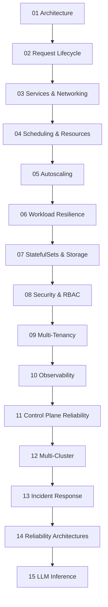

# Kubernetes - Overview

> A professional SRE/DevOps prep guide to Kubernetes, assuming clusters run on **AWS EKS**. Each topic is a folder with two files: a **Guide** (theory, architecture, mermaid diagrams, best practices) and a **Scenarios & SRE Ops** file (CKA/CKAD practical tasks, SRE/DevOps interview questions, and real EKS production incidents + runbooks). Read top to bottom as a curriculum, or jump to a topic.

---

## How to Use This

- **Guide** = "understand the mechanism" - no magic, just mechanisms, with diagrams and EKS specifics.
- **Scenarios & SRE Ops** = "prove you can operate it" - keyword tables, CKA/CKAD tasks, interview Q&A, medium+hard EKS scenarios, decision trees, and runbooks.
- Every section has a **Table of Contents** with back-to-top links and a **One-Line Recap**.

---

## Curriculum

| #   | Topic                                                               | Covers                                                                   |
| :-- | :------------------------------------------------------------------ | :----------------------------------------------------------------------- |
| 01  | [Architecture](01%20-%20Architecture%20Guide.md)                           | Control plane, worker nodes, reconciliation, EKS managed control plane   |
| 02  | [Request Lifecycle](01%20-%20Request%20Lifecycle%20Guide.md)                 | `apply`→running (control path) + HTTP request→pod (data path)            |
| 03  | [Services & Networking](01%20-%20Services%20%26%20Networking%20Guide.md)         | Service types, ClusterIP, kube-proxy, readiness, EndpointSlices, VPC CNI |
| 04  | [Scheduling & Resources](01%20-%20Scheduling%20%26%20Resources%20Guide.md)       | Requests/limits, QoS, OOMKills, eviction, CPU throttling                 |
| 05  | [Autoscaling](01%20-%20Autoscaling%20Guide.md)                             | HPA, VPA, Cluster Autoscaler, Karpenter, KEDA                            |
| 06  | [Workload Resilience](01%20-%20Workload%20Resilience%20Guide.md)             | PDBs, draining, rollouts, graceful shutdown                              |
| 07  | [StatefulSets & Storage](01%20-%20StatefulSets%20%26%20Storage%20Guide.md)       | StatefulSets, PV/PVC, EBS/EFS CSI, access modes                          |
| 08  | [Security & RBAC](01%20-%20Security%20%26%20RBAC%20Guide.md)                     | SA, RBAC, admission, PSA, secrets, IRSA/Pod Identity                     |
| 09  | [Multi-Tenancy](01%20-%20Multi-Tenancy%20Guide.md)                         | Namespaces, quotas, NetworkPolicy, soft vs hard tenancy                  |
| 10  | [Observability](01%20-%20Observability%20Guide.md)                         | Metrics/logs/traces/events/state, SLOs, Container Insights/AMP/AMG       |
| 11  | [Control Plane Reliability](01%20-%20Control%20Plane%20Reliability%20Guide.md) | etcd, apiserver, leader election, scale, upgrades, DR                    |
| 12  | [Multi-Cluster](01%20-%20Multi-Cluster%20Guide.md)                         | DR patterns, GitOps, traffic steering, the data problem                  |
| 13  | [Incident Response](01%20-%20Incident%20Response%20Guide.md)                 | The incident algorithm + playbooks A–H                                   |
| 14  | [Reliability Architectures](01%20-%20Reliability%20Architectures%20Guide.md) | The blueprint + Web + Workers reference architecture                     |
| 15  | [LLM Inference](01%20-%20LLM%20Inference%20Guide.md)                         | GPU serving, KV cache, MIG, queue-aware autoscaling                      |

---

## The Recurring Themes

- **Everything is a reconciliation loop** through the apiserver. → [01 - Architecture Guide](01%20-%20Architecture%20Guide.md)
- **Readiness is the traffic gate** - `Running` ≠ `Receiving traffic`. → [01 - Services & Networking Guide](01%20-%20Services%20%26%20Networking%20Guide.md)
- **Requests schedule, limits enforce; CPU throttles, memory OOMKills.** → [01 - Scheduling & Resources Guide](01%20-%20Scheduling%20%26%20Resources%20Guide.md)
- **PDBs + replicas + spread** are the prerequisite for safe maintenance. → [01 - Workload Resilience Guide](01%20-%20Workload%20Resilience%20Guide.md)
- **Least privilege + IRSA + no static keys.** → [01 - Security & RBAC Guide](01%20-%20Security%20%26%20RBAC%20Guide.md)
- **Alert on SLO burn rate, not CPU.** → [01 - Observability Guide](01%20-%20Observability%20Guide.md)
- **On EKS, AWS owns the control plane; you own nodes, add-ons, IAM↔RBAC, and IP planning.** → [01 - Control Plane Reliability Guide](01%20-%20Control%20Plane%20Reliability%20Guide.md)
- **Most outages are change-related - rollback first, diagnose second.** → [01 - Incident Response Guide](01%20-%20Incident%20Response%20Guide.md)

---

> Start with [01 - Architecture Guide](01%20-%20Architecture%20Guide.md).
