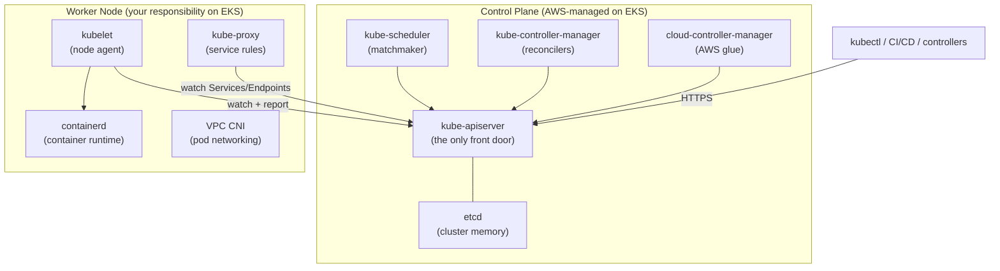
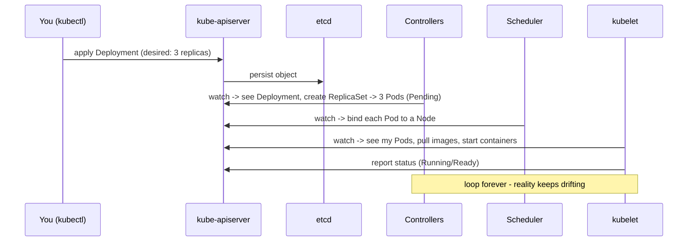
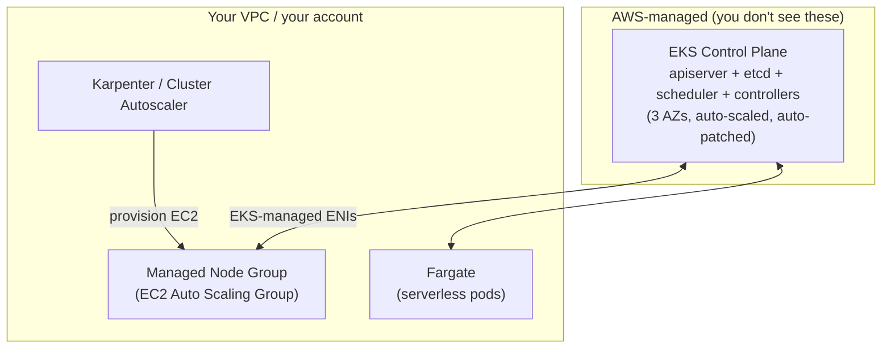

# Kubernetes Architecture - Guide

> Kubernetes is a **distributed control system** for containers built on one idea: _declare desired state, and let reconciliation loops nudge reality until it matches._ This guide covers the control plane, worker nodes, the reconciliation model, the object taxonomy, and how it all maps onto **AWS EKS** (where the control plane is AWS-managed and you only own the nodes).

See also: [02 - Architecture Scenarios & SRE Ops](02%20-%20Architecture%20Scenarios%20%26%20SRE%20Ops.md) · [01 - Request Lifecycle Guide](01%20-%20Request%20Lifecycle%20Guide.md) · [01 - Services & Networking Guide](01%20-%20Services%20%26%20Networking%20Guide.md) · [01 - Control Plane Reliability Guide](01%20-%20Control%20Plane%20Reliability%20Guide.md)

---

## Table of Contents

- [1. The Core Idea: Desired State + Reconciliation](#1-the-core-idea-desired-state--reconciliation)
- [2. The Two Halves: Control Plane vs Data Plane](#2-the-two-halves-control-plane-vs-data-plane)
- [3. Control Plane Components](#3-control-plane-components)
- [4. Worker Node Components](#4-worker-node-components)
- [5. Networking Layer (CNI + DNS)](#5-networking-layer-cni--dns)
- [6. Add-ons and Extensions](#6-add-ons-and-extensions)
- [7. How "Control" Actually Works](#7-how-control-actually-works)
- [8. The Object Taxonomy](#8-the-object-taxonomy)
- [9. This on AWS EKS](#9-this-on-aws-eks)
- [10. Security & Governance Control Points](#10-security--governance-control-points)
- [11. Best Practices](#11-best-practices)

---

---

## 1. The Core Idea: Desired State + Reconciliation

You never tell Kubernetes _how_ to run something step by step. You declare **what you want** (a YAML/JSON object), it stores that as **desired state**, and a swarm of small controllers each run a **watch → diff → act** loop to drag the real world toward that desire - forever, because reality constantly drifts (crashes, node failures, evictions).

> **Mental model:** Kubernetes is control loops all the way down. Every object you create activates one or more controllers whose only job is "make observed state == desired state."

This is why Kubernetes is **eventually consistent** and **self-healing**: delete a Pod managed by a Deployment and it comes back, not because of magic, but because the ReplicaSet controller notices `observed(2) < desired(3)` and creates a replacement.

[⬆ Back to top](#table-of-contents)

---

## 2. The Two Halves: Control Plane vs Data Plane

| Half              | Nickname   | Runs                                    | Job                                      |
| :---------------- | :--------- | :-------------------------------------- | :--------------------------------------- |
| **Control Plane** | the brain  | apiserver, etcd, scheduler, controllers | Stores desired state, makes decisions    |
| **Worker Nodes**  | the muscle | kubelet, runtime, kube-proxy, CNI       | Actually run containers, wire networking |

On a self-managed cluster (kubeadm) you operate both halves. On **EKS, AWS runs the entire control plane** across 3 AZs for you - you cannot SSH to the apiserver or touch etcd. You own only the data plane (managed node groups, self-managed nodes, or Fargate).

[⬆ Back to top](#table-of-contents)

---

## 3. Control Plane Components

### kube-apiserver - the front door

The **only** component everything talks to. `kubectl`, controllers, kubelets, CI/CD, the dashboard - all go through it. It:

- Exposes the Kubernetes REST API over HTTPS.
- Runs the request pipeline: **authentication → authorization (RBAC) → admission (mutating/validating) → schema validation/defaulting → persist to etcd**.
- Is the **hub**: other components _watch_ it for changes rather than talking to each other.

It is horizontally scalable and stateless (state lives in etcd). On EKS it sits behind an AWS-managed endpoint (public, private, or both).

### etcd - the cluster's memory

A distributed, consistent key-value store (Raft consensus) holding the **entire cluster state**: every Pod, Deployment, Secret, ConfigMap, Node. It is the **single source of truth** for desired state.

- Only the apiserver should talk to it directly.
- **Quorum matters**: a 3-node etcd tolerates 1 failure, a 5-node tolerates 2. EKS manages this for you.
- **Mental model:** if etcd is unhealthy, Kubernetes is _amnesiac_ - running Pods keep running, but no new decisions can be made.

### kube-scheduler - the matchmaker

Watches for Pods with no assigned node (`.spec.nodeName` empty) and binds each to the best node via a two-phase algorithm:

- **Filtering (predicates):** which nodes are even eligible? (resource requests fit, `nodeSelector`/affinity match, taints tolerated, volume zone matches, topology constraints satisfiable).
- **Scoring (priorities):** among eligible nodes, which is best? (spread, preferred affinities, bin-pack vs spread).

It expresses its decision by writing a **binding** back to the apiserver. You _steer_ it via Pod spec: `requests/limits`, `nodeSelector`/`nodeAffinity`, taints & tolerations, `priorityClassName`, `topologySpreadConstraints`.

### kube-controller-manager - the fixer

A single binary bundling many controllers, each a reconciliation loop:

| Controller         | Ensures                                     |
| :----------------- | :------------------------------------------ |
| **Deployment**     | Correct ReplicaSets exist                   |
| **ReplicaSet**     | Correct number of Pods exist                |
| **Node**           | Marks nodes `NotReady` when heartbeats stop |
| **Job**            | Pods run to completion                      |
| **EndpointSlice**  | Service endpoints track ready Pods          |
| **Namespace**      | Cleans up deleted namespaces                |
| **ServiceAccount** | Default SAs and tokens                      |

You extend this model with your own **operators** (custom controllers + CRDs).

### cloud-controller-manager - the AWS glue

Integrates Kubernetes with the cloud provider. On EKS it (and out-of-tree controllers) handle:

- Node lifecycle (detect a terminated EC2 instance → delete the Node object).
- Provisioning **ELB/NLB** for `Service type: LoadBalancer`.
- Attaching EBS volumes, programming routes.

Modern EKS uses **out-of-tree** controllers you install/enable: **AWS Load Balancer Controller**, **EBS/EFS CSI drivers**, **VPC CNI**, `external-dns`.

[⬆ Back to top](#table-of-contents)

---

## 4. Worker Node Components

### kubelet - the node agent

The agent on every node. Watches the apiserver for Pods assigned to _its_ node, then:

- Pulls images and creates/starts/stops containers via the runtime (CRI).
- Mounts volumes (ConfigMaps, Secrets, PVCs via CSI).
- Runs **startup / readiness / liveness** probes.
- Reports Node and Pod status back to the apiserver.

It authenticates to the apiserver with a client cert; its own local API should be locked down (a classic security footgun if left open).

### container runtime - runs containers

Software implementing the **CRI** (Container Runtime Interface). EKS uses **containerd** (Docker/`dockershim` is long gone). It pulls images, creates containers, manages lifecycle, and serves logs/exec.

### kube-proxy - service networking rules

A per-node component that programs the dataplane so Service virtual IPs work. It watches Services + EndpointSlices and writes **iptables** (classic) or **IPVS** rules so traffic to a ClusterIP is load-balanced to ready Pod IPs. Some eBPF CNIs (Cilium) **replace** kube-proxy entirely - but the _concept_ (Services need routing/LB) is unchanged.

[⬆ Back to top](#table-of-contents)

---

## 5. Networking Layer (CNI + DNS)

### CNI plugin - pod networking

Kubernetes ships no networking implementation; it delegates to a **CNI** plugin that gives each Pod an IP and provides Pod-to-Pod connectivity. Common plugins: Calico, Cilium, Flannel, Antrea.

**On EKS the default is the Amazon VPC CNI**: each Pod gets a **real VPC IP** from the node's ENIs (no overlay). This means Pods are first-class citizens in your VPC (security groups, flow logs apply) - but you must plan IP space, since Pod density is bounded by ENI/IP limits per instance type. Many large clusters switch to **Cilium** or enable **prefix delegation** to raise density.

### CoreDNS - cluster DNS

The cluster's DNS, deployed as a Deployment. It resolves `myservice.myns.svc.cluster.local → ClusterIP`, handles Pod DNS, and forwards external queries upstream. Configured via a ConfigMap; it reads Services/Endpoints from the apiserver. On EKS it's available as a managed add-on.

[⬆ Back to top](#table-of-contents)

---

## 6. Add-ons and Extensions

| Add-on                           | Purpose                                              | EKS flavor                             |
| :------------------------------- | :--------------------------------------------------- | :------------------------------------- |
| **Ingress / Gateway controller** | HTTP routing, TLS termination                        | AWS Load Balancer Controller (ALB/NLB) |
| **CSI drivers**                  | Dynamic PV provisioning                              | EBS CSI, EFS CSI, FSx                  |
| **metrics-server**               | Resource metrics for HPA                             | Add-on / Helm                          |
| **Autoscalers**                  | HPA/VPA pods, Cluster Autoscaler/**Karpenter** nodes | Karpenter is AWS-native                |
| **cert-manager / external-dns**  | TLS certs, Route 53 records                          | Integrates with ACM/Route 53           |

> An **Ingress** object does nothing by itself - a _controller_ implements it. Same for `Service type: LoadBalancer`: the cloud-controller / LB controller does the real provisioning.

[⬆ Back to top](#table-of-contents)

---

## 7. How "Control" Actually Works

1. You submit desired state to the apiserver.
2. It's persisted in etcd.
3. Controllers reconcile (Deployment → ReplicaSet → Pods).
4. Scheduler assigns Pods to nodes.
5. Kubelets create containers and report status.
6. Network/storage controllers wire connectivity and volumes.
7. The system reconciles **forever**.

[⬆ Back to top](#table-of-contents)

---

## 8. The Object Taxonomy

| Object                         | What it is                                                      |
| :----------------------------- | :-------------------------------------------------------------- |
| **Pod**                        | Smallest runnable unit; 1+ containers sharing network + volumes |
| **Deployment**                 | Stateless replicas + rolling updates (via ReplicaSets)          |
| **StatefulSet**                | Stable identity + per-Pod storage for stateful apps             |
| **DaemonSet**                  | One Pod per node (agents, CNI, log shippers)                    |
| **Job / CronJob**              | Run-to-completion / scheduled tasks                             |
| **Service**                    | Stable virtual IP + load balancing to Pods                      |
| **Ingress / Gateway**          | HTTP routing from outside                                       |
| **ConfigMap / Secret**         | Configuration injection                                         |
| **PVC / PV / StorageClass**    | Persistent storage                                              |
| **Namespace**                  | Isolation/grouping boundary                                     |
| **RBAC (Role/Binding)**        | Who can do what                                                 |
| **NetworkPolicy**              | Allowed network flows                                           |
| **ResourceQuota / LimitRange** | Resource governance                                             |

[⬆ Back to top](#table-of-contents)

---

## 9. This on AWS EKS

- **AWS owns the control plane**: highly available across 3 AZs, patched and scaled by AWS. You get an API endpoint, not servers. You pay a flat hourly fee per cluster.
- **You own the data plane**: choose **managed node groups** (AWS-managed ASGs of EC2), **self-managed nodes**, or **Fargate** (no nodes to manage).
- **Authentication** uses AWS IAM mapped to Kubernetes RBAC via **EKS access entries** (modern) or the legacy `aws-auth` ConfigMap.
- **Pod-to-AWS auth** uses **IRSA** (IAM Roles for Service Accounts) or **EKS Pod Identity** - never node instance-profile credentials for app permissions.
- You **cannot** read etcd, edit apiserver flags directly, or run custom admission on the API binary - but you _can_ deploy admission webhooks (Kyverno/Gatekeeper) as workloads.

[⬆ Back to top](#table-of-contents)

---

## 10. Security & Governance Control Points

| Layer             | Control                                                                  |
| :---------------- | :----------------------------------------------------------------------- |
| **AuthN**         | Certs, tokens, OIDC; on EKS → IAM (access entries / `aws-auth`)          |
| **AuthZ**         | RBAC (Roles/ClusterRoles + Bindings)                                     |
| **Admission**     | Mutating/validating webhooks; Pod Security Admission; Kyverno/Gatekeeper |
| **Pod hardening** | `securityContext`: non-root, read-only FS, drop capabilities, seccomp    |
| **Network**       | NetworkPolicy (east-west), VPC security groups (EKS VPC CNI)             |
| **Image**         | Restrict registries/tags, signature verification via admission           |
| **Secrets**       | KMS envelope encryption of etcd; external secret stores                  |

[⬆ Back to top](#table-of-contents)

---

## 11. Best Practices

- **Treat the apiserver as the only API.** Never hand-edit etcd or node state out of band - it bypasses validation and admission.
- **Everything is a controller.** When debugging "why did this happen?", find the controller responsible and read its logic/events, don't guess.
- **Let the control plane be managed.** On EKS, don't fight AWS for control-plane ownership; invest your effort in node lifecycle, autoscaling, and add-ons.
- **Plan VPC IP space early.** VPC CNI hands out real IPs; a `/24` per subnet runs out fast at high Pod density. Use prefix delegation, larger subnets, or secondary CIDRs.
- **Pin add-on versions** (CNI, CoreDNS, kube-proxy) to compatible EKS versions; upgrade them deliberately during cluster version bumps.
- **Use IRSA/Pod Identity for AWS access**, not node roles - least privilege per workload.
- **Keep node images current** (Bottlerocket or EKS-optimized AL2023); patch via node group rotation, not in-place hacking.

[⬆ Back to top](#table-of-contents)

---

> Continue to [02 - Architecture Scenarios & SRE Ops](02%20-%20Architecture%20Scenarios%20%26%20SRE%20Ops.md).
