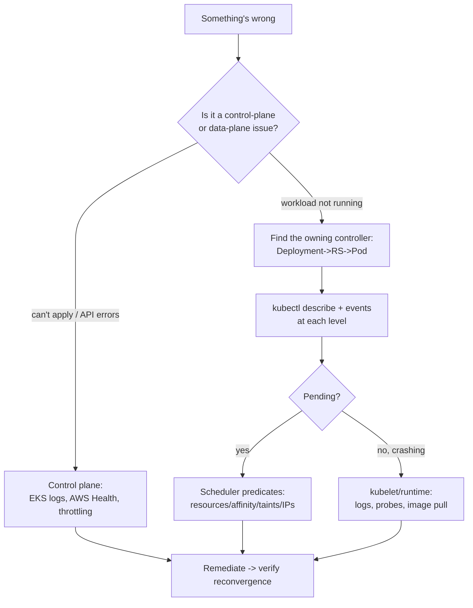

# Kubernetes Architecture - Scenarios & SRE Ops

> Frequently tested concepts, CKA/CKAD practical tasks, SRE/DevOps interview questions, and real EKS production scenarios - plus the operational reality: failure modes, an investigation workflow, and runbooks. Pair with [01 - Architecture Guide](01%20-%20Architecture%20Guide.md).

See also: [01 - Architecture Guide](01%20-%20Architecture%20Guide.md) · [02 - Request Lifecycle Scenarios & SRE Ops](02%20-%20Request%20Lifecycle%20Scenarios%20%26%20SRE%20Ops.md) · [02 - Control Plane Reliability Scenarios & SRE Ops](02%20-%20Control%20Plane%20Reliability%20Scenarios%20%26%20SRE%20Ops.md)

---

## Table of Contents

- [1. Frequently Tested Concepts](#1-frequently-tested-concepts)
- [2. Keywords → Component](#2-keywords--component)
- [3. CKA/CKAD Practical Tasks](#3-ckackad-practical-tasks)
- [4. Interview Questions](#4-interview-questions)
- [5. EKS Production Scenarios](#5-eks-production-scenarios)
- [6. Common Failure Modes (Symptom → Cause → Fix → Prevention)](#6-common-failure-modes-symptom--cause--fix--prevention)
- [7. Investigation Workflow](#7-investigation-workflow)
- [8. Runbooks](#8-runbooks)
- [9. One-Line Recap](#9-one-line-recap)

---

## 1. Frequently Tested Concepts

- **apiserver is the only front door** - everything goes through it.
- **etcd is the source of truth**; lose quorum → cluster can't make decisions.
- **Scheduler binds Pods**; kubelet _runs_ them. They are different components.
- **Controllers reconcile** desired vs observed, forever.
- **Deployment → ReplicaSet → Pod** ownership chain.
- On **EKS**: AWS owns the control plane; you own nodes; IAM↔RBAC via access entries.
- **VPC CNI gives real VPC IPs**; Pod density is bounded by ENI/IP limits.
- **kube-proxy** programs Service rules; eBPF CNIs can replace it.

[⬆ Back to top](#table-of-contents)

---

## 2. Keywords → Component

| Phrase                                   | Points to                                |
| :--------------------------------------- | :--------------------------------------- |
| "stores cluster state / source of truth" | **etcd**                                 |
| "validates and admits API requests"      | **kube-apiserver + admission**           |
| "decides which node a Pod runs on"       | **kube-scheduler**                       |
| "starts the containers on the node"      | **kubelet**                              |
| "creates LoadBalancer for a Service"     | **cloud-controller / AWS LB Controller** |
| "gives each Pod an IP"                   | **CNI (VPC CNI on EKS)**                 |
| "resolves service DNS names"             | **CoreDNS**                              |
| "implements ClusterIP routing"           | **kube-proxy (iptables/IPVS)**           |
| "maps IAM users to cluster permissions"  | **EKS access entries / aws-auth**        |
| "ensures N replicas exist"               | **ReplicaSet controller**                |

[⬆ Back to top](#table-of-contents)

---

## 3. CKA/CKAD Practical Tasks

**T1 - Inspect control-plane health (self-managed):**

```bash
kubectl get componentstatuses          # legacy but still asked
kubectl -n kube-system get pods         # apiserver/etcd/scheduler/controller-manager static pods
kubectl get --raw='/healthz?verbose'    # apiserver health
```

> On EKS the control plane is hidden - use `aws eks describe-cluster` and CloudWatch control-plane logs instead.

**T2 - Find which controller owns a Pod:**

```bash
kubectl get pod <pod> -o jsonpath='{.metadata.ownerReferences[*].kind}{"\n"}'
# Pod -> ReplicaSet -> Deployment: walk ownerReferences up
```

**T3 - See node agents and runtime:**

```bash
kubectl get nodes -o wide               # CONTAINER-RUNTIME column shows containerd version
kubectl describe node <node> | grep -A5 "System Info"
```

**T4 - Drain and cordon a node for maintenance (CKA classic):**

```bash
kubectl cordon <node>
kubectl drain <node> --ignore-daemonsets --delete-emptydir-data
# ... maintenance ...
kubectl uncordon <node>
```

**T5 - Confirm the scheduler placed a Pod and why it didn't:**

```bash
kubectl get events --field-selector reason=FailedScheduling
kubectl describe pod <pending-pod> | sed -n '/Events/,$p'
```

[⬆ Back to top](#table-of-contents)

---

## 4. Interview Questions

**Q1: Walk me through what happens when you `kubectl apply` a Deployment.**

> apiserver authN→authZ→admission→validate→persist to etcd; Deployment controller creates a ReplicaSet; ReplicaSet creates Pods (Pending); scheduler binds them; kubelet pulls images and starts containers; status reported back. See [01 - Request Lifecycle Guide](01%20-%20Request%20Lifecycle%20Guide.md).

**Q2: Why is the apiserver the only component that talks to etcd?**

> A single writer enforces validation, admission, optimistic concurrency, and auth in one place. Direct etcd writes bypass all guardrails and can corrupt invariants.

**Q3: What happens to running Pods if the control plane goes down?**

> They keep running - kubelet and the runtime are local. What stops is _change_: no new scheduling, no self-healing, no scaling, no rollouts. This is why a control-plane outage is "frozen, not down."

**Q4: Difference between scheduler and kubelet?**

> Scheduler _decides_ placement (writes a binding); kubelet _executes_ (pulls images, starts containers, runs probes). Placement vs execution.

**Q5: On EKS, what do you manage vs what does AWS manage?**

> AWS: apiserver, etcd, scheduler, controllers (HA across 3 AZs, patched). You: nodes (managed groups/self-managed/Fargate), add-ons (CNI/CoreDNS/kube-proxy versions), workloads, IAM↔RBAC mapping, IP planning.

**Q6: What is an operator?**

> A custom controller + CRD that encodes domain-specific reconciliation (e.g., a database operator that handles backups/failover) using the same watch-diff-act loop as built-in controllers.

[⬆ Back to top](#table-of-contents)

---

## 5. EKS Production Scenarios

### Medium

**M1 - `kubectl` returns `error: You must be logged in to the server (Unauthorized)` for a teammate.**

> IAM identity isn't mapped to RBAC. Add an **EKS access entry** (or `aws-auth` entry) binding their IAM role to a Kubernetes group/role. Check `aws sts get-caller-identity` matches what's mapped.

**M2 - New Pods stay `Pending` with `0/x nodes available: insufficient cpu`.**

> Scheduler can't fit requests. Either lower requests, add capacity (scale node group / Karpenter), or check for a stuck Cluster Autoscaler. `kubectl describe pod` shows the predicate that failed.

**M3 - Pods fail to start with `failed to assign an IP address to container`.**

> VPC CNI exhausted IPs on the node/subnet. Enable **prefix delegation**, use larger subnets/secondary CIDRs, or right-size Pod density. Classic VPC CNI capacity trap.

**M4 - CoreDNS pods are `CrashLoopBackOff` after a cluster upgrade.**

> Add-on version skew. Update the CoreDNS managed add-on to the version compatible with the new control-plane version; check the Corefile ConfigMap for deprecated plugins.

### Hard

**H1 - After an EKS version upgrade, half your nodes go `NotReady` and Pods won't schedule there.**

> Node group AMIs/kubelet weren't upgraded to match the new control plane (skew policy allows kubelet to be up to 3 minors behind apiserver, _not ahead_). Roll the managed node group to the matching AMI; upgrade kube-proxy/VPC CNI/CoreDNS add-ons in the right order (control plane → add-ons → nodes).

**H2 - Intermittent API throttling: controllers and CI see `429 Too Many Requests` from the apiserver.**

> A noisy client (a hot-looping controller or a `watch`-less polling script) is overwhelming the API. Identify it via control-plane audit logs in CloudWatch; apply **API Priority and Fairness** flow controls; fix the client to use watches/informers with backoff.

**H3 - A regional incident: one AZ degrades. What in your architecture keeps the cluster serving?**

> EKS control plane already spans 3 AZs (AWS-handled). Your responsibility: nodes spread across AZs (multi-AZ node groups), `topologySpreadConstraints` on workloads, PDBs, and multi-AZ data stores. Single-AZ node groups or single-replica stateful apps are the failure points. See [01 - Reliability Architectures Guide](01%20-%20Reliability%20Architectures%20Guide.md).

**H4 - etcd "database space exceeded" on a self-managed cluster (not EKS).**

> Too many objects / no compaction + defrag. Enable auto-compaction, defrag etcd, raise the quota carefully, and prune runaway objects (e.g., millions of Events or orphaned Secrets). On EKS this is AWS's problem - a reason to prefer managed.

[⬆ Back to top](#table-of-contents)

---

## 6. Common Failure Modes (Symptom → Cause → Fix → Prevention)

### Pods Pending forever

- **Cause:** No node satisfies requests/affinity/taints; autoscaler not adding nodes.
- **Fix:** `kubectl describe pod`; adjust requests or capacity; check Karpenter/CA logs.
- **Prevention:** Right-size requests; headroom; alert on `FailedScheduling`.

### Node NotReady

- **Cause:** kubelet stopped reporting (crash, disk pressure, network, version skew).
- **Fix:** `kubectl describe node`; check kubelet/containerd on the instance; replace via node group rotation.
- **Prevention:** Node monitoring, disk-pressure alarms, automated node replacement.

### "Cluster is frozen" - nothing reconciles

- **Cause:** Control-plane/etcd issue (self-managed) or apiserver throttling.
- **Fix:** On EKS, check control-plane logs + AWS Health; otherwise restore etcd quorum.
- **Prevention:** Managed control plane; API Priority & Fairness; well-behaved clients.

### IAM principal unauthorized

- **Cause:** Missing access entry / `aws-auth` mapping.
- **Fix:** Add the mapping; verify caller identity.
- **Prevention:** Manage access entries as code (Terraform); least-privilege groups.

[⬆ Back to top](#table-of-contents)

---

## 7. Investigation Workflow



> Golden rule: **start at the object and walk the ownership chain**, reading `events` at each level. Don't jump to networking or nodes before confirming the controller did its job.

[⬆ Back to top](#table-of-contents)

---

## 8. Runbooks

### Runbook: EKS cluster version upgrade (order matters)

1. Read the EKS version upgrade notes; check API deprecations (`kubectl` + `pluto`/`kubent`).
2. Upgrade the **control plane** (`aws eks update-cluster-version`).
3. Upgrade **managed add-ons** (VPC CNI → CoreDNS → kube-proxy) to compatible versions.
4. Roll **node groups** to matching AMIs (one AZ/group at a time, respecting PDBs).
5. Validate workloads, DNS, and ingress after each step.

### Runbook: triage "the cluster feels frozen"

1. Can you `kubectl get ns`? If not → control-plane/auth/endpoint issue.
2. On EKS: check **control-plane logs** (CloudWatch), **AWS Health Dashboard**, apiserver `429`s.
3. Check node readiness and scheduler events for backlog.
4. If self-managed: verify etcd quorum and apiserver health before anything else.
5. Once API is healthy, confirm controllers resume reconciling (watch a test Deployment scale).

[⬆ Back to top](#table-of-contents)

---

## 9. One-Line Recap

> **apiserver is the only door; etcd is the truth; scheduler places, kubelet runs, controllers reconcile forever. On EKS, AWS owns the control plane (3 AZs) and you own nodes + add-ons + IAM↔RBAC + VPC IP planning. Debug by walking the ownership chain and reading events at each level.**

[⬆ Back to top](#table-of-contents)

---

> Continue to [01 - Request Lifecycle Guide](01%20-%20Request%20Lifecycle%20Guide.md).
