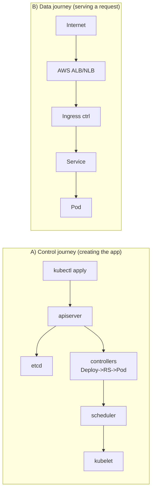
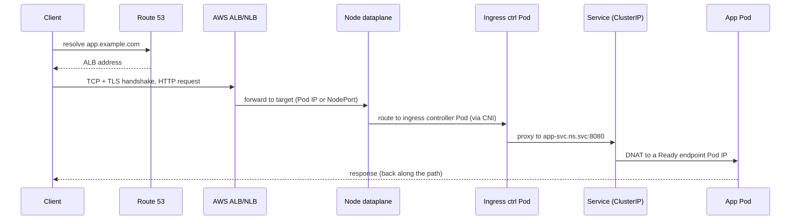

# Request Lifecycle - Guide

> Two journeys, end to end. **(A)** The _control_ journey: `kubectl apply` → etcd → controllers → scheduler → kubelet → running Pod. **(B)** The _data_ journey: an HTTP request from the internet → AWS load balancer → node → ingress → Service → Pod → response. Understanding both is what turns "Kubernetes is YAML magic" into "Kubernetes is Linux networking and control loops wearing a trench coat." Assumes **AWS EKS**.

See also: [02 - Request Lifecycle Scenarios & SRE Ops](02%20-%20Request%20Lifecycle%20Scenarios%20%26%20SRE%20Ops.md) · [01 - Architecture Guide](01%20-%20Architecture%20Guide.md) · [01 - Services & Networking Guide](01%20-%20Services%20%26%20Networking%20Guide.md) · [01 - Workload Resilience Guide](01%20-%20Workload%20Resilience%20Guide.md)

---

## Table of Contents

- [1. Two Journeys, One System](#1-two-journeys-one-system)
- [2. Control Journey: From `apply` to Running](#2-control-journey-from-apply-to-running)
- [3. Data Journey: An HTTP Request End to End](#3-data-journey-an-http-request-end-to-end)
- [4. The Client-IP Problem](#4-the-client-ip-problem)
- [5. Drama Arcs: Scaling, Failure, Updates](#5-drama-arcs-scaling-failure-updates)
- [6. Common Variants](#6-common-variants)
- [7. Who Controls What (Cheat-Map)](#7-who-controls-what-cheat-map)
- [8. Best Practices](#8-best-practices)

---

---

## 1. Two Journeys, One System

People conflate "how does my app get created?" with "how does a request reach my app?" They are **different paths through different components**:

|                    | Control journey                                      | Data journey                            |
| :----------------- | :--------------------------------------------------- | :-------------------------------------- |
| Trigger            | `kubectl apply` / a controller                       | An inbound HTTP request                 |
| Path               | apiserver → etcd → controllers → scheduler → kubelet | LB → node → ingress → Service → Pod     |
| Frequency          | Once per change                                      | Millions of times per second            |
| Failure looks like | Pods Pending/crashing                                | 5xx, timeouts, "running but no traffic" |

[⬆ Back to top](#table-of-contents)

---

## 2. Control Journey: From `apply` to Running

Imagine you apply a `Deployment` and a `Service`.

### Step 1 - `kubectl apply` hits the apiserver

`kubectl` doesn't create containers; it sends an HTTPS request to the **apiserver** (the only doorway), which runs, in order:

1. **Authentication** - who are you? (cert/token/OIDC; on EKS → IAM)
2. **Authorization** - are you allowed? (RBAC)
3. **Admission** - accept/mutate/deny? (built-in controllers + webhooks - _where org guardrails live_: Kyverno/Gatekeeper, Pod Security Admission)
4. **Validation + defaulting** - schema check, fill defaults
5. **Persist** - store in **etcd**

At this moment the Deployment exists as **desired state**. Nothing is running yet.

> **Control point:** kubeconfig creds, RBAC, admission policies.

### Step 2 - Controllers expand Deployment → ReplicaSet → Pods

Controllers run watch+reconcile loops:

- **Deployment controller** sees the new Deployment → creates a **ReplicaSet**.
- **ReplicaSet controller** sees it wants 3 replicas → creates **3 Pod objects** (just specs in etcd, `Pending`, no node yet).

> **Control point:** the Deployment spec (replicas, template, update strategy).

### Step 3 - Scheduler binds each Pod to a node

The scheduler watches for Pods with no `.spec.nodeName` and runs **filter → score**, then writes `Pod.spec.nodeName = chosen-node` back to the apiserver.

> **Control point:** requests/limits, affinity, taints/tolerations, topology spread, priority. See [01 - Scheduling & Resources Guide](01%20-%20Scheduling%20%26%20Resources%20Guide.md).

### Step 4 - Kubelet makes the Pod real

The node's kubelet sees a Pod assigned to _it_ and:

1. Pulls images via containerd.
2. Sets up sandbox / namespaces / cgroups.
3. Mounts volumes (ConfigMaps, Secrets, PVCs via CSI).
4. Creates and starts containers.
5. Runs probes: **startup** ("booted?") → **readiness** ("take traffic?") → **liveness** ("stuck?").
6. Reports status back.

> **Control point:** Pod spec (image, command, env, volumes, securityContext, probes, resources).

### Step 5 - CNI assigns the Pod an IP

The kubelet calls the **CNI** to set up networking. On **EKS VPC CNI**, the Pod gets a **real VPC IP** from the node's ENIs - routable in your VPC, subject to security groups and flow logs (no overlay).

> **Control point:** NetworkPolicy (allowed traffic), CNI choice (VPC CNI vs Cilium).

### Step 6 - Service + EndpointSlices make it reachable

A **Service** provides a stable ClusterIP + DNS name. The **EndpointSlice controller** watches Pods/Services and lists **ready** Pod IPs. **kube-proxy** programs node rules so ClusterIP traffic load-balances to those ready IPs.

> **Key subtlety:** only **Ready** Pods enter EndpointSlices → readiness is the traffic gate. See [01 - Services & Networking Guide](01%20-%20Services%20%26%20Networking%20Guide.md).

### Step 7 - CoreDNS serves the name

CoreDNS resolves `app-svc.default.svc.cluster.local → ClusterIP`. Pods use cluster DNS by default.

### Step 8 - Ingress/Gateway routes from outside

An **Ingress** is just desired state; an **Ingress Controller** (on EKS, the **AWS Load Balancer Controller** provisioning an **ALB**) does the real routing: `Internet → ALB → Service → Pod`.

[⬆ Back to top](#table-of-contents)

---

## 3. Data Journey: An HTTP Request End to End

Assume a Deployment + ClusterIP Service + Ingress (ALB) on EKS.

1. **DNS + connect** - client resolves `app.example.com` to the **ALB**, then TCP+TLS handshake. Nothing "Kubernetes-y" yet. _Knobs: Route 53, ACM/cert-manager TLS._
2. **ALB receives** - the AWS LB Controller created an ALB. In **IP target mode** (typical on EKS VPC CNI) it targets **Pod IPs directly**; in **instance mode** it targets `nodeIP:nodePort`. _Knobs: target type, health checks._
3. **Reach the ingress controller** - traffic arrives at the ingress controller Pod (directly via Pod IP, or node → CNI route → Pod). It acts as an L7 reverse proxy: picks a route by host/path, may terminate TLS, add headers, rate-limit. _Knobs: Ingress/Gateway rules, controller config._
4. **Forward to the Service** - the controller connects to `app-svc:8080`. DNS resolves to the **ClusterIP** (a _virtual_ IP, not a real interface).
5. **ClusterIP → backend Pod** - **EndpointSlices + kube-proxy** DNAT the ClusterIP to one **Ready** endpoint Pod IP. _Knobs: selector/labels, readiness, session affinity, topology hints._
6. **Reach the Pod** - same node = veth hop; other node = across the VPC (real routing on VPC CNI). The container process receives the request and responds.
7. **Return path** - follows **conntrack**/NAT state. This is where "why did my client IP disappear?" lives (§4).

[⬆ Back to top](#table-of-contents)

---

## 4. The Client-IP Problem

Source IP can be rewritten (SNAT) at several hops:

- The **ALB/NLB** may SNAT (ALB always terminates L7 and re-originates; NLB can preserve client IP).
- **NodePort** forwarding SNATs depending on `externalTrafficPolicy`.
- An **L7 ingress** terminates and re-originates the connection - backend sees the _ingress_ IP.

To recover the real client IP:

- L7 ingress adds **`X-Forwarded-For` / `X-Real-IP`** - read those, not the TCP source.
- Use **`externalTrafficPolicy: Local`** to avoid node-hop SNAT (trade-off: only nodes with a local endpoint get traffic; LB health checks must agree).
- NLB/ALB support **proxy protocol** / client-IP preservation in some modes.

[⬆ Back to top](#table-of-contents)

---

## 5. Drama Arcs: Scaling, Failure, Updates

### Scaling up

`kubectl scale deploy myapp --replicas=10` → apiserver stores count → Deployment controller bumps RS → ReplicaSet creates Pods → scheduler binds → kubelets run → EndpointSlices update as they go **Ready** → Service LB includes them. No human touches a load balancer. Reconciliation loops all the way down.

### A Pod dies

- Container crash → **kubelet** restarts it (per `restartPolicy`).
- Whole Pod gone (node failure/eviction) → **ReplicaSet** notices `observed < desired` → creates a replacement → scheduler reschedules elsewhere.
- **Split of responsibility:** container restart = kubelet; replica replacement = ReplicaSet; node-down detection = Node controller (via heartbeats).

### A node goes down

kubelet stops reporting → Node controller marks it `NotReady` after grace → endpoints removed → Pods eventually rescheduled to healthy nodes (timing depends on eviction settings + `tolerationSeconds`).

### Rolling update

Change the image tag → Deployment controller creates a **new ReplicaSet** (new pod-template-hash) and shifts replicas per **`maxSurge`** / **`maxUnavailable`**. New Pods join endpoints **only when Ready**. `kubectl rollout undo` just re-points desired state. **Readiness done right** is what makes rolling updates safe. See [01 - Workload Resilience Guide](01%20-%20Workload%20Resilience%20Guide.md).

[⬆ Back to top](#table-of-contents)

---

## 6. Common Variants

| Variant                                      | Path change                                                       |
| :------------------------------------------- | :---------------------------------------------------------------- |
| **No Ingress, `Service type: LoadBalancer`** | `Client → NLB → Service → Pod` (ingress step vanishes)            |
| **Service mesh (Istio/Linkerd)**             | `Ingress → Service → sidecar → app`; retries/mTLS at sidecar      |
| **eBPF dataplane (Cilium)**                  | Same objects, forwarding/LB in eBPF instead of iptables/IPVS      |
| **hostNetwork / hostPort**                   | Pod shares node netns; Pod IP semantics change (infra components) |
| **EKS Fargate**                              | One Pod per micro-VM; ALB targets the Pod ENI directly            |

[⬆ Back to top](#table-of-contents)

---

## 7. Who Controls What (Cheat-Map)

| Component                     | Role                                                                         |
| :---------------------------- | :--------------------------------------------------------------------------- |
| **apiserver**                 | Gatekeeper (authN/authZ/admission), stores desired state via etcd            |
| **etcd**                      | Source of truth                                                              |
| **Controllers**               | Keep object relationships matching desire (Deploy→RS→Pods, endpoints, nodes) |
| **Scheduler**                 | Picks a node                                                                 |
| **kubelet + runtime**         | Runs containers; enforces probes/resources                                   |
| **CNI (VPC CNI)**             | Pod IP + connectivity + (maybe) NetworkPolicy                                |
| **kube-proxy**                | Implements Services (unless eBPF replaces it)                                |
| **CoreDNS**                   | Service discovery                                                            |
| **Ingress/AWS LB Controller** | Edge routing from outside                                                    |

[⬆ Back to top](#table-of-contents)

---

## 8. Best Practices

- **Get readiness right** - it gates both rolling-update safety and steady-state traffic. Readiness should mean "I can serve a request now," not "the whole universe is healthy." See [01 - Services & Networking Guide](01%20-%20Services%20%26%20Networking%20Guide.md).
- **Don't make readiness depend on fragile downstreams** - a slow DB shouldn't empty your entire Service's endpoints. Degrade gracefully.
- **Use ALB IP target mode** with VPC CNI so the LB talks to Pods directly (cleaner client-IP, fewer hops) and pairs with `readinessGates` for connection draining.
- **Read forwarded headers** for client IP behind L7; reserve `externalTrafficPolicy: Local` for cases that truly need raw source IP.
- **Tune `maxSurge`/`maxUnavailable` + `minReadySeconds`** for your capacity and risk tolerance.
- **When traffic fails, check `kubectl get endpointslices` first** - zero/again-not-ready endpoints means it's a labels/readiness problem, _not_ a networking problem.

[⬆ Back to top](#table-of-contents)

---

> Continue to [02 - Request Lifecycle Scenarios & SRE Ops](02%20-%20Request%20Lifecycle%20Scenarios%20%26%20SRE%20Ops.md).
