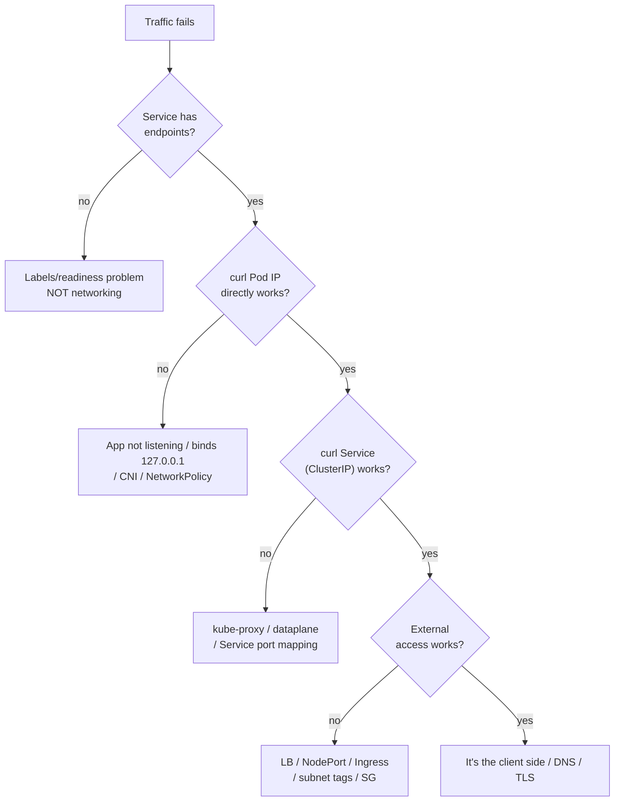
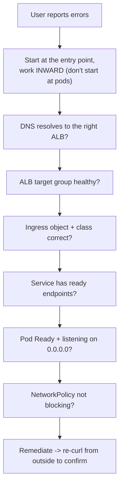

# Request Lifecycle - Scenarios & SRE Ops

> The "prove each hop" methodology that makes you look like a wizard (you're just methodical). Frequently tested concepts, CKA/CKAD tasks, interview questions, EKS production scenarios, the 10-command debug checklist, a memorizable decision tree, and runbooks. Pair with [01 - Request Lifecycle Guide](01%20-%20Request%20Lifecycle%20Guide.md).

See also: [01 - Request Lifecycle Guide](01%20-%20Request%20Lifecycle%20Guide.md) · [02 - Services & Networking Scenarios & SRE Ops](02%20-%20Services%20%26%20Networking%20Scenarios%20%26%20SRE%20Ops.md) · [02 - Architecture Scenarios & SRE Ops](02%20-%20Architecture%20Scenarios%20%26%20SRE%20Ops.md)

---

## Table of Contents

- [1. Frequently Tested Concepts](#1-frequently-tested-concepts)
- [2. Keywords → Cause](#2-keywords--cause)
- [3. CKA/CKAD Practical Tasks](#3-ckackad-practical-tasks)
- [4. Interview Questions](#4-interview-questions)
- [5. EKS Production Scenarios](#5-eks-production-scenarios)
- [6. The Debug Decision Tree](#6-the-debug-decision-tree)
- [7. The 10-Command Sticky Note](#7-the-10-command-sticky-note)
- [8. Investigation Workflow](#8-investigation-workflow)
- [9. Runbooks](#9-runbooks)
- [10. One-Line Recap](#10-one-line-recap)

---

## 1. Frequently Tested Concepts

- **Control path ≠ data path.** Creating a Pod and serving a request use different components.
- **apiserver pipeline order:** authN → authZ → admission → validation → persist.
- **Readiness gates traffic** - `Running` ≠ `Receiving traffic`.
- **EndpointSlices** carry readiness into the dataplane.
- **Rolling updates rely on readiness** for safety.
- On EKS: **ALB IP-target mode** sends traffic to Pod IPs; **instance mode** to NodePorts.
- **Zero endpoints = labels/readiness problem**, not networking.

[⬆ Back to top](#table-of-contents)

---

## 2. Keywords → Cause

| Symptom phrase                               | Likely cause                                      |
| :------------------------------------------- | :------------------------------------------------ |
| "Pod is Running but Service returns nothing" | Readiness failing / not in EndpointSlice          |
| "Service has zero endpoints"                 | Selector ↔ Pod label mismatch                     |
| "works on Pod IP, fails on Service"          | kube-proxy / Service port mapping / dataplane     |
| "in-cluster works, external fails"           | LB / NodePort / Ingress exposure                  |
| "client IP is the node/LB IP"                | SNAT; use XFF or `externalTrafficPolicy: Local`   |
| "EXTERNAL-IP pending"                        | LB controller / IAM / annotations / subnet tags   |
| "DNS fails inside cluster"                   | CoreDNS down or NetworkPolicy blocking UDP/TCP 53 |
| "single replica times out calling itself"    | Hairpin                                           |

[⬆ Back to top](#table-of-contents)

---

## 3. CKA/CKAD Practical Tasks

**T1 - Expose a Deployment and prove it serves:**

```bash
kubectl create deploy web --image=nginx --replicas=3
kubectl expose deploy web --port=80 --target-port=80
kubectl run tmp --rm -it --image=curlimages/curl -- curl -s http://web:80
```

**T2 - Confirm a rollout went green and rollback if not:**

```bash
kubectl set image deploy/web nginx=nginx:1.27
kubectl rollout status deploy/web --timeout=120s
kubectl rollout undo deploy/web        # if it stalls
```

**T3 - Trace why a Service has no endpoints (CKAD favorite):**

```bash
kubectl get svc web -o yaml | grep -A3 selector
kubectl get pods --show-labels
kubectl get endpointslices -l kubernetes.io/service-name=web -o wide
```

**T4 - Add a correct readiness probe:**

```yaml
readinessProbe:
  httpGet: { path: /healthz, port: 8080 }
  initialDelaySeconds: 5
  periodSeconds: 10
```

[⬆ Back to top](#table-of-contents)

---

## 4. Interview Questions

**Q1: A Pod is `Running` but gets no traffic. Walk me through it.**

> Readiness is the traffic gate. Check `Ready` condition, then EndpointSlices for the Service. If not Ready → probe wrong path/port, app on `127.0.0.1`, or readiness coupled to a slow dependency. If Ready but absent → selector/label mismatch.

**Q2: Why is a ClusterIP not pingable / not on any interface?**

> It's virtual - no interface owns it. Node dataplane rules (kube-proxy iptables/IPVS or eBPF) DNAT it to a real Pod IP. ICMP often isn't programmed; test with the actual TCP port.

**Q3: Where does the client IP get lost, and how do you preserve it?**

> ALB (L7) re-originates → use `X-Forwarded-For`. Node-hop SNAT on NodePort → `externalTrafficPolicy: Local`. NLB can preserve source IP / use proxy protocol.

**Q4: Walk me through a rolling update and how readiness makes it safe.**

> New ReplicaSet scales up under `maxSurge`; new Pods join endpoints only when Ready; old Pods drain down per `maxUnavailable`. Too-optimistic readiness → traffic to half-booted apps; too-strict → stalled rollout.

**Q5: The "one-replica hairpin" deadlock - what is it?**

> A single-replica Service whose readiness check calls _itself_ through the Service routes back to the same Pod; if hairpin mode is off it fails, so it never becomes Ready → no endpoints → outage. Fix: self-check `localhost`, fix hairpin, or run >1 replica.

[⬆ Back to top](#table-of-contents)

---

## 5. EKS Production Scenarios

### Medium

**M1 - Ingress created, `ADDRESS` stays empty.**

> AWS LB Controller not installed, missing IRSA permissions, or subnets not tagged. Tag public subnets `kubernetes.io/role/elb=1` (internal: `internal-elb`), verify the controller's IAM policy, check its logs.

**M2 - ALB returns 502/504 intermittently.**

> Target health flapping: readiness probe vs ALB health-check path mismatch, or backend timeouts shorter than ALB idle timeout. Align health-check path/port and timeouts; add `readinessGates` for connection draining.

**M3 - 5xx spike during every deploy.**

> No graceful shutdown: Pods receive SIGTERM and die before deregistering from the ALB / closing in-flight requests. Add `preStop` sleep + `terminationGracePeriodSeconds`, and use target-group deregistration delay.

**M4 - DNS resolution flaky cluster-wide.**

> CoreDNS under-scaled or NodeLocal DNS missing; or a NetworkPolicy blocks port 53. Scale CoreDNS, deploy NodeLocal DNSCache, allow DNS egress.

### Hard

**H1 - After enabling a strict default-deny NetworkPolicy, the whole app goes dark.**

> You blocked DNS and ingress-controller traffic. Add explicit allow rules: egress to kube-dns (UDP/TCP 53) and ingress from the ingress-controller namespace/labels. Default-deny without these is a self-inflicted outage. See [01 - Services & Networking Guide](01%20-%20Services%20%26%20Networking%20Guide.md).

**H2 - Requests succeed on Pod IP but fail through the Service only on cross-AZ calls, and your AWS bill shows cross-AZ data charges.**

> Topology not respected. Enable **topology-aware routing** (`service.kubernetes.io/topology-mode: Auto`) so kube-proxy prefers same-AZ endpoints; spread replicas per AZ so each zone has local endpoints. Cuts latency and cross-AZ cost.

**H3 - A canary deploy passes health checks but users see errors; rollback "works" but errors persist for 30s.**

> Readiness is too optimistic (ready before warm) and there's no graceful drain on rollback. Tighten readiness to reflect true serving capacity (warm caches/connections), add `minReadySeconds`, and ensure `preStop` + deregistration delay so draining completes.

**H4 - Self-call deadlock: a single-replica service's readiness probe calls its own Service DNS and never becomes Ready on EKS.**

> Hairpin via the Service to itself. Point self-checks at `localhost`, or run ≥2 replicas, or ensure the CNI supports hairpin. Classic single-replica trap.

[⬆ Back to top](#table-of-contents)

---

## 6. The Debug Decision Tree



Memorize the four pivots:

1. **No endpoints** → labels/readiness.
2. **Pod IP works, Service doesn't** → kube-proxy/dataplane/port mapping.
3. **In-cluster works, external doesn't** → LB/NodePort/Ingress.
4. **In-cluster DNS fails** → CoreDNS or NetworkPolicy blocking 53.

[⬆ Back to top](#table-of-contents)

---

## 7. The 10-Command Sticky Note

```bash
kubectl get ingress,svc,ep,endpointslices,pods -o wide
kubectl describe ingress <ing>
kubectl describe svc <svc>
kubectl get endpointslices -l kubernetes.io/service-name=<svc> -o wide
kubectl describe pod <pod>
kubectl logs <pod> --tail=200
kubectl run tmp-curl --rm -it --image=curlimages/curl -- sh
#   inside: nslookup <svc>; curl -v http://<svc>:<port>/healthz; curl -v http://<podIP>:<port>/healthz
kubectl get netpol -A
kubectl -n kube-system logs -l k8s-app=kube-proxy --tail=200
kubectl exec -it <pod> -- sh -c "ss -lntp || netstat -lntp"   # is it on 0.0.0.0?
```

> The single highest-yield check in Kubernetes networking: **does the Service have ready endpoints?** Everything else is downstream of that.

[⬆ Back to top](#table-of-contents)

---

## 8. Investigation Workflow



> **Rule:** start from the destination and walk _inward_, proving each hop. The first hop that fails is your culprit - don't skip ahead.

[⬆ Back to top](#table-of-contents)

---

## 9. Runbooks

### Runbook: "the site is down, return 5xx"

1. Reproduce from outside: `curl -v https://app.example.com`.
2. ALB target group health in the AWS console (healthy targets > 0?).
3. `kubectl get endpointslices -l kubernetes.io/service-name=<svc>` - ready endpoints?
4. If zero → check Pod `Ready`, probe path/port, app listening on `0.0.0.0`.
5. If endpoints exist → in-cluster `curl <svc>` from a debug Pod; if that works, the gap is LB/Ingress.
6. Check NetworkPolicy and recent deploys (correlate with the rollout).
7. Mitigate (rollback / scale / fix probe) → confirm endpoints repopulate → re-curl externally.

### Runbook: zero-downtime deploy checklist

1. Readiness reflects _true_ serving capacity (warm).
2. `preStop` sleep (e.g. 5–15s) + `terminationGracePeriodSeconds` ≥ drain time.
3. ALB target-group deregistration delay aligned with grace period.
4. `maxUnavailable: 0` (or low) + sensible `maxSurge`; `minReadySeconds` set.
5. PDB protects against concurrent voluntary disruptions. See [01 - Workload Resilience Guide](01%20-%20Workload%20Resilience%20Guide.md).

[⬆ Back to top](#table-of-contents)

---

## 10. One-Line Recap

> **Control path: apply→etcd→controllers→scheduler→kubelet. Data path: ALB→ingress→Service→Pod. Readiness is the traffic gate, EndpointSlices carry it to the dataplane. Debug by walking hops inward; check endpoints FIRST - zero endpoints is a labels/readiness bug, not a networking bug.**

[⬆ Back to top](#table-of-contents)

---

> Continue to [01 - Services & Networking Guide](01%20-%20Services%20%26%20Networking%20Guide.md).
