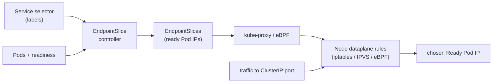
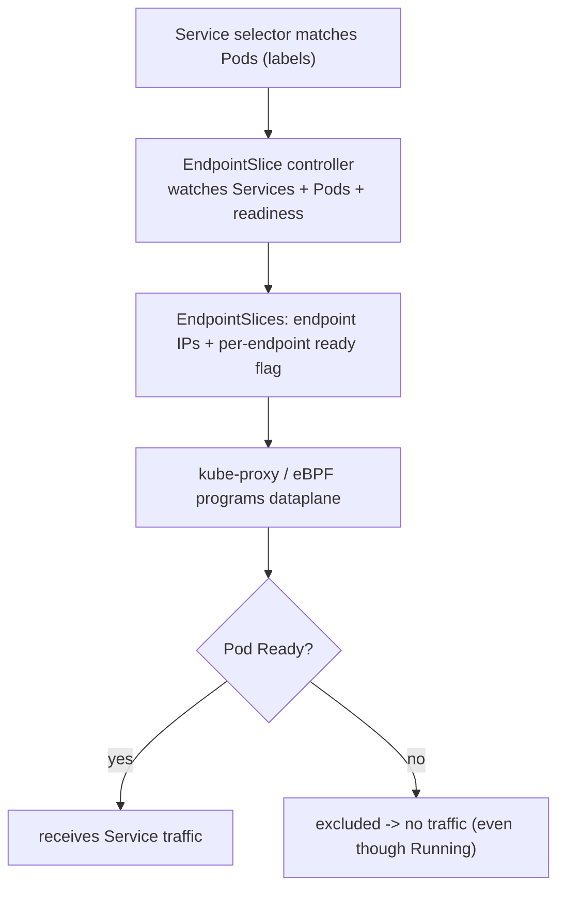
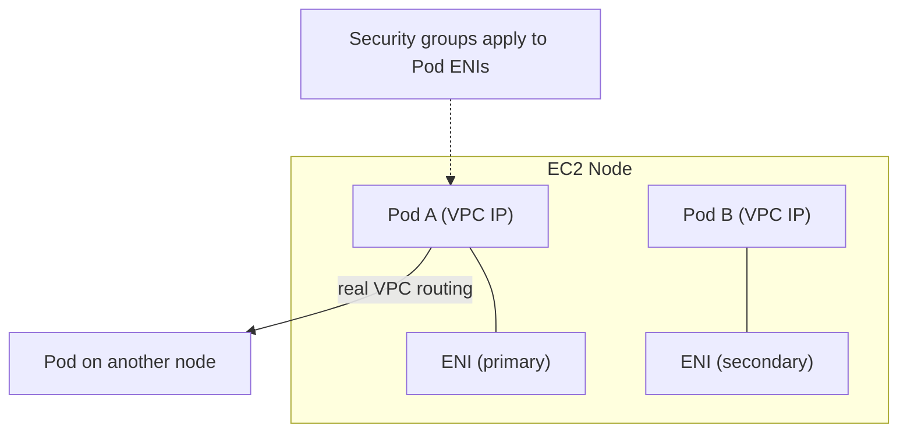

# Services & Networking - Guide

> Where Kubernetes stops feeling like YAML magic and starts feeling like Linux networking wearing a trench coat. Service types, the truth about ClusterIP (it's _virtual_), iptables vs IPVS vs eBPF dataplanes, SNAT/hairpin weirdness, `externalTrafficPolicy`, and the chain that decides whether a `Running` Pod actually **receives traffic**: probes → readiness → EndpointSlices → kube-proxy. Assumes **AWS EKS** with the VPC CNI.

See also: [02 - Services & Networking Scenarios & SRE Ops](02%20-%20Services%20%26%20Networking%20Scenarios%20%26%20SRE%20Ops.md) · [01 - Request Lifecycle Guide](01%20-%20Request%20Lifecycle%20Guide.md) · [01 - Workload Resilience Guide](01%20-%20Workload%20Resilience%20Guide.md) · [01 - Observability Guide](01%20-%20Observability%20Guide.md)

---

## Table of Contents

- [1. Service Types](#1-service-types)
- [2. The ClusterIP Is Not a Real IP](#2-the-clusterip-is-not-a-real-ip)
- [3. Dataplane: iptables vs IPVS vs eBPF](#3-dataplane-iptables-vs-ipvs-vs-ebpf)
- [4. Probes: startup / readiness / liveness](#4-probes-startup--readiness--liveness)
- [5. Readiness → EndpointSlices → Traffic](#5-readiness--endpointslices--traffic)
- [6. externalTrafficPolicy & Client IP](#6-externaltrafficpolicy--client-ip)
- [7. Hairpin & the One-Replica Gotcha](#7-hairpin--the-one-replica-gotcha)
- [8. DNS & Service Discovery](#8-dns--service-discovery)
- [9. Networking on EKS (VPC CNI)](#9-networking-on-eks-vpc-cni)
- [10. Best Practices](#10-best-practices)

---

---

## 1. Service Types

| Type                             | What it gives you                        | EKS reality                                                                  |
| :------------------------------- | :--------------------------------------- | :--------------------------------------------------------------------------- |
| **ClusterIP**                    | Stable virtual IP + DNS, internal only   | Default; the building block under everything                                 |
| **NodePort**                     | Opens a port (30000–32767) on every node | Rarely used directly; underlies LB instance mode                             |
| **LoadBalancer**                 | Provisions an external LB                | Creates an **NLB** (L4) via the AWS LB Controller                            |
| **ExternalName**                 | CNAME to an external DNS name            | No proxying - pure DNS alias                                                 |
| **Headless** (`clusterIP: None`) | No virtual IP; DNS returns Pod IPs       | For StatefulSets / client-side LB. See [01 - StatefulSets & Storage Guide](01%20-%20StatefulSets%20%26%20Storage%20Guide.md) |

> **Ingress vs LoadBalancer Service:** an Ingress is L7 HTTP routing implemented by a controller (AWS LB Controller → **ALB**); `Service type: LoadBalancer` is L4 (→ **NLB**). Use Ingress/ALB for host/path routing + TLS; NLB for raw TCP/UDP or ultra-low latency.

[⬆ Back to top](#table-of-contents)

---

## 2. The ClusterIP Is Not a Real IP

A ClusterIP (e.g. `10.96.12.34`) **looks** like an IP but **no interface owns it**. Packets destined to it are intercepted by **node-level dataplane rules** that rewrite/steer them to a real Pod IP. So "service discovery" is really two steps:

1. **DNS** returns the ClusterIP.
2. **Dataplane** DNATs ClusterIP → one ready endpoint Pod IP.

This is why you can't always `ping` a ClusterIP (ICMP isn't programmed) but you _can_ hit its TCP port. It's a virtual abstraction, not a host.

[⬆ Back to top](#table-of-contents)

---

## 3. Dataplane: iptables vs IPVS vs eBPF

### iptables mode (classic kube-proxy)

kube-proxy writes NAT rules per Service:

1. Packet to `ClusterIP:80` matches a Service chain.
2. iptables **probabilistically** picks an endpoint.
3. **DNAT**: `ClusterIP:80 → PodIP:8080`.
4. **conntrack** remembers the mapping so return traffic works.

Simple, but rule count grows with services × endpoints - heavy at large scale, and reading chains is "character-building." **SNAT/masquerade** kicks in mainly when the chosen endpoint is on a _different node_ (to keep return routing symmetric) - which is why the backend sometimes doesn't see the original source IP.

### IPVS mode

Uses the Linux kernel load balancer: each Service ClusterIP becomes a **virtual service**, each endpoint a **real server**, balanced by a real algorithm (rr, least-conn). Scales better with many services/endpoints; still uses some iptables for plumbing.

### eBPF (Cilium)

Replaces kube-proxy and iptables-heavy NAT with eBPF programs on kernel hooks. Fewer giant rule sets, more efficient in-kernel LB, better observability (`cilium monitor`), eBPF-based NetworkPolicy. **Semantics unchanged**: Service → endpoints, readiness still gates, traffic still traverses the node dataplane - just implemented differently. Increasingly common on large EKS clusters (often with VPC CNI replaced or chained).

[⬆ Back to top](#table-of-contents)

---

## 4. Probes: startup / readiness / liveness

The three probes are constantly confused. They answer **different questions**:

| Probe              | Question                    | Effect of failure                                           |
| :----------------- | :-------------------------- | :---------------------------------------------------------- |
| **startupProbe**   | "Am I done booting?"        | Holds off readiness/liveness during slow starts (anti-flap) |
| **readinessProbe** | "Should I receive traffic?" | Removed from Service endpoints (container keeps running)    |
| **livenessProbe**  | "Am I wedged?"              | Container is **restarted**                                  |

> **Mental model:** readiness controls _traffic_, liveness controls _restarts_, startup buys a _calm warm-up_. The kubelet sets Pod conditions from probe results; your Pod spec defines the probes.

A Pod can be `Running` but **not Ready** (normal during startup), or `Ready` then flip to **not Ready** (probe fails) - all while `status.phase` stays `Running`.

[⬆ Back to top](#table-of-contents)

---

## 5. Readiness → EndpointSlices → Traffic

`status.phase: Running` means "containers started." The **traffic** decision is the Pod **condition `Ready`**. The mechanism that carries readiness into networking is **EndpointSlices**:

So a `Running` but not-`Ready` Pod still matches the selector, but the EndpointSlice marks it not-ready and kube-proxy won't send it traffic. **This is why "my Pod is running but my Service is down" is almost always a readiness/endpoints story, not a networking one.**

**readinessGates** add _extra_ conditions (set by a controller) that must be true before a Pod is Ready - e.g. the **AWS LB Controller** uses a readiness gate so a Pod isn't Ready until it's registered and healthy in the ALB/NLB target group (true zero-downtime rollouts).

[⬆ Back to top](#table-of-contents)

---

## 6. externalTrafficPolicy & Client IP

For traffic entering via NodePort/LoadBalancer:

| Policy                  | Behavior                                   | Trade-off                                                                                                                        |
| :---------------------- | :----------------------------------------- | :------------------------------------------------------------------------------------------------------------------------------- |
| **`Cluster`** (default) | Any node forwards to endpoints on any node | Best spread/resilience, but **SNAT** hides client IP                                                                             |
| **`Local`**             | Node forwards only to _local_ endpoints    | Preserves client IP, no extra hop - but nodes without a local endpoint drop traffic, so LB health checks + replica spread matter |

"Preserve client IP" is never free - you pay in scheduling constraints and LB health logic. For L7 (ALB/ingress) the connection is re-originated anyway → rely on **`X-Forwarded-For`/`X-Real-IP`** headers, not the TCP source.

`internalTrafficPolicy: Local` is the analogous knob for in-cluster traffic (keep it node-local).

[⬆ Back to top](#table-of-contents)

---

## 7. Hairpin & the One-Replica Gotcha

**Hairpin** = a Pod calls a Service that load-balances _back to itself_. The packet must leave the Pod veth, hit NAT/LB, and re-enter the same Pod - which fails if hairpin mode isn't enabled on the bridge/CNI.

The **one-replica gotcha**: with a single replica, every Service call hairpins. If a readiness probe checks "can I reach myself _through the Service_?", the Pod can deadlock - _not ready until it can call itself, but it only becomes an endpoint once ready_. Symptoms: works to other Pods via Service but not to self; random timeouts with one replica.

**Fixes:** self-check `localhost` (not the Service), run ≥2 replicas, or ensure the CNI supports hairpin.

[⬆ Back to top](#table-of-contents)

---

## 8. DNS & Service Discovery

- **CoreDNS** resolves `service.namespace.svc.cluster.local → ClusterIP`.
- **Headless** Services (`clusterIP: None`) return the **Pod IPs** directly (A records), enabling client-side LB and stable StatefulSet pod DNS (`pod-0.svc...`).
- Pods inherit a `ndots:5` search-domain config - short names trigger several lookups; FQDNs (trailing `.`) cut DNS load.
- On EKS, run **NodeLocal DNSCache** to reduce CoreDNS load and tail-latency, and scale CoreDNS with cluster size.

[⬆ Back to top](#table-of-contents)

---

## 9. Networking on EKS (VPC CNI)

- **VPC CNI gives each Pod a real VPC IP** from the node's ENIs - no overlay, native routing, VPC flow logs and (optionally) **security groups per Pod** apply.
- **Pod density** is bounded by ENI/IP limits per instance type. Raise it with **prefix delegation**, or add **secondary CIDRs**; otherwise large clusters exhaust IPs (a top EKS networking failure).
- **AWS LB Controller** in **IP target mode** registers Pod IPs directly in ALB/NLB target groups (cleaner than instance mode), and pairs with **readiness gates** for graceful registration.
- **NetworkPolicy** is enforced by VPC CNI's network-policy agent or by **Cilium**; without an enforcing CNI, NetworkPolicy objects are silently ignored.

[⬆ Back to top](#table-of-contents)

---

## 10. Best Practices

- **Readiness should mean "I can serve a request now,"** not "every downstream is perfect." Coupling readiness to a slow DB empties your endpoints and turns a dependency blip into a full outage.
- **Always set readiness on anything behind a Service**; otherwise rolling updates send traffic to half-booted Pods.
- **Use distinct probes** - don't reuse the liveness endpoint for readiness; a heavy liveness check can cause restart storms.
- **Use ALB IP-target mode + readiness gates** on EKS for true zero-downtime registration/deregistration.
- **Spread replicas across AZs** and enable **topology-aware routing** to cut cross-AZ latency and data-transfer cost.
- **Avoid single-replica Services** for anything important (hairpin + no HA); minimum 2, ideally 3 across AZs.
- **Plan VPC IPs** (prefix delegation/secondary CIDRs) before density bites.
- **When a Service "is down," check endpoints first** - `kubectl get endpointslices -l kubernetes.io/service-name=<svc>`.

[⬆ Back to top](#table-of-contents)

---

> Continue to [02 - Services & Networking Scenarios & SRE Ops](02%20-%20Services%20%26%20Networking%20Scenarios%20%26%20SRE%20Ops.md).
