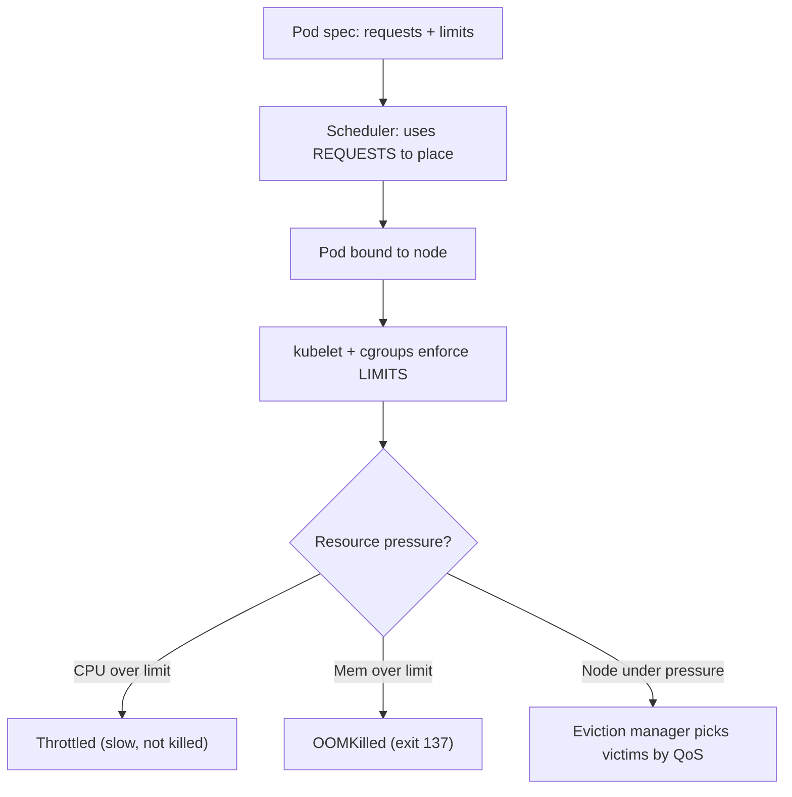
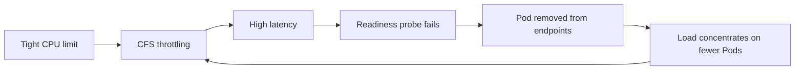

# Scheduling & Resources - Guide

> The other half of "why Kubernetes behaves like it's possessed." Networking explains "why can't I reach my Pod"; resources explain "why did my Pod randomly get slow or killed when nothing changed." Under the hood it's **Linux cgroups** + the scheduler + the kubelet eviction manager. We trace YAML → scheduler → kernel enforcement → node eviction, and how it plays out on **AWS EKS**.

See also: [02 - Scheduling & Resources Scenarios & SRE Ops](02%20-%20Scheduling%20%26%20Resources%20Scenarios%20%26%20SRE%20Ops.md) · [01 - Autoscaling Guide](01%20-%20Autoscaling%20Guide.md) · [01 - Workload Resilience Guide](01%20-%20Workload%20Resilience%20Guide.md) · [01 - Architecture Guide](01%20-%20Architecture%20Guide.md)

---

## Table of Contents

- [1. Requests vs Limits](#1-requests-vs-limits)
- [2. CPU vs Memory: Different Physics](#2-cpu-vs-memory-different-physics)
- [3. QoS Classes](#3-qos-classes)
- [4. How the Scheduler Places Pods](#4-how-the-scheduler-places-pods)
- [5. OOMKilled vs Evicted](#5-oomkilled-vs-evicted)
- [6. The Eviction Manager](#6-the-eviction-manager)
- [7. CPU Throttling: The Silent Killer](#7-cpu-throttling-the-silent-killer)
- [8. Scheduling Controls (affinity, taints, topology)](#8-scheduling-controls-affinity-taints-topology)
- [9. EKS Specifics](#9-eks-specifics)
- [10. Best Practices](#10-best-practices)

---



---

## 1. Requests vs Limits

Per container you set:

- **requests** - "I need at least this much." Used by the **scheduler** for placement math. A _reservation_.
- **limits** - "I may not exceed this." Enforced by **kubelet + kernel cgroups** at runtime. A _hard ceiling_.

> The scheduler packs Pods using **requests**; the runtime enforces **limits**. If you set neither, Kubernetes guesses your importance later - and it guesses in a way that tends to hurt (BestEffort, evicted first).

[⬆ Back to top](#table-of-contents)

---

## 2. CPU vs Memory: Different Physics

| Resource   | Compressible? | Over-limit result      | Symptom                                                     |
| :--------- | :------------ | :--------------------- | :---------------------------------------------------------- |
| **CPU**    | Yes           | **Throttled** (slowed) | Latency spikes, timeouts, "it's slow" while looking healthy |
| **Memory** | No            | **OOMKilled**          | Container restart, **exit code 137**, OOMKill event         |

This distinction is huge: CPU-limit mistakes cause _mysterious slowness_; memory-limit mistakes cause _sudden death and restarts_.

[⬆ Back to top](#table-of-contents)

---

## 3. QoS Classes

Kubernetes assigns each Pod a QoS class from its requests/limits - this drives **eviction order**:

| Class          | Condition                                                          | Eviction protection    |
| :------------- | :----------------------------------------------------------------- | :--------------------- |
| **Guaranteed** | Every container has `requests == limits` for _both_ CPU and memory | Highest                |
| **Burstable**  | Requests set, limits higher (or only some set)                     | Middle                 |
| **BestEffort** | No requests or limits at all                                       | Lowest - evicted first |

> When a node gets tight, QoS heavily influences who gets kicked out. A Burstable Pod using _far more_ than it requested is a prime target.

[⬆ Back to top](#table-of-contents)

---

## 4. How the Scheduler Places Pods

The scheduler compares node **allocatable** against the **sum of requests** (not limits):

```
Node: 4 CPU, 16Gi   Existing requests: 3 CPU, 12Gi
New Pod requests: 1 CPU, 2Gi  ->  fits!
```

**Overcommit trap:** if everyone sets tiny requests + huge limits, the scheduler packs Pods (requests fit) but at runtime they burst toward limits → node runs out of memory → eviction/OOM storms. That's the classic "it was fine until traffic hit."

[⬆ Back to top](#table-of-contents)

---

## 5. OOMKilled vs Evicted

They both look like "Pod died" but have different causes and fixes:

|        | **OOMKilled** (container-level)                      | **Evicted** (Pod-level)                                                                    |
| :----- | :--------------------------------------------------- | :----------------------------------------------------------------------------------------- |
| Cause  | Container exceeded its **memory limit**              | **Node** under resource pressure                                                           |
| Killer | Kernel OOM killer (inside cgroup)                    | kubelet eviction manager                                                                   |
| Clues  | `Reason: OOMKilled`, exit 137, restart count up      | `status: Evicted`, `MemoryPressure`/`DiskPressure` events                                  |
| Fix    | Raise mem limit, fix leak, realistic requests, scale | Add node capacity/autoscale, sane requests, cut ephemeral/log usage, limit noisy neighbors |

[⬆ Back to top](#table-of-contents)

---

## 6. The Eviction Manager

When a node is stressed (memory, disk, inodes), the kubelet evicts Pods to protect the node. Victim selection is influenced by:

- **QoS class** (BestEffort → Burstable → Guaranteed).
- **Pod priority** (`PriorityClass`).
- **Usage relative to requests** (especially Burstable over its request).
- Whether the Pod is **critical/system**.

> This is why **requests should reflect reality** - under pressure, Kubernetes treats your request as your "promised baseline" and punishes anyone exceeding it.

There are **soft** (grace period) and **hard** (immediate) eviction thresholds, plus `--system-reserved`/`--kube-reserved` carving out node resources for the OS and kubelet.

[⬆ Back to top](#table-of-contents)

---

## 7. CPU Throttling: The Silent Killer

Too-low CPU limit → container hits the cgroup CFS quota → throttled → latency rises → **probes start failing** → Pod removed from endpoints → traffic concentrates on fewer Pods → more throttling → meltdown:



Fixes: size CPU requests/limits from measured load; avoid overly tight limits on latency-sensitive services (some teams set CPU _requests_ but **no CPU limit** to avoid throttling - a deliberate trade-off); use HPA so the _count_ scales instead of squeezing each Pod.

[⬆ Back to top](#table-of-contents)

---

## 8. Scheduling Controls (affinity, taints, topology)

| Mechanism                         | Use                                                            |
| :-------------------------------- | :------------------------------------------------------------- |
| **nodeSelector / nodeAffinity**   | Pin/prefer nodes by label (e.g. `instance-type`, GPU)          |
| **podAffinity / podAntiAffinity** | Co-locate or spread relative to other Pods                     |
| **Taints & tolerations**          | Node _repels_ Pods unless they tolerate (e.g. GPU nodes, spot) |
| **topologySpreadConstraints**     | Even spread across AZs/nodes (HA)                              |
| **PriorityClass + preemption**    | High-priority Pods can evict lower-priority to schedule        |
| **Pod Topology / `topologyKey`**  | `topology.kubernetes.io/zone`, `kubernetes.io/hostname`        |

[⬆ Back to top](#table-of-contents)

---

## 9. EKS Specifics

- **Node allocatable < capacity**: EKS reserves CPU/memory for the kubelet, OS, and (with VPC CNI) the networking agent. The VPC CNI's `aws-node` and `kube-proxy` DaemonSets consume resources on every node - account for them.
- **Right-size instance types** to your Pod shapes; bin-packing a `c6i.large` with one 3Gi Pod wastes money. **Karpenter** can pick the cheapest instance that fits pending Pods (see [01 - Autoscaling Guide](01%20-%20Autoscaling%20Guide.md)).
- **Spot instances**: taint them and use tolerations + PDBs; treat interruptions as involuntary disruptions.
- **Ephemeral storage**: set `ephemeral-storage` requests/limits - chatty logs filling the node disk cause `DiskPressure` evictions; EKS nodes have finite EBS root volumes.
- **`topologySpreadConstraints` across `topology.kubernetes.io/zone`** is the EKS-native way to survive an AZ failure.

[⬆ Back to top](#table-of-contents)

---

## 10. Best Practices

- **Always set memory requests _and_ limits** (set them equal for critical workloads → Guaranteed QoS).
- **Set CPU requests; be cautious with tight CPU limits** on latency-sensitive paths (throttling). Measure first.
- **Make requests reflect real usage** (`kubectl top`, VPA recommendations) - protects you at eviction time and keeps the scheduler honest.
- **Avoid BestEffort for anything important** - it's first to die.
- **Use PriorityClass** for critical system/ingress/database Pods.
- **Reserve node resources** (`--system-reserved`, `--kube-reserved`) so the kubelet/OS never starve.
- **Spread across AZs** with `topologySpreadConstraints` and pair with PDBs.
- **Don't over-commit blindly** - model peak (limit) usage, not just requests, for memory.

[⬆ Back to top](#table-of-contents)

---

> Continue to [02 - Scheduling & Resources Scenarios & SRE Ops](02%20-%20Scheduling%20%26%20Resources%20Scenarios%20%26%20SRE%20Ops.md).
