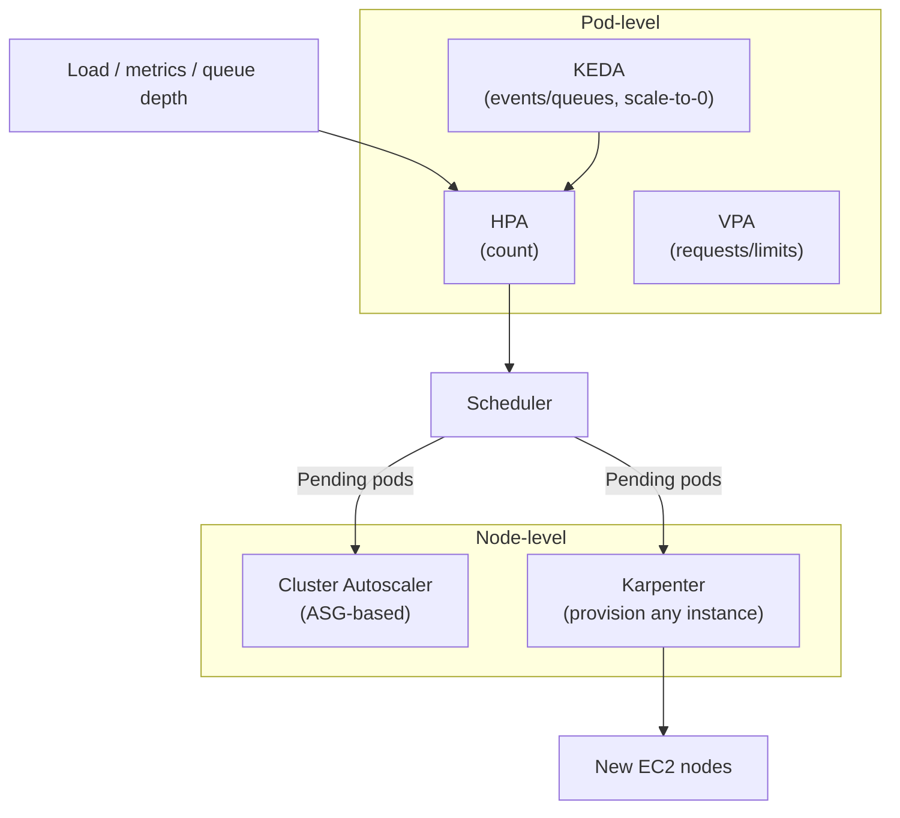
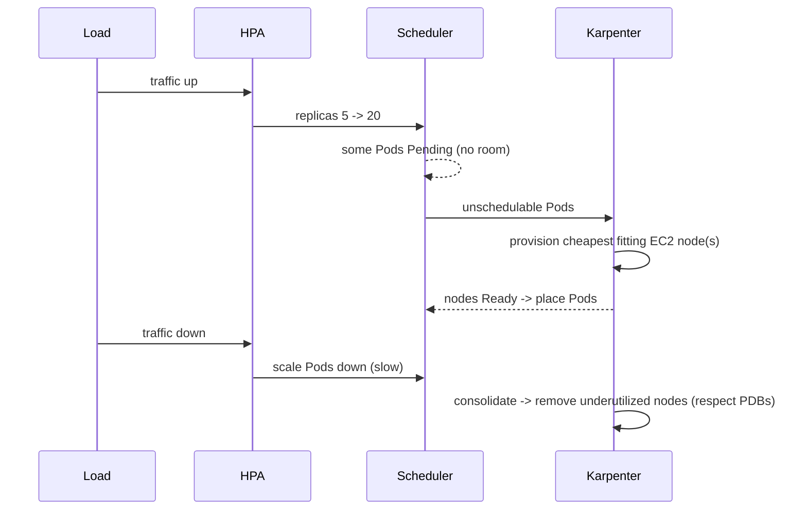

# Autoscaling - Guide

> Autoscaling is Kubernetes doing what it does best - "keep nudging the world toward a target" - except the target is _performance under load_ and the world now includes Nodes, not just Pods. The trap: multiple scalers with overlapping powers that wrestle in the mud if combined carelessly. Covers **HPA** (pods), **VPA** (resources), **Cluster Autoscaler / Karpenter** (nodes), **KEDA** (events), and the gotchas - all on **AWS EKS**.

See also: [02 - Autoscaling Scenarios & SRE Ops](02%20-%20Autoscaling%20Scenarios%20%26%20SRE%20Ops.md) · [01 - Scheduling & Resources Guide](01%20-%20Scheduling%20%26%20Resources%20Guide.md) · [01 - Workload Resilience Guide](01%20-%20Workload%20Resilience%20Guide.md) · [01 - LLM Inference Guide](01%20-%20LLM%20Inference%20Guide.md)

---

## Table of Contents

- [1. The Three (Four) Scalers](#1-the-three-four-scalers)
- [2. HPA: Scaling Pod Count](#2-hpa-scaling-pod-count)
- [3. metrics-server: the Fuel](#3-metrics-server-the-fuel)
- [4. The Biggest HPA Gotcha: CPU for IO-bound Apps](#4-the-biggest-hpa-gotcha-cpu-for-io-bound-apps)
- [5. Stabilization: No Yo-Yo Scaling](#5-stabilization-no-yo-yo-scaling)
- [6. VPA: Scaling Resources](#6-vpa-scaling-resources)
- [7. Node Autoscaling: Cluster Autoscaler vs Karpenter](#7-node-autoscaling-cluster-autoscaler-vs-karpenter)
- [8. KEDA: Event-driven & Scale-to-Zero](#8-keda-event-driven--scale-to-zero)
- [9. The Full Autoscaling Chain](#9-the-full-autoscaling-chain)
- [10. Best Practices](#10-best-practices)

---



---

## 1. The Three (Four) Scalers

| Scaler                             | Changes                          | Trigger                                    |
| :--------------------------------- | :------------------------------- | :----------------------------------------- |
| **HPA**                            | Pod **count** (`.spec.replicas`) | CPU / memory / custom metrics              |
| **VPA**                            | Pod **requests/limits**          | Observed usage over time                   |
| **Cluster Autoscaler / Karpenter** | **Node** count                   | Pending (unschedulable) Pods               |
| **KEDA**                           | Pod count (drives HPA)           | External events (queues, cron, Prometheus) |

> **The cardinal rule:** HPA scales _out_, VPA scales _up_, node autoscalers add _machines_. Combine deliberately - HPA-on-CPU + VPA-Auto-on-CPU will fight.

[⬆ Back to top](#table-of-contents)

---

## 2. HPA: Scaling Pod Count

HPA adjusts replicas on a Deployment/ReplicaSet/StatefulSet from metrics. The loop:

1. Read metrics (metrics-server or custom metrics API).
2. Compute desired: `desired = ceil(current × currentMetric / targetMetric)`.
3. Apply stabilization + min/max bounds.
4. Write the new replica count; controllers create/destroy Pods; scheduler places them.

> **Critical:** HPA CPU scaling uses **usage / request**, _not_ usage / limit. Set the CPU request too low → utilization looks high → over-scale (wasted money). Too high → under-scale (slow). The request is the denominator.

Knobs: `minReplicas`, `maxReplicas`, target thresholds, and `behavior` (stabilization windows, scale-up/down rate limits).

[⬆ Back to top](#table-of-contents)

---

## 3. metrics-server: the Fuel

HPA needs metrics. The simplest source is **metrics-server**, which scrapes kubelet summaries and serves the Metrics API. Common pain: it's missing/broken → HPA shows `<unknown>` and won't scale; or kubelet TLS issues. For **application metrics** (RPS, queue depth, latency) you need Prometheus + an adapter (**Prometheus Adapter** or **KEDA**). On EKS, metrics-server is a standard add-on.

[⬆ Back to top](#table-of-contents)

---

## 4. The Biggest HPA Gotcha: CPU for IO-bound Apps

CPU is a good "work" proxy **only if CPU is the bottleneck**. For IO-bound apps (DB/network waits), CPU stays low while latency is awful → HPA never scales → users suffer, dashboards lie.

Better targets:

- **Request rate per Pod (RPS)**
- **Queue depth** (Kafka lag, SQS visible messages) - KEDA territory
- **Concurrent requests / in-flight**
- p95 latency (careful: latency-driven loops can oscillate)

[⬆ Back to top](#table-of-contents)

---

## 5. Stabilization: No Yo-Yo Scaling

Without smoothing, HPA oscillates: spike → scale up → drop → scale down → spike. The `behavior` field tunes this - typically **fast scale-up, slow scale-down**:

```yaml
behavior:
  scaleUp:
    {
      stabilizationWindowSeconds: 0,
      policies: [{ type: Percent, value: 100, periodSeconds: 30 }],
    }
  scaleDown:
    {
      stabilizationWindowSeconds: 300,
      policies: [{ type: Percent, value: 10, periodSeconds: 60 }],
    }
```

Keep a sane `minReplicas` so you always have baseline capacity (avoid cold-start pain).

[⬆ Back to top](#table-of-contents)

---

## 6. VPA: Scaling Resources

VPA recommends/sets CPU/memory **requests** (and sometimes limits) from observed usage. Modes:

- **Off** - recommendations only (safe, very useful).
- **Initial** - set requests at Pod creation.
- **Auto** - evict/recreate Pods to apply new requests.

> **Big gotcha:** VPA and HPA conflict on CPU. HPA's utilization = usage/request; if VPA keeps changing the request, HPA's math shifts under its feet. **HPA-on-CPU + VPA-Auto-on-CPU = bad.** Safe combos: HPA on _custom metrics_ + VPA on CPU/mem; or VPA in _recommendation_ mode feeding manual tuning. VPA shines for **memory** tuning and **non-horizontally-scalable** workloads.

[⬆ Back to top](#table-of-contents)

---

## 7. Node Autoscaling: Cluster Autoscaler vs Karpenter

Both add nodes when Pods are Pending and remove underutilized nodes (respecting **PDBs**, DaemonSets, local storage, affinity). Scale-down = "drain lite" - the same blockers that hang `kubectl drain` block scale-down. See [01 - Workload Resilience Guide](01%20-%20Workload%20Resilience%20Guide.md).

|             | **Cluster Autoscaler**              | **Karpenter** (AWS-native)                                 |
| :---------- | :---------------------------------- | :--------------------------------------------------------- |
| Model       | Scales fixed **node groups** (ASGs) | Provisions **any instance type** that fits pending Pods    |
| Bin-packing | Limited to node-group shapes        | Picks cheapest fitting instance, consolidates aggressively |
| Speed       | Slower (ASG indirection)            | Faster (talks to EC2 Fleet directly)                       |
| Spot        | Per-ASG                             | First-class spot + on-demand mixing, interruption handling |
| Config      | One ASG per shape/AZ                | `NodePool` + `EC2NodeClass` CRDs                           |

> On EKS, **Karpenter** is now the recommended node autoscaler for most clusters: better bin-packing, instance flexibility, and cost via **consolidation** (it repacks Pods onto fewer/cheaper nodes).

**Classic node-autoscaler gotchas:** strict affinity/topology prevents rescheduling → scale-down never happens; a Pod too big for any instance type → Pending forever; PDB too strict → can't drain → no scale-down.

[⬆ Back to top](#table-of-contents)

---

## 8. KEDA: Event-driven & Scale-to-Zero

KEDA scales workloads on external signals - SQS/Kafka/RabbitMQ depth, Prometheus queries, cron - and can **scale to zero** cleanly for event-driven jobs/workers. It works by managing an HPA under the hood. For queue workers, KEDA-on-queue-depth beats CPU HPA almost every time.

[⬆ Back to top](#table-of-contents)

---

## 9. The Full Autoscaling Chain



If any link breaks (no metrics, Pods can't fit, PDB blocks drain), scaling looks "random."

[⬆ Back to top](#table-of-contents)

---

## 10. Best Practices

- **Stateless web APIs:** HPA on CPU _or_ (better) RPS/latency via custom metrics; sane `minReplicas`; Karpenter for nodes; PDB allowing ≥1 disruption; readiness probes so new Pods take traffic only when ready.
- **Queue workers:** KEDA on queue depth; scale-to-zero if acceptable; Karpenter for nodes.
- **Set requests from reality** - HPA-on-CPU math and node bin-packing both depend on accurate requests. Tiny requests → over-scale; huge requests → nothing schedules.
- **Don't pair HPA-CPU with VPA-Auto-CPU.** Pick one axis per resource.
- **Fast up, slow down** stabilization to avoid flapping.
- **Keep PDBs loose enough to drain** or node scale-down stalls (the #1 "we never scale down" cause).
- **Use Karpenter consolidation + spot** for cost, but taint spot and protect stateful/critical Pods.
- **Pre-scale for known spikes** (cron/KEDA) rather than reacting late.

[⬆ Back to top](#table-of-contents)

---

> Continue to [02 - Autoscaling Scenarios & SRE Ops](02%20-%20Autoscaling%20Scenarios%20%26%20SRE%20Ops.md).
